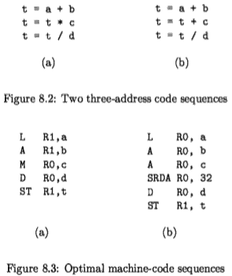
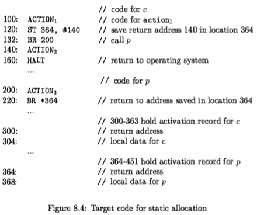
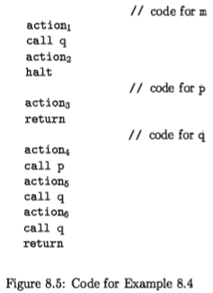
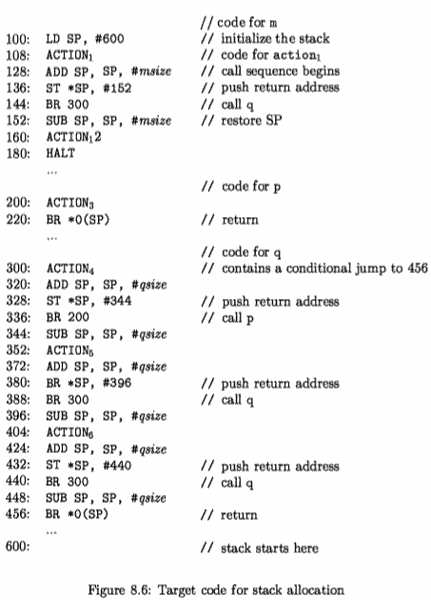
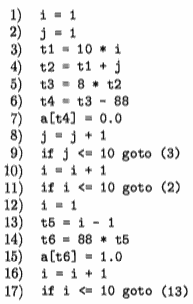
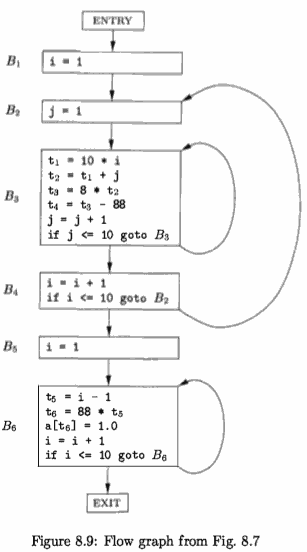

[](...menustart)

- [Chapter 8 : Code Generation](#830e73effc335657c8837f820d540d29)
    - [8.1 Issues in the Desjgn of a Code Generator](#5ff1fce12b9d8a95fd5edf15e993fcbf)
        - [8.1.1 Input to the Code Generator](#109887e516084b34d2dad7ecc5b5bc40)
        - [8.1.2 The Target Program](#10880c231144de03f241dd50ed847e89)
        - [8.1.3 Instruction Selection](#c07ebb13842b3d7df40404463e0d96e9)
        - [8.1.4 Register Allocation](#42a67b9586b929e789e5441b0b46b433)
        - [8.1.5 Evaluation Order](#37c2c790f0774513a8b2ce5189028ba1)
    - [8.2 The Target Language](#e62e84c1a57e7550603a734b7765510e)
        - [8.2.1 A Simple Target Machine Model](#c9b2afcb3e1b79afecbf6a464ffd634a)
        - [8.2.2 Program and Instruction Costs](#e495518feaac3d8e7e4b5882920d1d83)
    - [8.3 Addresses in the Target Code](#6d4d798ee603fff7b45373e0dd5c31dd)
        - [8.3.1 Static Allocation](#bda4c525efeeaf310fd933902ea0b7c1)
        - [8.3.2 Stack Allocation](#3ae25ae0f1fb53ecdb143a7fb20ad988)
        - [8.3.3 Run-Time Addresses for Names](#e01e13bc01c76ae3d6a93af6781a8d38)
    - [8.4 Basic Blocks and Flow Graphs](#2c3c856092398efb26997bf43f94919d)
        - [8.4.1 Basic Blocks](#5382830f44c8ab1f0f2d56fe8cf4ac65)
        - [8.4.2 Next-Use Information](#21d7d35b190002b687bfd4fbe96db30f)
        - [8.4.3 Flow Graphs](#2e0f84d0f92e1f49404739bec34b3dd2)
        - [8.4.4 Representation of Flow Graphs](#d9681c5961ade940b16db92265f07922)
        - [8.4.5 Loops](#57ba69ba8ce34a37752db17e8dc9e160)
    - [8.5 Optimization of Basic Blocks](#895e7d88eb5f9758b1bb9bcad8448f0d)
        - [8.5.1 The DAG Representation of Basic Blocks](#66e1b4db709e780933b28a758e46d599)
        - [8.5.2 Finding Local Common Subexpressions  (TODO)](#2ca093ee9b3646bbed3c5a7150480019)
    - [8.6 A Simple Code Generator](#3cac79754c1e27df5c39a1578a7df8a3)
        - [8.6.1 Register and Address Descriptors](#e2391a4ecbd6fee9999aecdd40eecb75)

[](...menuend)


<h2 id="830e73effc335657c8837f820d540d29"></h2>

# Chapter 8 : Code Generation

intermediate representation (IR)

The target pro­gram must preserve the semantic meaning of the source program and be of high quality; that is, it must make effective use of the available resources of the target machine. Moreover, the code generator itself must run efficiently.

The challenge is that, mathematically, the problem of generating an optimal target program for a given source program is undecidable; many of the subprob­lems encountered in code generation such as register allocation are computa­tionally intractable. In practice, we must be content with heuristic （启发式） techniques that generate good, but not necessarily optimal, code. Fortunately, heuristics have matured enough that a carefully designed code generator can produce code that is several times faster than code produced by a naive one.

Compilers that need to produce efficient target programs, include an op­timization phase prior to code generation. The optimizer maps the IR into IR from which more efficient code can be generated. In general, the code­ optimization and code-generation phases of a compiler, often referred to as the back end, may make multiple passes over the IR before generating the target program. Code optimization is discussed in detail in Chapter 9. The tech­niques presented in this chapter can be used whether or not an optimization phase occurs before code generation.

A code generator has three primary tasks: 

- instruction selection
- register allqcation and assignment
- instruction ordering

The importance of these tasks is outlined in Section 8.1. 

- Instruction selection involves choosing appro­priate target-machine instructions to implement the IR statements. 
- Register allocation and assignment involves deciding what values to keep in which reg­isters. 
- Instruction ordering involves deciding in what order to schedule the execution of instructions.

This chapter presents algorithms that code generators can use to trans­late the IR into a sequence of target language instructions for simple register machines. The algorithms will be illustrated by using the machine model in Sec­tion 8.2. Chapter 10 covers the problem of code generation for complex modern machines that support a great deal of parallelism within a single instruction.

After discussing the broad issues in the design of a code generator, we show what kind of target code a compiler needs to generate to support the abstrac­tions embodied in a typical source language. In Section 8.3, we outline imple­mentations of static and stack allocation of data areas, and show how names in the IR can be converted into addresses in the target code.

Many code generators partition IR instructions into "basic blocks," which consist of sequences of instructions that are always executed together. The partitioning of the IR into basic blocks is the subject of Section 8.4. The following section presents simple local transformations that can be used to transform basic blocks into modified basic blocks from which more efficient code can be generated. These transformations are a rudimentary form of code optimization, although the deeper theory of code optimization will not be taken up until Chapter 9. An example of a useful, local transformation is the discovery of common subexpressions at the level of intermediate code and the resultant replacement of arithmetic operations by simpler copy operations.

Section 8.6 presents a simple code-generation algorithm that generates code for each statement in turn, keeping operands in registers as long as possible. The output of this kind of code generator can be readily improved by peephole optimization techniques such as those discussed in the following Section 8.7.

The remaining sections explore instruction selection and register allocation.

---

<h2 id="5ff1fce12b9d8a95fd5edf15e993fcbf"></h2>

## 8.1 Issues in the Desjgn of a Code Generator

While the details are dependent on the specifics of the intermediate represen­tation, the target language, and the run-time system, tasks such as instruction selection, register allocation and assignment, and instruction ordering are en­countered in the design of almost all code generators.

The most important criterion for a code generator is that it produce cor­rect code. Correctness takes on special significance because of the number of special cases that a code generator might face. Given the premium on correct­ness, designing a code generator so it can be easily implemented, tested, and maintained is an important design goal.

---

<h2 id="109887e516084b34d2dad7ecc5b5bc40"></h2>

### 8.1.1 Input to the Code Generator

The input to the code generator is the intermediate representation of the source program produced by the front end, along with information in the symbol table that is used to determine the run-time addresses of the data objects denoted by the names in the IR.

The many choices for the IR include 

- three-address representations such as quadruples, triples, indirect triples; 
- virtual machine representations such as bytecodes and stack-machine code; 
- linear representations such as postfix no­tation; 
- and graphical representations such as syntax trees and DAG's. 

Many of the algorithms in this chapter are couched in terms of the representations considered in Chapter 6: three-address code, trees, and DAG's. 

The techniques we discuss can be applied, however, to the other intermediate representations as well.

In this chapter, we assume that the front end has scanned, parsed, and translated the source program into a relatively low-level IR, so that the values of the names appearing in the IR can be represented by quantities that the target machine can directly manipulate, such as integers and floating-point numbers. We also assume that all syntactic and static semantic errors have been detected, that the necessary type checking has taken place, and that type­ conversion operators have been inserted wherever necessary. The code generator can therefore proceed on the assumption that its input is free of these kinds of errors.

---

<h2 id="10880c231144de03f241dd50ed847e89"></h2>

### 8.1.2 The Target Program

The most common target-machine architectures are RISC (reduced instruction set computer), CISC (complex instruction set computer), and stack based.

A RISC machine typically has many registers, three-address instructions, simple addressing modes, and a relatively simple instruction-set architecture. 

In contrast, a CISC machine typically has few registers, two-address instruc­tions, a variety of addressing modes, several register classes, variable-length instructions, and instructions with side effects.

In a stack-based machine, operations are done by pushing operands onto a stack and then performing the operations on the operands at the top of the stack. To achieve high performance the top of the stack is typically kept in registers. Stack-based machines almost disappeared because it was felt that the stack organization was too limiting and required too many swap and copy operations.

However, stack-based architectures were revived with the introduction of the Java Virtual Machine (JVM) . The JVM is a software interpreter for Java bytecodes, an intermediate language produced by Java compilers. The interpreter provides software compatibility across multiple platforms, a major factor in the success of Java.

To overcome the high performance penalty of interpretation, which can be on the order of a factor of 10, just-in-time (JIT) Java compilers have been created. These JIT compilers translate bytecodes during runtime to the native hardware instruction set of the target machine. Another approach to improving Java performance is to build a compiler that compiles directly into the machine instructions of the target machine, bypassing the Java bytecodes entirely.

Producing an absolute machine-language program as output has the ad­vantage that it can be placed in a fixed location in memory and immediately executed. Programs can be compiled and executed quickly.

Producing a relocatable machine-language program (often called an object module) as output allows subprograms to be compiled separately. A set of relocatable object modules can be linked together and loaded for execution by a linking loader. Although we must pay the added expense of linking and loading if we produce relocatable object modules, we gain a great deal of flexibility in being able to compile subroutines separately and to call other previously compiled programs from an object module. If the target machine does not handle relocation automatically, the compiler must provide explicit relocation information to the loader to link the separately compiled program modules.

Producing an assembly-language program as output makes the process of code generation somewhat easier. We can generate symbolic instructions and use the macro facilities of the assembler to help generate code. The price paid is the assembly step after code generation.

In this chapter, we shall use a very simple RISC-like computer as our target machine. We add to it some CISC-like addressing modes so that we can also discuss code-generation techniques for CISC machines. For readability, we use assembly code as the target language . As long as addresses can be calculated from offsets and other information stored in the symbol table, the code gener­ator can produce relocatable or absolute addresses for names just as easily as symbolic addresses.

---

<h2 id="c07ebb13842b3d7df40404463e0d96e9"></h2>

### 8.1.3 Instruction Selection

                                                                                                                                                                                                                                                                                                                                                                                        
The code generator must map the IR program into a code sequence that can be executed by the target machine. The complexity of performing this mapping is determined by a factors such as

- the level of the IR
- the nature of the instruction-set architecture
- the desired quality of the generated code.

If the IR is high level, the code generator may translate each IR statement into a sequence of machine instructions using code templates. Such statement­-by-statement code generation, however, often produces poor code that needs further optimization. 

If the IR reflects some of the low-level details of the un­derlying machine, then the code generator can use this information to generate more efficient code sequences.

The nature of the instruction set of the target machine has a strong effect on the difficulty of instruction selection. For example, the uniformity and com­pleteness of the instruction set are important factors. If the target machine does not support each data type in a uniform manner, then each exception to the general rule requires special handling. On some machines, for example, floating-point operations are done using separate registers.

Instruction speeds and machine idioms are other important factors. If we do not care about the efficiency of the target program, instruction selection is straightforward. For each type of three-address statement, we can design a code skeleton that defines the target code to be generated for that construct. For example, every three-address statement of the form x = y + Z , where x, y, and Z are statically allocated, can be translated into the code sequence

```
LD  R0 , y       // R0 = y  (load y into register R0)
ADD R0 , R0 , z  // R0 = R0 + z  (ad z to R0)
ST  x , R0       // x = R0  (store R0 into x)
```

This strategy often produces redundant loads and stores. For example, the sequence of three-address statements

```
a = b + c
d = a + e
```

would be translated into

```
LD R0,b
ADD R0, R0, c 
ST a,R0

LD R0, a 
ADD R0, R0, e 
ST d, R0
```

Here, the fourth statement is redundant since it loads a value that has just been stored, and so is the third if a is not subsequently used.

The quality of the generated code is usually determined by its speed and size. On most machines, a given IR program can be implemented by many diffierent code sequences, with significant cost differences between the different implementations. A naive translation of the intermediate code may therefore lead to correct but unacceptably inefficient target code.

For example, if the target machine has an "increment" instruction (INC), then the three-address statement a = a + 1 may be implemented more efficiently by the single instruction `INC a`, rather than by a more obvious sequence that loads `a` into a register, adds one to the register, and then stores the result back into a.

We need to know instruction costs in order to design good code sequences but, unfortunately, accurate cost information is often difficult to obtain. De­ciding which machine-code sequence is best for a given three-address construct may also require knowledge about the context in which that construct appears.

In Section 8.9 we shall see that instruction selection can be modeled as a tree-pattern matching process in which we represent the IR and the machine instructions as trees. We then attempt to "tile" an IR tree with a set of sub­ trees that correspond to machine instructions. If we associate a cost with each machine-instruction subtree, we can use dynamic programming to generate op­timal code sequences. Dynamic programming is discussed in Section 8.11.


<h2 id="42a67b9586b929e789e5441b0b46b433"></h2>

### 8.1.4 Register Allocation

A key problem in code generation is deciding what values to hold in what registers. Registers are the fastest computational unit on the target machine, but we usually do not have enough of them to hold all values. Values not held in registers need to reside in memory. Instructions involving register operands are invariably shorter and faster than those involving operands in memory, so efficient utilization of registers is particularly important.

The use of registers is often subdivided into two subproblems:

 1. *Register allocation*, during which we select the set of variables that will reside in registers at each point in the program.
 2. *Register assignment*, during which we pick the specific register that a variable will reside in.

Finding an optimal assignment of registers to variables is difficult, even with single-register machines. Mathematically, the problem is NP-complete. The problem is further complicated because the hardware and/or the operating system of the target machine may require that certain register-usage conventions be observed.


Example 8.1 : Certain machines require *register-pairs* (an even and next odd­ numbered register) for some operands and results. For example, on some ma­chines, integer multiplication and integer division involve register pairs. The multiplication instruction is of the form

```
M  x , y
```

where x, the multiplicand, is the even register of an even/odd register pair and y, the multiplier, is the odd register. The product occupies the entire even/odd register pair. The division instruction is of the form

```
D  x , y 
```

where the dividend occupies an even/odd register pair whose even register is x; the divisor is y . After division, the even register holds the remainder and the odd register the quotient.

Now, consider the two three-address code sequences in Fig. 8.2 in which the only difference in (a) and (b) is the operator in the second statement. The shortest assembly-code sequences for (a) and (b) are given in Fig. 8.3.



Ri stands for register i. SRDA stands for Shift-Right-Double-Arithmetic and `SRDA R0 , 32` shifts the dividend into R1 and clears R0 so all bits equal its sign bit. `L`, `ST`, and `A` stand for load, store, and add, respectively. Note that the optimal choice for the register into which `a` is to be loaded depends on what will ultimately happen to `t`.

Strategies for register allocation and assignment are discussed in Section 8.8. Section 8.10 shows that for certain classes of machines we can construct code sequences that evaluate expressions using as few registers as possible. 


<h2 id="37c2c790f0774513a8b2ce5189028ba1"></h2>

### 8.1.5 Evaluation Order

The order in which computations are performed can affect the efficiency of the target code. As we shall see, some computation orders require fewer registers to hold intermediate results than others. However, picking a best order in the general case is a difficult NP-complete problem. Initially, we shall avoid the problem by generating code for the three-address statements in the order in which they have been produced by the intermediate code generator. In Chapter 10, we shall study code scheduling for pipelined machines that can execute several operations in a single clock cycle.

---

<h2 id="e62e84c1a57e7550603a734b7765510e"></h2>

## 8.2 The Target Language

Familiarity with the target machine and its instruction set is a prerequisite for designing a good code generator. Unfortunately, in a general discussion of code generation it is not possible to describe any target machine in sufficient detail to generate good code for a complete language on that machine. In this chapter, we shall use as a target language assembly code for a simple computer that is representative of many register machines. However, the code­-generation techniques presented in this chapter can be used on many other classes of machines as well.


<h2 id="c9b2afcb3e1b79afecbf6a464ffd634a"></h2>

### 8.2.1 A Simple Target Machine Model

Our target computer models a three-address machine with load and store oper­ations, computation operations, jump operations, and conditional jumps. 

The underlying computer is a byte-addressable machine with n general-purpose reg­isters, R0 , R1 , . . . , Rn - 1 . A full-fledged assembly language would have scores of instructions. To avoid hiding the concepts in a myriad of details, we shall use a very limited set of instructions and assume that all operands are integers. Most instructions consists of an operator, followed by a target, followed by a list of source operands. A label may precede an instruction. We assume the following kinds of instructions are available:

- *Load* operations: The instruction LD *dst*, *addr* loads the value in location *addr* into location *dst*. 
     - This instruction denotes the assignment `dst = addr`. The most common form of this instruction is `LD r, x` which loads the value in location x into register r. An instruction of the form LD r1 , r2 is a *register-to-register copy* in which the contents of register r2 are copied into register r1.
     - load 也可以 memory-to-memory 吗?
- *Store* operations: The instruction ST *x*, *r* stores the value in register r into the location x. 
     - This instruction denotes the assignment x = r.
- *Computation* operations of the form *OP dst, src1 , src2* , where *OP* is a op­erator like ADD or SUB, and *dst*, *src1* , and *src2* are locations, not necessarily distinct. 
     - The effect of this machine instruction is to apply the operation represented by OP to the values in locations src1 and src2, and place the result of this operation in location *dst*. 
     - For example, SUB r1 , r2 , r3 com­putes r1 = r2 - r3. Any value formerly stored in r1 is lost, but if r1 is r2 or r3, the old value is read first. 
     - Unary operators that take only one operand do not have a *src2* .
- *Unconditional jumps:* The instruction BR L cause control to branch to the manchine instruction with label *L* . (BR stands for *branch*)
- *Conditional jumps* of the form *Bcond r, L* , where *r* is a register, *L* is a label, and *cond* stands for any of the common tests on values in the register *r*. 
     - For example, `BLTZ r, L` causes a jump to label *L* if the value in register *r* is less than zero, and allows control to pass to the next machine instruction if not.


We assume our target machine has a variety of addressing modes:

- In instructions, a location can be a variable name *x* referring to the mem­ory location that is reserved for *x* (that is, the l-value of x).
- A location can also be an indexed address of the form a(r), where *a* is a variable and *r* is a register. 
     - The memory location denoted by a(r) is computed by taking the I=l-value of *a* and adding to it the value in register *r*. 
     - For example, the instruction LD R1, a(R2) has the effect of setting R1 = contents(a + contents(R2)), where contents(x) denotes the contents of the register or memory location represented by *x*. 
     - This addressing mode is useful for accessing arrays, where *a* is the base address of the array (that is, the address of the first element), and *r* holds the number of bytes past that address we wish to go to reach one of the elements of array *a*.
- A memory location can be an integer indexed by a register. 
     - For ex­ample, LD R1, 100(R2) has the effect of setting R1 = contents(100 + contents(R2)), that is, of loading into R1 the value in the memory loca­tion obtained by adding 100 to the contents of register R2. 
     - This feature is useful for following pointers, as we shall see in the example below.
- We also allow two indirect addressing modes: 
     - *\*r* means the memory lo­cation found in the location represented by the contents of register *r* , 
     - and *100(r) means the memory location found in the location obtained by adding 100 to the contents of *r*. 
         - For example, LD R1, *100(R2) has the effect of setting R1 = contents(contents(100 + contents(R2))), that is, of loading into R1 the value in the memory location stored in the memory location obtained by adding 100 to the contents of register R2.
- Finally, we allow an immediate constant addressing mode. The constant is prefixed by `#`. 
     - The instruction LD R1 , #100 loads the integer 100 into register R1, and ADD R1 , R1 , #100 adds the integer 100 into register R1.

Comments at the end of instructions are preceded by // .

Example 8.2 : The three-address statement x = y - z can be implemented by the machine instructions:


```
LD R1, y             // R1 = y
LD R2, z             // R2 = z
SUB R1, R1, R2         // R1 = R1 - R2
ST x,R1             // x = R1
```

We can do better, perhaps. One of the goals of a good code-generation algorithm is to avoid using all four of these instructions, whenever possible. For example, y and/or z may have been computed in a register, and if so we can avoid the LD step(s). Likewise, we might be able to avoid ever storing x if its value is used within the register set and is not subsequently needed.

Suppose *a* is an array whose elements are 8-byte values, perhaps real num­bers. Also assume elements of *a* are indexed starting at 0. We may execute the three-address instruction `b = a[i]` by the machine instructions:

```
LD  R1,i         // R1 = i
MUL R1, R1, 8     // R1 = R1 * 8
LD R2, a(R1)     // R2 = contents( a + contents(R1) )
ST b,R2         // b = R2
```

That is, the second step computes 8i, and the third step places in register R2 the value in the ith element of *a* - the one found in the location that is 8i bytes past the base address of the array *a*.

Similarly, the assignment into the array *a* represented by three-address in­ struction a[j] = c is implemented by:

```
LD R1, c         // R1 = c
LD R2, j         // R2 = j
MUL R2, R2, 8     // R2 = R2 * 8
ST a(R2) , R1     // contents( a + contents(R2) ) = R1
```

To implement a simple pointer indirection, such as the three-address state­ ment `x = *p`, we can use machine instructions like:

```
LD R1, p             // R1 = p
LD R2, O(R1)         // R2 = contents( 0 + contents(R1) )
ST x,R2             // x = R2
```

The assignment through a pointer `*p = y` is similarly implemented in machine code by:

```
LD R1, p         // R1 = p
LD R2, y         // R2 = y
ST O(R1), R2       // contents( 0 + contents(R1) ) = R2
```

Finally, consider a conditional-jump three-address instruction like `if x < y goto L` , the machine-code equivalent would be something like:

```
LD R1, x
LD R2, y
SUB R1, R1, R2  // R1 = R1 - R2 
BLTZ R1, M         // if R1 < 0  jump to M
```

Here, M is the label that represents the first machine instruction generated from thethree-address instruction that has label L . As for any three-address instruc­tion, we hope that we can save some of these machine instructions because the needed operands are already in registers or because the result need never be stored.

--- 

<h2 id="e495518feaac3d8e7e4b5882920d1d83"></h2>

### 8.2.2 Program and Instruction Costs

We often associate a cost with compiling and running a program. Depending on what aspect of a program we are interested in optimizing, some common cost measures are the length of compilation time and the size, running time and power consumption of the target program.

Determining the actual cost of compiling and running a program is a com­plex problem. Finding an optimal target program for a given source program is an undecidable problem in general, and many of the subproblems involved are NP-hard. As we have indicated, in code generation we must often be content with heuristic techniques that produce good but not necessarily optimal target programs.

For the remainder of this chapter, we shall assume each target-language instruction has an associated cost. For simplicity, we take the cost of an in­ struction to be one plus the costs associated with the addressing modes of the operands. This cost corresponds to the length in words of the instruction. Addressing modes involving registers have zero additional cost, while those in­ volving a memory location or constant in them have an additional cost of one, because such operands have to be stored in the words following the instruction. Some examples:

- The instruction LD R0 , R1 copies the contents of register R1 into register R0. 
     - This instruction has a cost of one because no additional memory words are required.
- The instruction LD R0 , M loads the contents of memory location M into register RO. 
     - The cost is two since the address of memory location M is in the word following the instruction.
- The instruction LD R1 , *100 (R2) loads into register R1 the value given by contents(contents(100 + contents(R2))). 
     - The cost is three because the constant 100 is stored in the word following the instruction.


In this chapter we assume the cost of a target-language program on a given input is the sum of costs of the individual instructions executed when the pro­gram is run on that input. Good code-generation algorithms seek to minimize the sum of the costs of the instructions executed by the generated target pro­gram on typical inputs. We shall see that in some situations we can actually generate optimal code for expressions on certain classes of register machines.

---

<h2 id="6d4d798ee603fff7b45373e0dd5c31dd"></h2>

## 8.3 Addresses in the Target Code

In this section, we show how names in the IR can be converted into addresses in the target code by looking at code generation for simple procedure calls and returns using static and stack allocation. In Section 7.1, we described how each executing program runs in its own logical address space that was partitioned into four code and data areas:

 1. A statically determined area *Code* that holds the executable target code. 
     - The size of the target code can be determined at compile time.
 2. A statically determined data area *Static* for holding global constants and other data generated by the compiler. 
     - The size of the global constants and compiler data can also be determined at compile time.
 3. A dynamically managed area *Heap* for holding data objects that are allocated and freed during program execution. 
     - The size of the Heap cannot be determined at compile time.
 4. A dynamically managed area *Stack* for holding activation records as they are created and destroyed during procedure calls and returns. 
     - Like the Heap, the size of the Stack cannot be determined at compile time.


---

<h2 id="bda4c525efeeaf310fd933902ea0b7c1"></h2>

### 8.3.1 Static Allocation

To illustrate code generation for simplified procedure calls and returns, we shall focus on the following three-address statements:

- call *calee*
- return
- halt
- action, which is a placeholder for other three-address statements.

The size and layout of activation records are determined by the code gener­ator via the information about names stored in the symbol table. We shall first illustrate how to store the return address in an activation record on a procedure call and how to return control to it after the procedure call. For convenience, we assume the first location in the activation holds the return address.

Let us first consider the code needed to implement the simplest case, static allocation. Here, a call *callee* statement in the intermediate code can be im­plemented by a sequence of two target-machine ihstructions

```
ST callee.staticArea , #here + 20
BR callee.codeArea
                        // <-  #here + 20  assumed ?
```

- The ST instruction saves the return address at the beginning of the activation record for *callee*, 
- and the BR transfers control to the target code for the called procedure *callee*. 

The attribute before callee.staticArea is a constant that gives the address of the beginning of the activation record for *callee*, and the attribute *callee*. codeArea is a constant referring to the address of the first instruction of the called procedure *callee* in the Code area of the run-time memory.

The operand #here + 20 in the ST instruction is the literal return address; it is the address of the instruction following the BR instruction. We assume that #here is the address of the current instruction and that the three constants plus the two instructions in the calling sequence have a length of 5 words or 20 bytes.

The code for a procedure ends with a return to the calling procedure, except that the first procedure has no caller, so its final instruction is HALT, which returns control to the operating system. A return *callee* statement can be implemented by a simple jump instruction

```
BR *callee.staticArea
```

which transfers control to the address saved at the beginning of the activation record for *callee*.

Example 8.3 : Suppose we have the following three-address code:

```
            // code for c
action1
call p
action2
halt
            // code for p
action3
return 
```


Figure 8.4 shows the target program for this three-address code. 



We use the pseudo instruction ACTION to represent the sequence of machine instructions to execute the statement action, which represents three-address code that is not relevant for this discussion. We arbitrarily start the code for procedure c at address 100 and for procedure p at address 200. We that assume each ACTION instruction takes 20 bytes. We further assume that the activation records for these procedures are statically allocated starting at locations 300 and 364; re­spectively.

The instructions starting at address 100 implement the statements `action1; call p; action2; halt` ofthe rstprocedurec.  

Execution therefore starts with the instruction ACTION1 at address 100. The ST instruction at address 120 saves the return address 140 in the machine-status field, which is the first word in the activation record of p. The BR instruction at address 132 transfers control the first instruction in the target code of the called procedure p.

After executing ACTION3, the jump instruction at location 220 is executed. Since location 140 was saved at address 364 by the call sequence above, *364 represents 140 when the BR statement at address 220 is executed. Therefore, when procedure p terminates, control returns to address 140 and execution of procedure c resumes. 


---

<h2 id="3ae25ae0f1fb53ecdb143a7fb20ad988"></h2>

### 8.3.2 Stack Allocation

Static allocation can become stack allocation by using relative addresses for storage in activation records. In stack allocation, however, the position of an activation record for a procedure is not known until runtime. This position is usually stored in a register, so words in the activation record can be accessed as offsets from the value in this register. The indexed address mode of our target machine is convenient for this purpose.

Relative addresses in an activation record can be taken as offsets from any known position in the activation record, as we saw in Chapter 7. For convenience, we shall use positive offsets by maintaining in a register SP a pointer to the beginning of the activation record on top of the stack. When a procedure call occurs, the calling procedure increments SP and transfers control to the called procedure. After control returns to the caller, we decrement SP, thereby deallocating the activation record of the called procedure.

The code for the first procedure initializes the stack by setting SP to the start of the stack area in memory:

```
LD SP , #stackStart // initialize the stack
code for the first procedure
HALT                 // terminate exection
```

A procedure call sequence increments SP, saves the return address, and transfers control to the called procedure:

```
ADD SP , SP , #caller.recordSize     // increment stack pointer
ST *SP , #here + 16                    // save return address
BR callee.codeArea                     // return to caller
```

The operand #caller.recordSize represents the size of an activation record, so the ADD instruction makes SP point to the next activation record. The operand #here + 16 in the ST instruction is the address of the instruction following BR; it is saved in the address pointed to by SP.

The return sequence consists of two parts. The called procedure transfers control to the return address using

```
BR *O (SP) // return to caller
```

The reason for using *0 (SP) in the BR instruction is that we need two levels of indirection: 0 (SP) is the address of the first word in the activation record and *O(SP) is the return address saved there.

The second part of the return sequence is in the caller, which decrements SP, thereby restoring SP to its previous value. That is, after the subtraction SP points to the beginning of the activation record of the caller:

```
SUB SP , SP , #caller.recordSize // decrement stack pointer
```

Chapter 7 contains a broader discussion of calling sequences and the trade­offs in the division of labor between the calling and called procedures.

Example 8.4 : The program in Fig. 8.5 is an abstraction of the quicksort program in the previous chapter. Procedure q is recursive, so more than one activation of q can be alive at the same time.



Suppose that the sizes of the activation records for procedures m , p, and q have been determined to be msize, psize, and qsize, respectively. The first word in each activation record will hold a return address. We arbitrarily assume that the code for these procedures starts at addresses 100, 200, and 300, respectively, and that the stack starts at address 600. The target program is shown in Figure 8.6.



We assume that ACTION4 contains a conditional jump to the address 456 of the return sequence from q; otherwise, the recursive procedure q is condemned to call itself forever.

if msize, psize, and qsize are 20, 40, and 60, respectively, the first instruction at address 100 initializes the SP to 600, the starting address of the stack. SP holds 620 just before control transfers from m to q, because msize is 20. Subsequently, when q calls p, the instruction at address 320 increments SP to 680, where the activation record for p begins; SP reverts to 620 after control returns to q. If the next two recursive calls of q return immediately, the maximum value of SP during this executioil 680. Note, however, that the last stack location used is 739, since the activation record of q starting at location 680 extends for 60 bytes.

---

<h2 id="e01e13bc01c76ae3d6a93af6781a8d38"></h2>

### 8.3.3 Run-Time Addresses for Names

The storage-allocation strategy and the layout of local data in an activation record for a procedure determine how the storage for names is accessed. In Chapter 6, we assumed that a name in a three-address statement is really a pointer to a symbol-table entry for that name. This approach has a significant advantage; it makes the compiler more portable, since the front end need not be changed even when the compiler is moved to a different machine where a different run-time organization is needed. On the other hand, generating the specific sequence of access steps while generating intermediate code can be of significant advantage in an optimizing compiler, since it lets the optimizer take advantage of details it would not see in the simple three-address statement.

In either case, names must eventually be replaced by code to access storage locations. We thus consider some elaborations of the simple three-address copy statement x = 0. After the declarations in a procedure are processed, suppose the symbol-table entry for x contains a relative address 12 for x. For consider the case in which x is in a statically allocated area beginning at address static. Then the actual run-time address of x is *static* + 12. Although the compiler can eventually determine the value of *static* + 12 at compile time, the position of the static area may not be known when intermediate code to access the name is generated. In that case, it makes sense to generate three-address code to "compute" *static* + 12, with the understanding that this computation will be carried out during the code generation phase, or possibly by the loader, before the program runs. The assignment x = 0 then translates into

```
static[12] = 0
```

If the static area starts at address 100, the target code for this statement is

```
LD 112 , #0
```

---

<h2 id="2c3c856092398efb26997bf43f94919d"></h2>

## 8.4 Basic Blocks and Flow Graphs

This section introduces a graph representation of intermediate code that is help­ful for discussing code generation even if the graph is not constructed explicitly by a code-generation algorithm. Code generation benefits from context. We can do a better job of register allocation if we know how values are defined and used, as we shall see in Section 8.8. We can do a better job of instruction selection by looking at sequences of three-address statements, as we shall see in Section 8.9.

The representation is constructed as follows:

 1. Partition the intermediate code into basic blocks, which are maximal se­quences of consecutive three-address instructions with the properties that
     - (a) The flow of control can only enter the basic block through the first instruction in the block. That is, there are no jumps into the middle of the block.
     - Control will leave the block without halting or branching, except possibly at the last instruction in the block.
 2. The basic blocks become the nodes of a flow graph, whose edges indicate which blocks can follow which other blocks.

Starting in Chapter 9, we discuss transformations on flow graphs that turn the original intermediate code into "optimized" intermediate code from which better target code can be generated. The "optimized" intermediate code is turned into machine code using the code-generation techniques in this chapter.

---

<h2 id="5382830f44c8ab1f0f2d56fe8cf4ac65"></h2>

### 8.4.1 Basic Blocks

Our first job is to partition a sequence of three-address instructions into basic blocks. We begin a new basic block with the first instruction and keep adding instructions until we meet either a jump, a conditional jump, or a label on the following instruction. In the absence of jumps and labels, control proceeds sequentially from one instruction to the next. This idea is formalized in the following algorithm.

Algorithm 8.5 : Partitioning three-address instructions into basic blocks.

- INPUT: A sequence of three-address instructions.
- OUTPUT: A list of the basic blocks for that sequence in which each instruction is assigned to exactly one basic block.
- METHOD : 
     - First, we determine those instructions in the intermediate code that are leaders, that is, the first instructions in some basic block. The instruction just past the end of the intermediate program is not included as a leader. The rules for finding leaders are:
         - 1. The first three-address instruction in the intermediate code is a leader.
         - 2. Any instruction that is the target of a conditional or unconditional jump is a leader.
         - 3. Any instruction that immediately follows a conditional or unconditional jump is a leader.
    - Then, for each leader, its basic block consists of itself and all instructions up to but not including the next leader or the end of the intermediate program. 


Example 8.6 : The intermediate code in Fig. 8.7 turns a 10 x 10 matrix a into an identity matrix. 




> Figure 8.7: Intermediate code to set a 10 x 10 matrix to an identity matrix

Although it is not important where this code comes from, it might be the translation of the pseudocode in Fig. 8.8. 

```java
for i from 1 to 10 do
    for j from 1 to 10 do
        a[i,j]= 0.0; 

for i from 1 to 10 do
    a[i,i]= 1.0;
```

> Figure 8.8: Source code for Fig. 8.7

In generating the intermediate code, we have assumed that the real-valued array elements take 8 bytes each, and that the matrix a is stored in row-major form.

First, instruction 1 is a leader by rule (1) of Algorithm 8.5. 

To find the other leaders, we first need to find the jumps. In this example, there are three jumps, all conditional, at instructions 9, 11, and 17. 

By rule (2), the targets of these jumps are leaders; they are instructions 3, 2, and 13, respectively. 

Then, by rule (3) , each instruction following a jump is a leader; those are instructions 10 and 12. 

Note that no instruction follows 17 in this code, but if there were code following, the 18th instruction would also be a leader.

We conclude that the leaders are instructions 1, 2, 3, 10, 12, and 13. The basic block of each leader contains all the instructions from itself until just before the next leader. Thus, the basic block of 1 is just 1, for leader 2 the block is just 2. Leader 3, however, has a basic block consisting of instructions 3 through 9, inclusive. Instruction 10's block is 10 and 11; instruction 12's block is just 12, and instruction 13's block is 13 through 17. 

---

<h2 id="21d7d35b190002b687bfd4fbe96db30f"></h2>

### 8.4.2 Next-Use Information

Knowing when the value of a variable will be used next is essential for generating good code. If the value of a variable that is currently in a register will never be referenced subsequently, then that register can be assigned to another variable.

The ＊use＊ of a name in a three-address statement is defined as follows. Suppose three-address statement *i* assigns a value to *x*.   statement *j* has x as an operand, and control can flow from statement *i* to *j* along a path that has no intervening assignments to *x*, then we say statement *j* uses the value of *x* computed at statement *i*. We further say that *x* is *live* at statement *i*.

We wish to determine for each three-address statement `x = y + z` what the next uses of *x*, *y*, and *z* are. For the present, we do not concern ourselves with uses outside the basic block containing this three-address statement.

Our algorithm to determine liveness and next-use information makes a back­ward pass over each basic block. We store the information in the symbol table. We can easily scan a stream of three-address statements to find the ends of ba­sic blocks as in Algorithm 8.5. Since procedures can have arbitrary side effects, we assume for convenience that each procedure call starts a new basic block.

Algorithm8.7: Determining the liveness and next-use information for each statement in a basic block.

- INPUT: A basic block B of three-address statements. We assume that the symbol table initially shows all nontemporary variables in B as being live on exit.
- OUTPUT: At each statement i: x = y + z in B, we attach to i the liveness and next-use information of x, y, and z .
- METHOD: We start at the last statement in B and scan backwards to the beginning of B. At each statement i: x = y + z in B, we do the following:
     - 1. Attach to statement i the information currently found in the symbol table regarding the next use and liveness of *x* , *y*, and *y* .
     - 2. In the symbol table, set *x* to "not live" and "no next use."
     - 3. In the symbol table, set *y* and *z* to "live" and the next uses of *y* and *z* to *i*.

Here we have used + as a symbol representing any operator. If the three-address statement i is of the form  x = +Y or x = y, the steps are the same as above, ignoring z. Note that the order of steps (2) and (3) may not be interchanged because x may be y or z.

---

<h2 id="2e0f84d0f92e1f49404739bec34b3dd2"></h2>

### 8.4.3 Flow Graphs

Once an intermediate-code program is partitioned into basic blocks, we repre­sent the flow of control between them by a flow graph. The nodes of the flow graph are the basic blocks. There is an edge from block B to block C if and only if it is possible for the first instruction in block C to immediately follow the last instruction in block B. There are two ways that such an edge could be justified:

- There is a conditional or unconditional jump from the end of B to the beginning of C.
- C immediately follows B in the original order of the three-address instruc­tions, and B does not end in an unconditional jump.

We say that B is a predecessor of C, and C is a successor of B.

Often we add two nodes, called the *entry* and *exit*, that do not correspond to executable intermediate instructions. 

- There is an edge from the *entry* to the first executable node of the flow graph, that is, to the basic block that comes from the first instruction of the intermediate code. 
     - entry -> 最先开始的代码块
- There is an edge to the *exit* from any basic block that contains an instruction that could be the last executed instruction of the program. 
     - 可能最后执行的代码块 -> exit 
     - If the final instruction of the program is not an unconditional jump, then the block containing the final instruction of the program is one predecessor of the *exit*, but so is any basic block that has a jump to code that is not part of the program.

Example 8.8 : The set of basic blocks constructed in Example 8.6 yields the flow graph of Fig. 8.9. 



The entry points to basic block B1 , since B1 contains the first instruction of the program. The only successor of B1 is B2 , because B1 does not end in an unconditional jump, and the leader of B2 immediately follows the end of B1 .

Block B3 has two successors. One is itself, because the leader of B3 , instruc­tion 3, is the target of the conditional jump at the end of B3 , instruction 9 . The other successor is B4 , because control can fall through the conditional jump at the end of B3 and next enter the leader of B4 .

Only B6 points to the exit of the flow graph, since the only way to get to code that follows the program from which we constructed the flow graph is to fall through the conditional jump that ends B6 .

---

<h2 id="d9681c5961ade940b16db92265f07922"></h2>

### 8.4.4 Representation of Flow Graphs

First, note from Fig. 8.9 that in the flow graph, it is normal to replace the jumps to instruction numbers or labels by jumps to basic blocks. Recall that every conditional or unconditional jump is to the leader of some basic block, and it is to this block that the jump will now refer. The reason for this change is that after constructing the flow graph, it is common to make substantial changes to the instructions in the various basic blocks. If jumps were to instructions, we would have to fix the targets of the jumps every time one of the target instructions was changed.

Flow graphs, being quite ordinary graphs, can be represented by any of the data structures appropriate for graphs. The content of nodes (basic blocks) need their own representation. We might represent the content of a node by a pointer to the leader in the array of three-address instructions, together with a count of the number of instructions or a second pointer to the last instruction. However, since we may be changing the number of instructions in a basic block frequently, it is likely to be more efficient to create a linked list of instructions for each basic block.

---

<h2 id="57ba69ba8ce34a37752db17e8dc9e160"></h2>

### 8.4.5 Loops

Programming-language constructs like while-statements, do-while-statements, andfor-statements naturally give rise to loops in programs. Since virtually every program spends most of its time in executing its loops, it is especially important for a compiler to generate good code for loops. Many code transformations depend upon the identification of "loops" in a flow graph. We say that a set of nodes L in a flow graph is a loop if

 1. There is a node in L called the loop *entry* with the property that no other node in L has a predecessor outside L. That is, every path from the entry of the entire flow graph to any node in L goes through the loop entry.
 2. Every node in L has a nonempty path, completely within L, to the entry of L.

Example 8.9 : The flow graph of Fig. 8.9 has three loops:

 1. B3 by itself.
 2. B6 by itself.
 3. {B2,B3,B4}

The first two are single nodes with an edge to the node itself. For instance, B3 forms a loop with B3 as its entry. Note that the second requirement for a loop is that there be a nonempty path from B3 to itself. Thus, a single node like B2, which does not have an edge B2 → B2, is not a loop, since there is no nonempty path from B2 to itself within { B2 } .

The third loop, L = {B2, B3, B4}, has B2 as its loop entry. Note that among these three nodes, only B2 has a predecessor, B1 , that is not in L.  Further, each of the three nodes has a nonempty path to B2 staying within L. For instance, B2 has the path B2 → B3 → B4 → B2.


---

<h2 id="895e7d88eb5f9758b1bb9bcad8448f0d"></h2>

## 8.5 Optimization of Basic Blocks

We can often obtain a substantial improvement in the running time of code merely by performing local optimization within each basic block by itself. More thorough global optimization, which looks at how information flows among the basic blocks of a program, is covered in later chapters, starting with Chapter 9. It is a complex subject, with many different techniques to consider.

---

<h2 id="66e1b4db709e780933b28a758e46d599"></h2>

### 8.5.1 The DAG Representation of Basic Blocks

Many important techniques for local optimization begin by transforming a basic block into a DAG (directed acyclic graph). In Section 6.1.1, we introduced the DAG as a representation for single expressions. The idea extends naturally to the collection of expressions that are created within one basic block. We construct a DAG for a basic block as follows:

 1. There is a node in the DAG for each of the initial values of the variables appearing in the basic block.
 2. There is a node *N* associated with each statement *s* within the block. The children of *N* are those nodes corresponding to statements that are the last definitions, prior to *s*, of the operands used by *s* .
 3. Node *N* i s labeled by the operator applied at *s* , and also attached to *N* is the list of variables for which it is the last definition within the block.
 4. Certain nodes are designated output nodes. These are the nodes whose variables are *live on exit* from the block; that is, their values may be used later, in another block of the flow graph. Calculation of these "live variables" is a matter for global flow analysis, discussed in Section 9.2.5.


The DAG representation of a basic block lets us perform several code­ improving transformations on the code represented by the block.

- a) We can eliminate local common subexpressions, that is, instructions that compute a value that has already been computed.
- b) We can eliminate dead code, that is, instructions that compute a value that is never used.
- c) We can reorder statements that do not depend on one another; such reordering may reduce the time a temporary value needs to be preserved in a register.
- d) We can apply algebraic laws to reorder operands of three-address instruc­tions, and sometimes thereby simplify the computation.

---

<h2 id="2ca093ee9b3646bbed3c5a7150480019"></h2>

### 8.5.2 Finding Local Common Subexpressions  (TODO)

TODO

---

<h2 id="3cac79754c1e27df5c39a1578a7df8a3"></h2>

## 8.6 A Simple Code Generator

In this section, we shall consider an algorithm that generates code for a single basic block. It considers each three-address instruction in turn, and keeps track of what values are in what registers so it can avoid generating unnecessary loads and stores.

One of the primary issues during code generation is deciding how to use registers to best advantage. There are four principal uses of registers:

- In most machine architectures, some or all of the operands of an operation must be in registers in order to perform the operation.
- Registers make good temporaries -- places to hold the result of a subex­pression while a larger expression is being evaluated, or more generally, a place to hold a variable that is used only within a single basic block.
- Registers are used to hold (global) values that are computed in one basic block and used in other blocks, for example, a loop index that is incre­mented going around the loop and is used several times within the loop.
- Registers are often used to help with run-time storage management, for example, to manage the run-time stack, including the maintenance of stack pointers and possibly the top elements of the stack itself.

These are competing needs, since the number of registers available is limited.

The algorithm in this section assumes that some set of registers is available to hold the values that are used within the block. Typically, this set of regis­ters does not include all the registers of the machine, since some registers are reserved for global variables and managing the stack. 

We assume that the basic block has already been transformed into a preferred sequence of three-address instructions, by transformations such as combining common subexpressions. We further assume that for each operator, there is exactly one machine instruc­tion that takes the necessary operands in registers and performs that operation, leaving the result in a register. The machine instructions are of the form

- LD reg, mem
- ST mem, reg
- OP reg, reg, reg

---

<h2 id="e2391a4ecbd6fee9999aecdd40eecb75"></h2>

### 8.6.1 Register and Address Descriptors


