[](...menustart)

- [A Simple Syntax-Directed Translator](#30a63c77c1af80be66640ae14eeb6ad5)
    - [2.1 Introduction](#af0cf6c4627b1e734c8a7fc86c534ac9)
    - [2.2 Syntax Definition](#49e3a75fe90809fc7abafbcfbc51fd7b)
        - [2.2.1 Definition of Grammars](#034fe90866337af0fbb672df1de0b66d)
        - [2.2.2 Derivations](#1050ffd6bfcbf072adafa71cd6bc7391)
        - [2.2.3 Parse trees (Concrete Syntax Tree)](#e270ca1319a8a19beaad53b4e3df5f0e)
        - [2.2.4 Ambiguity](#4ad96debb40880b43bd7d10f5554a448)
        - [2.2.5 Associativity of Operators](#711cb58dcac9926888c6efb7c422cb65)
        - [2.2.6 Precedence of Operators](#c8edab02a3dd9647a9c67a2f197f375d)
    - [2.3 Syntax-Directed translation](#99db435bf694af3e4470d2abbd602218)
        - [2.3.1 Postfix Notation](#7a041cb4d74009fe19e6d7fa75a6ccbe)
        - [2.3.2 Synthesized Attributes](#b7a3a963137495701696a042acfa2d64)
        - [2.3.3 Simple Syntax-Directed Definitions](#6de6204039ada6e7a2a4ffa51849e7b2)
        - [2.3.4 Tree Traversals](#5b8e21acbc1a41e26950d04eb4016a66)
        - [2.3.5 Translation Schemes](#5006a324c3c1dbb8238e2f7acc0db632)
    - [2.4 Parsing](#f4914c078fe8c7b18906652239ace52f)
        - [2.4.1 Top-Down Parsing](#f17ccb955a076df374b5842f7e7c8a7f)
        - [2.4.2 Predictive Parsing](#99a9f275f59362168c3615e281bca19a)
        - [2.4.3 When to Use ε-Productions](#c601306090856b08c316efc502d5c4a5)
        - [2.4.4 Designing a Predictive Parser](#66972cfc9c080d80ea54706369483340)
        - [2.4.5 Left Recursion](#4a2d5ee1151a64b791b34dc425b2d95e)
    - [2.5 A Translator for Simple Expressions](#dc36424ed69c3a7f569433fa185a4d31)
        - [2.5.1 Abstract and Concrete Syntax](#fe6d9d9777fded4d7cc0bea999b3490f)
        - [2.5.2 Adapting the Translation Scheme](#af23deae5c2b14d5574f5833d7540a17)
        - [2.5.3 Procedures for the Nonterminals](#01d4e2ca5af7ec1b23af29a3c6c8cedb)
        - [2.5.4 Simplifying the Translator](#d018fd5adc4547a6ad51aa356e41b6b0)
        - [2.5.5 The Complete Program](#1a1ea37b9c37e0e1025a499311325dfe)
    - [2.6 Lexical Analysis](#1124c548716947bf1d9af7327cd25a88)
        - [2.6.1 Removal of White Space and Comments](#4ffe382825aa482e44d922e6011d438e)
        - [2.6.2 Reading Ahead](#8e6167f7cfe35d955af94e9fd07a69c8)
        - [2.6.3 Constants](#eae3ef9a16e0a5126020316b892f2f8b)
        - [2.6.4 Recognizing Keywords and Identifiers](#1e169be343415b0e2313599ace15555c)
        - [2.6.5 A Lexical Analyzer](#bac8700bcbb6552788ffed034f760ceb)
    - [2.7 Symbol Tables](#434f55fe88fd25c8152d796e3570a9f3)
        - [2.7.1 Symbol Table Per Scope](#0b968b1c0e10984c774f810fa51a6f63)
        - [2.7.2 The Use of Symbol Tables](#fbc602841eaa84d8266b8cd68a9b0eca)
    - [2.8 Intermediate Code Generation](#34e5a4a6d3a58ed77921d67b06e25cb5)
        - [2.8.1 Two Kinds of Intermediate Representations](#66c733687afcb7c5eb00b1d5d1579e9b)
        - [2.8.2 Construction of Syntax Trees](#ae16ee3868feeaebf52a44b7030a9257)
            - [Syntax Trees for Statements](#a575ff09f5b0e915ba023178f4e8156b)
            - [Representing Blocks in Syntax Trees](#0e2d70ac0a5f7fe503cc3c18910291f3)
            - [Syntax  Trees for Expressions](#b0181a55a85e25b720ba8728cab22c31)
        - [2.8.3 Static Checking](#9d5cecdb99d5dae795be316ef310ad3b)
            - [L-values and R-values](#a226617c26f0efa2fab04802a7ecb968)
            - [Type Checking](#ef0b52f08f0934c7369102646a8a9f6d)
        - [2.8.4 Three-Address Code](#5c6ea36a95209bc29141acbedc432405)
            - [Three-Address Instructions](#58323055fdcda7a470037de00dc07353)
            - [Translation of Statements](#325e35ed8e9e36ec01949e91f99bec8c)
            - [Translation of Expressions](#1b4f954d64e096fe675d68b0988fa58a)
            - [Better Code for Expressions](#db95f2e74506a3daa31c97e26bf78cc6)

[](...menuend)


[龙书练习答案](https://github.com/fool2fish/dragon-book-exercise-answers)
[dragon-book exercise](http://dragon-book.jcf94.com/book/index.html)

<h2 id="30a63c77c1af80be66640ae14eeb6ad5"></h2>

# A Simple Syntax-Directed Translator

This chapter is an introduction to the compiling techniques in Chapters 3 through 6 of this book

- We start small by creating a syntax-directed translator that maps infix arith­metic expressions into postfix expressions. 
- We then extend this translator to map code fragments as shown in Fig. 2.1 into three-address code of the form in Fig. 2.2.


```java
{
    int i; int j; float[100] a; float v; float x;
    while ( true ) {
        do i = i+1;  while ( a[i] < v );
        do j = j-1;  while ( a[j] > v ); 
        if ( i >= j ) break;
        x = a[i]; a[i] = a[j]; a[j] = x ;
    } 
}
```

Figure 2.1: A code fragment to be translated


```
 1: i = i + 1
 2: t1 = a [ i ]
 3: if t1 < v goto 1
 4: j = j - 1
 5: t2 = a [ j ]
 6: if t2 > v goto 4
 7: ifFalse i >= j goto 9
 8: goto 14
 9: x = a [ i ]
10: t3 = a [ j ]
11: a [ i ] = t3
12: a [ i ] = x
13: goto 1
14:
```

Figure 2.2: Simplified intermediate code 


<h2 id="af0cf6c4627b1e734c8a7fc86c534ac9"></h2>

## 2.1 Introduction

For review:

- The analysis phase of a compiler breaks up a source program into constituent pieces and produces an internal representation for it
     - that representation called *intermediate code*. 
     - Analysis is organized around the "syntax"
     - The ***syntax*** of a programming language describes the proper form of its pro­grams
         - context-free grammar can be used to help guide the translation of programs
     - while the ***semantics*** of the language defines what its programs mean
- The synthesis phase translates the intermediate code into the target program.


For simplicity, we consider the syntax-directed translation of infix expressions to postfix form, a notation in which operators appear after their operands. 

For example, the postfix form of the expression `9 - 5 + 2` is `95 - 2+`. 

Translation into postfix form is rich enough to illustrate syntax analysis, yet simple enough. 


Figure 2.3: A model of a compiler front end

- A lexical analyzer allows a translator to handle multicharacter constructs like identifiers , but are treated as units called tokens during syntax analysis
- Next, we consider intermediate-code generation
     - two forms of intermedi­ate code :
         - 1- *abstract syntax trees* or simply *syntax trees*
             - 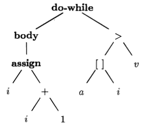
             - represents the hierarchical syntactic structure of the source program
             - syntax trees is further translated into three-address code
         - 2-  "three-address" instructions
             - 
             - instructions form:  x = y **op** z
                 - **op** is a binary operator
                 - y and z the are addresses for the operands
                 - x is the address for the result of the operation
             - a three­ address instruction carries out at most one operation, typically a computation, a comparison, or a branch.    


<h2 id="49e3a75fe90809fc7abafbcfbc51fd7b"></h2>

## 2.2 Syntax Definition

- We introduce a notation - the "context-free grammar," or "grammar" for short 
    - used to specify the syntax of a language. 
    - A grammar naturally describes the hierarchical structure of most program­ming language constructs. 
    - For example, an if-else statement in Java can have the form
        - `if ( expression ) statement else statement`
    - using the variable expr to denote an expres­sion and the variable stmt to denote a statement, this structuring rule can be expressed as
        - `stmt → if ( expr ) stmt else stmt`
        - Such a rule is called a ***production***
            - in which the arrow may be read as "can have the form."
            - lexical elements like the keyword if and the paren­theses are called ***terminals***
            - Variables like expr and stmt represent *sequences of terminals* and are called ***nonterminals***.

<h2 id="034fe90866337af0fbb672df1de0b66d"></h2>

### 2.2.1 Definition of Grammars

Tokens is often terminal.

- In a compiler, the lexical analyzer reads the characters of the source pro­gram, groups them into lexically meaningful units called *lexemes*, and pro­duces as output tokens representing these lexemes. 
- A token consists of two components, a token name and an attribute value. 
     - The token names are abstract symbols that are used by the parser for syntax analysis. 
         - Often, we shall call these token names ***terminals***, since they appear as terminal symbols in the grammar for a programming language. 
     - The attribute value, if present, is a pointer to the symbol table that contains additional infor­mation about the token. 
         - This additional information is not part of the grammar, so in our discussion of syntax analysis, often we refer to tokens and terminals synonymously.


A context-free grammar has four components:

 1. A set of ***terminal*** symbols, sometimes referred to as "tokens." 
     - The terminal are the elementary symbols of the language defined by the grammar.
 2. A set of ***nonterminals***, sometimes called "syntactic variables." 
     - Each non­terminal represents a set of strings of terminals
 3. A set of ***productions*** , each *production* consists of :
     - a nonterminal, called the *head* or *lefe side* of the production, 
     - an arrow, 
     - and a sequence of terminals and/or nonterminals, called the *body* or *right side* of the produc­tion. 
     - The intuitive intent of a production is to specify one of the written forms of a construct; 
         - if the head nonterminal represents a construct, 
         - then the body represents a written form of the construct.
 4. A designation of one of the nonterminals as the *start* symbol.


We specify grammars by listing their productions

- with the productions for the start symbol listed first
- We assume that digits, signs such as < and <=, and boldface strings such as **while** are terminals
- and any nonitalicized name or symbol may be assumed to be a terminal.
- For notational convenience, productions with the ***same nonterminal*** as the head can have their bodies grouped
     - with the alternative bodies separated by the symbol "|" , which we read as "or."

Example 2.1 : lists of digits separated by plus or minus signs

```java
list → list + digit         (2.1)
list → list - digit         (2.2)
list → digit                  (2.3)
digit → 0|1|2|3|4|5|6|7|8|9        (2.4)    
```

The first 3 productions with nonterminal *list* as head , equivalently can be grouped:

```java
list → list + digit | list - digit |  digit
```

According to our conventions, the terminals of the grammar are the symbols: `+ - 1 2 3 4 5 6 7 8 9` ,

The nonterminals are the italicized names *list* and *digit*, with *list* being the start symbol because *its productions are given first*. 

We say a production is *for* a nonterminal if the nonterminal is the head of the production. A string of terminals is a sequence of zero or more terminals. The string of zero terminals, written as `ε`, is called the *empty* string.

<h2 id="1050ffd6bfcbf072adafa71cd6bc7391"></h2>

### 2.2.2 Derivations

- A grammar derives strings by beginning with the start symbol 
- and repeatedly replacing a nonterminal by the body of a production for that nonterminal. 
- The terminal strings , that can be derived from the start symbol,  ***form*** the *language* which defined by the grammar.

For example 2.2 , we can use grammars 2.1 to deduce that 9-5+2 is a list as follows.

- a) 9 is a list by production (2.3), since 9 is a digit.
- b) 9-5 is a list by production (2.2), since 9 is a list and 5 is a digit.
- c) 9-5+2 is a list by production (2.1), since 9-5 is a list and 2 is a digit.


Example 2.3  function call , may have 0,1,2 parameters

```java
    call → id ( optparams ) 
optparams → params | ε
   params → params , param | param
```

We have not shown the productions for *param*, since parameters are really arbitrary expressions. Shortly, we shall discuss the appropriate productions for the various language constructs, such as expressions, statements, and so on.

- *Parsing* is the problem of taking a string of terminals and figuring out how to derive it from the start symbol of the grammar, 
- and if it cannot be derived from the start symbol of the grammar, then reporting syntax errors within the string. 
- Parsing is one of the most fundamental problems in all of compiling; 
     - In this chapter, for simplicity, we begin with source programs like 9-5+2 in which each character is a terminal; 
- in general, a source program has multicharacter lexemes that are grouped by the lexical analyzer into tokens, whose first components are the terminals processed by the parser.

<h2 id="e270ca1319a8a19beaad53b4e3df5f0e"></h2>

### 2.2.3 Parse trees (Concrete Syntax Tree)

- A parse tree pictorially shows how the start symbol of a grammar derives a string in the language. 
- If nonterminal A has a production A → XYZ, then a parse tree may have an interior node labeled A with three children labeled X, Y, and Z, from left to right:
     - 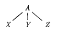
- Formally, given a context-free grammar, a parse tree according to the gram­mar is a tree with the following properties:
     - The root is labeled by the start symbol
     - Each leaf is labeled by a terminal or by ε.
     - Each interior node is labeled by a nonterminal.
     - If A is the nonterminal labeling some interior node and X₁ , X₂ , ... , Xn are the labels of the children of that node from left to right, then there must be a production A → X₁X₂...Xn. Here, X₁,X2,... ,Xn each stand for a symbol that is either a terminal or a nonterminal. 


Example 2.4 : The derivation of 9-5+2 in Example 2.2 is illustrated by the tree in Fig. 2.5.

- Parse tree for 9-5+2 according to the grammar in Example 2.1
- 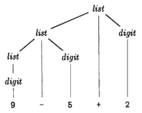
     - Each node in the tree is labeled by a *grammar symbol*
     - An interior node and its children correspond to a *production*
         - the interior node corresponds to the head of the production
         - the children to the body
- from left to right, the leaves form the *yield* of the tree
     - which is the string *generated* or *derived* from the nonterminal at the root of the parse tree
     - in this example , the yield is 9-5+2
- Any tree imparts a natural *left-to-right* order to its leaves

Another definition of the language (generated by a grammar) is as the ***set of strings*** that can be generated by some parse tree. 

The process of finding a parse tree for a given string of terminals is called ***parsing*** that string.

<h2 id="4ad96debb40880b43bd7d10f5554a448"></h2>

### 2.2.4 Ambiguity

A grammar can have more than one parse tree generating a given string of terminals. Such a grammar is said to be *ambiguous*.

Since a string with more than one parse tree usually has more than one meaning, we need to design unambiguous grammars for compiling applications, or to use ambiguous grammars with additional rules to resolve the ambiguities.

Example 2.5 : Suppose we used a single nontertninal ***string*** and did not dis­tinguish between *digits* and *lists* , as in Example 2.1 , We could have written the grammar:

```java
string → string + string | string - string | 0|1|2|3|4|5|6|7|8|9
```

Merging the notion of *digit* and *list* into the nonterminal *string* makes superficial sense, because a single *digit* is a special case of a *list*.

- 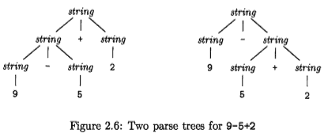
- The two trees for 9-5+2 correspond to the two ways of parenthesizing the expression: (9-5) +2 and 9- (5+2)
- This second parenthesization gives the expression the unexpected value 2 rather than the customary value 6.

<h2 id="711cb58dcac9926888c6efb7c422cb65"></h2>

### 2.2.5 Associativity of Operators

- 9+5+2 is equivalent to (9+5)+2 and 9-5-2 is equivalent to (9-5)-2.
- When an operand like 5 has operators to its left and right, con­ventions are needed for deciding which operator applies to that operand
- We say that the operator + *associates* to the left
     - because an operand with plus signs on both sides of it, belongs to the operator to its left
- In most programming languages the four arithmetic operators, addition, subtraction, multiplication, and division are *left-associative*.
- Some common operators such as exponentiation are *right-associative*.
- As another example, the assignment operator = in C and its descendants is right­ associative
     - that is, the expression a=b=c is treated in the same way as the expression a=(b=c)

Strings like a=b=c with a right-associative operator are generated by the following grammar:

```java
right → letter = right | letter
letter → a | b | ... | z
```

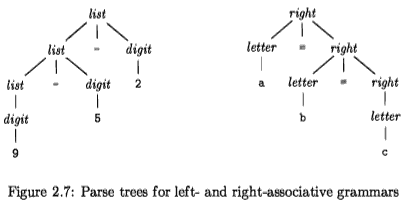

Note that the parse tree for 9-5-2 grows down towards the left, whereas the parse tree for a=b=c grows down towards the right.

- for `list → list + digit` , 自身迭代 + 左边的 grammar symbol , 意味着 + 是左结合
- for `right → letter = right` , 自身迭代 = 右边的 grammar symbol , 意味着 = 是右结合

<h2 id="c8edab02a3dd9647a9c67a2f197f375d"></h2>

### 2.2.6 Precedence of Operators

Consider the expression 9+5 * 2. There are two possible interpretations of this expression: (9+5) * 2 or 9+(5 * 2). The associativity rules for + and * apply to occurrences of the same operator, so they do not resolve this ambiguity. Rules defining the relative precedence of operators are needed when more than one kind of operator is present.

We say that * has *higher* precedence than + if * takes its operands before + does. In ordinary arithmetic, multiplication and division have higher precedence than addition and subtraction. 


Example 2.6 : A grammar for arithmetic expressions can be constructed from a *table* showing the associativity and precedence of operators. We start with the four common arithmetic operators and a precedence table, showing the operators in order of *increasing precedence*.

- Operators on the same line have the same associativity and precedence:

```java
left-associative: + ­-
left-associative: * /
```

- We create two nonterminals *expr* and *term* for the two levels of precedence
     - expr for + , -
     - term for * , / 
- and an extra nonterminal *factor* for generating basic units in expressions. 
     - The basic units in expressions are presently *digits* and *parenthesized* expressions. (目前只考虑 数字和括号)
     

```java
factor → digit | ( expr )
```

- Now consider the binary operators, * and /, that have the highest prece­dence. Since these operators associate to the left, the productions are similar to those for lists that associate to the left.

```java
term → term * factor 
     | term / factor
     | factor
```

- Similarly, *expr* generates lists of terms separated by the additive operators.

```java
expr → expr + term 
     | expr - term
     | term
```

- The resulting grammar is therefore

```java
expr → expr + term  | expr - term | term
term → term * factor | term / factor | factor
factor → digit | ( expr )
```

Generalizing the Expression Grammar:

- we can think of a *factor* as an expression that cannot be "torn apart" by any operator. If the factor is a parenthesized expression, the parentheses protect against such "tearing", while if the factor is a single operand, it cannot be torn apart.
- A *term* is an expression that can be torn apart by operators of the highest precedence: * and / , **but not by the lower-precedence operators**.
- An *expression* can be torn apart by any operator.
- We can generalize this idea to any number **n** of precedence levels. We need **n+1** nonterminals. 
     - The first,like *factor* in Example 2.6, can never be torn apart. 
         - Typically, the production bodies for this nonterminal (*factor*) are only single operands and parenthesized expressions. 
     - Then, for each precedence level, there is one nonterminal representing expressions that can be torn apart only by operators ***at that level or higher***. 
         - Typically, the productions for this nonterminal have bodies representing: 
             - uses of the ***operators at that level***, 
             - \+  one body that is just ***the nonterminal for the next higher level*** .


With this grammar ,

- an expression is a list of terms separated by either + or - signs, 
- and a term is a list of factors separated by * or / signs. 
- *Notice that any parenthesized expression is a factor*, so with parentheses we can develop expressions that have *arbitrarily deep nesting* (and arbitrarily deep trees) .


Example 2.7: Keywords allow us to recognize statements(语句), since most state­ment begin with a keyword or a special character. Exceptions to this rule include assignments and procedure calls. The statements defined by the (ambiguous) grammar in Fig 2.8 are legal in Java.

```java
stmt → id = expression ;
     | if ( expression ) stmt
     | if ( expression ) stmt else stmt 
     | while ( expression ) stmt
     | do stmt while ( expression ) ;
     | { stmts }
stmts → stmts stmt
     | ε
```

Figure 2.8: A grammar for a subset of Java statements

In the first production for *stmt*, the terminal **id** represents any identifier. The productions for *expression* are not shown. The assignment statements specified by the first production are legal in Java, although Java treats = as an assignment operator that can appear within an expression. For example, Java allows a = b = c, which this grammar does not.

The nonterminal *stmts* generates a possibly empty list of statements. The second production for *stmts* generates the empty list ε . The first production generates a possibly empty list of statements followed by a statement.

The placement of semicolons is subtle; they appear at the end of every body that does not end in *stmt*. This approach prevents the build-up of semicolons after statements such as if- and while-, which end with nested substatements. When the nested substatement is an assignment or a do-while, a semicolon will be generated as part of the substatement.


<h2 id="99db435bf694af3e4470d2abbd602218"></h2>

## 2.3 Syntax-Directed translation

Syntax-directed translation is done by attaching rules or program fragments to productions in a grammar. 

For example, consider an expression *expr* generated by the production

```java
expr → expr₁ + term
```

Here, *expr* is the sum of the two subexpressions *expr₁* and *term*. (The subscript in *expr₁* is used only to distinguish the instance of *expr* in the production body from the head of the production). We can translate *expr* by exploiting its structure, as in the following pseudo-code:

```java
translate expr₁; 
translate term; 
handle +;
```

Using a variant of this pseudocode, we shall 

- build a syntax tree for *expr*  by building syntax trees for *expr₁* and *term* 
- and then handling + by constructing a node for it. 

For convenience, the example in this section is the *translation of infix expressions into postfix notation*.

This section introduces two concepts related to syntax-directed translation:

- ***Attributes***
     - An *attribute* is any quantity associated with a programming construct. 
     - Examples of attributes are data types of expressions, the num­ber of instructions in the generated code, or the location of the first in­struction in the generated code for a construct, among many other pos­sibilities. 
     - Since we use grammar symbols (nonterminals and terminals) to represent programming constructs, we extend the notion of attributes from constructs to the symbols that represent them.
- ***(Syntax-directed) translation schemes***. 
     - A *translation scheme* is a notation for attaching program fragments to the productions of a grammar. 
     - The program fragments are executed when the production is used during syn­tax analysis. 
     - The combined result of all these fragment executions, in the order induced by the syntax analysis, produces the translation of the program to which this analysis/synthesis process is applied.

Syntax-directed translations will be used throughout this chapter to trans­late infix expressions into postfix notation, to evaluate expressions, and to build syntax trees for programming constructs. A more detailed discussion of syntax­ directed formalisms appears in Chapter 5.


<h2 id="7a041cb4d74009fe19e6d7fa75a6ccbe"></h2>

### 2.3.1 Postfix Notation

The examples in this section deal with translation into *postfix notation*. The *postfix notation* for an expression *E* can be defined inductively as follows:

 1. If E is a variable or constant, then the postfix notation for E is E itself.
 2. If E is an expression of the form E₁ ***op*** E₂, where ***op*** is any binary operator, then the postfix notation for E is ***E₁' E₂' op***, where E₁' and E₂' are the postfix notations for E₁ and E₂ , respectively.
 3. If E is a parenthesized expression of the form (E₁), then the postfix notation for E is the same as the postfix notation for E₁ .
     - that is, 先把 括号中的 表达式转为 postfix , 然后 去掉括号即可


Example 2.8 : The postfix notation for (9-5) +2 is 95-2+. 

- That is, the trans­lations of 9, 5, and 2 are the constants themselves, by rule (1). 
- Then, the translation of 9-5 is 95- by rule (2). The translation of (9-5) is the same by rule (3). 
- Having translated the parenthesized subexpression, we may apply rule (2) to the entire expression, with (9-5) in the role of E₁ and 2 in the role of E₂, to get the result 95-2+.

As another example, the postfix notation for 9- (5+2) is 952+-. That is, 5+2 is first translated into 52+, and this expression becomes the second argument of the minus sign.

***No parentheses are needed in postfix notation***, because the position and ***arity*** (number of arguments) of the operators permits only one decoding of a postfix expression. The "trick" is to repeatedly scan the postfix string from the left, until you find an operator. Then, look to the left for the proper number of operands, and group this operator with its operands. Evaluate the operator on the operands, and replace them by the result. Then repeat the process, continuing to the right and searching for another operator.


Example 2.9 : Consider the postfix expression 952+-3\*. 

Scanning from the left, we first encounter the plus sign. Looking to its left we find operands 5 and 2. Their sum, 7, replaces 52+, and we have the string 97-3\*. Now, the leftmost operator is the minus sign, and its operands are 9 and 7. Replacing these by the result of the subtraction leaves 23\*. Last, the multiplication sign applies to 2 and 3, giving the result 6.  


<h2 id="b7a3a963137495701696a042acfa2d64"></h2>

### 2.3.2 Synthesized Attributes

The idea of associating quantities with programming constructs -for example, values and types with expressions- can be expressed in terms of grammars. 

- We associate attributes with ***nonterminals and terminals***. 
- Then, we attach rules to the ***productions*** of the grammar; 
     - these rules describe how the attributes are computed at those nodes of the parse tree where the production in question is used to relate a node to its children.

A *syntax-directed definition* associates

 1. With each grammar symbol, a set of attributes, and
 2. With each production, a set of *semantic rules* for computing the values of the attributes associated with the symbols appearing in the production

Attributes can be evaluated as follows. 

- For a given input string x, construct a parse tree for x. 
- Then, apply the semantic rules to evaluate attributes at each node in the parse tree, as follows.

Suppose a node N in a parse tree is labeled by the grammar symbol X . 

- We write X.a to denote the value of attribute a of X at that node. 
- A parse tree showing the attribute values at each node is called an *annotated parse tree*. 

 For example, Fig. 2.9 shows an annotated parse tree for 9-5+2 with an attribute t associated with the nonterminals *expr* and *term*. The value 95-2+ of the attribute at the root is the postfix notation for 9-5+2. We shall see shortly how these expressions are computed.

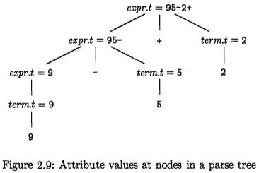

- An attribute is said to be *synthesized* if its value at a parse-tree node N is de­termined from attribute values at the children of N and at N itself. 
     - Synthesized attributes have the desirable property that they can be evaluated during a sin­gle bottom-up traversal of a parse tree. 
- In Section 5.1.1 we shall discuss another important kind of attribute: the "inherited" attribute. 
     - Informally, inherited at­ tributes have their value at a parse-tree node determined from attribute values at the node itself, its parent, and its siblings in the parse tree.


Example 2.10 : The annotated parse tree in Fig. 2.9 is based on the syntax­ directed definition in Fig 2.10  for translating expressions into postfix notation. 

- Each nonterminal has a string-valued attribute *t* 
     - *t* represents the postfix notation in this example. 
- The symbol `‖` in the semantic rule is the operator for string concatenation.


PRODUCTION | SEMANTIC RULES
--- | ---
expr → expr₁ + term | expr.t = expr₁.t ‖ term.t ‖ '+' 
expr → expr₁ - term | expr.t = expr₁.t ‖ term.t ‖ '-'
expr → term         | expr.t = term.t
term → 0             | term.t = '0'
term → 1             | term.t = '1'
...                    | ...
term → 9            | term.t = '9'

Figure 2.10: Syntax-directed definition for infix to postfix translation

- The postfix form of a digit is the digit itself; 
     - e.g., the semantic rule associ­ated with the production `term → 9` defines *term.t* to be 9 itself whenever this production is used at a node in a parse tree. 
     - The other digits are translated similarly. 
- As another example, when the production *expr* → *term* is applied, the value of *term.t* becomes the value of *expr.t* .
- The production *expr* → *expr₁* + *term* derives an expression containing a plus operator. 
     - The left operand of the plus operator is given by *expr₁* and the right operand by *term*. 
     - The semantic rule `expr.t = expr₁.t ‖ term.t ‖ '+'` associated with this production constructs the value of attribute *expr.t* by con­catenating the postfix forms *expr₁.t* and *term.t* of the left and right operands, respectively, and then appending the plus sign. 
     - This rule is a formalization of the definition of "postfix expression." 


>Convention Distinguishing Uses of a Nonterminal
>
>The nonterminal appears unsubscripted in the head and with distinct subscripts in the body. 
>These are all occurrences of the same nonterminal, and the subscript is not part of its name.

<h2 id="6de6204039ada6e7a2a4ffa51849e7b2"></h2>

### 2.3.3 Simple Syntax-Directed Definitions

The syntax-directed definition in Example 2.10 has the following important property: 

- the string is the *concatenation of the translations of the nonterminals in the production body* , in the same order as in the production
     - that string represents the translation of the nonterminal at the head of each production
- with some optional additional strings interleaved. 

A syntax-directed definition with this property is termed *simple* .

Example 2.11 : Consider the first production and semantic rule from Fig 2.10:

PRODUCTION | SEMANTIC RULES 
--- | ---
expr → expr₁ + term | expr.t = expr₁.t ‖ term.t ‖ '+'  (2.5)

- Here the translation *expr.t* is the concatenation of the translations of *expr₁* and *term*, followed by the symbol +
- Notice that *expr₁* and *term* appear in the same order in both the production body and the semantic rule. 
     - no additional symbols before or between their translations. 
- In this example, the only extra symbol occurs at the end '+'.

When translation schemes are discussed, we shall see that a simple syntax­ directed definition can be implemented by printing only the additional strings, in the order they appear in the definition.


<h2 id="5b8e21acbc1a41e26950d04eb4016a66"></h2>

### 2.3.4 Tree Traversals

Tree traversals will be used for describing attribute evaluation and for specifying the execution of code fragments in a translation scheme. A traversal of a tree starts at the root and visits each node of the tree in some order.

A *depth-first* traversal starts at the root and recursively visits the children of each node in any order, not necessarily from left to right. It is called "depth­ first" because it visits an unvisited child of a node whenever it can, so it visits nodes as far away from the root (as "deep" ) as quickly as it can.

- a depth first traversal that visits the children of a node in left-to-right order
- In this traversal, we have included the action of evaluating translations at each node, just before we finish with the node 
     - that is, after translations at the children have surely been computed. 
- In general, the actions associated with a traversal can be whatever we choose, or nothing at all.


- A syntax-directed definition does not impose any specific order for the eval­uation of attributes on a parse tree; 
     - 求值操作没有强制顺序的要求
- Any evaluation order that computes an attribute *a* after all the other attributes that *a* depends on is acceptable. 
- Syn­thesized attributes can be evaluated during any *bottom-up* traversal
     - that is, a traversal that evaluates attributes at a node after having evaluated attributes at its children. 
- In general, with both synthesized and inherited attributes, the matter of evaluation order is quite complex; see Section 5.2.


> Preorder and postorder traversals are two important special cases of depth­ first traversals 
> in which we visit the childr n of each node from left to right


<h2 id="5006a324c3c1dbb8238e2f7acc0db632"></h2>

### 2.3.5 Translation Schemes

The syntax-directed definition in Fig 2.10 builds up a translation by attaching strings as attributes to the nodes in the parse tree. We now consider an alter­native approach that does not need to manipulate strings; it produces the same translation incrementally, by executing program fragments.

A syntax-directed translation scheme is a notation for specifying a transla­tion by attaching program fragments to productions in a grammar. A transla­tion scheme is like a syntax-directed definition, except that *the order of evalu­ation of the semantic rules is explicitly specified*.

Program fragments embedded within production bodies are called *semantic actions*. The position at which an action is to be executed is shown by enclosing it between curly braces `{ }` and writing it within the production body, as in 

```java
rest → + term {print('+')} rest₁
```

- We shall see such rules when we consider an alternative form of grammar for expressions:
     - where the nonterminal *rest* represents "everything but the first term of an expression." 
     - This form of grammar is discussed in Section 2.4.5. 
- Again, the subscript in *rest₁* distinguishes this instance of nonterminal *rest* in the production body from the instance of *rest* at the head of the production.

When drawing a parse tree for a translation scheme, 

- We indicate an action by constructing an extra child for it, 
     - that child connected by a dashed line to the node that corresponds to the head of the production. 
- For example, the portion of the parse tree for the above production and action is shown in Fig 2.13. 
     - The node for a semantic action has no children, so the action is performed when that node is first seen.
     - 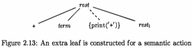


Example 2.12 : The parse tree in Fig 2.14 has print statements at extra leaves, which are attached by dashed lines to interior nodes of the parse tree. 

The translation scheme appears in Fig 2.15. The underlying grammar gen­erates expressions consisting of digits separated by plus and minus signs. The actions embedded in the production bodies translate such expressions into post­fix notation, provided(in case) we perform a left-to-right depth-first traversal of the tree and execute each print statement when we visit its leaf.

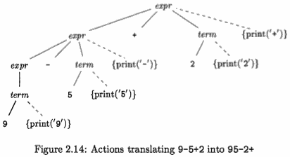

![2.15][1]


- The root of Fig 2.14 represents the first production in Fig 2.15. 
- In a postorder traversal, we first perform all the actions in the leftmost subtree of the root, for the left operand, also labeled *expr* like the root. 
- We then visit the leaf + at which there is no action. 
- We next perform the actions in the subtree for the right operand *term* 
- and finally, the semantic action { print('+') } at the extra node.

---

- Since the productions for *term* have only a digit on the right side, *that digit is printed* by the actions for the productions. 
- No output is necessary for the production *expr* → *term*, and only the operator needs to be printed in the action for each of the first two productions. 
- When executed during a postorder traversal of the parse tree, the actions in Fig 2.14 print 95-2+.


Note that although the schemes in Fig 2.10 and Fig 2.15 produce the same translation, they construct it differently; 

- Fig 2.10 attaches strings as attributes to the nodes in the parse tree 
- while the scheme in Fig 2.15 prints the translation incrementally, through semantic actions.

The semantic actions in the parse tree in Fig 2.14 translate the infix ex­pression 9-5+2 into 95-2+ by printing each character in 9-5+2 exactly once, without using any storage for the translation of subexpressions. When the out­put is created incrementally in this fashion, ***the order in which the characters are printed is significant***.

- The implementation of a translation scheme must ensure that semantic ac­tions are performed in the order they would appear during a postorder traversal of a parse tree. 
- The implementation need not actually construct a parse tree (often it does not), as long as it ensures that the semantic actions are per­formed as if we constructed a parse tree and then executed the actions during a postorder traversal.


<h2 id="f4914c078fe8c7b18906652239ace52f"></h2>

## 2.4 Parsing

Parsing is the process of determining how a string of terminals can be generated by a grammar. In discussing this problem, it is helpful to think of a parse tree being constructed, even though a compiler may not construct one, in practice. However, a parser must be capable of constructing the tree in principle, or else the translation cannot be guaranteed correct.

This section introduces a parsing method called "recursive descent," which can be used both to parse and to implement syntax-directed translators. 

A viable alternative is to use a software tool to generate a translator directly from a translation scheme. Section 4.9 describes such a tool - **Yacc**; it can implement the translation scheme of Fig. 2.15 without modification.

For any context-free grammar there is a parser that takes at most O(n³) time to parse a string of n terminals. But cubic time is generally too expen­sive. Fortunately, for real programming languages, we can generally design a grammar that can be parsed quickly. Linear-time algorithms suffice to parse essentially all languages that arise in practice. Programming-language parsers almost always make a single left-to-right scan over the input, looking ahead one terminal at a time, and constructing pieces of the parse tree as they go.

Most parsing methods fall into one of two classes, called the *top-down* and *bottom-up* methods. These terms refer to the order in which nodes in the parse tree are constructed. 

- In top-down parsers, construction starts at the root and proceeds towards the leaves 
- while in bottom-up parsers, construction starts at the leaves and proceeds towards the root. 
- The popularity of top-down parsers is due to the fact that efficient parsers can be constructed more easily by hand using top-down methods. 
- Bottom-up parsing, however, can handle a larger class of grammars and translation schemes, so software tools for generating parsers directly from grammars often use bottom-up methods.

<h2 id="f17ccb955a076df374b5842f7e7c8a7f"></h2>

### 2.4.1 Top-Down Parsing

We introduce top-down parsing by considering a grammar that is well-suited for this class of methods. Later in this section, we consider the construction of top-down parsers in general. 

The grammar in Fig 2.16 generates a subset of the statements of C or Java:

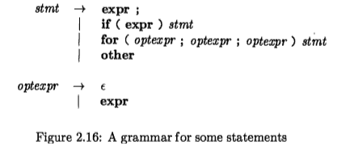

- We use the boldface terminals **if** and **for** for the keywords "if" and "for", respectively, to emphasize that these character sequences are treated as units, i.e., as single terminal symbols. 
- Further, the terminal *expr* represents expressions; a more complete grammar would use a nonterminal *expr* and have productions for nonterminal *expr*. 
- Similarly, **other** is a terminal representing other statement constructs.

The top-down construction of a parse tree like the one in Fig. 2.17:

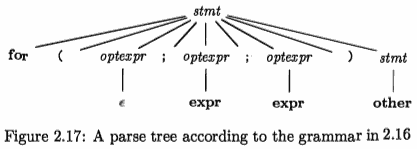

It is done by starting with the root, labeled with the starting nonterminal *stmt*, and re­peatedly performing the following two steps.

 1. At node N, labeled with nonterminal A, select one of the productions for A and construct children at N for the symbols in the production body.
 2. Find the next node at which a subtree is to be constructed, typically the leftmost unexpanded nonterminal of the tree.

For some grammars, the above steps can be implemented during a single left-to-right scan of the input string. 

The current terminal being scanned in the input is frequently referred to as the *lookahead* symbol. Initially, the lookahead symbol is the first, i.e., leftmost, terminal of the input string. Figure 2.18 illustrates the construction of the parse tree in Fig. 2.17 for the input string:

**for ( ; expr ; expr ) other**

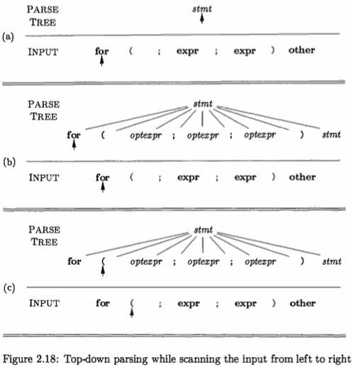

- Initially, the terminal **for** is the lookahead symbol, and the known part of the parse tree consists of the root, labeled with the starting nonterminal stmt in Fig. 2.18(a)
- The objective is to construct the remainder of the parse tree 
     - in such a way that the string generated by the parse tree matches the input string.
- For a match to occur, the nonterminal *stmt* in Fig. 2.18(a) must derive a string that starts with the lookahead symbol **for**. 
     - In the grammar of Fig. 2.16, there is just one production for *stmt* that can derive such a string, so we select it, and construct the children of the root labeled with the symbols in the production body. This expansion of the parse tree is shown in Fig. 2.18(b).
     - 注:  select a production by matching first terminal
- Each of the three snapshots in Fig. 2.18 has arrows marking the *lookahead symbol* in the input and the node in the parse tree that is being considered. 
- Once children are constructed at a node, we next consider the leftmost child. In Fig. 2.18(b), children have just been constructed at the root, and the leftmost child labeled with **for** is being considered.
- When the node being considered in the parse tree is for a terminal, and the terminal matches the lookahead symbol, then we advance in both the parse tree and the input. 
     - The next terminal in the input becomes the new lookahead symbol, and the next child in the parse tree is considered. In Fig. 2.18(c), the arrow in the parse tree has advanced to the next child of the root, and the arrow in the input has advanced to the next terminal, which is (. 
     - A further advance will take the arrow in the parse tree to the child labeled with nonterminal *optexpr* and take the arrow in the input to the terminal "**;**" .
- At the nonterminal node labeled *optexpr*, *we repeat the process of selecting a production for a nonterminal*. 
     - Productions with **ε** as the body ( "ε-productions" ) require special treatment. For the moment, we use them as a default when no other production can be used; we return to them in Section 2.4.3. 
     - With nonterminal *optexpr* and lookahead **;** , the ε-production is used, since **;** does not match the only other production for *optexpr*, which has terminal *expr* as its body.
- In general, the selection of a production for a nonterminal may involve trial-­and-error; that is, we may have to try a production and backtrack to try another production if the first is found to be unsuitable. A production is unsuitable if, after using the production, we cannot complete the tree to match the input.

<h2 id="99a9f275f59362168c3615e281bca19a"></h2>

### 2.4.2 Predictive Parsing

*Recursive-descent parsing* is a top-down method of syntax analysis in which a set of recursive procedures is used to process the input. One procedure is associated with each nonterminal of a grammar. Here, we consider a simple form of recursive-descent parsing, called *predictive parsing*, in which the lookahead symbol unambiguously determines the flow of control through the procedure body for each nonterminal. The sequence of procedure calls during the analysis of an input string implicitly defines a parse tree for the input, and can be used to build an explicit parse tree, if desired.

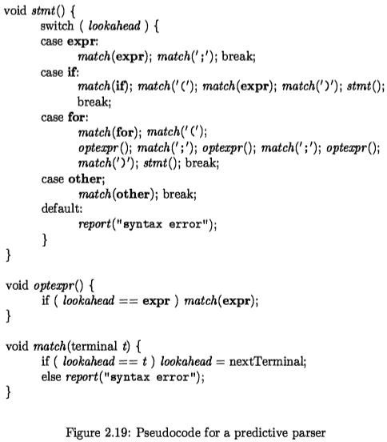

The predictive parser in Fig. 2.19 consists of procedures for the nontermi­nals *stmt* and *optexpr* of the grammar in Fig. 2.16 and an additional procedure *match*, used to simplify the code for *stmt* and *optexpr*. 

Procedure *match(t)* com­pares its argument t with the lookahead symbol and advances to the next input terminal if they match. Thus *match* changes the value of variable *lookahead*, a global variable that holds the currently scanned input terminal.

- Parsing begins with a call of the procedure for the starting nonterminal *stmt*.  *Lookahead* is initially the first terminal **for**. Procedure stmt executes code corresponding to the production:
     - *stmt* → **for** ( *optexpr* ; *optexpr* ; *optexpr* ) *stmt*
- In the code for the production body - that is, the **for** case of procedure *stmt*  
     - each **terminal is matched** with the lookahead symbol, 
     - and each **nonterminal** leads to **a call of its procedure**, 
     - in the following sequence of calls:
         - match(for); match('(');
         - optexpr(); match(';'); optexpr(); match(';'); optexpr(); 
         - match(')'); stmt();

- Predictive parsing relies on information about the *first symbols* that can be generated by a production body. Let α be a string of grammar symbols (terminals and/or nonterminals). We define FIRST(α) to be the set of terminals that appear as the first symbols of one or more strings of terminals generated from α. 
     - If α is ε or can generate ε, then ε is also in FIRST(α). 
- The details of how one computes FIRST(α) are in Section 4.4.2. Here, we shall just use ad hoc reasoning to deduce the symbols in FIRST(a) ; typically, 
     - α will either begin with a terminal, 
         - which is therefore the only symbol in FIRST(a) (因为后面的 symbol 不再被关心 ), 
     - or α will begin with a nonterminal whose production bodies begin with termi­nals
         - in which case these terminals are the only members of FIRST(a) .

- For example, with respect to the grammar of Fig. 2.16, the following are correct calculations of FIRST.
     - FIRST( stmt ) = { expr, if, for, other }         // *nonterminal*
    - FIRST( expr ; ) = { expr }    // ; 是什么鬼?        // terminals
- The FIRST sets must be considered if there are two productions A → α and A → β . Ignoring ε-productions for the moment, predictive parsing requires FIRST(α) and FIRST(β) to be disjoint (如果有交集，就无法选择了). The lookahead symbol can then be used to decide which production to use; if the lookahead symbol is in FIRST(α) , then α is used. Otherwise, if the lookahead symbol is in FIRST(β), then β is used.

<h2 id="c601306090856b08c316efc502d5c4a5"></h2>

### 2.4.3 When to Use ε-Productions

Our predictive parser uses an ε-production as a default when no other produc­ tion can be used. 

`void optexpr()` 函数使用了 if 条件判断，来确保 ε-production 工作。


<h2 id="66972cfc9c080d80ea54706369483340"></h2>

### 2.4.4 Designing a Predictive Parser

We can generalize predictive parser , to apply to any grammar that has disjoint FIRST sets for the production bodies belonging to any nonterminal. We shall also see that when we have a translation scheme , it is possible to execute those actions as part of the procedures designed for the parser.

Recall that a *predictive parser* is a program consisting of a procedure for every nonterminal. The procedure for nonterminal A does two things.

 1. It decides which A-production to use by examining the lookahead symbol. 
     - The production with body α (where α is not ε, the empty string) is used if the lookahead symbol is in FIRST( α ). 
     - If there is a conflict between two nonempty bodies for any lookahead symbol, then we cannot use this parsing method on this grammar. 
     - In addition, the ε-production for A, if it exists, is used if the lookahead symbol is not in the FIRST set for any other production body for A.
 2. The procedure then mimics 模仿 the body of the chosen production. 
     - That is, the symbols of the body are "executed" in turn, from the left. 
         - A nonterminal is "executed" by a call to the procedure for that nonterminal, 
         - and a terminal matching the lookahead symboi is "executed" by reading the next input symbol.
     - If at some point the terminal in the body does not match the lookahead symbol, a syntax error is reported.

Just as a translation scheme is formed by extending a grammar, a syntax­ directed translator can be formed by extending a predictive parser. 

An algo­rithm for this purpose is given in Section 5.4. The following limited construction suffices for the present:

- Construct a predictive parser, ignoring the actions in productions.
- Copy the actions from the translation scheme into the parser. 
     - If an action appears after grammar symbol X in production p, then it is copied after the implementation of X in the code for p. 
     - Otherwise, if it appears at the beginning of the production, then it is copied just before the code for the production body.
     - 不理解


<h2 id="4a2d5ee1151a64b791b34dc425b2d95e"></h2>

### 2.4.5 Left Recursion

It is possible for a *recursive-descent* parser to loop forever. A problem arises with "left-recursive" productions like:

```
    expr → expr + term 
```

where the *leftmost symbol of the body* is the same as the head. 

就是一个直接左递归的例子。 这规则的递归下降分析器(recursive descent parser)可能会像这样：

```java
function Expr()
{  
    Expr();  match('+');  Term();
}
```

然后这个递归下降分析器在尝试去解析包含此规则的文法时，会陷入一个无穷的递归。


A left-recursive production can be eliminated by rewriting the offending production. 

For an example , consider a nonterminal A with two productions (ps. Immediate left recursion 句型):

```
    A → Aα | β
```

where α and β are sequences of terminals and nonterminals that do not start with A. 

- in `expr → expr + term | term` , nonterminal A = *expr*, string α = +*term*, and string β = *term*.

The nonterminal A and its production are said to be *left recursive*. Repeated application of this production builds up a sequence of a's to the right of A, as in Fig. 2.20(a). When A is finally replaced by β , we have a β followed by a sequence of zero or more a's.

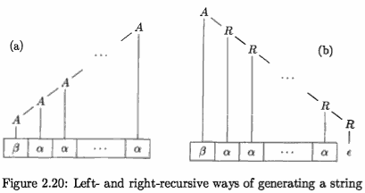

The same effect can be achieved, as in Fig. 2.20(b),  ***introduce a new nonterminal R*** and rewrite the rule as :

```
    A → βR
    R → αR | ε 
```

- α ≠ ε is assumed.

Nonterminal R and its production `R → αR` are ***right recursive*** because this pro­duction for R has R itself as the last symbol on the right side.

Right-recursive productions lead to trees that grow down towards the right, as in Fig. 2.20(b). Trees growing down to the right make it harder to translate expressions con­taining left-associative operators, such as minus. 


> 通用规则，见 4.3.3 **Elimination of Left Recursion**

---

<h2 id="dc36424ed69c3a7f569433fa185a4d31"></h2>

## 2.5 A Translator for Simple Expressions

We now construct a syntax­ directed translator, in the form of a working Java program, that translates arithmetic expressions into postfix form. 

We start with expressions consisting of digits separated by binary plus and minus signs. We extend the program in Section 2.6 to translate ex­pressions that include numbers and other operators. 

It is worth studying the translation of expressions in detail, since they appear as a construct in so many languages .

A syntax-directed translation scheme often serves as the specification for a translator. The scheme in Fig. 2.21 (repeated from Fig. 2.15) defines the translation to be performed here.

![2.15][1]

Often, the underlying grammar of a given scheme has to be modified before it can be parsed with a predictive parser. In particular, the grammar underlying the scheme in Fig. 2.21 is left recursive, and as we saw in the last section, a predictive parser cannot handle a left-recursive grammar.
We appear to have a conflict: 

- on the one hand we need a grammar that facilitates translation, 
- on the other hand we need a significantly different gram­mar that facilitates parsing. 

The solution is to begin with the grammar for easy translation and carefully transform it to facilitate parsing. 

By eliminating the left recursion in Fig. 2.21, we can obtain a grammar suitable for use in a predictive recursive-descent translator.

---

<h2 id="fe6d9d9777fded4d7cc0bea999b3490f"></h2>

### 2.5.1 Abstract and Concrete Syntax

A useful starting point for designing a translator is a data structure called an *abstract syntax tree*.

In an *abstract syntax tree* for an expression, 

- each interior node represents an operator; 
- the children of the node represent the operands of the operator. 

More generally, any programming construct can be handled by making up an operator for the construct and treating as operands, the semantically meaningful components of that construct.

In the abstract syntax tree for 9-5+2 in Fig. 2.22, 

- the root represents the operator +. 
- The subtrees of the root represent the subexpressions 9-5 and 2. 
     - The grouping of 9-5 as an operand reflects the left-to-right evaluation of operators at the same precedence level. 
     - Since - and + have the same precedence, 9-5+2 is equivalent to (9-5) +2.

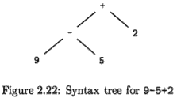

Abstract syntax trees, or simply ***syntax trees***, resemble parse trees to an extent.  However, in the syntax tree, interior nodes represent programming constructs while in the parse tree, the interior nodes represent nonterminals. 

Many nonterminals of a grammar represent programming constructs, but others are "helpers" of one sort of another, such as those representing terms, factors, or other variations of expressions. 

In the syntax tree, these helpers typically are not needed and are hence dropped. To emphasize the contrast, a ***parse tree*** is sometimes called a ***concrete syntax tree***, and the underlying grammar is called a ***concrete syntax*** for the language.

In the syntax tree in Fig. 2.22, each interior node is associated with an operator, with no "helper" nodes for *single productions* (a production whose body consists of a single nonterminal,and nothing else) like *expr* → *term* or for ε-productions like rest → ε.

It is desirable for a translation scheme to be based on a grammar whose parse trees are as close to syntax trees as possible. 

The grouping of subexpressions by the grammar in Fig. 2.21 is similar to their grouping in syntax trees. For example, subexpressions of the addition operator are given by *expr* and *term* in the production body *expr* + *term*.

---

<h2 id="af23deae5c2b14d5574f5833d7540a17"></h2>

### 2.5.2 Adapting the Translation Scheme

The left-recursion-elimination technique sketched in Fig. 2.20 can also be ap­plied to productions containing semantic actions. 

- First, the technique extends to multiple productions for A. 

 In our example, A is *expr*, and there are two left­ recursive productions for *expr* and one is not. The technique transforms the productions A → Aα | Aβ | γ into

```
    A → γR
    γ → αR | βR | ε
```

- Second, we need to transform productions that have embedded actions, not just terminals and nonterminals. 

***Semantic actions embedded in the productions are simply carried along in the transformation, as if they were terminals***.


Example 2.13 : Consider the translation scheme of Fig. 2.15. Let :

```
    A = expr
    α = + term { print('+') }
    β = - term { print('-') }
    γ = term
```

Then the left-recursion-eliminating transformation produces the translation scheme in Fig. 2.23. 

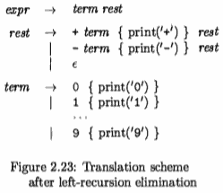

- The *expr* productions have been transformed into the productions for *expr*, and a new nonterminal *rest* 
     - *rest* plays the role of R. 
- The productions for *term* do not be changed. 

Figure 2.24 shows how 9-5+2 is translated.

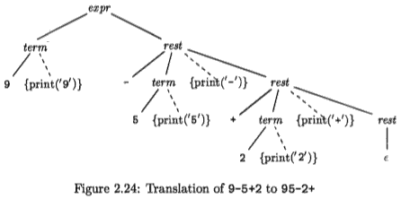   

Left-recursion elimination must be done carefully, to ensure that we preserve the ordering of semantic actions. 

For example, the transformed scheme in Fig. 2.23 has the actions { print('+') } and { print('-') } in the middle of a production body, in each case between nonterminals *term and rest*. 

If the actions were to be moved to the end, after rest, then the translations would become incorrect.

<h2 id="01d4e2ca5af7ec1b23af29a3c6c8cedb"></h2>

### 2.5.3 Procedures for the Nonterminals

Functions *expr*, *rest*, and *term* in Fig. 2.25 implement the syntax-directed trans­lation scheme in Fig. 2.23. These functions mimic the production bodies of the corresponding nonterminals. 

```java
void expr() { 
    term(); rest();
}
void rest() { 
    if ( lookahead == '+') {
          match('+'); term(); print('+'); rest();
    }else if ( lookahead == '-' ) {
        match('-'); term(); print('-'); rest();
    }
    else { } /* ε : do nothing with the input */ 
}
void term() {
    if ( lookahead is a digit ) {
        t = lookahead; match(lookahead); print(t); 
    } else report("syntax error");
}
```

Figure 2.25: Pseudocode for nonterminals *expr*, *rest*, and *term*.

Function *expr* implements the production `expr → term rest` by the calls term() followed by rest().

Function *rest* implements the three productions for nonterminal *rest*.

The 10 productions for *term* generate the 10 digits. 

---

<h2 id="d018fd5adc4547a6ad51aa356e41b6b0"></h2>

### 2.5.4 Simplifying the Translator

Before showing a complete program, we shall make 2 simplifying transfor­mations to the code in Fig. 2.25. 

The simplications will fold procedure *rest* into procedure *expr*. When expressions with multiple levels of precedence are translated, such simplications reduce the number of procedures needed.


- First, certain recursive calls can be replaced by iterations. 
     - When the last statement executed in a procedure body is a recursive call to the same proce­dure, the call is said to be *tail recursive*. 
         - eg., in function rest, the calls of rest() with lookahead + and - .
     - For a procedure without parameters, a tail-recursive call can be replaced by a jump to the beginning of the procedure. 
         - The code for *rest* can be rewritten as the pseudocode of Fig. 2.26. 


```java
void rest() {
    while( true ) {
        if( lookahead == '+' ) {
            match('+'); term(); print('+'); continue;
        } else if ( lookahead == '-' ) {
            match('-'); term(); print('-'); continue;
        } 
        break ;  // do nothing for ε
    }
}
```

Figure 2.26: Eliminating tail recursion in the procedure rest of Fig. 2.25.


- Second, once the tail-recursive calls are replaced by iterations, the only remaining call to *rest* is from within procedure *expr*. 
     - The two procedures can therefore be integrated into one.
     - 去掉 rest() 方法, 原来的 rest()调用， 改用 while 循环 替代

> As a minor optimization, we could print before calling match to avoid the need to save the digit , in this example. 
> In general, changing the order of actions and grammar symbols is risky, since it could change what the translation does.


<h2 id="1a1ea37b9c37e0e1025a499311325dfe"></h2>

### 2.5.5 The Complete Program

```java
import java.io.*; 

class Parser {
    static int lookahead;

    public Parser() throws IOException { 
        lookahead = System.in.read(); //read 1 char
    }
    void expr() throws IOException { 
        term() ;
        // rest()
        while (true) {  
            if( lookahead == '+' ) {
                match('+'); term(); System.out.write('+');
            }
            else if( lookahead == '-' ) {
                match('-'); term(); System.out.write('-');
            }
            else return;
        }
    }
    void term() throws IOException {
        if( Character.isDigit( (char)lookahead) ) {
            System.out.write((char)lookahead) ; 
            match(lookahead) ;
        }
        else throw new Error("syntax error") ;
    }
    void match(int t) throws IOException {
        //read 1 char
        if( lookahead == t ) lookahead = System.in.read(); 
        else throw new Error("syntax error") ;
    } 
}

public class Postfix {
    public static void main(String[] args) throws IOException {
        Parser parse = new Parser() ;
        parse.expr() ; System.out.write('\n') ;
    }
}
```

Figure 2.27: Java program to translate in x expressions into post x form

这段程序可以将 digit [+/- digit] 的字符串, 输出为 digit [digit +/-].

---

<h2 id="1124c548716947bf1d9af7327cd25a88"></h2>

## 2.6 Lexical Analysis

So far, there has been no need to distinguish between the terms "token" and "terminal", since the parser ignores the attribute values that are carried by a token. In this section, a token is a terminal ***along with additional information***.

A sequence of input characters that comprises a single token is called a *lexeme*.

Thus, we can say that the lexical analyzer insulates (隔离) a parser from the lexeme representation of tokens.

The lexical analyzer in this section allows numbers, identifiers, and "white space" (blanks, tabs, and newlines) to appear within expressions. It can be used to extend the expression translator of the previous section. 

Since the expression grammar of Fig. 2.21 must be extended to allow numbers and identifiers, we shall take this opportunity to allow multiplication and division as well. The extended translation scheme appears in Fig. 2.28.

   

- The terminal **num** is assumed to have an attribute **num**.value, 
     which gives the integer value corresponding to this occurrence of **num** . 
- Terminal **id** has a string-valued attribute written as **id**.lexeme; 
     - we assume this string is the actual lexeme comprising this instance of the token id.

Section 3.5 de­scribes a tool called *Lex* that generates a lexical analyzer from a specification. Symbol tables or data structures for holding information about identifiers are considered in Section 2.7.

---

<h2 id="4ffe382825aa482e44d922e6011d438e"></h2>

### 2.6.1 Removal of White Space and Comments

The expression translator in Section 2.5 sees every character in the input, so extraneous characters, such as blanks, will cause it to fail. 

Most languages allow arbitrary amounts of white space to appear between tokens. Comments are likewise ignored during parsing, so they may also be treated as white space. If white space is eliminated by the lexical analyzer, the parser will never have to consider it.


```java
for ( ; ; peek = next input character ) {
    if ( peek is a blank or a tab ) do nothing; 
    else if ( peek is a newline ) line = line+1; 
    else break;
}
```
    
Figure 2.29: Skipping white spac

- Variable peek holds the next input character. 
- Line numbers and context are useful within error messages to help pinpoint errors; 
- the code uses variable line to count newline characters in the input.


<h2 id="8e6167f7cfe35d955af94e9fd07a69c8"></h2>

### 2.6.2 Reading Ahead

A lexical analyzer may need to read ahead some characters before it can decide on the token to be returned to the parser. 

For example, a lexical analyzer for C or Java must read ahead after it sees the character >. 

- If the next character is =, then > is part of the character sequence >=, the lexeme for the token for the "greater than or equal to" operator. 
- Otherwise > itself forms the "greater than" operator, 
- and the lexical analyzer has read one character too many.

A general approach to reading ahead on the input, is to maintain an *input buffer* ,from which the lexical analyzer can read and push back characters. 

Input buffers can be justified on efficiency grounds alone, since fetching a block of characters is usually more efficient than fetching one character at a time. A pointer keeps track of the portion of the input that has been analyzed; pushing back a character is implemented by moving back the pointer. Techniques for input buffering are discussed in Section 3.2.

One-character read-ahead usually suffices, so a simple solution is to use a variable, say peek, to hold the next input character. The lexical analyzer in this section reads ahead one character while it collects digits for numbers or characters for identifiers; e.g., it reads past 1 to distinguish between 1 and 10, and it reads past t to distinguish between t and true.

The lexical analyzer reads ahead only when it must. An operator like * can be identified without reading ahead. In such cases, peek is set to a blank, which will be skipped when the lexical analyzer is called to find the next token. 

The invariant assertion in this section is that when the lexical analyzer returns a token, variable *peek* either holds the character beyond the lexeme for the current token, or it holds a blank.

<h2 id="eae3ef9a16e0a5126020316b892f2f8b"></h2>

### 2.6.3 Constants

Anytime a single digit appears in a grammar for expressions, it seems reasonable to allow an arbitrary integer constant in its place. 

- Integer constants can be allowed either by creating a terminal symbol, say "num", for such constants 
- or by incorporating the syntax of integer constants into the grammar. 

Numbers can be treated as single units during parsing and translation.

When a sequence of digits appears in the input stream, the lexical analyzer passes to the parser a token that consisting of the terminal "num" along with an integer-vaiued attribute computed from the digits. 

If we write tokens as tuples enclosed between ( ), the input 31 + 28 + 59 is transformed into the sequence:

```
    <num,31> <+> <num,28> <+> <num,59>
```

Hete, the terminal symbol + has no attributes, so its tuple is simply (+). The pseudocode in Fig. 2.30 reads the digits in an integer and accumulates the value of the integer using variable *v*.

```java
if ( peek holds a digit ) { 
    v= 0;
    do {
        v = v * 10 + integer value of digit peek; 
        peek = next input character;
    } while ( peek holds a digit ); 
    return token <num, v>;
}
```

Figure 2.30: Grouping digits into integers

---

<h2 id="1e169be343415b0e2313599ace15555c"></h2>

### 2.6.4 Recognizing Keywords and Identifiers

Most languages use fixed character strings such as **for**, **do**, and **if**, as punctua­tion marks or to identify constructs. Such character strings are called *keywords*.

Character strings are also used as identifiers to name variables, arrays, func­tions, and the like. Grammars routinely treat identifiers as **terminals** to sim­plify the parser, which can then expect the same terminal, say **id**.

For example, on input:

```java
  count = count + increment;  (2.6)
```

the tuples for the input stream 2.6 are:

```java
  <id, "count"> <=> <id, "count"> <+> <id, "increment"> <;>
```

Keywords generally satisfy the rules for forming identifiers. So a mechanism is needed for deciding when a lexeme forms a keyword and when it forms an identifier.

The problem is easier to resolve if keywords are *reserved*; i.e., if they cannot be used as identifiers.  Then, a character string forms an identifier only if it is not a keyword.

The lexical analyzer in this section solves two problems by using a table to hold character strings:

- Single Representation.
     - A string table can insulate the rest of the compiler from the representation of strings, since the phases of the compiler can work with references or pointers to the string in the table. 
     - References can also be manipulated more efficiently than the strings themselves.
- Reserved Words
     - Reserved words can be implemented by initializing the string table with the reserved strings and their tokens. 
     - When the lexical analyzer reads a string or lexeme that could form an identifier, it first checks whether the lexeme is in the string table. If so, it returns the token from the table (**keyword** or **id**); otherwise, it returns a token with terminal **id**.

In Java, a string table can be implemented as a hash table using a class called Hashtable. The declaratIon:

```java
  Hashtable words = new Hashtable();
```
- key: lexeme
- value: token

We shall use it to map lexemes to tokens. The pseudocode in Fig. 2.31 uses the operation get to look up reserved words.

```java
if ( peek holds a letter ) {
    collect letters or digits into a buffer b;
    s = string formed from the characters in b; 
    w = token returned by words.get(s);
    if( w is not null ) return w;
    else { 
        Enter the key-value pair (s, <id, s)>) into words 
        return token  <id, s>;
    } 
}
```

Figure 2.31: Distinguishing keywords from identifiers


---

<h2 id="bac8700bcbb6552788ffed034f760ceb"></h2>

### 2.6.5 A Lexical Analyzer

The pseudocode fragments so far in this section fit together to form a function *scan* that returns token objects, as follows:

```java
Token scan() {
    skip white space, as in Section 2.6.1;
    handle numbers, as in Section 2.6.3;
    handle reserved words and identifiers, as in Section 2.6.4;
    /* if we get here, treat read-ahead character peek as a token */
    Token t = new Token(peek);
    peek = blank /* initialization, as discussed in Section 2.6.2 */ ; 
    return t;
}
```

The rest of this section implements function *scan* as part of a Java package for lexical analysis. The package, called **lexer** has classes for tokens and a class **Lexer** containing  iction **scan**.

The classes for tokens and their fields are illustrated in Fig. 2.32; their methods are not shown. 

- Class **Token** has a field **tag** that is used for parsing decisions. 
- Subclass **Num** adds a field **value** for an integer value. 
- Subclass **Word** adds a field **lexeme** that is used for reserved words and identifiers.

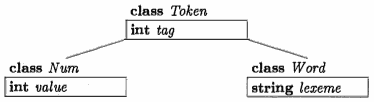

```java
package lexer ; // File Token.java 
public class Token {
    public final int tag;
    // constructor: new Token('+');
    public Token(int t) { tag = t; }   
}
```

```
package lexer; // File Tag.java
public class Tag {
    public final static int
        NUM = 256, ID = 257, TRUE = 258, FALSE = 259;  
}
```

> ASCII characters are typically converted into integers between 0 and 255. We therefore use integers greater than 255 for terminals.

In addition to the integer-valued fields NUM and ID, this class de nes two addi­tional fields, TRUE anq FALSE, for future use; they will be used to illustrate the treatment of reserved keywords.

The Java code refers toTag.NUM and Tag.ID in places where the pseudocode referred to terminals **num** and **id**. The only requirement is that Tag.NUM and Tag.ID must be initialized with distinct values that differ from each other and from the constants representing single-character tokens, such as '+' or '\*' .

```java
package lexer; // File Num.java

public class Num extends Token { 
    public final int value;
    public Num(int v) { super(Tag.NUM) ; value = v; }
}
```

```java
package lexer ; // File Word.java 

public class Word extends Token {
    public final String lexeme; 
    public Word(int t, String s) {
        super(t) ; lexeme = new String(s) ;
    }
}
```

Figure 2.33: Subclasses Num and Word of Token

An object for the reserved word **true** can be created by executing

```java
    new Word(Tag.TRUE, "true")
```

Class **Lexer** for lexical analysis appears in Figs. 2.34 and 2.35. 

```java
package lexer ; // File Lexer.java 

import java.io.*; 
import java.util.*;

public class Lexer {
    public int line = 1;
    private char peek =' ';
    private Hashtable words = new Hashtable() ;
    // reserve is to add reserve keyword
    void reserve(Word t) {  words.put(t.lexeme, t) ;  } 
    public Lexer() {
        reserve( new Word(Tag.TRUE, "true") ) ; 
        reserve( new Word(Tag.FALSE, "false") ) ;
    }
    public Token scan() throws IOException {
        // skips blank, tab, and newline characters
        for( ; ; peek = (char)System.in.read() ) {
            if( peek == ' ' || peek == '\t' ) continue; 
            else if( peek == '\n' ) line = line + 1; 
            else break;
        }

        // reading a sequence of digits
        if ( Character.isDigit (peek) ) { 
            int v = 0;
            do {
                v = 10*v + Character . digit (peek , 10) ;
                peek = (char)System.in.read();
            } while ( Character . isDigit (peek) ) ; 
            return new Num(v) ;
        }

        // analyze reserved words and identifiers
        if( Character.isLetter(peek) ) { 
            StringBuffer b = new StringBuffer () ; 
            do {
                b.append(peek) ;
                // read ahead
                peek = (char)System.in.read();
            } while ( Character . isLetterOrDigit (peek) ) ; 
            String s = b.toString();
            Word w = (Word)words.get(s);
            // token exists
            if( w != null ) return w;
            // insert new token
            w = new Word(Tag.ID, s);
            words.put(s, w);
            return w;
        }
        Token t = new Token (peek) ; 
        peek = ' ' ;
        
        return t;
    } 
    
    public static void main(String[] args) throws IOException {
        Lexer lex = new Lexer() ;
        while(true) {
            Token token = lex.scan() ;
            System.out.println( "token:" +  token.toString() + " tag: " + token.tag );
        }
    }
}
```

Figure 2.35: Code for a lexical analyzer.

The integer variable **line** on line 4 counts input lines, and character variable **peek** on line 5 holds the next input character.

---

<h2 id="434f55fe88fd25c8152d796e3570a9f3"></h2>

## 2.7 Symbol Tables

*Symbol tables* are data structures that are used by compilers to hold information about source-program constructs. 

The information is collected incrementally by the analysis phases of a compiler and used by the synthesis phases to generate the target code. 

Entries in the symbol table contain information about an identifier such as its character string (or lexeme) , its type, its position in storage, and any other relevant information. 

Symbol tables typically need to support multiple declarations of the same identifier within a program.


From Section 1.6.1, the scope of a declaration is the portion of a program to which the declaration applies. We shall *implement scopes by setting up a separate symbol table for each scope*. 

A program block with declarations will have its own symbol table , with an entry for each declaration in the block. This approach also works for other constructs that set up scopes; for example, a class would have its own table, with an entry for each field and method.


A program consists of blocks with optional declara­tions and "statements" consisting of single identifiers. Each such statement represents a use of the identifier. Here is a sample program in this language:

```
  { int x; char y; { bool y; x; y; } x; y; } (2.7)
```

The task we shall perform is to print a revised program, in which the decla­rations have been removed and each "statement" has its identifier followed by a colon and its type.

Example 2.14: On the above input (2.7), the goal is to produce:

```java
  { { x:int; y:bool; } x:int; y:char; }
```

---

<h2 id="0b968b1c0e10984c774f810fa51a6f63"></h2>

### 2.7.1 Symbol Table Per Scope

> **Optimization of Symbol Tables for Blocks**

> Implementations of symbol tables for blocks can take advantage of the most-closely nested rule. Nesting ensures that the chain of applicable symbol tables forms a stack. At the top of the stack is the table for the current block. Below it in the stack are the tables for the enclosing blocks: Thus, symbol tables can be allocated and deallocated in a stack­ like fashion.

> Some compilers maintain a single hash table of accessible entries; that is, of entries that are not hidden by a declaration in a nested block. Such a hash table supports essentially constant-time lookups, at the expense of inserting and deleting entries on block entry and exit. Upon exit from a block B, the compiler must undo any changes to the hash table due to declarations in block B. It can do so by using an auxiliary stack to keep track of changes to the hash table while block B is processed.

The *most-closely nested* rule for blocks is that an identifier *x* is in the scope of the most-closely nested declaration of x.

The most-closely nested rule for blocks can be implemented by *chaining symbol tables*. That is, the table for a nested block points to the table for its enclosing block.

Example 2.15 :

```
1)    {     int x₁; int y₁ ; 
2)        {   int w₂, bool y₂; int z₂;
3)            ...w₂... ; ...x₁... ; ...
4)        }
5)        ...w₀...;  ... x₁...; ...y₁...;
6)    }
```

The subscript is not part of an identifier; it is in fact the line number of the declaration that applies to the identifier. 


Example 2.16  symbol tables for the pseudocode in Exam­ple 2.15:

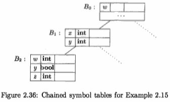

- B₁ is for the block starting on line 1 
- B₂ is for the block starting at line 2. 
- At the top of the figure is an additional symbol table B₀ for any global or default declarations provided by the language. 
- During the time that we are analyzing lines 2 through 4, the environment is represented by a reference to the lowest symbol table - the one for B₂
     - When we move to line 5, the symbol table for B₂ becomes inaccessible, and the environment refers instead to the symbol table for B₁ , from which we can reach the global symbol table, but not the table for B₂ •

Fig. 2.37 is a java implementation of chained symbol tables , class Symbol is not implemented yet .

```java
package symbols;

import java.util.*;

public class Env {
    private Hashtable table; 
    protected Env prev;
    
    // Create a new symbol table.
    public Env (Env p) {
        table = new Hashtable() ; prev = p;
    }

    // Put a new entry in current symbol table.
    public void put ( String s , Symbol sym) {
        table.put(s, sym);
    }

    // Get an entry for an identifier 
    // by searching the chain of tables
    // start with the table for the current block
    public Symbol get(String s) { 
        for( Env e=this; e !=null; e=e.prev) {
            Symbol found = (Symbol)(e.table.get(s));
            if( found != null ) return found;
        }
        return null;
    }
}
```

> "Environment" is another term for the collection of symbol tables that are relevant at a point in the program.

<h2 id="fbc602841eaa84d8266b8cd68a9b0eca"></h2>

### 2.7.2 The Use of Symbol Tables

In effect, the role of a symbol table is to pass information from declarations to uses. 

- A semantic action "puts" information about identifier *x* into the symbol table, when the declaration of *x* is analyzed. 
- Subsequently, a semantic action associated with a production such as *factor* → **id** "gets" information about the identifier from the symbol table. 

Since the translation of an expression *E₁* **op** *E₂* , for a typical operator **op**, depends only on the translations of *E₁* and *E₂* , and does not directly depend on the symbol table, we can add any number of operators without changing the *basic flow of information from declarations to uses*, through the symbol table.

Example 2.17 : The translation scheme in Fig. 2.38 illustrates how class Env can be used. 

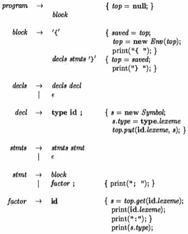

Figure 2.38: The use of symbol tables for translating a language with blocks

The translation scheme concentrates on scopes, declarations, and uses. It implements the translation described in Example 2.14. As noted earlier, on input 

`{ int x; char y; { bool y; x; y; } x; y; }` , 

the transltion scheme strips the declarations and produces  

`{ { x:int; y:bool; } x:int; y:char; }`.


---

<h2 id="34e5a4a6d3a58ed77921d67b06e25cb5"></h2>

## 2.8 Intermediate Code Generation

The front end of a compiler constructs an intermediate representation of the source program from which the back end generates the target program. 

<h2 id="66c733687afcb7c5eb00b1d5d1579e9b"></h2>

### 2.8.1 Two Kinds of Intermediate Representations

- Trees, including parse trees and (abstract) syntax trees.
- Linear representations, especially "three-address code."

As analysis proceeds, information is added to the nodes in the form of *attributes associated with the nodes*. The choice of attributes depends on the translation to be performed.

Three-address code is a sequence of elementary program steps, such as the addition of two values. Unlike the tree, there is no hierarchical structure. We need this representation if we are to do any significant optimization of code.    In that case, we break the long sequence of three-address statements into "basic blocks", which are sequences of statements that are always executed one-after-the-other, with no branching.

In addition to creating an intermediate representation, a compiler front end checks that the source program follows the syntactic and semantic rules of the source language. This checking is called *static checking*; in general "static" means "done by the compiler." Static checking assures that certain kinds of programming errors, including type mismatches, are detected and reported during compilation.

It is possible that a compiler will construct a syntax tree at the same time it emits steps of three-address code. 

- it is common for compilers to emit the three-address code while the parser "goes through the motions" of constructing a syntax tree, 
- without actually constructing the complete tree data structure. 
- Rather, the compiler stores nodes and their attributes needed for semantic checking or other purposes, along with the data structure used for parsing. 
- By so doing, those parts of the syntax tree that are needed to construct the three-address code are available when needed, but disappear when no longer needed. We take up the details of this process in Chapter 5.

---

<h2 id="ae16ee3868feeaebf52a44b7030a9257"></h2>

### 2.8.2 Construction of Syntax Trees

We shall first give a translation scheme that constructs syntax trees, and later, in section 2.8.4, show how the scheme can be modified to emit three-address code, along with, or instead of, the syntax tree.

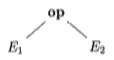

This syntax tree represents an expression formed by applying the operator **op** to the subexpres­sions represented by E₁ and E₂.

- Syntax trees can be created for any construct, not just expressions. 
- Each construct is represented by a node, with children for the semantically meaningful components of the construct. 

For example, the semantically meaningful components of a C while-statement

```cpp
    while ( expr ) stmt
```

> The right parenthesis serves only to separate the expression from the statement. The left parenthesis actually has no meaning; it is there only to please the eye, since without it, C would allow unbalanced parentheses.

are the expression *expr* and the statement *stmt*. The syntax-tree node for such a while-statement has an operator, which we call **while**, and two children -- the syntax trees for the *expr* and the *stmt*.

The translation scheme in Fig. 2.39 constructs syntax trees for a repre­sentative language of expressions and statements. 

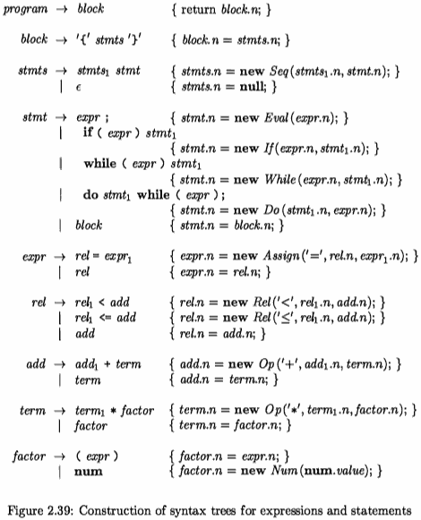

All the nonterminals in the translation scheme have an attribute *n*, which is a node of the syntax tree. Nodes are implemented as objects of class *Node*.

Class *Node* has two immediate subclasses: *Expr* for all kinds of expressions, and *Stmt* for all kinds of statements. 

Each type of statement has a corresponding subclass of *Stmt*;  for example , for while statement, operator **while** corresponds to subclass *while*. A syntax-tree node for operator **while** with children x and y is created by the pseudocode 

```
    new While(x,y)
```

When we study the detailed code in Appendix A, we shall see how methods are placed where they belong in this hierarchy of classes. In this section, we shall discuss only a few of the methods, informally.

We shall consider each of the productions and rules of Fig. 2.39, in turn. 

First, the productions defining different types of statements are explained, fol­lowed by the productions that define our limited types of expressions.

---

<h2 id="a575ff09f5b0e915ba023178f4e8156b"></h2>

#### Syntax Trees for Statements

For each statement construct, we define an operator in the abstract syntax.    

> 每个语句定义一个 operator

For constructs that begin with a keyword, we shall use the keyword for the operator. 

> keyword 开头的语句，这个 keyword 就作为 operator 

Thus, there is an operator **while** for while-statements and an operator **do** for do-while statements. Conditionals can be handled by defining two operators **ifelse** and **if** for if-statements with and without an else part,respectively. 

In our simple example language, we do not use **else**, and so have only an if-statement. Adding **else** presents some parsing issues, which we discuss in Section 4.8.2.

Each statement operator has a corresponding class of the *same name*, with a capital first letter; e.g., class *If* corresponds to **if**. In addition, we define the subclass *Seq*, which represents a sequence of statements. This subclass corresponds to the nonterminal *stmts* of the grammar. Each of these classes are subclasses of *Stmt*, which is a subclass of Node.

A typical rule in Fig.2.39 is the one for if-statements:

```
  stmt → if (expr) stmt₁ { stmt.n = new If(expr.n, stmt₁.n); }
```

- The meaningful components of the if-statement are *expr* and *stmt₁* .
- The se­mantic action defines the node *stmt.n* as a new object of subclass *If* . 

Expression statements do not begin with a keyword, so we define a new op­erator **eval** and class *Eval*, which is a subclass of *Stmt*, to represent expressions that are statements. The relevant rule is:

```
  stmt → expr ; { stmt.n = new Eval(expr.n); }
```
---

<h2 id="0e2d70ac0a5f7fe503cc3c18910291f3"></h2>

#### Representing Blocks in Syntax Trees

The remaining statement construct in Fig. 2.39 is the block, consisting of a sequence of statements. Consider the rules:

```
  stmt → block { stmt.n = block.n; } 
  block → '{' stmts '}' { block.n = stmts.n; }
```

The first says that when a statement is a block, it has the same syntax tree as the block. 

The second rule says that the syntax tree for nonterminal block is simply the syntax tree for the sequence of statements in the block.

For simplicity, the language in Fig. 2.39 does not include declarations. Even when declarations are included in Appendix A, we shall see that *the syntax tree for a block is still the syntax tree for the statements in the block*. *Since information from declarations is incorporated into the symbol table*, they are not needed in the syntax tree. 

***Blocks, with or without declarations, therefore appear to be just another statement construct in intermediate code***.

A sequence of statements is represented by 
 
- using a leaf **null** for an empty statement 
- and a operator **seq** for a sequence of statements, 

as in

```
  stmts → stmts₁ stmt { stmts.n = new Seq(stmts₁.n, stmt.n); }
          |  ε            { stmts.n = null; }
```

Example 2.18 : In FIg. 2.40 we see part of a syntax tree representing a block or statement list. 

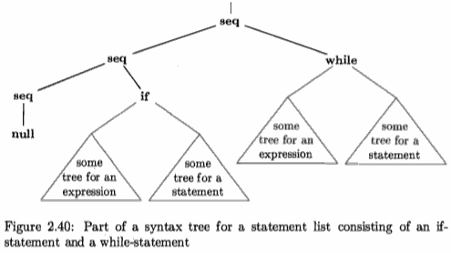

There are two statements in the list, the first an if-statement and the second a while-statement. 

<h2 id="b0181a55a85e25b720ba8728cab22c31"></h2>

#### Syntax  Trees for Expressions 

Previously, we handled the higher precedence of * over + by using three non­terminals *expr*, *term*, and *factor*. The number of nonterminals is precisely one plus the number of levels of precedence in expressions. In Fig. 2.39, we have two comparison bperators, < and <= at one precedence level, as well as the usual + and * operators, so we have added one additional nonterminal, called *add*.

Abstract syntax allows us to group "similar" operators to reduce the number of cases and subclasses of nodes in an implementation of expressions. 

> group similar oprator, 程序实现上就是 使用同一个class来处理 相近的操作符

In this chapter, we take "similar" to mean that the type-checking and code-generation rules for the operators are similar. 

For example, typically the operators + and * can be grouped, since they can be handled in the same way -- their requirements regarding the types of operands are the same, and they each result in a single three-address instruction that applies one operator to two values. 

In general, the grouping of operators in the abstract syntax is based on the needs of the later phases of the compiler. The table in Fig. 2.41 specifies the correspondence between the concrete and abstract syntax for several of the operators of Java.


CONCRETE SYNTAX | ABSTRACT SYNTAX
:---:| ---
 =         | assign
 \|\|     | cond
 &&     | cond
 == !=    | rel ( relational comparison )
 < <= >= >     | rel
 + -     | op
 * / %    | op
 !        | not
-<sub>unary</sub>     | minus (一元)
 []        | access

Figure 2.41: Concrete and abstract syntax for several Java operators

The lines are in order of increasing precedence; e.g., == has higher precedence than the oper­ ators && and =. 

The mapping between concrete and abstract syntax can be implemented by writing a translation scheme.  The semantic actions in productions , for nonterminals such like *expr*, *rel*, *add*, *term*, and *factor* , create syntax-tree nodes. For example, the rule

```
  term → term₁ * factor { term.n = new Op('*', term₁.n, factor.n); }
```

creates a node of class *Op*, which implements the operators **op** . The constructor *Op* has a parameter '*' to identify the actual operator.

<h2 id="9d5cecdb99d5dae795be316ef310ad3b"></h2>

### 2.8.3 Static Checking

Static checks are consistency checks that are done during compilation. 

Not only do they assure that a program can be compiled successfully, but they also have the potential for catching programming errors early, before a program is run. Static checking includes:

- *Syntactic Checking*
     - There is more to syntax than grammars. For ex­ample, There are often many constraints are syntactic, although they are not encoded in, or enforced by, a grammar used for parsing.
         - eg. an identifier being declared at most once in a scope, 
         - eg. a break statement must have an enclosing loop or switch statement,
- *Type Checking* 
     - The type rules of a language assure that an operator or function is applied to the right number and type of operands. 
     - If conversion between types is necessary, e.g., when an integer is added to a float, then the type-checker can insert an operator into the syntax tree to represent that conversion. We discuss type conversion, using the common term "*coercion*". 


<h2 id="a226617c26f0efa2fab04802a7ecb968"></h2>

#### L-values and R-values

We now consider some simple static checks that can be done during the con­struction of a syntax tree for a sburce program. 

In general, complex static checks may need to be done by first constructing an intermediate representation and then analyzing it.

There is a distinction between the meaning of identifiers on the left and right sides of an assignment. In each of the assignments

```
    i = 5;
    i = i + 1;
```

- the right side specifies an integer value, 
- while the left side specifies where the value is to be stored. 

The terms *l-value* and *r-value* refer to values that are appropriate on the left and right sides of an assignnient, respectively. That is 

- r-values are what we usually think of as "values," 
- while l-values are locations.

Static checking must assure that the left side of an assignment denotes an l-value.  eg. a constant like 2 is not appropriate on the left side of an assignment, since it has an r-value, but not an l-value.

<h2 id="ef0b52f08f0934c7369102646a8a9f6d"></h2>

#### Type Checking

Type checking assures that the type of a construct matches that expected by its context. 

For example, in the if-statement

```
    if ( expr ) stmt
```

the expression *expr* is expected to have type **boolean**.

Type checking rules follow the operator/operand structure of the abstract syntax. 

Assume the operator **rel** represents relational operators such as <=. The type rule for the operator group **rel** is that its two operands must have the same type, and the result has type boolean. Using attribute *type* for the type of an expression, let *E* consist of **rel** applied to *E₁* and *E₂* • The type of *E* can be checked when its node is constructed, by executing code like the following:

```java
if ( E₁.type == E₂.type ) E.type = boolean;
else error;
```

The idea of matching actual with expected types continues to apply, even in the following situations:

- *Coercions*
     - A *coercion* occurs if the type of an operand is automatically converted to the type expected by the operator. 
     - The language definition specifies the allowable coercions. For example, the actual rule for **rel** discussed above might be that E₁.type and E₂.type are convertible to the same type. In that case, it would be legal to compare, say, an integer with a float.
- *Overloading*
     - The operator + in Java represents *addition* when applied to integers; it means *concatenation* when applied to strings. 
     - A symbol is said to be overloaded if it has different meanings depending on its context. Thus, + is overloaded in Java. 
     - The meaning of an overloaded operator is determined by considering the known types of its operands and results. 
         - For example, we know that the + in z = x + Y is concatenation if we know that any of x, y, or z is of type string.

---

<h2 id="5c6ea36a95209bc29141acbedc432405"></h2>

### 2.8.4 Three-Address Code

Once syntax trees are constructed, further analysis and synthesis can be done by evaluating attributes and executing code fragments at nodes in the tree. 

We illustrate the possibilities by walking syntax trees to generate three-address code. Specifically, we show how to write functions that process the syntax tree and, as a side-effect, emit the necessary three-address code.

<h2 id="58323055fdcda7a470037de00dc07353"></h2>

#### Three-Address Instructions

Three-address code is a sequence of instructions of the form

```
    x = y op z
```

where x, y, and z are names, constants, or compiler-generated temporaries; and **op** stands for an operator.

Arrays will be handled by using the following two variants of instructions:

```
    x[y] = z 
    x = y[z]
```

Three-address instructions are executed in numerical sequence unless forced to do otherwise by a conditional or unconditional jump. We choose the following instructions for control flow:

\\ | \\
--- | ---
**ifFalse** x **goto** L | if x is false, jump to L
**ifTrue** x **goto** L | if x is true, jump to L
**goto** L | 


A label L can be attached to any instruction by prepending a prefix *L:* . An instruction can have more than one label.

Finally, we need instructions that copy a value. The following three-address instruction copies the value of y into x:

```
    x = y
```

<h2 id="325e35ed8e9e36ec01949e91f99bec8c"></h2>

#### Translation of Statements

Statements are translated into three-address code by using jump instructions to implement the flow of control through the statement. 

The layout in Fig. 2.42 illustrates the translation of **if** *expr* **then** stmt₁ . The jump instruction in the layout

```
    ifFalse x goto after
```

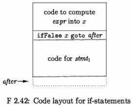

For concreteness, we show the pseudocode for class *If* in Fig. 2.43. 

``` java
class If extends Stmt { 
    Expr E; Stmt S;
    public If(Expr x, Stmt y) { 
        E = x; S = y; after = newlabel(); 
    } 
    public void gen() {
        Expr n = E.rvalue();
        emit("ifFalse " + n.toString() 
                + " goto " + after); 

        //to generate three-address code
        //for this kind of statement
        S.gen();
        emit(after+ ":");
    } 
}
```

The constructor *If* in Fig. 2.43 creates syntax-tree nodes for if-statements. 
The constructor also assigns attribute *after* a unique new label, by calling function newlabel() , which is used for jumping.

Once the entire syntax tree for a source program is constructed, the function *gen* is called at the root of the syntax tree. 

Since a program is a block in our simple language, the root of the syntax tree represents the sequence of statements in the block. *All statement classes contain a function gen*.

In this example, function *gen* calls *E.rvalue*() to translate the expression *E* and saves the result node returned by *E*.  Translation of expressions will be discussed shortly. Function *gen* then emits a conditional jump and calls S.gen() to translate the substatement S.

<h2 id="1b4f954d64e096fe675d68b0988fa58a"></h2>

#### Translation of Expressions

We now illustrate the translation of expressions by considering expressions con­taining binary operators **op**, array accesses, and assignments, in addition to constants and identifiers. For simplicity, in an array access y[z] , we require that y be an identifier. For a detailed discussion of intermediate code generation for expressions, see Section 6.4.

We shall take the simple approach of generating one three-address instruc­tion for each operator node in the syntax tree for an expression. 

No code is generated for identifiers and constants, since they can appear as addresses in instructions. If a node *x* of class *Expr* has operator **op**, then an instruction is emitted to compute the value at node *x* into a compiler generated "temporary" name, say *t*. Thus, i-j+k translates into two instructions

```
    t1 = i - j 
    t2 = t1 + k
```

With array accesses and assignments comes the need to distinguish between l-values and r-values. 

For example, 2*a[i] can be translated by computing the r-value of a[i] into a temporary, as in

```
    t1 = a[i] 
    t2 = 2 * t1
```

But if a [i] appears on the left side of an assignment, we cannot simply use a temporary in place of a[i] . 

The simple approach uses the two functions lvalue and rvalue. 

- When function rvalue is applied to a nonleaf node x, it generates instructions to compute x into a temporary, and returns a new node representing the temporary. 
- When function lvalue is applied to a nonleaf, it also generates instructions to compute the subtrees below x, and returns a node representing the "address" for x .

```java
Expr lvalue( x : Expr) {
    // if node is for an identifier
    if ( x is an Id node ) return x ;
    else if ( x is an Access (y, z) node 
            and y is an Id node ) {
        return new Access(y, rvalue(z)); 
    }
    else error;
}
```

Figure 2.44: Pseudocode for function lvalue

- When applied to a node x, function lvalue simply returns x if it is the node for an identifier.
- In this case, x will have the form Access(y,z), where class *Access* is a subclass of *Expr*, 
     - y represents the name of the accessed array, 
     - and z represents the offset (index) of the chosen element in that array.  
- function lvalue calls rvalue(z) to generate instructions, if needed, to compute the r-value of z
- function lvalue then constructs and returns a new Access node with children for the array name y and the r-value of z.

Example 2.19 : When node x represents the array access a[2\*k] , the call lvalue(x) generates an instruction `t = 2 * k` and returns a new node x' representing the l-value a[t] , where *t* is a new temporary name.

In detail, the code fragment `return new Access (y, rvalue(z)); ` is reached with 

    - y being the node for a 
    - and z being the node for expression 2\*k. 

The call rvalue(z) generates code for the expression 2\*k and returns the new node z' representing the temporary name t. 

Function *rvalue* in Fig. 2.45 generates instructions and returns a possibly new node.

```java
Expr rvalue(x : Expr) {
    if ( x is an Id or a Constant node ) return X; 
    else if (x is an Op(op,y,z) or a Rel(op,y,z) node) {
        t = new temporary;
        emit string for t = rvalue(y) op rvalue(z) ; 
        return a new node for t;
    }
    else if ( x is an Access (y, z) node ) { 
        t = new temporary;
        call lvalue(x) , which returns Access (y, z') ; 
        emit string for t = Access(y,z');
        return a new node for t;
    }
    else if ( x is an Assign (y, z) node ) { 
        z' = rvalue(z) ;
        emit string for lvalue(y) = z'; 
        return z' ;
    } 
}
```

Figure 2.45: Pseudocode for function rvalue

- When x represents an identifier or a constant, rvalue returns x itself. 
- In all other cases, it returns an Id node for a new temporary t. 

The cases are as follows:

- When x represents y **op** z, the code first computes y' = rvalue(y) and z' = rvalue(z). It creates a new temporary t and generates an instruction t = y' **op** z'. It returns a node for identifier t.
- When x represents an array access y[z], we can reuse function *lvalue*. The call lvalue(x) returns an access y[z'] , where z' represents an identifier holding the offset for the array access. The code creates a new temporary t, generates an instruction based on t = y[z'] , and returns a node for t .
- When x represents y = z, then the code first computes z' = rvalue(z). It generates an instruction based on lvalue(y) = z' and returns the node z'.

Example 2.20 : When applied to the syntax tree for

```java
    a[i] = 2*a[j-k]
```

function *rvalue* generates

```
    t3 = j - k
    t2 = a[t3] 
    t1 = 2 * t2 
    a[i] = t1
```

- the root is an *Assign* node with a[i] and 2*a[j -k] .
- Thus, the third case applies, function *rvalue* recursively evaluates 2*a[j-kJ.
     - subtree is the *Op* node for *
         - which causes a new temporary t1 to be created
         - constant 2 generates no three-address code, and its r-value is returned as a Constant node with value 2.
         - a[j-k] is an Access node, which causes a new temporary t2 to be created, before function lvalue is called on this node
- Recursively, rvalue is called on the expression j - k
     - As a side-effect of this call, the three­ address statement t3 = j - k is generated
- Then, returning to the call of lvalue on a[j -k] , the temporary t2 is assigned the r-value of the entire access-expression, that is, t2 = a [ t3 ] .
- Now, we return to the call of *rvalue* on the *Op* node 2*a [j -k] , which earlier created temporary t1 . A three-address statement t1 = 2 * t2 is generated as a side-effect.
- Last, the call to rvalue on the whole expression completes by calling *lvalue* on the left side a[iJ and then generating a three-address instruction a[i] = t1.

<h2 id="db95f2e74506a3daa31c97e26bf78cc6"></h2>

#### Better Code for Expressions

We can improve on function *rvalue* in Fig. 2.45 and generate fewer three-address instructions, in several ways:

- Reduce the number of copy instructions in a subsequent optimization phase. 
     - For example, the pair of instructions `t = i+1` and `i = t` can be combined into `i = i+ 1` , if there are no subsequent uses of t .
- Generate fewer instructions in the first place by taking context into ac­count. 
     - For example, if the left side of a three-address assignment is an array access a[t] , then the right side must be a name, a constant, or a temporary, all of which use just one address. But if the left side is a name x, then the right side can be an operation y **op** z that uses two addresses.

We can avoid some copy instructions by modifying the translation functions to generate a partial instruction that computes, say j+k, but does not commit to where the result is to be placed, signified by a null address for the result:

```java
    null = j + k     (2.8)
```

The null result address is later replaced by either an identifier or a temporary, as appropriate. 

If j+k is on the right side of an assigriment, as in `i=j+k ;` , *null* is replaced by an identifier. 

```java
    i = j + k
```

But, if j+k is a subexpression, as in `j+k+1`, then the null result address in is replaced by a new temporary t, and a new partial instruction is generated

```java
    t = j + k
    null = t + 1
```

---


---

  [1]: ../imgs/Compiler_F2.15.png

