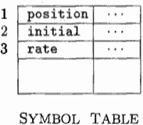

...menustart

- [Chapter 1 Introduction](#ae6212de98066cfe7c4f284fb7bb0795)
    - [1.2 The Structure of a Compiler](#63ae37c8857aa96df730388676adc2ca)
        - [1.2.1 Lexical Analysis](#57d98a0f3632f4cb940598f6256ecdfc)
        - [1.2.2 Syntax Analysis](#fb2142e810f2e9a15030f6d78c437bae)
        - [1.2.3 Semantic Analysis](#7789dd8d5a08e6298027a099409c1443)
        - [1.2.4 Intermediate Code Generation](#2a40a73e86de0c4274e59ac45cef1f7b)
        - [1.2.5 Code Optimization](#5b9a8770c747a97b075151171355ecb8)
        - [1.2.6 Code Generation](#f867ceceefb3b47936eac11f9a2e08cd)
        - [1.2.7 Symbol-Table Management](#f0b723a9df83685761f99355086abeda)
        - [1.2.8 The Grouping of Phases into Passes](#0cceed88f71885842f77f164b25c71cc)
        - [1.2.9 Compiler-Construction Tools](#57b05cd7416d7b9ca9b6f8a630f258c3)
    - [1 .3 The Evolution of Programming Languages](#b47c0652562ded5280a48bb68a3745ac)

...menuend


<h2 id="ae6212de98066cfe7c4f284fb7bb0795"></h2>


# Chapter 1 Introduction

<h2 id="63ae37c8857aa96df730388676adc2ca"></h2>


## 1.2 The Structure of a Compiler

- analysis
    - The ***analysis*** part breaks up the source program into constituent pieces and imposes a grammatical structure on them 
    - It then uses this structure to create an intermediate representation of the source program.
    - If it detects that the source program is either syntactically ill formed or semantically unsound, then it must provide informative messages
    - The analysis part also collects information about the source program and stores it in a data structure called a ***symbol table***, which is passed along with the intermediate representation to the synthesis part.
- synthesis
    - The ***synthesis*** part constructs the desired target program from the intermediate representation and the information in the symbol table. 
    - The symbol table, which stores information about the entire source program, is used by all phases of the compiler.
    - The analysis part is often called the *front end* of the compiler; the synthesis part is the *back end*. 


<h2 id="57d98a0f3632f4cb940598f6256ecdfc"></h2>


### 1.2.1 Lexical Analysis

- The first phase of a compiler is called ***lexical analysis*** or ***scanning***
    - lexical analysis groups source code characters into meaningful sequences called *lexemes*.
    - For each lexeme, the lexical analyzer produces as output a token of the form 
        - < token-name, attribute-value >
        - the 1st component *token-name* is an abstract symbol that is used during syntax analysis
        - the 2nd component *attribute-value* points to an entry in the symbol table for this token
        - Information from the symbol-table entry is needed for semantic analysis and code generation

For example: 

```
position = initial + rate * 60
```

 1. position is a lexeme that would be mapped into a token < id, 1 >, where id is an abstract symbol standing for identifier and 1 points to the symbol table entry for position.
    - The symbol-table entry for an identifier holds information about the identifier, such as its name and type. 
 2. The assignment symbol = is a lexeme that is mapped into the token < = > . Since this token needs no attribute-value, we have omitted the second component. 
    - We could have used any abstract symbol such as *assign* for the token-name, but for notational convenience we have chosen to use the lexeme itself as the name of the abstract symbol.
 3. initial is a lexeme that is mapped into the token < id,2 > , where 2 points to the symbol-table entry for initial.
 4. + is a lexeme that is mapped into the token < + >.
 5. rate is a lexeme that is mapped into the token < id, 3 > , where 3 points to the symbol-table entry for rate.
 6. \* is a lexeme that is mapped into the token < \* >.
 7. 60 is a lexeme that is mapped into the token < 60 >
    - Technically speaking, for the lexeme 60 we should make up a token like < number, 4 > , but we shall defer the discussion of tokens for numbers until Chapter 2.


Blanks separating the lexemes would be discarded by the lexical analyzer.

After lexical analysis as the sequence of tokens 

```
<id, 1> <=> <id, 2> <+> <id, 3> <*> <60>
```

![][1] 


<h2 id="fb2142e810f2e9a15030f6d78c437bae"></h2>


### 1.2.2 Syntax Analysis

The second phase of the compiler is ***syntax analysis*** or ***parsing***. 

- The parser create a tree-like intermediate representation that depicts the grammatical structure of the token stream. 
     - by using the first components of the tokens produced by the lexical analyzer
- A typical representation is a ***syntax tree*** 
     - in which each interior node represents an operation 
     - and the children of the node represent the arguments of the operation. 
- A syntax tree for the token stream is shown as :

![][1.5]

This tree shows the order in which the operations in the assignment `position = initial + rate * 60` are to be performed.

- The tree has an interior node labeled * with (id, 3) as its left child and the integer 60 as its right child. 
     - The node (id, 3) represents the identifier *rate*. 
     - The node labeled * makes it explicit that we must first multiply the value of *rate* by 60. 
     - The node labeled + indicates that we must add the result of this multiplication to the value of *initial*. 
     - The root of the tree, labeled =, indicates that we must store the result of this addition into the location for the identifier *position*. 
- This ordering of operations is consistent with the usual conventions of arithmetic which tell us that multiplication has higher precedence than addition, and hence that the multiplication is to be performed before the addition.


The subsequent phases of the compiler use the grammatical structure to help analyze the source program and generate the target program. 

- context-free grammars
- syntax-directed definitions 


<h2 id="7789dd8d5a08e6298027a099409c1443"></h2>


### 1.2.3 Semantic Analysis

- The ***semantic analyzer*** checks the source program for semantic consistency with the language definition.  
     - by using the syntax tree and the information in the symbol table
- It also gathers type information and saves it in either the syntax tree or the symbol table
     - for subsequent use during intermediate-code generation.
- An important part of semantic analysis is ***type checking***, where the compiler checks that each operator has matching operands. 
     - For example, many program­ming language definitions require an array index to be an integer the compiler must report an error if a floating-point number is used to index an array.
- The language specification may permit some type conversions called ***coer­cions*** (强制转换). 
     - For example, a binary arithmetic operator may be applied to either a pair of integers or to a pair of floating-point numbers. 
     - If the operator is applied to a floating-point number and an integer, the compiler may convert or coerce the integer into a floating-point number.

![][2]

- Suppose that position, initial, and rate have been declared to be floating-point numbers
- and that the lexeme 60 by itself forms an integer
- The type checker discovers that the operator * is applied to a floating-point number *rate* and an integer 60
- In this case, the integer may be converted into a floating-point number
- notice that the output of the semantic analyzer has an extra node for the operator inttofloat, which explicitly converts its integer argument into a floating-point number


<h2 id="2a40a73e86de0c4274e59ac45cef1f7b"></h2>


### 1.2.4 Intermediate Code Generation

- In the process of translating a source program into target code, a compiler may construct one or more intermediate representations
     - which can have a variety of forms. 
- Syntax trees are a form of intermediate representation; 
     - they are commonly used during *syntax and semantic analysis*.
- After syntax and semantic analysis of the source program, many compil­iers generate an explicit low-level or machine-like intermediate representation
     - which we can think of as a program for an abstract machine. 
     - This intermedi­ate representation should have two important properties: 
         - it should be easy to produce and it should be easy to translate into the target machine.
- In Chapter 6, we consider an intermediate form called ***three-address code*** which consists of a sequence of assembly-like instructions with 3 operands per instruction. 
     - Each operand can act like a register. 

![][2.5]

There are several points worth noting about three-address instructions. 

- First, each three-address assignment instruction has at most one operator on the right side. 
     - Thus, these instructions fix the order in which operations are to be done;
     - the multiplication precedes the addition in the source program. 
- Sec­ond, the compiler must generate a temporary name to hold the value computed by a three-address instruction. 
- Third, some "three-address instructions" like the first and last , have fewer than three operands.


<h2 id="5b9a8770c747a97b075151171355ecb8"></h2>


### 1.2.5 Code Optimization

- The machine-independent code-optimization phase attempts to improve the intermediate code so that better target code will result. 
     - Usually better means faster, but other objectives may be desired, such as shorter code, or target code that consumes less power. 

![][3]

- A simple intermediate code generation algorithm followed by code optimiza­tion is a reasonable way to generate good target code. 
     - The optimizer can deduce that the conversion of 60 from integer to floating point can be done once and for all at compile time
     - so the *inttofloat* operation can be eliminated by replacing the integer 60 by the floating-point number 60.0. 
     - Moreover, t3 is used only once to transmit its value to id1 so the optimizer can transform into the shorter sequence.


<h2 id="f867ceceefb3b47936eac11f9a2e08cd"></h2>


### 1.2.6 Code Generation

- The code generator takes as input , an intermediate representation of the source program 
- and maps it into the target language. 
- If the target language is machine code, registers or memory locations are selected for each of the variables used by the program. 
- Then, the intermediate instructions are translated into sequences of machine instructions that perform the same task. 
- A crucial aspect of code generation is the judicious assignment of registers to hold variables.

![][3.5]

For example, using registers R1 and R2.

- The first operand of each instruction specifies a destination. 
- The F in each instruction tells us that it deals with floating-point numbers. 
- The code loads the contents of address id3 into register R2, 
- then multiplies it with floating-point constant 60.0. 
     - The # signifies that 60.0 is to be treated as an immediate constant. 
- The third instruction moves id2 into register R1 
- and the fourth adds to it the value previously computed in register R2. 
- Finally, the value in register R1 is stored into the address of id1

This discussion of code generation has ignored the important issue of stor­age allocation for the identifiers in the source program. As we shall see in Chapter 7, the organization of storage at run-time depends on the language be­ing compiled. Storage-allocation decisions are made either during intermediate code generation or during code generation.


<h2 id="f0b723a9df83685761f99355086abeda"></h2>


### 1.2.7 Symbol-Table Management

- An essential function of a compiler is to record the variable names used in the source program and collect information about various attributes of each name. 
- These attributes may provide information about the storage allocated for a name
     - its type, its scope (where in the program its value may be used), and in the case of procedure names, 
     - such things as the number and types of its arguments, 
     - the method of passing each argument (for example, by value or by reference), and the type returned.

- The symbol table is a data structure containing a record for each variable name, with fields for the attributes of the name.
     - The data structure should be designed to allow the compiler to find the record for each name quickly 
     - and to store or retrieve data from that record quickly. 

<h2 id="0cceed88f71885842f77f164b25c71cc"></h2>


### 1.2.8 The Grouping of Phases into Passes

- The discussion of phases deals with the logical organization of a compiler. 
- In an implementation, activities from several phases may be grouped together into a pass that reads an input file and writes an output file. 
     - For example, the front-end phases of lexical analysis, syntax analysis, semantic analysis, and intermediate code generation might be grouped together into one pass. 
     - Code optimization might be an optional pass. 
     - Then there could be a back-end pass consisting of code generation for a particular target machine.

- Some compiler collections have been created around carefully designed in­ termediate representations that allow the front end for a particular language to interface with the back end for a certain target machine. 
- With these collections, we can produce compilers for different source languages for one target machine by combining different front ends with the back end for that target machine. 
- Similarly, we can produce compilers for different target machines, by combining a front end with back ends for different target machines.


<h2 id="57b05cd7416d7b9ca9b6f8a630f258c3"></h2>


### 1.2.9 Compiler-Construction Tools


These tools use specialized languages for specifying and implementing spe­cific components, and many use quite sophisticated algorithms. 

The most suc­cessful tools are those that hide the details of the generation algorithm and produce components that can be easily integrated into the remainder of the compiler. Some commonly used compiler-construction tools include:

 1. ***Parser generators*** that automatically produce syntax analyzers from a grammatical description of a programming language.
 2. ***Scanner generators*** that produce lexical analyzers from a regular-expres­sion description of the tokens of a language.
 3. ***Syntax-directed translation engines*** that produce collections of routines for walking a parse tree and generating intermediate code.
 4. ***Code-generator generators*** that produce a code generator from a collection of rules for translating each operation of the intermediate language into the machine language for a target machine.
 5. ***Data-flow analysis engines*** that facilitate the gathering of information about how values are transmitted from one part of a program to each other part. Data-flow analysis is a key part of code optimization.
 6. ***Compiler-construction toolkits*** that provide an integrated set of routines for constructing various phases of a compiler.


<h2 id="b47c0652562ded5280a48bb68a3745ac"></h2>


## 1 .3 The Evolution of Programming Languages


---


--- 

  [1]: ../imgs/compile_translation.png
  
  [1.5]: ../imgs/compile_translation1.5.png
    
  [2]: ../imgs/compile_translation2.png
    
  [2.5]: ../imgs/compile_translation2.5.png

  [3]: ../imgs/compile_translation3.png


  [3.5]: ../imgs/compile_translation3.5.png
