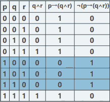

...menustart

 - [discrete mathematics](#e95be6b29ba71136af3ef5c51a47b384)
 - [week1: 数理逻辑 基本概念](#a7dcf83ed911002a62a2b83c7dd7d0ad)
     - [命题  proposition](#c324121526e57fbd30dcdf9ebf7fc124)
         - [命题三要点](#15237e3d71ba5375a4d09ab9bb773772)
         - [识别命题](#c0cc5991ad03041d84848b663e4eb819)
     - [排中律](#2e8c05cea44ea669ed52a6fd7825f44d)
         - [反证法与排中律](#0511966d4c2d8a42fa29735e5fd91d21)
     - [命题符号化](#074d05c07f9a8fd2b825a5716150d787)
         - [原子命题 和 复合命题](#cbe41c9691083bc381a2f1c8b7fc4504)
     - [复合命题](#7cace869f7d2cab3e70c39376e3d9984)
     - [联结词（上）](#e16a8f84b840da18a4a0b0a68fb0bed4)
     - [联结词（下）](#fc4eafd7b4965563c0047a48079e5f4b)
     - [命题公式 proposition formula](#74cde4f9c2f5910e8cffc05e7d63885f)
         - [逻辑联结词优先级](#8deb4b4b8ccc0bd6527dc123f0b7537a)
         - [命题公式的意义](#a052f905b27a57b3c1d8f63c9d91ef7b)
     - [真值函数（truth function）](#f2a87ed1c0374b08a0612fe38bea4743)
         - [命题公式与真值函数（truth function）](#3accbabae5e9d8a8a212d67bc6c2777b)
         - [赋值 assignments](#a7dc4e733ed8109e703004474e7864f3)
         - [真值表](#24ec8bd17643f349b87300b59d54d873)
     - [命题形式化](#cb8a24d9469f9649247877488f234618)
         - [注意事项](#1bbbb204023e59eba03319c7c5848fd1)

...menuend

<h2 id="e95be6b29ba71136af3ef5c51a47b384"></h2>

# discrete mathematics

<h2 id="a7dcf83ed911002a62a2b83c7dd7d0ad"></h2>

# week1: 数理逻辑 基本概念

<h2 id="c324121526e57fbd30dcdf9ebf7fc124"></h2>

## 命题  proposition

<h2 id="15237e3d71ba5375a4d09ab9bb773772"></h2>

### 命题三要点

 1. 陈述句
 2. 判断
 3. 确定的对象

--- 

 - x+y < 10  不是命题，因为x,y是变量，不确定

<h2 id="c0cc5991ad03041d84848b663e4eb819"></h2>

### 识别命题

 - 下面哪个是命题？
    - [x] 来北京我请吃烤鸭 
    - [ ] 你哪天来北京？
    - [ ] 北京欢迎你！
    - [ ] 来北京的话，建议你穿上秋裤。

 - 真值是命题的固有属性
 - 不过，是否知道真值，能否知道真值是另一回事
 - 悖论（自相矛盾）不能作为命题。如“这句话是错的”
 - 命题非真即假，不能兼有之，也不能不真不假
 - 非真即假，是一个基本假设？

<h2 id="2e8c05cea44ea669ed52a6fd7825f44d"></h2>

## 排中律

 - 这种关于 非真即假的 基本假设， 就称之为 排中律
 - 排中律是传统逻辑的基本规律之一
    - “是非之间，必居其一”。
    - 任一事物在同一时间里具有某属性或者不具 有某种属性，而无其它可能
    
<h2 id="0511966d4c2d8a42fa29735e5fd91d21"></h2>

### 反证法与排中律

 - 传统数学证明中经常采用的“反证法”即利 用了排中律：
    - 要证明一个命题为真，并不直接证明；
    - 而是假设命题不为真，推出矛盾；
    - 根据排中律，此命题非假，即真；
    - 从而间接证明命题为真。
 - 反证法的著名范例
    - 欧几里德：素数有无穷多个
        - 构造一个新的素数: a₁\*a₂\*...an +1
    - √2 是无理数

<h2 id="074d05c07f9a8fd2b825a5716150d787"></h2>

## 命题符号化

<h2 id="cbe41c9691083bc381a2f1c8b7fc4504"></h2>

### 原子命题 和 复合命题

 - 2是偶数而且3也是偶数
    - 这是由两个小命题和一个“而且”连接而成
    - 联结词“而且”将两个命题组合成新命题， 并产生了新的真值
 - 这样，我们有了三个新概念：
    1. 逻辑联结词(logical connectives)：连接 命题，对真值进行运算的词；
    2. 原子命题(atom proposition)：不含有逻辑联结词的命题
    3. 复合命题(compound proposition)：包含了原子命题和逻辑联结词的命题。
 
<h2 id="7cace869f7d2cab3e70c39376e3d9984"></h2>

## 复合命题

 - 复合命题例子
    - 雪**不**是白的
    - 今晚我去看书**或者**看电影
    - 你去了教室，我去了食堂 (省略了 **且**
    - **如果**天气好**那么**我去接你  
        - 假设条件
    - 偶数a是素质**当且仅当** a=2
 - 数理逻辑创立的初衷
    - 对逻辑和思维过程进行形式化，使之象算术那样简单明了，确切无误。
 - 如何把命题变成“算式”？
    - 形式化的第一步**抽象**abstraction)：
        - 仅关注**命题**的本质属性**真值**而抛弃其丰富的内涵；
        - 仅关注**逻辑联结词**的本质属性：对真值的**运算**而抛弃多变的语言表达方式。
    - 然后是将这两者都变成**符号**以规则相连接
        - 真命题用**t**表示，假命题用**f**表示
        - 原子命题一般用**p, q, r, s** 或 **pᵢ, qᵢ, rᵢ, sᵢ**表示
        - 逻辑联结词用特殊符号来表示：
            - not : ¬
            - and : ^ , or : v
            - if then : →
            - iff : ↔︎ 
 - 符号的定义
    - 命题的**真值**
        - 为真(true)用1表示，为假(false)用0表示
        - 真命题的真值为1，假命题真值为0
        - 逻辑联结词用**真值表**来定义
        - 真值表列出了原子命题的真值组合（0、1）, 以及经过联结词作用后的真值

<h2 id="e16a8f84b840da18a4a0b0a68fb0bed4"></h2>

## 联结词（上）

 - not ¬
    - ¬p的逻辑关系为p不成立
    - 如果p表示命题“雪是白的”，那么“雪不 是白的”应该表示为¬p 
    - 注意在包含多个对象判断的命题否定时，其 意义的变化：
        - “天鹅都是白的”，其否定并不是“天鹅都 不是白的”
        - 而是“天鹅不都是白的”或“并非所有天鹅都是白的”
 - and ^
 - or  v
    - 自然语言中的“或”可以符号化为v，但有 时要注意原命题中的“或”可能表示**排斥性** 选择： 
    - 李四学过德语或法语（相容或）: pvq
        - p:李四学过德语，q:李四学过法语  
    - 张三生于1972年或1973年（排斥或）：pvq
        - p:张三生于1972年，q:张三生于1973年
    - 人固有一死，或重于泰山，或轻于鸿毛（排斥或）
        - (p∧¬q)∨(¬p∧q)： (精确表达 异或)
        - p:人死重于泰山，q:人死轻于鸿毛

<h2 id="fc4eafd7b4965563c0047a48079e5f4b"></h2>

## 联结词（下）

 - if then  → 
    - 蕴含词 implication
    - p→q的逻辑关系是，p是q的充分条件，或者说q是p的必要条件 
    - 非异或

---

 p | q | p→q
--- | --- | ---
0 | 0 | 1
0 | 1 | 1
1 | 0 | 0 
1 | 1 | 1 

---

 - p→q中的 p称作**蕴涵前件**q称作**蕴涵后件**
 - 自然语言中的许多条件连接词都可以符号化 为→，但是要注意条件的**顺序**
    - “只要…就…”，“如果…那么…”  : 充分
    - “只有…才…”  : 必要
 - 自然语言中，条件语句一般都具有内在的联系，而数理逻辑中的蕴涵则仅是命题的一种**连接**不一定**具有什么**内在联系**
 - 在蕴涵式中，只有p为真q为假时，p→q才 为假
    - 和(¬p∨q)真值表相同
 - example
    - 如果天气好，那么我去接你：p→q
        - p: 天气好，q: 我去接你
        - 只有p真q假算是食言
    - 只要2是偶数，雪就是黑的： p→q
        - p: 2是偶数，q: 雪是黑的
        - p为真，q为假，本命题为假
        - 这里p,q 并没有内在联系
    - 只有天黑了，夜猫子才出来活动： p→q
        - 注意：p: 夜猫子出来活动，q: 天黑了
        
---

 - if and only if: ↔︎
    - 双向蕴含词（two-way implication）
    - p↔q的逻辑关系是p与q互为充分必要条件
    - 在p，q真值相同的情况下， p ↔q为真

---

 p | q | p↔︎q
--- | --- | ---
0 | 0 | 1
0 | 1 | 0
1 | 0 | 0
1 | 1 | 1 

---

 - 例子
    - 圆1和圆2面积相等当且仅当它们的半径相等：p↔︎q 
        - p: 圆1和圆2面积相等，q: 圆1和圆2半径相等
        - 不管p和q的真值如何， p↔q为真
    - 2+3=5 当且仅当5是有理数：p↔q
        - p：2+3=5，q：5是有理数
    - 除非网断了，否则他一定QQ在线：p ↔¬q
        - p:网断了，q:他QQ在线
 - 两个组合的例子
    - 如果3是合数，则4是素数，并且如果 4是素数，则它不能被2整除：
        - p: 3是合数
        - q: 4是素数
        - r: 4能被2整除
        - (p→q)∧(q→¬r)
    - 如果2+3>5当且仅当5是合数，则2 和3都是有理数
        - p: 2+3>5
        - q: 5是合数
        - r: 2是有理数
        - s: 3是有理数
        - (p↔q)→(r∧s)

--- 

 - 符号组合的规则
    - 把符号组合起来，看起来开始象一个 算式了
    - 算式的组合不是随意的；
    - 那么逻辑符号组合的规则是什么？
    - 逻辑符号组合成的算式具有什么意义？

---

<h2 id="74cde4f9c2f5910e8cffc05e7d63885f"></h2>

## 命题公式 proposition formula

 - proposition formula 的组成成分
    - 命题常元（proposition constants）
        - 表示**具体**命题及表示常命题的p, q, r, s 等和t,f
    - 命题变元（proposition variables）
        - 以“真，假”或者“1，0”为取值范围的 **变量**仍用p, q, r, s等表示
    - 命题公式（proposition formula）
        - 由命题常元、变元和联结词组成的形式更为 复杂的命题

 - 命题公式（ proposition formula ）定义
    1. 命题常元和命题变元 本身就是是 命题公式，特别的称作原子公式或原子
    2. 如果A,B是命题公式，那么(¬A), (A∧B), (A∨B), (A→B), (A↔B)也是命题公式
        - 注意 括号 也是命题公式的一部分
        - p→r∧s 严格按照定义的话 不是命题公式， 因为缺少括号
        - 严格按照定义的命题公式太繁琐，简化约定
            - 公式最外层的括号一律可以省略
            - 约定逻辑联结词的优先级，进一步减少括号
                - 确定了优先级后， p→r∧s 就是一个合法的 命题公式了
    3. 只有**有限步**引用上述两条所组成的符号串是**命题公式**

 - 命题公式简称做公式，采用大写A,B,C等表示
    - 注意大小写符号的差别（A、B、C和p、q、r、s、t、f）
 - 命题公式的这种定义方法称作**归纳定义**在集合论中将会详细讨论归纳定义
 
<h2 id="8deb4b4b8ccc0bd6527dc123f0b7537a"></h2>

### 逻辑联结词优先级

 - 联结词{¬,∧,∨,→,↔}中， ¬是**一元**联结词， 其它都是连接两个命题的**二元**联结词
 - 我们定义优先级为：¬, [∧∨], →, ↔
 - 除非有括号，否则按照优先级从高到低，从 左到右的次序结合
    - ¬p∨q 等同于 ((¬p)∨q)
    - p→q∧r→s 并不是 ((p→q)∧(r→s)) , 其实是 ((p→(q∧r))→s)
  

<h2 id="a052f905b27a57b3c1d8f63c9d91ef7b"></h2>

### 命题公式的意义

 - 命题公式是一个按照**归纳定义**构成的 字符串
 - 其**形式上**具有既定的规则
 - 那么其**内容上**具有什么意义呢？

---

<h2 id="f2a87ed1c0374b08a0612fe38bea4743"></h2>

## 真值函数（truth function）

<h2 id="3accbabae5e9d8a8a212d67bc6c2777b"></h2>

### 命题公式与真值函数（truth function）

 - 如果将联结词看作逻辑**运算符** 那么 包含命题变元p1, p2, …pn的公式A 可以看作是关于p1, p2, …pn的一个**真值函数**
 - 每个变元的取值范围是**0, 1**
 - 真值函数值的取值范围也是**0, 1**

<h2 id="a7dc4e733ed8109e703004474e7864f3"></h2>

### 赋值 assignments

 - 对任意给定的p1, p2, …pn的一种取值状况组合 ， 称为指派或者赋值 （assignments）
 - 赋值用希腊字母α, β等表示
 - 对于每个赋值，公式A均有一个确定 的真值
 - 这样，命题公式在**形式上**是一个规则 的字符串**内容**上则对应一个真值函数

<h2 id="24ec8bd17643f349b87300b59d54d873"></h2>

### 真值表

 - 对于所有可能的赋值，公式A的真值 可以用真值表来确定
 - 当A(p1, p2, …pn)中包含有k个联结 词时，公式A的真值表应为2ⁿ行、 k+n列
 - 前n列是所有变元的取值组合
 - 最后1列是公式A的真值

 - 成真赋值和成假赋值
    - 当公式A对赋值α为真时
    - 称α是A的**成真赋值**或者α**弄真**A
    - 记做**α(A)=1**
    - 反之
    - 称α是A的**成假赋值**或者α**弄假**A , 记做**α(A)=0** 

---

<h2 id="cb8a24d9469f9649247877488f234618"></h2>

## 命题形式化

 - 由自然语言表述的命题，经过**抽象** 可以**形式化**为命题公式
    - 首先确定**原子命题**
    - 其次确定**联结词**
    - 最后处理命题之间的**联结关系及顺序**
 - example
    - 无论是否下雨，我都去上学（p：天下雨，q：我去上学）
        - (p→q)∧(¬p→q)
        - 或 (p∧q)∨(¬p∧q)
        - 或 q

<h2 id="1bbbb204023e59eba03319c7c5848fd1"></h2>

### 注意事项

 - 要善于确定 **原子命题**如兄弟这个概念就无 需进一步拆分；
 - 要善于识别自然语言中的**联结词** ；
 - 对于涉及多个对象进行否定的**否定词位置**要 准确；
 - 不能省略必要的**括号**另外，为了提高公式 的可读性，要保留一些括号；
 - 有时候语句的形式化结果不是**唯一的**可能 具有不同形式，但是逻辑上是等价的。

