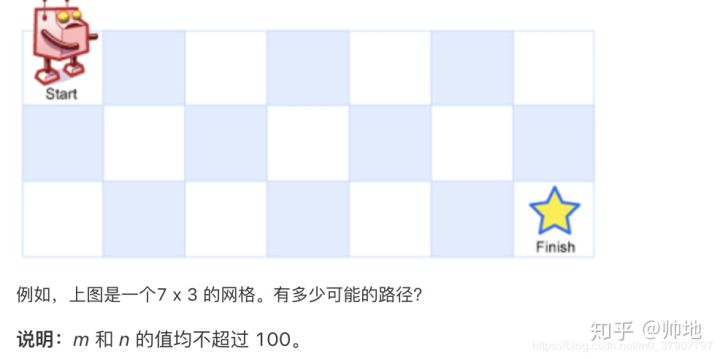

[](...menustart)

- [动态规划](#8c05890ac8f93d0195f884f1ff4656ec)
- [案例](#cf3e26640644d1c04f989d452a8ba6ec)
    - [1. 简单的一维 DP](#4019d92978975eb356127f66036ac429)
    - [2. 二维数组的 DP](#0c0416a053451eba7782d60db372272d)
    - [3. 二维数组 DP](#2af328afff928220744afcbbbb2b534f)
    - [4. 编辑距离](#7b6f4783e17a0ebb99680246eb322746)

[](...menuend)


<h2 id="8c05890ac8f93d0195f884f1ff4656ec"></h2>

# 动态规划

[原贴](https://zhuanlan.zhihu.com/p/91582909)

动态规划，无非就是利用历史记录，来避免我们的重复计算。 而这些历史记录，我们得需要一些变量来保存，一般是用一维数组或者二维数组来保存。

动态规划的三大步骤:

1. 定义数组元素的含义
    - 上面说了，我们会用一个数组，来保存历史数组，假设用一维数组 dp[] 吧。这个时候有一个非常非常重要的点，就是规定你这个数组元素的含义，例如你的 dp[i] 是代表什么意思？
2. 找出数组元素之间的关系式
    - 有一点类似于归纳法。 
    - 也就是可以利用历史数据来推出新的元素值，所以我们要找出数组元素之间的关系式，
    - 例如 dp[n] = dp[n-1] + dp[n-2] , 等等
    - 最难，最关键的一步
3. 找出初始值
    - dp[3] = dp[2] + dp[1]。而 dp[2] 和 dp[1] 是不能再分解的了，所以我们必须要能够直接获得 dp[2] 和 dp[1] 的值，就是所谓的**初始值**. 
    - 很多时候，初始值 在第二步做归纳的时候，就顺便求出了

有了初始值, 并且有了数组元素之间的关系式, 就能计算出 dp[n], 问题就得到解决了。

动态规划通常采用以下两种方式中的一种:
1. 自顶向下
    - 将问题划分为若干子问题，求解这些子问题并保存结果以免重复计算。
    - 该方法将递归和缓存结合在一起
2. 自下而上
    - 先行求解所有可能用到的子问题，然后用其构造更大问题的解。

> 80% 的动态规划题都可以画图，其中 80% 的题都可以通过画图一下子知道怎么优化。

<h2 id="cf3e26640644d1c04f989d452a8ba6ec"></h2>

# 案例

<h2 id="4019d92978975eb356127f66036ac429"></h2>

## 1. 简单的一维 DP

问题描述：一只青蛙一次可以跳上1级台阶，也可以跳上2级。求该青蛙跳上一个n级的台阶总共有多少种跳法。

1. 定义数组元素的含义
    - 定义 dp[i] 的含义为：**跳上一个 i 级的台阶总共有 dp[i] 种跳法**. 
2. 找出数组元素间的关系式
    - 可知，青蛙到达第 n 级的台阶有两种方式 
        1. 从 第n-1阶 跳上来
        2. 从 第n-2阶 跳上来
    - dp[n] = dp[n-1] + dp[n-2] 
3. 找出初始条件
    - dp[0] = 0
    - dp[1] = 1
    - dp[2] = 2


```python
def memoize(f):
    memo = {}
    def helper(x):
        if x not in memo:
            memo[x] = f(x)
        return memo[x]
    return helper

@memoize
def steps( n ):
    if n <= 2 :
        return n
    return steps(n-1) + steps(n-2)

print steps(50)  # 20365011074
```

```python
def steps2(n) :
    if n < 2 :
        return n 

    dp = [0]* (n+1)
    # caution: you must initialize dp[0-3] 
    # if you use bottom-top solution
    dp[0] = 0
    dp[1] = 1
    dp[2] = 2
    for i in xrange( 3, n+1 , 1 ) : 
        dp[i] = dp[i-1] + dp[i-2]

    return dp[n]

print steps2(50) # 20365011074
```


<h2 id="0c0416a053451eba7782d60db372272d"></h2>

## 2. 二维数组的 DP

问题描述: 

- 一个机器人位于一个 m x n 网格的左上角 （起始点在下图中标记为“Start” ）。
- 机器人每次只能向下或者向右移动一步。机器人试图达到网格的右下角.
- 问总共有多少条不同的路径？
- 


解题步骤:

1. 定义数组元素的含义
    - 定义 `dp[i][j]`的含义为： **当机器人从左上角走到(i, j) 这个位置时，一共有 `dp[i][j]` 种路径**. 
    - dp[m-1] [n-1] 就是我们要的答案了。
2. 找出关系数组元素间的关系式
    - 机器人移动到某一格， 只能从  上边，或左边的格子移动过来
    - `dp[i][j] = dp[i-1][j] + dp[i][j-1]`
3. 找出初始值
    - 如果 i,j=0, 上面的公式 就会出现数组越界。
    - 事实上，最左边一列的任意格子, 只能从它上边的一格 移动过来，只有1种做法，所以 dp=1 ; 最上面的一行 同理.
        - 唯一列外是 起始点, dp=0, 不过它实际上没有机会参与到计算中来。


```python
def memoize(f):
    memo = {}
    def helper(a,b):
        x = "{},{}".format( a,b )
        if x not in memo:
            memo[x] = f(a,b)
        return memo[x]
    return helper

@memoize
def moveto_aug(m, n):
    if m == 0 or n == 0 :
        if m == n :
            # start point
            # actually it is not used in subsequent calc
            return 0
        return 1   # left column, top row
    return moveto_aug( m-1,n ) + moveto_aug( m, n-1 )

print moveto_aug( 29, 9 )  # 163011640
```

<h2 id="2af328afff928220744afcbbbb2b534f"></h2>

## 3. 二维数组 DP

问题描述: 给定一个包含非负整数的 m x n 网格，请找出一条从左上角到右下角的路径，使得路径上的数字总和为最小。

说明：每次只能向下或者向右移动一步。

```python
输入:
arr = [
  [1,3,1],
  [1,5,1],
  [4,2,1]
]
输出: 7
解释: 因为路径 1→3→1→1→1 的总和最小。
```

和上一题类似，不过是算最优路径和。

1. 定义数组元素的含义
    - 定义 `dp[i][j]`: **当机器人从左上角走到(i, j) 这个位置时，最小的路径和是 dp[i][j]**
    - `dp[m-1][n-1]` 就是答案
2. 找出关系数组元素间的关系式
    - `dp[i][j] = min(dp[i-1][j]，dp[i][j-1]) + arr[i][j];`  // `arr[i][j]` 表示网格种的值
3. 找出初始值
    - `dp[0][j] = dp[0][j-1] + arr[0][j];`
    - `dp[i][0] = dp[i-1][0] + arr[i][0];`


```python
def memoize(f):
    memo = {}
    def helper(p,a,b):
        x = "{},{}".format(a,b )
        if x not in memo:
            memo[x] = f(p, a,b)
        return memo[x]
    return helper

@memoize
def shortestPath( arr, m,n  ) :
    if m == 0 or n == 0 :
        if m == n:
            return arr[m][n]
        elif m == 0 :
            return shortestPath(arr, m ,n-1 ) + arr[m][n]
        else:
            return shortestPath(arr, m-1, n ) + arr[m][n]
    return min(   shortestPath(arr, m ,n-1 ) ,   shortestPath(arr, m-1, n )  ) + arr[m][n]


arr = [
  [1,3,1],
  [1,5,1],
  [4,2,1]
]

print shortestPath(arr, 2, 2 ) #7
```

> O(n*m) 的空间复杂度可以优化成 O(min(n, m)) 的空间复杂度的，不过这里先不讲

<h2 id="7b6f4783e17a0ebb99680246eb322746"></h2>

## 4. 编辑距离

问题描述: 给定两个单词 word1 和 word2，计算出将 word1 转换成 word2 所使用的最少操作数 。

你可以对一个单词进行如下三种操作： 插入一个字符, 删除一个字符, 替换一个字符

```python
示例：
输入: word1 = "horse", word2 = "ros"
输出: 3
解释:
horse -> rorse (将 'h' 替换为 'r')
rorse -> rose (删除 'r')
rose -> ros (删除 'e')
```

还是老样子，按照上面三个步骤来。 并且我这里可以告诉你，90% 的字符串问题都可以用动态规划解决，并且90%是采用二维数组。

1. 定义数组元素的含义
    - 定义 `dp[i][j]`的含义为： **当字符串 word1 的长度为 i，字符串 word2 的长度为 j 时，将 word1 转化为 word2 所使用的最少操作次数为 dp[i][j]**.
2. 找出关系数组元素间的关系式
    - 如果 word1[:i] == word2[:j] ,   那么 `dp[i][j] = dp[i-1][j-1]` 
    - 如果 word1[:i] != word2[:j] ， 那么
        1. 如果 替换word1[i]相等, `dp[i][j] = dp[i-1][j-1] + 1` 
        2. 如果 word1末尾插入字符后相等, `dp[i][j] = dp[i][j-1] + 1` 
        3. 如果 删除word1[i]后相等, `dp[i][j] = dp[i-1][j] + 1` 
    - 所以:
        - `dp[i][j] = min(dp[i-1][j-1]，dp[i][j-1]，dp[[i-1][j]]) + 1;`
3. 找出初始值
    - i,j == 0 的情况，要转换为另外一个字符串，就只能不停的删除，或插入. 


```python
def memoize(f):
    memo = {}
    def helper(w1,w2, a,b):
        x = "{},{},{},{}".format(w1,w2, a,b )
        if x not in memo:
            memo[x] = f(w1,w2, a,b)
        return memo[x]
    return helper

@memoize
def minOps( word1, word2 , i,j ) :
    if i < 0 :
        i = len(word1)
    if j < 0 :
        j = len(word2)

    if i == 0 :
        return j 
    elif j == 0 :
        return i 

    if word1[i-1] == word2[j-1] :
        return minOps( word1,word2, i-1,j-1 )
    else:
        return min( minOps( word1, word2 , i-1, j-1 ), minOps( word1, word2 , i, j-1 ), minOps( word1, word2 , i-1, j )  ) + 1


print minOps(   "horse" , "ros", -1,-1 ) #3
print minOps( "ros" , "horse", -1,-1) #3
print minOps(   "assume" , "assumption", -1,-1  ) #5
```

----


