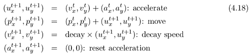
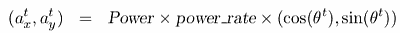

- [球员属性](#eea060c165ca38fc76107f7f70e99b5d)
- [Robot soccer](#bbd8c37b90680c0df9f61f47bcb88ae4)

<h2 id="eea060c165ca38fc76107f7f70e99b5d"></h2>

# 球员属性

- 首先要明白这么几件事
    1. 很多属性是双刃剑，不是高了一定好，只是一种选择
    2. 你的战术也是一种选择，是基于球队属性的顺应时势的选择
- 属性
    - 决断
        - 低了，拿球后犹豫不决，容易被压迫丢球
    - 镇定
        - 在双方后场靠近球门的地方，镇定低 容易表现不好
    - teamwork
        - 低了
            - 适合阵型 宽短展开的宽
            - 打反击效果更好
            - 直穿效果更好
    - 工作投入
        - 低了，跑动不积极，一些无主球不追
    - 体重
        - 低
            - 跑的快 (所以体重高的不适合盯人)
            - 拼抢，高空球和无主球，争抢不过，但是 体重重的，控球容易被断
            - 适合长传冲吊
    - 强壮
        - 高
            - 远射更有力量
            - 抢高空球优势
            - 强壮不会影响速度 
    - 无球跑动
    - 预判
        - 防守端： 预判高 提前判断上前抢断
    - 侵略性
        - 低了，不肯压迫对手
    - 控球
        - 低了，拿球后需要更多的时间进行调整，少了第一时间射门，传球
    - 传球
    - 身高/弹跳
        - 共同作用 最终争顶高度

- 有几个点还是说一下
    1. 团队合作高低都没关系，高的适合打配合，在窄场以及自己减少利用宽度下有利；低的适合打个人，要给予每个人足够大的空间。
    2. 体重也是，体重大的能站住位置拿住球，就打长传冲吊和往对方球门吊；轻的就打短传，往两翼吊
    3. 身高也是，小个子更擅长突破，速度快反应也快；高个子更擅长争顶，但速度慢反应也慢
    4. 接球差，甚至传球也差的，反而适合长传冲吊，因为采用哪种传球方式更多取决于传接球频次而不是距离。 球员这两项属性差，就越要减少传接球频次，从而减少失误。

<h2 id="bbd8c37b90680c0df9f61f47bcb88ae4"></h2>

# Robot soccer 

- 视野
    - view_angle: 只有在view angle 物体可见
    - visible_distance: view_angle 外， visible_distance 范围内，物体依然可见
- Movement Model
    - In each simulation step, movement of each object is calculated as following manner:
    - 
    - decay is a decay parameter specified by ball decay or player decay.
    - Acceleration is derived from Power parameter in dash (in the case the object is a player) or kick (in the case of a ball) commands in the following manner:
    - 
    - θ is the direction of the object in timestep t 
    - and power rate is dash power rate or is calculated from kick power rate.
    

