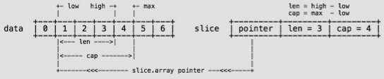

...menustart

- [数据](#0d83078816aa273f2941c9b55ec82bf3)
    - [4.1 Array](#32178c1cda9177ed4e8042ecd5a53311)
        - [数组是值类型,赋值和传参会复制整个数组](#3ceb784b5b43a112863ed3aa4896cb41)
        - [数组长度必须是常量,且是类型的组成部分](#50b847b46a30309a872dad8d4c275de5)
        - [\[2\]int 和 \[3\]int 是不同类型](#f9015b05de60900b98ecda6f5d90fc35)
        - [支持 "=="、"!=" 操作符](#df299689d1e512bfc747213652cbe873)
        - [指针数组 \[n\]*T,数组指针 *\[n\]T](#0be70e06d6650b4964c4f0aa65271323)
        - [内置函数 len 和 cap  返回数组长度度](#130ebd90a6475381a1b1dff10f76a535)
        - [初始化](#2cb472ff9cad0c89a033c53996b52053)
        - [多维数组](#99c53534ceaf36c0b46a74deda53c7cc)
    - [4.2 Slice](#62815bce971f6e4a45bb6b38263405d9)
        - [属性 len 表示可用元素数量,读写操作不能超过该限制。](#ca4e4d1fa15392fa7cf3f2a5d12106bf)
        - [属性 cap 表示最大扩张容量,不能超出数组限制](#2a98da4460bafc883a705eee9583f736)
        - [如果 slice == nil,那么 len、cap 结果都等于 0](#c1caad754bd5737481e2d529c7c7ac8c)
        - [\[\]\[\]T,是指元素类型为 \[\]T](#deccfdfd6d0ea36e758542fc41337d6d)
        - [4.2.2 append](#bdd51f510adf85b7340b8a0731aed377)
            - [向尾部添加数据,返回新的 slice 对象](#5a8d311ab43ab0faba05939c11066260)
            - [超出 slice.cap 限制, 重新分配底层数组](#6980e12abd7d72305dcf05e3e9d4a7f2)
            - [及时释放不再使用的slice对象,避免过期引用](#97dd95d57b894024eb2c68bdd658bfc6)
            - [slice = append(slice, 4,5,6 )](#84a5e07c4c7ce7bc78a7b0f1778339e9)
            - [slice = append(slice, slice2…)](#6615ef6c7a414d12ec66d15175fc589a)
        - [4.2.3 copy   copy( dst , src )](#9e740eb7607b6091af5c151d78f169d5)
            - [slice间复制数据，复制长度以 len 小的为准](#c65b6e1ddee3382bf3e8a193efd0e6ef)
            - [两个 slice 可以指向同一底层数组](#badd979ff3cf0b17bbf0f018712c2ab8)
            - [允许元素区间重叠](#2398e3420f5ef0d44fd135500fb83e25)
    - [4.3 Map](#91cb5cf9c1da4d477408a50b5508b2bc)
        - [键必须是支持相等运算符(==,!=)类型](#bac6134ee6adeb5579ac6b1db575522f)
        - [预先给 make 函数一个合理cap 参数，有助于提升性能](#26f4bf354defad22d0a7f9362566fd31)
        - [常见操作](#ca24c96f43b40118ee6132fbee9b1f38)
            - [if v, ok := m\["a"\]; ok {   // 判断key是否存在](#5bda47962a40f1c96ab2991938d5fde2)
            - [读取不存在的key 不会出错，直接返回 \0](#6e684da5fd6629336f7187da62b3bb9a)
            - [delete(m, "c")   删除, key如果不存在,不会出错](#7d80d4577f1a4e1b94d8def703b99585)
            - [map中取回的value是临时复制品,对array,struct类型value修改其成员是没有意义，且禁止的](#0898070678c415368721f888cb05d660)
            - [正确修改array,struct类型value成员的做法是 整个替换 或 使用指针](#ec4c60853957bccf84bfcb5ae754f5fb)
            - [range 迭代期间可以安全删除键值, 但是新增键值会造成未知后果](#4585687eb5ef30736a5c313362641ef3)
    - [4.4 Struct](#d013ccfa7a77fde240bbcf2dce401e35)
        - [可用 _ 定义补位字段](#1d51d98eadc62873b6089f89bd75f333)
        - [支持指向自身类型的指针成员](#d7a3a369c6f5bf882d6bf8e94470cd33)
        - [使用字段名 部分初始化， 或提供全部字段值 顺序初始化](#41bf8c61cc0d88d988e2ce0ca8f5be7b)
        - [支持匿名结构，用作 结构成员，或 定义变量](#943882584dc31d213d71941acfe3b2b4)
        - [支持"==", "!=" 操作, 可作 map 键类型](#6aa1d85873f56a14aff0b34dfaa26605)
        - [可定义字段标签, 用反射读取。标签是类型的组成部分](#6441a3f5ed8fb1b865643ce5361a613e)
        - [4.4.1 匿名字段](#dc612f42f3d6292a4ee31ef440c978e3)
            - [匿名字段是语法糖, 实际就是一个和类型同名(不含包名)的字段](#3b6d647478bb5800c3eeecbc22bbfdcc)
            - [编译器从外向内逐级查找所有层次匿名字段](#7f21ec01d2e6bd4d575a03b30545ff7d)
            - [外层同名字段会遮蔽 嵌入字段成员,此时需要使用显式字段名](#73d63043a2a70bb001e6fa477bade5ac)
            - [不能同时嵌入某一 类型 和其指针类型，因为它们名字相同](#1e091ebd2e1d10726cd2fa0f40a1540e)
        - [4.4.2 面向对象](#5a29b016818b0bb672014c3c78bae28f)
            - [go 没有 class 关键字, 没有继承，没有多态](#260cee088febedcbe0bc084c5a204d25)
            - [go 仅支持封装，尽管匿名字段 的内存布局和行为类似继承](#7a0e8618e6e08b4f73a7883d6879ec49)

...menuend


<h2 id="0d83078816aa273f2941c9b55ec82bf3"></h2>


# 数据


<h2 id="32178c1cda9177ed4e8042ecd5a53311"></h2>


## 4.1 Array

<h2 id="3ceb784b5b43a112863ed3aa4896cb41"></h2>


##### 数组是值类型,赋值和传参会复制整个数组
<h2 id="50b847b46a30309a872dad8d4c275de5"></h2>


##### 数组长度必须是常量,且是类型的组成部分
<h2 id="f9015b05de60900b98ecda6f5d90fc35"></h2>


##### [2]int 和 [3]int 是不同类型
<h2 id="df299689d1e512bfc747213652cbe873"></h2>


##### 支持 "=="、"!=" 操作符
<h2 id="0be70e06d6650b4964c4f0aa65271323"></h2>


##### 指针数组 [n]*T,数组指针 *[n]T
<h2 id="130ebd90a6475381a1b1dff10f76a535"></h2>


##### 内置函数 len 和 cap  返回数组长度度

---
<h2 id="2cb472ff9cad0c89a033c53996b52053"></h2>


### 初始化

```go
a := [3]int{1, 2}   // 未初始化元素值为 0
b := [...]int{1, 2, 3, 4} // 通过初始化值确定数组长度
c := [5]int{2: 100, 4:200} // 使用索引号初始化元素
d := [...]struct {
    name string
    age uint8 
}{
    {"user1", 10},      // 可省略元素类型
    {"user2", 20},      // 别忘了最后  的逗号。
}
```
---
<h2 id="99c53534ceaf36c0b46a74deda53c7cc"></h2>


### 多维数组

```go
a := [2][3]int{{1, 2, 3}, {4, 5, 6}}
b := [...][2]int{{1, 1}, {2, 2}, {3, 3}}  //第二维需要确定长度
```

---
<h2 id="62815bce971f6e4a45bb6b38263405d9"></h2>


## 4.2 Slice

```go
struct Slice
{                        // must not move anything
    byte*    array;     // actual data
    uintgo   len;       // number of elements
    uintgo   cap;       // allocated number of elements
};
```

<h2 id="ca4e4d1fa15392fa7cf3f2a5d12106bf"></h2>


##### 属性 len 表示可用元素数量,读写操作不能超过该限制。
<h2 id="2a98da4460bafc883a705eee9583f736"></h2>


##### 属性 cap 表示最大扩张容量,不能超出数组限制
<h2 id="c1caad754bd5737481e2d529c7c7ac8c"></h2>


##### 如果 slice == nil,那么 len、cap 结果都等于 0

```go
--数组
data := [...]int{0, 1, 2, 3, 4, 5, 6}
--从已有数组创建slice
slice := data[1:4:5]         // 1. [low : high : max ]

--直接创建slice
s1 := []int{0, 1, 2, 3, 8: 100}  // 通过初始化表达式构造,可使用索引号
fmt.Println(s1, len(s1), cap(s1))  // [01230000100] 9 9

s2 := make([]int, 6, 8)         //使用 make 创建,指定 len 和 cap 值
fmt.Println(s2, len(s2), cap(s2))   //[000000] 6 8

s3 := make([]int, 6)   // 省略 cap,相当于 cap = len
fmt.Println(s3, len(s3), cap(s3))   //[000000] 6 6
```

    创建表达式1 使用的是 元素索引号，而非数量

    

```go
--数组
data := [...]int{0, 1, 2, 3, 4, 5, 6, 7, 8, 9}
```


expression | slice |   len |   cap |   comment
---|---|---|---|---
data[:6:8]  | [0 1 2 3 4 5] |6  | 8 |   省略 low
data[5:]    | [5 6 7 8 9]   |5  | 5 |   省略 high、max
data[:3]    | [0 1 2]       |3  |10 |   省略 low、max
data[:]     | [0123456789]  |10 |10 |   全部省略


<h2 id="deccfdfd6d0ea36e758542fc41337d6d"></h2>


##### [][]T,是指元素类型为 []T 

```go
data := [][]int{
    []int{1, 2, 3},
    []int{100, 200},
    []int{11, 22, 33, 44},
}
```

---
<h2 id="bdd51f510adf85b7340b8a0731aed377"></h2>


### 4.2.2 append

<h2 id="5a8d311ab43ab0faba05939c11066260"></h2>


##### 向尾部添加数据,返回新的 slice 对象

<h2 id="6980e12abd7d72305dcf05e3e9d4a7f2"></h2>


##### 超出 slice.cap 限制, 重新分配底层数组

<h2 id="97dd95d57b894024eb2c68bdd658bfc6"></h2>


##### 及时释放不再使用的slice对象,避免过期引用

<h2 id="84a5e07c4c7ce7bc78a7b0f1778339e9"></h2>


##### slice = append(slice, 4,5,6 )  

<h2 id="6615ef6c7a414d12ec66d15175fc589a"></h2>


##### slice = append(slice, slice2…) 

    append a slice 必须展开

---
<h2 id="9e740eb7607b6091af5c151d78f169d5"></h2>


### 4.2.3 copy   copy( dst , src )

<h2 id="c65b6e1ddee3382bf3e8a193efd0e6ef"></h2>


##### slice间复制数据，复制长度以 len 小的为准

<h2 id="badd979ff3cf0b17bbf0f018712c2ab8"></h2>


##### 两个 slice 可以指向同一底层数组

<h2 id="2398e3420f5ef0d44fd135500fb83e25"></h2>


##### 允许元素区间重叠

---
<h2 id="91cb5cf9c1da4d477408a50b5508b2bc"></h2>


## 4.3 Map

<h2 id="bac6134ee6adeb5579ac6b1db575522f"></h2>


##### 键必须是支持相等运算符(==,!=)类型

    比如: number,string,pointer, array, struct,以及对应的 interface

<h2 id="26f4bf354defad22d0a7f9362566fd31"></h2>


##### 预先给 make 函数一个合理cap 参数，有助于提升性能

```go
    m := make(map[string]int, 1000)
```

---
<h2 id="ca24c96f43b40118ee6132fbee9b1f38"></h2>


### 常见操作

<h2 id="5bda47962a40f1c96ab2991938d5fde2"></h2>


##### if v, ok := m["a"]; ok {   // 判断key是否存在

<h2 id="6e684da5fd6629336f7187da62b3bb9a"></h2>


##### 读取不存在的key 不会出错，直接返回 \0

<h2 id="7d80d4577f1a4e1b94d8def703b99585"></h2>


##### delete(m, "c")   删除, key如果不存在,不会出错

<h2 id="0898070678c415368721f888cb05d660"></h2>


##### map中取回的value是临时复制品,对array,struct类型value修改其成员是没有意义，且禁止的

```go
m0 := map[string] []int {
    "a": {1,2},
}
m0["a"][0]=3   // slice 可以正常修改
println( m0["a"][0]  )  // 3  

m := map[string] [4]int {
    "a": {1,2},
}
m["a"][0]=3   // cannot assign to m["a"][0]

m1 := map[string]struct{ name string }{
    "a": {"user1"},
}
m1["a"].name = "b"   // cannot assign to m1["a"].name

```

<h2 id="ec4c60853957bccf84bfcb5ae754f5fb"></h2>


##### 正确修改array,struct类型value成员的做法是 整个替换 或 使用指针

```go
u := m1["a"]
u.name = "Tom"
m1["a"] = u
println( m1["a"].name )  // Tom 分步替换 value

m2 := map[string]*struct{ name string }{   //使用指针
    "a": & struct{ name string }{"user1"},
}
m2["a"].name = "Jack"
println( m2["a"].name  )  // Jack 
```

<h2 id="4585687eb5ef30736a5c313362641ef3"></h2>


##### range 迭代期间可以安全删除键值, 但是新增键值会造成未知后果

---
<h2 id="d013ccfa7a77fde240bbcf2dce401e35"></h2>


## 4.4 Struct

<h2 id="1d51d98eadc62873b6089f89bd75f333"></h2>


##### 可用 _ 定义补位字段

<h2 id="d7a3a369c6f5bf882d6bf8e94470cd33"></h2>


##### 支持指向自身类型的指针成员

```go
type Node struct {
    _    int
    id   int
    data *byte
    next *Node
}
```

<h2 id="41bf8c61cc0d88d988e2ce0ca8f5be7b"></h2>


##### 使用字段名 部分初始化， 或提供全部字段值 顺序初始化

```go
n1 := Node{     // 有 _ 补位字段的struct 必须通过字段名初始化
    id: 1,      // 因为没有办法给 _ 字段 提供值
    data: nil, 
}

type User struct {
    name string
    age int 
}
u1 := User{"Tom", 20}
u2 := User{"Tom"}   // Error: too few values in struct initializer
```

<h2 id="943882584dc31d213d71941acfe3b2b4"></h2>


##### 支持匿名结构，用作 结构成员，或 定义变量

```go
type File struct {
    name string
    size int
    attr struct {
    perm int
    owner int 
    }
}

f := File{
    name: "test.txt",
    size: 1025,
    //attr: {0755, 1},      //缺少type,无法初始化
}

f.attr.owner = 1
f.attr.perm = 0755

var attr = struct {
    perm  int
    owner int
}{2, 0755}

```


<h2 id="6aa1d85873f56a14aff0b34dfaa26605"></h2>


##### 支持"==", "!=" 操作, 可作 map 键类型

<h2 id="6441a3f5ed8fb1b865643ce5361a613e"></h2>


##### 可定义字段标签, 用反射读取。标签是类型的组成部分

```go
var u1 struct { name string "username" }
```

---
<h2 id="dc612f42f3d6292a4ee31ef440c978e3"></h2>


### 4.4.1 匿名字段

<h2 id="3b6d647478bb5800c3eeecbc22bbfdcc"></h2>


##### 匿名字段是语法糖, 实际就是一个和类型同名(不含包名)的字段

<h2 id="7f21ec01d2e6bd4d575a03b30545ff7d"></h2>


##### 编译器从外向内逐级查找所有层次匿名字段

```go
type Resource struct {
    id int
}
type User struct {
    Resource
    name string 
}
type Manager struct {
    User
    title string
}

var m Manager
m.id = 1
m.name = "Jack"
m.title = "Administrator"
```

<h2 id="73d63043a2a70bb001e6fa477bade5ac"></h2>


##### 外层同名字段会遮蔽 嵌入字段成员,此时需要使用显式字段名

```go
type Resource struct {
    id   int
    name string 
}
type Classify struct {
    id int
}
type User struct {
    Resource      // Resource.id   Classify.id 在同一层次
    Classify
    name string     // 遮蔽Resource.name
}

u := User{
    Resource{1, "people"},
    Classify{100},
    "Jack",
}

println(u.name)     // User.name: Jack
println(u.Resource.name)    // people
// println(u.id)      // Error: ambiguous selector u.id
println(u.Classify.id)   // 100
```


<h2 id="1e091ebd2e1d10726cd2fa0f40a1540e"></h2>


##### 不能同时嵌入某一 类型 和其指针类型，因为它们名字相同

---
<h2 id="5a29b016818b0bb672014c3c78bae28f"></h2>


### 4.4.2 面向对象

<h2 id="260cee088febedcbe0bc084c5a204d25"></h2>


##### go 没有 class 关键字, 没有继承，没有多态

<h2 id="7a0e8618e6e08b4f73a7883d6879ec49"></h2>


##### go 仅支持封装，尽管匿名字段 的内存布局和行为类似继承

