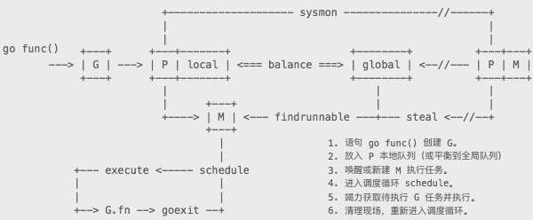

[](...menustart)

- [Golang 源码剖析 笔记](#bd8d63148bd763bf382e622b7f6ba4c5)
- [3 初始化](#96d69e4c5664ac7ab9e1b6cc57f45713)
- [4 内存分配](#3cb43e4796e6a8656e179f3c60617099)
    - [1. 概述](#423bc1ba50d3ddb690541b8f7c49e8f9)
        - [内存块](#f003c5f9f55cdd50278a726b69658195)
        - [管理组件](#68813faa72d7f7699aba1c808012dd73)
    - [3. 分配](#6d09b6372dc01d0af84688cb42556585)
    - [4. 回收](#16170c8f80c0fdb3360e1beb33fd3a83)
    - [5. 释放](#26be3afe2c6bb79dc07f00dce919e7e6)
    - [6. 其他](#d278fae3e36ea2f387c7343239c0d02a)
- [5 垃圾回收](#1e32365e0937a0c0bc87a60fcad9acc6)
- [6 并发调度](#0d020f99af32eebe8d32de7cf7af1567)
    - [1. 概述](#423bc1ba50d3ddb690541b8f7c49e8f9)
    - [2. 初始化](#df2012ae5f31ded9662bae1a626c1fa6)
    - [3. 任务](#0c191fd62a6e8c0f7e69094d7f0a9f03)
    - [4. 线程](#ea78082204416e4f34e71cadbabb0acd)
    - [5. 执行  TODO](#a2134d222761a6e2bd2ef6a4cc2aa9f6)
    - [6. 连续栈  TODO](#bb03c9eb129655133f2249ea8bf53a36)
    - [7. 系统调用](#b5e8a1c460ec883e7639e85e7366da49)
    - [8. 监控](#e9978f4a6239196891873e4ea1feba96)
        - [抢占调度](#866b63527a694c6c1e749061b2012a89)
    - [9. 其他](#f25b50ca66ffe99bed4b29e510545e53)
        - [Gosched](#7f06675de43e6d5aefecae106f52d8ca)
        - [gopark](#aa896b57e7f90ea829e73d2e4d668ffc)
        - [notesleep](#d3c78919a69267edda18fb9ad9cc1463)
        - [Goexit](#639a3023c09d383a7faac7cb8296ce15)
        - [stopTheWorld](#daeb73ede1d3edfa35aa9953a6021fd5)
- [7. 通道](#7655f7b3cad86e3ce6c125bc6963df80)
    - [1. 创建](#fdf28238a16b11944d8c2221aad97cfa)
    - [2. 收发](#1161015033b4f7c6cd8c2ffc012ebeaf)
        - [同步](#6a620e3c07048291fdb26b6edcee7aba)
        - [异步](#8b5a247dc2c747c7daa722dd9357c4d6)
        - [关闭](#b15d91274e9fc68608c609999e0413fa)
    - [3. 选择](#7a78b12c63142fd545ce428c023e07dc)
- [8. Defer](#a1554d04258a4866ffe3bc369e55da7b)
    - [1. 定义](#37f4607af585bcc2d00391247adf7f80)
    - [2. 性能](#dd11daa20fb3f671cdddf8e2855537e6)
    - [3. 错误](#f0a5b882f03b8ff96932e7cbf1b9fc66)
- [9. Finalizer](#f30311ee9907d46d180f637ebe6ad581)
- [10. 缓存池](#d75ed6fa3c3ea3fe144b84b2156f1bdf)

[](...menuend)


<h2 id="bd8d63148bd763bf382e622b7f6ba4c5"></h2>

# Golang 源码剖析 笔记

<h2 id="96d69e4c5664ac7ab9e1b6cc57f45713"></h2>

# 3 初始化

- init 的执⾏顺序和依赖关系、⽂件名以及定义顺序有关。
    - 但 这种次序⾮常不便于维护和理解，极易造成潜在错误，所以强烈要求让 init 只做该做的事情：
    - **局部初始化**
- PS.
    - 所有 init 函数都在同⼀个 goroutine 内执⾏。 
    - 所有 init 函数结束后才会执⾏ main.main 函数。 

<h2 id="3cb43e4796e6a8656e179f3c60617099"></h2>

# 4 内存分配

- 内置运⾏时的编程语⾔通常会抛弃传统的内存分配⽅式，改由⾃主管理。
- 这样可以完成类 似预分配、内存池等操作，以避开系统调⽤带来的性能问题。
- 当然，还有⼀个重要原因是 为了更好地配合垃圾回收。

<h2 id="423bc1ba50d3ddb690541b8f7c49e8f9"></h2>

## 1. 概述 

⼀些基本概念，这有助于建⽴宏观认识。

基本策略：

 1. 每次从操作系统申请⼀⼤块内存（⽐如 1MB），以减少系统调⽤。 
 2. 将申请到的⼤块内存按照特定⼤⼩预先切分成⼩块，构成链表。 
 3. 为对象分配内存时，只需从⼤⼩合适的链表提取⼀个⼩块即可。 
 4. 回收对象内存时，将该⼩块内存重新归还到原链表，以便复⽤。 
 5. 如闲置内存过多，则尝试归还部分内存给操作系统，降低整体开销。 

```
内存分配器只管理内存块，并不关⼼对象状态。
且不会主动回收内存，由垃圾回收器在完成清理 操作后，触发内存分配器回收操作。
```

<h2 id="f003c5f9f55cdd50278a726b69658195"></h2>

### 内存块 

分配器将其管理的内存块分为两种：

- span: 由多个地址连续的页（page）组成的⼤块内存。 
- object: 将 span 按特定⼤⼩切分成多个⼩块，每个⼩块可存储⼀个对象。 

```
按照其⽤途，span ⾯向内部管理，object ⾯向对象分配。
```

- 分配器按页数来区分不同⼤⼩的 span。
    - ⽐如，以页数为单位将 span 存放到管理数组中， 需要时就以页数为索引进⾏查找
    - span ⼤⼩并⾮固定不变。在获取闲置 span 时， 如果没找到⼤⼩合适的，那就返回页数更多的，此时会引发裁剪操作，多余部分将构成新的 span 被放回管理数组
    - 分配器还会尝试将地址相邻的空闲 span 合并，以构建更⼤的内存块，减少碎⽚，提供更灵活的分配策略。
- ⽤于存储对象的 object，按 8 字节倍数分为 n 种
    - ⽐如说，⼤⼩为 24 的 object 可⽤来存储 范围在 17 ~ 24 字节的对象。
    - 这种⽅式虽然会造成⼀些内存浪费，但分配器只需⾯对有限的⼏种规格（size class）⼩块内存，优化了分配和复⽤管理策略。 

```
分配器会尝试将多个微⼩对象组合到⼀个 object 块内，以节约内存。
```

- 分配器初始化时，会构建对照表存储⼤⼩和规格的对应关系，包括⽤来切分的 span 页数。
- 若对象⼤⼩超出特定阈值限制，会被当做⼤对象（large object）特别对待。 
    - `_MaxSmallSize = 32 << 10 // 32KB`

<h2 id="68813faa72d7f7699aba1c808012dd73"></h2>

### 管理组件 

优秀的内存分配器必须要在性能和内存利⽤率之间做到平衡。

好在，Golang 的起点很⾼， 直接采⽤了 tcmalloc 的成熟架构。

<h2 id="6d09b6372dc01d0af84688cb42556585"></h2>

## 3. 分配 

- 为对象分配内存需区分在栈还是堆上完成
- 通常情况下，编译器有责任尽可能使⽤寄存器 和栈来存储对象，这有助于提升性能，减少垃圾回收器压⼒。 
- 但千万不要以为⽤了 new 函数就⼀定会分配在堆上，相同的源码也有不同的结果。
    - 当编译器禁⽤内联优化时，所⽣成代码和我们源码表⾯预期⼀致。 
    - 但当使⽤默认参数时，结果就变得不同了

newobject 具体是如何为对象分配内存的:

- ⼤对象直接从 heap 获取 span
- ⼩对象从 cache.alloc[sizeclass].freelist 获取 object。 
- 微⼩对象组合使⽤ cache.tiny object。

<h2 id="16170c8f80c0fdb3360e1beb33fd3a83"></h2>

## 4. 回收 

- 内存回收的源头是垃圾清理操作
- 之所以说回收⽽⾮释放，是因为整个内存分配器的核⼼是内存复⽤，不再使⽤的内存会被 放回合适位置，等下次分配时再次使⽤。
    - 只有当空闲内存资源过多时，才会考虑释放。 
- 基于效率考虑，回收操作⾃然不会直接盯着单个对象，⽽是以 span 为基本单位。
    - 通过⽐ 对 bitmap ⾥的扫描标记，逐步将 object 收归原 span，最终上交 central 或 heap 复⽤。

<h2 id="26be3afe2c6bb79dc07f00dce919e7e6"></h2>

## 5. 释放 

- 在运⾏时⼊⼜函数 main.main ⾥，会专门启动⼀个监控任务 sysmon，它每隔⼀段时间就会 检查 heap ⾥的闲置内存块。
- 遍历 free、freelarge ⾥的所有 span，如闲置时间超过阈值，则释放其关联的物理内存。 

<h2 id="d278fae3e36ea2f387c7343239c0d02a"></h2>

## 6. 其他 

- 从运⾏时的⾓度，整个进程内的对象可分为两类。
    - 其⼀，⾃然是从 arena 区域分配的⽤户 对象
    - 另⼀种，则是运⾏时⾃⾝运⾏和管理所需，⽐如管理 arena 内存⽚段的 mspan，提 供⽆锁分配的 mcache 等等。 

<h2 id="1e32365e0937a0c0bc87a60fcad9acc6"></h2>

# 5 垃圾回收

Golang GC 的基本特征是 “⾮分代、⾮紧缩、写屏障、并发标记清理”。

<h2 id="0d020f99af32eebe8d32de7cf7af1567"></h2>

# 6 并发调度 

因为 Goroutine，才让 Golang 与众不同。

<h2 id="423bc1ba50d3ddb690541b8f7c49e8f9"></h2>

## 1. 概述 

- 内置运⾏时，在进程和线程的基础上做更⾼层次的抽象是现代语⾔最流⾏的做法。
- Golang 也设计了全新架构模型，将⼀切都基于并发体系之上，以适应多核 时代。
- 刻意模糊线程或协程概念，通过三种基本对象相互协作，来实现在⽤户空间管理和 调度并发任务。 

基本关系⽰意图：


 
- ⾸先是 Processor（简称 P），其作⽤类似 CPU 核，⽤来控制可同时并发执⾏的任务数量。
    - 每个⼯作线程都必须绑定⼀个有效 P 才被允许执⾏任务，否则只能休眠，直到有空闲 P 时 被唤醒。
    - P 还为线程提供执⾏资源，⽐如对象分配内存、本地任务队列等。
    - 线程独享所绑 定的 P 资源，可在⽆锁状态下执⾏⾼效操作。 
- 基本上，进程内的⼀切都在以 goroutine（简称 G）⽅式运⾏，包括运⾏时相关服务，以及 main.main ⼊⼜函数。
    - 需要指出，G 并⾮执⾏体，它仅仅保存并发任务状态，为任务执⾏ 提供所需栈内存空间。
    - G 任务创建后被放置在 P 本地队列或全局队列，等待⼯作线程调度 执⾏。 
- 实际执⾏体是系统线程（简称 M），它和 P 绑定，以调度循环⽅式不停执⾏ G 并发任务。
    - M 通过修改寄存器，将执⾏栈指向 G ⾃带栈内存，并在此空间内分配堆栈帧，执⾏任务 函数。
    - 当需要中途切换时，只要将相关寄存器值保存回 G 空间即可维持状态，任何 M 都 可据此恢复执⾏。
    - 线程仅负责执⾏，不再持有状态，这是并发任务跨线程调度，实现多路 复⽤的根本所在。
- 尽管 P/M 构成执⾏组合体，但两者数量并⾮⼀⼀对应。
    - 通常情况下，P 数量相对恒定，默 认与 CPU 核数量相同，但也可能更多或更少，⽽ M 则是调度器按需创建。
    - 举例来说，当 M 因陷⼊系统调⽤⽽长时间阻塞时，P 就会被监控线程抢回，去新建（或唤醒）⼀个 M 执 ⾏其他任务，如此 M 的数量就会增长。 
- 因为 G 初始栈仅有 2KB，且创建操作只是在⽤户空间简单的对象分配，远⽐进⼊内核态 分配线程要简单得多。调
    - 调度器让多个 M 进⼊调度循环，不停获取并执⾏任务，所以我们 才能创建成千上万个并发任务。 

<h2 id="df2012ae5f31ded9662bae1a626c1fa6"></h2>

## 2. 初始化

- 虽然可在运⾏期⽤ runtime.GOMAXPROCS 函数修改 P 数量，但需付出极⼤代价

<h2 id="0c191fd62a6e8c0f7e69094d7f0a9f03"></h2>

## 3. 任务 

我们已经知道编译器会将 `go func(...)` 语句翻译成 newproc 调⽤，但这中间究竟有什么不为⼈知的秘密？

```
go add(x, y)
```

- 实参 x 入栈
- 实参 y 入栈
- 参数 长度入栈
- 将函数 add 地址 存入 AX 寄存器
- AX 中的add地址 入栈
- Call runtime.newproc(SB)

从反汇编代码可以看出，Golang 采⽤了类似 C/cdecl 调⽤约定。由调⽤⽅负责提供参数空 间，并从右往左⼊栈。


```go
proc1.go

func newproc(siz int32, fn *funcval) {
    // 获取第一参数地址
    argp := add(unsafe.Pointer(&fn), ptrSize)
    // 获取调用方 PC/IP 寄存器值
    pc := getcallerpc(unsafe.Pointer(&siz))
    // 用 g0 栈 创建 G/goroutine 对象
    systemstack(func() {
        newproc1(fn, (*uint8)(argp), siz, 0, pc) 
    })
}
```

- ⽬标函数 newproc 只有两个参数，但 main 却向栈压⼊了四个值。
- 按照顺序，后三个值应 该会被合并成 funcval。
- 还有，add 返回值被忽略。 

```go
type funcval struct {
    fn uintptr
    // variable-size, fn-specific data here
}
```

变长结构类型（⽬标函数参数不定），此处其补全状态应该是：

```go
type struct {
    fn uintptr
    x int
    y int
} 
```

如此⼀来，关于 “go 语句会复制参数值” 的规则就很好理解了。

站在 newproc ⾓度，我们 可以画出执⾏栈的状态⽰意图。

```
  lower            SP +------------+
                      |            |
    ^                 +------------+ <---- newproc frame
    .                 | pc/ip      |
    .                 +------------+
    .                 | siz        |
  address             +------------+ ---+
    .                 | add        |    |
    .                 +------------+    |
    .                 | x          |    > fn
    .                 +------------+    |
                      | y          |    |
 higher               +------------+ ---+
```

- ⽤ “fn + ptrsize” 跳过 add 获得第⼀个参数 x 的地址
- getcallerpc ⽤ “siz - 8” 读取 CALL 指 令压⼊的 main PC/IP 寄存器值，这就是 newproc 为 newproc1 准备的相关参数值。 

整个创建过程中，有⼀系列问题需要分开详说.

- ⾸先，G 对象默认会复⽤，这看上去有点像 cache/object 做法。
    - 除 P 本地的复⽤链表外， 还有全局链表在多个 P 之间共享。
    - ⽽当 goroutine 执⾏完毕，调度器相关函数会将 G 对象放回 P 复⽤链表。 


- 创建完毕的 G 任务被优先放⼊ P 本地队列等待执⾏，这属于⽆锁操作。 
- 任务队列分为三级，按优先级从⾼到低分别是 P.runnext、P.runq、Sched.runq，很有些 CPU 多级缓存的意思。 
- 往全局队列添加任务，显然需要加锁，只是专门取名为 runqputslow 就很有说法了。去看 看到底怎么个慢法。 
- 如本地队列已满，⼀次性转移半数到全局队列: runqputslow
    - 从队列头部提取
    - 对顺序进行洗牌
    - 串成链表
    - 添加到 全局列表尾部

最后标记⼀下 G 的状态切换过程。 

```
-- gfree -----+
              |
--> IDLE --> DEAD ------> RUNNABLE ---> RUNNING ---> DEAD ---  ... --> gfree -->
   新建   初始化前        初始化后      调度执行     执行完毕   
```

<h2 id="ea78082204416e4f34e71cadbabb0acd"></h2>

## 4. 线程 

- 当 newproc1 成功创建 G 任务后，会尝试⽤ wakep 唤醒 M 执⾏任务。 
- 唤醒 M 同样有闲置获取和新建两种⽅式
- M 初始化操作会检查已有数量，如超出最⼤限制（默认 10000）会导致进程崩溃。
- 所有 M 被添加到 allm 链表，且不被释放。

```
可⽤ runtime/debug.SetMaxThreads 修改最⼤线程数量限制，
但仅建议在测试阶段通过设置较⼩值作为错误触发条件。
```

- 我们允许进程⾥有成千上万的并发任务 G，但最好不要有太多的 M。
    - 且不说通过系统调⽤ 创建线程本⾝就有很⼤的性能损耗，⼤量闲置且不被回收的线程、M 对象、g0 栈空间都是 资源浪费。
    - 好在这种情形极少出现，不过还是建议在⽣产部署前做严格测试。 

利⽤ GODEBUG 输出调度器状态

```
$ GODEBUG="schedtrace=1000" ./test

SCHED 0ms: gomaxprocs=2 idleprocs=1 threads=3 spinningthreads=0 idlethreads=0 runqueue=0 [0 0]
SCHED 1006ms: gomaxprocs=2 idleprocs=0 threads=728 spinningthreads=0 idlethreads=0 runqueue=125 [113 33]
SCHED 2009ms: gomaxprocs=2 idleprocs=2 threads=858 spinningthreads=0 idlethreads=590 runqueue=0 [0 0]
done!
SCHED 3019ms: gomaxprocs=2 idleprocs=2 threads=858 spinningthreads=0 idlethreads=855 runqueue=0 [0 0]
SCHED 4029ms: gomaxprocs=2 idleprocs=2 threads=858 spinningthreads=0 idlethreads=855 runqueue=0 [0 0]
SCHED 5038ms: gomaxprocs=2 idleprocs=2 threads=858 spinningthreads=0 idlethreads=855 runqueue=0 [0 0]
SCHED 6048ms: gomaxprocs=2 idleprocs=2 threads=858 spinningthreads=0 idlethreads=855 runqueue=0 [0 0]
```

<h2 id="a2134d222761a6e2bd2ef6a4cc2aa9f6"></h2>

## 5. 执行  TODO

<h2 id="bb03c9eb129655133f2249ea8bf53a36"></h2>

## 6. 连续栈  TODO

<h2 id="b5e8a1c460ec883e7639e85e7366da49"></h2>

## 7. 系统调用

- 为⽀持并发调度，专门对 syscall、cgo 进⾏了包装，以便在长时间阻塞时能切换执⾏其他 任务。
- 标准库 syscall 包⾥，将相关系统调⽤函数分为 Syscall 和 RawSyscall 两类。
- 最⼤的不同在于 Syscall 增加了 entrysyscall/exitsyscall，这就是允许调度的关键所在。 
- 监控线程 sysmon 对 syscall ⾮常重要，因为它负责将因系统调⽤⽽长时间阻塞的 P 抢回， ⽤于执⾏其他任务。否则，整体性能会严重下降，甚⾄整个进程被冻结。 
- 某些系统调⽤本⾝就可以确定长时间阻塞（⽐如锁），那么它会选择执⾏ entersyscallblock 主动交出所关联的 P。
- 从系统调⽤返回时，必须检查 P 是否依然可⽤，因为可能已被 sysmon 抢⾛。 

<h2 id="e9978f4a6239196891873e4ea1feba96"></h2>

## 8. 监控

- 释放闲置超过 5 分钟的 span 物理内存。
- 如果超过 2 分钟没有垃圾回收，强制执⾏。
- 将长时间未处理的 netpoll 结果添加到任务队列。 
- 向长时间运⾏的 G 任务发出抢占调度。
- 收回因 syscall 长时间阻塞的 P

<h2 id="866b63527a694c6c1e749061b2012a89"></h2>

### 抢占调度 

- 所谓抢占调度要⽐你想象的简单许多，远不是你以为的 “抢占式多任务操作系统” 那种样⼦
- 因为 Golang 调度器并没有真正意义上的时间⽚概念，只是在⽬标 G 上设置⼀个抢占标志
- 当该任务调⽤某个函数时，被编译器安插的指令就会检查这个标志，从⽽决定是否暂停当 前任务。 

<h2 id="f25b50ca66ffe99bed4b29e510545e53"></h2>

## 9. 其他 

与任务执⾏有关的⼏种暂停操作。

<h2 id="7f06675de43e6d5aefecae106f52d8ca"></h2>

### Gosched

- 可被⽤户调⽤的 runtime.Gosched 将当前 G 任务暂停，重新放回全局队列，让出当前 M 去 执⾏其他任务。
- 我们⽆需对 G 做唤醒操作，因为总归会被某个 M 重新拿到，并从 “断点” 恢复。 

```
func Gosched() {
    mcall(gosched_m)
}
```

<h2 id="aa896b57e7f90ea829e73d2e4d668ffc"></h2>

### gopark

- 与 Gosched 最⼤的区别在于，gopark 并没将 G 放回待运⾏队列。
- 也就是说，必须主动恢 复，否则该任务会遗失。

<h2 id="d3c78919a69267edda18fb9ad9cc1463"></h2>

### notesleep

- 相⽐ gosched、gopark，反应更敏捷的 notesleep 既不让出 M，也就不会让 G 重回任务队列。
- 它直接让线程休眠直到被唤醒，更适合 stopm、gcMark 这类近似⾃旋的场景
- 在 linux、dragonfly、freebsd 平台，notesleep 是基于 futex 的⾼性能实现。 

```
Futex 通常称作 “快速⽤户区互斥”，是⼀种在⽤户空间实现的锁（互斥）机制。
多执⾏单位（进程或线程）通过共享同⼀快内存（整数）来实现等待和唤醒操作。
因为 Futex 只在操作结果不⼀致时才进⼊内核仲裁，所以有⾮常⾼的执⾏效率。
```

<h2 id="639a3023c09d383a7faac7cb8296ce15"></h2>

### Goexit

- ⽤户可调⽤ runtime.Goexit ⽴即终⽌ G 任务，不管当前处于调⽤堆栈的哪个层次。
- 在终⽌ 前，它确保所有 G.defer 被执⾏。

<h2 id="daeb73ede1d3edfa35aa9953a6021fd5"></h2>

### stopTheWorld

整个进程⽤户逻辑停⽌

- stopTheWorld 还是很平和的⼀种⼿段，会循环等待⽬标任务进⼊⼀个安全点后 主动暂停。⽽
- ⽽ startTheWorld 就更简单，毕竟是从冻结状态开始，⽆⾮是唤醒相关 P/M 继 续执⾏任务。

---

<h2 id="7655f7b3cad86e3ce6c125bc6963df80"></h2>

# 7. 通道

- 通道（channel）是 Golang 实现 CSP 并发模型的关键，⿎励⽤通讯来实现数据共享。

```
Don't communicate by sharing memory, share memory by communicating.
CSP: Communicating Sequential Process.
```

<h2 id="fdf28238a16b11944d8c2221aad97cfa"></h2>

## 1. 创建 

同步和异步的区别，在于是否有缓冲槽。

```
type hchan struct {
    dataqsiz uint // 缓冲大小
    buf unsafe.Pointer // 缓冲指针
    elemsize uint16 // 数据大小
    elemtype *_type // 数据类型
}
```

- makechan 数据项大小不能超过 64KB, 这时候用指针更合适一些

<h2 id="1161015033b4f7c6cd8c2ffc012ebeaf"></h2>

## 2. 收发 

<h2 id="6a620e3c07048291fdb26b6edcee7aba"></h2>

### 同步

- 同步模式的关键是找到匹配的接收或发送⽅
    - 找到则直接拷贝数据
    - 找不到就将⾃⾝打包后放⼊等待队列，由另⼀⽅复制数据并唤醒。  
- 在同步模式下，channel 的作⽤仅是维护发送和接收者队列，数据复制与 channel ⽆关。
- 另外在唤醒后，需要验证唤醒者⾝份，以此决定是否有实际的数据传递。

<h2 id="8b5a247dc2c747c7daa722dd9357c4d6"></h2>

### 异步

- 异步模式围绕缓冲槽进⾏。
- 当有空位时，发送者向槽中复制数据；有数据后，接收者从槽 中获取数据。
- 双⽅都有唤醒 排队另⼀⽅继续⼯作的责任。 

<h2 id="b15d91274e9fc68608c609999e0413fa"></h2>

### 关闭 

- 关闭操作将所有排队者唤醒，并通过 chan.closed、g.param 参数告知由 close 发出
    - 向 closed channel 发送数据，触发 panic。
    - 从 closed channel 读取数据，返回零值。
    - ⽆论收发，nil channel 都会阻塞

<h2 id="7a78b12c63142fd545ce428c023e07dc"></h2>

## 3. 选择 

- 选择模式（select）是从多个 channel ⾥随机选出可⽤的那个
    - 编译器会将相关语句翻译成 具体的函数调⽤
- 简化后的流程
    1. ⽤ pollorder “随机” 遍历，找出准备好的 case。 
    2. 如没有可⽤ case，则尝试 default case。
    3. 如都不可⽤，则将 select G 打包放⼊所有 channel 的排队列表。
    4. 直到 select G 被某个 channel 唤醒，遍历 ncase 查找⽬标 case。
- 每次操作，都需要对全部 channel 加锁，这粒度似乎太⼤了些。 

```
官⽅确定要改进 select lock，只是 release 时间未定。
```

<h2 id="a1554d04258a4866ffe3bc369e55da7b"></h2>

# 8. Defer

- 延迟调⽤（defer） 最⼤优势是，即便函数执⾏出错，依然能保证回收资源等操作得以执 ⾏。
- 但如果对性能有要求，且错误能被控制，那么还是直接执⾏⽐较好。 

<h2 id="37f4607af585bcc2d00391247adf7f80"></h2>

## 1. 定义 

- 编译器将 defer 处理成两个函数调⽤，deferproc 定义⼀个延迟调⽤对象
- 然后在函数结束 前通过 deferreturn 完成最终调⽤。 

<h2 id="dd11daa20fb3f671cdddf8e2855537e6"></h2>

## 2. 性能 

- 延迟调⽤远不是⼀个 CALL 指令那么简单，会涉及很多内容。诸如对象分配、 缓存，以及多次函数调⽤.
- 在某些性能要求⽐较⾼的场合，应该避免使⽤ defer。

<h2 id="f0a5b882f03b8ff96932e7cbf1b9fc66"></h2>

## 3. 错误

不知从何时起，panic 就成了⼀个禁忌话题，诸多教程⾥都有 “Don't Panic!” 这样的条例。

这让我想起 Python __del__ 的话题，颇为类似。

其实，对于不可恢复性的错误⽤ panic 并 ⽆不妥，见仁见智吧。

<h2 id="f30311ee9907d46d180f637ebe6ad581"></h2>

# 9. Finalizer

Finalizer 主要⽤途是在对象被垃圾回收时执⾏⼀个 关联函数，效果如同 OOP ⾥的析构⽅法（Destructor Method）。

```go
func main() {
    x := 123
    runtime.SetFinalizer(&x, func(x *int) {
        println(x, *x, "finalizer.")
    })
    runtime.GC()
    time.Sleep(time.Minute)
}
```

- 须由专门的 fing goroutine 负责执⾏。
- ⼀路⾛来，已记不清 runtime 创建了多少类似 fing 这样在以死循环⽅式⼯作的 goroutine 了
- 不管是 panic，还是 finalizer，都有特定的使⽤场景，因为它们有相应的设计制约。这种制约不 应被看做缺陷，毕竟我们本就不该让它们去做⽆法保证的事情。


<h2 id="d75ed6fa3c3ea3fe144b84b2156f1bdf"></h2>

# 10. 缓存池

- 设计对象缓存池，除避免内存分配操作开销外，更多的是为了避免分配⼤量临时对象对垃 圾回收器造成负⾯影响。
- 只是有⼀个问题需要解决，就是如何在多线程共享的情况下，解 决同步锁带来的性能弊端，尤其是⾼并发情形下。
- 因 Golang goroutine 机制对线程的抽象，造成我们以往基于 LTS 的⽅案统统⽆法实施。就 算 runtime 对我们开放线程访问接⼜也未必有⽤。
- 为此,官⽅提供了⼀个深⼊ runtime 内核运作机制的 sync.Pool。其算法已被内存分配、垃 圾回收和调度器所使⽤，算是得到验证的成熟⾼效体系。 


