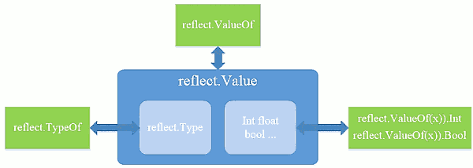
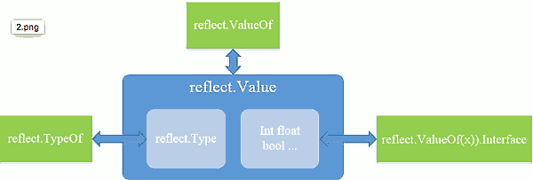

...menustart

 - [Reflect 反射](#139b6cfcf3c9439de790ce9742996f82)
     - [go 反射三定律](#2c1c5d090ea2c7185fa8fd7e9b63d11b)
         - [类型和接口](#bb0b4f2728204b8b714ea48327b4af7a)
         - [接口变量的表示](#b9d9ccbf8501aa1966a00cafd6e7bfda)
         - [反射类型： reflect.Type/reflect.Value](#a57c4f6b579173e2daf603140ac1d6d8)
         - [反射第一定律：反射可以将“接口类型变量”转换为 “reflect.Type/reflect.Value 对象”。](#9a603138c5ea1e949f5c85cd99b4f7f0)
         - [反射第二定律：反射可以将“反射类型对象”转换为“接口类型变量”。](#794f9fdf4a0e7420dc5fe20f1e21348f)
         - [反射第三定律：如果要修改“反射类型对象”，其值必须是“可写的”（settable）](#5f5eab2420b563eacfc4e5c01057dfc6)
         - [结构体（struct）](#d7ddf9e0f9fc507b359df7b80ba9afa0)
             - [没有运行期类型对象](#0318e04c3f2eb7a1984ee102d5a2ed1c)
 - [9.4.1 reflect.Type](#8c6859ae778598e709e07536f5173e72)
     - [获取struct对象 成员字段信息，包括非导出和匿名字段](#b4f395a0193ad2063ac51bafe5bde7cb)
     - [如果是指针，先使用 Elem方法获取目标类型](#68093d5b129ae6d66b666d017e2519a8)
     - [value-inferface 和 point-interface 方法集存在差异](#b101897a62b1b9a5ce74504373ba727c)
     - [直接使用名称 或 序号 访问字段](#b11cc2af540eb66182778242f042879b)
     - [字段标签可实现简单元数据编程](#258b3955c18942a2557b3793fa3877d3)
     - [可从基本类型获取所对应的复合类型](#b499e680690478b9e2d378d15701fdc2)
     - [方法 Elem 可返回复合类型的 基类型](#0a7afa5b5f0c6e4ce1a3d2ac5ca84728)
     - [方法 Implements 判断是否实现了某个接口](#0d8ba38963413fb3e0a37355baac5004)
     - [获取对齐信息，对于内存自动分析很有用](#dfa77f624af44f20d93a02df20657a9f)
     - [9.4.2 reflect.Value](#34ca7e92d333aacb70ded67fd6989dd0)
         - [Value 和 Type 使用方法类似,包括 Elem方法](#e9fae0f567c7b19b714a1e0035740e52)
         - [其他复合类型 array , slice ,map 取值示例](#bd597938c7e7c92297b5bbf47c1fbedf)
         - [IsNil方法判断 接口 data值是否为空](#18917556ea9e2ef4a2d1352ea9490d13)
         - [复合类型修改示例  TODO](#1646349e890242f255aca9e532cedfd6)
         - [创建一个 和某个interface{} 相同类型的实例](#34b9abefc452f88bc8eda13d2124a3b5)
     - [9.4.3 Method](#61e08fe2cac9cfa9a7ab1048eaa57974)
         - [可获取方法参数, 返回值类型等信息](#82f01c4522eb5d25e3ab3e6f60bb72bb)
         - [动态调用, 按 in 列表准备所需参数  TODO](#e4e8d5f98a70257af0a0544047a3b167)

...menuend


<h2 id="139b6cfcf3c9439de790ce9742996f82"></h2>


# Reflect 反射

<h2 id="2c1c5d090ea2c7185fa8fd7e9b63d11b"></h2>


## go 反射三定律

<h2 id="bb0b4f2728204b8b714ea48327b4af7a"></h2>


### 类型和接口

 - 反射建立在 类型系统上
 - 静态类型Type 和底层类型Kind
    - go每个变量都有，且只有一个静态类型
    - 如下，i,j 具有共同的底层类型 int, 但它们的静态类型并不一样;不经过类型转换直接相互赋值时，编译器会报错.

```go
type MyInt int
var i int
var j MyInt
```

 - 类型的 一个重要的分类是 接口类型（interface）
    - 每个接口类型都代表固定的方法集合
    - 一个非常非常重要的接口类型是空接口: `interface{}`


<h2 id="b9d9ccbf8501aa1966a00cafd6e7bfda"></h2>


### 接口变量的表示
 
 - Interface变量存储一对值：
    - 赋给该变量的具体的值、值类型的描述符。
    - 值就是实现该接口的底层数据, 类型是底层数据类型的描述。

```go
var r io.Reader
tty, err := os.OpenFile("/dev/tty", os.O_RDWR, 0)
if err != nil {
    return nil, err
}
r = tty
```

 - 在这个例子中，变量 r 在结构上包含一个 (value, type) 对:
    - `(tty, os.File)`
 - (value, type) 对中的 type 必须是 具体的类型（struct或基本类型），不能是 接口类型。 
    - 因为 接口类型不能存储接口变量。


<h2 id="a57c4f6b579173e2daf603140ac1d6d8"></h2>


### 反射类型： reflect.Type/reflect.Value 

 - **从用法上来讲，反射提供了一种机制，允许程序在运行时检查接口变量内部存储的 (value, type) 对.**
 - 我们称 reflect.Value , reflect.Type 这两个类型为 反射类型 。它们使得访问接口内的数据成为可能。 
    - 它们对应两个简单的方法，分别是:  reflect.ValueOf 和 reflect.TypeOf  
    - 分别用来读取接口变量的 reflect.Value 和 reflect.Type 部分
        - 当然，从 reflect.Value 也很容易获取到 reflect.Type.
 - **reflect.Type和reflect.Value 不是并列关系，其实它们是一种包含关系**
    - 从类型角度来看，reflect.Value是一个关于<类型, 实际的值>的二元组 , 而reflect.Type是值的类型
    - 从方法角度来看
        - reflect.TypeOf 和 (reflect.ValueOf(x)).Type都可以返回reflect.Type
        - (reflect.ValueOf(x)).Float可以返回实际的值
        - (reflect.ValueOf(x)).Kind可以返回一个常量定义的类型。






<h2 id="9a603138c5ea1e949f5c85cd99b4f7f0"></h2>


### 反射第一定律：反射可以将“接口类型变量”转换为 “reflect.Type/reflect.Value 对象”。

 - 首先，我们下看 reflect.TypeOf：

```go
func main() {
    var x float64 = 3.4
    fmt.Println("type:", reflect.TypeOf(x))
}

// will print 
type: float64
```
 - 为什么没看到接口？ 
    - 调用 reflect.TypeOf(x) 时，x 被存储在一个空接口变量中被传递过去； 然后reflect.TypeOf 对空接口变量进行拆解，恢复其类型信息。

```
// TypeOf returns the reflection Type of the value in the interface{}.
func TypeOf(i interface{}) Type
```

 - 函数 reflect.ValueOf 也会对底层的值进行恢复

```go
var x float64 = 3.4
fmt.Println("value:", reflect.ValueOf(x))

// will print
value: <float64 Value>
```

 - 类型 reflect.Type 和 reflect.Value 都有很多方法 可以使用
    - reflect.Value 有一个方法 Type()，它会返回一个 reflect.Type 类型的对象
    - Type和 Value都有一个名为 Kind 的方法，它会返回一个常量，表示底层数据的类型
        - 常见值有：Uint、Float64、Slice等。
        - Kind() 方法不会区分类似上面的 MyInt,int ,都返回 reflect.Int
    - Value类型也有一些类似于Int、Float的方法，用来提取底层的数据。
        - Int方法用来提取 int64, Float方法用来提取 float64
    - 还有一些用来修改数据的方法，比如SetInt、SetFloat , 这个牵涉到 “可修改性”（settability）

```go
var x float64 = 3.4
v := reflect.ValueOf(x)
fmt.Println("type:", v.Type())
fmt.Println("kind is float64:", v.Kind() == reflect.Float64)
fmt.Println("value:", v.Float())

// will print 
type: float64
kind is float64: true
value: 3.4
```

<h2 id="794f9fdf4a0e7420dc5fe20f1e21348f"></h2>


### 反射第二定律：反射可以将“反射类型对象”转换为“接口类型变量”。

 - 根据一个 reflect.Value 类型的变量，我们可以使用 Interface 方法恢复其接口类型的值。
    - 事实上，这个方法会把 type 和 value 信息打包并填充到一个接口变量中，然后返回。

```go
// Interface returns v's value as an interface{}.
func (v Value) Interface() interface{}
```

```
var x MyInt = 7
v := reflect.ValueOf(x)
y := v.Interface().(float64)  // y will have type float64.
```

 - 事实上，我们可以更好地利用这一特性
    - 标准库中的 fmt.Println 和 fmt.Printf 等函数都接收空接口变量作为参数
    - fmt 包内部会对接口变量进行拆包
    - `fmt.Println(v.Interface())` 


<h2 id="5f5eab2420b563eacfc4e5c01057dfc6"></h2>


### 反射第三定律：如果要修改“反射类型对象”，其值必须是“可写的”（settable）

```go
var x float64 = 3.4
v := reflect.ValueOf(x)
v.SetFloat(7.1) // Error: will panic.
```

 - 这里问题不在于值 7.1 不能被寻址，而是因为变量 v 是“不可写的”。
 - “可写性”是反射类型变量的一个属性，但不是所有的反射类型变量都拥有这个属性。

```go
fmt.Println("settability of v:", v.CanSet())
// settability of v: false
```

 - 这里，传递给 reflect.ValueOf 函数的是变量 x 的一个拷贝。
    - 假设如果 `v.SetFloat(7.1)` 执行成功了，x的拷贝被顺利修改， 而实际上x 却没有改变。
    - 这种操作毫无意义，而且容易产生bug. 
    - “可写性”就是为了避免这个问题而设计的。
 - 如果你想通过反射修改变量 x，就要把想要修改的变量的指针传递给 反射库。

```go
var x float64 = 3.4
p := reflect.ValueOf(&x) // Note: take the address of x.
fmt.Println("type of p:", p.Type())
fmt.Println("settability of p:", p.CanSet())

// will print  
type of p: *float64
settability of p: false
```

 - 这里，反射对象 p 也是不可写的， 但是我们也不想修改 p，事实上我们要修改的是 \*p。
 - 为了得到 p 指向的数据，可以调用 Value 类型的 Elem 方法。
    - Elem 方法能够对指针进行“解引用”，然后将结果存储到反射 Value类型对象 v中：

```go
v := p.Elem()
fmt.Println("settability of v:", v.CanSet())
// settability of v: true
v.SetFloat(7.1)
fmt.Println(v.Interface()) // 7.1
fmt.Println(x)              // 7.1
```

<h2 id="d7ddf9e0f9fc507b359df7b80ba9afa0"></h2>


### 结构体（struct）

 - 上面的例子中，变量 v 本身并不是指针，它只是从指针衍生而来。
 - 把反射应用到结构体时，常用的方式是 使用反射修改一个结构体的某些字段。
 - 只要拥有结构体的地址，我们就可以修改它的字段。

```go
type T struct {
    A int
    B string
}
t := T{23, "skidoo"}

s := reflect.ValueOf(&t).Elem()
typeOfT := s.Type()  // 通过typeOfT 遍历所有的字段名字
for i := 0; i < s.NumField(); i++ {
    f := s.Field(i)
    fmt.Printf("%d: %s %s = %v\n", i,
        typeOfT.Field(i).Name, f.Type(), f.Interface())
}

// will print
0: A int = 23
1: B string = skidoo
```

---


<h2 id="0318e04c3f2eb7a1984ee102d5a2ed1c"></h2>


##### 没有运行期类型对象

<h2 id="8c6859ae778598e709e07536f5173e72"></h2>


# 9.4.1 reflect.Type

<h2 id="b4f395a0193ad2063ac51bafe5bde7cb"></h2>


##### 获取struct对象 成员字段信息，包括非导出和匿名字段

```go
type User struct {
    Username string
}
type Admin struct {
    User
    title string
}
func main() {
    var u Admin
    t := reflect.TypeOf(u)
    for i, n := 0, t.NumField(); i < n; i++ {
        f := t.Field(i)
        fmt.Println(f.Name, f.Type)
    }
}    
输出:
User main.User
title string
```

<h2 id="68093d5b129ae6d66b666d017e2519a8"></h2>


##### 如果是指针，先使用 Elem方法获取目标类型

```go
func main() {
    u := new(Admin)
    t := reflect.TypeOf(u)
    if t.Kind() == reflect.Ptr { // 是指针
        t = t.Elem()    // 进而获取 目标类型
    }
    for i, n := 0, t.NumField(); i < n; i++ {
        f := t.Field(i)
        fmt.Println(f.Name, f.Type)
    }
}
```


<h2 id="b101897a62b1b9a5ce74504373ba727c"></h2>


##### value-inferface 和 point-interface 方法集存在差异

```go
type User struct {
}
type Admin struct {
    User
}
func (*User) ToString() {}
func (Admin) test()     {}

func main() {
    var u Admin
    methods := func(t reflect.Type) {
        for i, n := 0, t.NumMethod(); i < n; i++ {
            m := t.Method(i)
            fmt.Println(m.Name)
        }
    }
    fmt.Println("--- value interface ---")
    methods(reflect.TypeOf(u))
    fmt.Println("--- pointer interface ---")
    methods(reflect.TypeOf(&u))
}
输出:
--- value interface ---
test        // 只有 test 方法
--- pointer interface ---
ToString
test
```

<h2 id="b11cc2af540eb66182778242f042879b"></h2>


##### 直接使用名称 或 序号 访问字段

```go
type User struct {
    Username string
age int }
type Admin struct {
    User
    title string
}
func main() {
    var u Admin
    t := reflect.TypeOf(u)
    f, _ := t.FieldByName("title")
    fmt.Println(f.Name) // title
    f, _ = t.FieldByName("User")
    fmt.Println(f.Name) // User
    
    f, _ = t.FieldByName("Username")
    fmt.Println(f.Name)  // Username
    
    // Admin[0] -> User[1] -> age
    f = t.FieldByIndex([]int{0, 1})    
    fmt.Println(f.Name)     //age
}
```

<h2 id="258b3955c18942a2557b3793fa3877d3"></h2>


##### 字段标签可实现简单元数据编程

```go
type User struct {
    Name string `field:"username" type:"nvarchar(20)"`
    Age  int    `field:"age" type:"tinyint"`
}
func main() {
    var u User
    t := reflect.TypeOf(u)
    f, _ := t.FieldByName("Name")
    fmt.Println(f.Tag)  
    //输出: field:"username" type:"nvarchar(20)"
    fmt.Println(f.Tag.Get("field")) // username
    fmt.Println(f.Tag.Get("type"))  // nvarchar(20)
}
```

<h2 id="b499e680690478b9e2d378d15701fdc2"></h2>


##### 可从基本类型获取所对应的复合类型

```go
var (
    Int    = reflect.TypeOf(0)
    String = reflect.TypeOf("")
)
func main() {
    c := reflect.ChanOf(reflect.SendDir, String)
    fmt.Println(c)  // chan<- string
    m := reflect.MapOf(String, Int)
    fmt.Println(m)  // map[string]int
    s := reflect.SliceOf(Int)
    fmt.Println(s)  // []int
    t := struct{ Name string }{}
    p := reflect.PtrTo(reflect.TypeOf(t))
    fmt.Println(p)  // *struct { Name string }
}
```

<h2 id="0a7afa5b5f0c6e4ce1a3d2ac5ca84728"></h2>


##### 方法 Elem 可返回复合类型的 基类型

```go
func main() {
    t := reflect.TypeOf(make(chan int)).Elem()
    fmt.Println(t)      // int
}
```

<h2 id="0d8ba38963413fb3e0a37355baac5004"></h2>


##### 方法 Implements 判断是否实现了某个接口

```go
type Data struct {
}
func (*Data) String() string {
    return ""
}
func main() {
    var d *Data
    t := reflect.TypeOf(d)
    it := reflect.TypeOf((*fmt.Stringer)(nil)).Elem()
    fmt.Println(t.Implements(it))
}
```

<h2 id="dfa77f624af44f20d93a02df20657a9f"></h2>


##### 获取对齐信息，对于内存自动分析很有用

```go
type Data struct {
    b   byte
x int32 }
func main() {
    var d Data
    t := reflect.TypeOf(d)
    fmt.Println(t.Size(), t.Align())    // 8 4
    f, _ := t.FieldByName("b")
    fmt.Println(f.Type.FieldAlign())    // 1
}
```

<h2 id="34ca7e92d333aacb70ded67fd6989dd0"></h2>


## 9.4.2 reflect.Value

<h2 id="e9fae0f567c7b19b714a1e0035740e52"></h2>


##### Value 和 Type 使用方法类似,包括 Elem方法

```go
type User struct {
    Username string
    age int 
}
type Admin struct {
    User
    title string
}
func main() {
    u := &Admin{User{"Jack", 23}, "NT"}
    v := reflect.ValueOf(u).Elem()
    
    fmt.Println(v.FieldByName("title").String()) // NT
    fmt.Println(v.FieldByName("age").Int())   // 23
    fmt.Println(v.FieldByIndex([]int{0, 1}).Int()) // 23
}
```

除返回具体的 .String() .Int(), 还可返回.Interface()

.Interface() 非导出字段不能用，用CanInterface判断一下。

```go
type User struct {
    Username string
    age int 
}
func main() {
    u := User{"Jack", 23}
    v := reflect.ValueOf(u)
    fmt.Println(v.FieldByName("Username").Interface())
    //输出: Jack
    fmt.Println(v.FieldByName("age").Interface())
    //输出: panic: unexported field 
    
    // 转化成具体类型却不会 引发panic
    fmt.Println(v.FieldByName("age").Int())
    // 输出: 23
}
```

<h2 id="bd597938c7e7c92297b5bbf47c1fbedf"></h2>


##### 其他复合类型 array , slice ,map 取值示例

```go
func main() {
    // slice
    v := reflect.ValueOf([]int{1, 2, 3})
    for i, n := 0, v.Len(); i < n; i++ {
        fmt.Println(v.Index(i).Int())
    }
    
    // map
    fmt.Println("---------------------------")
    v = reflect.ValueOf(map[string]int{"a": 1, "b": 2})
    for _, k := range v.MapKeys() {
        fmt.Println(k.String(), v.MapIndex(k).Int())
    }
}
输出:
1
2
3 
--------------------------- 
a1
b2
```

需要注意, Value某些方法没有遵循'comma ok'模式,

而是返回zero value, 要用 IsValid 判断一下.

```go
type User struct {
    Username string
    age int 
}
func main() {
    u := User{}
    v := reflect.ValueOf(u)
    f := v.FieldByName("a")
    fmt.Println(f.Kind(), f.IsValid()) // invalid false
}
```

<h2 id="18917556ea9e2ef4a2d1352ea9490d13"></h2>


#####  IsNil方法判断 接口 data值是否为空

```go
func main() {
    var p *int
    var x interface{} = p
    fmt.Println(x == nil)   // false
    v := reflect.ValueOf(p)
    fmt.Println(v.Kind(), v.IsNil()) // ptr true
}
```

<h2 id="1646349e890242f255aca9e532cedfd6"></h2>


##### 复合类型修改示例  TODO


<h2 id="34b9abefc452f88bc8eda13d2124a3b5"></h2>


##### 创建一个 和某个interface{} 相同类型的实例

```
m_ptr := reflect.New( reflect.TypeOf( v ) ).Interface()
```


---

<h2 id="61e08fe2cac9cfa9a7ab1048eaa57974"></h2>


## 9.4.3 Method

<h2 id="82f01c4522eb5d25e3ab3e6f60bb72bb"></h2>


##### 可获取方法参数, 返回值类型等信息

```go
type Data struct {
}
func (*Data) Test(x, y int) (int, int) {
    return x + 100, y + 100
}
func (*Data) Sum(s string, x ...int) string {
    c := 0
    for _, n := range x {
        c += n
    }
    return fmt.Sprintf(s, c)
}
func info(m reflect.Method) {
    t := m.Type
    fmt.Println(m.Name) // 方法名
    // 参数类型
    for i, n := 0, t.NumIn(); i < n; i++ {
        fmt.Printf("  in[%d] %v\n", i, t.In(i))
    }
    // 返回值类型
    for i, n := 0, t.NumOut(); i < n; i++ {
        fmt.Printf("  out[%d] %v\n", i, t.Out(i))
    } 
}

func main() {
    d := new(Data)
    t := reflect.TypeOf(d)
    
    // 反射获取方法
    test, _ := t.MethodByName("Test")
    info(test)
    
    sum, _ := t.MethodByName("Sum")
    info(sum) 
}
输出:
Test
  in[0] *main.Data
  in[1] int
  in[2] int
  out[0] int
  out[1] int
Sum
  in[0] *main.Data
  in[1] string
  in[2] []int
  out[0] string
```

<h2 id="e4e8d5f98a70257af0a0544047a3b167"></h2>


##### 动态调用, 按 in 列表准备所需参数  TODO


