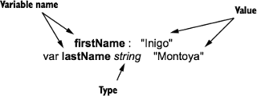
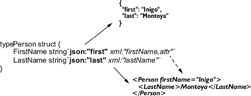

...menustart

- [11 Reflection and code generation](#f226d92098f959d56447d8f0dceb5f79)
    - [11.1 Three features of reflection](#207d97ac8eab80209297f51985f3082d)
        - [TECHNIQUE 66 Switching based on type and kind](#cc58f61e729a92813f5391cab7b2425c)
        - [TECHNIQUE 67: Discovering whether a value implements an interface](#a9ca11ee99ed6c97a08a7c7c459b6507)
        - [TECHNIQUE 68 Accessing fields on a struct](#78a78128f589cf18b987ed6a4b0cf18c)
    - [11.2 Structs, tags, and annotations](#c1fc6e93ed6ee60310e8d56d82c561f6)
        - [11.2.1 Annotating structs](#e1a0719b34e8db11538b8e8406659474)
        - [11.2.2 Using tag annotations](#f708c88ac1d03ed2b6027aa7ab14fb2f)
            - [TECHNIQUE 69 Processing tags on a struct](#0b45ead18aa1578f9a11b1b95b4027a1)
    - [11.3 Generating Go code with Go code](#e5e81b2864e9a69466bc1aac83321eab)
        - [TECHNIQUE 70 Generating code with go generate](#eb80f5b52be56947902eca88e1c67eb4)

...menuend


<h2 id="f226d92098f959d56447d8f0dceb5f79"></h2>


# 11 Reflection and code generation

 - *Reflection* ,  in software development, refers to a program’s ability to examine its own structure. 
 - As useful as Go’s reflection system is, though, sometimes it’s cleaner to avoid complex and expensive runtime reflection, and instead write code that writes code. 
    -  Code generation can accomplish some of the things that are typically done in other languages with generics. 

<h2 id="207d97ac8eab80209297f51985f3082d"></h2>


## 11.1 Three features of reflection

 - Software developers use reflection to examine objects during runtime. 
 - In a strongly typed language like Go, you may want to find out whether a particular object satisfies an interface. 
    - Or discover what its underlying kind is. 
    - Or walk over its fields and modify the data.
 - Go’s reflection tools are located inside the `reflect` package. 
 - You need to understand three critical features when working with Go’s reflection mechanism: values, types, and kinds.
    - value
        - 
    - type
        - Each value in Go has a particular type associated with it. 
        - For example, with var b bytes.Buffer, the type is bytes.Buffer. 
        - For any reflect.Value in Go, you can discover its type. Type information is accessible through the reflect .Type interface
    - kinds
        - Go defines numerous primitive kinds, such as struct, ptr (pointer), int, float64, string, slice, func (function), and so on. 
        - The reflect package enumerates all of the possible kinds with the type reflect.Kind.
            - Note that in preceding picture, the value of type string also has the kind string.)

<h2 id="cc58f61e729a92813f5391cab7b2425c"></h2>


#### TECHNIQUE 66 Switching based on type and kind

One of the most frequent uses of Go’s reflection system is identifying either the type or kind of a value. 

 - You want to write a function that takes generic values (interface{}s), and then does something useful with them based on underlying types. 
 - Go provides various methods for learning this information, ranging from the type switch to the reflect.Type and reflect.Kind types. 

---

 - Say you want to write a function with the signature `sum(…interface{}) float64`. 
    - You want  to take any number of arguments of various types. And you want it to convert the values to float64 and then sum them.  
 - The most convenient tool that Go provides for doing this is the type switch. 
    - With this special case of the switch control structure, you can perform operations based on the type of a value, instead of the data contained in a value. 


```go
func sum(v ...interface{}) float64 {
    var res float64 = 0
    for _, val := range v {
        switch val.(type) {
        case int:
            res += float64(val.(int))
        case int64:
            res += float64(val.(int64))
        case uint8:
            res += float64(val.(uint8))
        case string:
            a, err := strconv.ParseFloat(val.(string), 64)
            if err != nil {
                panic(err)
            } 
            res += a
        default:
            fmt.Printf("Unsupported type %T. Ignoring.\n", val)
        }
    }
    return res
}
```

 - **it’s important to remember that type switches operate on types (not kinds).**
    - that is , if you defined a type `type MyInt int64` , and pass a `MyInt` to sum function, `case int64` will **NOT** match for a MyInt.
    - The solution to this problem is to use the reflect package, and work based on kind instead of type.

```go
func sum(v ...interface{}) float64 {
    var res float64 = 0
    for _, val := range v {
        // Gets the reflect.Value of the item
        ref := reflect.ValueOf(val)
        // From the value, you can switch on the Kind().
        switch ref.Kind() {
        case reflect.Int, reflect.Int64:
            // The reflect.Value type provides convenience functions 
            // for converting related subkinds to their biggest version
            // (e.g., int, int8, int16…to int64).
            res += float64(ref.Int())
        case reflect.Uint8:
            res += float64(ref.Uint())
        case reflect.String:
            a, err := strconv.ParseFloat(ref.String(), 64)
            if err != nil {
            panic(err)
            }
            res += a
        default:
            fmt.Printf("Unsupported type %T. Ignoring.\n", val)
        }
    }
    return res
}
```

 - One of the pieces of information you can learn from a reflect.Value is its underlying kind.
 - Another thing that the reflect.Value type gives you is a group of functions capable of converting related types to their largest representation. 
    -  A reflect.Value with a uint8 or uint16 can be easily converted to the biggest unsigned integer type by using the reflect.Value’s Uint() method.

<h2 id="a9ca11ee99ed6c97a08a7c7c459b6507"></h2>


#### TECHNIQUE 67: Discovering whether a value implements an interface

 - Given a particular type, you want to find out whether that type implements a defined interface
 - There are two ways to accomplish this.  Use the one that best meets your needs.
    - One is with a type assertion, 
    - and the other uses the reflect package. 

---

```go
// Listing 11.4 Checking and converting a type
func isStringer(v interface{}) bool {
    // Takes an interface{} value and 
    // runs a type assertion to the desired interface
    _, ok := v.(fmt.Stringer)
    return ok
}
```

 - Type assertions are one way of testing whether a given **value** implements an interface.
 - But what if you want to test whether a type implements an interface, but determine which interface at runtime? 
    - Go’s reflection package has no reflect.Interface type. 
    - Instead, reflect.Type (which is itself an interface) provides tools for querying whether a given type implements a given interface type.  

```go
// Listing 11.5 Determine whether a type implements an interface
func implements(concrete interface{}, target interface{}) bool {
    // Gets a reflect.Type that describes
    // the target of the pointer
    iface := reflect.TypeOf(target).Elem()
    
    // Gets the reflect.Type of the concrete type passed in
    v := reflect.ValueOf(concrete)
    t := v.Type()
    
    if t.Implements(iface) {
        fmt.Printf("%T is a %s\n", concrete, iface.Name())
        return true
    }
    fmt.Printf("%T is not a %s\n", concrete, iface.Name())
    return false
}

func main() {
    n := &Name{First: "Inigo", Last: "Montoya"}
    stringer := (*fmt.Stringer)(nil)
    implements(n, stringer)

    writer := (*io.Writer)(nil)
    implements(n, writer)
}
```

 - The implements() function takes two values. 
    - It tests whether the first value (concrete) implements the interface of the second (target). 
    - The implements() function does assume that the target is a pointer to a value whose dynamic type is an interface. 
 - To test whether concrete implements the target interface, you need to get the reflect.Type of both the concrete and the target. 
 - There are two ways of doing this.    
    - The first uses reflect.TypeOf() to get a reflect.Type, and a call to Type.Elem() to get the type that the target pointer points to:
        - `iface := reflect.TypeOf(target).Elem()`
    - The second gets the value of concrete, and then gets the reflect.Type of that value.
        - `v := reflect.ValueOf(concrete) ;  t := v.Type() `
 - The trickier part of this test, though, is getting a reference to an interface. 
    - There’s no way to directly reflect on an interface type.  Interfaces don’t work that way; you can’t just instantiate one or reference it directly
    - Instead, you need to find a way to create a placeholder that implements an interface.
        - The simplest way is to do something we usually recommend studiously avoiding: intentionally create a nil pointer. 
        - You need the Elem() call in order to get the type of the nil.

<h2 id="78a78128f589cf18b987ed6a4b0cf18c"></h2>


#### TECHNIQUE 68 Accessing fields on a struct

 - You want to learn about a struct at runtime, discovering its fields.
 - Reflect the struct and use a combination of reflect.Value and reflect.Type to find out information about the struct.
 - TODO


<h2 id="c1fc6e93ed6ee60310e8d56d82c561f6"></h2>


## 11.2 Structs, tags, and annotations

 - Go has no macros, and unlike languages such as Java and Python, Go has only Spartan support for annotations. 
 - But one thing you can easily annotate in Go is properties on a struct. 

<h2 id="e1a0719b34e8db11538b8e8406659474"></h2>


### 11.2.1 Annotating structs

 - An example of using struct annotations with things like the JSON encoder. 


```
// Listing 11.8 Simple JSON struct
package main
import (
     "encoding/json"
     "fmt" 
)
type Name struct {
     First string `json:"firstName"`
     Last  string `json:"lastName "`
}
func main() {
     n := &Name{"Inigo", "Montoya"}
     data, _ := json.Marshal(n)
     fmt.Printf("%s\n", data)B
}

// result:  
//   {"firstName":"Inigo","lastName ":"Montoya"}
// without the annotation, it will output :  
//   {"First":"Inigo","Last":"Montoya"}
```

 - This code declares a single struct, `Name`, that’s annotated for JSON encoding. 
    - it maps the struct member `First` to the JSON field `firstName`, and the struct field `Last` to `lastName`. 
    - The struct annotations make it possible to control how your JSON looks.
 - Annotations are a free-form string enclosed in back quotes that follows the type declaration of a struct field.
 - Annotations play no direct functional role during compilation, but annotations can be accessed at runtime by using reflection. 
    - It’s up to the annotation parsers to fig- ure out whether any given annotation has information that the parser can use. 
    - For example, you could modify the preceding code to include different annotations, as shown in the next listing.

```
// Listing 11.9 A variety of annotations
type Name struct {
             First string `json:"firstName" xml:"FirstName"`
             Last  string `json:"lastName,omitempty"`
             Other string `not,even.a=tag`
}
```
 - These annotations are all legal, in the sense that the Go parser will correctly handle them. 
    - And the JSON encoder will be able to pick out which of those applies to it.
        - It will ignore the xml tag as well as the oddly formatted annotation on the `Other` field.
 - As you can see from the tags in listing 11.9, an annotation has no fixed format. Just about any string can be used.
    - But a certain annotation format has emerged in the Go community and is now a de facto standard. Go developers call these annotations tags.


<h2 id="f708c88ac1d03ed2b6027aa7ab14fb2f"></h2>


### 11.2.2 Using tag annotations

 - The sample JSON struct you looked at earlier contained annotations of the form : `json: "NAME,DATA"`
    - where `NAME` is the name of the field (in JSON documents),
    - and `DATA` is a list of optional information about the field (omitempty or kind data)
 - Likewise, if you look at the encoding/xml package,  you’d see a pattern similar to annotations for converting structs to and from XML.
    - Tags for XML look like this:`xml:"body"` and `xml:"href,attr"`
    - where NAME is the field name, and DATA contains a list of information about the field. 



**Annotations for validation**

One of the most interesting uses for annotations that we’ve seen is for validating field data on a struct.  By adding regular expressions in tags (`validate:"^[a-z]+$"`), and then writing code to run those regular expressions over struct data, you can write validation code easily and concisely. An example can be found in the Deis Router project at https://github.com/deis/router.

<h2 id="0b45ead18aa1578f9a11b1b95b4027a1"></h2>


####  TECHNIQUE 69 Processing tags on a struct

 - Annotations can be useful in a wide variety of situations. 
 - Annotations can just as readily be used to describe how database field types map to structs, or how to format data for display.
 - And because the annotation format is undefined, to build your annotations, you need only decide on a format and then write an implementation.
 - PROBLEM: You want to create your own annotations and then programmatically access the annotation data of a struct at runtime.
 - SOLUTION: Define your annotation format, Then use the `reflect` package to write a tool that extracts the annotation information from a struct.
 - Say you want to write an encoder for a simple file syntax for name-value pairs. 
    -  This for- mat is similar to the old INI format. An example of this file format looks like this:

```
total=247
running=2
sleeping=245
threads=1189
load=70.87
```

 - Now imagine that you want to create a struct to represent this data

```
type Processes struct {
     Total    int
     Running  int
     Sleeping int
     Threads  int
     Load     float32
}
```

 - To convert the plain file format into a struct like this, you can create a tag that fits your needs and then mark up your struct with them

```
type Processes struct {
     Total    int     `ini:"total"`
     Running  int     `ini:"running"`
     Sleeping int     `ini:"sleeping"`
     Threads  int     `ini:"threads"`
     Load     float32 `ini:"load"`
}
```

 - As you design this, you can once again rely on existing conventions.  
    - Encoders and decoders in Go tend to provide marshal() and unmarshal() methods with a fairly predictable set of parameters and return values.
    - So your INI file decoder will implement the same pattern, as shown in the following listing.

```
// Listing 11.12 The marshal and unmarshal pattern
func Marshal(v interface{}) ([]byte, error) {}
func Unmarshal(data []byte, v interface{}) error {}
```

 - The bulk of both of these functions involves reflecting over the interface{} values and learning about how to extract data from or populate data into those values. 
    - To keep the code concise, the following example deals only with marshaling and unmarshaling structs.

```
// Listing 11.13 Processesandmain()
package main
import (
     "bufio"
     "bytes"
     "errors"
     "fmt"
     "reflect"
     "strconv"
     "strings"
)

type Processes struct {
     Total    int     `ini:"total"`
     Running  int     `ini:"running"`
     Sleeping int     `ini:"sleeping"`
     Threads  int     `ini:"threads"`
     Load     float32 `ini:"load"`
}

func main() {
    fmt.Println("Write a struct to output:")
    proc := &Processes{
       Total:    23,
       Running:  3,
       Sleeping: 20,
       Threads:  34,
       Load:     1.8,
    }
    // Marshals the struct into a []byte
    data, err := Marshal(proc)
    if err != nil {
        panic(err)
    }
    fmt.Println(string(data)) // print the result
    fmt.Println("Read the data back into a struct")
    // Creates a new Processes struct and unmarshals the data into it
    proc2 := &Processes{}
    if err := Unmarshal(data, proc2); err != nil {
       panic(err)
    }
    fmt.Printf("Struct: %#v", proc2)
}
```

 - You begin with an instance of your Processes struct and then marshal it into a byte array.
    - When you print the results, they’ll be in your INI file format.
    - Then you take that same data and run it back through the other direction, expanding the INI data into a new Processes struct.
    - Running the program produces output like this:

```
Write a struct to a output:
total=23
running=3
sleeping=20
threads=34
load=1.8

Read the data back into a struct
Struct: &main.Processes{Total:23, Running:3, Sleeping:20, Threads:34,
Load:1.8}
``` 

```
// Listing 11.14 The Marshal function

// A utility function to read tags off of struct fields
func fieldName(field reflect.StructField) string {
    // Gets the tag off the struct field
    if t := field.Tag.Get("ini"); t != "" {
        return t
    }
    // If there is no tag, falls back to the field name
    return field.Name
}

func Marshal(v interface{}) ([]byte, error) {
    var b bytes.Buffer
    // Gets a reflect.Value of the current interface. 
    // Dereferences pointers.
    val := reflect.Indirect(reflect.ValueOf(v))
    // For this program, you handle only structs
    if val.Kind() != reflect.Struct {
        return []byte{}, errors.New("unmarshal can only take structs")
    }
    t := val.Type()
    // Loops through all of the fields on the struct
    for i := 0; i < t.NumField(); i++ {
        f := t.Field(i)
        // Gets the name from tagName
        name := fieldName(f)
        raw := val.Field(i).Interface()
        // Relies on the print formatter to 
        // print the raw data into the buffer
        fmt.Fprintf(&b, "%s=%v\n", name, raw)
    }
    return b.Bytes(), nil
}

```

 - Elem Vs Indirect 
    - If a reflect.Value is a pointer, then v.Elem() is equivalent to reflect.Indirect(v). 
    - If it is not a pointer, then they are not equivalent:
        - If the value is an interface then reflect.Indirect(v) will return the same value, while v.Elem() will return the contained dynamic value.
        - If the value is something else, then v.Elem() will panic.
 - This Marshal() function takes the given v interface{} and reads through its fields.
    - By examining the type, it can iterate through all the fields on the struct, and for each field, it can access the annotation (via StructField.Tag())
        - For any annotation tag that follows the format `NAME:"VALUE"`, you can access the value by using StructField.Tag.Get() 
    - As it loops through the struct fields, it can also fetch the relevant values for each struct field. 
    - Rather than man- ually convert these values from their native type to a string, you rely on fmt.Fprintf() to do that work for you.


**Ignoring struct fields with annotations**

Sometimes you want to tell encoders to ignore fields on a struct. The common idiom for doing this is to use a dash (-) in the name field of the annotation (json:"-"“).Although we don’t support this in the preceding code, you could extend the example to ignore fields whose name is -.

```
// Listing 11.15 The Unmarshal function

func Unmarshal(data []byte, v interface{}) error {
    val := reflect.Indirect(reflect.ValueOf(v))
    t := val.Type()

    b := bytes.NewBuffer(data)
    // From data, you use a scanner to 
    // read one line of INI data at a time.
    scanner := bufio.NewScanner(b)
    for scanner.Scan() { 
        line := scanner.Text()
        pair := strings.SplitN(line, "=", 2)
        if len(pair) < 2 {
            // Skip any malformed lines.
            continue
        }
        // Passes the task of setting the value to setField
        setField(pair[0], pair[1], t, val)
    }
    return nil
}
```

```
// Listing 11.16 The setField helper function

// setField takes the raw name and value from the INI data, 
// and also the type and value of the struct itself.
func setField(name, value string, t reflect.Type, v reflect.Value) {
    for i := 0; i < t.NumField(); i++ {
        field := t.Field(i)
        if name == fieldName(field) {
            var dest reflect.Value
            // Uses a kind switch to figure out how to 
            // take your value string and convert it to the right type
            switch field.Type.Kind() {
            default:
                // If you don’t know about the kind, just skip the field. 
                // This isn’t an error.
                fmt.Printf("Kind %s not supported.\n",field.Type.Kind())
                continue
            case reflect.Int:
                ival, err := strconv.Atoi(value) 
                if err != nil {
                    fmt.Printf( "Could not convert %q to int: %s\n", value, err) 
                    continue    
                }
                dest = reflect.ValueOf(ival)
            case reflect.Float64:
                fval, err := strconv.ParseFloat(value, 64)
                if err != nil {
                    fmt.Printf( "Could not convert %q to float64: %s\n", value, err) 
                    continue
                }
                dest = reflect.ValueOf(fval)
            case reflect.String:
                dest = reflect.ValueOf(value)
            case reflect.Bool:
                bval, err := strconv.ParseBool(value)
                if err != nil {
                    fmt.Printf( "Could not convert %q to bool: %s\n", value, err) 
                    continue
                }
                dest = reflect.ValueOf(bval)
            }
            // Sets the value for the relevant struct field
            v.Field(i).Set(dest)
        }
    }
}
```


 - One thing becomes clear when scanning the code you’ve written in this technique:
    - because of Go’s strong type system, converting between types often takes a lot of boilerplate code.
    - Sometimes you can take advantage of built-in tools (for example, fmt.Fprintf()). Other times, you must write tedious code.
    - Instead of writing reflection code, you might find it useful to use Go’s generator tool to generate source code for you.
    - In the next section, you’ll look at one example of writing a generator to do work that would otherwise require runtime type checking and detailed reflection code. 

---

<h2 id="e5e81b2864e9a69466bc1aac83321eab"></h2>


## 11.3 Generating Go code with Go code

 - With no generics, how do you create type-specific collections? 
 - The runtime cost of reflection is high. Is there a way to write better- performing code?
 - Annotations have only limited capabilities; is there another way to transform code?
 - How do you metaprogram in Go?

---

 - An often overlooked feature of Go is its capability to generate code. Go ships with a tool, `go generate`, designed exactly for this purpose.
    - For generating a large number of repetitive but type-safe objects, generators can ease your development lifecycle.
    - `go generate` is aware of the Go environment, and can be run on files and packages. 
 - The tool walks through the files you’ve specified, and it looks at the first line of each file. If it finds a particular pattern, it executes a program. 
    - The pattern looks like this:
        - `//go:generate COMMAND [ARGUMENT...]`
    - The generator looks for this comment right at the top of each Go file that you tell it to search. 
        - If it doesn’t find a header, it skips the file.
        - If it does find the header, it executes the `COMMAND`.
    - The COMMAND can be any command-line tool that the generator can find and run. You can pass any number of arguments to the command. 

```
//Listing 11.17 A trivial generator

//go:generate echo hello
package main
func main() {
     println("Goodbyte")
}

// ----------------
$ go generate test1.go
hello
```

 - All the generator does is execute the command, which prints hello to the console. Although this implementation is simple, the idea is that you can add commands that generate code for you. You’ll see this in action in the next technique.


<h2 id="eb80f5b52be56947902eca88e1c67eb4"></h2>


####  TECHNIQUE 70 Generating code with go generate

 - Writing custom type-safe collections, generating structs from database tables, transforming JSON schemata into code, generating many similar objects
    - these are some of the things we’ve seen developers use Go generators for.
 - Sometimes Go developers use the Abstract Syntax Tree (AST) package or yacc tool to generate Go code. But we’ve found that one fun and easy way to build code is to write Go templates that gen- erate Go code.

 - PROBLEM: You want to be able to create type-specific collections, such as a queue, for an arbitrary number of types. And you’d like to do it without the runtime safety issues and perfor- mance hit associated with type assertions.
 - SOLUTION: Build a generator that can create queues for you, and then use generation headers to generate the queues as you need them.
 - You want queues that follow a pattern like the next listing.

```go
// Listing 11.18 Simple queue
package main

// A simple queue backed by a typed slice
type MyTypeQueue struct {
     q []MyType
}

func NewMyTypeQueue() *MyTypeQueue {
     return &MyTypeQueue{
            q: []MyType{},
    } 
}

func (o *MyTypeQueue) Insert(v MyType) {
     o.q = append(o.q, v)
}

func (o *MyTypeQueue) Remove() MyType {
    if len(o.q) == 0 {
        panic("Oops.")
    }
    first := o.q[0]
    o.q = o.q[1:]
    return first
}
```


 - This code is a good representation of what you want to have generated for you. 
    - There are certain bits of information that you want to be filled in at generation time. 
    - The obvious example is the type. 
    - But you also want the package name to be filled out automatically. 
 - Your next step, then, is to translate the preceding code into a Go template.
 - The next listing shows the beginning of your queue generator tool.


```
// Listing 11.19 The queue template

package main

import (
     "fmt"
     "os"
     "strings"
     "text/template"
)

// the following code is to define a template `tpl`
// .Package is your package placeholder
var tpl = `package {{.Package}}

// .MyType is your type placeholder
type {{.MyType}}Queue struct {
     q []{{.MyType}}
}

func New{{.MyType}}Queue() *{{.MyType}}Queue {
     return &{{.MyType}}Queue{
            q: []{{.MyType}}{},
    } 
}

func (o *{{.MyType}}Queue) Insert(v {{.MyType}}) {
     o.q = append(o.q, v)
}
func (o *{{.MyType}}Queue) Remove() {{.MyType}} {
     if len(o.q) == 0 {
         panic("Oops.")
     }
     first := o.q[0]
     o.q = o.q[1:]
     return first
}
`
```

 - Your template is almost the same as the target code you wrote previously, but with the package name replaced with `{{.Package}}`, and the MyType prefix replaced with `{{.MyType}}`.
 - From here, you need to write the code that performs the generation.
    - Ideally, what you’d like is to be able to write something like this: `//go:generate queue MyInt`
    - And as a result, the generator would generate a `MyIntQueue` implementation. It’d be even nicer if you could generate queues for multiple types at once:  `//go:generate queue MyInt MyFloat64` 
 - You should be able to easily accommodate that, too, as shown in the next listing.

```
// Listing 11.20 The main queue generator

func main() {
    // Compiles the generator template
    tt := template.Must(template.New("queue").Parse(tpl))
    // Loops through the args, making a file named TYPE_queue.go for each
    for i := 1; i < len(os.Args); i++ {
        dest := strings.ToLower(os.Args[i]) + "_queue.go"
        file, err := os.Create(dest)
        if err != nil {
            fmt.Printf("Could not create %s: %s (skip)\n", dest, err)
            continue
        }
        vals := map[string]string{
            "MyType":  os.Args[i],
            "Package": os.Getenv("GOPACKAGE"),
        }
        // Executes the template, sending the results to the file
        tt.Execute(file, vals)
        file.Close()
    }
}   
```

```
// Listing 11.21 Using the generator

//go:generate ./queue MyInt
//go:generate echo generate myint_queue.go
package main

import "fmt"
type MyInt int

func main() {
    var one, two, three MyInt = 1, 2, 3
    q := NewMyIntQueue()
    q.Insert(one)
    q.Insert(two)
    q.Insert(three)
    fmt.Printf("First value: %d\n", q.Remove())
}
```

 - This is a good example of typical usage of a Go generator.
    - In this one file, you declare a generator, you declare your type, and you even use the generator.
 - Clearly, this code will not compile until you’ve run the generator. 
    - But because the generator doesn’t depend on your code compiling, you can (and should) run it before building your package.
 - That raises an important point about generators: they’re intended to be used as development tools.
    - The Go authors intended that generation was part of the development lifecycle, not the build or runtime cycle. 
    - For example, you should always generate your code and then check the generated code into your VCS. You shouldn’t require your users to run a generator (even if your users are other developers).
 - The code you’re using for this generator is basic. Instead of adding good error handling, you let the queue panic. And you don’t handle the case where you’d want to queue pointers. But these problems are easily remedied by using the normal strate- gies. Adding pointers, for example, is just a matter of adding another template param- eter that adds an asterisk (`*`) where appropriate.
 - Again, Go templates aren’t the only way to generate code. 
    - Using the `go/ast` package, you can generate code by programming the abstract syntax tree. 
    - For that matter, you could just as easily write Python, C, or Erlang code that generated Go. 
 - You’re not even limited to outputting Go.    
    - Imagine generating SQL `CREATE` statements by using a generator that reads structs. 
    - One of the things that make go generate so elegant is the versatility within its simplicity.

---

 - Taking a higher-level view, generators can be a useful way of writing repetitive code that would otherwise use reflection. Go’s reflection mechanism is useful, but it’s tedious to write and limited in capabilities, and the performance of your application will suffer. That’s not to say that reflection is bad. Rather, it’s a tool designed to solve a specific set of problems.
 - On the other hand, generating code isn’t always the best solution either. Metapro- gramming can make debugging hard. It also adds steps to the development process. Just as with reflection, generation should be used when the situation calls for it. But it’s not a panacea or a workaround for Go’s strong typing.

---


