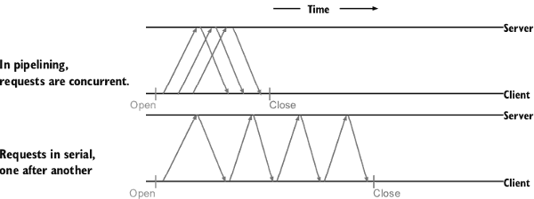

...menustart

- [9 Taking your applications to the cloud](#d1c54b84242e47f19f87c6482d86b347)
    - [9.3 Running on cloud servers](#722dd4a8225fec63838397a1e8ba207c)
        - [9.3.1 Performing runtime detection](#de29fefdb9208a13a7236e3f64dda169)
            - [TECHNIQUE 58 Gathering information on the host](#523b30db1ce05d9b8780caa7538b4d95)
            - [TECHNIQUE 59 Detecting dependencies](#28b83a853afe9e4eb77ff363948c13e2)
        - [9.3.2 Building for the cloud](#779ab6eebba31d416bb98e7c1a7c7bbb)
            - [TECHNIQUE 60 Cross-compiling](#0ecbf8661f18cd43d5a37a5387b78338)
        - [9.3.3 Performing runtime monitoring](#6b1dcbf228ab822cc2300ce214a5c0d1)
            - [TECHNIQUE 61 Monitoring the Go runtime](#55a5d506b71cfaed0b4a6a2de2c70870)
- [10 Communication between cloud services](#6e82ecdb480e38d4c1507234f48fcca5)
    - [10.2 Communicating between services](#f85f828e97ebd8b490a68bb2c57b060d)
        - [10.2.1 Making REST faster](#36cf47bc343116e82448b9ff8c7de4b8)
            - [TECHNIQUE 62 Reusing connections](#e3ed230aa10632ff0809c4857dfb430a)
            - [TECHNIQUE 63 Faster JSON marshal and unmarshal](#0f692d034f145bcf50b4d730ae829ad1)
        - [10.2.2 Moving beyond REST](#78beaa31ae8968d176dcb56d425cf05b)
            - [TECHNIQUE 64 Using protocol buffers (TODO)](#b044a1bb14a386f83f90d29a5f7bef5b)
            - [TECHNIQUE 65 Communicating over RPC with protocol buffers (TODO)](#ba0a5026d7b0a528526dd0e7c6af1c61)

...menuend


<h2 id="d1c54b84242e47f19f87c6482d86b347"></h2>


# 9 Taking your applications to the cloud

<h2 id="722dd4a8225fec63838397a1e8ba207c"></h2>


## 9.3 Running on cloud servers

<h2 id="de29fefdb9208a13a7236e3f64dda169"></h2>


### 9.3.1 Performing runtime detection

<h2 id="523b30db1ce05d9b8780caa7538b4d95"></h2>


#### TECHNIQUE 58 Gathering information on the host

- The `os` package has the capability to detect a wide range of details about the environment. The following list highlights several examples:
    - os.Hostname() returns the kernel’s value for the hostname.
    - The process ID for the application can be retrieved with os.Getpid().
    - Operating systems can and do have different path and path list separators.
        - Using os.PathSeparator or os.PathListSeparator instead of characters allows applications to work with the system they’re running on.
    - To find the current working directory, use os.Getwd(). 


```go
// Listing 9.6 Look up the host’s IP addresses via the hostname


func main() {
    name, err := os.Hostname()
    if err != nil {
        fmt.Println(err)
        return
    }
    // Looks up the IP addresses 
    // associated with the hostname
    addrs, err := net.LookupHost(name)
    if err != nil {
        fmt.Println(err)
        return
    }
    // Prints each of the IP addresses, 
    // as there can be more than one
    for _, a := range addrs {
        fmt.Println(a)
    }
}
```


<h2 id="28b83a853afe9e4eb77ff363948c13e2"></h2>


#### TECHNIQUE 59 Detecting dependencies

- In addition to communicating with the kernel or base operating system, Go applications can call other applications on the system.
    - `os/exec` 
- But what happens if the application being called isn’t installed? 

- RPOBLEM: How can you ensure that it’s okay to execute an application before calling it?
- SOLUTION: Prior to calling a dependent application for the first time, detect whether the application is installed and available for you to use.
    - If the application isn’t present, log an error to help with troubleshooting.


```go
// Listing 9.7 Function to check whether the application is available


func checkDep(name string) error {
    // Checks whether the passed-in dependency 
    // is in one of the PATHs. 
    if _, err := exec.LookPath(name); err != nil {
        es := "Could not find '%s' in PATH: %s"
        return fmt.Errorf(es, name, err)
    }
    return nil
}
```


<h2 id="779ab6eebba31d416bb98e7c1a7c7bbb"></h2>


### 9.3.2 Building for the cloud

<h2 id="0ecbf8661f18cd43d5a37a5387b78338"></h2>


####  TECHNIQUE 60 Cross-compiling

```
GOOS=xxx GOARCH=xxx go build
```

- WARNING: If your application is using cgo to interact with C libraries, complications can arise. Be sure to test the applications on all cross-compiled platforms.

- If you want to compile to multiple operating systems and architectures, one option is `gox`, which enables building multiple binaries concurrently.
- You can install gox as follows:
    - `$ go get -u github.com/mitchellh/gox`

```
$ gox \
  -os="linux darwin windows " \
  -arch="amd64 386" \
  -output="dist/{{.OS}}-{{.Arch}}/{{.Dir}}" .
```


<h2 id="6b1dcbf228ab822cc2300ce214a5c0d1"></h2>


### 9.3.3 Performing runtime monitoring

<h2 id="55a5d506b71cfaed0b4a6a2de2c70870"></h2>


#### TECHNIQUE 61 Monitoring the Go runtime

- PROBLEM: How can your application log or otherwise monitor the Go runtime?
- SOLUTION: The `runtime` and `runtime/debug` packages provide access to the information within the runtime.
- When an application starts up, it can start a goroutine to monitor the runtime and write details to a log. 

```go
// Listing 9.9 Monitor an application’s runtime
func monitorRuntime() {
    log.Println("Number of CPUs:", runtime.NumCPU())
    m := &runtime.MemStats{}
    for {
        r := runtime.NumGoroutine()
        log.Println("Number of goroutines", r)
        runtime.ReadMemStats(m)
        log.Println("Allocated memory", m.Alloc)
        time.Sleep(10 * time.Second)
    }
}
```

- It’s important to know that calls to `runtime.ReadMemStats` momentarily halt the Go runtime, which can have a performance impact on your application. 
    - You don’t want to do this often, and you may want to perform operations that halt the Go runtime only when in a debug mode.
- The runtime package has access to a wealth of information:
    - Information on garbage collection, including when the last pass was, the heap size that will cause the next to trigger, how long the last garbage collection pass took, and more
    - Heap statistics, such as the number of objects it includes, the heap size, how much of the heap is in use, and so forth
    - The number of goroutines, processors, and `cgo` calls


----


<h2 id="6e82ecdb480e38d4c1507234f48fcca5"></h2>


# 10 Communication between cloud services

- This chapter covers
    - Reusing connections between services for faster performance
    - Providing faster JSON marshaling and unmarshaling
    - ...

<h2 id="f85f828e97ebd8b490a68bb2c57b060d"></h2>


## 10.2 Communicating between services

- One of the key elements in a microservice architecture is communication between the microservices. If not well done, this can become a bottleneck in the performance of an application.

<h2 id="36cf47bc343116e82448b9ff8c7de4b8"></h2>


### 10.2.1 Making REST faster

<h2 id="e3ed230aa10632ff0809c4857dfb430a"></h2>


#### TECHNIQUE 62 Reusing connections

- PROBLEM: When each request is over its own connection, a significant amount of time is lost to network communication. How can an application avoid as much of this lost time as possible?
- SOLUTION: Reuse connections.
    - Multiple HTTP requests can be made over a single connection.
- Whether your application is using HTTP/2 (first available in Go 1.6) or HTTP/1 and HTTP/1.1 for your communications, you can reuse connections. 
    - Go tries to reuse connections out of the box, and **it’s the patterns in an application’s code that can cause this to not happen**.
- The server included in the net/http package provides HTTP keep-alive support. 
    - Most systems support TCP keep-alive needed to reuse connections out of the box. 
    - As of Go 1.6, the net/http package includes transparent support for HTTP/2, which has other communication advantages that can make communication even faster.
- **NOTE**: HTTP keep-alive and TCP keep-alive are different. 
    - HTTP keep-alive is a feature of the HTTP protocol a web server needs to implement.
        - The web server needs to periodically check the connection for incoming HTTP requests within the keep-alive time span. 
        -  HTTP request is received within that time span, it closes the connection. 
    - Alternately, TCP keep-alive is handled by the operating system in TCP communications. 
    - Disabling keep-alive with `DisableKeepAlives` disables both forms of keep-alive.
- Most of the problems preventing connection reuse are in the clients used to communicate with HTTP servers. 
    - The first and possibly most widespread problem happens when custom transport instances are used and keep-alive is turned off.
- When the basic functions in the net/http package are used, such as http.Get() or http.Post(), they use `http.DefaultClient`, which is configured with keep-alive enabled and set up for 30 seconds.
    - When an application creates a custom client but doesn’t specify a transport, http.DefaultTransport is used.
    - http.DefaultTransport is used by http.DefaultClient and is configured with keep-alive enabled.
- Transporting without keep-alive can be seen in open source applications, examples online, and even in the Go documentation. 
    - For instance, the Go documentation has an example that reads as follows:

```go
// bad code
tr := &http.Transport{
     TLSClientConfig:    &tls.Config{RootCAs: pool},
     DisableCompression: true,
}
client := &http.Client{Transport: tr}
resp, err := client.Get("https://example.com")
```

- In this example, a custom Transport instance is used with altered certificate authori- ties and compression disabled.
    - In this case, keep-alive isn’t enabled. 
    - The following list- ing provides a similar example, with the difference being that keep-alive is enabled.

```go
// The Dial function is configured with a keep-alive and timeout
// This is the same configuration as the http.DefaultTransport.
tr := &http.Transport{
     TLSClientConfig:    &tls.Config{RootCAs: pool},
     DisableCompression: true,
     Dial: (&net.Dialer{
            Timeout:   30 * time.Second,
            KeepAlive: 30 * time.Second,
     }).Dial,
}
client := &http.Client{Transport: tr}
resp, err := client.Get("https://example.com")
```
 
- One part of working with http.Transport can be confusing. 
    - Setting its DisableKeep- Alives property to true disables connection reuse.
    - Setting DisableKeepAlives to false doesn’t mean that connections are explicitly reused. 
        - It means you can opt in to either HTTP or TCP keep-alive.
- The other behavior that can prevent connection reuse occurs when the body of a response isn’t closed.
    - Prior to HTTP/2, pipelining was almost never implemented or used. 
    - Pipelining allows multiple requests and their responses to be communicated in parallel rather than in serial.




- Prior to HTTP/2, one request and response needed to be completed before the next could be used. The body of the response would need to be closed before another HTTP request and response could use the connection.
- The following listing illustrates a common case of one response body not being closed before another HTTP request is made.

```go
// Listing 10.2 Failing to close an HTTP response body
// bad code , failed to reuse connection

func main() {
r, err := http.Get("http://example.com")
if err != nil {
    ...
}
defer r.Body.Close()
o, err := ioutil.ReadAll(r.Body)
if err != nil {
    ...
}
// Use the body content

// Makes a second HTTP request. 
// Because the body isn’t yet closed on the first, 
// a new connection needs to be made.
r2, err := http.Get("http://example.com/foo")
if err != nil {
    ...
}
defer r2.Body.Close()
o, err = ioutil.ReadAll(r2.Body)
if err != nil {
    ...
}
```

- In this case, using defer isn’t optimal.
    - Instead, the body should be closed when it’s no longer needed. 

<h2 id="0f692d034f145bcf50b4d730ae829ad1"></h2>


#### TECHNIQUE 63 Faster JSON marshal and unmarshal

- json string -> interface{}
- PROBLEM: Instead of figuring out the types of data each time JSON is marshaled or unmarshaled, how can the type be figured out once and skipped on future passes?
- SOLUTION: Use a package able to generate code that can marshal and unmarshal the JSON. 
    - The generated code skips reflection and provides a faster execution path with a smaller memory footprint. 
- Reflection in Go is fairly fast. It does allocate memory that needs to be garbage- collected, and there’s a small computational cost. 
- When using optimized generated code, those costs can be reduced, and you can see a performance improvement.
- Several packages are designed to do this. In listing 10.4 you’ll look at the package `github.com/ugorji/go/codec`, which is designed to work with Binc, MessagePack, and Concise Binary Object Representation (CBOR) in addition to JSON.
    - Binc, MessagePack, and CBOR are alternative data exchange formats, though none is as popular as JSON.

```go
// Listing 10.4 A struct annotated for codec

//go:generate codecgen -o user_generated.go user.go

package user

// The User struct is annotated for codec instead of JSON
type User struct {
     Name  string `codec:"name"`
     Email string `codec:",omitempty"`
}
```

- `codec` can’t generate code for main packages.
    - Here the *user* functionality is in the *user* package.

- To generate code, the codecgen command needs to be installed.
    - `$ go get -u github.com/ugorji/go/codec/codecgen`

- After codecgen is installed, you can use it to generate code on this file, named user.go, by executing the following command:
    - `$ codecgen -o user_generated.go user.go `
        - it will create an output file user_generated.go which contains codec.Selfer implementations for the named types found in the files parsed.
    - more common useage is :
        - `$codecgen -o values_codecgen.go values.go values2.go moretypedefs.go`
- In the generated file, you’ll notice that two public methods have been added to the `User` type: `CodecEncodeSelf` and `CodecDecodeSelf`.
    - When these are present, the ugorji `codec` package uses them to encode or decode the type. 
    - When they’re absent, the ugorji `codec` package falls back to doing these at runtime.
- When the codecgen command is installed, it can be used with go generate.
    - `$ go generate ./...`
- After the `User` type is ready for use, the encoding and decoding can be incorporated into the rest of the application, as shown in the next listing.

```go
// Listing 10.5 Encode an instance to JSON with codec

// Creates a new JSON handler for the encoder
jh := new(codec.JsonHandle)
u := &user.User{
    Name:  "Inigo Montoya",
     Email: "inigo@montoya.example.com",
}

var out []byte
// Encodes the instance of User into the 
// output using the JSON handle.
err := codec.NewEncoderBytes(&out, jh).Encode(&u)
if err != nil {
    ...
}
fmt.Println(string(out))

// output
{"name":"Inigo Montoya","Email":"inigo@montoya.example.com"}
```


- The byte slice with the JSON that was created in listing 10.5 can be decoded into an instance of User, as shown in the following listing.

```go
// Listing 10.6 Decode JSON into an instance of a type
var u2 user.User
// he decoder can reuse the JSON handler.
err = codec.NewDecoderBytes(out, jh).Decode(&u2)
if err != nil {
    ...
}
fmt.Println(u2)  
```

<h2 id="78beaa31ae8968d176dcb56d425cf05b"></h2>


### 10.2.2 Moving beyond REST

<h2 id="b044a1bb14a386f83f90d29a5f7bef5b"></h2>


####  TECHNIQUE 64 Using protocol buffers (TODO)
    
`$ go get -u github.com/golang/protobuf/protoc-gen-go`

<h2 id="ba0a5026d7b0a528526dd0e7c6af1c61"></h2>


####  TECHNIQUE 65 Communicating over RPC with protocol buffers (TODO)


 


