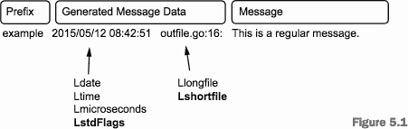

...menustart

- [Go In Practice , 70 Teches](#71c585005b73e8b143984da7dee9b0d3)
- [2 A solid foundation](#0d64118c7f6ff8aeadfb2c9db268f32b)
    - [2.1 Working wiht CLI applications, the Go way](#f4fc9ba35db46faa075c17a7587260c1)
        - [2.1.1 Command-line flags](#56dfd6c36821c5a64983eff289699453)
    - [2.2 Handling configuration](#3863b9486b6e97a49ff1790df08b38dc)
    - [2.3 Working with real-world web servers](#1e5b504a7ecb0799f2b760c225242b19)
        - [2.3.1 Starting up and shutting down a server](#d1dfba069bae305472df676269e71aa9)
            - [TECHNIQUE 5 **Graceful shutdowns using manners**](#a07a125760957367633ba77e5ed4530c)
        - [2.3.2 Routing web requests](#daef946a510d0ed9c04cffe18d824726)
            - [TECHNIQUE 7 **Handling complex paths with wildcards**](#d4af0cb12ed09354dfbb5330e69cf4ab)
            - [TECHNIQUE 8 **URL pattern matching** (TODO)](#4bb8963ed0a77bc17c592a558cd1cc6b)
            - [TECHNIQUE 9 **Faster routing (without the work)**](#ec97b62dff33af2f1b3e7ec9768ab166)
- [3 Concurrency in Go](#16f99609cccf72d44e6fb4b00b7aa9b5)
    - [3.1](#5b068a95442c7d5505b4166a77357ea5)
        - [TECHNIQUE 12 Locking with a mutex](#be28e97d79982d9d2558707ac5ffbf15)
    - [3.2 Working with channels](#5c609ddacc07fb066d6f3df5528b0d89)
        - [TECHNIQUE 13 **Using multiple channels**](#095b91b04bcc9a07cfc88460ce2b0966)
        - [TECHNIQUE 14 **Closing channels**](#a9b7b2027d7d718a120329e6af8c6ba8)
        - [TECHNIQUE 15 **Locking with buffered channels**](#8a5dde7c7f82ceed2cf05c02f94ecd91)
- [4 Handling errors and panics](#5c14286df98cd800d088a14ee136b866)
    - [4.1 Error handling](#1a2bb328b5fa8ef5dcc6324dfc56d06d)
        - [TECHNIQUE 17 Custom error types](#bb9a69e5ffcd34c51ed7ac377377e0b2)
        - [TECHNIQUE 18 Error variables](#6eacf66e42cd6548ca6f4e4de743a7b2)
    - [4.2 The panic system](#e72b11fe4a7d7755c9bb9da078ed7c7a)
        - [4.2.2 Working with panics](#948d52c1d352272f319d60422e92f251)
        - [4.2.3 Recovering from panics](#58be2510484c3a3b9626aaa5bcbc69c9)
        - [4.2.4 Panics and goroutines](#23ae8dbb31cc7891d0c3de597f0bc523)
- [5 Debugging and testing](#b8ad4f9f531cf42a4bbe3bc9ecf746ab)
    - [5.2 Logging](#2c0ce02cb81521bcb1e13a7d2537d1dd)
        - [5.2.1 Using Go’s logge](#0a06ab7d7bc94825761e4f71180d1739)
        - [5.2.2 Working with system loggers](#b11462d84b0c705a445bf62b0d7af407)
    - [5.3 Accessing stack traces](#9c010432392bbfc8119a5ee9de0994a3)
    - [5.4 Testing](#8cdb7f7ceb9bff6df74283972fe543d7)
        - [5.4.1 Unit testing](#d6c479cf7ba6e15bc5b1d5044c047f6c)
            - [TECHNIQUE 28: Verifying interfaces with canary tests  TODO , page 132](#628a115ba69d21b430e18b21a0aa97a5)
        - [5.4.2 Generative testing](#06c04672fb6b629954349dd4be4860b3)
    - [5.5 Using performance tests and benchmarks](#509c9d6dc870fa32bbcc6efb57099123)
        - [TECHNIQUE 29 Benchmarking Go code](#4a6da83e7e1a0713d9cc611981c6f823)
        - [TECHNIQUE 30 Parallel benchmarks](#5ead74fce837c4f613ef8e47066ba7d3)
        - [TECHNIQUE 31 Detecting race conditions](#e3ea7a8c7302115e608e0693e71c25e8)

...menuend


<h2 id="71c585005b73e8b143984da7dee9b0d3"></h2>


# Go In Practice , 70 Teches

<h2 id="0d64118c7f6ff8aeadfb2c9db268f32b"></h2>


# 2 A solid foundation

<h2 id="f4fc9ba35db46faa075c17a7587260c1"></h2>


## 2.1 Working wiht CLI applications, the Go way

<h2 id="56dfd6c36821c5a64983eff289699453"></h2>


### 2.1.1 Command-line flags

 - Go flag system won't let you combine multiple flags ( eg. `ls -la` , instead see `la` as one flag ) 
 - standard `flag` package
 
```go
import "flag"

// 1. Creates a new variable from a flag
// flag.String takes a flag name, default value, and description as arguments
// the value of name is an address , you should access it as a pointer
var name = flag.String( "name", "World", "A name to say hello to." )

// 2. New variable to store flag value
var spanish bool

// iniialize local variable
func init() {
    // 3. Set variable to the flag value
    // step 2 and 3 are another method for handling a flag which
    // let you have a long and short flag
    flag.BoolVar( &spanish,"spanish", false, "Use Spanish language" )
    flag.BoolVar( &spanish,"s", false, "Use Spanish language" )
}

func main() {
    // 4. Parses the flags, placing values in variables
    flag.Parse()
    
    // 5. Accesses name as a pointer
    if spanish == true {
        fmt.Printf( "Hola %s!\n" , *name )
    } else {
        fmt.Printf( "Hello %s!\n" , *name )    
    }
}
```  

```
$ flag_cli –-spanish –name Buttercup
Hola Buttercup!
```

 - The `PrintDefaults` function generates help text for flags. 

<h2 id="3863b9486b6e97a49ff1790df08b38dc"></h2>


## 2.2 Handling configuration

 - json file
    - `json.NewDecoder`
 - YAML
    - "github.com/kylelemons/go-gypsy/yaml"
 - INI
    - "gopkg.in/gcfg.v1"
 - Configuration via environment variables
    - `os.Getenv("PORT")`


<h2 id="1e5b504a7ecb0799f2b760c225242b19"></h2>


## 2.3 Working with real-world web servers

<h2 id="d1dfba069bae305472df676269e71aa9"></h2>


### 2.3.1 Starting up and shutting down a server

**A COMMON ANTIPATTERN: A CALLBACK URL**

A simple pattern (or rather antipattern) for development is to have a URL such as `/kill or /shutdown`, that will shut down the server when called. 

```go
// A special path registered to shut down the server
http.HandleFunc("/shutdown", shutdown)


func shutdown(res http.ResponseWriter, req *http.Request) {
    os.Exit(0)
}
```

 - The URL needs to be blocked in production

<h2 id="a07a125760957367633ba77e5ed4530c"></h2>


#### TECHNIQUE 5 **Graceful shutdowns using manners**

 - To avoid data loss and unexpected behavior, a server may need to do some cleanup on shutdown
 - To handle these, you’ll need to implement your own logic or use a package such as
    - `github.com/braintree/manners`
 - Braintree, a division of PayPal, created the manners package that gracefully shuts down , while maintaining the same interface for ListenAndServe that the core http package uses. 
    - Internally, the package uses the core http server while keeping track of connections by using WaitGroup from the sync package. 
    -  WaitGroup is designed to keep track of goroutines. The following listing takes a look at a simple manners-based server.

```go
package main
import (
    "fmt"
    "net/http"
    "os"
    "os/signal"
    "github.com/braintree/manners"
)

func main() {
    // 1. Get instance of a handle
    handler := newHandler()

    // 2. Sets up monitoring of OS singals
    ch := make(chan os.Signal)
    signal.Notify(ch, os.Interrupt, os.Kill)
    go listenForShutdown(ch)

    // Starts the web server
    manners.ListenAndServe(":8080", handler)
} 

func newHandler() *handler {
    return &handler{}
}
type handler struct{}

// Handle responding to web requests
func (h *handler) ServeHTTP(res http.ResponseWriter, req *http.Request) {
    query := req.URL.Query()
    name := query.Get("name")
    if name == "" {
        name = "Inigo Montoya"
    }
    fmt.Fprint(res, "Hello, my name is ", name)
}

// Waits for shutdown signal and reacts
func listenForShutdown(ch <-chan os.Signal) {
    <-ch
    // After a signal comes in, it sends a message to Shutdown on the server. 
    // This tells the server to stop accepting new connections and shut down after all the current requests are completed.
    manners.Close()
}
```

 - The server waits only for request handlers to finish before exiting. 
 - If your code has separate goroutines that need to be waited on, that would need to happen separately, using your own implementation of WaitGroup

This approach has several advantages, including the following:

 - Allows current HTTP requests to complete rather than stopping them midrequest
 - Stops listening on the TCP port while completing the existing requests. 
    - This opens the opportunity for another application to bind to the same port and start serving requests. 
    - If you’re updating versions of an application, one version could shut down while completing its requests, and another version of the application could come online and start serving

A couple of disadvantages also exist under some conditions:

 - The manners package works for HTTP connections rather than all TCP connections.
    - If your application isn’t a web server, the manners package won’t work.
 - In some cases, one version of an application will want to hand off exiting socket connections currently in use to another instance of the same application or another application. For example, if you have long-running socket connections between a server and client applications, the manners package will attempt to wait or interrupt the connections rather than hand them off.  

<h2 id="daef946a510d0ed9c04cffe18d824726"></h2>


### 2.3.2 Routing web requests

 - i.e. `http://example.com/foo#bar?baz=quo`
    - the path portion of the URL is `foo`
 - To correctly route requests, a web server needs to be able to quickly and efficiently parse the path portion of a URL.
 - NOTE To differentiate between HTTP methods, check the value of `http.Request.Method`. This contains the method (for example, GET, POST, and so on).

```
func main() {
     http.HandleFunc("/hello", hello)
     http.HandleFunc("/goodbye/", goodbye)
     http.HandleFunc("/", homePage)
     http.ListenAndServe(":8080", nil)
}

func hello(res http.ResponseWriter, req *http.Request)
    // Gets the name from the query string
    query := req.URL.Query()
    name := query.Get("name")
    if name == "" {
        name = "Inigo Montoya"
    }
    fmt.Fprint(res, "Hello, my name is ", name)
}

func goodbye(res http.ResponseWriter, req *http.Request) {
    // Looks in the path for a name
    path := req.URL.Path
    parts := strings.Split(path, "/")
    name := parts[2]
    if name == "" {
        name = "Inigo Montoya"
    }
    fmt.Fprint(res, "Goodbye ", name)
}

func homePage(res http.ResponseWriter, req *http.Request)
    if req.URL.Path != "/" {
        http.NotFound(res, req)
       return
    }
    fmt.Fprint(res, "The homepage.")
}
```

 - NOTE: The `net/url` package, which contains the URL type, has many useful functions for working with URLs.
 - NOTE: To differentiate between HTTP methods, check the value of `http.Request.Method`. This contains the method (for example, GET, POST, and so on).
 - Here you use three handler functions for three paths or path parts.
    - Any path that isn’t resolved prior to the `/` path will resolve to this one.
 - It’s worth noting that paths ending in `/` can have redirection issues.
    - In this listing, a user who visits `/goodbye` will be automatically redirected to `/goodbye/`.
    - If you have query strings, they may be dropped. For example, `/goodbye?foo=bar` will redirect to `/goodbye/`.
 - The way resolution works by default is important to know as well. 
    - The handler registered to `/hello` will work only for `/hello`. 
    - The handler registered to `/goodbye/` will be executed for `/goodbye` (with a redirect), `/goodbye/`, `/goodbye/foo`, `/goodbye/foo/bar`, and so on. 
 - The requested URL is a property on `http.Request` as `url.URL`.
 - The `Query` method on the URL returns either the value for the key, or an empty string if no value is available for the key.
 - The http package contains a NotFound helper function that can optionally be used to set the response HTTP code to 404 and send the text 404 page not found.
    - TIP The http package contains the Error function that can be used to set the HTTP error code and respond with a message. The NotFound function takes advantage of this for the 404 case.

<h2 id="d4af0cb12ed09354dfbb5330e69cf4ab"></h2>


####  TECHNIQUE 7 **Handling complex paths with wildcards**

 - PROBLEM: Instead of specifying exact paths for each callback, an application may need to sup- port wildcards or other simple patterns.
 - SOLUTION: Go provides the path package with functionality to work with slash-separated paths
    - This package isn’t directly designed to work with URL paths. 
        - Instead, it’s a generic package intended to work with paths of all sorts.
        - In fact, it works well when coupled with an HTTP handler

```
// Listing 2.17 Resolve URLs using path package: path_handlers.go
package main
import (
     "fmt"
     "net/http"
     "path"       // to handle URL matches
     "strings"
)

func main() {
    // Gets an instance of a path-based router
    pr := newPathResolver()
    // Maps functions to paths
    pr.Add("GET /hello", hello)
    pr.Add("* /goodbye/*", goodbye)
    http.ListenAndServe(":8080", pr)
}

// Creates new initialized pathResolver
func newPathResolver() *pathResolver {
     return &pathResolver{make(map[string]http.HandlerFunc)}
}

type pathResolver struct {
     handlers map[string]http.HandlerFunc
}

func (p *pathResolver) Add(path string, handler http.HandlerFunc) {
     p.handlers[path] = handler
}

func (p *pathResolver) ServeHTTP(res http.ResponseWriter, req *http.Request) {
    // Constructs our method + path to check 
    check := req.Method + " " + req.URL.Path
    for pattern, handlerFunc := range p.handlers {
        // Checks whether current path matches a registered one
        if ok, err := path.Match(pattern, check); ok && err == nil {
            handlerFunc(res, req)
            return
        } else if err != nil {
            fmt.Fprint(res, err)    
        }
    }
    // If no path matches, the page wasn’t found
    http.NotFound(res, req)
}

func hello(res http.ResponseWriter, req *http.Request) {
    ...
}

func goodbye(res http.ResponseWriter, req *http.Request) {
    ...
}
```

 - After an instance of the pathResolver has been created, two mappings of HTTP verbs and their paths are added to the resolver
 - The format for these is the HTTP method name followed by a path, with a space separating the two.
    - You can use an asterisk (`*`) as a wildcard character for the HTTP method or in the path.
 - The pathResolver is set as the handler function for the built-in HTTP server when the server is started
    - For pathResolver to work as a handler function, it needs to implement the ServeHTTP method and implicitly implement the HandlerFunc interface. 
    - The ServeHTTP method is where path resolving happens.
 - When a request comes into the server, the ServeHTTP method iterates over the paths registered with the pathResolver.
 - You should be aware of the pros and cons of path resolution using the path pack- age. Here are the pros:
    - pros:
        - Easy to get started with simple path matching.
        - Included in the standard library, the path package is well traveled and tested.
    - The cons have a common thread in that the path package is generic to paths and not specific to URL paths. The cons are as follows:
        - The wildcard abilities of the path package are limited.
            - For example, a path of `foo/*` will match `foo/bar` but not `foo/bar/baz`.
            - To match `foo/bar/baz`, you’d need to look for a path like `foo/*/*`.
        - Because this is a generic path package rather than one specific to URLs, some nice-to-have features are missing.
            - For example, the path `/goodbye/*` is registered. Visiting the path `/goodbye` in a browser will display a Page Not Found message, whereas visiting `/goodbye/` works. 
 - This method is useful for simple path scenarios and it’s one that we, the authors, have successfully used.


<h2 id="4bb8963ed0a77bc17c592a558cd1cc6b"></h2>


####  TECHNIQUE 8 **URL pattern matching** (TODO)

 - PROBLEM: Simple path-based matching isn’t enough for an application that needs to treat a path more like a text string and less like a file path
    - This is particularly important when matching across a path separator (/).
 - SOLUTION: The built-in `path` package enables simple path-matching schemes, but sometimes you may need to match complex paths or have intimate control over the path. 
    - For those cases, you can use regular expressions to match your paths.  `"regexp"`
 - page 55  TODO

<h2 id="ec97b62dff33af2f1b3e7ec9768ab166"></h2>


####  TECHNIQUE 9 **Faster routing (without the work)**

 - PROBLEM: The built-in http package isn’t flexible enough, or doesn’t perform well in a particu- lar use case.
 - SOLUTION: Routing URLs to functions is a common problem for web applications. 
    - Therefore, numerous packages have been built and tested, and are commonly used to tackle the problem of routing. 

Popular solutions include the following:

 - `github.com/julienschmidt/httprouter`
 - `github.com/gorilla/mux`
 - `github.com/bmizerany/pat`


<h2 id="16f99609cccf72d44e6fb4b00b7aa9b5"></h2>


# 3 Concurrency in Go

<h2 id="5b068a95442c7d5505b4166a77357ea5"></h2>


## 3.1 

<h2 id="be28e97d79982d9d2558707ac5ffbf15"></h2>


#### TECHNIQUE 12 Locking with a mutex

```
// Listing 3.5

// The words struct now inherits the mutex lock.
type words struct {
    sync.Mutex
    found map[string]int    
}

func newWords() *words {
     return &words{found: map[string]int{}}
}

func (w *words) add(word string, n int) {
    w.Lock()
    defer w.Unlock()
    count, ok := w.found[word]
    if !ok {
       w.found[word] = n
       return
    }
    w.found[word] = count + n
}
```

<h2 id="5c609ddacc07fb066d6f3df5528b0d89"></h2>


## 3.2 Working with channels


<h2 id="095b91b04bcc9a07cfc88460ce2b0966"></h2>


####  TECHNIQUE 13 **Using multiple channels**

 - You want to use channels to send data from one goroutine to another, and
    - be able to interrupt that process to exit.  
 - Use `select` and multiple channels. 
    - It’s a common practice in Go to use channels to signal when something is done or ready to close(eg. a timeout).

<h2 id="a9b7b2027d7d718a120329e6af8c6ba8"></h2>


####  TECHNIQUE 14 **Closing channels**

 - write(send) to a closed channel will cause **panic**
    - the close function should be **called only by a sender**
 - when receiver has done, it should notify the sender that sender can safely close the channel now
 - implementation:
    - sender should take 2 channel, for example:
        - `msg` channel: for messages
        - `done` channel: the other is for notification 
    - when receiver is done, nofity the sender,  and now sender can close the channle safely


```go
func main() {
    msg := make(chan string)
    // Adds an additional Boolean channel that 
    // indicates when you’re finished
    done := make(chan bool)
    until := time.After(5 * time.Second)

    // passes 2 channels into send
    go send(msg, done)
    for {
        select {
        case m := <-msg:
            fmt.Println(m)
        case <- until :
            // When you time-out, 
            // lets send know the process is done
            done <- true
            time.Sleep( 500* time.Millisecond )  
            return  
        }    
    }
}

func send(ch chan<- string, done <-chan bool) {
    for {
        select {
        case <- done:    
            println("done")
            close(ch)
            return
        default:
            ch <- "hello"
            time.Sleep( 500* time.Millisecond )
        }    
    }   
}
```

<h2 id="8a5dde7c7f82ceed2cf05c02f94ecd91"></h2>


####  TECHNIQUE 15 **Locking with buffered channels**

 - Use a channel with a buffer size of 1, and share the channel among the goroutines you want to synchronize.
 - 替代 lock

```go
func main() {
    // create a buffered channel with one space
    lock := make(chan bool, 1)
    for i := 1; i < 7; i++ {
        go worker(i, lock)
    }
    time.Sleep(10 * time.Second)
}

func worker(id int, lock chan bool) {
    fmt.Printf("%d wants the lock\n", id)
    lock <- true
    fmt.Printf("%d has the lock\n", id)
    time.Sleep(500 * time.Millisecond)
    fmt.Printf("%d is releasing the lock\n", id)
    <-lock
}
```

<h2 id="5c14286df98cd800d088a14ee136b866"></h2>


# 4 Handling errors and panics

<h2 id="1a2bb328b5fa8ef5dcc6324dfc56d06d"></h2>


## 4.1 Error handling


 - `errors.New`  function from the errors package is great for creating simple new errors. 
 - `fmt.Errorf` function in the fmt package gives you the option of using a formatting string on the error message. 

<h2 id="bb9a69e5ffcd34c51ed7ac377377e0b2"></h2>


####  TECHNIQUE 17 Custom error types

 - Go’s error type is an interface that looks like the following listing.

```go
type error interface {
    Error() string
}
```

 - Anything that has an Error function returning a string satisfies this interface’s contract.
 - In some cases, you may want your errors to contain more information than a simple string. In such cases, you may choose to create a custom error type.
    - **Create a type that implements the error interface but provides additional functionality**

Imagine you’re writing a file parser. When the parser encounters a syntax error, it generates an error. Along with having an error message, it’s generally useful to have information about where in the file the error occurred. You could build such an error as shown in the following listing.

```go
type ParseError struct {
    Message string // error msg without location info
    Line, Char int  // the location info
}

// Implements the Error interface
func (p *ParseError) Error() string {
    format := "%s on Line %d, Char %d"
    return fmt.Sprintf(format, p.Message, p.Line, p.Char)
}
```

 - This technique is great when you need to return additional information
 - But what if you need one function to return different kinds of errors?

<h2 id="6eacf66e42cd6548ca6f4e4de743a7b2"></h2>


####  TECHNIQUE 18 Error variables

 - One complex function may encounter more than one kind of error. 
 - One convention that’s considered good practice in Go (although not in certain other languages) is to create package-scoped error variables that can be returned whenever a certain error occurs. 
 - The best example of this in the Go standard library comes in the io package, which contains errors such as io.EOF and io.ErrNoProgress.
    - **create errors as package-scoped variables and reference those variables**

```go
// error instance
var ErrTimeout = errors.New("The request timed out")
var ErrRejected = errors.New("The request was rejected")

var random = rand.New(rand.NewSource(35))

func SendRequest(req string) (string, error) {
    // randomly generates behavior
    switch random.Int() % 3 {
    case 0:
        return "Success", nil
    case 1:
        return "", ErrRejected
    default:
        return "", ErrTimeout
    }
}

func main() {
    response, err := SendRequest("Hello")
    for err == ErrTimeout {
        fmt.Println("Timeout. Retrying.")
        response, err = SendRequest("Hello")
    }
    if err != nil {
        fmt.Println(err)
    } else {
        fmt.Println(response)
    }
}
```

<h2 id="e72b11fe4a7d7755c9bb9da078ed7c7a"></h2>


## 4.2 The panic system

<h2 id="948d52c1d352272f319d60422e92f251"></h2>


### 4.2.2 Working with panics

 - `panic(interface{})`
    - `panic(nil)`
    - `panic("Oops, I did it again.")`
 - The best thing to pass to a panic is an error. 
    - Use the error type to make it easy for the recovery function (if there is one).
    - `panic(errors.New("Something bad happened."))`
        - With this method, it’s still easy to print the panic message with print formatters:
        - `fmt.Printf("Error: %s", thePanic)`
        - And it’s just as easy to send the panic back through the error system. 
        - That’s why it’s idiomatic to pass an error to a panic

<h2 id="58be2510484c3a3b9626aaa5bcbc69c9"></h2>


### 4.2.3 Recovering from panics

**Recovering from panics**

```go
func main() {
    // Provides a deferred closure to handle panic recovery
    defer func() {
        if err := recover(); err != nil {
            fmt.Printf("Trapped panic: %s (%T)\n", err, err)
        }
    }()
    yikes() // Calls a function that panics
}
func yikes() {
    // Emits a panic with an error for a body
    panic(errors.New("Something bad happened."))
}
```

 - The recover function in Go returns a value (interface{}) if a panic has been raised, but in all other cases it returns nil. 

<h2 id="23ae8dbb31cc7891d0c3de597f0bc523"></h2>


### 4.2.4 Panics and goroutines

 - If a panic on a goroutine goes unhandled on that goroutine’s call stack, it crashes the entire program

 - a trivial little library (now part of github.com/Masterminds/cookoo) to protect us from accidentally unhandled panics on goroutines.

```go
// GoDoer is a simple parameterless function.
type GoDoer func()

// safely.Go runs a function as a goroutine 
// and handles any panics.
func Go(todo GoDoer) {
    go func() {
        defer func() {
            if err := recover(); err != nil {
                log.Printf("Panic in safely.Go: %s", err)
            }
        }()
        todo()
    }()
}
```

 - to use 
    - `"github.com/Masterminds/cookoo/safely"`
    - `safely.Go( xxxx )`

<h2 id="b8ad4f9f531cf42a4bbe3bc9ecf746ab"></h2>


# 5 Debugging and testing

<h2 id="2c0ce02cb81521bcb1e13a7d2537d1dd"></h2>


## 5.2 Logging

<h2 id="0a06ab7d7bc94825761e4f71180d1739"></h2>


### 5.2.1 Using Go’s logge

 - two built-in packages for logging
    - log
        - provides basic support (mainly in the form of formatting) for writing log messages
    - log/syslog

**log**

 - the error messages are all sent to Standard Error
    - regardless of whether the message is an actual error or an informational message. 
 - When you call log.Fatalln or any of the other “fatal” calls, the library prints the error message and then calls os.Exit(1)
 - Additionally, log.Panic calls log an error message and then issue a panic

**Logging to an arbitrary writer**

 - You want to send logging messages to a file or to a network service without having to write your own logging system
 - Initialize a new log.Logger and send log messages to that.
 - log.Logger provides features for sending log data to any io.Writer, which includes things like file handles and network connections (net.Conn).

```go
//  Logging to a file

func main() {
    // Creates a log file
    logfile, _ := os.Create("./log.txt")
    // Makes sure it gets closed
    defer logfile.Close()

    // Creates a logger
    logger := log.New(logfile, "example ", log.LstdFlags|log.Lshortfile)
    // Sends it some messages
    logger.Println("This is a regular message.")
    logger.Fatalln("This is a fatal error.")
    // As before, this will never get called.
    logger.Println("This is the end of the function.")
}
```

```
$ cat log.txt
example 2015/05/12 08:42:51 outfile.go:16: This is a regular message.
example 2015/05/12 08:42:51 outfile.go:17: This is a fatal error.
```

> Components of a log file



 - You can control the prefix field with the second argument to log.New. 

**Logging to a network resource**
 
 - Streaming logs to a network service is error-prone, but you don’t want to lose log messages if you can avoid it.
 - By using Go’s channels and some buffering, you can vastly improve reliability

Before you can get going on the code, you need something that can simulate a log server. Netcat (nc) is such a simple tool.

 - to start a simple TCP server that accepts simple text messages and writes them to the console
    - `nc -lk 1902`
    - Now you have a listener (-l) listening continuously (-k) on port 1902.
        -  (Some versions of Netcat may also need the –p flag.) 

```go
// Network log client
func main() {
    // Connects to the log server
    conn, err := net.Dial("tcp", "localhost:1902")
    if err != nil {
        panic("Failed to connect to localhost:1902")
    }
    defer conn.Close()

    // Sends log messages to the network connection
    f := log.Ldate | log.Lshortfile
    logger := log.New(conn, "example ", f)
    logger.Println("This is a regular message.")
    logger.Panicln("This is a panic.")
}
```

 - It’s always recommended to close a network connection in a defer block.
 - If nothing else, when a panic occurs (as it will in this demo code), the network buffer will be flushed on close, and you’re less likely to lose critical log messages telling you why the code panicked.
 - Did you notice that we also changed log.Fatalln to a log.Panicln in this example?
    - the log.Fatal\* functions have an unfortunate side effect: the deferred function isn’t called. 
    - Because log.Fatal\* calls os.Exit, which immediately terminates the program without unwinding the function stack.

**Handling back pressure in network logging**

 - Network log services are prone to connection failures and back pressure. This leads to lost log messages and sometimes even service failures.
 - Build a more resilient logger that buffers data.
 - You’re likely to run into two major networking issues:
    - The logger’s network connection drops (either because the network is down or because the remote logger is down).
    - The connection over which the logs are sent slows down
 - One solution to the back-pressure problem is to switch from TCP to UDP

```go
    // Adds an explicit timeout
    timeout := 30 * time.Second
    // Dials a UDP connection instead of a TCP one
    conn, err := net.DialTimeout("udp", "localhost:1902", timeout)
```

 - to run the UDP logger , you also need to restart your nc server as a UDP server:
    - `nc -luk 1902`

 - advantages:
    - The app is resistant to back pressure and log server outages. 
        - If the log server hiccups, it may lose some UDP packets, but the client won’t be impacted.
    - Sending logs is faster even without back pressure.
    - The code is simple.
 - disadvantages.
    - Log messages can get lost easily
        - UDP doesn’t equip you to know whether a message was received correctly
    - Log messages can be received out of order. 
        - Large log messages may be packetized and then get jumbled in transition.
        - Adding a timestamp to the message (as you’ve done) can help with this, but not totally resolve it.
    - Sending the remote server lots of UDP messages may turn out to be more likely to overwhelm the remote server,because it can’t manage its connections and slow down the data intake. 
        - Although your app may be immune to back pressure, your log server may be worse off.

TCP logging is prone to back pressure, but UDP logging won’t guarantee data accuracy.


<h2 id="b11462d84b0c705a445bf62b0d7af407"></h2>


### 5.2.2 Working with system loggers

Syslogs provide some major advantages to creating your own. First, they’re mature and stable products that are optimized for dealing with latency, redundant messages, and archiving.

Most contemporary system loggers handle periodic log rotation,compression, and deduplication. These things make your life easier.

Additionally, system administrators are adept at using these log files for analysis, and many tools and utilities are available for working with the log files. These are compelling reasons to log to the standard facility rather than creating your own.


**Logging to the syslog**

 - You want to send application log messages into the system logger.
 - Configure Go’s syslog package and use it
    - a dedicated package is available for this: log/syslog

```go
// A logger directed to syslog
func main() {
    // Tells the logger how to appear to syslog
    priority := syslog.LOG_LOCAL3 | syslog.LOG_NOTICE
    // Sets the flags, as you’ve done before
    flags := log.Ldate | log.Lshortfile
    // Creates a new syslog logger
    logger, err := syslog.NewLogger(priority, flags)
    if err != nil {
        fmt.Printf("Can't attach to syslog: %s", err)
        return
    }
    // Sends a simple message
    logger.Println("This is a test log message.")
}
```

```
Jun 30 08:34:03 technosophos syslog_logger[76564]: 2015/06/30 syslog_logger.go:18: This is a test log message.
```

Using Go’s logger is convenient, but setting the severity correctly and using more of syslog’s capabilities would be more useful. You can do that by using the log/syslog logging functions directly.

```go
func main() {
    // Creates a new syslog client
    // prefix you want every message to begin with (narwhal)
    logger, err := syslog.New(syslog.LOG_LOCAL3, "narwhal")
    if err != nil {
        panic("Cannot attach to syslog")
    }
    defer logger.Close()

    // Sends the logger a variety of messages
    logger.Debug("Debug message.")
    logger.Notice("Notice message.")
    logger.Warning("Warning message.")
    logger.Alert("Alert message.")
}
```

```
Jun 30 08:52:06 technosophos narwhal[76635]: Notice message.
Jun 30 08:52:06 technosophos narwhal[76635]: Warning message.
Jun 30 08:52:06 technosophos narwhal[76635]: Alert message.
```

 - You logged four messages, but only three are displayed.  The call to syslog.Debug isn’t present. 
 - The reason is that the system log used to run the example is configured to not send debug messages to the log file. 
 - If you wanted to see debug messages, you’d need to alter the configuration of your system’s syslog facility. 

---

<h2 id="9c010432392bbfc8119a5ee9de0994a3"></h2>


## 5.3 Accessing stack traces

**Capturing stack traces**

 - You want to fetch a stack trace at a critical point in the application.
 - Use the runtime package, which has several tools.

If all you need is a trace for debugging, you can easily send one to Standard Output by using the runtime/debug function PrintStack.

```go
import (
    "runtime/debug"
)

func bar() {
    debug.PrintStack()
}
```

But if you want to capture the trace to send it somewhere else, you need to do something slightly more sophisticated. 

You can use the runtime package’s Stack function.


```go
import (
    "runtime"
)
func bar() {
    // Makes a buffer
    buf := make([]byte, 1024)
    // Writes the stack into the buffer
    runtime.Stack(buf, false)
    // Prints the results
    fmt.Printf(“Trace:\n %s\n", buf)
}
```

 - runtime.Stack 
    - 2nd argument ,  Setting it to true will cause Stack to also print out stacks for all running goroutines. 
    - This can be tremendously useful when debugging concurrency problems, but it substantially increases the amount of output. 

If all of this isn’t sufficient, you can use the runtime package’s Caller and Callers functions to get programmatic access to the details of the call stack. 

Both the `runtime` and the `runtime/debug` packages contain numerous other functions for analyzing memory usage, goroutines, threading, and other aspects of your program’s resource usage.  

---

<h2 id="8cdb7f7ceb9bff6df74283972fe543d7"></h2>


## 5.4 Testing

<h2 id="d6c479cf7ba6e15bc5b1d5044c047f6c"></h2>


### 5.4.1 Unit testing

```go
// A Simple Hello
package hello
func Hello() string {
    return "hello"
}
```

```go
// A hello test
// same package as the code it’s testing
package hello
// this package contains built-in testing tools
import "testing"
func TestHello(t *testing.T) {
    if v := Hello(); v != "hello" {
        t.Errorf("Expected 'hello', but got '%s'", v)
    }
}
```

 - The most frequently used functions on `testing.T` are as follows:
    - `T.Error(args …interface{}) or T.Errorf(msg string, args interface{})`
        - These log a message and then mark the test as failed.
        - The second version allows formatting strings
    - `T.Fatal(args …interface{}) or T.Fatalf(msg string, args interface{})`
        - These log a message, mark the test as failed, and then stop the testing. 
        - You should do this whenever one failed test indicates that no others will pass

**Using interfaces for mocking or stubbing**

 - You’re writing code that depends on types defined in external libraries, and you want to write test code that can verify that those libraries are correctly used
 - Create interfaces to describe the types you need to test. Use those interfaces in your code, and then write stub or mock implementations for your tests.
 - Say you’re writing software that uses a third-party library that looks like the following listing.

```go
// Listing 5.12 The message struct
type Message struct {
    // ...
}
func (m *Message) Send(email, subject string, body []byte) error {
    // ...
    return nil
}
```

 - This describes some kind of message-sending system. In your code, you use that library to send a message from your application. 
    - In the course of writing your tests, you want to ensure that the code that sends the message is being called, but you don’t want to send the message.
    - One way to gracefully deal with this is to write your own interface that describes the methods shown in listing 5.12, and have your code use that interface in its declarations instead of directly using the Message type, as the following listing shows.

```go
// Listing 5.13 Use an interface

// Defines an interface that describes the methods you use on Message
type Messager interface {
    Send(email, subject string, body []byte) error
}
// Passes that interface instead of the lib Message type
func Alert(m Messager, problem []byte) error {
    return m.Send("noc@example.com", "Critical Error", problem)
}
```


<h2 id="628a115ba69d21b430e18b21a0aa97a5"></h2>


#### TECHNIQUE 28: Verifying interfaces with canary tests  TODO , page 132

---

<h2 id="06c04672fb6b629954349dd4be4860b3"></h2>


### 5.4.2 Generative testing

`Generative testing` is a large and complex topic. But in its most basic form, generative testing refers to the strategy of automatically generating test data in order to both broaden the information tested and overcome our biases when we choose our test data.

 - PROBLEM: You want to bulletproof your code against surprising edge cases.
 - SOLUTION: Use Go’s `testing/quick` package to generate testing data.
 - The testing/quick package provides several helpers for rapidly building tests that are more exhaustive than usual
 - These tools aren’t useful in all cases, but sometimes they can help you make your testing process more reliable.
 - Say you have a simple function that pads a given string to a given length (or truncates the string if it’s greater than that length).

```
// Listing 5.18 A padding function
func Pad(s string, max uint) string {
    // Logs the output just for your convenience here
    log.Printf("Testing Len: %d, Str: %s\n", max, s)
    ln := uint(len(s))
    if ln > max {
        // truncates it.
        return s[:max]
    }
    // Pads the string until it’s the max length
    s += strings.Repeat(" ", int(max-ln))
    return s
}
```

 - Normally, you’d be inclined to write some simple tests for this function, perhaps like the following listing.

```
func TestPad(t *testing.T) {
    if r := Pad("test", 6); len(r) != 6 {
        t.Errorf("Expected 6, got %d", len(r)) 
    } 
}
```

 - Unsurprisingly, this test passes. But this is a great function to test with a **generator**. 
    - You know that regardless of the string that’s passed in, you always want a string of exactly the given length.
    - Using the testing/quick function called `Check()`, you can test a much broader range of strings (including those that use characters you might not have thought to test), as shown in the next listing.

```
// Listing 5.20 Generative test for pad

func TestPadGenerative(t *testing.T) {
    // fn takes a string and a uint8,
    // runs Pad(), and checks that
    // the returned length is right. 
    fn := func(s string, max uint8) bool {
        p := Pad(s, uint(max))
        return len(p) == int(max)
    }
    // Using testing/quick, you tell it to 
    // run no more than 200 
    // randomly generated tests of fn 
    if err := quick.Check(fn, &quick.Config{MaxCount: 200}); err != nil {
        // You report any errors throug
        // the normal testing package
        t.Error(err)
    }
}
```

 - The "testing/quick".Check function is the heart of your test. 
    - It takes a function that you’ve defined and an optional configuration, and then constructs numerous tests.
    - It does this by introspecting the function’s parameters and then generating random test data of the right parameter type. 
    - If you wanted to test longer strings, for example, you could change your fn function to take a uint16 instead of a uint8.
 - Go’s random generator
    - Go doesn’t automatically seed the "math/rand".Rand generator each time it runs. 
    - If you want different data each run, you can pass a seeded random generator by using  `"testing/quick".Config` . 
    - This is a good way to increase test data coverage, but it comes at the cost of repeatability.
        - If you do hit a failure, you’ll need to make note of the data that caused the error because it may not come up again for a long time.


<h2 id="509c9d6dc870fa32bbcc6efb57099123"></h2>


## 5.5 Using performance tests and benchmarks

 - Nestled inside Go’s `testing` package are some performance-testing features designed to repeatedly run pieces of code and then report on their efficiency.

<h2 id="4a6da83e7e1a0713d9cc611981c6f823"></h2>


#### TECHNIQUE 29 Benchmarking Go code

 - PROBLEM: You have code paths for accomplishing something, and you want to know which way is faster. Is it faster to use text/template for formatting text, or just stick with fmt?
 - SOLUTION: Use the benchmarking feature, `testing.B`, to compare the two.
 - Benchmarks are treated similarly to tests. They go in the same *_test* files that unit tests and examples go in, and they’re executed with the go test command. But their con- struction differs.

```
// Listing 5.21 Benchmark template compile and run

package main
import (
     "bytes"
     "testing"
     "text/template"
)

func BenchmarkTemplates(b *testing.B) {
    // Prints the value of b.N
    b.Logf("b.N is %d\n", b.N)
    tpl := "Hello {{.Name}}"
    data := &map[string]string{
        "Name": "World",
    }
    var buf bytes.Buffer
    // Runs the core of your test b.N times
    for i := 0; i < b.N; i++ {
        t, _ := template.New("test").Parse(tpl)
        t.Execute(&buf, data)
        buf.Reset()
    }
}
```

 - *Benchmarks* should be prefixed with `Benchmark` , And instead of receiving a `*testing.T`, a benchmark receives a `*testing.B`.
 - `*testing.B` has several properties specific to benchmarking.
    - The most important is the N struct member. 

```
$ go test -bench .
testing: warning: no tests to run
PASS
BenchmarkTemplates       100000          10102 ns/op
--- BENCH: BenchmarkTemplates
     bench_test.go:10: b.N is 1
     bench_test.go:10: b.N is 100
     bench_test.go:10: b.N is 10000
     bench_test.go:10: b.N is 100000
ok /Users/mbutcher/Code/go-in-practice/chapter5/tests/bench 1.145s
```

 - To run benchmarks, use the go test tool, but pass it `–bench PATTERN`, where *PATTERN* is a regular expression that matches the benchmarking functions you want to run.
    - The dot (.) tells the benchmarker to run all of the benchmarks.
 - It begins with a low value for b.N: 1. Then it raises the value of b.N (not always exponentially) until the algorithms in the benchmarking suite settle in on an average.


<h2 id="5ead74fce837c4f613ef8e47066ba7d3"></h2>


####  TECHNIQUE 30 Parallel benchmarks

 - One of Go’s strongest points is its goroutine model of concurrent programming. 
 - But for any given piece of code, how can you tell how well it will perform when spread out over multiple goroutines? 
 - Again, the benchmarking tool can help you here.

 - PROBLEM: You want to test how a given piece of code performs when spread over goroutines. Ide- ally, you want to test this with a variable number of CPUs.
 - SOLUTION: A `*testing.B `instance provides a RunParallel method for exactly this purpose. Combined with command-line flags, you can test how well goroutines parallelize.


```
// Listing 5.23 Parallel benchmarking

unc BenchmarkParallelTemplates(b *testing.B) {
     tpl := "Hello {{.Name}}"
     t, _ := template.New("test").Parse(tpl)
     data := &map[string]string{
            "Name": "World",
     }
     // Instead of a for loop, 
     // passes a closure into RunParallel
     b.RunParallel(func(pb *testing.PB) {
            var buf bytes.Buffer
            for pb.Next() {
                   t.Execute(&buf, data)
                   buf.Reset() 
            } 
    })
}
```

 - Most of our testing code remains unchanged. But instead of looping over a call to t.Execute() ,  you segment the code a little further.
 - Running `RunParallel` runs the closure on multiple goroutines. 
    - Each one receives an indication, through `pb.Next()`, as to whether it should continue iterating.(Again, the looping feature is required.)

```
$ go test -bench .
testing: warning: no tests to run
PASS
BenchmarkTemplate               784 ns/ops
BenchmarkCompiledTemplates      829 ns/op
BenchmarkParallelTemplates      5.097s
ok      _/Users/mbutcher/Code/go-in-practice/chapter5/tests/bench
```

 - Your parallel version didn’t outperform the regular version. Why? Because the goroutines were all run on the same processor.
 - Let’s specify that you want to see the testing tool run several versions of the same code, using a different number of CPUs each time:

```
$ go test -bench . -cpu=1,2,4
testing: warning: no tests to run
PASS
...
```

 - In this run, you specify `–cpu=1,2,4`, which tells go test to run the tests with one, two, and then four CPUs, respectively.


<h2 id="e3ea7a8c7302115e608e0693e71c25e8"></h2>


####  TECHNIQUE 31 Detecting race conditions

 - PROBLEM: In programs with many goroutines, race conditions could occur. Being able to test for this possibility is desirable.
 - SOLUTION: Use the `–race` flag (sometimes called `go race` or `grace`).
 - Let’s begin with listing 5.22 and make an ill-conceived performance optimization.
    - Instead of declaring a new buffer for each goroutine, let’s share one in the following listing.

```
// Listing 5.24 Benchmarks and race conditions

func BenchmarkParallelOops(b *testing.B) {
     tpl := "Hello {{.Name}}"
     t, _ := template.New("test").Parse(tpl)
     data := &map[string]string{
        "Name": "World",
     }
     var buf bytes.Buffer
     b.RunParallel(func(pb *testing.PB) {
            for pb.Next() {
                   t.Execute(&buf, data)
                    buf.Reset()
            } 
    })
}
```

 - Now let’s run that code sample.It’s likely that the parallel benchmark will fail:
 - `$ go test -bench . -cpu=1,2,4`

```
BenchmarkParallelOops-2     panic: runtime error: slice bounds out of
     range [recovered]
     panic: runtime error: slice bounds out of range
```

 - A look through the stack trace gives a few clues about what happened, but the real underlying cause isn’t clear. 
 - If you add the `–race` flag onto the testing call, Go instru- ments for race conditions, and the information you receive is much more helpful:
 - `go test -bench Oops -race -cpu=1,2,4`

```
WARNING: DATA RACE
Write by goroutine 20:
    bytes.(*Buffer).Write() 
        /usr/local/Cellar/go/1.4.2/libexec/src/bytes/buffer.go:126 +0x53 
        text/template.(*state).walk() 
        /usr/local/Cellar/go/1.4.2/libexec/src/text/template/exec.go:182 +0x401 
        text/template.(*state).walk()
...
```

 - Now the cause is much clearer: more than one thing tried to use the bytes.Buffer at once.


