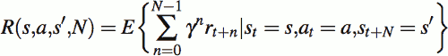
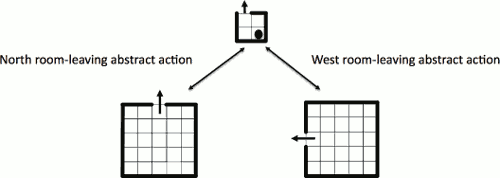
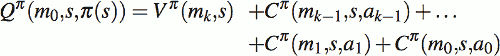
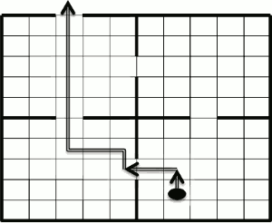
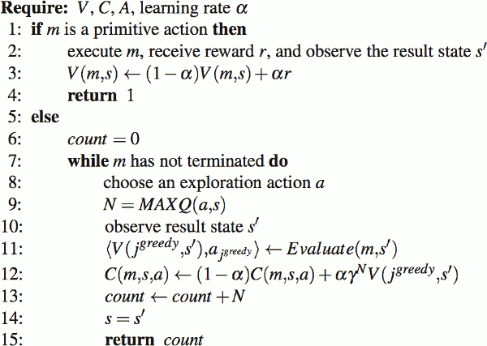
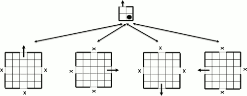

...menustart

- [Hierarchical Reinforcement Learning](#72951ae790682a0dd4da4d8283364a3c)
- [9.2 Hierarchical Reinforcement Learning (HRL)](#72a11dd0d9d97622fd79ef03f39aabe2)
    - [Abstract Actions](#58b3fd94a42d5f425c70a99f6914813b)
    - [Semi-Markov Decision Problems](#6243737489af539daef833ecd0db63c5)
    - [Structure](#dc4c71563b9bc39a65be853457e6b7b6)
    - [State Abstraction](#230fa5f50e6eaca111e3ea68317d2e14)
        - [eliminate irrelevant variables](#ab4f4d1eab009cf07b82bff65ef8b303)
        - [Funnelling](#29fbd9047435ed3eff4bae33951dbcb7)
    - [Value-Function Decomposition](#89bc22afc5ad4a92ab4b96584ba49eb6)
    - [Optimality](#c1e81f3c2f720c3a2e3a765ba6a11d59)
- [9.3 Approaches to Hierarchical Reinforcement Learning (HRL)](#5870c8051d8f90dbc5ca54cd29b6624a)
    - [9.3.1 Options](#6ce751b73792fb587ffb3563be3586b2)
    - [9.3.2 HAMQ-Learning](#59885b0a50c40a55d8ea2f2f9bcfad23)
    - [9.3.3 MAXQ](#333e9924bda20bd6aae508c4a3beac0d)
        - [MAXQ Learning and Execution](#39ff216260ca44f8e043fab82a1476e9)
        - [HRL Applied to the Four-Room Task](#cb494095255945d6f0b34b81aa9ebd96)

...menuend


<h2 id="72951ae790682a0dd4da4d8283364a3c"></h2>


# Hierarchical Reinforcement Learning 

<h2 id="72a11dd0d9d97622fd79ef03f39aabe2"></h2>


# 9.2 Hierarchical Reinforcement Learning (HRL)

<h2 id="58b3fd94a42d5f425c70a99f6914813b"></h2>


## Abstract Actions

- multi-steps
- Stochastic trasition function will make the sequence of states visited non-deterministic. The sequence of rewards may also vary.
- Then time taken to complete an abstract action may vary.

<h2 id="6243737489af539daef833ecd0db63c5"></h2>


## Semi-Markov Decision Problems

- MDPs that include abstract actions are called SMDPs.
- T and R now include the random variable N -- the number of time steps than an abstract action *a* takes to complete.
    - T(s,a,s',N) = Pr{ s<sub>t+N</sub> = s' | s<sub>t</sub>=s, a<sub>t</sub>=a }
    - R accumulates single step rewards as it executes
        - 
- For problems that are guaranteed to terminate, the discount factor γ can be set to 1.
    - in this case , V和Q的公式 就接近 一般MDP的V和Q，除了 reward

<h2 id="dc4c71563b9bc39a65be853457e6b7b6"></h2>


## Structure

- Task Hierarchies
    - root-node can invoke its child-node SMPD policies as abstract actions
    - child-node policies can recursively invoke other child subtasks , right down to subtasks that only invoke primitive actions.
    - deisgner specifies abstract actions  that are availbes in states of each parent task ; and specifies ***the active states and terminal states for each sub-task***.

---

4 room problems




- A task-hierarchy decomposing the 4-room task
    - 2 lower-level subtask ared MPDs for a generic room
        - where separate policies are learnt to exit a room to the North and West
        - the arrows indicate transitions to terminal states. 
    - States , actions , transitions  and rewards are inherited from the original MDP.
    - The higher level problem (SMDP) consists of just 4 states representing the rooms
        - any of the sub-tasks (room-leaving actions) can be invoked in any of the rooms.


<h2 id="230fa5f50e6eaca111e3ea68317d2e14"></h2>


## State Abstraction 

- we can eliminate irrelevant variables , and 
- where abstract actions "funnel" the agent to a small subset of states.

<h2 id="ab4f4d1eab009cf07b82bff65ef8b303"></h2>


### eliminate irrelevant variables

- RL algrithm will learn the same value-function or policy for all redundant states if it were given redundant information
    - for example , navigating through a red coloured room may be the same as a blue coloured room , but a value function and policy treats each (position-in-room,colour) as a different state. 
    - if colour has no effect on navigation it would simplify the problem by eliminating the colour variable from consideration.

<h2 id="29fbd9047435ed3eff4bae33951dbcb7"></h2>


### Funnelling

- a type of state abstraction where abstract actions move the environment from a large number of initial states to a small number of resulting states
    - Funnelling allows the four-room task to be state-abstracted at the root node to just 4 states because, irrespective of the starting position in each room, the abstract actions have the property of moving the agent to another room state.

<h2 id="89bc22afc5ad4a92ab4b96584ba49eb6"></h2>


## Value-Function Decomposition

- The task-hierarchy for the four-room task has 2 successful higher-level policies that will find a path out of the house from the South-East Room.
    - either North-West-North , or West-North-North
    - the latter is the shourter path, but the simple hierarchical RL can not make this distinction.
- What is needed is a way to decompose the value function for the whole problem over the task-hierarchy.
    - given this decomposition we can take into account the rewards within a subtask when making decision at higher levels.

<h2 id="c1e81f3c2f720c3a2e3a765ba6a11d59"></h2>


## Optimality

- Hierarchically Optimal
    - Policies that are hierarchically optimal are ones that maximise the overall value function consistent with the constraints imposed by the task-hierarchy.
- Recursively Optimal
    - sub-task policies to reach goal terminal states are context free ignoring the needs of their parent tasks. 
    - has the advantage that sub-tasks can be re-used in various contexts
    - but they may not therefore be optimal in each situation
- Hierarchical Greedy Optimality

A hierarchical optimality can be arbitrarily worse than the globally optimal solution and a recursive optimal solution can be arbitrarily worse than a hierarchical optimal solution. 

<h2 id="5870c8051d8f90dbc5ca54cd29b6624a"></h2>


# 9.3 Approaches to Hierarchical Reinforcement Learning (HRL)

<h2 id="6ce751b73792fb587ffb3563be3586b2"></h2>


## 9.3.1 Options

<h2 id="59885b0a50c40a55d8ea2f2f9bcfad23"></h2>


## 9.3.2 HAMQ-Learning

<h2 id="333e9924bda20bd6aae508c4a3beac0d"></h2>


## 9.3.3 MAXQ

- an approach to HRL where the value function is decomposed over the task hierarchy
- abstract actions are crafted by classifying subtask terminal states as either goal states or non-goal states
- Using disincentives for non-goal states, policies are learnt for each subtask to encourage termination in goal states.
- MAXQ represents the value of a state as a decomposed sum of sub-task completion values plus the expected reward for the immediate primitive action   
    - A completion value is the expected (discounted) cumulative reward to complete the sub-task after taking the next abstract action.
- abstract action *a* for subtask *m* invokesa child subtask *mₐ*
    - V<sup>π</sup> (mₐ ,s)
        - The expected **value** of completing subtask mₐ
    - hierarchical policy π 
        - a set of policies, one for each subtask
    - completion function, C<sup>π</sup> (m,s,a) 
        - expected discounted cumulative **reward** after completing abstract action *a*,  in state *s* in subtask *m*, discounted back to the point where *a* begins execution.
    - The Q function for subtask *m* can be expressed recursively as the value for completing the subtask that *a* invokes , mₐ , plus the completion value to then end of subtask *m*. 
        - Q<sup>π</sup> (m,s,a) = V<sup>π</sup> (mₐ ,s) + C<sup>π</sup> (m,s,a)
        - V 递归包含子任务， C 不包含子任务
    - The value of completing subtask mₐ depends on whether *a* is primitive or not.  V<sup>π</sup> (mₐ ,s) = 
        - = Q<sup>π</sup> (mₐ,s,π(s)) , if *a* is abstract
        - = ∑<sub>s'</sub> T(s,a,s')R(s,a,s')  , if *a* is primitive
- If the path of activated subtasks from root subtask m₀ to primitive action m<sub>k</sub> is m₀,m₁,..., m<sub>k</sub> , and the hierarchical policy specifies that in subtask mᵢ, π(s) = aᵢ , then 
    - 
- To follow an optimal greedy policy given the hierarchy
    - V<sup>\*</sup>(mₐ,s) = max<sub>s'</sub> Q<sup>\*</sup>(mₐ,s,a′)



- The decomposed value of the agent’s state has three terms
    - determined by the two levels in the task-hierarchy plus a primitive action.It is composed by
        1. expected reward for taking the next primitive action to the North , plus
        2. expected reward for completing the lower-level sub-task of leaving the room to the West, plus
        3. expected reward for completing the higher-level task of leaving the house


Algorithm 18 performs such a depth-first search and returns both the value and best action for subtask m in state s.


> Algorithm 18. Evaluate(m,s) [Dietterich (2000)]

<h2 id="39ff216260ca44f8e043fab82a1476e9"></h2>


### MAXQ Learning and Execution

Algorithm 19 performs the equivalent of on-line Q-Learning for completion functions for each of the subtask SMDPs in a task-hierarchy.



> Algorithm 19. MAXQ(m,s) [Dietterich (2000)]


- If the action is primitive it learns the expected reward for that action in each state (Line 3)
- For abstract actions the completion function following the abstract action is updated (Line 12).
- The learning rate parameter α is gradually reduced to zero in the limit

- Algorithm 19 is a simplified version of the MAXQ algorithm
    -  For an extended version of the Algorithm, one that accelerates learning and distinguishes goal from non-goal terminal states using **pseduo-rewards** 


```
# Algorithm 20

Require: root node m₀, starting state s₀, V,C 

    initialise V(m,s) and C(m,s,a) arbitrarily 
    MAXQ(m₀,s₀)
```

> Algorithm 20. Main Program MAXQ


<h2 id="cb494095255945d6f0b34b81aa9ebd96"></h2>


### HRL Applied to the Four-Room Task

- The designer of the task-hierarchy in Figure 9.5 has recognised several state abstraction opportunities. Recall that the state is described by the tuple (room, position).



> Fig. 9.5 A task task-hierarchy for the four-room task. The subtasks are room-leaving actions and can be used in any of the rooms.

- The parent-level root subtask has just four states representing the four rooms. 
- “X” indicates non-goal terminal states.
    - **terminal states is either goal  or non-goal !**

---

- notice that room-leaving abstract actions always terminate in one state


