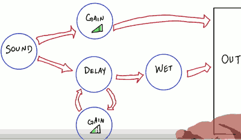

...menustart

- [HTML5 Game Programming](#abd3b2611419856b6b8afe54983197ce)
- [Canvas](#6ea5359e01a41842884943125518289b)
    - [Loading an Image](#6f2835b0768bfa13665e350d3949f7d1)
    - [drawImage](#69ffc67b42d7974f4d517a83d85b7c23)
    - [播放动画](#680eb09f41197ed1fb7545f5e3ebf338)
- [Atlas](#a6567816e007283cf9781c35b95dd56f)
- [Input](#324118a6721dd6b8a9b9f4e327df2bf5)
    - [Event listeners](#ebc7fe1dc5418d7becca2126f4a09cc8)
    - [an approache](#fa6276d6a6d4059ca694283e0d78347b)
    - [Physics Engine](#a022a49f29f7b6b5eb70a9139eb9e092)
- [Entity](#1a434befae3f49ae09347ded52032f6f)
    - [Implementing Z-ordering](#24eb006c62219934e00e14e948d09eed)
- [Physics](#50ae99e9c35446c2580e4b540b0fd104)
    - [Missing](#2aee0be2678ee90fd327cc186826438e)
    - [Box2D , JS version](#38b3094c78f7da9578bf56cd3875bbfa)
        - [The World](#cb4adbc5d0fca498acaa58729f40fff9)
        - [Physics Bodies](#f0539b86e3516c146830052a16b2b8e5)
        - [Destorying Physics Bodies](#25fde2f1071a4ad021e815aa78dbb269)
        - [Entities and Physics  : TODO](#9d43b057af4b72336475549b5f54267c)
- [Sound](#9d07e0e08af7f96cf45be0112b9ccfbe)
- [Asset Loading](#839854ad5b0358316e06b1da98683310)
    - [Asset Manager](#d6a16019632124a0439c06f64398fa98)
    - [Caching images](#2dc1bd08d51fab30f5a3b09badc59f30)
    - [Batches](#3c12e620f60815609db42d373319db7e)
    - [Loading javascript](#d7eb458f3d2174ac4300b8f97764067d)

...menuend


<h2 id="abd3b2611419856b6b8afe54983197ce"></h2>


# HTML5 Game Programming

<h2 id="6ea5359e01a41842884943125518289b"></h2>


# Canvas 

```
<body>
    <canvas> id="my_canvas"</canvas>
</body>
<script>
var canvas = null ;
var context = null ;

setup = function() {
    canvas = document.getElementById( "my_canvas" ) ;
    context = canvas.getContext(  '2d') ;
    canvas.width = 1200 ; // windows.innerWidth ;
    canvas.height = 720 ; // windows.innerHeight ;
} ;

setup();

</script>
```

<h2 id="6f2835b0768bfa13665e350d3949f7d1"></h2>


## Loading an Image

 1. Declare a new Image() object
 2. Declare it's 'onload' method
 3. set Image.src = "url"
     - as soon as the Image.src is set through a value , JS will kick off `onload` function.
     - because of this, we need to specify the callback function first before setting the source attribute

```javascript
setup = function() {
    canvas = document.getElementById( "my_canvas" ) ;
    context = canvas.getContext(  '2d') ;
    canvas.width = 1200 ; // windows.innerWidth ;
    canvas.height = 720 ; // windows.innerHeight ;

    img new Image();
    img.onload = onImageLoad;
    img.src = 'ralphyrobot.png'
} ;

onImageLoad = function() {
    console.log( "Image" ) ;
}
``` 

<h2 id="69ffc67b42d7974f4d517a83d85b7c23"></h2>


## drawImage
 
- `var object = object.drawImage( ... )`
- you can find API details in `webplatform.org`

```
onImageLoad = function() {
    console.log( "Image" ) ;
    context.drawImage( img, 192, 192 ) ;
}
```

<h2 id="680eb09f41197ed1fb7545f5e3ebf338"></h2>


## 播放动画

- load all animation image assets and place then in the frame array
- after you images are loaded , you should go through and fill out the rest of the animation function
- before this you need to have some logic that checks for whether or not the images are loaded 
- and once all of the frames have been loaded , actually does a call to `setInterval`.


```javascript
var frameRate = 1000/30 ;
var frame = 0 ;
var assets = [ 'xxx00.png' , 'xxx01.png' , ... ] ;

setup = function() {
    ...

    for (var i =0; i < assets.length ; i++ ) {
        frame.push( new Image() ) ;
        frame[i].src = assets[i] ;
        frame[i].src = assets[i] ;
    }

    setInterval ( animate , frameRate ) ;

} ;

var animate = function() {
    context.clearRect( 0,0,  canvas.width , canvas.height ) ;
    context.drawImage( frames[frame] , 192,192 ) ;
    frame = (frame +1) % frame.length
}

``` 

The canvas doesn't actually clear itself each frame.  You need call clearRect to clear it.


---

<h2 id="a6567816e007283cf9781c35b95dd56f"></h2>


# Atlas

- it's up to about 6 connection for a modern browse.
- when the upper limit is reached , the browse will actullay block subsequent requests until an open connection becomes available.


usign output from texture packer

```javascript
defSprite: function ( name, x, y, w, h , cx ,cy ) {
    var spt = {
        "id" :    name,
        "x" :    x,
        "y" :    y,
        "w" :    w,
        "h" :    h,
        "cx" :    cx==null ? 0 : cx ,
        "cy" :    cy==null ? 0 : cy ,
    } ;
    this.sprites.push(spt) ;
}

parseAtlasDefinition: function( atlasJson ) {
    var parsed = JSON.parse( atlasJson ) ;

    for( var key in parsed.frames ) {
        var sprite = parsed.frames[key];
        // define the center of the sprite as an offset
        var cx = -sprite.frame.w * 0.5 ;
        var cy = -sprite.frame.h * 0.5 ;

        // define the sprite for this sheet
        this.defSprite( key , sprite.frame.x , sprite.frame.y , sprite.frame.w, sprite.frame.h ,  cx, cy) ;
    }
} 
```

--- 

<h2 id="324118a6721dd6b8a9b9f4e327df2bf5"></h2>


# Input

<h2 id="ebc7fe1dc5418d7becca2126f4a09cc8"></h2>


## Event listeners

```
document.getElementById( 'canvas' ).addEventListener( 'mousemove' , onMouseMove ) ;
document.getElementById( 'canvas' ).addEventListener( 'keydown' , onKeyDown ) ;

function onMoseMove() {
    var posx = event.clientX ;
    var posy = event.clientY ;

}

function onKeyDown( event ) {
    var keyId = event.keyID ;  // ASCII value

}
```

<h2 id="fa6276d6a6d4059ca694283e0d78347b"></h2>


## an approache

- Input manager handle the event ,  and keep the input temporarily , for "update procedure" to comsume it later.


<h2 id="a022a49f29f7b6b5eb70a9139eb9e092"></h2>


## Physics Engine

```
player: init()
{
    var physDat = {
        pos: {x,y} ,
        maxx : 0 ,
        size: {x:20, y:20} ,
        velocity: {x:5 , y:5}
    };
    mpPhysBody = PhysicsEngine.newBody() ;
}
```

- Directly, the physics body itself exposes a function that allows us to set a linear velocity on it. 

```
function update() {
    var move_dir = new Vec2(0,0) ;
    if(move_dir.LengthSquared()) {
        move_dir.Normalize() ;
        move_dir.Multiply( this.gPlayer0.walkSpeed ) ;  // important  
    }
    this.mpPhysBody.setLinearVelocity( move_dir.x , move_dir.y ) ;
}
``` 

---

<h2 id="1a434befae3f49ae09347ded52032f6f"></h2>


# Entity

```
gGameEngine.factory['WeaponInstance'] = WeaponInstanceClass ;

...

var ent = new( entityClass ) (x, y, es) ;
```

Tiled  工具 可以用来编辑相应的 entity object


<h2 id="24eb006c62219934e00e14e948d09eed"></h2>


## Implementing Z-ordering


---

<h2 id="50ae99e9c35446c2580e4b540b0fd104"></h2>


# Physics

<h2 id="2aee0be2678ee90fd327cc186826438e"></h2>


## Missing 

可以把 运动物理前后两帧的 collision box 组成一个 大的 collision box ， 做 碰撞检测 ， 以防止 missing.

<h2 id="38b3094c78f7da9578bf56cd3875bbfa"></h2>


## Box2D , JS version

```
<script src="./box2d.min.js"> </script>
```

<h2 id="cb4adbc5d0fca498acaa58729f40fff9"></h2>


### The World

```
    create: function() {
        this.world = new World() {
            new Vec2( 0 ,0 ) ,    // Gravity vector
            false                 // Boolean for allowing sleep
        } ;
    }
```

upadte:

```
    update: function() {
        var start = Data.now();

        // the more iterations, the more accurate the calculations
        this.world.Step (
            PHYSICS_LOOP_HZ ,   // frame-rate
            10,                    // velocity iterations
            10                    // position iteration
        ) ;

        // call the clearforces method of the world object to 
        // remove any forces at every physics update
        this.world.ClearForces() ;

        return (Date.now() - start);
    }
```


<h2 id="f0539b86e3516c146830052a16b2b8e5"></h2>


### Physics Bodies

```
registerBody: function( bodyDef ) {
    var body = this.world.CreateBody( bodyDef ) ;
    return body ;
}

addBody : function( entityDef ) {
    var bodyDef = new BodyDef();

    // type:
    // Body.b2_staticBody
    // Body.b2_dynamicBody
    if (entityDef.type== "static") {
        bodyDef.type = Body.b2_staticBody ;
    } else {
        bodyDef.type = Body.b2_dynamicBody ;        
    }

    // Set the position{x,y} member object 
    // of your BodyDef object 
    bodyDef.position.x = entityDef.x ; 
    bodyDef.position.y = entityDef.y ;

    var body = this.registBody(bodyDef) ;
    var fixtureDefinition = new FixtureDef() ;

    if (entityDef.useBouncyFixture ) {
        fixtureDefinition.density = 1.0 ;
        fixtureDefinition.friction = 0 ; 
        fixtureDefinition.restitution = 1.0 ;
    }

    // we now define the shape of this object as a box
    fixtureDefinition.shape = new PolygonShape() ;
    fixtureDefinition.shape.SetAsBox( entityDef.halfWidth, entityDef.halfHeight ) ;
    body.CreateFixture( fixtureDefinition ) ;

    return body ;
}
```

<h2 id="25fde2f1071a4ad021e815aa78dbb269"></h2>


### Destorying Physics Bodies

```
removeBody: function(obj) {
    this.world.DestoryBody(obj) ;
}
```

<h2 id="9d43b057af4b72336475549b5f54267c"></h2>


### Entities and Physics  : TODO 

--- 

<h2 id="9d07e0e08af7f96cf45be0112b9ccfbe"></h2>


# Sound



一般的游戏， 只需要  Sound -> Gain -> OUTPUT  这条线

- Checking for Compatibility

```
try {
    this._context = new webkitAudioContext();
} 
catch( e ) {
    alert( "web audio API not supported in this browse" ) ;
}
this._mainNode = this._context.createGainNode(0);
this._mainNode.connect( this._context.destination ) ;
```

- Asynchronous Loading

```
Loaded --> yes -----------------------> callback
       |-> no  --> Xml Http Request --> callback
```

```
loadAsync: function( path , callbackFcn ) {
    if(this.clips[path]) {
        callbackFcn( this.clips[path].s ) ;
        return this.clip[path].s ;
    }

    var clip = { s: new Sound() , b: null , l: false  } ;
    this.clips[path] = clip ;
    clip.s.path = path ;

    var request = new XMLHttpRequest();
    request.open( "GET" , path, true ) ;
    request.responseType = "arraybuffer" ;
    request.onload = function() {
        gSM._context.decodeAudioData( request.response ,  
        function(buffer) {
            clip.b = buffer ;
            clip.l = true ; 
            callbackFcn( clip.s ) ;
        }
        function(data) {
            Logger.log( "fail" )
        } ) ;
    }
    request.send();

    return clip.s ;
}
``` 


- Play Sound

```
playSound: function(path , settings) {
    ...
    var sd = this.clips[path] ;

    // creates a sound source
    var currentClip = gSM._context.createBufferSource() ;

    // tell the source which sound to play
    currentClip.buffer = sd.b ;
    currentClip.gain.value = volumen ;
    currentClip.connect( gSM._mainNode ) ;
    currentClip.loop = looping ;

    // play the source now
    currentClip.noteOn(0) ;
    return true ;
}
```

- Stopping Sounds 
     - eg: stop all sound , while level changing 
     - The way we do that , is by simply disconnection our main node from the node graph ; creating a new one in its place, and connecting it to our output.

```
stopAll: function() {
    this._mainNode.disconnect();
    this._mainNode = this._context.createGainNode(0) ;
    this._mainNode.connect( this._context.destination ) ;
}
```

- Muting Sounds

```
togglemute: function() {
    if( this._mainNode.gain.value > 0 )
        this._mainNode.gain.value = 0 ;
    else 
        this._mainNode.gain.value = 1 ; 
}
```

- Play World Sound  ( 远近效果 )

```
playWorldSound: function( soundURL , x , y ) {
    if(this.gPlayer0 === null ) return ;

    var gMap = gGameEngine.gMap ;

    // fade out volume based upon distance to me 
    var viewSize = Math.max(gMap.viewRect.w . gMap.viewRect.h) * 0.5 ;
    var oCenter = this.gPlayer0.pos ;
    var dx = Math.abs(oCenter.x -x ) ;
    var dy = Math.abs(oCenter.y -y ) ;
    var distToObserver = Math.sqrt( dx * dx , dy * dy ) ;
    var normDist = distToObserver / viewSize ;
    if(normDist > 1 )  normDist = 1 ;
    if(normDist < 0 )  return ;  // don't play

    var volumn = 1.0 - normDist ; 

    var sound = gSM.loadAsync(soundURL  , function( sObj) {
        gSM.playSound(sObj.path , {
            looping: false ,
            volume: volume
        } );
    };
}
```


---

<h2 id="839854ad5b0358316e06b1da98683310"></h2>


# Asset Loading

- all file I/O function in JavaScript are by definition asynchronous.

<h2 id="d6a16019632124a0439c06f64398fa98"></h2>


## Asset Manager

- Cached Asset management
- Async callbacks on load
- batches asset loading


<h2 id="2dc1bd08d51fab30f5a3b09badc59f30"></h2>


## Caching images

<h2 id="3c12e620f60815609db42d373319db7e"></h2>


## Batches

- to allow us to pass a list of files to load , and receive one callback once they've all been loaded

```
function loadAssets(assetList, callbackFcn) {
    // All the information we need to keep track of 
    // for this batch
    var loadBatch = {
        count: 0  ,
        total: assetList.count , 
        cb: callbackFcn
    };

    for (var i=0 ; i< assetList.length ; i ++ ) {
        if(gCachedAssets[assetname] == null) {
            var img = new Image() ;
            img.onload = function() {
                onLoadedCallback(img, loadBatch) ;
            } ;
            img.src = assetName ;

            gCachedAssets[assetName] = img ;
        } else {
            onLoadedCallback( gCachedAssets[assetList[i]] , loadBatch )
        }
    }
}

function onLoadedCallback( asset , batch ) {
    batch.count ++ ;
    if(batch.count == batch.total) {
        batch.cb(asset) ;
    }
}
```

<h2 id="d7eb458f3d2174ac4300b8f97764067d"></h2>


## Loading javascript


