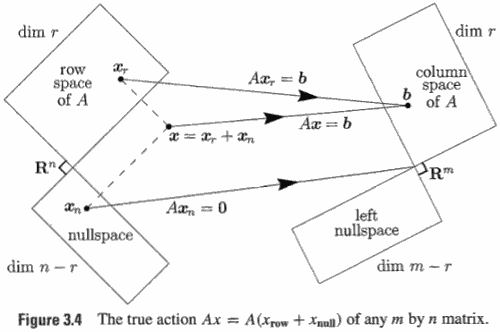
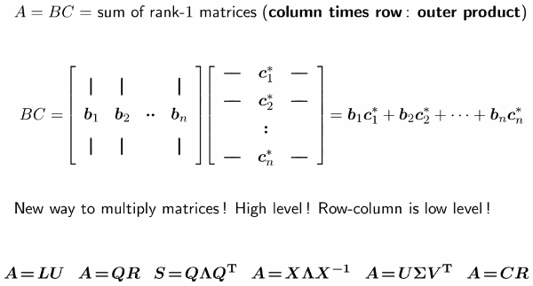
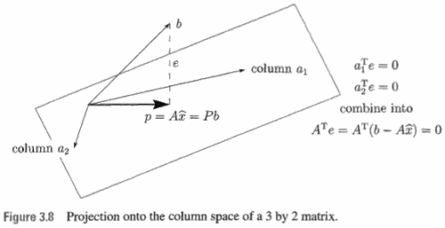
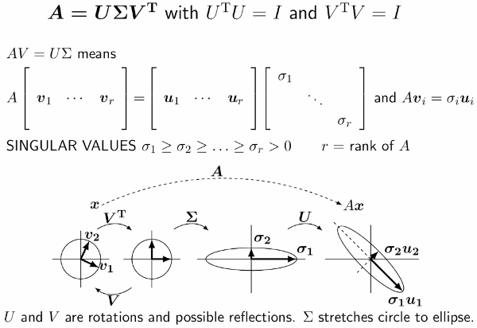
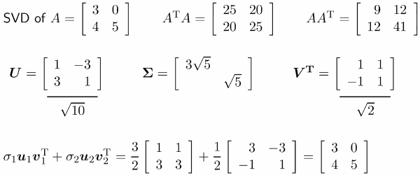
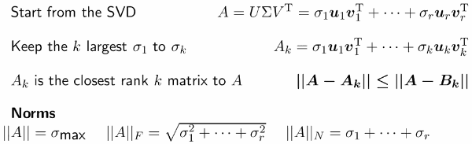

...menustart

- [Part 1: The Column Space of a Matrix](#2b5fb5172d609c51c767a27f5ad390d0)
- [Part 2: The Big Picture of Linear Algebra](#34cff108da517ed4b0d8484280f95554)
- [Part 3: Orthogonal Vectors](#a11c7c4055d707cb2268f8ac7bc0f9a7)
- [Part 4: Eigenvalues and Eigenvectors](#1aa6f915d5f24977e2cdd346a923dde6)
    - [Eigenvectors of S go into Orthogonal Matrix Q](#84d19e75f92868fc4a46bb2f544d5b09)
    - [Eigenvalues and Eigenvectors:  Not symmetric](#4e6b8315b53bb0ddcafdef484959a882)
    - [AᵀA is square, symmetric, nonnegative definite](#901296be65b54f663cb2cf80743a391c)
- [Part 5: Singular Values and Singular Vectors](#d55dcf6b90867473b4114bc94a455420)
    - [Low rank approximation to a big matrix](#d6e287a3d85e85c9056e240bb9c7a972)

...menuend


<h2 id="2b5fb5172d609c51c767a27f5ad390d0"></h2>


# Part 1: The Column Space of a Matrix


```
A =

   1   4   5
   3   2   5
   2   1   3
```

- A = CR
    - 
    ```
    C = 
       1   4
       3   2
       2   1
    ```
    - 
    ```
    R =
       1   0   1
       0   1   1
    ```
- **Key facts**
    - The r columns of C are a **basis** for the column space of A: **dimension** r
    - The r rows of R are a **basis** for the row space of A
- **Counting Theorem**
    - Ax = 0 has one solution x = [1,1,-1]
    - **There are n-r independent solutions to Ax=0.**

- A = CR  desirable
    - C has columns directly from A: meaningful
    - R turns out to be the **row reduced echelon form of A**
- A = CR undesirable
    - C and R could be very ill-conditioned
        - ill-conditioned means it is difficult to deal with
        - e.g. C and R are not great for avoiding round off or being good in large computations 
    - if A is invertible, then C = A, R = I


<h2 id="34cff108da517ed4b0d8484280f95554"></h2>


# Part 2: The Big Picture of Linear Algebra

- If Ax = 0 then x is orthogonal to every row of A
- 2 pairs of **orthogonal subspace**
    - **N(A)  ⟂ C(Aᵀ)**
    - **N(Aᵀ) ⟂  C(A)**
- **Big Picture**
    - 
    - If A is singualr, row space and null space can not fill up the whole n-D space
        - so any x can split into 2 parts, one is in the row space, the other is in the null space

- **Multiplying Columns time Rows / Six Factorizations**
    - 
    - LU : elimination


<h2 id="a11c7c4055d707cb2268f8ac7bc0f9a7"></h2>


# Part 3: Orthogonal Vectors

- if Q is square,  Qᵀ = Q⁻¹
- if Q1,Q2 are square, Q1Q2 = Q2Q1
- Qx , it won't change the length of x
- Least Squares:  Major application of A = QR 
    - normal equation for the best x̂:  Aᵀe = 0  or AᵀAx̂ = Aᵀb
    - if A = QR, Rx̂ = Qᵀx
    - 


<h2 id="1aa6f915d5f24977e2cdd346a923dde6"></h2>


# Part 4: Eigenvalues and Eigenvectors

- **S = Sᵀ  Real Eigenvalues and Orthogonal Eigenvectors**

<h2 id="84d19e75f92868fc4a46bb2f544d5b09"></h2>


## Eigenvectors of S go into Orthogonal Matrix Q

- S = QΛQᵀ
- With S = AᵀA this will lead to the singualr values of A
    - A = UΣVᵀ


<h2 id="4e6b8315b53bb0ddcafdef484959a882"></h2>


## Eigenvalues and Eigenvectors:  Not symmetric 

- Now I'm not going to get perpendicular eigenvectors
- AX = XΛ
- with n independent eigenvectors A = XΛX⁻¹
    - Λ = X⁻¹AX
- A²,A³,... have the same eigenvectors as A
    - Aⁿx = λⁿx
    - Aⁿ = XΛⁿX⁻¹
    - Aⁿ → 0  when Λⁿ → 0 : **All |λᵢ| < 1**

<h2 id="901296be65b54f663cb2cf80743a391c"></h2>


## AᵀA is square, symmetric, nonnegative definite


<h2 id="d55dcf6b90867473b4114bc94a455420"></h2>


# Part 5: Singular Values and Singular Vectors

- A is not square, we need something that replaces eigenvalues and eigenvectors, it is singular values and singular vectors.
- **SINGULAR VALUE DECOMPOSITION**
    - 
    - all the us are orthogonal to each other,  all the vs are orthogonal to each other
    - the bottom is the geometry of a 2x2 matrix
- How to choose orthonormal vᵢ in the row space of A ?
    - the vᵢ are eigenvectors of AᵀA.
- How to choose uᵢ in the column space ?
    - uᵢ = A·vᵢ / σᵢ
    - uᵢ are also othronormal.
- SVD example
    - 
    - sum of rank-1 matrix , this is what data science want.

<h2 id="d6e287a3d85e85c9056e240bb9c7a972"></h2>


## Low rank approximation to a big matrix

- 


