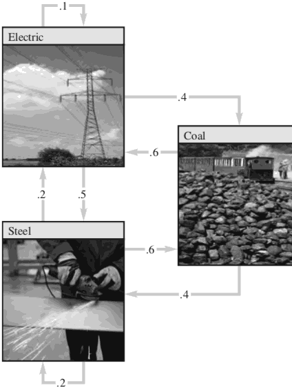

...menustart

 - [Application Of Linear Systems](#bab780a257514ae673fc4b27315e6983)
     - [A Homogeneous System in Economics 经济学中的同质系统](#3cbec81a7200fe500c94d906ee8dba14)
     - [Balancing Chemical Equations](#1d98a3ac560ef7befccf00b9a14b8137)

...menuend


<h2 id="bab780a257514ae673fc4b27315e6983"></h2>


# Application Of Linear Systems

<h2 id="3cbec81a7200fe500c94d906ee8dba14"></h2>


## A Homogeneous System in Economics 经济学中的同质系统

 - 假设一个经济体由 Coal 煤炭, Electric power, 和 Steel 部门组成， 每个部门的产出分布在各个部门之间 ， 如图所示



 - Distribution of Output from:


 Coal | Electric | Steel | Purchased by:
 --- | --- | --- | ---
 .0 | .4 | .6 | Coal
 .6 | .1 | .2 | Electric 
 .4 | .5 | .2 | Stell


 - 每一列相加必须等于1.0
 - 第2列说明， 电力部分的总产量被分为3个部分，40% 用于煤炭部门，50% 用于钢铁， 剩下的10% 用于自己。
 - 设 煤炭/电力/钢铁的总的产量的价格 分别用 P<sub>C</sub>,P<sub>E</sub>,P<sub>S</sub>表示，如果可能的话， 找到一个 是每个部分的收入与其支出 相匹配的 均衡价格。

 - SOLUTION:
    - 列是 一个部门的输出， 行是一个部门需要的输入。
    - 所以:


P<sub>C</sub> = .4·P<sub>E</sub>  + .6·P<sub>S</sub> 

P<sub>E</sub> = .6·P<sub>C</sub>  + .1·P<sub>E</sub> + .2·P<sub>S</sub>      

P<sub>S</sub> = .4·P<sub>C</sub>  + .5·P<sub>E</sub> + .2·P<sub>S</sub>      

 - 可以得到

P<sub>C</sub> - .4·P<sub>E</sub>  - .6·P<sub>S</sub>  = 0

-.6·P<sub>C</sub>  + .9·P<sub>E</sub> - .2·P<sub>S</sub> = 0

-.4·P<sub>C</sub>  - .5·P<sub>E</sub> + .8·P<sub>S</sub> = 0   


```octave
octave:1> A = [ 1 -.4 -.6 0 ; -.6 .9 -.2 0 ; -.4 -.5 .8 0 ]
A =

   1.00000  -0.40000  -0.60000   0.00000
  -0.60000   0.90000  -0.20000   0.00000
  -0.40000  -0.50000   0.80000   0.00000
```

 - 对矩阵做 Row reduction

```octave
octave:7> rref(A)
ans =

   1.00000   0.00000  -0.93939   0.00000
   0.00000   1.00000  -0.84848   0.00000
   0.00000   0.00000   0.00000   0.00000
```

 - 由上可得到解:   P<sub>C</sub> = 0.94·P<sub>S</sub> ,  P<sub>E</sub> = 0.85·P<sub>S</sub> ,  P<sub>S</sub> is free.

```
    ⎡ Pc⎤  ⎡ .94Ps⎤    ⎡ .94⎤  
P = ⎢ Pe⎪ =⎢ .85Ps⎪ =Ps⎢ .85⎪
    ⎣ Ps⎦  ⎣   Ps ⎦    ⎣  1 ⎦ 
```

<h2 id="1d98a3ac560ef7befccf00b9a14b8137"></h2>


## Balancing Chemical Equations

 - 化学方程描述了 化学反应消耗和产生的物质的量， 如
 - (x₁)C₃H₈ + (x₂)O₂ → (x₃)CO₂ + (x₄)H₂O
 - 为了 平衡这个方程式， 化学家必须 找到满足条件的4个系数，使得 C,H,O的原子在数量上 左右相等。
 - 一个系统的方法是 建立一个向量方程， 这个方程描述了 化学反应中 出现的每种原子的数量
 - 因为 上面的化学方程 只有 C,H,O三种原子，  我们使用一个三维向量表示一个分子
    - C₃H₈: [3 8 0]
    - O₂ : [0 0 2]
    - CO₂: [1 0 2]
    - H₂O: [0 2 1]
 - 所以上面的方程式 可以写成:

```
   ⎡ 3⎤    ⎡ 0⎤      ⎡ 1⎤    ⎡ 0⎤
 x₁⎢ 8⎪ +x₂⎢ 0⎪  = x₃⎢ 0⎪ +x₄⎢ 2⎪
   ⎣ 0⎦    ⎣ 2⎦      ⎣ 2⎦    ⎣ 1⎦  
```

```
   ⎡ 3⎤    ⎡ 0⎤    ⎡ -1⎤    ⎡  0⎤  ⎡ 0⎤ 
 x₁⎢ 8⎪ +x₂⎢ 0⎪ +x₃⎢  0⎪ +x₄⎢ -2⎪ =⎢ 0⎪
   ⎣ 0⎦    ⎣ 2⎦    ⎣ -2⎦    ⎣ -1⎦  ⎣ 0⎦ 
```

```
octave:14> A = [3 0 -1 0 ; 8 0 0 -2; 0 2 -2 -1 ]
A =

   3   0  -1   0
   8   0   0  -2
   0   2  -2  -1

octave:15> rref(A)
ans =

   1.00000   0.00000   0.00000  -0.25000
   0.00000   1.00000   0.00000  -1.25000
   0.00000   0.00000   1.00000  -0.75000
```

 - 可以看到 x₁ = 1/4·x₄ , x₂=5/4·x₄ , x₃=3/4·x₄ , x₄ is free , 最终得到方程 
 - C₃H₈ + 5O₂ → 3CO₂ + 4H₂O   


