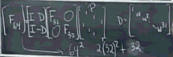

...menustart

 - [线性代数 Tips](#2e717ba206b381799cb0227a0431f7e2)
     - [特征向量 特征值 数学意义](#95a358f3e9bc6b70ec4564ec261d408f)
     - [标准正交基 投影](#c94344aa0be8186885d4a294e109c346)
     - [对称矩阵及正定性](#bad133d661d36d2a2f8c4f4c72d15122)
     - [复数矩阵](#e6affc1434bf73c35aa331baeeb4f2a7)
     - [傅里叶矩阵](#30397a08fede056661df2f8fe3551b19)
     - [相似矩阵](#1315bcee5d95b88fdd51612d5a4c38dd)
     - [奇异值分解 SVD Singular Value Decomposition](#8d43c35ebe3f8d3b2f9f42e5dc38bee9)

...menuend

[TOC]

<h2 id="2e717ba206b381799cb0227a0431f7e2"></h2>

# 线性代数 Tips

<h2 id="95a358f3e9bc6b70ec4564ec261d408f"></h2>

#### 特征向量 特征值 数学意义

有没有这样一个向量b, 使得矩阵A\*b这样的线性变换相当于A在矢量b上面的投影m\*b, 如果有，那么b就是A的一个特征向量，m就是对应的一个特征值。 

求特征向量的关系，就是把矩阵A所代表的空间，进行正交分解，使得A的向量集合可以表示为每个向量a在各个特征向量上面的投影长度。

不同特征值的特征向量相互正交 ，因为求特征向量就是一个正交化的过程，或者说是求某一个矩阵的基。

特征值会有重根，这时候求到的这个重根的特征向量就不正交，甚至会线性相关。

<h2 id="c94344aa0be8186885d4a294e109c346"></h2>

#### 标准正交基 投影

    一组标准正交基， q₁ , q₂ , ... , qn
    任意向量v是 基的线性组合
    v= x₁q₁ + x₂q₂ + ... + xnqn
    
    怎么求 x₁ ？ 对于标准正交基，有:

    q₁ᵀv= x₁q₁ᵀq₁ ＋ 0 ＋ 0 ＋ ... = x₁

<h2 id="bad133d661d36d2a2f8c4f4c72d15122"></h2>

#### 对称矩阵及正定性

    对称矩阵(实数) 特征值也是实数
    对称矩阵 的 特征向量互相正交
    对称矩阵， 主元的乘积，等于特征值的乘积

    A=QΛQ⁻¹ = QΛQᵀ    (非常著名的公式：谱定理)
    
    A=QΛQ⁻¹ =λ₁q₁q₁ᵀ + λ₂q₂q₂ᵀ ...
    每一对 qqᵀ 其实就是一个投影矩阵，所以
    对称矩阵是  正交投影矩阵的 组合.
    
`positive definite matrix 正定矩阵`

正定矩阵 是对称矩阵

 1. 所有的特征值都是正数。
 2. 所有的主元都是正数
 3. 所有的子行列式也是正数

3条性质中，只有有一条成立，其他两条也必定成立

<h2 id="e6affc1434bf73c35aa331baeeb4f2a7"></h2>

#### 复数矩阵

    复数向量求模（长度） 不能使用点积  zᵀz
    而应该使用z的共轭复数 zᵀz  ,  简写为 żᴴz
    
    在复数情况下， Aᵀ=A 不再适用
    而是  Aᴴ=A
    
    所以复数情况下，对称矩阵是这样一类矩阵
    
    |2      3+i | 
    |3-i    5   |

主对角线上的元素都是实数，因为主对角线元素共轭后不能变， 其他元素互为 共轭

    同样的，正交矩阵的性质，也变成了 QᴴQ=I   

<h2 id="30397a08fede056661df2f8fe3551b19"></h2>

#### 傅里叶矩阵

高阶傅里叶矩阵 和 低阶傅里叶矩阵的转换

例： F64 -> F32:

<h2 id="1315bcee5d95b88fdd51612d5a4c38dd"></h2>

#### 相似矩阵

存在在一个可逆矩阵M , 使得 B=M⁻¹AM , 则A和B相似。

相似矩阵，拥有相同的特征值 ,  和相同数量的特征向量。

S⁻¹AS = Λ 特征值公式中,  A 和  Λ 也是相似矩阵.

一个矩阵会有很多个相似矩阵，这些相似矩阵中，对角矩阵，是最简洁的矩阵.

相似矩阵 是在不同基表示下的同一个矩阵.

在特征向量基下，矩阵就是 对角矩阵(Λ)。

<h2 id="8d43c35ebe3f8d3b2f9f42e5dc38bee9"></h2>

#### 奇异值分解 SVD Singular Value Decomposition

见 6.3

---

