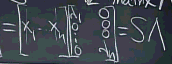

...menustart

 - [线性代数 Tips](#2e717ba206b381799cb0227a0431f7e2)
     - [理解矩阵和向量的乘法](#4427682e57f6dbb6576239adc595638d)
     - [初等矩阵 elemental matrix](#b2d74aa0feebc4824b439f02478325d5)
     - [置换矩阵性质: `P⁻¹=Pᵀ`](#e2e5017f25fa9416b3ef7b0d18f46cda)
     - [矩阵乘法满足结合律](#4a9e4fd3f7426352c6a7945a0b49bf63)
     - [左逆和右逆](#ee462c455e9f28367b84ee1c28dee0fe)
     - [矩阵有逆的条件: 满秩矩阵(方阵)，非奇异](#e2fe3f8e05628078c994878aded9cc08)
     - [逆矩阵求解方程组 Ax=b](#2cc78561906fa5ca7435b139ab118b99)
     - [逆和转置](#f979740e878e9e20b18547f7d3967654)
     - [LU分解](#9b69fa7f2f639fcbc0f125a3f23da8e1)
     - [RᵀR 是 对称矩阵 symmetric matrix](#ad79f20176f7777c9b124a691f8e3838)
     - [向量的投影](#545ca50a3c0149971398d37a3038fc36)
     - [向量投影矩阵P](#5e362b6874dc989db8d8fd1da26e6535)
     - [子空间投影 和 最小二乘法](#718e5009ef8b5de215cd9c578b2306fa)
     - [标准正交基](#477d29acf0295eb723596dfcc24e7f98)
     - [正交矩阵](#ea7c60cb9f3af0e66132ba78c8bba105)
     - [Gram-Schmidt正交化](#51371ab1b38169c26395435d8230bf4f)
     - [方阵的行列式](#1172d3ebd911f5155a58f17be8b08a84)
     - [正交矩阵的行列式  |Q|= ±1](#1c67c4e06bc2e6f5405e5d3d97805675)
     - [行列式应用1: 求三角形面积](#f02026b6e9a702c916ec412b1ff55f7c)
     - [特征向量 特征值](#6a38604f2681f4d48c6cb34072b763cc)
     - [特征值方程](#290d21f54d9afe4afd02fa66c993aca5)
     - [特征向量 特征值 数学意义](#95a358f3e9bc6b70ec4564ec261d408f)
     - [矩阵对角化](#ad243c30b333ab3f63deeb94418e4d41)
     - [A的幂](#85cf41d7d702b7ca38c2f518c0bbbedc)
     - [标准正交基 投影](#c94344aa0be8186885d4a294e109c346)
     - [对称矩阵及正定性](#bad133d661d36d2a2f8c4f4c72d15122)
     - [复数矩阵](#e6affc1434bf73c35aa331baeeb4f2a7)
     - [傅里叶矩阵](#30397a08fede056661df2f8fe3551b19)
     - [相似矩阵](#1315bcee5d95b88fdd51612d5a4c38dd)
     - [奇异值分解 SVD Singular Value Decomposition](#8d43c35ebe3f8d3b2f9f42e5dc38bee9)

...menuend


[TOC]

<h2 id="2e717ba206b381799cb0227a0431f7e2"></h2>

-----
-----

# 线性代数 Tips


<h2 id="1172d3ebd911f5155a58f17be8b08a84"></h2>

-----

#### 方阵的行列式

detA or |A| 性质:

 1. det I = 1   , 单位矩阵行列式 等于1
 2. exchange rows, reverse the sign of det
 3. 在其余行保持不变，对单独的行，行列式是一个线性函数
    
    1. 行列式 某一行 乘以k， 结果等于 k 乘以 行列式
    
    ```
    |ka kb| = k |a b|
    | c  d|     |c d|
    ```
     det2A = 2ⁿ detA
     
    2. 行列式的某一行，可以拆分 
    
    ```
      |a+a' b+b'| =|a b| + |a' b'|
      |c    d   |  |c d|   |c  d |
    ``` 

 4. two rows are equal --> detA =0     （性质2的推论）
 5. subtract  k*row i from row j ,  det doesn't change   （性质3.1 ,3.2 推论）
    几何意义:  向量ab不变，平行四边型的底不变， 向量cd 沿着 ab 方向发生切变，平行四边型的高不变，所以面积也不变。

 6. row of zero -> det = 0    （性质3推论）
 
    ```
    5|0 0| =|0 0| ,  5x =x -> x=0 
     |c d|  |c d|
    ```

 7. 上三角矩阵 ,如果主元都不为0，则 行列式 等于 对角线元素 乘积（重要性质）
    如果主元不为0， 那通过消元发，可以把除主元外的 ＊ 都变成0，称为对角矩阵， 所以那些＊ 都是打酱油的。

 8. detA =0 , 当且仅当 A 是奇异矩阵
    detA ≠0,  当且仅当 A 可逆 （消元主元都不为0）

    行列式的两种情况：  
        1. 奇异矩阵， det =0 
        2. 可逆 -> U -> D ,  det = d1xd2x...xdn

 9. detAB = detA x detB
    推论1: detA⁻¹ = 1/detA      逆矩阵的行列式，等于矩阵行列式的倒数
    
    证：  detA x detA⁻¹ = detI =1 

 10. detAᵀ = detA  矩阵转置，行列式不变 
    行列式，所有行的性质，对列同样有效

<h2 id="1c67c4e06bc2e6f5405e5d3d97805675"></h2>

-----

#### 正交矩阵的行列式  |Q|= ±1

    QᵀQ=I
    |Qᵀ||Q|=1
    |Q|²=1
    |Q|= ±1

<h2 id="f02026b6e9a702c916ec412b1ff55f7c"></h2>

-----

#### 行列式应用1: 求三角形面积

    已知三角形的三个顶点：
    (x1,y1),(x2,y2),(x3,y3),求面积:
    解：
                |x1 y1 1|
    S= 1/2 det  |x2 y2 1|
                |x3 y3 1|
    
    
    PS。必须补1,不能补0,否则行列式就等于0了
        补3个1，其实就是把 三角形平移到原点
    
    如果有个顶点是原点,比如(x1,y1)=(0,0)
    
    S =  1/2 det|x2,y2|
                |x3,y3|

---

<h2 id="6a38604f2681f4d48c6cb34072b763cc"></h2>

-----

#### 特征向量 特征值

Ax= λx

当矩阵变换A作用于向量x, 如果所得到的新向量 和x 方向相同,则:

x 就是矩阵的特征向量

λ 就是特征值,  λ 允许负值或零

 1. n阶方阵，共有n个特征值
 2. 特征值的和，等于 矩阵对角线之和， 也就是矩阵的迹
 3. 特征值之积，等于 矩阵的行列式
 4. 奇异矩阵 必有一个特征值是0; 零空间多少维,就有几个0特征值

n个λ 的值，可能有重复的，重复的λ，会导致特征向量缺失。

特征值可能是复数，如果矩阵是对称的，那么特征值一定是`实数`。

对称矩阵的特征向量`正交`。

矩阵的特征向量可能会缺失，也可能没有特征向量。

    
<h2 id="290d21f54d9afe4afd02fa66c993aca5"></h2>

-----

#### 特征值方程

    Ax=λx
    修改一下方程：
    (A-λI)x = 0
    如果x 有非零解，A-λI (矩阵A 平移 λI )必须是奇异矩阵。
    即 det(A-λI) = 0 , 这样就没有x了。 这就是特征值方程。
    
根据特征值方程，可以得到：

    A 和 Aᵀ的 特征值相同


<h2 id="95a358f3e9bc6b70ec4564ec261d408f"></h2>

-----

#### 特征向量 特征值 数学意义

有没有这样一个向量b, 使得矩阵A\*b这样的线性变换相当于A在矢量b上面的投影m\*b, 如果有，那么b就是A的一个特征向量，m就是对应的一个特征值。 

求特征向量的关系，就是把矩阵A所代表的空间，进行正交分解，使得A的向量集合可以表示为每个向量a在各个特征向量上面的投影长度。

不同特征值的特征向量相互正交 ，因为求特征向量就是一个正交化的过程，或者说是求某一个矩阵的基。

特征值会有重根，这时候求到的这个重根的特征向量就不正交，甚至会线性相关。

<h2 id="ad243c30b333ab3f63deeb94418e4d41"></h2>

-----

#### 矩阵对角化

    假设 矩阵A 有n个线性无关的特征向量
    这些特征向量 组成特征向量矩阵S

用A 乘以 特征向量矩阵S, 得到:


Ax=λx

拆分得到的新矩阵，得到:



所以: AS=SΛ

如果 A的特征向量都线性无关，则:

`S⁻¹AS = Λ`

`A=SΛS⁻¹` 

<h2 id="85cf41d7d702b7ca38c2f518c0bbbedc"></h2>

-----

#### A的幂

`A²x= λAx = λ²x`

所以，`A²的特征值是 λ²`， `特征向量还是同一个`。

---

A²=SΛS⁻¹SΛS⁻¹  =  SΛ²S⁻¹  (S表示特征向量不变, 特征值变为Λ² )

推广到 Aⁿ:

`Aⁿ = SΛⁿS⁻¹`

---

 - 如果矩阵A，所有的特征值都不相同，那么 A必然有n个线性无关的特征向量
 - 如果 特征值有重复，则 A 可能但不一定有n个线性无关的特征向量

应用1: 计算斐波那契数列


<h2 id="c94344aa0be8186885d4a294e109c346"></h2>

-----

#### 标准正交基 投影

    一组标准正交基， q₁ , q₂ , ... , qn
    任意向量v是 基的线性组合
    v= x₁q₁ + x₂q₂ + ... + xnqn
    
    怎么求 x₁ ？ 对于标准正交基，有:

    q₁ᵀv= x₁q₁ᵀq₁ ＋ 0 ＋ 0 ＋ ... = x₁

<h2 id="bad133d661d36d2a2f8c4f4c72d15122"></h2>

-----

#### 对称矩阵及正定性

    对称矩阵(实数) 特征值也是实数
    对称矩阵 的 特征向量互相正交
    对称矩阵， 主元的乘积，等于特征值的乘积


    A=QΛQ⁻¹ = QΛQᵀ    (非常著名的公式：谱定理)
    
    A=QΛQ⁻¹ =λ₁q₁q₁ᵀ + λ₂q₂q₂ᵀ ...
    每一对 qqᵀ 其实就是一个投影矩阵，所以
    对称矩阵是  正交投影矩阵的 组合.
    
`positive definite matrix 正定矩阵`

正定矩阵 是对称矩阵

 1. 所有的特征值都是正数。
 2. 所有的主元都是正数
 3. 所有的子行列式也是正数

3条性质中，只有有一条成立，其他两条也必定成立


<h2 id="e6affc1434bf73c35aa331baeeb4f2a7"></h2>

-----

#### 复数矩阵

    复数向量求模（长度） 不能使用点积  zᵀz
    而应该使用z的共轭复数 zᵀz  ,  简写为 żᴴz
    
    在复数情况下， Aᵀ=A 不再适用
    而是  Aᴴ=A
    
    所以复数情况下，对称矩阵是这样一类矩阵
    
    |2      3+i | 
    |3-i    5   |

主对角线上的元素都是实数，因为主对角线元素共轭后不能变， 其他元素互为 共轭

    同样的，正交矩阵的性质，也变成了 QᴴQ=I   

<h2 id="30397a08fede056661df2f8fe3551b19"></h2>

-----

#### 傅里叶矩阵

高阶傅里叶矩阵 和 低阶傅里叶矩阵的转换

例： F64 -> F32:


<h2 id="1315bcee5d95b88fdd51612d5a4c38dd"></h2>

-----

#### 相似矩阵

存在在一个可逆矩阵M , 使得 B=M⁻¹AM , 则A和B相似。

相似矩阵，拥有相同的特征值 ,  和相同数量的特征向量。

S⁻¹AS = Λ 特征值公式中,  A 和  Λ 也是相似矩阵.

一个矩阵会有很多个相似矩阵，这些相似矩阵中，对角矩阵，是最简洁的矩阵.

相似矩阵 是在不同基表示下的同一个矩阵.

在特征向量基下，矩阵就是 对角矩阵(Λ)。


<h2 id="8d43c35ebe3f8d3b2f9f42e5dc38bee9"></h2>

-----

#### 奇异值分解 SVD Singular Value Decomposition

见 6.3

---

