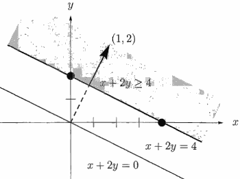
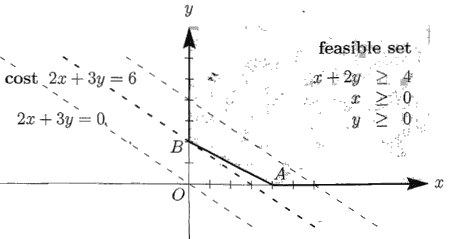

- [8 linear Prograffiffliog and Game Theory](#adb23269688b0aa7f8855b8987514b14)
    - [8.1  LINEAR INEQUALITIES](#4d62bef35d1beae693322a0f9c87ffb7)
        - [The Feasible Set and the Cost Function](#8775939e2cfb40d13172e60558b51fea)
        - [Slack Variables](#690c20def841af809622d7d42099c17a)

<h2 id="adb23269688b0aa7f8855b8987514b14"></h2>

# 8 linear Prograffiffliog and Game Theory

<h2 id="4d62bef35d1beae693322a0f9c87ffb7"></h2>

## 8.1  LINEAR INEQUALITIES

Algebra is about equations, and analysis is often about inequalities. But I have realized that this chapter is a counterexample: ***linear programming is about inequalities***,  but it is unquestionably a part of linear algebra.  It is also extremely useful -- business decisions are more likely to involve linear programming than determinants or eigenvalues.

There are three ways to approach the underlying mathematics: 

- intuitively through the geometry
- computationally through the simplex method
- lgebraically through duality

These approaches are developed in Sections 8.1, 8.2, and 8.3. Then Section 8.4 is about problems (like marriage) in which the solution is an integer. Section 8.5 discusses poker and other matrix games. 

One key to this chapter is to see the geometric meaning of ***linear inequalities***. An inequality divides n-dimensional space into a ***halfspace*** in which the inequality is satisfie,  and a halfspace in which it is not.  A typical example is x + 2y ≥ 4. . The boundary between the two halfspaces is the line x + 2y = 4 , where the inequality is "tight". 

Figure 8.1 would look almost the same in three dimensions. The boundary becomes a plane like x + 2y + z = 4, and above it is the halfspace x + 2y + z ≥ 4. In n dimensions, the "plane" has dimension n - 1.  

> Figure 8.1 Equations give lines and planes. Inequalities give halfspaces.

Another constraint is fundamental to linear programming: x and y are required to be ***nonnegative***. This pair of inequalities x ≥ 0 and y ≥ 0 produces two more halfspaces. Figure 8.2 is bounded by the coordinate axes: x ≥ 0 admits all points to the right of x = 0, and y ≥ 0 is the halfspace above y = 0.

> Figure 8.2 The feasible set with flat sides, and the costs 2x + 3y, touching at B.

<h2 id="8775939e2cfb40d13172e60558b51fea"></h2>

### The Feasible Set and the Cost Function 

The important step is to impose all three inequalities at once.  They combine to give the shaded region in Figure 8.2. 

This ***feasible set*** is the intersection of the three halfspaces x + 2y ≥ 4, x ≥ 0, and y ≥ 0. A feasible set is composed of the solutions to a family of linear inequalities like Ax ≥ b (the intersection of m halfspaces). 

When we also require that every component of x is nonnegative (the vector inequality x ≥ 0), this adds n more halfspaces. The more constraints we impose, the smaller the feasible set.

It can easily happen that a feasible set is bounded or even empty. 

If we switch our example to the halfspace x + 2y ≤ 4, keeping x ≥ 0 and y ≥ 0, we get the small triangle OAB. By combining both inequalities x + 2y ≥ 4 and x + 2y ≤ 4, the set shrinks to a line where x + 2y = 4. If we add a contradictory constraint like x + 2y ≤ -2, the feasible set is empty.

The algebra of linear inequalities (or feasible sets) is one part of our subject.  But linear programming has another essential ingredient: It looks for *the feasible point that maximizes or minimizes a certain* ***cost function*** like 2x + 3y.  The problem in linear programming is to find the point that ***lies in the feasible set and minimizes the cost***.

The problem is illustrated by the geometry of Figure 8.2. The family of costs 2x + 3y gives a family of parallel lines. The minimum cost comes when the first line intersects the feasible set. That intersection occurs at B, where x\* = 0 and y\*= 2; The minimum cost is 2x\* + 3y\* = 6.  The vector (0, 2) is ***feasible*** because it lies in the feasible set, it is ***optimal because*** it minimizes the cost function, and the minimum cost 6 is the ***value*** of the program. We denote optimal vectors by an asterisk.

***The optimal vector occurs at a corner of the feasible set***. This is guaranteed by the geometry, because the lines that give the cost function (or the planes, when we get to more unknowns) move steadily up until they intersect the feasible set. The first contact must occur along its boundary!   The "simplex method" will go from one corner of the feasible set to the next until it finds the corner with lowest cost. In contrast, "interior point methods" approach that optimal solution from ***inside*** the feasible set.

**NOTE** With a different cost function, the intersection might not be just a single point. If the cost happened to be x + 2y, the whole edge between B and A would be optimal. The minimum cost is x\* + 2y\* , which equals 4 for all these optimal vectors. On our feasible set, the maximum problem would have no solution ! The cost can go arbitrarily high and the maximum cost is infinite.

Every linear programming problem falls into one of three possible categories:

 1. The feasible set is empty.
 2. The cost function is unbounded on the feasible set.
 3. The cost reaches its *minimum* (or maximum) on the feasible set: *the good case* .

The empty and unbounded cases should be very uncommon for a genuine problem in economics or engineering. We expect a solution.

---

<h2 id="690c20def841af809622d7d42099c17a"></h2>

### Slack Variables

