...menustart

- [Matrices and Gaussian Elimination](#abb8dacb4b3a6b2753a9bf368b0f04e2)
    - [1.1 Introduction](#550db00849ad37a0926e6ec4f59d71c7)
    - [1.2 The Geometry of Linear Equations](#992f66663115d5ef2e15386d995e53e9)
        - [n Dimensions](#f3e2771bb4ba31fb79a43ae62aaab1e6)
        - [Column Vectors and Linear Combinations](#c2da619cbc890f55d4715ed875a9eb64)
        - [The Singular case](#eef9ce517195c244778811d97ec80a8f)
    - [1.3 AN EXAMPLE OF GAUSSIAN ELIMINATION](#aeb6fbe1b69d56ea9622eb6766ea5c39)
        - [The Breakdown of Elimination](#2b33b6ac684eea3a04b7a90f58554d3b)
        - [The Cost of Elimination](#b34d1b23e46d808504dce8cc095fee73)
    - [1.4 MATRIX NOTATION AND MATRIX MULTIPLICATION](#9ac25990605bccf45a2c61dea50093d6)
        - [Multiplication of a Matrix and a Vector](#5c58db5a1c2e2903f1fbeec62d6ea4a5)
        - [The Matrix Form of One Elimination Step](#8afd4d0866e9cda428c450f1f4723feb)
        - [Matrix Multiplication](#fe759ee30ec010c2c1f589ed520c3a0f)
    - [1.5 TRIANGULAR FACTORS AND ROW EXCHANGES](#6e9d018eb5ce2e083a4703bfcb7526d2)
        - [One Linear System = Two Triangular Systems](#17f5e1579a1578ab8db20e0eb910d224)
        - [Row Exchanges and Permutation Matrices](#ee835f91c2c818fd230e9563c6b23a11)
        - [Elimination in a Nutshell: PA = LU](#5c3fc1e2610b8235f0cf01bfd463f2eb)
    - [1.6 INVERSES AND TRANSPOSE](#4d72fafca6d677bb749ef5048ba77fa6)
        - [The Calculation of A⁻¹: The Gauss-Jordan Method](#5dd7a646b2bb1011c052239ac7a3ce0a)
        - [Invertible = Nonsingular (n pivots)](#f559aa9e3fcec478e620ebc4c2817cc4)
        - [The Transpose Matrix](#242b3600224bb5f3c1f4b6458cf7b658)
        - [Symmetric Matrices](#b899f85c23e42aea33f7684a076389ca)
        - [Symmetric Products RᵀR, RRᵀ, and LDLᵀ](#1385c8c79787a12139bf60e1624cc87f)
    - [1.7 SPECIAL MATRICES AND APPLICATIONS](#ed0eb6118820d3734285fd1a953dab73)
        - [Roundoff Error](#84cbf7b58bea5dda0f6a3e9f8dbc31c4)

...menuend


<h2 id="abb8dacb4b3a6b2753a9bf368b0f04e2"></h2>


# Matrices and Gaussian Elimination

<h2 id="550db00849ad37a0926e6ec4f59d71c7"></h2>


## 1.1 Introduction

The central problem of linear algebra: *solving linear equations*. The most importance case , and the simplest, is when the number of unknowns equals the number of equations. 

Two ways to solve thest equations: *elimination* and *determinants*.

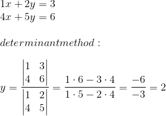

When n is much large( eg. 1000 ), direct use of the determinant formular for 1000 equations would be total disaster. We will find that fomular (Cramer's Rule) in Chapter 4, but we want a good method to solve 1000 equations in Chapter 1.

The good method is ***Gaussian Elimination***. This is the algorithm that is constantly used to solve large systems of equations. Elimination is even the best way to compute determinants. It will become the basis for half of this book, simplifying a matrix so that we can understand it.

**Four deeper aspects** in this chapter:

 1. Linear equations lead to ***geometry of planes***. The example has one solution. Singular cases have none or too many.

  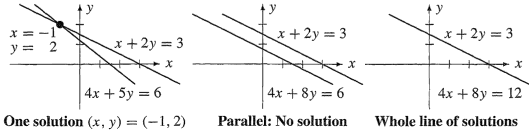
  
 2. We move to ***matrix notation*** , as Ax=b. We multiply A by "elimination matrices" to reach an upper triangular matrix U. Those steps factor A into *L times U* , where L is lower triangular.

  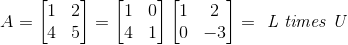  
  
  Every Matrix has a ***transpose*** **Aᵀ**. This matrix has an ***inverse*** **A⁻¹**.
  
 3. In most cases elimination goes forward without difficulties. The matrix has an inverse and the system Ax=b has one solution. In exceptional cases the method will *break down* -- either the equations are in wrong order (which is easily fixed by exchanging them) or the equations don't have a unique solution (see the singular case -- parallel lines ***no solution*** and whole line ***infinitely many solution*** ). 

 4. We need a rough count of the ***number of elimination steps*** required to solve a system of size *n*. The computing cost often determine the accuracy in the model. After a million steps, roundoff error could be significant. (Some problems are sensitive, other are not.) We want to see large system that arise in practice, and how they are actually solved.

The final result of this chapter will be an elimination algorithm that is about as efficient as possible. Understanding it an essential foundation for the theory. And at the same time, understanding it in terms of *matrices* -- the ceofficient matrix A, the matrices ***E*** for eliminations and ***P*** for row exchanges , and the final factors ***L*** and ***U*** -- is and essential foundation for the theory. 
   

<h2 id="992f66663115d5ef2e15386d995e53e9"></h2>


## 1.2 The Geometry of Linear Equations

```
2x - y = 1
 x + y = 5
```

We can look at that system by *rows* or by *columns*. We want to see them both.

The first approach concentrates on the separate equations (the ***rows***). Each equation represented by a *straight line* in the x-y plane.


The point of intersection lies on both lines. It's the only solution to both equations. That point (2,3) will soon be found by "elimination".

The second approach looks at the ***columns*** of the linear system. The tow separate equations are really ***one vector equation***: 

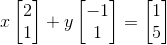

The problem is ***to find the combination of the column vectors on the left side that produces the vector on the right side***.


I would rather move forward to n=3. 

```
 2u +  v +  w =  5
 4u - 6v      = -2
-2u + 7v + 2w =  9
```

Again we start with the rows. Each equation describes a ***plane*** in three dimensions. 

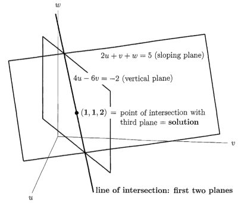

The first plane is 2u + v + w = 5. It is determined by any 3 of its points--provoided they do not lie on a line. Changing 5 to 10, the plane 2u + v + w = 10 *would be parallel to this one* , twice as far from the origin (0,0,0). Changing the right side moves the plane parallel to itself, and the plane 2u+v+w=0 goes through the origin.

The second plane is 4u - 6v = -2. It is drawn vertically, because w can take any value. It's remains a plane in 3-space (even u=0 describes a plane). This figure shows the intersection of those 2 planes. That intersection is a line. *In 3 dimensions a line requres two equations*; in *n* dimemsions it will require *n-1*.

Finally the third plane intersects this line in a point.

<h2 id="f3e2771bb4ba31fb79a43ae62aaab1e6"></h2>


### n Dimensions

The point is that linear algebra can operate with any number of equations.
The 1st equation produces an (n-1) dimemsional "plane" in *n* dimemsions. The second "plane" intersects it (we hope) in a small set of "dimension n-2".  Assuming all goes well , every new "plane" (every new equation) reduce the dimension by 1. At the end, when all n planes are accounted for, the intersection has dimension zero. It's a *point* , it lies on all planes, and its coordinates satisfy all n equations. It's the solution!

<h2 id="c2da619cbc890f55d4715ed875a9eb64"></h2>


### Column Vectors and Linear Combinations

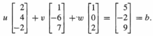  (2)

Those are 3-dimensional column vectors. ***The vector b is identified with the point whose coordinates are (5,-2,9)*** .

Equation(2) asked for multipliers *u,v,w* that produce the right side *b*. Those numbers are (u,v,w)= (1,1,2). They give the correct combination of the columns. They also gave the point(1,1,2) in the **row picture**(where the three plans intersect). 

**Ax=b的 特殊解, 位于row space ?**

With *n* equations in *n* unknowns, there are *n* planes in the row picture ; there are *n* vectors and a vector *b* in the column picture. ***The equations ask for a linear combination of the n columns that equals b***. For centain equations that will be impossible , in the **singular case**.

Row picture : Intersection of planes | Column picture : Combination of columns
--- | ---


---


<h2 id="eef9ce517195c244778811d97ec80a8f"></h2>


### The Singular case

In 2 dimensions , parallel lines are the only possibility for breakdown. But 3 planes in 3 dimensions can even be in trouble without being parallel.


One possibility is that two planes may be parallel. (Figure 1.5a shows an end view)

The most common difficulty is shown in Figure 1.5b. From the end view the planes form a triangle. Every pair of planes intersects in a line, and those lines are parallel. The third plane is not parallel to the other planes, but it is parallel to their line of intersection.

```
// No solution, as in Figure 1.5b
u  +  v +  w = 2
2u +      3w = 5
3u +  v + 4w = 6
```

The first two left sides add up to the third. On the right side that fails: 2 + 5 != 6. Equation 1 plus equation 2 minus equation 3 is the impossible statement 0 = 1. 

Another singular system, close to this one, has an **infinity of solutions**. When the 6 in the last equation becomes 7, the three equations combine to give 0 = 0.  Now the third equation is the sum of the first two. In that case the three planes have a whole line in common (Figure 1.5c)

The extreme case is three parallel planes. For most right sides there is no solution (Figure 1.5d). For special right sides (like b = (0, 0, 0)!) there is a whole plane of solutions-because the three parallel planes move over to become the same.

What happens to the ***column picture*** when the system is singular? 

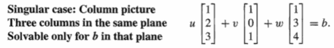

There are still three columns on the left side of the equations, and we try to combine them to produce b. For b = (2, 5, 7) this was possible; for b = (2, 5, 6) it was not. The reason is that ***those three columns lie in a plane***.

Then every combination is also in the plane (which goes through the origin). If the vector b is not in that plane, no solution is possible . But there is a chance that b does lie in the plane of the columns. In that case there are too many solutions; the three columns can be combined in infinitely many ways to produce b. That column picture corresponds to the row picture in Figure 1.5c.

How do we know that the three columns lie in the same plane? One answer is to find a combination of the columns that adds to zero. 

The vector b = (2, 5, 7) is in that plane of the columns-it is column 1 plus column 3-so (1, 0, 1) is a solution. *We can add any multiple of the combination (3, -1, -2) that gives b = 0*. So there is a whole line of solutions-as we know from the row picture.

The truth is that we knew the columns would combine to give zero, because the rows did. That is a fact of mathematics, not of computation-and it remains true in dimension n. ***If the n planes have no point in common, or infinitely many points, then the n columns lie in the same plane***.

行空间的平面不相交为1点，那么所有列向量必然位于同一平面。

<h2 id="aeb6fbe1b69d56ea9622eb6766ea5c39"></h2>


## 1.3 AN EXAMPLE OF GAUSSIAN ELIMINATION

```
 2u +  v +  w =  5
 4u - 6v      = -2 (1)
-2u + 7v + 2w =  9
```

**GAUSSIAN ELIMINATION** starts by subtracting multiples of the first equation from the other equations. The goal is to eliminate u from the last two equations.

```
2u +  v +  w =  5
   - 8v - 2w = -12 (2)
     8v + 3w =  14
```

The coefficient 2 is the ***first pivot***. The pivot for **the second stage of elimination** is -8. 

```
// Triangular system 
2u +  v +  w =  5
   - 8v - 2w = -12 (3)
           w =  2
```

We can use ***back-substitution*** to get the solve (u,v,w) = (2,1,1).

Forward elimination produced the pivots 2, -8, 1. It reached the "triangular" system (3).

One good way to write down the forward elimination steps is to include the right-hand side as an extra column.

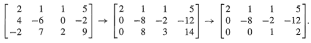

By definition, ***pivots cannot be zero***.

<h2 id="2b33b6ac684eea3a04b7a90f58554d3b"></h2>


### The Breakdown of Elimination

In elimination , if a zero appears in a pivot position, elimination has to stop - either temporarily or permanently. The system might or might not be singular.

Temporary breakdown can be solved by exchanging rows.

只有 non-singular 的情况, 才能得到a full set of pivots (全部非0主元)，但是即便non-singular，消元也可能breakdown, 这种情况可以通过 row exchanges  来解决。这也是为什么 matlab进行LU分解，返回值包含一个 转置矩阵。

<h2 id="b34d1b23e46d808504dce8cc095fee73"></h2>


### The Cost of Elimination

A good estimate for the number of operations is **n³/3**.

<h2 id="9ac25990605bccf45a2c61dea50093d6"></h2>


## 1.4 MATRIX NOTATION AND MATRIX MULTIPLICATION

We now introduce **matrix notation** to describe the original system, and **matrix multiplication** to describe the operations that make it simpler. 

Coefficient matrix :

```
    | 2  1  1|
A = | 4 -6  0|
    |-2  7  2|
```

<h2 id="5c58db5a1c2e2903f1fbeec62d6ea4a5"></h2>


### Multiplication of a Matrix and a Vector

Matrix form Ax = b:

```
 | 2  1  1| |u|   | 5|
 | 4 -6  0| |v| = |-2|
 |-2  7  2| |w|   | 9|
```

 - Ax is a **combination of the columns of A**
 - **An m by n matrix multiplies an n-dimensional vector** 
    - and produces an m-dimensional vector

<h2 id="8afd4d0866e9cda428c450f1f4723feb"></h2>


### The Matrix Form of One Elimination Step

The first step subtracted 2 times the first equation from the second. 

On the right-hand side, is the first component of b was subtracted from the second component. 

The same result is achieved if we multiply ***b*** by this elementary matrix (or elimination matrix):

```
    | 1  0  0|
E = |-2  1  0|
    | 0  0  1|
```

 - This elementary matrix Eᵢⱼ includes ***-l*** in row i, column j.
 - The elementary matrix Eᵢⱼ ***subtracts l*** times row j from row i. 
 - ij , means i-lj


```
      | 1  0  0|               |  b₁  |
E₃₁ = | 0  1  0|   has E₃₁·b = |  b₂  |
      |-l  0  1|               |b₃-lb₁|
```


<h2 id="fe759ee30ec010c2c1f589ed520c3a0f"></h2>


### Matrix Multiplication

 - (EA times x) equals (E times Ax). 
 - **Multiplication by columns** 
    -  When B contains several columns b1, b2, b3, the columns of AB should be Abl, Ab2, Ab3! 
    - AB = A [ b1 b2 b3 ] = [ Ab1 Ab2 Ab3 ]
    - **Every column of AB is a combination of the columns of A**.
 - The i,j entry of AB is the inner product of the `iᵗʰ row of A` and the `jᵗʰ column of B`.

We summarize these three different ways to look at matrix multiplication:

 1. Each entry of AB is the product of a row and a column:
    - (AB)ᵢⱼ = (row i of A) times (column j of B) 
 2. Each column of AB is the product of a matrix and a column:
    - column j of AB = A times (column j of B)
 3. Each row of AB is the product of a row and a matrix:
    - row i of AB = (row i of A) times B

Some rules:

 - Matrix multiplication is associative: 
    - **(AB)C = A(BC)**. Just write ABC
 - Matrix operations are distributive:
    - **A(B+C) =AB+AC and (B+C)D=BD+CD**
 - Matrix multiplication is not commutative: 
    - Usually **FE != EF**.
    - FE == EF only works when one is identity matrix


<h2 id="6e9d018eb5ce2e083a4703bfcb7526d2"></h2>


## 1.5 TRIANGULAR FACTORS AND ROW EXCHANGES

We want to look again at elimination, there were three elimination steps, with multipliers 2, -1, -1:

 1. Step 1. Subtract 2 times the first equation from the second; 
 2. Step 2. Subtract -1 times the first equation from the third; 
 3. Step 3. Subtract -1 times the second equation from the third.

The result was an equivalent system Ux = c, with a new coefficient matrix U:

*Upper triangular*:

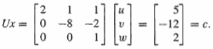

This matrix U is **upper triangular** - all entries below the diagonal are zero.

So the forward elimination start with A and b, end with U and c. Here we concentrate on connecting A to U.

The matrices E for step 1, F for step 2, and G for step 3. They are called ***elementary matrices***. 

**The result of all three steps is GFEA = U.** Note that E is the first to multiply A.  We could multiply GFE together to find the single matrix that takes A to U (and also takes b to c). It is lower triangular (zeros are omitted):

**From A to U:**

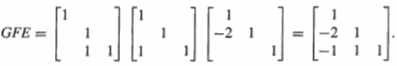

Then another most important question is exactly the opposite ***How can we undo the steps of Gaussian elimination?***

 - **From U back to A:**
    - E⁻¹F⁻¹G⁻¹U=A , is LU=A 

Now we recognize the **matrix L that takes U back to A**. It is called L, because it is lower triangular. And it has a special property that can be seen only by multiplying the three inverse matrices in the right order:

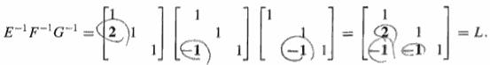

The special thing is that the entries below the diagonal are the multipliers *l* = 2, -1, and -1.

***The numbers kᵢⱼ fit right into the matrix L that takes U back to A.***

 - ***Triangular factorization A = LU with no exchanges of rows.***
    - L is lower triangular, with 1 on the diagonal. 
    - The multipliers lᵢⱼ  (taken from elimination, *-1 ?) are below the diagonal.
    - U is the upper triangular matrix which appears after forward elimination.
    - The diagonal entries of U are the pivots.


<h2 id="17f5e1579a1578ab8db20e0eb910d224"></h2>


### One Linear System = Two Triangular Systems

**Ax = b**  ->  LUx = b  ->  Ux = L⁻¹b  ->  **Ux = c**

 - First , Lc = b
 - then , Ux = c
 
**The triangular factorization can be written A = LDU, where L and U have *1* on the diagonal and D is the diagonal matrix of pivots.**

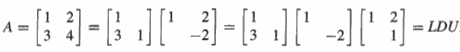

<h2 id="ee835f91c2c818fd230e9563c6b23a11"></h2>


### Row Exchanges and Permutation Matrices

We now have to face a problem that has so far been avoided: The number we expect to use as a pivot ***might be zero***. This could occur in the middle of a calculation. It will also happen at the very beginning if all = 0. A simple example is:

```
|0 2||u| =  |b₁|
|3 4||v|    |b₂|
```

The remedy is equally clear. Exchange the two equations.

```
|3 4||u|    |b₂|
|0 2||v| =  |b₁|
```

we need the ***permutation matrix P*** that produces the row exchange.

```
A =
   1   2
   3   4

P =
   0   1
   1   0
   
P*A = // row exchange
   3   4
   1   2
   
A*P = // column exchange
   2   1
   4   3
```

Now the new system is **PAx = Pb**.

The unknowns u and v are not reversed in a row exchange.

**There are n! = (n)(n-1) permutations of size n.** Row1 has ***n*** choices, Row2 has n-1 choices, ... 

We can display all 3 by 3 permutations (there are 3! = 6 matrices):

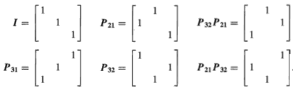


<h2 id="5c3fc1e2610b8235f0cf01bfd463f2eb"></h2>


### Elimination in a Nutshell: PA = LU

A good elimination code saves L and U and P. 

Those matrices carry the information that originally came in A - and they carry it in a more usable form. Ax = b reduces to two triangular systems. This is the practical equivalent of the calculation we do next to find the inverse matrix A⁻¹ and the solution x = A⁻¹b.

 - LU分解不借助 行交换的关键是是 中间不能出现 0 pivot
  - 但是对最后一个 pivot 没有 非0的要求
  - 因为奇异矩阵也有LU分解
  - 实际上，如果一个秩为k的矩阵的前k个顺序主子式不为零，那么它就可以进行LU分解(消元不break down)，但反之则不然

 - PS. 如果不要求 U 的主元都 非0, 则 PA = LU 对任何矩阵都存在
     - U 就是 echelon 形式

<h2 id="4d72fafca6d677bb749ef5048ba77fa6"></h2>


## 1.6 INVERSES AND TRANSPOSE

Inverse matrix :

**If b = Ax then A⁻¹b = x.**

***Not all matrices have inverses. An inverse is impossible when Ax is zero and x is nonzero***

There is no stupid matrix that satisfy : A⁻¹·0 = x.

 - **A⁻¹A = I , AA⁻¹ = I**
    1. The inverse exists if and only if elimination produces n pivots 
    2. The matrix A cannot have two different inverse
    3. If A is invertible, the one and only solution to Ax = b is x = A⁻¹b
    4. ***Suppose there is a nonzero vector x such that Ax = 0. Then A cannot have an inverse***. To repeat: No matrix can bring 0 back to x.
        - If A is invertible, then Ax = 0 can only have the zero solution x = 0.
    5. 2 by 2 matrix is invertible if and only if **ad - bc** is not zero: This number **ad - bc** is the determinant of A. 
    6. A diagonal matrix has an inverse.
        - 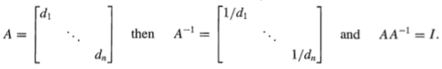

 - **Inverse of AB:  (AB)⁻¹ = B⁻¹A⁻¹**
 - **Inverse of ABC:  (ABC)⁻¹ = C⁻¹B⁻¹A⁻¹**

<h2 id="5dd7a646b2bb1011c052239ac7a3ce0a"></h2>


### The Calculation of A⁻¹: The Gauss-Jordan Method

Consider the equation AA⁻¹=I.  If it is taken **a column at a time** , that equation determines each column of A⁻¹. 

The first column of A⁻¹ is multiplied by A , to yield the first column of the I:    Ax₁=e₁. 

Similarly Ax₂ = e₂  and Ax₃ = e₃.  The e's are the columns of I. 

In a 3x3 example, A times A⁻¹ is I: 


Thus we have 3 systems of equations ( or n systems).  The right-hand sides e₁,e₂,e₃ are different, but elimination is possible *on all systems simultaneously*. This is the **Gauss-Jordan method**. 

Instead of stopping at U and switching to back-substitution , it continues by subtracting multiples of a row *from the low above*.  This produces zeros above the diagonal as well as below.  When it reaches the identity matrix we have found A⁻¹⁻¹.


Example 1: Using the Gauss-Jordan Method to Find A⁻¹:

 - 1st step: forward elimination
    - 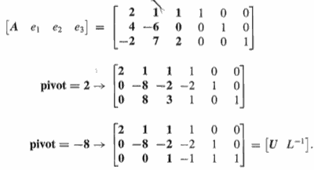
    - This completes the first half -- forward elimination. 
        - The upper triangular U appears in the first three columns.
        - The other three columns are the same as L⁻¹.
 - 2nd step: Creating zeros above the pivots, we reach A⁻¹
    - Now the second half will go from U to I (multiplying by U⁻¹).  That takes L⁻¹ to U⁻¹L⁻¹ which is A⁻¹.
    - 
 - last step: we divided the rows by their pivots 2 and -8. 
    - The coefficient matrix in the left-hand half became the identity.
    - Since A went to I, the same operations on the right-hand half must have carried I into A⁻¹. 
        - why ?
        - E*[AI] = [I?] 
        - E*A=I => E=A⁻¹ => E*[AI]=[IA⁻¹]
         
A note for the future: You can see the determinant -16 appearing in the denominators of A⁻¹. **The determinant is the product of the pivots (2)(-8)(1)**. 

Though A⁻¹ can solves Ax = b in one step , but it is not recommended. Two triangular steps are better: x = A⁻¹b separates into Lc = b and Ux = c.

Since we only need back-substitution for x (and forward substitution produced c).


<h2 id="f559aa9e3fcec478e620ebc4c2817cc4"></h2>


### Invertible = Nonsingular (n pivots)

If A is invertible, it has n pivots. 

奇异矩阵 singular matrix is square matrix with dependent columns.   若不是方阵，那就谈不上奇异矩阵和非奇异矩阵. 

<h2 id="242b3600224bb5f3c1f4b6458cf7b658"></h2>


### The Transpose Matrix

Transpose:

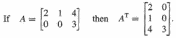

```
(A+B)ᵀ = Aᵀ+Bᵀ
(AB)ᵀ = BᵀAᵀ
(A⁻¹)ᵀ = (Aᵀ)⁻¹ #转置的逆,等于 逆的转置
```

<h2 id="b899f85c23e42aea33f7684a076389ca"></h2>


### Symmetric Matrices

***A symmetric matrix is a matrix that equals its own transpose: Aᵀ = A.***

***Multiplying any matrix R by Rᵀ gives a symmetric matrix.***

<h2 id="1385c8c79787a12139bf60e1624cc87f"></h2>


### Symmetric Products RᵀR, RRᵀ, and LDLᵀ

```
(RᵀR)ᵀ = Rᵀ(Rᵀ)ᵀ = RᵀR
```

LU misses the symmetry, but LDLᵀ captures it perfectly.

Suppose A = Aᵀ can be factored into A = LDU without row exchanges. Then U is the transpose of L. ***The symmetric factorization becomes A = LDLᵀ***.

The transpose of A = LDU gives Aᵀ = UᵀDᵀLᵀ. Since A = Aᵀ, Lᵀ must be identical to U.

Inverse of symmetric is symmetric.

<h2 id="ed0eb6118820d3734285fd1a953dab73"></h2>


## 1.7 SPECIAL MATRICES AND APPLICATIONS

This section has two goals. 

 1. explain one way in which large linear systems Ax = b can arise in practice. 
 2. to illustrate, by this same application, the special properties that coefficient matrices frequently have.

Large matrices almost always have a clear pattern- frequently a pattern of symmetry, and *very many zero entries*. Since a sparse matrix contains far fewer than n² pieces of information, the computations ought to be fast. We look at band matrices, to see how concentration near the diagonal speeds up elimination. In fact we look at one special tridiagonal matrix.

It comes from changing a differential equation to a matrix equation. As a simple but still very typical continuous problem, our choice falls on the differential equation:


Second derivatives are essentially negative definite things so that minus sign is to really make it positive definite.

This is a linear equation for the unknown function u(x). Any combination C + Dx could be added to any solution, since the second derivative of C + Dx contributes nothing.

The result is a *two-point boundary-value* problem, describing not a transient(瞬时) but a steady- state phenomenon(稳态现象). For example, the temperature distribution in a rod,  with ends fixed at 0° and with a heat source f (x).

Remember that our goal is to produce a discrete problem-in other words, a problem in linear algebra. For that reason we can only accept a finite amount of information about f (x), say its values at n equally spaced point(等距点值) *x = h, x = 2h, . . . , x = nh* . We compute approximate values u₁, . . . , un, for the true solution u at these same points. At the ends x = 0 and x = 1 = (n + 1)h, the boundary values are u0 = 0 and un+1 = 0


The first question is: How do we replace the derivative *d²u/dx²* ? 

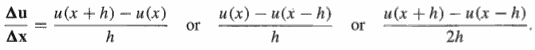

how to figure u(x+h)  ? It’s something called Taylor series. If I move a little bit, I start from the point x and then there is a little correction and that's given by the derivative and then there's further correnct if I want to go the second order correction, times the second derivative. Second order accuracy is often the goal in scientific compute .

```
u(x+h) = u(x) + hU’(x) + h²/2·u”(x) + .. .
u(x-h) = u(x) - hU’(x) + h²/2·u”(x) + .. .
u(x+h)-u(x-h) = 2hU’(x)  => (u(x+h)-u(x-h)) / 2h = u'(x)
```

It makes the key point. That the center defference gives the correct derivative.


For the second derivative there is just one combination that uses only the values at x and x ± h:

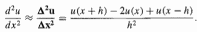

The right-hand side approaches the true value of d²u/dx² as h -> 0, but we have to stop at a positive h.

At each meshpoint x = jh, the equation -d²u/dx² = f(x) is replaced by its discrete analogue (5). We multiplied through by h2 to reach n equations Au = b:

```
-uⱼ₊₁ + 2uⱼ - uⱼ₋₁ = h²f(jh) for j = 1, ... , n. (5)
```

The first and last equations (j = 1 and j = n) include u(0)=0 and u(n+1)=0 , which are known from the boundary conditions. These values would be shifted to the right-hand side of the equation if they were not zero.

The structure of these n equations (5) can be better visualized in matrix form. We choose h = 1/6, to get a 5 by 5 matrix A:

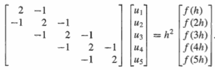

From now on, we will work with this equation (6). The matrix A possesses many special properties, and three of those properties are fundamental:

 1. ***The matrix A is tridiagonal. ***
    - All nonzero entries lie on the main diagonal and the two adjacent diagonals. Outside this band all entries are aᵢⱼ = 0. These zeros will bring a tremendous simplification to Gaussian elimination.
 2. ***The matrix is symmetric. ***
    - Aᵀ = A  , A = LDLᵀ (不是所有的对称矩阵都有LDLᵀ)
 3. ***The matrix is positive definite.***
    - This extra property says that the *pivots are positive*. Row exchanges are unnecessary in theory and in practice.

What effect does this matrix have on elimination? 

 1. There was only one nonzero entry below the pivot.
 2. The pivot row was very short.

The final result is the LDU = LDLᵀ factorization of A. Notice the pivots!

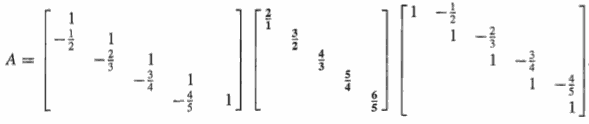

*The L and U factors of a tridiagonal matrix are bidiagonal.*

 - The pivots 2/1, 3/2, 4/3, 5/4, 6/5 are all positive. Their product is the determinant of A: det A = 6. 
 - The pivots are obviously converging to 1, as n gets large.
 - Such matrices make a computer very happy.
 
These sparse factors L and U completely change the usual operation count. *The cost of solving a tridiagonal system is proportional to n.*

A **band matrix** has aᵢⱼ = 0 except in the band |i - j| < w. The "half bandwidth" is w = 1 for a diagonal matrix, w = 2 for a tridiagonal matrix, and w = n for a full matrix. 

For each column, elimination requires w(w - 1) operations: a row of length w acts on w - 1 rows below. Elimination on the n columns of a band matrix requires about ***w²n*** operations.

<h2 id="84cbf7b58bea5dda0f6a3e9f8dbc31c4"></h2>


### Roundoff Error

For a system of moderate size, say 100 by 100, elimination involves a third of a million operations (n³/3). With each operation we must expect a roundoff error. Normally, we keep a fixed number of significant digits (say three, for an extremely weak computer).
Then adding two numbers of different sizes gives an error:

```
.456 + .00123 -> .457 loses the digits 2 and 3.
```

How do all these individual errors contribute to the final error in Ax = b?

Two simple examples will illustrate three important points about roundoff error. The examples are:

- ill-conditioned:

```
A =| 1.     1.  |
   | 1.   1.0001|
```

- bad-conditioned: 

```
B =| .0001   1. |
   |   1.    1. |
```

A is nearly singular whereas B is far from singular. If we slightly change the last entry of A to a22 = 1, it is singular. 

Consider two very close right-hand sides b:

```
u +       v = 2  and u +       v = 2 
u + 1.0001v = 2      u + 1.0001v = 2.0001
```

The solution to the first is u = 2, v = 0. The solution to the second is u = v = 1. 

*A change in the fifth digit of b was amplified to a change in the first digit of the solution. No numerical method can avoid this sensitivity to small perturbations.*

**Even a well-conditioned matrix like B can be ruined by a poor algorithm.**

We regret to say that for the matrix B, direct Gaussian elimination is a poor algorithm.

Elimination on B with small pivot:

```
.0001 u + v = 1      ->      .0001 u+ v = 1
      u + v = 2                  -9999v = -9998.
```

Roundoff will produce - 10,000v = -10,000, or v = 1.  This is correct to three decimal places. 

The small pivot .0001 brought instability, and the remedy is clear - exchange rows.

A small pivot forces a practical change in elimination. Normally we compare each pivot with all possible pivots in the same column. Exchanging rows to obtain the largest possible pivot is called ***partial pivoting***.

The new matrix C = PB has good factors:

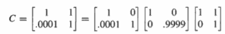

The pivots for C are 1 and .9999, much better than .0001 and -9999 for B.

We have finally arrived at the fundamental algorithm of numerical linear algebra: ***elimination with partial pivoting***. 

