...menustart

 - [Linear Algebra](#eee5ea614c3474d72c29c96917c356e9)
 - [Vector Spaces](#2f21953656c07a77cad97b71c89a69de)
     - [2.1 VECTOR SPACES AND SUBSPACES](#972dab9e05beb3d5443db66ec0eabd2e)
         - [The Column Space of A](#8181c20bb270d985c5745507fd8a273b)
         - [The Nullspace of A](#3c94b747c25e8b676e5f7af1a67da8a5)
     - [2.2 SOLVING Ax=0 and Ax=b](#1e0304a592cf2dccbcb3c7e858021d8d)
         - [Echelon Form(梯形) *U* and Row Reduced Form *R*](#fb0727e770a06722aa7b9d64a9b6af91)
         - [Pivot Variables and Free Variables](#1e32c695f24ac4d5108ba9cca53ac86a)
         - [Solving Ax = b, Ux = c, and Rx = d](#0aa8bb162b1e64c4edd71e634be16382)
         - [满秩](#176eb4a957bc2a4950033ca9e1ec5ede)
     - [2.3 LINEAR INDEPENDENCE, BASIS, AND DIMENSION](#42daec4d086da007d1b961361ec0814f)
         - [Spanning a Subspace](#bc14e48a52e7371d448ce8db40cccf14)
         - [Basis for a Vector Space](#9702e33bd5c5df4fb7ee415a1ab6e26f)
         - [Dimension of a Vector Space](#277acc5b1627dc1a1e613976782c994b)
     - [2.4 THE FOUR FUNDAMENTAL SUBSPACES](#a1e826e3adda502b8e640e95e34a88d8)
         - [Summarize](#10fabddaa26f740c259e8adcfd5e32d4)
         - [Existence of Inverses](#f934c3a267dc016627d494171b3c77c7)
         - [Matrices of Rank 1](#e9da9069b202c4de3612d6edae5b5d07)
     - [2.5 GRAPHICS NETWORKS](#734ef82f504a5a0b7c94fe20dcc0135c)
     - [2.6 LINEAR TRANSFORMATIONS](#aa8fafd1a0c4fb58a6ba9373adaf258f)
         - [Rotations Q, Projections P, and Reflections H](#72e0a765ceae5f613d42b3da5afdedd9)

...menuend


[TOC]

<h2 id="eee5ea614c3474d72c29c96917c356e9"></h2>


# Linear Algebra 

<h2 id="2f21953656c07a77cad97b71c89a69de"></h2>


# Vector Spaces

<h2 id="972dab9e05beb3d5443db66ec0eabd2e"></h2>


## 2.1 VECTOR SPACES AND SUBSPACES

For the concept of a ***vector space***, we start immediately with the most important spaces. They are denoted by **R¹, R², R³**, ... ; the space **Rⁿ** consists of all column vectors with ***n*** components.

 - **We can add any two vectors, and we can multiply all vectors by scalars. In other words, we can take linear combinations.** 

Normally our vectors belong to one of the spaces **Rⁿ**; they are ordinary column vectors. The formal definition allows other things to be ***"vectors"*** - provided that addition and scalar multiplication are all right. We give three examples:

 1. *The infinite-dimensional space* **R°°**.
    - Its vectors have infinitely many components, as in x = (1, 2, 1, 2, ...). The laws for x + y and cx stay unchanged. 
 2. *The space of 3 by 2 matrices*. 
    - In this case the "vectors" are matrices! This space is almost the same as **R⁶**. Any choice of *m* and *n* would give the vector space of all m by n matrices.
 3. *The space of functions f (x)*.
    - Here we admit all functions f that are defined on a fixed interval, say 0 < x < 1. The space includes *f(x) = x², g(x) = sinx*, their sum *(f + g)(x) = x² + sinx*, and all multiples like *3x²* and *-sinx*. The vectors are functions, and the dimension is somehow a larger infinity than for **R°°**. 

---

**Definition: Subspace**

A ***subspace*** of a vector space is a nonempty subset that satisfies the requirements for a vector space: Linear combinations stay in the subspace.

 - (i) If we add any vectors x and y in the subspace, x + y is in the subspace.
 - (ii) If we multiply any vector x in the subspace by any scalar c, cx is in the subspace.

---

Notice in particular that ***the zero vector will belong to every subspace***. That comes from rule (ii): Choose the scalar to be c = 0. The smallest subspace **Z** contains only one vector, the zero vector.

 - Example:

Start from the vector space of 3 by 3 matrices. One possible subspace is the set of lower triangular matrices. Another is the set of symmetric matrices. A + B and cA are lower triangular if A and B are lower triangular, and they are symmetric if A and B are
symmetric. Of course, the zero matrix is in both subspaces.


 - 两个子空间的交集，还是一个子空间
    - S⋂T is a subplace

 - PS. **Ax=b解不是子空间，因为解不包含0向量**

<h2 id="8181c20bb270d985c5745507fd8a273b"></h2>


### The Column Space of A

We now come to the key examples, the **column space** and the **nullspace** of a matrix A.

***The column space contains all linear combinations of the columns of A***. It is a subspace of **Rᵐ**. We illustrate by a system of m = 3 equations in n = 2 unknowns:

```
|1  0| |u|   |b₁|
|5  4|·|v| = |b₂|
|2  4|       |b₃|
```

With m > n we have more equations than unknowns - and usually there will be no solution. The system will be solvable only for a very "thin" subset of all possible b's ( b in plane).

**2A:** The system Ax = b is solvable if and only if the vector b can be expressed as ***a combination of the columns of A***. Then b is in the column space.

We can describe all combinations of the two columns geometrically: *Ax = b* can be solved if and only if b lies in the **plane** that is spanned by the two column vectors. This is the *thin* set of attainable b. If b lies off the plane, then it is not a combination of the two columns. In that case Ax = b has no solution.

What is important is that this plane is not just a subset of R³; it is a **subspace**. It is the column space of A, consisting of all combinations of the columns. It is denoted by ***C(A)*** .

Then C(A) can be somewhere between the zero space and the whole space **Rᵐ**. Together with its perpendicular space, it gives one of our two approaches to understanding Ax = b.

是指矩阵的列向量组构成的空间，也就是将列向量组的极大线性无关组找出来，然后做线性组合而生成的所有向量构成的空间。

<h2 id="3c94b747c25e8b676e5f7af1a67da8a5"></h2>


### The Nullspace of A

The second approach to Ax = b is "dual" to the first. 

We are concerned not only with attainable right-hand sides b, but also with the solutions x that attain them. 

The right- hand side b = 0 always allows the solution x = 0, but there may be infinitely many other solutions. (There always are, if there are more unknowns than equations, n > m.) ***The solutions to Ax = 0 form a vector space - the nullspace of A***.

The ***nullspace*** of a matrix consists of all vectors x such that Ax = 0. It is denoted by It is a subspace of **Rⁿ**(n维子空间), just as the column space was a subspace of **Rᵐ**.

The nullspace is easy to find for the example given above; it is as small as possible:

```
|1  0| |u|   |0|
|5  4|·|v| = |0|
|2  4|       |0|
```

The first equation gives u = 0, and the second equation then forces v = 0. ***The nullspace contains only the vector (0, 0)***. This matrix has "independent columns" - a key idea that comes soon.

The situation is changed. when a third column is a combination of the first two:

```
    |1  0  1| 
B = |5  4  9| 
    |2  4  6|  
```

B has the same column space as A. The new column lies in the same plane ; it is the sum of the two column vectors we started with. But the nullspace of B contains the vector (1, 1, -1) and automatically contains,any multiple (c, c, -c):

```
|1  0  1| | c|   |0|
|5  4  9|·| c| = |0|  
|2  4  6| |-c|   |0|
```

The nullspace of B is the line of all points x = c, y = c, z = -c. (The line goes through the origin, as any subspace must.) 

We want to be able, for any system Ax = b, to find C(A) and N(A): all attainable right-hand sides b and all solutions to Ax = 0.

The vectors b are in the column space and the vectors x are in the nullspace. 

We hope to end up by understanding all four of the subspaces that are intimately related to each other and to A - the ***column space*** of A, the ***nullspace*** of A, and their two perpendicular spaces.

 - matlab 可以通过 null 指令求出

```
#TODO
```

<h2 id="1e0304a592cf2dccbcb3c7e858021d8d"></h2>


## 2.2 SOLVING Ax=0 and Ax=b

Chapter 1 concentrated on square invertible matrices. There was one solution to Ax = b, and it was x = A⁻¹b. That solution was found by elimination (not by computing A⁻¹). 

A rectangular matrix brings new possibilities - U may not have a full set of pivots. 

This section goes onward from U to a reduced form *R* - **the simplest matrix that elimination can give**. R reveals all solutions immediately.

For an invertible matrix, the nullspace contains only x = 0 (multiply Ax = 0 by A⁻¹). The column space is the whole space (Ax = b has a solution for every b). The new questions appear when the nullspace contains more than the zero vector and/or the column space contains less than all vectors:

 1. Any vector x_n in the nullspace can be added to a particular solution x. The solutions to all linear equations have this form, x = x_p + x_n:
    - **Ax_p = b and Ax_n = 0 produce A(x_p + x_n) = b**.
    - x_p 可能有不同的选择，任选一个即可
    - 因为 Ax_n = 0, 加上它并不影响 Ax = b
 2. When the column space doesn't contain every b in Rᵐ, we need the conditions on b that make Ax = b solvable.

```
|1  1| = b.
|2  2|
```

 - This matrix is not invertible: y + z = b₁, and 2y + 2z = b₂ usually have no solution.
 - There is no solution **unless** b₂ = 2b₁ . The column space of A contains only those b's: the multiples of (1, 2).
 - When b₂ = 2b₁, there are ***infinitely many solutions***. 
    - A particular solution to y + z = 2 and 2y + 2z = 4 is x_p (1, 1). The nullspace of A contains (-1, 1) and all its multiples x_n = (-c, c):

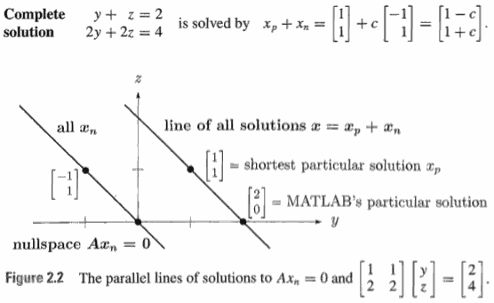

<h2 id="fb0727e770a06722aa7b9d64a9b6af91"></h2>


### Echelon Form(梯形) *U* and Row Reduced Form *R*

We start by simplifying this 3 by 4 matrix, first to U and then further to R:

```
    | 1  3 3 2|
A = | 2  6 9 7|
    |-1 -3 3 4|
```

The pivot a₁₁ = 1 is nonzero. The usual elementary operations will produce zeros in the first column below this pivot. The bad news appears in column 2:

```
     | 1 3 3 2|
A -> | 0 0 3 3|
     | 0 0 6 6|
```

The candidate for the second pivot has become zero: *unacceptable*. 

We look below to carry out a row exchange. In this case the entry below it is also zero. If A were square, this would signal that the matrix was singular. 

With a rectangular matrix, we must expect trouble anyway, and there is no reason to stop. All we can do is to go on to the next column, where the pivot entry is 3. Eventually we arrive at Echelon matrix U:

```
     | 1 3 3 2|
U -> | 0 0 3 3|
     | 0 0 0 0|
```

Strictly speaking, we proceed to the fourth column. A zero is in the third pivot position, and nothing can be done. U is upper triangular, but its pivots are not on the main diagonal. The nonzero entries of U have a "staircase pattern," or echelon form. 

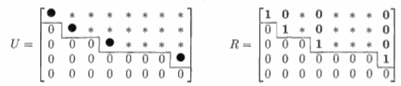  
***Figure 2.3***

We can always reach this echelon form U, with zeros below the pivots:

 1. The pivots are the first nonzero entries in their rows.
 2. Below each pivot is a column of zeros, obtained by elimination.
 3. Each pivot lies to the right of the pivot in the row above. This produces the staircase pattern, and zero rows come last.
 
***A = LU*** is still available

```
    | 1 0 0 |
L = | 2 1 0 |
    |-1 2 1 |
```

The only operation not required by our example, but needed in general, is row exchange by a permutation matrix P.

Here is *PA = LU* for all matrices:

 - **2B:** For any m by n matrix A there is a permutation P, a lower triangular L with unit diagonal, and an m by n echelon matrix U, such that *PA = LU*

*Now comes* ***R***. We can go further than U, to make the matrix even simpler. Divide the second row by its pivot 3, so that ***all pivots are 1***. Then use the pivot row to produce ***zero above the pivot*** (This time we subtract a row from *a higher row*). The final result (the best form we can get) is the ***reduced row echelon form R*** :

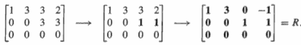

This matrix R is the final result of elimination on A. MATLAB would use the command **R = rref (A)**. Of course rref(R) would give R again!

If A is a square invertible matrix , in that case , rref(R) is *identity matrix*.  ***rref (A) = I***, when A is invertible.

**reduced row echelon form have the same null space as the original matrix**.


For a 5 by 8 matrix with four pivots, Figure 2.3 shows the reduced form R. **It still contains an identity matrix, in the four pivot rows and four pivot columns**. 

 - From R we will quickly find the nullspace of A. 
 - *Rx = 0* has the same solutions as *Ux = 0* and *Ax=0*

<h2 id="1e32c695f24ac4d5108ba9cca53ac86a"></h2>


### Pivot Variables and Free Variables

Our goal is to read off all the solutions to Rx = 0. The pivots are crucial:

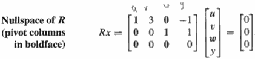

 - The unknowns u, v, w, y go into two groups.
 - One group contains the ***pivot variables***, those that correspond to ***columns with pivots***.
 - The other group is made up of the ***free variables***, corresponding to ***columns without pivots***.

To find the most general solution to Rx = 0 (or, equivalently, to Ax = 0) we may ***assign arbitrary values to the free variables***. Suppose we call these values simply v and y. The pivot variables are completely determined in terms of v and y:

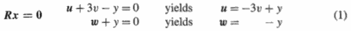

There is a "double infinity" of solutions, with v and y free and independent. The complete solution is a combination of two **special solutions**:

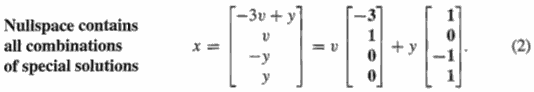

The special solution (-3, 1, 0, 0) has free variables v = 1, y = 0. The other special solution (1, 0, -1, 1) has v = 0 and y = 1. All solutions are *linear combinations of these two*. The best way to find all solutions to Ax = 0 is from the special solutions:

 1. After reaching Rx = 0, identify the pivot variables and free variables
 2. Give one free variable the value 1, set the other free variables to 0, and solve Rx = 0 for the pivot variables. This x is a special solution.
 3. Every free variable produces its own "special solution" by step 2. The combinations of special solutions form the nullspace-all solutions to Ax = 0.

Within the 4-dimensional space of all possible vectors x, the solutions to Ax = 0 form a 2-dimensional subspace-the nullspace of A. In the example, N(A) is generated by the special vectors (-3, 1, 0, 0) and (1, 0, -1, 1). The combinations of these two vectors produce the whole nullspace.

Here is a little trick. The special solutions are especially easy from R. The numbers 3 and 0 and -1 and 1 lie in the "nonpivot columns" of R. **Reverse their signs to find the pivot variables** (not free) **in the special solutions**. I will put the two special solutions from equation (2) into a nullspace matrix N, so you see this neat pattern:

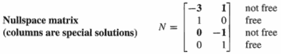

The free variables have values 1 and 0 (formed in identity). 
 
This is the place to recognize one extremely important theorem. Suppose a matrix has more columns than rows, n > m. Since m rows can hold at most m pivots, there must be at least n - m free variables. There will be even more free variables if some rows of R reduce to zero; but no matter what, at least one variable must be free. This free variable can be assigned any value, leading to the following conclusion:

 - **2C:** If Ax ***=0*** has more unknowns than equations (n > m), it has at least one special solution: There are more solutions than the trivial x=0.

There must be infinitely many solutions, since any multiple cx will also satisfy A(cx) = 0. *The nullspace has the same "dimension" as the number of free variables and special solutions.*

This central idea-the ***dimension*** of a subspace-is made precise in the next section. We count the free variables for the nullspace. We count the pivot variables for the column space!

<h2 id="0aa8bb162b1e64c4edd71e634be16382"></h2>


### Solving Ax = b, Ux = c, and Rx = d

The case b≠0 is quite different from b = 0. The row operations on A must act also on the right-hand side (on b). 

We begin with letters (b1, b2, b3) to find the solvability condition - for b to lie in the column space. Then we choose b = (1, 5, 5) and find all solutions x.

For the original example Ax = b = (b1, b2, b3), apply to both sides the operations that led from A to U. The result is an upper triangular system Ux = c:

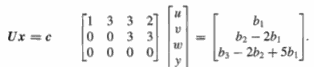   (3)
 
Start now with Ux = c.   c is just L⁻¹b.

It is not clear that these equations have a solution. The third equation is very much in doubt, because its left-hand side is zero. The equations are inconsistent unless b3 - 2b2 + 5b1 = 0. Even though there are more unknowns than equations, there may be no solution. 

We know another way of answering the same question: Ax = b can be solved if and only if b lies in the column space of A. This subspace comes from the four columns of A (not of U!):

```
    | 1  3 3 2|
    | 2  6 9 7|
    |-1 -3 3 4|
```

Even though there are four vectors, their combinations only fill out a plane in three- dimensional space. Column 2 is three times column 1. The fourth column equals the third minus the first. *These dependent columns, the second and fourth, are exactly the ones without pivots.*

The column space C(A) can be described in two different ways. On the one hand, it is the plane generated by columns 1 and 3. The other columns lie in that plane, and contribute nothing new. Equivalently, it is the plane of all vectors b that satisfy b3 - 2b2 + 5b1 = 0; this is the constraint if the system is to be solvable. ***Every column satisfies this constraint, so it is forced on b!*** Geometrically, we shall see that the vector (5, -2, 1) is perpendicular to each column.
 
If b belongs to the column space, the solutions of Ax = b are easy to find. The last equation in Ux = c is 0 = 0. To the free variables v and y, we may assign any values, as before. The pivot variables u and w are still determined by back-substitution. For a specific example with b3 - 2b2 + 5b1 = 0, choose b = (1, 5, 5):

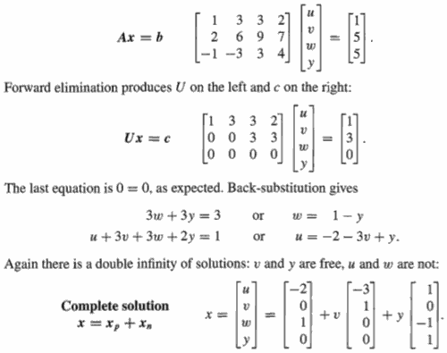  
(4)

***Every solution to Ax = b is the sum of one particular solution and a solution to Ax = 0:***

`X_complete = X_particular + X_nullspace`

The particular solution in equation (4) comes from solving the equation with *all free variables set to zero*. That is the only new part, since the nullspace is already computed. When you multiply the highlighted equation by A, you get Axcompiete = b + 0.

Geometrically, the solutions again fill a two-dimensional surface - but it is not a subspace. It does not contain x = 0. It is parallel to the nullspace we had before, shifted by the particular solution xP as in Figure 2.2. Equation (4) is a good way to write the answer:

 1. Reduce Ax = b to Ux = c.
 2. With free variables = 0, find a particular solution to Ax_p = b and Ux_p = c.
 3. Find the special solutions to Ax = 0 (or Ux = 0 or Rx = 0). Each free variable, in turn, is 1. Then x = x_p + (any combination x_n of special solutions).

When the equation was Ax = 0, the particular solution was the zero vector!

**Question**: How does the reduced form *R* make this solution even clearer? 

While producing Rx = d from Ux = c , these operations change c = (1, 3, 0) to a new vector d = (-2, 1, 0):

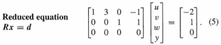

Our particular solution xp (**one choice out of many**) has free variables v = y = 0. Columns 2 and 4 can be ignored. Then we immediately have u = -2 and w = 1, exactly as in equation (4). **The entries of d go directly into x_p.**  This is because the identity matrix is sitting in the pivot columns of R!

```
| 1 0 |·|u| = |-1|
| 0 1 | |w|   | 1|
```

Elimination reveals the pivot variables and free variables. ***If there are r pivots, there are r pivot variables and n - r free variables***. That important number r will be given a name-it is the ***rank of the matrix***.

**2D:**

 - Suppose elimination reduces Ax = b to Ux = c and Rx = d, with r pivot rows and r pivot columns. ***The rank of those matrices is r***. The last m - r **rows** of U and R are zero, so there is a solution only if the last m - r *entries of c and d* are also zero.
 - The complete solution is x =x_p + x_n. One particular solution x_p has all free variables zero. Its pivot variables are the first r entries of d, so Rx_p= d.
 - The nullspace solutions x are combinations of n - r special solutions, with one free variable equal to 1. The pivot variables in that special solution can be found in the corresponding column of R (with sign reversed).
 
You see how the rank r is crucial. It counts the pivot rows in the "row space" and the pivot columns in the column space. There are *n - r special solutions* in the nullspace. There are *m - r solvability conditions* on b or c or d.

good example in page 84.


<h2 id="176eb4a957bc2a4950033ca9e1ec5ede"></h2>


### 满秩

满秩          |  列满秩      |   行满秩    |  一般
--- | --- | --- | ---
r=m=m     |  r = n < m      |   r = m < n    |  r < m, r < n
R = I    |  \| I \|      |   R=\|I F\|    |    \| I  F\|
 －     |      \|0\|       |                  |          \|0 0\|
唯一解   |    0 或 1解  |    ∞ 解       |   0 或 ∞ 解 


<h2 id="42daec4d086da007d1b961361ec0814f"></h2>


## 2.3 LINEAR INDEPENDENCE, BASIS, AND DIMENSION

矩阵中，非独立的行/列, 对于解  Ax = 0 毫无影响。

The important number that is beginning to emerge (the true size) is the ***rank r***. The rank was introduced as the number of pivots in the elimination process. Equivalently, the final matrix U has r nonzero rows. The rank counts the number of genuinely independent rows in the matrix A.

The goal of this section is to explain and use four ideas:

 1. Linear independence or dependence.
 2. Spanning a subspace.
 3. Basis for a subspace (a set of vectors).
 4. Dimension of a subspace (a number).
 
The first step is to define ***linear independence***. 

**2E**: Suppose c₁v₁ + ... + ckvk = 0 only happens when c₁ = ... = ck = 0. Then the vectors v₁, ... , vk are ***linearly independent***. If any c's are nonzero. the v's are ***linearly dependent***. One vector is a combination of the others.

Linear dependence is easy to visualize in three-dimensional space, when all vectors go out from the origin. Two vectors are dependent if they lie on the same line. *Three vectors are dependent if they lie in the same plane*. A random choice of three vectors, without any special accident, should produce linear independence (not in a plane). Four vectors are always linearly dependent in **R³**.

***The columns of A are independent exactly when N (A) = {zero vector}.***

**2F**: The r nonzero rows of an echelon matrix U and a reduced matrix R are linearly independent. So are the r columns that contain pivots.

To check any set of vectors v₁.... , vn for independence, put them in the columns of A. Then solve the system Ac = 0.

**2G**: A set of n vectors in Rᵐ must be linearly dependent if n > m.

Because as a disguised from 2C:  Every m by n system Ax = 0 has nonzero solutions if n > m.

<h2 id="bc14e48a52e7371d448ce8db40cccf14"></h2>


### Spanning a Subspace

Now we define what it means for a set of vectors to span a space. The column space of A is spanned by the columns. **Their combinations produce the whole space:**

**2H**: If a vector space V consists of all linear combinations of w₁, ..., wl, then these vectors span the space. Every vector v in V is some combination of the w's: **Every v comes from w's**. v = c₁w₁ + ... + clwl, for some coefficients cᵢ.

The column space of A is exactly ***the space that is spanned by its columns***. The row space is spanned by the rows. Multiplying A by any x gives a combination of the columns; it is a vector Ax in the column space.

<h2 id="9702e33bd5c5df4fb7ee415a1ab6e26f"></h2>


### Basis for a Vector Space

 - To decide if b is a combination of the columns, we try to solve Ax = b. 
 - To decide if the columns are independent, we solve Ax = 0. 

***Spanning involves the column space, and independence involves the nullspace***. 

The coordinate vectors e₁, ... , en span **Rⁿ** and they are linearly independent. Roughly speaking, ***no vectors in that set are wasted***. This leads to the crucial idea of a ***basis***.

**2I**: A ***basis for V*** is a sequence of vectors having two properties at once:

 1. The vectors are linearly independent (not too many vectors).
 2. They span the space V (not too few vectors).
 
This combination of properties means that every vector in the space is a combination of the basis vectors, because they span. It also means that the combination is **unique**: If v = a₁v₁ + ... + akvk and also
v = b₁v₁ + ... + bkvk, then subtraction gives 0 = ∑(aᵢ-bᵢ)vᵢ. (不同基组合可以得到相同的结果，但是只要确定了基，某一结果的组合就是唯一的。因为唯一，所以坐标系可以用来定位). ***There is one and only one way to write v as a combination of the basis vectors.***

We had better say at once that the coordinate vectors e₁, ... , en are not the only basis for **Rⁿ**. A vector space has ***infinitely many different bases***. 

Example 8: 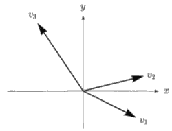

 - x-y plane in R²
 - A spanning set v₁, v₂, v₃, certainly span R², but are not independent.
 - Bases: v₁, v₂ and v₁, v₃ and v₂, v₃.

Example 9: 

```
     | 1 3 3 2|
U -> | 0 0 3 3|
     | 0 0 0 0|
```

These four columns span the column space of U, but they are not independent. There are many possibilities for a basis, but we propose a specific choice: ***The columns that contain pivots are a basis for the column space***. In this case the first and third, which correspond to the basic variables. These columns are independent, and it is easy to see that they span the space. In fact, the column space of U is just the x-y plane within R³. C(U) is *not the same as* the column space C(A) before elimination - but the number of independent columns didn't change.

To summarize: 

 - *The columns of any matrix span its column space.*
 - If they are independent, they are a basis for the column space
    - whether the matrix is square or rectangular.
 - If we are asking the columns to be a basis for the whole space Rⁿ, then the matrix must be ***square*** and ***invertible***. 


<h2 id="277acc5b1627dc1a1e613976782c994b"></h2>


### Dimension of a Vector Space

**2J**: Any two bases for a vector space **V** contain the same number of vectors. This number. which is shared by all bases and expresses the number of "degrees of freedom" of the space, is the ***dimension*** of **V**.

**2K**: If v₁, ... , vm and w₁, ... , wn are both bases for the same vector space, then m=n, The number of vectors is the same.

*In a subspace of dimension k, no set of more than k vectors can be independent, and no set of fewer than k vectors can span the space.*
 
You must notice that the word "dimensional" is used in two different ways. 

 - We speak about a four-dimensional ***vector***, meaning a vector in **R⁴**. 
 - Now we have defined a four-dimensional ***subspace***;
    - an example is the set of vectors in **R⁶** whose first and last components are zero. 
    - The members of this four-dimensional subspace are six- dimensional ***vectors*** like (0, 5, 1, 3, 4, 0). 
    
We never use the terms "basis of a matrix" or "rank of a space" or "dimension of a basis." These phrases have no meaning. It is the ***dimension of the column space*** that equals the ***rank of the matrix***, as we prove in the coming section.

 - 基向量的个数，就是列空间C(A)的维数 (注意维数是空间的属性)

<h2 id="a1e826e3adda502b8e640e95e34a88d8"></h2>


## 2.4 THE FOUR FUNDAMENTAL SUBSPACES

Subspaces can be described in two ways:

 1. First, we may be given a set of vectors that span the space.
    - Example: The columns span the column space. 
    - such description may include useless vectors (dependent columns)
 2. Second, we may be told which conditions the vectors in the space must satisfy.
    - Example: The nullspace consists of all vectors that satisfy Ax = 0. 
    - such description may include repeated conditions (dependent rows) ?

When elimination on A produces an echelon matrix U or a reduced R, we will find a basis for each of the subspaces associated with A. Then we have to look at the extreme case of **full rank**:

*When the rank is as large as possible, r = n or r = m or r = m = n, the matrix has a left-inverse B or a right-inverse C or a two-sided A⁻¹*.

**4 subspaces in full rank**:

 1. The ***column space*** of A is denoted by C(A). Its dimension is the rank *r*.
 2. The ***nullspace*** of A is denoted by N(A). Its dimension is *n-r*.
 3. The ***row space*** of A is the column space of Aᵀ. It is C(Aᵀ), and it is spanned by the rows of A. Its dimension is also *r*.
 4. The ***left nullspace*** of A is the nullspace of Aᵀ. It contains all vectors y such that Aᵀy = 0, and it is written N(Aᵀ). Its dimension is *m-r* .

If A is an m by n matrix, you can see which "host" spaces contain the four subspaces by looking at the number of components:

 - The nullspace N(A) and row space C(Aᵀ) are subspaces of **Rⁿ**.
 - The left nullspace N(Aᵀ) and column space C(A) are subspaces of **Rᵐ**.
 
The rows have *n* components and the columns have *m*. For a simple matrix like:

```
A = U = R = |1 0 0|
            |1 0 0|
```

The column space is the line through [1 0]ᵀ, the row space is the line through [1 0 0]ᵀ. It is in **R³**. The nullspace is a plane in **R³** and the left nullspace is a line in **R²**:

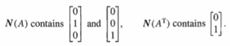

Note that all vectors are column vectors. Even the rows are transposed, and the row space of A is the *column space* of Aᵀ. Our problem will be to connect the four spaces for U (after elimination) to the four spaces for A:

```
    | 1 3 3 2|                  | 1  3  3  2|
U = | 0 0 3 3|  came from   A = | 2  6  9  7|.
    | 0 0 0 0|                  |-1 -3  3  4|
```

For novelty, we take the four subspaces in a more interesting order.

 - 3 **The row space of A**
    - For an echelon matrix like U, the row space is clear. A similar rule applies to every echelon matrix U or R, with r pivots and r nonzero rows: ***The nonzero rows are a basis, and the row space has dimension r.***
    - The row space of A has the same dimensions as the row space of U, and it has the same bases, because the ***row spaces of A and U (and R) are the same***.
        - The reason is that each elementary operation leaves the row space unchanged.
        - The rows in U are combinations of the original rows in A. The rows of A can be recovered from U. It is true that A and U have different rows, but the combinations of the rows are identical: same space!

 - 2 **The nullspace of A**
    - Elimination simplifies a system of linear equations without changing the solutions. The system Ax = 0 is reduced to Ux = 0, and this process is reversible.
    - ***The nullspace of A is the same as the nullspace of U and R***.
    - Choosing the n - r "special solutions" to Ax = 0 provides a definite basis for the nullspace:
    - The nallspace has dimension *n-r*. The 'special solutions" are a basis - each tree yariablc is given the value 1. while the other free variables are 0. 
    - The nullspace is also called the *kernel* of A, and its dimension *n-r* is the *nullity*.

 - 1 **The column space of A**
    - The column space is sometimes called the **range**. x is in the domain and f (x) is in the range. In our case the function is f (x) = Ax. 
    - Our problem is to find bases for the column spaces of U and A. ***Those spaces are different*** (just look at the matrices!) but their dimensions are the same.
        - The first and third columns of U are a basis for its column space. They are the ***columns with pivots***.
        - ***The pivot columns of A are a basis for its column space.***
    - *If a set of columns of A is independent, then so are the corresponding columns of U, and vice versa.*
    - The dimension of the column space C(A) equals the rank r, which also equals the dimension of the row space: ***The number of independent columns equals the number of independent rows***. 
        - **row rank = column rank!** This is one of the most important theorems in linear algebra.
        - pivots shared by row and column ?

 - 4 **The left nullspace of A** (= the nullspace of Aᵀ)
    - Aᵀy = 0 means yᵀA = 0, this is why called "left nullspace"
    - If A is an m by n matrix, then Aᵀ is n by m.  Its, Aᵀ, nullspace is a subspace of **Rᵐ**; the vector y has m components.
    - For any matrix, ***the number of pivot variables + the number of free variables must match the total number of columns***. In other words, rank plus nullity equals n:
        - ***dimension of C(A) + dimension of N(A) = number of columns.*** 
    - So r + dimension (N(Aᵀ)) = m. The left nullspace N(Aᵀ) has dimension m-r.
    - The m - r solutions to yᵀA = 0 are hiding somewhere in elimination. The rows of A combine to produce the m-r zero rows of U.
    

<h2 id="10fabddaa26f740c259e8adcfd5e32d4"></h2>


### Summarize

Fundamental Theorem of Linear Algebra, Part I

 1. C(A)  = column space of A; dimension r
 2. N(A)  = nullspace of A; dimension n-r
 3. C(Aᵀ) = row space of A; dimension r
 4. N(Aᵀ) = left nullspace of A; dimension m-r

**Example**:

```
A = |1 2|  , has m = n = 2, and rank r = 1.
    |3 6|
```

 1. The column space contains all multiples of [1 3]ᵀ
 2. The nullspace contains all multiples of [-2 1]ᵀ 
    - This vector satisfies Ax = 0.
 3. The row space contains all multiples of [1 2]ᵀ
    - write it as a column vector, since strictly,speaking it is in the column space of Aᵀ
 4. The left nullspace contains all multiples of y = [-3 1]ᵀ

---

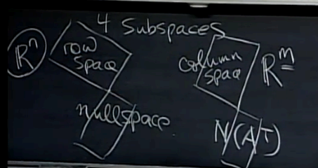


<h2 id="f934c3a267dc016627d494171b3c77c7"></h2>


### Existence of Inverses

From the rank of a matrix, it is easy to decide which matrices actually have these inverses. Roughly speaking, ***an inverse exists only when the rank is as large as possible***.

 - The rank always satisfies r ≤ m and also r ≤ n. 
 - We want to prove that when r = m there is a right-inverse, and Ax = b always has a solution. When r = n there is a left-inverse, and the solution (**if it exists**) is unique.
 - Only a square matrix can have both r = m and r = n, and therefore only a square matrix can achieve both existence and uniqueness.
    - Only a square matrix has a two-sided inverse.

**2Q** 

 - **EXISTENCE: Full row rank r = m**.
    - x = b has ***at least*** one solution x for every b if and only if the columns span **Rᵐ**.
    - Then A has a **right-inverse** C such that AC=I(mxm)
    - This is possible onh if in < rt
    - The number of solutions  is 1 or ∞.
 - **UNIQUENESS: Full column rank r = n**.
    - Ax = b has ***at most*** one solution x for every b if and only if the columns are linearly independent.  
    - Then A has an nxm **left-inverse** B such that BA = I(nxn).
    - This is possible only if m > n
    - The number of solutions is 0 or 1.

**One-sided inverses**:

```
B = (AᵀA)⁻¹Aᵀ and C = Aᵀ(AAᵀ)⁻¹
```

Certainly BA = I and AC = I.  AᵀA does have an inverse if the rank is n, and AAᵀ has an inverse when the rank is m. 

**Example2**:         

```
A = |4 0 0|
    |0 5 0|
```

Since r=m=2, the theorem guarantees a right-inverse C:

```
A = |4 0 0|·|1/4   0 | = |1 0|
    |0 5 0| |0    1/5|   |0 1|    
            |C₃₁  C₃₂|
```

There are many right-inverses because the last row of C is completely arbitrary. This is a case of existence but not uniqueness. 

The matrix A has no left-inverse because the last column of BA is certain to be zero (not **I**) .

The specific right-inverse C = Aᵀ(AAᵀ)⁻¹ chooses C₃₁ and C₃₂ to be zero, This is the *pseudoinverse*.

When a square matrix if **full rank**:

 1. The columns span **Rⁿ**, so Ax = b has at least one solution for every b.
 2. The columns are independent, so Ax = 0 has only the solution x = 0.
    - This list can be made much longer, especially if we look ahead to later chapters. Every condition is equivalent to every other, and ensures that A is invertible.
 3. The rows of A span **Rⁿ**.
 4. The rows are linearly independent.
 5. Elimination can be completed: PA = LDU, with all n pivots.
 6. The determinant of A is not zero.
 7. Zero is not an eigenvalue of A.
 8. AᵀA is positive definite.


<h2 id="e9da9069b202c4de3612d6edae5b5d07"></h2>


### Matrices of Rank 1
  
One basic theme of mathematics is, given something complicated, to show how it can be broken into simple pieces. For linear algebra, the simple pieces are matrices of ***rank 1***:

```
    | 2  1  1 |
A = | 4  2  2 |   , has r=1
    | 8  4  4 |
    |-2 -1 -1 |
```

We can write the whole matrix as the product of a column vector and a row vector:

```
                | 2  1  1 |   | 1|·|2 1 1|
A = (col)(row) =| 4  2  2 | = | 2|
                | 8  4  4 |   | 4|
                |-2 -1 -1 |   |-1|
```

 - ***Every matrix of rank 1 has the simple form A = uvᵀ = column x row.***

The row space and column space are lines-the easiest case.

<h2 id="734ef82f504a5a0b7c94fe20dcc0135c"></h2>


## 2.5 GRAPHICS NETWORKS

 - ***incidence matrices of graphs***
    - every entry is 1, -1, or 0. 
    
This section is *optional*, but it gives a chance to see rectangular matrices in action - and how the square symmetric matrix AᵀA turns up in the end.

 - A ***graph*** consists of a set of vertices or *nodes*, and a set of *edges* that connect them. 
 - The graph in Figure 2.6 has 4 nodes and 5 edges. It does not have an edge between nodes1 and 4 
    - (and edges from a node to itself are forbidden). 
 - This graph is directed, because of the arrow in each edge.
 
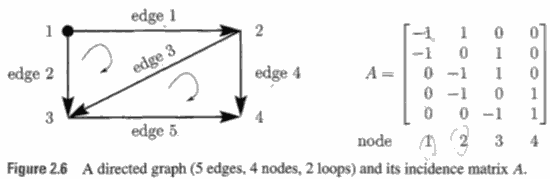

 - The ***edge-node incidence matrix*** is 5x4
    - with a row for every edge. 
 - ***If the edge goes from node j to node k, then that row has -1 in column j and +1 in column k.*** 
    - Row 1 shows the edge from node 1 to node 2. 
    - Row 5 comes from the fifth edge, from node 3 to node 4.
    
 - Notice the columns of A. Column 3 gives information about node 3 - it tells which edges enter and leave. 
    - Edges 2 and 3 go in, 
    - Edge 5 goes out (with the minus sign). 

A is sometimes called the *connectivity* matrix, or the *topology* matrix. When the graph has m edges and n nodes, A is m by n (and normally m > n). Its transpose is the *"node-edge" incidence matrix*.

Each of the four fundamental subspaces has a meaning in terms of the graph. 

We can do linear algebra, or write about voltages and currents. We do both!


**Nullspace** of A:the answer comes from elimination, but here it comes at a glance. The columns add up to the zero column. The nullspace contains x = (1, 1, 1, 1), since Ax = 0. 

This has a meaning if we think of x1, x2, x3, x4 as the ***potentials*** (the voltages) ***at the nodes***. The five components of Ax (rows) give the ***differences*** in potential across the five edges. 

The difference across edge 1 is x2 - x1, from the ±1 in the first row. 

The equation Ax = b asks: Given the differences b1.... , b5, find the actual potentials x1, ... , x4. But that is impossible to do! We can raise or lower all the potentials by the same constant c, and the differences will not change - confirming that x = (c, c, c, c) is in the nullspace of A.  Those are the only vectors in the nullspace, since Ax = 0 means equal potentials across every edge. The nullspace of this incidence matrix is one-dimensional. The ***rank is 4 - 1 = 3***.

**TODO**

<h2 id="aa8fafd1a0c4fb58a6ba9373adaf258f"></h2>


## 2.6 LINEAR TRANSFORMATIONS

 - Notes：
 - 在线性空间中的选定基之后, 向量刻画对象, 矩阵刻画对象的运动，用矩阵与向量的乘法 施加运动
 - 在一个线性空间V里的一个线性变换T, 当选定一组基之后，就可以表示为矩阵 ?
 - 线性变换，就是从一个线性空间V的某一个点, 跃迁到 另一个线性空间W的另一个点的运动
     - 这句话里蕴含着一层意思，就是说一个点不仅可以变换到同一个线性空间中的另一个点，而且变换到另一个线性空间中的另一个点去
     - 不管你怎么变，只要变换前后都是线性空间中的对象，这个变化就一定是线性变换，也就一定可以用一个非奇异矩阵来描述 ； 而你用一个非奇异矩阵去描述一个变换，一定是一个线性变换。
 - 最后，我们把矩阵的定义完善如下: 矩阵是线性空间中的 线性变换的 一个**描述**。
     - 注意，这里用的是 **描述**, 因为同一个线性变换可以有多个描述。
     - 好比，给人A拍照，只要选定一个镜头位置，这张照片就是A的一个描述，但只是一个片面的描述；换个镜头位置，可以得到另一个不同的描述; 所有的照片都是同一个人的描述，但是由都不是A本身
 - 同样的, 对一个线性变换，只要你选定一组基，那么就可以找到一个矩阵来描述这个线性变换。换一组基，就得到一个不同的矩阵。 所有这些矩阵都是这同一个线性变换的描述，但又都不是线性变换本身。
 - 若矩阵 A 与 B 是同一个线性变化的两个不同的描述，则一定能找到一个非奇异矩阵 P , 是的 A，B之间满足:
     - `A = P⁻¹BP`
     - 所以相似矩阵, 就是同一个线性变换 的不同的描述矩阵
     - 矩阵P, 其实就是A矩阵所基于的基，与 B矩阵所基于的基， 这两组基之间的一个变换关系。
 - \*\*\*\*\*\*\*\*
 - 矩阵不仅可以作为线性变换的描述，而且可以作为一组基的描述。 
     - 不仅可以把线性空间中的一个点，变换到另一个点去，也能把线性空间中的一个坐标系（基）变换到另一个坐标系（基）去。而且变换点与坐标系，具有异曲同工的效果。
 - **运动等价于 坐标系变换 ，或, 对象的变换等价于坐标系的变换 , 或, 固定坐标系下，一个对象的变换，等价于固定对象所处的坐标系的变换。**
 - Ma = b 
     - 向量a ,经过矩阵M所描述的变换，变成了向量b
     - 有一个向量，它在坐标系M的度量下得到的度量结果是a ，那么它在坐标系 I 的度量下，结果是b : `Ma = Ib`
     - 在M为坐标系的意义下，`Ma` 这种形式，我们可以认为这是 **对向量a的一个环境声明。**
     - 注意到, M矩阵表示的坐标系，由一组基组成。那组基由向量构成，同样存在这组向量是在哪个坐标系下度量而成的问题。所以 M其实是 IM, 也就是说，M中的那组基的度量是在 I坐标系中得出来的。 从这个视角来说， MxN 也不是什么矩阵乘法，而是声明了一个 在M坐标系中量出的另一个坐标系 N , 其中，M本身是在 I 坐标系中度量出来的。
 - 对坐标系施加变化的办法，就是让 表示那个坐标系的矩阵 与表示那个变化的矩阵相乘。 ( 变换x坐标 ? )
     - 再一次 MxN
     - 一方面表示 坐标系N 在 运动 M 下的变换结果
     - 另一方面, 在M坐标系度量下，有另一个坐标系 N。 这个坐标系 N 如果放在 I坐标系中度量，其结果为 坐标系 MxN
      


---

 - We know how a matrix moves subspaces around when we multiply by A.
    - The nullspace goes into the zero vector. 
        - A=[1 1 ; 2 2 ]
        - A*[1 ; 2] = [3;6]
        - A*[1 ;-1] = [0;0]
    - All vectors go into the column space, since Ax is always a combination of the columns. 
    
You will soon see something beautiful - that A takes its row space into its column space, and on those spaces of dimension r it is 100 percent invertible. That is the real action of A. It is partly hidden by nullspaces and left nullspaces, which lie at right angles and go their own way (toward zero). ???

Suppose A is n by n , x is an n-dimensional vector. When A multiplies x, it transforms that vector into a new vector Ax. The whole space is transformed, or "mapped into itself," by the matrix A.

Four transformations that come from matrices:

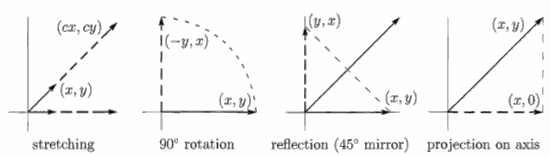

```
A1= |c 0| , A2= |0 -1| , A3= |0 1| , A4= |1 0|
    |0 c|       |1  0|       |1 0|       |0 0|
```

 1. A multiple of the identity matrix, A = cI. ***stretches*** every vector by the same factor c. The whole space expands or contracts (收缩, or somehow goes through the origin and out the opposite side, when c is negative).
 2. A ***rotation*** matrix turns the whole space around the origin. This example turns all vectors through 90° transforming every point (x, y) to (-y, x).
 3. A reflection matrix transforms every vector into its image on the opposite side of a mirror. 
    - In this example the mirror is the 45° line y = x, and a point like (2, 2) is unchanged. 
    - A point like (2, -2) is reversed to (-2, 2). 
    - On a combination like v = (2, 2) + (2, -2) = (4, 0), the matrix leaves one part and reverses the other part. The output is A =_(2, 2) + (-2, 2) = (0, 4).
    - That reflection matrix is also a permutation matrix! It is algebraically so simple, sending (x, y) to (y, x), that the geometric picture was concealed. 
 4. A ***projection*** matrix takes the whole space onto a lower-dimensional subspace (not invertible). The example transforms each vector (x, y) in the plane to the nearest point (x, 0) on the horizontal axis. That axis is the column space of A. The y-axis that projects to (0, 0) is the nullspace.


It is also important to recognize that matrices cannot do everything, and some transformations T(x) are *not possible* with Ax:

 1. It is impossible to move the origin, since A0 = 0 for every matrix.
 2. If the vector x -> x', then 2x must -> 2x'. 
    - In general cx must go to cx', since A(cx) = c(Ax).
 3. If the vectors x,y -> x',y', then  x + y must -> x' + y'
    - since A(x + y) = Ax + Ay.

Those rules can be combined into one requirement:

```
A(cx+dy) =c(Ax)+d(Ay)   (1)
```

Every transformation *T(x)* that meets this requirement is a ***linear transformation***.

Any matrix leads immediately to a linear transformation. Also, every linear transformation lead to a matrix.


 - Most transformations are not linear -- for example, 
    - to square the polynomial (Ap = p²)
    - or to add 1 (Ap = p + 1)
    - or to keep the positive coefficients (A(t - t²) = t). 
 - It will be linear transformations, and only those, that lead us back to matrices.

Linearity has a crucial consequence: ***If we know Ax for each vector in a basis, then we know Ax for each vector in the entire space***.

```
Linearity If x = c₁x₁ + ... + cnxn then 
            Ax = c₁(Ax₁) + ... + cn(Axn).   (4)
```

 - 我们平时说向量x, 是指在单位矩阵中，基的一个坐标 的向量表示

**Example 4**:

What linear transformation takes x₁ and x₂ to Ax₁, and Ax₂?

```
                     |2|                         |4|
x₁= |1|  goes to Ax₁=|3|;   x₂= |0|  goes to Ax₂=|6|;  
    |0|              |4|        |1|              |8|
```

It must be multiplication T(x) = Ax by the matrix:

```
    |2 4|
A = |3 6|
    |4 8|
```

Starting with a different basis (1, 1) and (2, -1), this same A is also the only linear transformation with:

```
        | 6|                |0|
A·|1| = | 9|  and A·| 2| =  |0|
  |1|   |12|        |-1|    |0|
```

---

Next we find matrices that represent differentiation and integration. ***First we must decide on a basis***. For the polynomials of degree 3 there is a natural choice for the four basis vectors:


**Basis for P₃**:  p₁=1, p₂=t , p₃=t², p₄=t³

That basis is not unique (it never is), but some choice is necessary and this is the most convenient. The derivatives of those four basis vectors are 0, 1, 2t, 3t²:

***Action of d/dt***:  Ap₁ = 0, Ap₂ = p₁, Ap₃ = 2p₂ Ap₄ = 3p₃  (5)

"d/dt" is acting exactly like a matrix, but which matrix? Suppose we were in the usual 4-dimensional space with the usual basis - the coordinate vectors p₁ = (1, 0, 0, 0), p₂ = (0, 1, 0, 0), p₃ = (0, 0, 1, 0), p₄ = (0, 0, 0, 1). The matrix is decided by equa- tion (5):


```
        |0 1 0 0|
Adiff = |0 0 2 0|
        |0 0 0 3|
        |0 0 0 0|
```

 - Ap₁ is its first column, which is zero.
 - Ap₂ is the second column, which is p₁.
 - Ap₃ is 2p₂, and Ap₄ is 3p₃
 - The nullspace contains p₁ (the derivative of a constant is zero).
 - The column space contains p₁, p₂, p₃ (the derivative of a cubic is a quadratic).
 - The derivative of a combination like p = 2 + t - t² - t³ is decided by linearity

The matrix can differentiate that p(t), because matrices build in linearity!

```
             |0 1 0 0| | 2|   | 1|
dp/dt = Ap = |0 0 2 0|·| 1| = |-2|  -> 1 - 2t - 3t²
             |0 0 0 3| |-1|   |-3|
             |0 0 0 0| |-1|   | 0|
```

In short, ***the matrix carries all the essential information***. If the basis is known, and the matrix is known, then the transformation of every vector is known.

The coding of the information is simple. To transform a space to itself, one basis is enough. A transformation from one space to another requires a basis for each(输入空间 和 输出空间 可以用相同的基，也可以用不同的基).

**2U**: Suppose the vectors x₁,…, xn , arc a basis for the space V, and vectors y₁,…,ym, are a basis for W. Each linear transformation T from V to W is representeed by it matrix A. 

The jth column is found by applying T to the jth basis vector `xⱼ`, and writing `T(xⱼ)` as a combination of the y’s:

```
Column j of A:  T(xⱼ)= Axⱼ = a₁ⱼy₁ + a₂ⱼy₂ + … + a_mⱼ·ym  (6)
```

 

 - 如何发现隐藏在一个 linear transmation 后面的 变换矩阵。 只要知道了 基的 linear transmation , 就能确定这个矩阵。
    - 特征向量基 是一组很好的基，it leads to 对角矩阵 Λ ， 对角线上都是特征值 。
 - 2U 解释了如何 确定变换矩阵的 列向量

TODO, Example


<h2 id="72e0a765ceae5f613d42b3da5afdedd9"></h2>


### Rotations Q, Projections P, and Reflections H

This section began with 90° rotations, projections onto the x-axis, and reflections through the 45° line. 

Their matrices were especially simple:

```
Q = |0 -1|   P = |1 0|   H = |0 1|
    |1  0|       |0 0|       |1 0|
```


Rotations through other angles, projections onto other lines, and reflections in other mirrors are almost as easy to visualize.   They are still linear transformations, provided that the origin is fixed: A0 = 0.

They *must* be represented by matrices. Using the natural basis [1 0]ᵀ and [0 1]ᵀ , we want to discover those matrices.

**1. Rotation**  

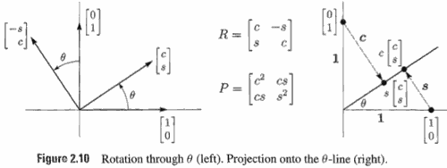

Figure 2.10 shows rotation through an angle θ. It also shows the effect on the 2 basis vectors.

 - The first one (1,0) goes to (cos θ, sin θ) , it lies on the "θ-line". 
    - we use c and s for cos θ and sin θ.
 - The second basis vector (0, 1) rotates into (-sin θ, cos θ). 
 - By rule (6), those numbers go into the columns of the matrix 
 - 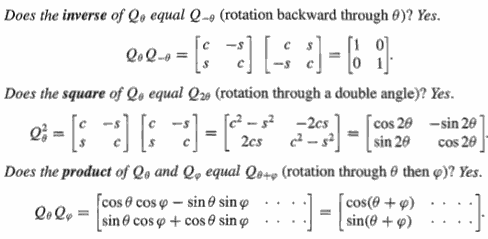
 - The last case contains the first two. 
    - The inverse appears when φ is -θ
    - the square appears when φ is +θ. 
 - All three questions were decided by trigonometric identities 
    - and they give a new way, to remember those identities. 

**2V** Suppose A and B are linear transformations from V to W and from U to V. Their product AB starts with a vector u in U, goes to Bu in V. and finishes with ABu in W. This "composition" AB is again a linear transformation (from U to
W). Its matrix is the product of the individual matrices representing A and B.


**2. Projection**

 - Figure 2.10 also shows the projection of (1, 0) onto the 6-line. 
    - The length of the projection is c = cos θ. 
    - Notice that the point of projection is not (c, s), we must multiply by c. 
 - Similarly the projection of (0, 1) has length s, and falls at s(c, s) = (cs, s²). 
    - That gives the second column of the projection matrix P:

```
Projection onto θ-line:  P = |c² cs|
                             |cs s²|
```

 - This matrix has no inverse, because the transformation has no inverse. 
 - Points on the perpendicular line (through zero vector) are projected onto the origin
    - that line is the nullspace of P. 
- Points on the θ-line are projected to themselves! 
- Projecting twice is the same as projecting once, and ***p² = P***:

```
P² = |c² cs|² = |c²(c²+s²) cs(c²+s²)| = P
     |cs s²|    |cs(c²+s²) s²(c²+s²)|
```
 
 - Of course c²+s² = cos²θ + sin²θ = 1
 - ***A projection matrix equals its own square***.


**3. Reflection**

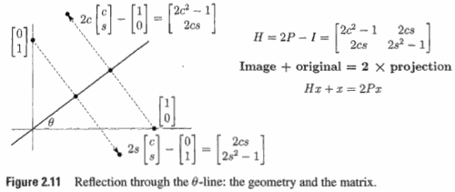


Figure 2.11 shows the reflection of (1, 0) in the θ-line. The length of the reflection equals the length of the original, as it did after rotation. The perpendicular line reverses direction; all points go straight through the mirror. Linearity decides the rest.

```
Reflection matrix   H = |2c²-1   2cs |
                        | 2cs   2s²-1|
```

This matrix H has the remarkable property H² = I. 

 - ***Two reflections bring back the original***.
    - A reflection is its own inverse, *H = H⁻¹* 
    - which is clear from the geometry but less clear from the matrix

One approach is through the relationship of reflections to projections: *H = 2P - I*. 

 - This means that Hx + x = 2Px
 - the image plus the original equals twice the projection. It also confirms that H² = I:
    - `H² = (2P-I)2² = 4P²-4P +I = I, since P²=P`

---

Other transformations Ax can increase the length of x; stretching and shearing are in the exercises. Each example has a matrix to represent it - which is the main point of this section. But there is also the question of choosing a basis, and we emphasize that the matrix depends on the choice of basis. Suppose the first basis vector is ***on the θ-line*** and the second basis vector is ***perpendicular***:

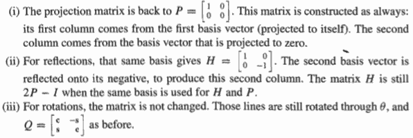

The goal is to make the matrix diagonal, as achieved for P and H. To make Q diagonal requires complex vectors, since all real vectors are rotated.

We mention here the effect on the matrix of a change of basis, while the linear transformation stays the same. 

 - The matrix A (or Q or P or H) is altered to ***S⁻¹AS***. 
 - Thus a single transformation is represented by different matrices (via different bases, accounted for by S). 

The theory of eigenvectors will lead to this formula S⁻¹AS, and to the best basis.


