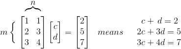

- [Preface](#5cf06822087ff10dec2ac74cf1e20d30)
    - [Web Pages](#f2864cfd076d07529c709b68323c5f0a)
    - [Structure of the Course](#651012eed3bc0d1a932a2738caba9457)

<h2 id="5cf06822087ff10dec2ac74cf1e20d30"></h2>

# Preface

*Linear algebra moves to `n` vectors in `m`-dimensional space.*

Those equations may or may not have a solution. The always has a least-squares solution.

The interplay of columns and rows is the heart of linear algebra. Here are 4 of the central ideas:

 1. The `Column space` ( all combinations of the column )
 2. The `Row space` ( all combinations of the row )
 3. The `Rank` ( the number of independent columns)(or rows )
 4. `Elimination` (the good way to find the rank of a matrix)

<h2 id="f2864cfd076d07529c709b68323c5f0a"></h2>

## Web Pages

Linear Algebra page:

http://web.mit.edu/18.06/www/

strang 教授的 MIT page:

http://ocw.mit.edu/faculty/gilbert-strang/
 
<h2 id="651012eed3bc0d1a932a2738caba9457"></h2>

## Structure of the Course

The two fundamental problems are `Ax=b` and `Ax=λx` for square matrics A.

The 1st problem Ax=b has a solution when A has *independent columns*. The 2nd problem Ax=λx looks for *independent eigenvectors*. A crucial part of this course is to learn what "independence" means.

Elimination is the simple and natural way to understand a matrix by producing a lot of zero entries.

There is a key goal, to see whole spaces of vectors: the **row space** and the **column space** and the **nullspace** .

A further goal is to understand how the matrix *acts*.  When A multiplies x it produces the new vector Ax. The whole space of vectors moves--it is "transformed" by A (eg. 2D vector -> 3D) .  Special transformations come from particular matrices, and those are the foundation stones of linear algebra: **diagonal matrices, orthogonal matrices, triangular matrices, symmetric matrices**. The eigenvalues of those matrices are special too.

Overall, the beauty of linear algebra is seen in so many dfferent ways:

 1. **Visualization.** Combinations of vectors. Spaces of vectors. Rotation and reflection and projection of vectors. Perpendicular verctors.
 2. **Abstraction.** Independence of vectors. Basis and dimension of a vector space. Linear transformations. Singular value decomposition and the best basis.
 3. **Computation.** Elimination to produce zero entries. Gram-Schmidt to produce orthogonal vectors.
 4. **Applications** Least-squares solution when Ax=b has too man equations. Difference equations approximating differential equations (差分方程近似微分方程). Markov probability matrices (the basis of Google!). Orthogonal eigenvectors as principal axes (and more...).

Matrix Factorizations | doc
--- | ---
[L,U,P] = lu(A)  | for linear equations, LU decomposition, P is permutation matrix
[Q,R] = qr(A) | to make the columns orthogonal, R is upper triagonal matrix
[S, E] = eig(A) | to find eigenvectors and eigenvalues.

