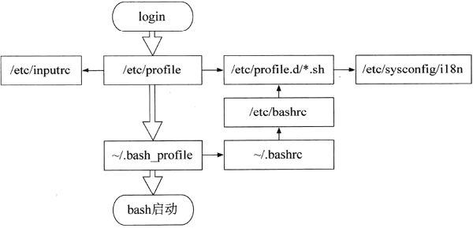
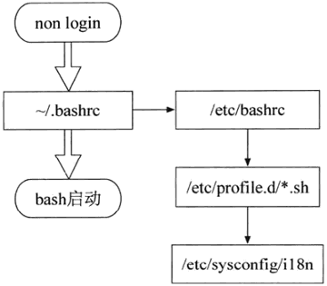

[](...menustart)

- [Linux](#edc9f0a5a5d57797bf68e37364743831)
- [2 用户,文件,文件系统](#dc78ec9cf42a8830958c4a13ea54c976)
    - [2.2 用户的身份](#71ab72489e8f3df85e9cb38e6556464b)
        - [2.2.3  /etc/passwd 文件查看用户](#073350885faece2b97481c6df960a166)
        - [2.2.4  /etc/group 文件查看组](#a660e7205f98c6b4f28ca1afc2a6c3dc)
        - [2.2.5 管理用户/组](#e9dcfc4ac5978d4aff38e5522a4ff4be)
        - [2.2.6 夺面双雄 -- 利用 sudo 假借身份](#6b02a182fc8d8895376aa313622090e7)
        - [2.2.7 我是谁](#2716c4f13756a75f75c6de90fa2e19e7)
    - [2.3 文件和它与权限的关系](#1f4cded99072ca29937edd309ce6d78b)
        - [2.3.2 文件属性和权限](#1cebd32d3996bebed0549822b7bd7a70)
        - [2.3.3 文件连接到底是什么](#c5b963752991dc5394b580dc90a4453d)
        - [2.3.4 修改文件的属性和权限](#b9d7567bb9b4c20164b259fdc41b5ffa)
        - [2.3.5 深入文件权限](#fea6f267164ff7e3d11088699fdf33b5)
        - [2.3.7 搜索文件](#dfe4938fa33c82076c22752c25198e9d)
    - [2.4 程序的执行问题](#baad53d4dee6523b870febc691e0d831)
        - [2.4.1 执行程序的方法, 以及多任务协调机制](#47ee371f78837d547249e795c4f6c40a)
        - [2.4.2 计划任务](#0c122d55fe967d921e58cba2ddcb67fb)
        - [2.4.3 守护进程及其作用](#991d92088ce3c080fcee780e2518e739)
        - [2.4.4 全面了解程序信息](#b8bcd1b9a3d826a6e7999ba8a079cf3c)
    - [2.5 软件的安装方式](#0362e79ba0307bc8b5f345f39f95bd95)
        - [2.5.1 从源文件安装](#38aa41c024692985abf9e2c632c7685a)
        - [2.5.2 利用软件管理工具 rpm 和 dpkg](#eeec95a63c0ff729122c760fdccb5ebc)
        - [2.5.3 更酷的线上升级](#3730685067a0e8ba86894245f93b7020)
    - [2.6 磁盘的管理方式](#4fce619be4da556df51e20eeee95433e)
        - [2.6.2 磁盘的基本操作](#9595fe791cc313a0bb32e9e9e8c7407c)
        - [2.6.3 /etc/fstab 文件 -- 决定分区的连接](#8f37333cfab20727c29df10a35100c26)
        - [2.6.4 弹性调整容量--逻辑卷  TODO page 109](#9652d4aeffffea883fac404a73868aa4)
    - [2.7 解决上网问题  TODO](#23848b45d53536ddecad76ab9b6a10c4)
        - [2.7.2 相关配置文件](#58c2de5fdf9137aec22fb053db23d20f)
    - [2.8 不能割舍的shell](#a50b8dd25ffe8197060e5b8754e83a6b)
        - [2.8.1 bash](#eccc90c99aa6ec3bc51b1b6220d8a075)
        - [2.8.2  环境变量](#05d38f8b22209196d02f0ee18f1ae3b2)
        - [2.8.3 bash的配置文件](#da31a23b93e91b899d86f184f76f1bb3)
    - [2.9 文本处理](#b4c32ce358fc3585f97227c4008a1729)
        - [2.9.3  grep](#0caafd3d48dc01f091820d15892e248d)
        - [2.9.4 排序和去重](#2d4681c411d1568e6fa16b550226dc0d)
        - [2.9.5 文件对比命令 -- diff](#aa0ee4642be64670b3e4176246a56945)

[](...menuend)


<h2 id="edc9f0a5a5d57797bf68e37364743831"></h2>

# Linux 

<h2 id="dc78ec9cf42a8830958c4a13ea54c976"></h2>

# 2 用户,文件,文件系统

<h2 id="71ab72489e8f3df85e9cb38e6556464b"></h2>

## 2.2 用户的身份

<h2 id="073350885faece2b97481c6df960a166"></h2>

### 2.2.3  /etc/passwd 文件查看用户

```
$ cat /etc/passwd
root:x:0:0:root:/root:/bin/bash
bin:x:1:1:bin:/bin:/sbin/nologin
...
byqi:x:16220:100:Qi Bin Yi - Senior Gameplay Programmer - APAC - SHA:/home/byqi:/bin/bash
```

- 存放用户基本信息
    - 每行一个用户, 由 `:` 分割成7个字段，结构如下
        - 用户名:密码:UID:GID:用户全名:home目录:shell
    - 没有真正的密码，只有一个 `x` ,  真正的密码保存在 `/etc/shadow` 文件内
- 虽然系统只区分 0和非0的 UID或GID, 但是在习惯上还是进行了一些分段的
    - 0 是给 root的
    - 1~499 属于系统用户的
    - 500~ 2³²-1 分配给普通用户

<h2 id="a660e7205f98c6b4f28ca1afc2a6c3dc"></h2>

### 2.2.4  /etc/group 文件查看组

```
#  cat /etc/group
root:x:0:
bin:x:1:
...
nobody:x:99:
users:x:100:
...
security:x:31336:atremblay,mloll,lgordon,tmoreggia  ...
```

- `/etc/passwd` 中 GID的来源
- 组名:用户组密码:GID:用户组内的用户名
- 用户组内的用户名
    - 可以看到 有的组 有组内用户名，有的没有
    - `/etc/passwd` 中， 某个用户的 GID字段代表的就是专职用户组, 或 初始用户组
        - 对于专职的用户来讲，是可以不出现在 用户组内的用户名 这个字段的。
    - 使用 `groups` 命名 可以查看所有的 "支持用户组" , "支持用户组" 列表的 第一个出现的那个组还有一个称呼: "有效用户组"


<h2 id="e9dcfc4ac5978d4aff38e5522a4ff4be"></h2>

### 2.2.5 管理用户/组

- `useradd` 在任何 Linux发行版 都是一样的 , `adduser` 的实现 各不相同 
- 添加一个用户

```
useradd jagen
```

- 设置用户密码

```
passwd jagen
```

<h2 id="6b02a182fc8d8895376aa313622090e7"></h2>

### 2.2.6 夺面双雄 -- 利用 sudo 假借身份

- 给某个用户赋予 sudo 特权，实际上就是更改 `/etc/sudoers` 文件

```
root          ALL=(ALL) ALL
```

- 它的含义是说 root 用户可以使用 sudo 特权，以root 权限执行任何命令 (一句废话)
- 给普通用户添加 sudo 特权

```
jagen          ALL=(ALL) ALL
```

- 给用户组(i.e. wheel)的所有用户 添加sudo 特权

```
%wheel         ALL=(ALL) ALL
## Same thing without a password
# %wheel    ALL=(ALL)   NOPASSWD: ALL
```

- 添加部分 命令的sudo特权
    - 如下 sudo 仅能执行 如下两个命令

```
%users ALL=/sbin/mount  /mnt/cdrom,  /sbin/umount  /mntcdrom
```

- `su` 命令可以临时切换用户，  默认是切换到 root 用户
    - `su` 命令 需要输入 目标用户的密码
    - `exit` 切换回 原始用户
- 如果使用 `su` 成功切换到 root 用户下, 那么就可以在不知道密码的情况下，切换到 任意用户， 比如执行 `su jagen -`
- 顺便说一下，拥有sudo特权的用户啊，是可以通过执行 `sudo su -` 或 `sudo su` 直接使用自己的密码 切换成root 用户
    - 原理是 root 用户使用 `su` 命令切换到 任何用户都不提示密码
    - 这显然是不安全的， 应该在 `/etc/sudoers` 文件中明确禁止 su 被 sudo 特权执行


<h2 id="2716c4f13756a75f75c6de90fa2e19e7"></h2>

### 2.2.7 我是谁

```bash
[byqi]$ whoami
byqi
[byqi]$ who am i
byqi     pts/0        2018-07-13 03:17 (10.192.81.82)
[byqi]$ who
byqi     pts/0        2018-07-13 03:17 (10.192.81.82)
[byqi]$ sudo su 

[root]# whoami
root
[root]# who am i
byqi     pts/0        2018-07-13 03:17 (10.192.81.82)
[root]# who
byqi     pts/0        2018-07-13 03:17 (10.192.81.82)
```

- 换脸大法 能骗过 `whoami` , 但骗不过 `who am i` 和 `who`
- 要解释背后的运行机制，  需要引入两个概念
    - 实际用户 UID : 用户登陆时所用的用户
    - 有效用户 EUID (Effective UID) : 当前执行操作的用户
- 如果有些shell 必须只能某些用户来执行， 使用`su`切换的都不行，那么就需要利用 `who am i` 这个命令来确认了


<h2 id="1f4cded99072ca29937edd309ce6d78b"></h2>

## 2.3 文件和它与权限的关系

<h2 id="1cebd32d3996bebed0549822b7bd7a70"></h2>

### 2.3.2 文件属性和权限

- linux 系统中，每个文件都会由一个 特定的拥有者(一般是创建它的用户) 和 所属的 用户组, 这是属于它的固有属性
- 文件可以利用这两个固有属性 来规定它的拥有者或者其所属用户组内的用户 是否拥有对它的 访问权利，即 读，写，执行
    - 另外还规定了 其他不相关人等，也就是 第三个固有属性，对它的 读写执行的权限。
- 这3个固有属性 和 3个权利 合起来，就构成了文件的针对系统中所有用户的访问控制。

```bash
# ls -l
drwxr-xr-x. 10 root root 4096 Jul  2 23:24 lua
-rw-r--r--.  1 root root 3702 Jul  9 01:23 nginx.conf
```

```
-rw-r--r--.       1     root      root       3702       Jul  9 01:23    nginx.conf
文件类型和权限  连接数  owner  所属用户组   文件大小    最后修改日期    文件名
```

```
-           rwx   r-x      r-x
文件类型   owner  用户组   其他
```

文件类型 |  说明
--- | --- 
 `-`| 普通文件
 d  | 目录
 l  |  软/硬 连接
 b |  块设备，如磁盘等保存大块数据的设备
 c | 字符设备，如鼠标，键盘
 s | socket 文件
 p | 命名管道文件


- 文件权限 
    - 对于目录
        - `x` 权限可以控制用户是否能够打开它
        - 如果想使用 ls 命令 来查看这个目录下的文件列表， 则必须用于 `r` 权限, 否则即便能进入，也无济于事
        - 如果要在目录中创建文件， 则要有 `w`权限
    - 对于文件
        - 读取需要 `r` , 编辑器编辑需同时具备 `r` 和 `w` 两个权限
        - 如果一个文件是shell脚本或者其他可执行的文件，要能够被执行，应当具备`x` 权限
- 隐藏属性
    - linux文件的隐藏属性，就是在 文件名前 添加 `.`

<h2 id="c5b963752991dc5394b580dc90a4453d"></h2>

### 2.3.3 文件连接到底是什么

- 文件的 “连接数”到底是什么鬼？
- linux 所使用的文件系统是一种基于 inode的文件系统
    - inode 是 索引节点， 是所有类 Unix 操作系统中的一种数据结构
    - 每一个新创建的文件都会被 分配一个 唯一的 inode
- 我们可以把 inode 简单理解成一个指针， 它指向的是文件所在的磁盘中的物理位置
    - `ls -l ` 命令显示的文件属性，也保存在 inode中
- 系统是通过inode定位每一个文件的，而不是通过文件名.
    - 所以通常情况， 为了提高文件系统的执行效率，访问过的文件的inode会缓存在内存中。 
    - “连接数” 这个属性，就是 inode的引用计数。
    - linux 允许一个文件拥有多个名字， 也就是说， 文件名只是 相当于对inode的一次引用
- `ls` 命令建立的软连接 ，也称符号连接， 不是真正的连接
    - 和 windows 的快捷方式类似， 只是一个普通文件
    - 软连接的文件属性和目标文件属性完全不同
    - 软连接 也要占据一个新的 inode, 是一个新的文件， 不影响 inode 的引用计数
- 硬连接 的属性和 目标文件的属性 完全相同，因为引用的是 相同的inode, 仅仅将 inode的引用计数进行了 +1 操作.
- 软硬连接 在使用的时候区别不大， 都相当于 是一个文件具有不同的路径和文件名
    - 硬连接 使得同一个文件 能够拥有不同的路径, 还能防止 恶意被删除.
- 对于目录，由于 "." 的存在，使得每一个目录的 连接数 都为2
    - 再由于 ".." 的存在，目录中每增加一个子目录，其连接数 +1 

<h2 id="b9d7567bb9b4c20164b259fdc41b5ffa"></h2>

### 2.3.4 修改文件的属性和权限

- 想要操作文件的属性和权限，你必须具备对文件的写权利，或者root

修改内容 | 命令
--- | ---
文件名 | mv
最后更新时间 | touch
用户组 | chgrp (不常用，chown也能做)
文件权限 | chmod 

```
chown [-R] username filename
chown [-R] username:group filename
```

```
# chmod
数字法:
    r=4, w=2, x=1
    chmod 700 .bashrc
文字法
    u,g,o,a  (user, group, other, all)
    +,-,=
    i.e. 去掉.bashrc 执行权限
    chmod a-x .bashrc
    chmode ugo-x .bachrc
```

<h2 id="fea6f267164ff7e3d11088699fdf33b5"></h2>

### 2.3.5 深入文件权限

- 其实linux的文件权限不止是 r,w,x, 还包括 s,t 这两个特殊的, 他们于 系统的账号和系统的进程相关
- s 这个标记可以出现在 文件拥有者的 x 权限位上， 也可以出现在 文件所属组的x 权限位上
    - 前者称为 Set UID  (SUID)
    - 后者称为 Set GID  (SGID)

```bash
# ls -l /bin/su
-rwsr-xr-x. 1 root root 32096 Apr 12  2017 /bin/su
```

- SUID 权限拥有这样的功能:
    - SUID仅对二进制程序有效
    - 执行者 对于该程序具有 x 的可执行权限
    - 执行权限仅在执行该程序的过程中有效
    - 执行者将具有该程序拥有者的权限
- su 这个命令， 执行了它都将具有root 权限，因为它的拥有者是root, 只是这个权限仅在执行的su命令中有效
    - 这也是 su命令能够切换用户权限的实现原理
- 设置 SUID权限可以使用`u+s` 来进行
    - SUID 在 linux系统中非常常见， 那些需要提供给普通用户，但是又需要 root权限才能正确执行的程序基本上都拥有 SUID, 比如 passwd, mount等命令

---

- 相对于 SUID, SGID 比较少见。 
    - `-rws--s--x` 
    - 可以使用 `g+s` 来设置
- SGID 权限的功能：
    - SGID 对二进制程序有效
    - 执行者对于该程序具有x的可执行效果
    - 执行者在执行的过程中将会获得该程序所属用户组的支持
- SGID 除了用在二进制程序外，还能够用在目录上。 当一个目录设置了 SGID权限后， 将具有如下功能:
    - 用户若对于此目录拥有 r与x权限时， 该用户能够进入次目录
    - 该用户在此目录下的有效用户组 将变成 该目录的 用户组
    - 若用户在此目录下有w权限， 则用户所创建的新文件的用户组 与此目录的用户组相同.
- 根据这一特性，进入这类目录的用户 就会发生 有效用户组和实际用户组 不一致的情况

---

- 既然 文件owner 和 用户组的 x权限位 可以有s, 那么 其他用户的 x权限位 是不是也可以有s呢？
    - 答案是肯定的，只是这个时候不能是s，是 t
    - `o+t` 设置
    - t 权限的名称是 `Sticky Bit` , 简称SBIT ， 仅对目录有效
- SBIT 对于目录的作用如下:
    - 用户若对此目录拥有 w和x权限，即拥有写权限
    - 当用户在此目录下 创建了 文件或目录， 仅自己和root 才有权利删除文件
    - SBIT 应用的典型例子就是 /tmp 目录

--- 

- 数字法设置 s/t
    - 将原来的3位数字扩展为4位
    - SUID 用4代表， SGID 用2代编
        - i.e. 4755, SUID
        - i.e. 2755, SGID


<h2 id="dfe4938fa33c82076c22752c25198e9d"></h2>

### 2.3.7 搜索文件

```
# whereis ls
ls: /usr/bin/ls /usr/share/man/man1/ls.1.gz
```

- 搜索 命令  以及它的联机文档所在位置
    - 只能用于搜索可执行文件， 联机帮助文件 和 源代码文件
- 并不是在 磁盘中漫无目的的乱找，而是在一个数据库中 查询
- 这个数据库是linux 系统自动创建的，包含本地所有文件的信息，并且每天通过自动执行 updatedb 命令更新一次。
    - 所以 whereis 的搜索结果有时会不准确


```
yum -y install mlocate
updatedb
```

- locate 命令和whereis 类似，且它们使用的是相同的数据库
- 但 locate 使用了十分复杂的匹配语法
    - `locate -b "\ls"`
    - 这会把 所有文件名 为 "ls" 的文件路径列出

```
# which gcc
/usr/bin/gcc
```

- 更新常用的搜索命令是 `which` 
    - 只是在$PATH 环境变量中指定的路径来搜索可执行文件的所在位置。

- find 
    - 无所不能，效率极差。 因为它不使用什么数据库，而是 从磁盘中乱找一气

```
# 找到 在3天前的那天  发生变化的所有文件
find / -mtime 3

# 查询3天内发生变化的所有文件
find / -mtime -3

# 查询3天以前 发生变换的所有文件
find / -mtime +3

# 列出一天内 变化的文件的详细信息
find / -mtime -1 -exec ls -l {} \;
```

<h2 id="baad53d4dee6523b870febc691e0d831"></h2>

## 2.4 程序的执行问题

- 如何在命令行下同时执行多个程序？
    - 同时开几个终端的做法 你就别耍这个小聪明了，因为那个不算。

<h2 id="47ee371f78837d547249e795c4f6c40a"></h2>

### 2.4.1 执行程序的方法, 以及多任务协调机制

```
# tail -f logs/error.log
....

// Ctrl + Z is used to suspend a process by sending it the signal SIGSTOP
^Z

// switch to background
# bg
[1]+ tail -f logs/error.log &

// directly create a background job
# tail -f logs/access.log &
[2] 7301
...

# jobs
[1]-  Running                 tail -f logs/error.log &
[2]+  Running                 tail -f logs/access.log &

// switch task 1 to foreground
# fg 1
tail -f logs/error.log
...

// kill job
# kill -9 %2
# jobs
[2]+  Killed                  tail -f logs/access.log
# jobs

```

- 还有一个 十分棘手的问题，就是不希望任务被无故干掉
    - 任务在什么时候会被无故干掉呢？  你退出终端的时候就会。
    - 因为 linux下 任务是与 操作者终端关联的，与其关联的所有任务都会被干掉。
    - 只要你退出了终端，与其关联的所有任务都会被干掉。 
- `nohup` 能保证被他启动的任务 脱离于终端的关联。 一般的用法是:
    - `nohup [命令于参数] &`
    - 这样名的所有输出都会输出到 nohup.out 这个文件中


<h2 id="0c122d55fe967d921e58cba2ddcb67fb"></h2>

### 2.4.2 计划任务

- 执行一次性的命令使用 `at`
- 执行周期性的命令`cron`

```
// list
# crontab -l
*/1 * * * * /usr/local/qcloud/stargate/admin/start.sh > /dev/null 2>&1 &

// edit
# crontab -e 

// remove
# crontab -r

// 以某用户的身份来控制 cron 表
# crontab -u
```


- 一个 cron 任务在 cron表 用一行来表示。
    - 每一行被分为两列，左边是时间，右边是具体运行的命令
    - 时间由5个部分组成 ， 空格隔开
- 一个cron任务的完整定义:
    - `分钟 小时 日 月 星期几(0-6) [用户名] 命令`
- 如: 设定在 8月1日，每到整点就提醒:
    - `0 * 1 8 * echo 提醒`
- 想 改成8月1日，12点， 每隔15分钟提醒一次
    - `0,15,30,45 1 8 * echo 提醒`
    - 改进一下 `*/15 1 8 * echo 提醒`


-------

cron 时间符号 | 含义
--- | --- 
\* | 任意时间
`,`  | 2,3 表示 2和3 都行
`-`  | 代表连续时间,2-4表示2,3,4
\*/n | 表示每隔时间单位

---

- 计划任务 不是所有用户都能添加的，具体谁能添加计划任务， 主要有系统中的4个文件来决定:
    - at.allow, at.deny, cron.allow, cron.deny
- 当前的大多数linux发行版使用黑名单机制，对计划任务权限的管理相对很宽松

<h2 id="991d92088ce3c080fcee780e2518e739"></h2>

### 2.4.3 守护进程及其作用

- 计划任务的执行，主要归功于 守护进程。
- Linux 服务器在启动时 需要启动很多系统服务， 它们向本地或网络用户提供了linux的系统功能接口,直接面向应用程序和用户。
    - 提供这些服务的程序 是由运行在后台的守护进程(daemons)来执行的
- 查看系统中拥有哪些守护进程， 或者说能够提供哪些服务，可以使用 `ntsysv` 命令( 在 Redhad 或 CentOS中 )
- 实际上 守护进程 也有分类， 按 启动和管理方式来区分，可以分为
    - 独立启动的 stand alone, 
    - 和 xinetd
- stand alone
    - 自行启动运行， 启动后会一直占用 内存与 系统资源
    - 如 apache , myql
- xinted 
    - 比较新型的守护进程
    - 它由一个统一的 stand alone 守护进程来负责唤起, 这个特殊的守护进程被称为: super daemon 
    - 因为 stand alone 会一直占用 内存和资源显得很浪费， 所以一些喜欢精打细算的人就提出来 按需分配这个概念
        - 也就是说，让没有客户端要求的时候， xinetd 类型的守护进程都是 未启动，待有客户端要求服务时， super daemon 才回去唤醒具体的xinetd守护进程.
        - 客户端联机接受后就关闭， 不会一直占用系统资源。

- 大多数linux发行版 会将所有的 stand alone 守护进程的启动脚本 都放置在 `/etc/init.d/` 目录
    - 而 CentOS 实际上是 放在了 `/etc/rc.d/init.d/` 目录下了， `/etc/init.d/` 只是它的一个符号连接
- 直接执行某个 stand slone 守护进程 会显示这个启动脚本的用法


```
# /etc/init.d/netconsole
Usage: /etc/init.d/netconsole {start|stop|status|restart|condrestart}
```   

- xinetd 守护进程的配置文件 放置在 `/etc/xinetd.d/` 和 `/etc/xinetd.conf` 文件中
    - 一般不用关心 xinetd.conf 文件
- 当客户端请求 rsync 服务的时候，xinetd 怎么就知道启动 /usr/bin/rysnc 这个程序呢？
    - 答案就在 `/etc/services` 文件中 
    - `rsync           873/tcp                         # rsync`


<h2 id="b8bcd1b9a3d826a6e7999ba8a079cf3c"></h2>

### 2.4.4 全面了解程序信息

- ps / top / pstree
- ps 查看程序的静态信息， 即将某个时间的程序运行情况 截取下来
    - `ps aux`  查看系统中 所有程序的数据
    - `ps -l`  查看与当前终端关联的程序数据

```bash
# ps -l
F S   UID   PID  PPID  C PRI  NI ADDR SZ WCHAN  TTY          TIME CMD
0 R     0 25463 30153  0  80   0 - 37225 -      pts/0    00:00:00 ps
4 S     0 30153 30150  0  80   0 - 29038 wait   pts/0    00:00:00 bash
```

ps 命令输出字段 | 说明
--- | ---
F  | flag, 执行权限，0:普通，4:root, 1:仅fork没有exec
S  | status, R:running,S:sleep可唤醒，D:不可被唤醒状态，一般等待I/O, T:停止，比如被调试的时候, Z:僵尸，程序已终止，但是无法被移除到内存外
UID | 此进程拥有者 UID
PID |  此进程ID
PPID | 此进程的父进程ID
C | CPU使用率
PRI | 运行优先级
NI |  运行优先级调整值
ADDR | 程序内存地址，ruuning的程序一般显示 `-`
SZ | 此程序用到的内存
WCHAN | 是否在运行中，`-` 表示在运行中 
TTY | 登陆者的终端机位置 
TIME | 使用掉的 CPU时间


```bash
# ps aux
USER       PID %CPU %MEM    VSZ   RSS TTY      STAT START   TIME COMMAND
root         1  0.0  0.0  43252  3560 ?        Ss   May09   4:29 /usr/lib/systemd/systemd --system --deserialize 24
root         2  0.0  0.0      0     0 ?        S    May09   0:00 [kthreadd]
```

字段 | 说明
--- | --- 
VSZ | 该进程用掉的虚拟内存量 kbytes
RSS | 该进程占用的固定的内存量 kbytes
TTY | 该进程所运行的终端机， 若与终端机无关 则显示"?". tty1-tty6是本机上的登陆者，如果pts/0等，则表示网络连接
STAT | 状态,同 上面的 S
START | 进程启动时间

---

- top: 每5秒刷新一次

```
top - 18:26:32 up 75 days,  4:15,  1 user,  load average: 0.00, 0.01, 0.05
Tasks:  84 total,   1 running,  83 sleeping,   0 stopped,   0 zombie
%Cpu(s):  0.3 us,  0.1 sy,  0.0 ni, 99.5 id,  0.1 wa,  0.0 hi,  0.0 si,  0.0 st
KiB Mem :  8010792 total,  1065816 free,   418224 used,  6526752 buff/cache
KiB Swap:        0 total,        0 free,        0 used.  7266568 avail Mem

  PID USER      PR  NI    VIRT    RES    SHR S  %CPU %MEM     TIME+ COMMAND
    1 root      20   0   43252   3560   2316 S   0.0  0.0   4:29.47 systemd
    2 root      20   0       0      0      0 S   0.0  0.0   0:00.68 kthreadd
```

- top 输出共分为两个部分
    - 上面部分是 整个系统的资源的使用状态
    - 下面部分是 单个进程的资源使用情况
- 第一行
    - 当前时间, up 系统连续运行时间， 已登陆系统的用户数(1 user) , 系统在1,5,15分钟的平均工作负载(load average)
- 第二行
    - 进程的总数，正在运行数， 睡眠数， 停止数，僵尸数
- 第三行
    - 用户空间占用CPU的百分比(us), 内核空间占用CPU的百分比(sy), 改变过优先级的进程占用的CPU百分比(ni),
    - 空闲cpu 百分比 (id), I/O等待专用CPU百分比(wa), 硬中断占用CPU的百分比(hi), 软中断占用的CPU百分比(si)
    - 被强制等待 虚拟CPU的时间百分比(st)
- 第四行
    - 物理内存总数,空闲数，已用数，缓冲数
- 第五行
    - 交换分区总数,空闲数，已用数，可用数
-  VIRT  /  RES  /  SHR
    - 分别代表 虚拟内存用量(只是需要的，不是实际使用量)，常驻内存量(实际使用量，包含共享部分)，和共享内存
    - 计算一个进程所占用的真实物理内存可以使用公式: RES-SHR 来计算
- CPU 占比部分，有些时候会出现超过 100%的情况。 
    - 这是非常正常的。因为top计算占比，是按照单个CPU核心来计算。 如果一个计算机内有16个CPU核心，那么这个CPU占比最高可以达到1600%
- load average
    - 想象一下 高速公路的收费口
    - 0.00 ~ 1.00 , 很畅通
    - 1.00 , 刚好在承受范围内。 只是车流会有些堵，不过这种情况可能会造成交通越来越慢
    - 1.00 + ,  超过负荷，交通严重的拥堵
    - 由此可见，load average 不能超过1.00， 超过就说明系统快 不堪重负了。
        - 很多人的实际经验是经常看到超过 1.00的情况，原因   
            - 1 与CPU占比相同，与 核心数量有关。 16核心系统， 平均工作负载可以达到16.00
            - 2 系统已经不看重负了，虽然依然能够运行。
- top 还可以 修改数据刷新间隔(-d)， 还能单独追踪某个进程的运行状态(-p)
    - `top -d 2 -p 12201`
 
---

- pstree 
    - 查看进程的父子祖先关系

```
# pstree
systemd-+-YDLive---{YDLive}
        |-YDService---6*[{YDService}]
        |-acpid
        |-2*[agetty]
        |-atd
        |-auditd---{auditd}
        |-barad_agent-+-barad_agent
        |             `-barad_agent---3*[{barad_agent}]
        |-crond
        |-dbus-daemon
        |-dockerd-+-docker-containe-+-docker-containe-+-mysqld---29*[{mysqld}]
        |         |                 |                 `-8*[{docker-containe}]
        |         |                 |-docker-containe-+-openresty---2*[openresty]
        |         |                 |                 `-8*[{docker-containe}]
        |         |                 `-10*[{docker-containe}]
        |         `-10*[{dockerd}]
        |-lsmd
        |-lvmetad
        |-ntpd
        |-polkitd---5*[{polkitd}]
        |-rpcbind
        |-rsyslogd---2*[{rsyslogd}]
        |-sgagent---{sgagent}
        |-sshd---sshd---bash---pstree
        |-systemd-journal
        |-systemd-logind
        |-systemd-udevd
        `-tuned---4*[{tuned}]
```

<h2 id="0362e79ba0307bc8b5f345f39f95bd95"></h2>

## 2.5 软件的安装方式

<h2 id="38aa41c024692985abf9e2c632c7685a"></h2>

### 2.5.1 从源文件安装

- 三部曲： 在演奏三部曲之前，因为不确定源码中是否包含上次编译过的目标文件(\*.o), 最好使用`make clean`或`make distclean` 去除目标文件,以保证新编译出来的可执行文件是在自己机器上编译完成的
    - 第一步: configure
        - 检查待安装的源码的 Linux系统的相关软件属性，创建 Makefile  文件
    - 第二步: make
    - 第三部: make install 
        - make 根据 Makefile 这个文件里关于intall 的项目， 将编译完成的文件安装到 预定的目录中。
        - 一般有 etc, lib, bin, 和man 等目录分别代表 配置文件，函数库，执行文件，线上说明文件

<h2 id="eeec95a63c0ff729122c760fdccb5ebc"></h2>

### 2.5.2 利用软件管理工具 rpm 和 dpkg

- RMP:  Redhat Package Manager 
- DPKG:  Debian Package 

<h2 id="3730685067a0e8ba86894245f93b7020"></h2>

### 2.5.3 更酷的线上升级

- RMP/DPKG 这些机制 并没有完全解决软件依赖的问题。
- dpkg 
    - 出现了 apt 线上升级机制
- RMP 
    - Red Hat 系统的 yum 
    - SUSE 系统的 Yast Online Update (YOU)
    - Mandriva 的 urpm
- yum是利用python脚本语言实现的， 所以在python升级问题上要慎重，否则会导致yum 工作不正常，系统无法实现线上升级了。


<h2 id="4fce619be4da556df51e20eeee95433e"></h2>

## 2.6 磁盘的管理方式

- Linux 文件系统格式: ExtN (N=2,3,4)

<h2 id="9595fe791cc313a0bb32e9e9e8c7407c"></h2>

### 2.6.2 磁盘的基本操作

- df, du, dd, fsck, mount
- df
    - 查看系统中所有磁盘的整体使用量

```bash
# df
Filesystem     1K-blocks    Used Available Use% Mounted on
/dev/vda1       51474024 7246028  41921920  15% /
devtmpfs         3995892       0   3995892   0% /dev
tmpfs            4005396      24   4005372   1% /dev/shm
tmpfs            4005396     436   4004960   1% /run
tmpfs            4005396       0   4005396   0% /sys/fs/cgroup
tmpfs             801080       0    801080   0% /run/user/0
```

- Filesystem  
    - 磁盘分区。 
    - 之所以叫它是文件系统，是因为每一个磁盘分区都是一个 文件系统的具体实例。如果套用面向对象的说法就是：类和对象   
        - ExtN 就是类， 具体的磁盘分区就是 这个类的对象
- Mounted on   
    - 挂载点， 它是某个具体的目录

- 具体的磁盘分区会与某个具体的目录有关
    - 其实在这些所谓的分区中，只有 /dev/vda1 才是真正的磁盘分区，而这个名称则是这个磁盘分区的"设备名"
    - Linux系统中， /dev 目录下的所有文件都与一个具体的设备有关。 有物理的，也有虚拟的。而 sda1 就是一个物理的设备，它对应系统第一个串口硬盘的第一个分区。
    - 那么第二个分区呢？  sda2
    - 对应整个硬盘就是  sda， 第二块硬盘就是 sdb...
    - /dev/mapper/\*  下的是虚拟设备， 它实际上是 逻辑卷。
- tmpfs 这个设备在什么地方？  
    - 答案是没有。 它不对应任何设备。 
    - 它实际上是真正的文件系统名称。而这个文件系统是在内存中虚拟的， 与具体的硬盘无关， 所以也没有具体的设备。
    - 这样的文件系统还有很多， 比如 procfs, sysfs 等。。。

---

- du
    - df命令是用来观察总体磁盘使用量的
    - 要观察局部使用量，需要使用 du 命令.
    - df 可以通过读取磁盘的superblock 来实现， 而du 命令不同，它要搜索所有的 inode 来计算局部数据， 所以du 的执行效率， 要比df 差很多.


--- 

- dd
    - 严格来说，dd不属于 管理磁盘的命令，它的功能是 convert and copy a file
    - 如果你想要 直接读写磁盘的每一个扇区，或者镜像整个磁盘， dd是很好的选择
- 复制一个文件 `dd if=/etc/bashrc of=./bashrc`  ,  作用同 cp
    - `dd if=input_file of=out_file`
- 模拟 cat
    - `dd if=/etc/bashrc` , 
- 制作第一个串口硬盘 第一个分区的镜像文件 
    - `dd if=/dev/sda1 of=./sda1.img`
    - 如果希望生成的镜像文件压缩一下: `dd if=/dev/sda1 | gzip -9 > ./sda1.img`
- 将整个硬盘做一个镜像
    - `dd if=/dev/sda | gzip -9 > ./sda.img`
- 恢复这个磁盘的内容 (是不是想到了windows下的 ghost...)
    - `gzip -dc ./sda.img | dd of=/dev/sda`
- 使用 bs/count 参数，指定 依次读写的字节数和读写次数， 比如 要备份磁盘的主引导记录：
    - `dd if=/dev/sda of=./mbr.img bs=512 count=1`
    - 以上 读取 sda磁盘的 首个512字节的信息，也就是第一个扇区的内容。将这个文件反汇编掉，就能知道计算机是怎么启动的了
- 使用 dd 还能 
    - 销毁磁盘数据
        - `dd if=/dev/urandom of=/dev/sda1`
            - /dev/urandom 代表随机数， 每次读入的数据都不会相同
    - 测试磁盘读写速度
        - `dd if=/dev/zero of=./test.file bs=1024 count=1000000`
            - /dev/zero 代表0 ， 每次读入的数据都是0
        - `dd if=./test.file  bs=8k | dd of=/dev/null` 
            - /dev/null 主要面对写， 相当于是一个黑洞一样，无论写什么都会消失的无影无踪


---

- fsck 
    - fsck 很少手工执行，基本上都是在 系统启动阶段就执行了
    - 与 windows的 SCANDISK一样， 对 **文件系统** 损坏进行修复
    - `fsck -f -t ext3 /dev/hda3`  ( fsck -t 文件系统 设备名 )
    - 参数 -f 要求进行强制检查。 如果没有-f ， 没有报错的磁盘中是不会做检查的。
        - 磁盘什么时候会报错呢？   一般就是 非法关机的时候。

--- 

- mount
    - 在 windows中，如果有一个软件 必须在D盘下的某个目录中读取文件， 而这个软件若是在一个没有D盘的系统中就无法执行了
    - 相反在Linux下， 只需要特意创建一个目录即可，如果需要单独的磁盘分区来存储它，是 mount 命令指定给它就好了
- `mount [-t 文件系统] 设备名称  挂接点`
    - 比如要将 系统中 第二块串口硬盘的第一个分区 ， 挂接到 /data 目录下:
        - `mount /dev/sdb1 /data` ,  或
        - `mount -t vfat /dev/sdb1 /data`   
        - 很多时候 -t 参数是多余的，因为 ExtN类的基于inode的文件系统，都是有超级块的。利用超级块就能够了解到具体的文件系统
            - 第二种方法 多用于 挂接 windows 分区时使用, 因为这些文件系统不具备超级块
- 挂接磁盘分区 还只是 mount 命令的最平常的一种用法。
- 由于 linux 使用设备文件来描述一个设备， 那么如果有一个 实际的文件中的内容 与在某个磁盘设备文件中能读到的内容一致， 那么这个实际的文件也能够被挂载进来
    - 比如 我们之前用 dd 创建的 sda1.img (未压缩)，就可以挂接到一个目录上
        - `mount -o loop ./sda1.img  /mnt/sda1`
    - 我们下载到的ios 文件 也可以这样
        - `mount -o loop ./Centos-6.4-x86-64-bin-DVD1.ios /mnt/centos`
    - `-o` 选项:
        - ro  只读
        - rw  可读写
        - loop 说明要挂接的文件是一个虚拟设备， 而且这个虚拟设备是环形的设备(光盘，硬盘磁碟都是环形的)。
- unmount
    - `unmount /data` , 或 - `unmount /dev/sdb1`
         
<h2 id="8f37333cfab20727c29df10a35100c26"></h2>

### 2.6.3 /etc/fstab 文件 -- 决定分区的连接

```
# cat /etc/fstab
/dev/vda1            /                    ext3       noatime,acl,user_xattr 1 1
proc                 /proc                proc       defaults              0 0
sysfs                /sys                 sysfs      noauto                0 0
debugfs              /sys/kernel/debug    debugfs    noauto                0 0
devpts               /dev/pts             devpts     mode=0620,gid=5       0 0
```

- 可以看到，每条记录一共分为 6个字段
    - 设备文件，磁盘卷标 ， 或者 UUID
    - 挂接点
    - 文件系统类型
    - mount 命令的-o 选项参数
    - 是否使用 dump 命令备份: 0代表不做，1代表每天备份
    - 是否使用 fsck 检查磁盘， （一般只有 根目录 `/` 是1 ）


<h2 id="9652d4aeffffea883fac404a73868aa4"></h2>

### 2.6.4 弹性调整容量--逻辑卷  TODO page 109

- /dev/mapper/\* 这些都是逻辑卷
- 什么是逻辑卷？
    - 我有一个同事，在自己的电脑中，与他的Windows 并行安装了一个 Ubuntu.
    - 他在使用Linux的时候总是显得很小气， 只给他的Ubuntu 分了10G的硬盘空间。并划分了3个分区分别给 `/`,`/home`和swap. 
    - 没过几天他就遇到了麻烦。 他想用这个linux系统来定制一套Android系统，于是他去下载 android的全部源代码。但是没想到7G磁盘空间不够装Android的源代码。
    - 如果是你遇到这样的问题，要怎么做？
        - 再从 硬盘中划分一个更大的区出来,比如100G
        - 然后再将 这个分区格式化为Linux的文件系统， 并将 `/home` 目录下的内容全部复制到 新的分区
        - 最后修改 `/etc/fstab` 文件， 让新的分区称为 `/home` . 重启后大功告成。
    - 但是如果觉得100G给的太多了，Windows 又不够用了怎么办？ 难道重复上述动作，复制文件要花费很长很长时间的。
- 逻辑卷 就是来解决这个问题的， 它能弹性地调整文件系统的容量。
- 从理论上来说，逻辑卷 就是在磁盘分区 和 文件系统之间 增加了一个逻辑层。
    - 这样，当文件系统的容量觉得不够用时，可以向逻辑卷中增加新的分区来实现扩大容量的母的。
    - 当文件系统过大而有磁盘浪费的时候，可以选择去除一些 基本没有使用的磁盘分区 来达到减少容量的母的。
- 在 Linux系统中 实现逻辑卷功能是 LVM (Logical Volumn Manager)

---

- 基本术语与原理
- Physical Volume, PV, 物理卷
    - 具体硬盘分区， 或者与 硬盘分区具有相同功能的设备， 比如 RAID
    - PV 是 LVM的基本存储单元。
    - 但是与 普通的硬盘分区相比， 物理卷 还要包含与 LVM 相关的管理参数
- Volume Group, VG,  卷组
    - 卷组 类似于 非LVM系统中的物理硬盘， 由多个物理卷组成
    - 可以在卷组上 创建一个或多个 LVM 分区
- TODO
     

<h2 id="23848b45d53536ddecad76ab9b6a10c4"></h2>

## 2.7 解决上网问题  TODO

<h2 id="58c2de5fdf9137aec22fb053db23d20f"></h2>

### 2.7.2 相关配置文件

- 网络设备地址信息可以从网络接口配置文件中获取， 它们通常在 `/etc/sysconfig/network-scripts/`  目录下
- ifcfg-xxxx 就是网卡的配置文件

```bash
# cat /etc/sysconfig/network-scripts/ifcfg-eth0
# Created by cloud-init on instance boot automatically, do not edit.
#
BOOTPROTO=none   启动时 IP取得的协议  static/dhcp/none 
DEFROUTE=yes
DEVICE=eth0     网卡名称
GATEWAY=10.23.1.1     
HWADDR=52:54:00:17:46:72
IPADDR=10.23.1.2
NETMASK=255.255.255.0
NM_CONTROLLED=no
ONBOOT=yes      开机启动网卡
TYPE=Ethernet   网卡的类型为 以太网类型
USERCTL=no
```

- 还有一些 ifup-XXX , ifdown-XXX 的文件， 它们负责关闭或开启某项网络功能，比如拨号网络等

---

- Linux 使用 `/etc/resolv.conf` 文件来设定 DNS 服务器。 它的内容可如下表示
    - 最多支持3个域名服务器

```
nameserver 183.60.83.19
nameserver 183.60.82.98
```
  
<h2 id="a50b8dd25ffe8197060e5b8754e83a6b"></h2>

## 2.8 不能割舍的shell

<h2 id="eccc90c99aa6ec3bc51b1b6220d8a075"></h2>

### 2.8.1 bash

- 在一般的Linux发行版中， bash 是 `/bin` 下的几个重量级“人物”之一
    - alias 
    - histroy
    - job contorl
        - ps
        - kill
        - jobs
        - bg
        - fg
    - 管道 pipe 与重定向 

- kill 是用来杀掉进程，但它的实际目的远不止如此，它会想进程发信号，进程听到从操作系统的信号后开始回应，很“优雅”地退出操作。

```
# kill -l
 1) SIGHUP   2) SIGINT   3) SIGQUIT  4) SIGILL   5) SIGTRAP
 6) SIGABRT  7) SIGBUS   8) SIGFPE   9) SIGKILL 10) SIGUSR1
11) SIGSEGV 12) SIGUSR2 13) SIGPIPE 14) SIGALRM 15) SIGTERM
16) SIGSTKFLT   17) SIGCHLD 18) SIGCONT 19) SIGSTOP 20) SIGTSTP
21) SIGTTIN 22) SIGTTOU 23) SIGURG  24) SIGXCPU 25) SIGXFSZ
26) SIGVTALRM   27) SIGPROF 28) SIGWINCH    29) SIGIO   30) SIGPWR
31) SIGSYS  34) SIGRTMIN    35) SIGRTMIN+1  36) SIGRTMIN+2  37) SIGRTMIN+3
38) SIGRTMIN+4  39) SIGRTMIN+5  40) SIGRTMIN+6  41) SIGRTMIN+7  42) SIGRTMIN+8
43) SIGRTMIN+9  44) SIGRTMIN+10 45) SIGRTMIN+11 46) SIGRTMIN+12 47) SIGRTMIN+13
48) SIGRTMIN+14 49) SIGRTMIN+15 50) SIGRTMAX-14 51) SIGRTMAX-13 52) SIGRTMAX-12
53) SIGRTMAX-11 54) SIGRTMAX-10 55) SIGRTMAX-9  56) SIGRTMAX-8  57) SIGRTMAX-7
58) SIGRTMAX-6  59) SIGRTMAX-5  60) SIGRTMAX-4  61) SIGRTMAX-3  62) SIGRTMAX-2
63) SIGRTMAX-1  64) SIGRTMAX
```

<h2 id="05d38f8b22209196d02f0ee18f1ae3b2"></h2>

### 2.8.2  环境变量

- 变量包括 局部变量和 环境变量
    - 局部变量是私有的， 无法传递给子shell
- 可以使用 set,env, export 来设置环境变量， unset 来清除设置 , 使用readonly 来设置 只读属性


```bash
# export ENVTEST="ENV1"
# env | grep ENVTEST
ENVTEST=ENV1
# unset ENVTEST
# env | grep ENVTEST
# 
```

<h2 id="da31a23b93e91b899d86f184f76f1bb3"></h2>

### 2.8.3 bash的配置文件

- login shell :  在输入了 用户名/密码 后才启动的shell
- non-login shell:  不需要做重复的登陆操作 获取bash 界面， 例如在x-window环境下来启动终端

---

- 系统配置文件  `/etc/profile`
    - 只有 login shell 才会读取系统设置文件 `/etc/profile` , 它是系统整体的配置文件
    - 该配置文件里 包含很多重要的变量信息， 每隔用户登陆取得bash后一定会读取这个配置文件。
    - 如果你想要所设置的变量对所有用户起作用， 就要在这个地方设置。
    - `/etc/profile` 还会调用如下的外部设置文件
        - `/etc/inputrc`  设置bash热键，等等
        - `/etc/profile.d/*.sh`  bash操作界面，语系， 等
- 用户的个性设置文件
    - login shell 读取完  `/etc/profile` ， 就会读取用户的个人配置文件。 主要是3个隐藏文件:
        - `~/.bash_profile , ~/.bash_login , ~/.profile`
        - 按顺序读取，一旦读取到，忽略后面的文件
        - `~/.bash_profile` 还会尝试读取 `~/.bashrc`
    - 如果 `/etc/bashrc` 存在的话， 它会被  `~/.bashrc` 调用
- non-login shell 会直接读取  `~/.bashrc`
    - 所以个人需要的设置 写在 `~/.bashrc` 文件中即可







<h2 id="b4c32ce358fc3585f97227c4008a1729"></h2>

## 2.9 文本处理

<h2 id="0caafd3d48dc01f091820d15892e248d"></h2>

### 2.9.3  grep 

- grep: Global search Regualr Expression and Print out the line 
- egrep :  grep 的扩展，支持更多的正则表达式元字符
- fgrep : fixed (or fast) grep . 不实用 正则表达式搜索
- linux 中所使用的是 GNU版本的grep,  可以直接通过 -G, -E, -F 选项来使用 grep, egrep, fgrep
- grep 在一个或多个 文件中搜索 字符串模版
    - 字符串模版使用 正则表达式来描述
    - 如果模版包括空格， 则需要引号扩起来
    - 模版后的所有字符串 被看作 文件名

---

 grep RE 元字符 | 匹配对象
--- | ---
 ^ | 句首
 $ | 句尾
 \* | 出现 0+ 次
 `[]` |  ·
 `[^]` | · 
 (...) | ?
 \<  | 词首
 \>  | 词尾


<h2 id="2d4681c411d1568e6fa16b550226dc0d"></h2>

### 2.9.4 排序和去重

- `cut -d' ' -f1 ~/.bash_history  | sort -d | uniq -c | sort -nr | head`
    - 这行脚本的功能是 统计出 你最常用的十条 历史命令 及其使用次数
- `cut -d' ' -f1 ~/.bash_history`
    - 从 bash_histroy 文件中， 以空格为分隔符 ( `-d' '` ) 剪出第一列 ( -f1 ) 
    - 如果要剪出多列， 可以 -f1,3   -f1-5 等
- `sort -d` 
    - 按字典序 (-d) 排序剪出的第一列
- `uniq -c`
    - 对文本去重， 并统计次数 (-c) 
    - sort 和 uniq 经常需要联合起来使用。 
        - uniq 去重功能，只能针对连续的多行进行去重， 只剩下唯一的一条
        - 不排序的话， 不连续的重复行 就去不掉了
- `sort -nr` 
    - 按数字排序 (-n) 并 反序 (-r) 排列 , 没有 -r 默认是 生序排列
- `head` 
    - 输出显示文件前面部分的内容，默认显示前面10行的内容.


<h2 id="aa0ee4642be64670b3e4176246a56945"></h2>

### 2.9.5 文件对比命令 -- diff

- diff 用来比较两个文本文件的差异， 是代码版本管理的基石之一
- diff 采用 动态规划算法实现差异比较， 次算法的基础是最长公共子序列。
- diff 提供 正常(normal diff), 上下本(context diff)，和 合并(unified diff) 三种报告格式
    - normal 格式的diff 不太容易读
    - context 格式在文件相似度比较高的情况下会 显示大量重复的内容，很浪费空间
- `diff -ur file01_old file01_new > file01.path`


