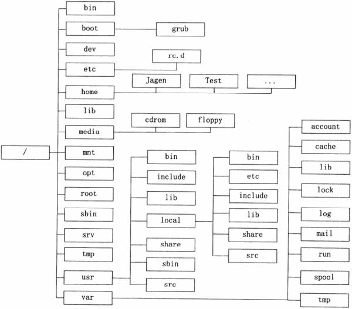

...menustart

- [3 系统结构](#945ecd032baf804bdb76100ab68067b0)
    - [3.1 Linux 的文件组织结构](#be43e58e6be359b522be6d81834cd1fc)
    - [3.3 根文件系统](#72bcb5b07fce5f144011534e8140baa7)
        - [3.3.1 原则与特性](#ad095e1db62dba73d13badb1f2375dde)
        - [3.3.2 必备的内容](#cce7ed50e9ad40cb376d2558ba47d967)
        - [3.3.3 可选的内容](#055d5c3afa5654eb8d72d02d80d3d7f9)
    - [3.5 /usr 目录组织结构](#244962dc992e1423d077d71cc059bc42)

...menuend


<h2 id="945ecd032baf804bdb76100ab68067b0"></h2>


# 3 系统结构

<h2 id="be43e58e6be359b522be6d81834cd1fc"></h2>


## 3.1 Linux 的文件组织结构

 > 最小 Linux 系统的文件组织结构



<h2 id="72bcb5b07fce5f144011534e8140baa7"></h2>


## 3.3 根文件系统

<h2 id="ad095e1db62dba73d13badb1f2375dde"></h2>


### 3.3.1 原则与特性

- 根文件系统保存在根分区， 它担负着系统启动，修复，更新，恢复等重要任务
 
```
# ls /
bin  boot  data  dev  etc  home  lib  lib64  lost+found  media  mnt  opt  proc  root  run  sbin  srv  sys  tmp  usr  var
```

- 虽然它们有序的排列在一起， 但是它们不一定完全存放在 同一个设备上
    - 比如，/usr 和 /var 可能是不同的硬盘
    - 比如, /sys 和 /proc 根本不在任何外部存储设备上，而是在内存中
- 我们将 直接挂接在 `/` 上的设备叫做 根设备，可能是内存，也可能是磁盘。
    - 如果是磁盘的某一分区，就称之为 根分区。
    - 根分区是操作系统启动时 默认挂接的设备， 是所有文件系统的根源， 所以也被称为 根文件系统。


<h2 id="cce7ed50e9ad40cb376d2558ba47d967"></h2>


### 3.3.2 必备的内容

- 根文件系统 必须包含下面的目录， 某些可以是符号连接

---

名称 | 功能
--- | ---
bin | 重要的可执行文件, shell命令
boot | 引导器 配置文件，内核等
dev | 设备文件
etc | 系统专有 配置文件
lib | 重要的共享库 和内核模块
media | 可移动设备 挂接点
mnt | 其他文件系统的 临时挂接点
opt | 附加 应用软件包
sbin | 重要的系统可执行文件
srv | 本系统提供的 用于服务器的数据
tmp | 临时文件
usr | 文件系统的第二层
var | 可变数据


<h2 id="055d5c3afa5654eb8d72d02d80d3d7f9"></h2>


### 3.3.3 可选的内容

- 可选的目录， 只有在 有相应子系统的时候才需要
    - 不过对于大多数通用系统来说，它们都是需要的。

---

名称 | 功能
--- | ---
home | 用户在home下有自己的用户子目录
lib64 | x86_64的Linux系统专有目录
root | root 用户的专有目录

<h2 id="244962dc992e1423d077d71cc059bc42"></h2>


## 3.5 /usr 目录组织结构
 
- `/usr` 是整个文件系统的第二个主要区段。

---

名称 | 功能
--- | ---
bin | 大部分用户命令
include | c/c++ 程序头文件目录
lib | 程序库
local | 用户自行安装的程序
sbin | 非重要的系统程序
share | 体系结构独立数据
tmp | 一个到`/var/tmp` 的符号连接，为了保持与老系统的兼容


---


