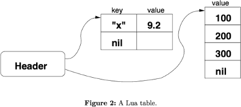
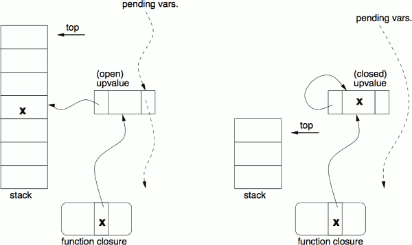

...menustart

- [The Implementation of Lua 5.0](#4f290eb80083e0bb6b40f6d87c09981a)
    - [2 An Overview of Lua’s Design and Implementation](#250c904a9716f8ab74be081555c63afa)
    - [3 The Representation of Values](#ee226301a572d11c468ef9d94be631c3)
    - [4 Tables](#44eab1c91179898399b5ef2c31ddb47e)
    - [5 Functions and Closures](#572568b8164104249d51df24e8df1e39)
    - [6 Threads and Coroutines](#76d231147e33d5baa99ed608ad62ec0c)
    - [7 The Virtual Machine](#7c89324fd0ad9c0688759cd8b0df39f7)

...menuend


<h2 id="4f290eb80083e0bb6b40f6d87c09981a"></h2>


# The Implementation of Lua 5.0

<h2 id="250c904a9716f8ab74be081555c63afa"></h2>


## 2 An Overview of Lua’s Design and Implementation

- The Lua compiler uses no intermediate representation. 
    - It emits instructions for the virtual machine “on the fly” as it parses a program
    - Nevertheless, it does perform some optimizations. For example
        - it delays the generation of code for base expressions like variables and constants.
        - When it parses such expressions, it generates no code; instead, it uses a simple structure to represent them.
        - Therefore, it is very easy to check whether an operand for a given instruction is a constant or a local variable,  and use those values directly in the instruction, thus avoiding unnecessary and costly moves (see Section 3).
- To be portable , Lua can- not use several tricks commonly used by interpreters. such as : 
    - direct threaded code
        - Instead, lua uses a standard **while–switch** dispatch loop. 


<h2 id="ee226301a572d11c468ef9d94be631c3"></h2>


## 3 The Representation of Values

- Lua is a dynamically-typed language: types are attached to values rather than to variables.
- Lua has eight basic types: nil, boolean, number, string, table, function, userdata, and thread.
    - Strings are arrays of bytes with an explicit size, and so can contain arbitrary binary data, including embedded zeros.
    - Tables are associative arrays, which can be indexed by any value (except nil) and can hold any value.
    - Functions are either Lua functions or C functions written according to a protocol for interfacing with the Lua virtual machine.
    - Userdata are essentially pointers to user memory blocks, and come in two flavors:
        - heavy, whose blocks are allocated by Lua and are subject to garbage collection
        - light, whose blocks are allocated and freed by the user. 
    - threads represent coroutines.
- Values of all types are first-class values:
    - we can store them in global variables, local variables and table fields,
    - pass them as arguments to functions, return them from functions, etc.

```c
typedef struct { 
    int t;  // tag: type of v
    Value v;
} TObject;


typedef union { 
    GCObject *gc; 
    void *p; // light userdata
    lua_Number n;  // double
    int b;         // boolean
} Value;
```

> Figure 1: Lua values are represented as tagged unions

- Lua represents values as tagged unions
    - Nil has a single value, it is not explicitly represented in the union because the tag is enough to identify them. 
    - Booleans and numbers are implemented as ‘unboxed’ values: v represents values of those types directly in the union.
        - This implies that the union must have enough space for a double
    - Strings, tables, functions, threads, and userdata values are implemented by reference:
        - v contains pointers to structures that implement those values.
        - Those structures share a common head, which keeps information needed for garbage collection.
- One consequence of using tagged unions to represent Lua values is that copying values is a little expensive:
    - opying a value requires copying 3 (or 4) machine words.
    - However, it is difficult to implement a better representation for values in ANSI C. 
- Another option to reduce the size of a value would be to keep the explicit tag, but to avoid putting a double in the union.
    - For instance, all numbers could be represented as heap-allocated objects, just like strings. 
    - **Python uses this technique, except that it preallocates some small integer values.**
    - However, that representation would make the language quite slow.
- Alternatively, integer values could be represented as unboxed values, directly inside the union, while floating- point values would go to the heap. 
    - That solution would greatly increase the complexity of the implementation of all arithmetic operations.

---

- Lua internalizes strings using a hash table: 
    - it keeps a single copy of each string with no duplications.
    - strings are immutable: once internalized, a string cannot be changed. 
    - Hash values for strings are computed by a simple expression that mixes bitwise and arithmetic operations, thus shuffling all bits involved.
    - Hash values are saved when the string is internalized to allow fast string comparison and table indexing. 
        - The hash function does not look at all bytes of the string if the string is too long. This allows fast hashing of long strings.
    - Avoiding loss of performance when handling long strings is important 
        - because they are common in Lua. 
        - For instance, it is usual to process files in Lua by reading them completely into memory into a single long string.

<h2 id="44eab1c91179898399b5ef2c31ddb47e"></h2>


## 4 Tables

- Tables in Lua are associative arrays, that is, they can be indexed by any value (except nil) and can hold values of any type.
    - The implementation of sparse arrays is trivial in Lua. 
    - `$a[1000000000]=1;` in Perl will lead to out of memory. 
    - `a={[1000000000]=1}` in lua creates a table with a single entry.



- Lua 5.0 brought a new algorithm to optimize the use of tables as arrays: 
    - it optimizes pairs with integer keys by not storing the keys and storing the values in an actual array. 
- in Lua 5.0, tables are implemented as hybrid data structures: 
    - they contain a hash part and an array part. 
- Tables automatically and dynamically adapt their two parts according to their contents:
    - the array part tries to store the values corresponding to integer keys from 1 to some limit n.
    - Values corresponding to non-integer keys or to integer keys outside the array range are stored in the hash part.
- When a table needs to grow, Lua recomputes the sizes for its hash part and its array part.
    - The computed size of the array part is the largest n such that at least half the slots between 1 and n are in use (to avoid wasting space with sparse arrays) and there is at least one used slot between n/2 + 1 and n (to avoid a size n when n/2 would do).
    - After computing the new sizes, Lua creates the new parts and re-inserts the elements from the old parts into the new ones.
- The hash part uses a mix of chained scatter table with Brent’s variation.
    - A main invariant of these tables is that if an element is not in its main position (i.e., the original position given by its hash value), then the colliding element is in its own main position.
        - There are no secondary collisions.


<h2 id="572568b8164104249d51df24e8df1e39"></h2>


## 5 Functions and Closures

- When Lua compiles a function it generates a *prototype* containing the virtual machine instructions for the function, its constant values (numbers, literal strings, etc.), and some debug information.
- At run time, whenever Lua executes a function...end expression, it creates a new **closure**.
- Each closure has     
    - a reference to its corresponding prototype,  
    - a reference to its environment (a table wherein it looks for global variables), 
    - and an array of references to **upvalues**, which are used to access outer local variables.
- The combination of lexical scoping with first-class functions creates a well- known difficulty for accessing outer local variables. 

```lua
function add (x)
    return function (y)
        return x+y
    end
end

add2 = add(2)
print(add2(5))
```

> Figure 3: Access to outer local variables

- When add2 is called, its body accesses the outer local variable x 
- However, by the time add2 is called, the function add that created add2 has already returned. 
- If x was created in the stack, its stack slot would no longer exist.




> Figure 4: An upvalue before and after being “closed”.

- Most procedural languages avoid this problem by restricting lexical scoping (e.g., Python), not providing first-class functions (e.g., Pascal), or both (e.g., C).
- Functional languages do not have those restrictions.
- Lua uses a structure called an *upvalue* to implement closures. 
    - Any outer local variable is accessed indirectly through an upvalue.
    - The upvalue originally points to the stack slot wherein the variable lives (Figure 4, left).
    - When the variable goes out of scope, it migrates into a slot inside the upvalue itself (Figure 4, right).
- Because access is indirect through a pointer in the upvalue, this migration is transparent to any code that reads or writes the variable. 
- Mutable state is shared correctly among closures 
    - by creating at most one upvalue per variable and reusing it as needed. 
- To ensure this uniqueness, Lua keeps a linked list with all open upvalues (that is, those that still point to the stack) of a stack (the pending vars list in Figure 4). 
    - When Lua creates a new closure, it goes through all its outer local variables.
    - For each one, if it can find an open upvalue in the list, it reuses that upvalue. Otherwise, Lua creates a new upvalue and links it in the list.
    - Notice that the list search typically probes only a few nodes, because the list contains at most one entry for each local variable that is used by a nested function. 
- Once a closed upvalue is no longer referred by any closure, it is eventually garbage collected.
- It is possible for a function to access an outer local variable that does not belong to its immediately enclosing function, but to an outer function.
    - In that case, even by the time the closure is created, the variable may no longer exist in the stack. 
    - Lua solves this case by using *flat closures*.
    - With flat closures, whenever a function accesses an outer variable that is not local to its enclosing function, the variable also goes to the closure of the enclosing function. 
    - Thus, when a function is instantiated, all variables that go into its closure are either in the enclosing function’s stack or in the enclosing function’s closure.


<h2 id="76d231147e33d5baa99ed608ad62ec0c"></h2>


## 6 Threads and Coroutines

- Since version 5.0, Lua implements *asymmetric coroutines*
- Those coroutines are supported by three functions from the Lua standard library:
    - create, resume, and yield  (in the coroutine namespace)
- create
    - receives a “main” function and creates a new coroutine with that function.
    - It returns a value of type *thread* that represents that coroutine.
- resume
    - (re)starts the execution of a given coroutine, calling its main function.
- yield
    - suspends the execution of the running coroutine and returns the control to the call that resumed that coroutine.

---

- Conceptually, each coroutine has its own stack. 
    - (Concretely, each coroutine has two stacks, but we can consider them as a single abstract stack.)
- Coroutines in Lua are *stackful*, in the sense that we can suspend a coroutine from inside any number of nested calls.
- The interpreter simply puts aside the entire stack for later use and continues running on another stack.
- A key point in the implementation of coroutines in Lua is that
    - the interpreter cannot use its internal C stack to implement calls in the interpreted code.
    - The Python community calls an interpreter that follows that restriction a stackless interpreter
- Lua uses the C stack to keep track of the stack of active coroutines at any given time. 

<h2 id="7c89324fd0ad9c0688759cd8b0df39f7"></h2>


## 7 The Virtual Machine

- Lua runs programs by first compiling them into instructions (“opcodes”) for a virtual machine and then executing those instructions.
- For each function that Lua compiles it creates a prototype, which contains 
    - an array with the opcodes for the function 
    - and an array of Lua values (TObjects) with all constants (literal strings and numerals) used by the function.
- Lua 5.0, Lua uses a register-based virtual machine. 
- When Lua enters a function, it preallocates from the stack an activation record large enough to hold all the function registers. 
- All local variables are allocated in registers. As a consequence, access to local variables is specially efficient.
- Register-based code avoids several “push” and “pop” instructions that stack- based code needs to move values around the stack.
    - Those instructions are particularly expensive in Lua, because they involve the copy of a tagged value. 

---

- Registers are kept in the run-time stack, which is essentially an array. Thus, access to registers is fast. 
- Constants and upvalues are stored in arrays and so access to them is also fast. 
- The table of globals is an ordinary Lua table. 
    - It is accessed via hashing but with good performance, because it is indexed only with strings (corresponding to variable names), and strings pre-compute their hash values.


