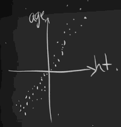
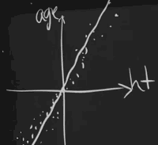
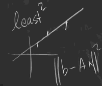
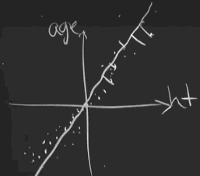
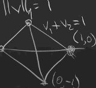
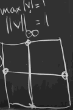
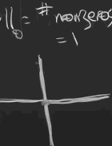
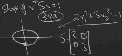
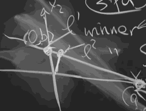

...menustart

- [7. Eckart-Young Theorom: The Closest Rank k Matrix to A](#be169639777f78c45acc00459de99b34)
- [8. Norms of Vectors and Matrices](#c11692a0ef1ef228ebc27714963e1a10)
    - [Vector Norm](#ac51b675b7483e2af8045938d2ab7ebd)
    - [Matrix Norm](#181b5cf4aead0210fe81f3b8639db471)

...menuend

<h2 id="be169639777f78c45acc00459de99b34"></h2>

# 7. Eckart-Young Theorom: The Closest Rank k Matrix to A

- PCA  principal component analysis
- We have a big matrix, we want to get the important information, not all the information.
- The important information are in its larget k singular values.
    - Ak = σ₁u₁v₁ᵀ + ... +  σkukvkᵀ
    - Ak uses the first k pieces of the SVD, is the best approximation to A of rank k.
- To measure how big a matrix is : norm of A 
    - ‖A‖₂
        - The l2 norm is the largest singular value: ‖A‖₂ = σ₁
    - ‖A‖F
        - Frobenius norm = √( |a₁₁|²+...+|a₁n|² + ... + |amn|² )
    - ‖A‖Nuclear = σ¹+σ₂+...+σᵣ
- For those 3 norms , the statement of approximation to A is true.

- norm of a vector
    - ‖v‖₂  is the length
    - ‖v‖₁  = |v₁| + ... + |vn| 
    - ‖v‖∞ = max |vᵢ| 
- What's the PCA about ?
    - We have a bunch of data, points in the 2d plane, height & age
    - I want to find the relationship between height and age.
    - First of all, those points are all over the place. So the first step that a statistician does is to get mean 0, get the average to be 0.
        - The I'm going to subtract the matrix A by the mean value( height mean and age mean  respectively ). 
    - and somehow, I've got a whole lots of points , but hopefully , their mean is now 0.
        - 
        - You see that I've centered the data at (0,0)
    - what am I looking for here? I'm looking for the best line . 
        - 
    - That's what I want to find.  And that would be a problem in PCA. What's the best linear relation. Because PCA is limited. PCA isn't all of deep learning by any means. The whole success learning of deep learning had to have a nonlinear function in there to get to model serious data.  But here's PCA as a linear business.
    - And you will say, wait a minute, I know how to find the best line, just use least squares. 
        - Least square , I don't always center the data to mean 0, but I could.  Least square minimizes the errors. 
            - 
        - The difference is , in PCA, you're measuring perpendicular distance to the line.
            - 
            - involve the SVD, the σ's
    - Now we have make the mean 0, what's the next step? What else does a statistician do with data ? to measure size ? or variance ? 
        - somehow we're going to do variances. 
        - Because we have 2 sets data -- heights and ages. We're really going to have a **covariance**.  Here we will have a 2x2 covariance matrix. and it will exactly be AAᵀ (or AᵀA?). And you have to normalize it by the number of data points, N ,  AAᵀ/N.  For some reason, -- best known to statisticians -- , it's N-1 , AAᵀ/(N-1). Because somehow 1 degree of freedom was accounted for when we make the mean 0.
    - Since we're looking for the best line , like age = c·height, I'm looking for the number c. 
        - The answer is got to be there in the SVD.

<h2 id="c11692a0ef1ef228ebc27714963e1a10"></h2>

# 8. Norms of Vectors and Matrices

A norm is a way to meause the size of a vector, or the size of a matrix, or the size of a tensor, whatever we have.

<h2 id="ac51b675b7483e2af8045938d2ab7ebd"></h2>

## Vector Norm

- ‖v‖p = ( v₁ᵖ+ ... + vnᵖ )1/p

p | vector norm ‖v‖p  | geometry of ‖v‖p=1 in 2D space
--- | ---  | ---
2  |  √( v₁²+ ... + vn² )  | unit cycle
1  |  ⎸v₁⎹ + ... + ⎸vn⎹    | a diamond, 
∞  | max  ⎸vᵢ⎹    | a square, 
0  |  = number of non-zero components | the axis except (0,0), 
S  | √(vᵀSv) -- square root of energy, S is spd |  ellipse, 

--- 

- Question: Ax = b  in 2D space
    - what's the minimized x for ‖x‖₁ and ‖v‖₂ ?
    - 
    - the winner of l₂ norm is then intersect of l₂ norm circle and the line
        - you start at the origin, and you blow up the norm circle until you get a point on the line
    - the winner of l₁ norm lies on the l₁ norm diamond

- Question: 
    - 

<h2 id="181b5cf4aead0210fe81f3b8639db471"></h2>

## Matrix Norm

p | matrix norm ‖A‖p 
--- | --- 
2  | σ₁
F  | √( add all aᵢⱼ² ) = √(σ₁²+ ... +σᵣ²)
N  | σ₁+ ... +σᵣ

- ‖A‖₂ = max (‖Ax‖₂ / ‖x‖₂) , for all x
    - why is σ₁ the answer ?
    - winner x is v₁, the first singular vector.
- ‖A‖F  , Frobenius
    - why √( add all aᵢⱼ² ) = √(σ₁²+ ... +σᵣ²) ?
    - A = U∑Vᵀ , U and V are orthogonal, they makes no difference in norm.
- ‖A‖N  , Nuclear
    - In a typical deep learning problem these days, there are many more weights than samples, and so there are a lot of possible minima. Many different weights give the same minimum loss because there are so many weights.  The problem is , like, got too many variables. 
    - Prof. Srebro belives that in a model situation, that optimization by gradient descent, picks out the weights that minimize the nuclear norm. 

