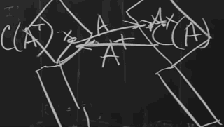
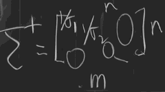
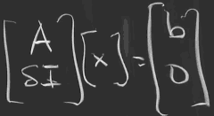
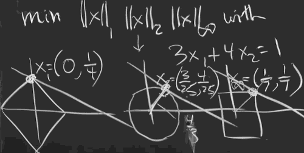

[](...menustart)

- [9. Four Ways to Solve Least Squares Problems](#cd91567113bfdbbb8c6014e9d4ce56aa)
    - [1. Pseudo Inverse A⁺](#152539916b795b52e222ab4ab2f80411)
    - [Solve AᵀA = Aᵀb](#404da86b1a7f49d3c053d3fb71cde1f8)
    - [3. Orthogonalize first](#f8994b41680b4328f1915bd33e9bbb09)
- [10. Survey of Difficulties with Ax = b](#c335fe9d2fa388abf174d141554cc33b)
    - [CASE 5: Nearly singular](#64b2cdc7ceaff615cd42024f90807cb6)
- [11. Minimizing _x_ Subject to Ax = b](#81bee2c07692edb98670b4a3f9eba493)
    - [Column Pivoting Possible](#058fcc5fc321707927a1930f00b4e842)
    - [Krylov-Arnoldi](#c304d8d41594af497badcc7d015fbf3a)
- [12. Computing Eigenvalues and Singular Values](#8ef630f106e9229153a73a4e9b801e7a)

[](...menuend)


<h2 id="cd91567113bfdbbb8c6014e9d4ce56aa"></h2>

# 9. Four Ways to Solve Least Squares Problems


1. Pseudo Inverse A⁺
    - works for any matrix
2. Solve AᵀA = Aᵀb
    - works when A has independent columns
3. Orthogonalize first
    - Gram-Schmidt
4. (AᵀA + δ²I)x = Aᵀb

---

<h2 id="152539916b795b52e222ab4ab2f80411"></h2>

## 1. Pseudo Inverse A⁺

- A mxn, A⁺ nxm
    - x in row space is going to column space, it is invertible
        - what does A⁺ is to take vector in column space back to row space.
        - 
    - x in null space is to (0,0), it is not invertible
        - since A⁺ can only take vector in N(Aᵀ) back to (0,0)
    - A⁺A is identity on the top half, and 0 on the bottom half.

- Now I want a simple formular for it.
    - If we were looking for a nice expression, start with the SVD, 
    - if A is invertible, A⁻¹ = V·1/∑·Uᵀ 
    - if A is not invertible, now ∑ is not invertible,  A⁺ = V·∑⁺·Uᵀ
        - 
        - **x = A⁺b** = V·∑⁺·Uᵀ·b


<h2 id="404da86b1a7f49d3c053d3fb71cde1f8"></h2>

## Solve AᵀA = Aᵀb

- Minimize ‖Ax-b‖² = (Ax-b)ᵀ(Ax-b) = xᵀAᵀAx - 2bᵀAx + bᵀb
    - this is the loss function
- What equation is solved by the best x ?
    - Solution: 
        - if **A has independent columns**, N(A)=0 , then AᵀA is invertible, then
        - AᵀAx̂ = Aᵀb
        - x̂ = (AᵀA)⁻¹Aᵀb
    - most examples, if A is not very big or very difficult, you just create AᵀA and use matlab or octave to solve it quickly.
    - But what if it is difficult to create AᵀA ?  e.g. A has dependent columns.
- What if A has dependent columns ?
    - use A⁺
    - We are going to connect AᵀAx̂ = Aᵀb  to A⁺. 
    - Claim: 
        - A⁺b = (AᵀA)⁻¹Aᵀb  , **when N(A)=0**, i.e. rank=r
        - V∑⁺Uᵀ = (AᵀA)⁻¹Aᵀ

<h2 id="f8994b41680b4328f1915bd33e9bbb09"></h2>

## 3. Orthogonalize first

- the same requirement of N(A)=0.


<h2 id="c335fe9d2fa388abf174d141554cc33b"></h2>

# 10. Survey of Difficulties with Ax = b

0. x = A⁺b , pseudo inverse
    - an answer for all cases
1. x = A⁻¹b
    - good, normal case 
    - size ok, condition σ₁/σ<sub>n</sub> ok ( ratio of min σ and max σ )
    - octave: A\b
2. m > n = ***rank***
    - AᵀAx̂ = Aᵀb
    - A\b still works
3. `m < n`
    - underdetermined case, don't have enough equations, so I have to put something more in to get a specific answer
    - **typical of deep learning**. 
        - There are so many weights in a deep neural network, the weights will be the unknowns, it wouldn't be linear. 
        - we have many solutions, and we have to pick 1, or we would pick an algorithm to find 1. 
        - a good solution means when you apply it to the test data it gives you good result. That's the big question in deep learning: how does an algorithm bias the solution toward that generalizes, that works on test data ? 
    - So we could pick the minimum norm solution, the shortest solution would be the l2 answer. 
        - Or we could go l1. The big question is that does depp learning and the iteration from stochastic gradient descent go to the minimum l1 ?
4. columns in bad condition, nearly dependent
    - Gram-Schmidt  A = QR
    - we can do Gram-Schmidt ways normally , just like in 18.06. 
        - Or do column pivoting.  You allow yourself to reorder them.
5. Nearly singular, singular value is very close to 0
    - Inverse problem. You're in dange, its inverse is gonna be unreasonably big.
    - The world of inverse problems thinks of adding a penalty term.
    - min ‖Ax-b‖₂² + δ²‖x‖₂²    (use l2 norm)
6. Too big
    - Iterative Method: You never get the exact answer, but you get closer and closer.
7. Way too big
    - giant giant matrix, which is happening these days.
    - randomized linear algebra has popped up. The idea is to use probability to sample the matrix, and work with you samples.


<h2 id="64b2cdc7ceaff615cd42024f90807cb6"></h2>

## CASE 5: Nearly singular

- The matrix is nearly singular. So you could apply  elimination, but it would give a poor result. 
- So one solution is the SVD.
    - A⁻¹ = VΣ⁻¹Uᵀ
    - But nearly singualr means σ has some very small singular value. And the Σ⁻¹ has some very big singular values. So you're really in wild territory here with very big inverse.
- min ‖Ax-b‖₂² + δ²‖x‖₂²   is a way to regularize the problem.
    - It's going to be a least square with penalty
    - We actually solve the least square problem on a new matrix 
    - 
    - ( AᵀA + δ²I )x = Aᵀb
        - x = ( AᵀA + δ²I )⁻¹Aᵀ
    - when δ → 0, x = A⁺b


<h2 id="81bee2c07692edb98670b4a3f9eba493"></h2>

# 11. Minimizing _x_ Subject to Ax = b

- Recall
    - 
    - Why do I mention this?
        - First, because when I did it before I just draw pictures without really solving the problem.
        - And secondly, because in thinking ahead about projects, this is the kind of project that I would think is quite interesting. As *p* increases (1->2->∞),  the point starts up here (0, 1/4), and moves down the line, and ends up here (1/7, 1/7).
        - To make it more of a project, what happens in 3D ? In 3D, if I have a equation in 3D, then I have a plane. And these norms would become a 3D diamond, a sphere, a cube, they would expand to hit that plane.  Or you can have 2 equations, then you got a line.

- Gram-Schmidt  A = QR
    - aₓ:column vector, Aₓ:perpendicular vector, qₓ:normalized Aₓ
    - q₁ = a₁/‖a₁‖
    - q₂ 
        - A₂ = a₂ -(a₂ᵀq₁)q₁ 
        - q₂ = A₂/‖A₂‖
    - q₃
        - A₃ = a₃ -(a₃ᵀq₁)q₁ -(a₃ᵀq₂)q₂
        - q₃ = A₃/‖A₃‖
- Here, I took the a's in their original order. But we could make a better Gram-Schmidt.
    - The problem is, if a₂ is very close a₁, A₂ is gonna be very tiny.

<h2 id="058fcc5fc321707927a1930f00b4e842"></h2>

## Column Pivoting Possible

Idea: Column Exchange

If A has a tiny little a₁, then I should look for a bigger one to get the very first q₁ chosen.  But let's suppose A₁ was a decent size.

For a₂, I have to be able to compare this q₂ with all the other potential possibilities.

How to decide q₂:

A₂ should be chosen betwwen all possibilities, look at them all, and I'm going to take the largest and that will be A₂ that I want.

```
    a₂ - (a₂ᵀq₁)q₁
    a₃ - (a₃ᵀq₁)q₁
    ...
```

You might think, wait a minute, this is a heck of a lot more work. But it itn't. It isn't actually more work, because these are all the things that we had to do eventually anyway.

Now we can move to A₃.


<h2 id="c304d8d41594af497badcc7d015fbf3a"></h2>

## Krylov-Arnoldi

Ax = b. A is a big matrix, pretty big. Of course, I don't plan to invert it. That would be insane. 

What I can do with the matrix A , especially if it's **sparse**,  would be a good candidate for Krylov.

b,Ab,A(Ab), ... , Aʲ⁻¹b , the combinations give Krylov space *Kⱼ*. Now I'm going to look for the best solution in that Krylov space.

xⱼ = the closest vector in this Krylov space Kⱼ.  So I know what the space is, I've reduced the dimension down to j, and I can find this best vector. But this basis that I'm working with could be very very dependent. That might be a terrible basis.  We hope the basis are orthogonalized. That's where Arnoldi comes in.


<h2 id="8ef630f106e9229153a73a4e9b801e7a"></h2>

# 12. Computing Eigenvalues and Singular Values


