...menustart

- [MIT S6191, Deep Learning](#f116aafd0ac2c33054fe0b2220fff999)
- [Lecture 1 : Intro](#7571e94e9960582145f94d7fbceac96d)
    - [Fundamentals of Deep Learning](#882cce400ea6815dec4b6a157dab7253)
    - [How do we build neural networks with perceptrons?](#20b50b357f447578f0eb0a92b8572479)
    - [Training Neural Networks](#2f89dcf6a5cb1586f393dff1f636e86c)
    - [Training Neural Networks In Practice](#469fdf8a17a30399d48905940e2d3495)
    - [Training Neural Networks In Practice 2: MiniBatches](#21c449704c125fc952b10f4ffd022c1f)
    - [Training Neural Networks In Practice 3: Fighting Overfitting](#e70a3e602f9bc4ee8901e4c0cb6fe643)
- [Lecture 2 : Sequence Modeling with Neural Networks](#cfbbf757778ad2df29a62a798b172b63)
    - [how do we model sequences?](#b5e9f30832182b11c10313379438da5b)
    - [how do we train an RNN?](#a71db179cb1a8655fb494133f79c535a)
    - [why are RNNs hard to train?](#ab33d2e55a6ebd5e4c71fe57baaa6087)
- [Lecture 3:    Deep Computer Vision](#025402f9c315331049c668ea7be76a62)
    - [Famous Computer Vision Datasets](#24aa0335724bdc6a5a27223d3549b946)
    - [Convolutional Neural Networks](#6ce916fc429bf02b2897f166fd592ac5)
    - [Convolutional Neural Networks: Layers](#d0a817f7b8f356e5100a34f135766419)
    - [什么是卷积？](#005649cd0b2e95b1a940c55e7698a998)
    - [Convolution](#fa0f0ae43fdca46d1d68255409ec0b89)
    - [Convolution: Representation Learning](#d7d278172ca7a83e10e19938b70aabaf)
    - [ConvNets: Pooling](#2bf7644c7479fcd2c8907f2b13e3b07e)
    - [Why ReLU ?](#fe2d632388e0d217878437554a365016)
    - [Object Recognition](#0bc3fe8a34ad082c47547245bee64457)
        - [Case Study: ImageNet](#917dabfd4adecc2a3396519bfa5d6b5b)
        - [Same Architecture, Many Applications](#0cfa6b933928d71f5576ec0898641745)
- [Lecture 6 :](#25a8f28fe0cf18103a3886ba04919923)
    - [ENTER THE DEEP](#097467a8f22176b837dd18af3a2a7abd)
    - [Q-Learning](#e4d17333d58040b1db710abe36cd5aec)
    - [The problems with Q-learning](#1993886ff857bdbc2ac91977e678a3c5)

...menuend

<h2 id="f116aafd0ac2c33054fe0b2220fff999"></h2>

# MIT S6191, Deep Learning

http://introtodeeplearning.com/schedule.html

<h2 id="7571e94e9960582145f94d7fbceac96d"></h2>

# Lecture 1 : Intro

- Why Deep Learning ?
    - Deep learning is powerful because it is able to learn powerful feature representations in an unsupervised manner.

<h2 id="882cce400ea6815dec4b6a157dab7253"></h2>

## Fundamentals of Deep Learning
 
- Perceptron Forward Pass
    - 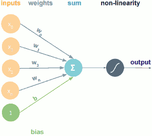
    - output = g(XW +b)
- Comon Activation Functions
    - 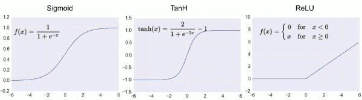

<h2 id="20b50b357f447578f0eb0a92b8572479"></h2>

## How do we build neural networks with perceptrons?

- How do we build neural networks with perceptrons ?
    - Perceptrons are the base of every neural network
    - we need to stack them , put them together in order to actually build these things
    - Perceptron Diagram Simplified 
        - 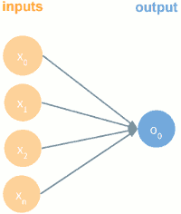
    - Multi-Output Perceptron
        - 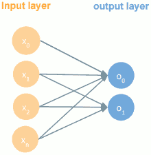
    - Multi-Layer Perceptron (MLP)
        - 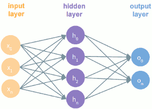
    - Deep Neural Network
        - 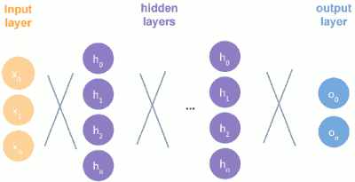

<h2 id="2f89dcf6a5cb1586f393dff1f636e86c"></h2>

## Training Neural Networks

- Stochastic Gradient Descent (SGD)
    - the loss function is with respect to every training sample
    - while for batch Gradient Descent , the loss function is with respect to the whole training set.
- Calculating the Gradient: Backpropagation
    - 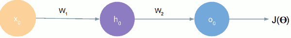
    - 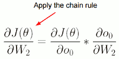
    - 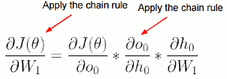

<h2 id="469fdf8a17a30399d48905940e2d3495"></h2>

## Training Neural Networks In Practice

- Loss function can be difficult to optimize
    - How to Choose Learning Rate?
        - Small Learning Rate 
            - many iterations unitl convergence
            - trapping in local minima
        - Large Learning Rate
            - overshooting
    - How to deal with this?
        1. Try lots of different learning rates to see what is ‘just right’
            - time-consuming and may not be the best use of our resources
        2. Do something smarter : Adaptive Learning Rate
            - no fixed learning rate
            - gonna consider learning rates that can adapt and change based on how the learning is going
- Adaptive Learning Rate
    - Learning rate is no longer fixed
    - Can be made larger or smaller depending on:
        - how large gradient is
        - how fast learning is happening
        - size of particular weights
        - etc
- Adaptive Learning Rate Algorithms
    - ADAM, Momentum, NAG, Adagrad, Adadelta, RMSProp
- Escaping Saddle Points
    - with a fixed learning rate we can really get stuck in a saddle point , while other adaptive learning rate can recognize that we're in a saddle point and escape pretty quickly by increasing the leraning rate. 
    - 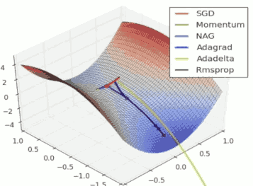

<h2 id="21c449704c125fc952b10f4ffd022c1f"></h2>

## Training Neural Networks In Practice 2: MiniBatches

- Stochastic Gradient Descent issue
    - we are only looking at one example to get each gradient so this is a pretty non consistent and kind of stochastic representation of our loss and gradient. 
    - it's not a very reliable and consistent learning singal 
- Minibatches Reduce Gradient Variance
    - more accurate estimate of gradient  
- Advantages of Minibatches
    - More accurate estimation of gradient
        - Smoother convergence
        - Allows for larger learning rates
    - Minibatches lead to fast training!
        - Can parallelize computation + achieve significant speed increases on GPU’s

<h2 id="e70a3e602f9bc4ee8901e4c0cb6fe643"></h2>

## Training Neural Networks In Practice 3: Fighting Overfitting

- Sometimes NNet can be a little bit too powerful and they can either overfit or maybe memorize training examples.
- Regularization Techniques
    1. Dropout
        - During training, randomly set some activations (hidden layer nodes) to 0
            - Typically ‘drop’ 50% of activations in layer
            - Forces network to not rely on any 1 node
        - that is , choose random nodes and remove them from the network. and we compute our loss and we do gradient updates  
        - and essentially what we're doing here is we're making each of our nodes not very reliable. We want our network to not rely too much on any one node. 
    2. Early Stopping
        - Don’t give the network time to overfit
        - when you reach a point at which the training accuracy goes up, but the validation actually goes down. and it continues to go down.
        - early stopping essentially is just kind of keep track of how well the validation is doing and you just kind of stopping the training once it starts doing worse.
        - it is really simple technique and it works really well in practice.
        - 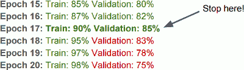
        - 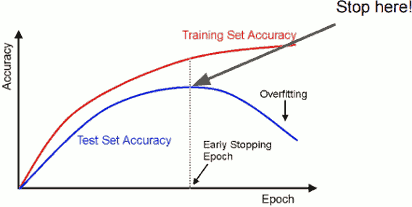
    3. Weight Regularization
        - Large (big) weights typically mean model is overfitting
            - big weights means rely too much on nodes??
        - Add the size of the weights to our loss function
        - Perform well on task + keep weights small
        - J(θ) = loss **+ λ·∑ⱼ(θⱼ)²**
    4. ...many more
 
---

<h2 id="cfbbf757778ad2df29a62a798b172b63"></h2>

# Lecture 2 : Sequence Modeling with Neural Networks

What if each training sample itself consisted of multiple data points, and those data points were somehow related or dependent on each other. 

- What is a sequence? 
    - sentence : “I took the dog for a walk this morning.”
        - a sentence consists of multiple words, and each words is dependent on other words in the sentence
    - function : sinx
    - speech waveform 
- Successes of deep models 
    - Machine translation
    - Question Answering

<h2 id="b5e9f30832182b11c10313379438da5b"></h2>

## how do we model sequences? 

- idea: represent a sequence as a bag of words
    - all a bag of words means is that we have this fixed length feature vector , each slot represents a word and the number in that slot represents the number of times that word happens in the sentence. 
    - 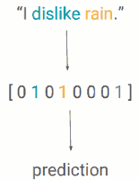
- problem: bag of words does not preserve order
    - “The food was good, not bad at all.”  
    - vs
    - “The food was bad, not good at all.”
    - they are completely different semantics meetings but in their bag of words representation, they would be exactly the same because they contain the same set of words. 
- idea: maintain an ordering within feature vector 
    - 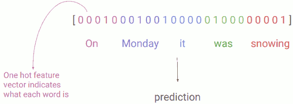
- problem: hard to deal with different word orders
    - “On Monday, it was snowing.” 
    - vs
    - “It was snowing on Monday.”
    - these mean the exact same thing, but if we look at their representations, they're completely different.
        - 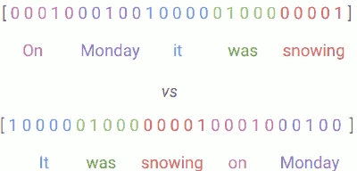
    - We would have to **relearn the rules of language** at each point in the sentence.

A way to solve it is by sharing parameters across our sequence. So once we learn something like the fact that "on Monday" represents a time or a setting we can resus that fact later on in the sentence. 

- idea: markov models
    - 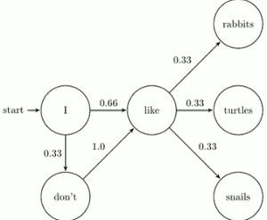
- problem: we can’t model long-term dependencies
    - **markov assumption**: each state depends only on the last state. 
    - This is a kind of problem for complex sequences like natural language or speach waveforms. 
        - “In **France**, I had a great time and I learnt some of the `____` **language**.”
        - We need information from the far past and future to accurately guess the correct word.
- let’s turn to **recurrent neural networks**! (RNNs)
    1. to maintain **word order**
    2. to **share parameters** across the sequence
    3. to keep track of **long-term dependencies**
- RNN
    - the key difference is that each of those hidden units is just doing something a little bit different. 
    - each hidden unit in addtion to computing a function of the input , also computes a function of its own previous output
    - in this way it's able to keep track of things that have happened in the past. 
- RNNS **remember** their previous state:
    - 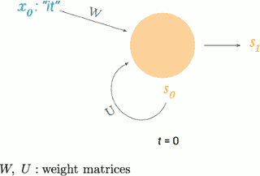
        - x₀: vector representing first word
        - s₀: cell state at t=0 (some initialization)
        - s₁: cell state at t=1
            - s₁ = tanh( Wx₀ + Us₀ )
    - 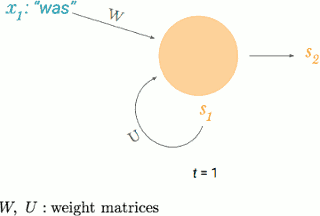
        - x₁: vector representing second word
        - s₁: cell state at t=1 (some initialization)
        - s₂: cell state at t=2
            - s₂ = tanh( Wx₁ + Us₁ )
- “unfolding” the RNN across time: 
    - 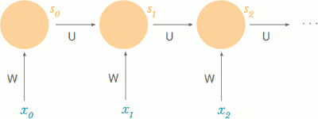
    - the orange circle is the same hidden unit just at different points in time.
    - at each time step it takes in a new word and it calculates the next output of the hidden unit based on that new word and its own previous output. And it just continues doing this throughout time. -- I say time but it also means, if we have a sentence , like the word in the sentence or the point that we're in the sentence. 
    - **notice that W and U stay the same** through out the sequence. 
        - this solves one of the key problem about sharing parameters throughout the sequence. 
    - **sn can contain information from all past timesteps**
        - solves the problem about remembering information from far back in the sequence.
- possible task: language model 
    - all the works of shakespeare
        - -> language model ->
        - KING LEAR: O, if you were a feeble sight, the courtesy of your law, Your sight and several breath, will wear the gods With his heads, and my hands are wonder'd at the deeds, So drop upon your lordship's head, and your opinion Shall be against your honour.
    - 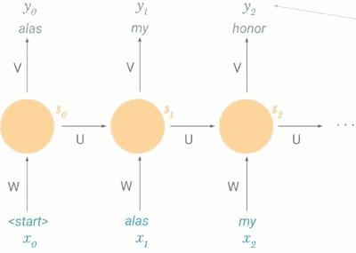
    - yᵢ is actually a probability distribution over possible next words, aka a softmax 
        - given that I'm at the start of a sentence what is the most likely next word ?  alas
        - now given that I've seen "alas" what's the most likely next word ? my
        - given that I've seen "alas my"  what's the most likely next word ? honor. 
- possible task: classification (i.e. sentiment)
    - say we have a bunch of tweets and we want to just determine whether they're good or bad or neutral. 
    - 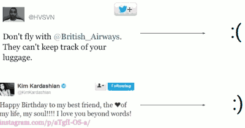
    - 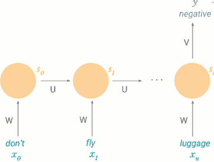
        - y is a probability distribution over possible classes (like positive, negative, neutral), aka a softmax 
- possible task: machine translation
    - encoder/decoder model 
    - 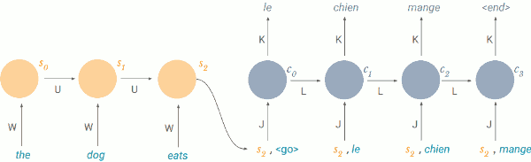
    - 2 different RNNs. first is known as an encoder.

<h2 id="a71db179cb1a8655fb494133f79c535a"></h2>

## how do we train an RNN? 

- remember: backpropagation
    1. **take the derivative** (gradient) of the loss with respect to each parameter
    2. **shift parameters in the opposite direction** in order to minimize loss
- we have a loss at each timestep:
    - since we’re making a prediction at each timeste
    - we're not just making a prediction at the end. Oftentimes we're doing something at each time step and making prediction.
    - 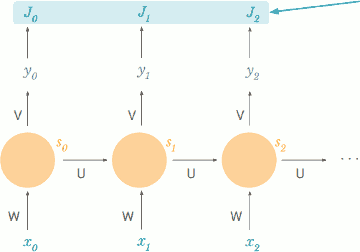
        - loss at each timestep
- we **sum the losses** across time:
    - loss at time t = Jt(Θ)
    - total loss = J(Θ) = ∑ Jt(Θ)
- what are our gradients? 
    - we sum gradients across time for each parameter P:
        - 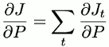
- let’s try it out for W with the chain rule: 
    - 
    - 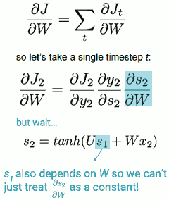
- how does s₂ depend on W? 
    - 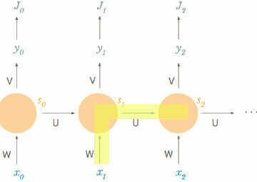
    - 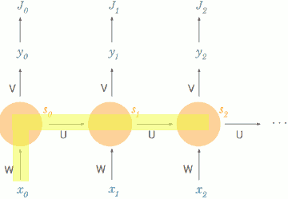
    - 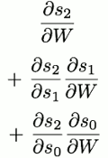
- backpropagation through time: 
    - 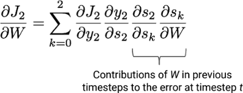

<h2 id="ab33d2e55a6ebd5e4c71fe57baaa6087"></h2>

## why are RNNs hard to train? 

It is because of this annoying problem called the vanishing gradient.

- problem: vanishing gradient
    - 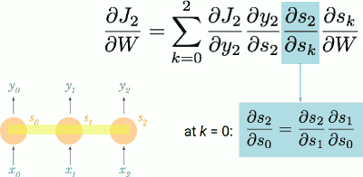
        - the term ∂s₂/∂sk itself is also a chain rule.
    - 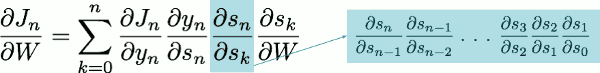
    - 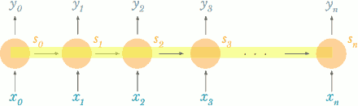
        - as the gap between timesteps gets bigger, this product gets longer and longer!
        - what are each of these ∂ terms ?
            - 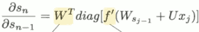
            - W = sampled from standard normal distribution = mostly < 1> 
            - f = tanh or sigmoid so f’ < 1
        - we’re multiplying a lot of **small numbers** together. 
            - what this means is that errors due to further back timesteps have increasingly **smaller gradients**
            - so parameters become biased to **capture shorter-term** dependencies.
        - “In **France**, I had a great time and I learnt some of the `____` **language**.”
            - our parameters are not trained to capture long-term dependencies, so the word we predict will mostly depend on the previous few words, not much earlier ones

- solution #1: activation functions
    - choose ReLU: prevents f’ from shrinking the gradients
    - 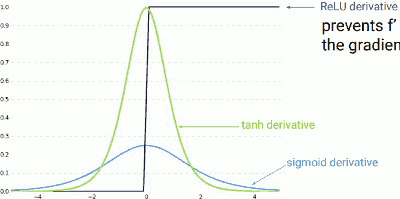
- solution #2: initialization
    - weights initialized to identity matrix , biases initialized to zeros
    - prevents W from shrinking the gradients
- solution #3: gated cells 
    - rather each node being just a simple recurrent cell, make each node a more **complex unit with gates** 
        - a gated unit basically controls what the information is passed through , prevent the vanishing gradient problem.
        - LSTM: long short term memory  
        - GRU: gated recurrent units
    - 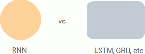
- solution #3: more on LSTM
    - LSTM is very similar to a recurrent cell , it takes in a cell state and output the next cell state based on that.
    - but there is just some additional steps in between. 
        1. forget irrelevant parts of previous state
            - for example, if I'm modeling a sentence and I see a new subject I might choose to forget I might choose to forget the old subject.Because I know that the next verb will be conjugated according to the new subject.
        2. selectively update cell state values
            - if the new subject is singular and masculine 男性单数 I might want to update my cell state so it knows that. Because I know that will be relevant information to the next verb that I ought to conjugating the next verb.
        3. output certain parts of cell state
            - there might be certain things that I want to keep in the cell state that are not relevant to the output at this time.
            - so say I have the word "France" in my cell state , I might want to keep it there but not output it , because it won't be relevant to this current word that I'm predicting. But it will be relevant at some furture time. 
            - in this way I'm able to hold on to things without them contributing to the loss at that time step.
- why do LSTMs help? 
    1. forget gate allows you forgot certain information but also remember it and let it  **pass through unchanged**
        - when taking the derivative, f’ is 1 for what we want to keep!
    2. sⱼ depends on sⱼ₋₁ through **addition**! (middel step)
        - when taking the derivative, not lots of small W terms!
- in practice: machine translation.
    - basic encoder-decoder model
    - add LSTM cells
    - problem: a fixed-length encoding is limiting  
        - 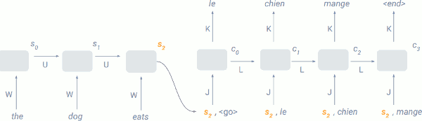
        - all the decoder knows about the input sentence is in one fixed length vector, s₂
    - solution: attend over all encoder states
        - we're attending over all of the encoder states 
        - so the feature vector that's fed in to our decoder , that's telling our decoder what the original sentence was about is not just the last cell state , but a weighted sum of all of the cell states , from the encoder 
        - 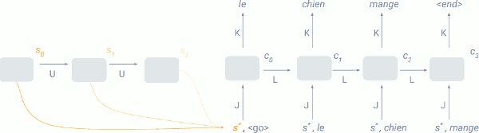
            - if we're decoding the first word , we might choose to put most of the weight on the first cell state from the encoder, because that's most probably what's most relevant. 
        - 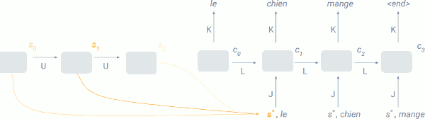
            - then we're decoding the second word, we might put most of the weight on the second cell state , but maybe a little bit on the first cell state.
        - 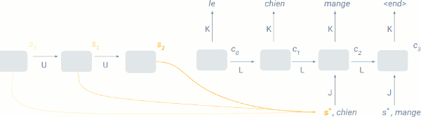
            - and so on and so forth. 
        - and those weight that we use to create this weighted sum are just learned along with the rest of our parameters in the model using backpropagation. They just come part of our data. 

---

- now we can model sequences!
    - why recurrent neural networks?
    - building models for language, classification, and machine translation
    - training them with backpropagation through time
    - solving the vanishing gradient problem with activation functions, initialization, and gated cells (like LSTMs)
    - using attention mechanisms
- and there’s lots more to do!
    - extending our models to timeseries + waveforms
    - complex language models to generate long text or books
    - language models to generate code
    - controlling cars + robots
    - predicting stock market trends
    - summarizing books + articles
    - handwriting generation
    - multilingual translation models
    - … many more!

---

<h2 id="025402f9c315331049c668ea7be76a62"></h2>

# Lecture 3:    Deep Computer Vision

<h2 id="24aa0335724bdc6a5a27223d3549b946"></h2>

## Famous Computer Vision Datasets

- MNIST: handwritten digits
- ImageNet: WordNet hierarchy
- CIFAR-10(0): tiny images 
- Places: natural scenes

<h2 id="6ce916fc429bf02b2897f166fd592ac5"></h2>

## Convolutional Neural Networks

- CNN have a volumn , a 3d volumn.
    - 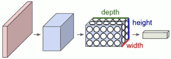
    - Each layer takes a 3d volume, produces 3d volume with some smooth function that may or may not have parameters.
 
<h2 id="d0a817f7b8f356e5100a34f135766419"></h2>

## Convolutional Neural Networks: Layers 

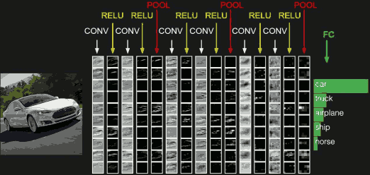

> 卷积神经网络各个层级结构

- 最左边是数据输入层
    - 对数据做一些处理，比如去均值（把输入数据各个维度都中心化为0，避免数据过多偏差，影响训练效果）,  归一化（把所有的数据都归一到同样的范围）,PCA/白化等等。
    - CNN只对训练集做“去均值”这一步
    - INPUT [32x32x3] will hold the raw pixel values of the image, in this case an image of width 32, height 32, and with three color channels R,G,B
- 中间是
    - CONV：卷积计算层，线性乘积 求和
        - CONV layer will compute the output of neurons that are connected to local regions in the input, each computing a dot product between their weights and a small region they are connected to in the input volume. This may result in volume such as [32x32x12] if we decided to use 12 filters.  
    - RELU：激励层
        - RELU layer will apply an elementwise activation function, such as the max(0,x) thresholding at zero. This leaves the size of the volume unchanged ([32x32x12]).
    - POOL：池化层，简言之，即取区域平均或最大
        - POOL layer will perform a downsampling operation along the spatial dimensions (width, height), resulting in volume such as [16x16x12].
- 最右边是
    - FC：全连接层

<h2 id="005649cd0b2e95b1a940c55e7698a998"></h2>

## 什么是卷积？

- 对 **图像**（不同的数据窗口数据） 和 **滤波矩阵** 做内积的操作就是所谓的『卷积』操作
    - 滤波矩阵是 一组固定的权重：因为每个神经元的多个权重固定，所以又可以看做一个恒定的滤波器filter
    - The parameters on **a each filter** are spatially “shared”
        - (if a feature is useful in one place, it’s useful elsewhere)
- filter
    - 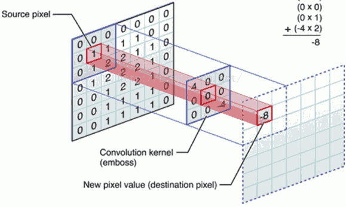
    - 多个滤波器叠加便成了卷积层
- 不同的滤波器filter会得到不同的输出数据
    - 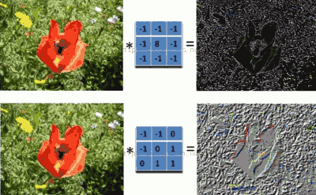
- 卷积参数
    - a. 深度depth：神经元个数，决定输出的depth厚度。同时代表滤波器个数。
    - b. 步长stride：决定滑动多少步可以到边缘。
    - c. 填充值zero-padding：在外围边缘补充若干圈0，方便从初始位置以步长为单位可以刚好滑倒末尾位置，通俗地讲就是为了总长能被步长整除。 
    - 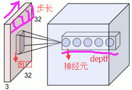
- 卷积过程
    - 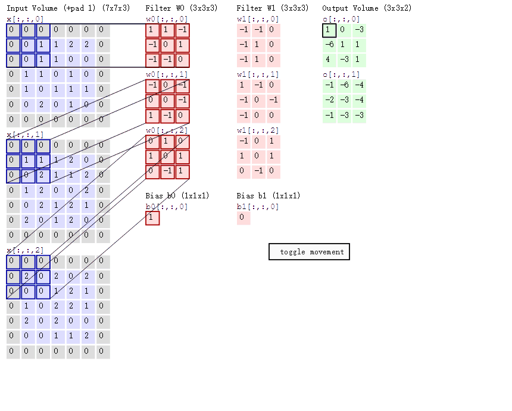
        - 两个神经元，即depth=2，意味着有两个滤波器。
        - 数据窗口每次移动两个步长取3\*3的局部数据，即stride=2。
        - zero-padding=1。
    - 分别以两个滤波器filter为轴滑动数组进行卷积计算，得到两组不同的结果
  

<h2 id="fa0f0ae43fdca46d1d68255409ec0b89"></h2>

## Convolution

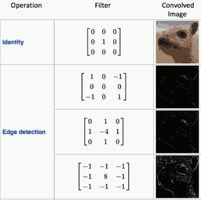

<h2 id="d7d278172ca7a83e10e19938b70aabaf"></h2>

## Convolution: Representation Learning

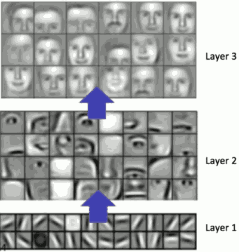

What CNNs are is a composition of these filters. 

- layer1 are very primitive filter -- edges 
- layer2
    - then you start composing those features together for higher and higher order representation of features to form corners -- in this case  parts of face 
- layers : entire faces.

<h2 id="2bf7644c7479fcd2c8907f2b13e3b07e"></h2>

## ConvNets: Pooling

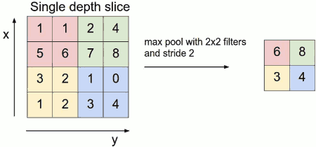

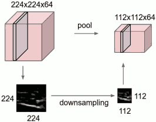

- Pooling is an operation that reduces the size of the input and the output. and there is most importantly no learnable weights on this operation.
- pool 就是 取区域平均或最大(max pool)

<h2 id="fe2d632388e0d217878437554a365016"></h2>

## Why ReLU ?

- sigmoid 在实际梯度下降中 容易饱和、造成终止梯度传递。且没有0中心化。
- ReLU的优点是收敛快，求梯度简单。
- 所以sigmoid 一般只用于 全链接层

<h2 id="0bc3fe8a34ad082c47547245bee64457"></h2>

## Object Recognition

<h2 id="917dabfd4adecc2a3396519bfa5d6b5b"></h2>

### Case Study: ImageNet

<h2 id="0cfa6b933928d71f5576ec0898641745"></h2>

### Same Architecture, Many Applications

---

<h2 id="25a8f28fe0cf18103a3886ba04919923"></h2>

# Lecture 6 : 

<h2 id="097467a8f22176b837dd18af3a2a7abd"></h2>

## ENTER THE DEEP

- the output is the Q value : Q(s,a)

<h2 id="e4d17333d58040b1db710abe36cd5aec"></h2>

## Q-Learning

<h2 id="1993886ff857bdbc2ac91977e678a3c5"></h2>

##  The problems with Q-learning

- Restrictive Assumptions
- Handles long horizons poorly
- Requires a simulator

