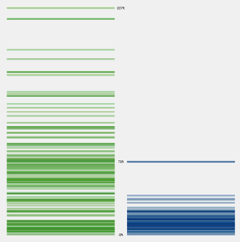
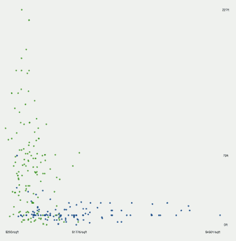
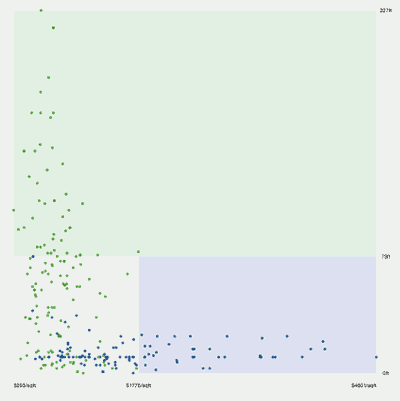
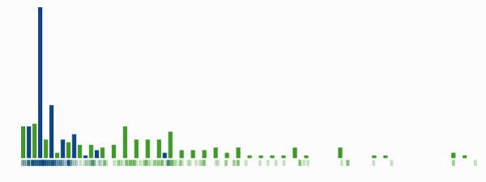

...menustart

 - [可视化机器学习](#1a707f470b9e4cfebf46c49e3ac8f884)
     - [首先，一些说明](#95222815983f24a38e523221d436da92)
     - [添加细微差别](#f0119c0f423ac97c1fa8c55ca802f568)
     - [绘制边界](#7570dae765c32ff749fbaffdb8599355)
     - [现在开始，机器学习](#ccb307de2d5a5fd1943618f258240771)
     - [找 更好的边界](#1609925f411c6f0db46a7266ee722afc)
     - [你的第一个fork](#80ab4d0fad5a889616d4b65cd37e6304)
     - [最佳分割](#0679f038c3c0fdb5fbd04d5f4392a77a)
     - [递归 Recursion](#1897ba128c18979cc66485f188b04b6d)

...menuend

<h2 id="1a707f470b9e4cfebf46c49e3ac8f884"></h2>

-----
-----

# 可视化机器学习

原帖  [A Visual Introduction to Machine Learning](http://www.r2d3.us/visual-intro-to-machine-learning-part-1/)

本文中，我们将创建一个 机器学习模型，来区分一个房屋是 纽约的还是 旧金山的。  

<h2 id="95222815983f24a38e523221d436da92"></h2>

-----

## 首先，一些说明
---
你现在需要去 判断一幢房屋 是旧金山(绿色)的，还是纽约(蓝色)的。  
对机器学习而言，对数据点进行归类， 称为 分类 *classification* 。  

旧金山是丘陵地区，海拔相对较高，所以房屋的海拔高度，会是区分两个城市的好方法。  

根据右图的房屋海拔数据，你可以说，海拔超过73英尺的房屋，是旧金山的房屋。  

<h2 id="f0119c0f423ac97c1fa8c55ca802f568"></h2>

-----

## 添加细微差别
---
添加另一个维度 可以获得更多细微差别。 例如，纽约的公寓 每平方英尺价格非常高。  
房屋海拔 和 每平方英尺价格的 散点图， 将帮助我们 区分低海拔的房屋。  

该数据表明，海拔低于73英尺的房屋中，那些 每平方英尺 超过1776美元的 房屋在 纽约。  

维度 Dimensions 在 数据集data set中 被称为 特征features, 预测predictors, 或变量variables.

<h2 id="7570dae765c32ff749fbaffdb8599355"></h2>

-----

## 绘制边界
---
可以按照 海拔（>73英尺） 和每平方英尺（>1776美元）在散点图划出区域。  
绿色和蓝色区域 的房子，分别位于 旧金山和纽约 。  

确定边界，是 data using 数学中， 统计学习的本质。  

当然，你仍然 需要更多的信息来区分  低海拔和 低的每平方英尺价格 房屋。  

我们用来创建训练模型的数据集有7个不同的维度，  
海拔，建造时间, 卫生间数，卧室数，总价，面积，每平方英尺价格
每对维度之间的 边界都不是很明显。  

<h2 id="ccb307de2d5a5fd1943618f258240771"></h2>

-----

## 现在开始，机器学习
---
发现数据中的模式，就是机器学习的 用武之地。 机器学习 使用 统计学习来 确定边界。  

一个机器学习的例子就是 决策树。  
决策树一次 查看一个变量，是一个可行的机器学习方法。  

<h2 id="1609925f411c6f0db46a7266ee722afc"></h2>

-----

## 找 更好的边界
---
让我们回过头，重新看看之前定的 海拔73英尺的边界。 看看能否直观的改善它。  
显然，这需要不同的角度。  
我们把高度图 （图1） 转为 直方图 histogram。  

我们可以更好地看到，房屋 在各个海拔高度上 出现的频率 。  

可以看到， 纽约最高的房屋为73英尺， 但大多数的房屋，都远远低于这个高度。

<h2 id="80ab4d0fad5a889616d4b65cd37e6304"></h2>

-----

## 你的第一个fork
---
`要了解 更多关于 计算最佳分割，搜索“基尼系数”或“交叉熵”。  `
决策树使用if-then语句来定义 模式。    

例如，如果一个房屋的海拔高于某个数字，则可能是在旧金山。  

在机器学习，这些语句被称为fork， 它们使用 某些值，来把数据 分割为两个分支。  
这些值被称为 分割点 split point。   
分割点是 边界的 决策树版本。  

<h2 id="0679f038c3c0fdb5fbd04d5f4392a77a"></h2>

-----

## 最佳分割
---
最好的分裂的情况下，各分支的结果 应尽可能的 均匀或纯净。  
有几个方法，可以用来计算最佳分割。  

然而，即便是最好的单一分割，也没法正确的分离数据。  

<h2 id="1897ba128c18979cc66485f188b04b6d"></h2>

-----

## 递归 Recursion
添加另一个分割点，在数据子集上 重复上述算法过程。  
这种重复被称为递归，是经常出现在训练模型中的 概念。  

根据你所处的分支，数据子集的最佳分割会有非常大的不同。  
forks的增加，可以提高决策树的预测精度。  

每一个维度对于分割数据起的作用各不一样，有的维度甚至没有作用，如果决策数把一些作用很小，甚至没有的作用的维护也一视同仁的进行观察，就会出现 过度拟合 overfitting 。  

过度拟合是 机器学习的一个基本概念的一部分，我们将在我们的下一篇文章解释。  
It's the bias/variance tradeoff!
