...menustart

- [Recommender Systems](#bd1e9577d90cd9b99bbc584f4899cdd3)
    - [Predicting Movie Ratings](#ae4850a11bf72fcf96312dbdaa01416a)
        - [Problem Formulation](#d3ed97478e5bb62df6a73642fb3eb2cf)
            - [Example: Predicting movie ratings.](#91256a34c3c416ed111c1c1f0f6d0cf8)
        - [Content Based Recommendations](#a71ae4758962a9d66c5eed0209ee7790)
    - [Collaborative Filtering 协同过滤](#1d0676de81840f76265b22da2bd66cfe)
        - [Optimization algorithm](#89642905e18066000c83d4fadf9e16d6)
    - [Collaborative Filtering Algorithm](#bda473b95d57bd8ddf09a8e81b15dd0c)
    - [Low Rank Matrix Factorization](#f97e45631aaf46ad6a70583cf84aeacd)
        - [Vectorization](#ccc5742e475a0775e47cf832d54606d2)
            - [Finding related movies](#2c5b941c4e8f1f592ca82323d7a0ed07)
        - [Implementational Detail: Mean Normalization](#4ea68a58b5d62dbfb35eec3f95eb7494)

...menuend


<h2 id="bd1e9577d90cd9b99bbc584f4899cdd3"></h2>


# Recommender Systems

<h2 id="ae4850a11bf72fcf96312dbdaa01416a"></h2>


## Predicting Movie Ratings

<h2 id="d3ed97478e5bb62df6a73642fb3eb2cf"></h2>


### Problem Formulation

推荐系统是 machine learning 最重要的应用之一。

Machine learning 界有一个宏大的目标: 自动地替你学习到一组优良的特征量，从而避免手动挑选特征，如我们一直在做的那样。推荐系统就是自动学习特征的例子之一。

<h2 id="91256a34c3c416ed111c1c1f0f6d0cf8"></h2>


#### Example: Predicting movie ratings.

User rates movies using 0 to 5 stars.

> 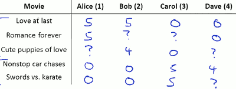

我们引入一些符号：

- nᵤ = number of users, here nᵤ＝4
- n_m = number of movies, here n_m= 5
- r(i,j) = 1 if user j has rated movie i
- `y⁽ⁱ,ʲ⁾` = rating by user j on movie i (defined only if r(i,j)=1) 

推荐系统的问题就是，给定这些数据，预测这些 `?` 地方的rating。

 
<h2 id="a71ae4758962a9d66c5eed0209ee7790"></h2>


### Content Based Recommendations 

> 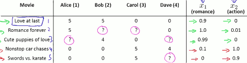

我们假设对每部电影，都用一些特征来描述，比如: x₁=romance 表示爱情片程度, x₂=action 表示动作片程度. 有了这些特征，每部电影可以用一个特征矩阵表示，如 x⁽¹⁾＝[1; 0.9; 0] 。 

For each user j, learn a parameter `θ⁽ʲ⁾` ∊ ℝ³ (θ其实就是用户对电影内容的偏好). Predict user j as rating movie i with `θ⁽ʲ⁾ᵀ·x⁽ⁱ⁾`.

因此我们做的所有事，实际上就是对每个用户应用不同的线性回归模型。

- `θ⁽ʲ⁾` = parameter vector for user j
- `x⁽ⁱ⁾` = parameter vector for movie i
- For user j, movie i, predicted rating: `θ⁽ʲ⁾ᵀ·x⁽ⁱ⁾`
- `m⁽ʲ⁾` = number of movies rated by user j (我们就只在这里使用这个定义1次)

For learn `θ⁽ʲ⁾`, to min J:

> 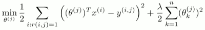
 
注意，这个代价方法和我们线性回归的cost function 有略微的区别, 前面不再是乘上 1/(2m), 而是 1/2。完全按照线性回归的标准做法, 方差项和正则项前面应该是 `1/(2m⁽ʲ⁾)` , 因为 `m⁽ʲ⁾` 会比较麻烦，所以整个cost function 乘上  `m⁽ʲ⁾`, 把这个分母消掉，方便计算。

For all user's `θ⁽¹⁾`,`θ⁽²⁾`,...,`θ⁽ⁿᵘ⁾`, to min J:

> 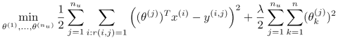

Gradient descent update:

> 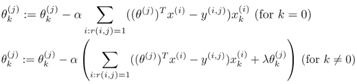

可以看到，基于内容的推荐，是线性回归的一个变种。 它的关键是假设我们有不同电影的内容的特征。事实上，我们很难得到所有电影的特征，这就需要一种 不基于内容的推荐系统。


<h2 id="1d0676de81840f76265b22da2bd66cfe"></h2>


## Collaborative Filtering 协同过滤

Collaborative filtering has a very interesting property that it does what is called feature learning.

现在假设我们已经不知道 每部电影的 feature x₁,x₂ , 我们找到每个user， 并且每个用户告诉我们 他们对动作电影／爱情电影的喜欢程度。 That is , each user J just tells us what's value of `θ⁽ʲ⁾` for them. 

If we can get these parameters θ from users then it turns out that it becomes possible to try to infer (推理) what are the values of x₁,x₂ for each movie.

<h2 id="89642905e18066000c83d4fadf9e16d6"></h2>


### Optimization algorithm

Give `θ⁽¹⁾,θ⁽²⁾,...,θ⁽ⁿᵘ⁾` , to learn `x⁽ⁱ⁾`:

> 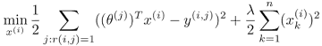

To lean all x :

> 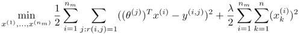

---

现在我们已经知道，有了x，就能计算θ； 或者有了θ，我们就能算出x。

实际上你能做的是，随机猜 θ的值， 用你随机猜测的θ初始值，计算出不同电影的特征x； 有了x,就可以对参数θ作更好的估计； 有了更好的θ, 就可以得到更好的电影特征x , ... , 最终算法会收敛到一组合理的电影特征。 这就是基本的协同过滤算法，但还不是我们最终会采用的算法，我们会有更高效的改进算法。

`θ -> x -> θ -> x -> ...`

<h2 id="bda473b95d57bd8ddf09a8e81b15dd0c"></h2>


## Collaborative Filtering Algorithm

前面我们看到可以重复的计算θ 和 x 来估计特征，实际上，有一个更好的算法，能够讲θ和x同时计算出来。

将上面的两个 优化目标函数，结合为一个，

Minimizing `x⁽¹⁾,x⁽²⁾,...,x⁽ⁿᵐ⁾` and `θ⁽¹⁾,θ⁽²⁾,...,θ⁽ⁿᵘ⁾` simultaneously: 

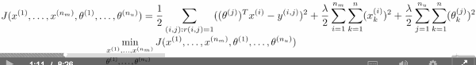

可以看到，原来的两个 优化函数的左半部分被合并了。 这个算法和前面的算法之间的唯一不同是不需要反复计算。

```
// pesudo code
D = ( X * Theta'   - Y ).* R ;
J = 0.5* sum( sum( D.^2 ) ) ;
J += 0.5* lambda * sum( sum( X.^2 ) ) ;
J += 0.5* lambda * sum( sum( Theta.^2 ) ) ;
```

很重要的一点，当我们用这种方法去学习特征时，我们必须去掉bias项: x₀=1. 所以在这个算法里， 我们学习的 x ∊ ℝⁿ and also θ ∊ ℝⁿ .

Steps:

 1. Initialize `x⁽¹⁾,x⁽²⁾,...,x⁽ⁿᵐ⁾` and `θ⁽¹⁾,θ⁽²⁾,...,θ⁽ⁿᵘ⁾` to small random value (symmetry breaking)
 2. Minimize J( x⁽¹⁾,x⁽²⁾,...,x⁽ⁿᵐ⁾,θ⁽¹⁾,θ⁽²⁾,...,θ⁽ⁿᵘ⁾ ) using gradient descent (or and advanced optimization algorithm). Eg for every j=1,...,n_u , i=1,...,n_m :
  > 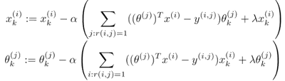

 3. For a user with parameter θ and a movie with (learned) feature x, predict a star rating of θᵀx .

```
// 矩阵相乘 包含了 Σ
X_grad = ( D* Theta ) + lambda* X ;
Theta_grad = ( D'* X ) + lambda * Theta ;
grad = [X_grad(:); Theta_grad(:)];
```
 
---

<h2 id="f97e45631aaf46ad6a70583cf84aeacd"></h2>


## Low Rank Matrix Factorization

<h2 id="ccc5742e475a0775e47cf832d54606d2"></h2>


### Vectorization 

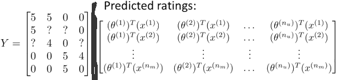

用户 j 对 电影 i 的评分，可以用上面的矩阵来表示, 其中，矩阵元素为 `(θ⁽ʲ⁾)ᵀ·x⁽ⁱ⁾`

另：

我们可以把 这个矩阵向量化为 XΘᵀ.


<h2 id="2c5b941c4e8f1f592ca82323d7a0ed07"></h2>


#### Finding related movies

我们使用协同过滤算法得到了 电影的feature 后，其实还有其它一些事情可做，就是查找近似的电影。

How 2 find movie j related to movie i ?  

small `‖x⁽ⁱ⁾ - x⁽ʲ⁾‖` -> movie j and i are "similar".


<h2 id="4ea68a58b5d62dbfb35eec3f95eb7494"></h2>


### Implementational Detail: Mean Normalization

假设有一个新用户 Eve(5)，没有对任何电影做评分， 协同过滤算法最后结果，就是Eve(5)对所有电影的评分都是0.

为了让算法对新用户表现的好一点，我们可以对评分做 Mean Normalization处理,

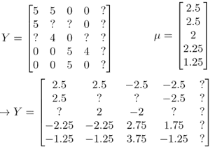

所以每个电影 在新矩阵Y中的平均评分都是0， 对这个新的评分数据集使用协同过滤算法， for user j , on movie i predict:  `(θ⁽ʲ⁾)ᵀ·x⁽ⁱ⁾ + μᵢ` , 这样没有评分的用户, 对某部电影的评分就会是 平均分，而不是 0 ， that make more sense.

However , unlike some other applications of feature scaling, we did not scale the movie rating by dividing by the rage(max-min value). This is because all the movie rating are already comparable (eg. 0-5 stars) , so they are already on similar scales.

---


