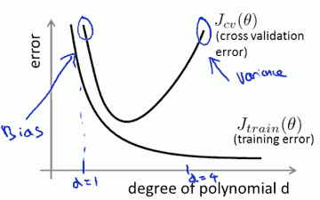
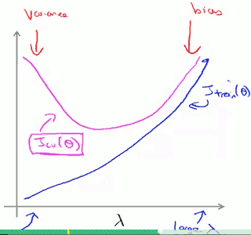
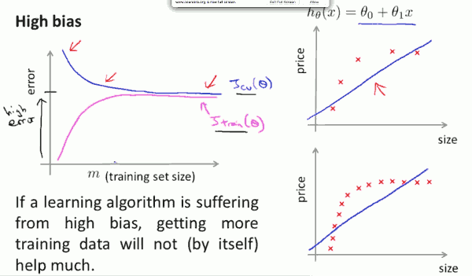
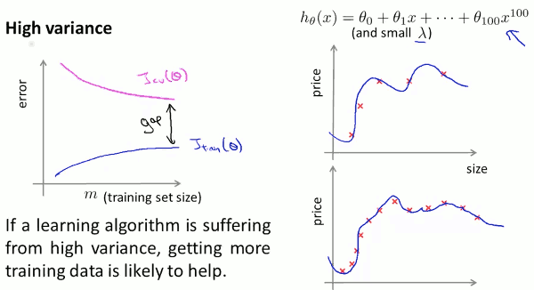

...menustart

- [Advice for Applying Machine Learning](#68d3cfbbc89d95b35d0d45b599f6cf74)
    - [Evaluating a Learning Algorithm](#3ec179b6c0e3e96ee6b0629d4c3b92ac)
        - [Evaluating a hypothesis](#b9af6d27e0fe127a70b5f0104eb1aeb2)
        - [training/testing procedure](#8a9c44e950f9cc7463bb7b9ac3d17180)
        - [Model Selection and Train/Validation/Test Sets](#2f0617787b3e1c5f3b6b37a52cbd7ed1)
    - [Bias vs. Variance](#a52f9a77971bc5c163e9040d5142a50a)
        - [Diagnosing Bias vs. Variance](#713d2bd98e92803db5e42aa3e39895e1)
        - [regularization in high-order polynomial](#322ae1bc590fce3811ec460541460d63)
        - [choosing the regularization parameter λ](#6ec33b8ff0734363f1d6bf897c1709cb)
        - [Learning Curve](#1d88cab8749545f0c0c6efe16d64c780)
        - [What should you try next ?](#bea09adf1a4b8e8ccb2a6f3cd2d04e84)

...menuend

<h2 id="68d3cfbbc89d95b35d0d45b599f6cf74"></h2>

# Advice for Applying Machine Learning

<h2 id="3ec179b6c0e3e96ee6b0629d4c3b92ac"></h2>

## Evaluating a Learning Algorithm

<h2 id="b9af6d27e0fe127a70b5f0104eb1aeb2"></h2>

#### Evaluating a hypothesis 

- split the data we have into 2 portions.
    - The 1st portion is going to be our usual training set. (70%)
    - The 2nd portion is going to be our test set. (30%)
- It there is any sort of ordinary to the data. That should be better to shuffle training/test set randomly.

<h2 id="8a9c44e950f9cc7463bb7b9ac3d17180"></h2>

#### training/testing procedure

- Learn parameter θ from training data.
- use θ to compute test set error 
    - for linear regression : 
        - error = J(θ) (with out regularization)
    - for logistic regression:   
        - set  err( h(x), y ) = (h(x)>=0.5, y=0 or h(x)<0.5, y=1) and 1 or 0
        - error = 1/m_test ∑ err( h(x_test), y_test )

<h2 id="2f0617787b3e1c5f3b6b37a52cbd7ed1"></h2>

#### Model Selection and Train/Validation/Test Sets

- Try serveral models with different degree of polynomial , such as:
    - d=1, h(x)=θ₀+θ₁x
    - d=2, h(x)=θ₀+θ₁x+θ₂x²
    - ...
    - d=10, h(x)=θ₀+θ₁x+ ... +θ₁₀x¹⁰

- split the data into 3 pieces.
    - 1st part, training set  (60%)
    - 2nd part, cross validation (CV) set  (20%)
    - 3rd part, test set  (20%)

- Learn parameter θ from training data.
- compute CV set error , pick the best model with lowest error.
- estimate generalization error for test set.
    
    
<h2 id="a52f9a77971bc5c163e9040d5142a50a"></h2>

## Bias vs. Variance

<h2 id="713d2bd98e92803db5e42aa3e39895e1"></h2>

#### Diagnosing Bias vs. Variance

BiasVsVariance.png

- Bias(underfit)
    - J(θ) of train set will be high,
    - J(θ) of CV also will be high.
    - J_train ≈ J_cv
    
- Variance(overfit)
    - J(θ) of train set will be low,
    - J(θ) of CV also will be high.
    - J_cv >> J_train

<h2 id="322ae1bc590fce3811ec460541460d63"></h2>

#### regularization in high-order polynomial

λ    |        θ    |    fitting result
---|---|---
small (eg.0)    | no penalty      |      High variance (overfit)
intermediate     |            |    just right
large (eg.100) | heavily penalized → 0 | High Bias(underfit)

---

<h2 id="6ec33b8ff0734363f1d6bf897c1709cb"></h2>

#### choosing the regularization parameter λ

- Try serveral different λs. eg. λ=0 , λ=0.01, λ=0.02, λ=0.04  , ... , λ=10.24 (start from no regularization, and with *2 step )
- minimize J_train(θ) with regularization and computer the parameter θ with each λ
- computer the J_cv(θ) with the different θ (without regularization), and pick the best θ with lowest error (eg. θ₄)
- see how θ₄ works on test set (without regularization 既然已经计算出θ了，就不需要正则了).

---

train / CV set affected by λ:

---

<h2 id="1d88cab8749545f0c0c6efe16d64c780"></h2>

#### Learning Curve

Plot learning curve give you a better sense of whether there is a bias or variance problem, or a bit of both.

---

**For** variance problem, if you provide more and more training sample, J_train / J_cv may be `converge` to each other.

--- 
- learn paramete θ from training subset (i.e., X(1:n,:) and y(1:n))
- compute the training set error on training subset
- compute CV set error over the **entire** cross validation set

使用Learning Curve 确定是bias 还是variance，Jtrain 和 Jcv随着样本数m的增加最终收敛到一起，说明是bias，增加m并不能解决high bias的问题。

<h2 id="bea09adf1a4b8e8ccb2a6f3cd2d04e84"></h2>

#### What should you try next ?

--- 

you implemented regularization linear regression to predict housing prices. 

But you find your hypothesis make unacceptable large errors in its prediction.

What should you try next ?

- Get more training examples  -> fix high variance
- Try smaller sets of features  -> fix high varinance
- Try getting additional features -> fix high bias
- Try adding polynomial features  -> fix high bias
- Try decreasing λ    -> fix high bias
- Try increasing λ    -> fix high variance

---

**neural network** case:

"small" neural network (fewer parameters): more prone to underfitting.

eg. 2-3-1 newwork , it's computationally cheaper.

`fewer parameters means fewer hidden layer, fewer hidden units`

"large" neural network (more parameters): more prone to overfitting.

eg.2-10-1 , 2-5-5-5-1, it's computationally more expensive.

**Using** a `large` neural network ,and using regularization(λ) to address overfitting, is often more effective than using a smaller neural network.

