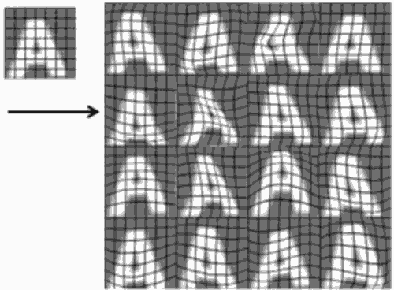

...menustart

- [Photo OCR](#e65885a24642ea6caa9b4cc3fa9648d4)
    - [Problem Description and Pipeline](#c05b00495e12d4e6e63699b01eef0e5f)
        - [Photo OCR pipeline](#c75bffa5028e099b547517e79ecbedb6)
    - [Sliding Windows](#a413de0b7d3ca5e448aa7c58535e57ef)
        - [Supervised learning for pedestrian detection](#059f4dd0bafb0e73889c8660d52c1a5c)
        - [Sliding window detection](#45cc6d3b5bf3f3b586155dcbc5e04d88)
        - [Text detection](#69b71ae7534d013b30aa980fedf1d6fd)
        - [1D Sliding window for character segmentation](#e55dfb0a899b9302b944074fbd127e65)
    - [Getting Lots of Data and Artificial Data](#f6c38a87532bcba6d340d665a5f4db8b)
        - [Artificial data synthesis for photo OCR](#d44110b04e334d5138f9080526090261)
        - [Synthesizing data by introducing distortions: Speech recognition](#d0489633abcc536d20de1ac15bc32041)
        - [Synthesizing data by introducing distortions](#3cac9850b41b50b8e4c44d5de7de1148)
        - [Discussion on getting more data](#aaf61b0c47bdfa1a04301b1e0efb7b17)
    - [Ceiling Analysis: What Part of the Pipeline to Work on Next](#3157909fcba2bb0204f25acba117af96)
        - [Estimating the errors due to each component(ceiling analysis)](#fa04582d22d410df441e1c1170299998)
- [Summary: Main topics](#97ac67a319b4892c162d49f2693870de)

...menuend

[TOC]

<h2 id="e65885a24642ea6caa9b4cc3fa9648d4"></h2>

## Photo OCR

<h2 id="c05b00495e12d4e6e63699b01eef0e5f"></h2>

### Problem Description and Pipeline

Photo optical character recognition 照片光学字符识别

<h2 id="c75bffa5028e099b547517e79ecbedb6"></h2>

#### Photo OCR pipeline

 1. Text detection
    - find the regions where there's text and image
 2. Character segmentation
    - segment the text into the locations of the individual characters.
 3. Character classification
    - 识别每个字符 
 
<h2 id="a413de0b7d3ca5e448aa7c58535e57ef"></h2>

### Sliding Windows

<h2 id="059f4dd0bafb0e73889c8660d52c1a5c"></h2>

#### Supervised learning for pedestrian detection
 
 - 照片中找出行人
 - x = pixels in 82x36 image patches
    - 可能是行人y=1, 可能不是y=0

<h2 id="45cc6d3b5bf3f3b586155dcbc5e04d88"></h2>

#### Sliding window detection

 - 从照片中获取82x36区域, 判断是否是行人
 - add a step size/stride,  move the windows
 - scan through the image
 - use a bigger windows, re-size the window content to 82x36,...

<h2 id="69b71ae7534d013b30aa980fedf1d6fd"></h2>

#### Text detection

现在从行人改为text. 发现text的地方使用白色块，否则黑色，这样就得到了一张黑白图。最后，通过expansion处理，使得白块区域变大邻接起来。

<h2 id="e55dfb0a899b9302b944074fbd127e65"></h2>

#### 1D Sliding window for character segmentation

如何分割字符？ 还是使用 sliding window

 - y=1, 图像块中间有分隔线
 - y=0, 图像块中间没有分隔线

<h2 id="f6c38a87532bcba6d340d665a5f4db8b"></h2>

### Getting Lots of Data and Artificial Data

要想获得一个高效的机器学习系统，一种最可靠的方法就是，选择一个 low bias的算法，然后用一个巨大的训练集来训练它。

但是从哪里去获得那么多的训练数据呢？ 有一个很棒的想法，叫做人工合成数据: artificial data synthesis.

 - create data from scratch
 - turn small training data set to a large set

<h2 id="d44110b04e334d5138f9080526090261"></h2>

#### Artificial data synthesis for photo OCR

 - 选择任意的字体，然后加上随机的背景，这样就可以获得一个大的data set。
    - 还可以加上模糊操作，让图像变形：缩放，旋转等
 - 对既有训练集进行变形 
    -  

<h2 id="d0489633abcc536d20de1ac15bc32041"></h2>

#### Synthesizing data by introducing distortions: Speech recognition

假如说你有一段音频片段,你希望通过对这段音频的学习,识别出这段音频中,出现了哪些单词。

 - original audio
 - 通过加入不同的干扰(背景噪音)，制造出不同的训练样本
    - audio on bad cellphone connection
    - noisy background: Crowd
    - noisy background: Machinery
 

<h2 id="3cac9850b41b50b8e4c44d5de7de1148"></h2>

#### Synthesizing data by introducing distortions

 - Distortion introduced should be representation of the type of noise/distortions in the test set
 - Usually does not help to add purely random/meaningless noise to your data
    - 比如，对字符图像的像素加上随机的高斯噪音，这么做并没有什么实际意义。
    - 变形后的样本，应该是在某些场合下，确实会出现的，是有意义的。

<h2 id="aaf61b0c47bdfa1a04301b1e0efb7b17"></h2>

#### Discussion on getting more data

 1. Make sure you have a low bias classifier before expending the effort.(Plot learning curves)
    - eg. keep increasing the number of features/number of hidden units in neural network until you have a low bias classifier
 2. How much work would it be to get 10x as much data as we currently have ?
    - Artificial data synthesis
    - Collect/label it yourself
 3. "Crowd source" 众包
    - eg. Amazon Mechanical Turk

<h2 id="3157909fcba2bb0204f25acba117af96"></h2>

### Ceiling Analysis: What Part of the Pipeline to Work on Next

上限分析

<h2 id="fa04582d22d410df441e1c1170299998"></h2>

#### Estimating the errors due to each component(ceiling analysis)

Image -> Text detection -> Character segmentation -> Character recognition

What part of the pipeline should you spend the most time trying to improve ?

 - 思想
    - text detection 为例，给测试集样本捣点乱，对每一个测试集样本 都给它提供一个正确的文字检测结果。
        - 我们要遍历每个测试集样本，然后人为地告诉算法 每一个测试样本中什么地方出现了文字
        - 换句话说，我们是要模拟如果是100%正确地检测出图片中的文字信息 应该是什么样的
        - 人为地识别出 测试集图像中出现文字的区域
        - 这样最重的算法准确率应该会有所提升，eg.72%->89%
    - 接下来，对Character segmentation 也人为给出正确检测结果，假设最后准确旅从 89% 升到 90%
    - 最后，对Character recognition也给出正确检测结果。这时正确率应该是100%
 - 现在我们知道了，如果对每一个模块进行改善，他们各自的上升空间有多大
    - 如果我们拥有完美的文字检测模块，那么整个系统的表现将会从准确率72%上升到89%, 收益是17%
    - 

Component | Accuracy
--- | ---
Overall system | 72%
Text detection | 89%
Character segmentation | 90%
Character recognition | 100%

---

<h2 id="97ac67a319b4892c162d49f2693870de"></h2>

## Summary: Main topics

 - Supervised Learning
    - Linear regression, logistic regression, neural networks , SVMs 
 - Unsupervised Learning
    - K-means, PCA, Anomaly detection 
 - Special applications/special topics
    - Recommender systems, large scale machine learning 
 - Advice on building a machine learning system
    -  Bias/varance, regularization; deciding what to work on next: evaluation of learning algorithms, learning curves, error analysis, ceiling an analysis.

    
 

        
    
 
