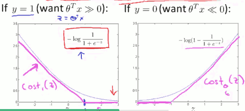
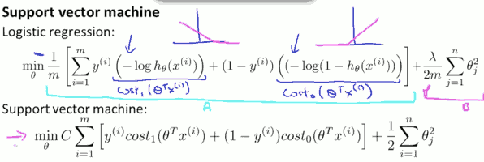
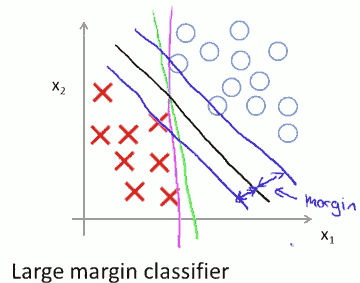
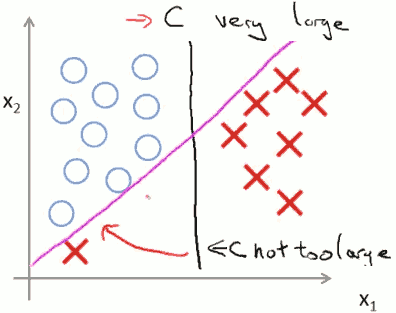
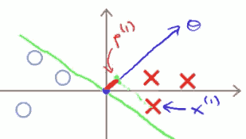
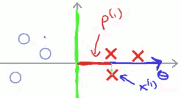
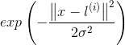
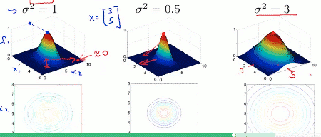
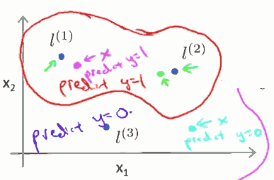
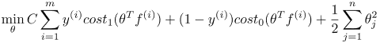

...menustart

 - [Support Vector Machines 支持向量机](#8cf67260d126306abf039891edbeb656)
     - [Large Margin Classification](#2852f2bf2273669c892942a4632b5e1f)
         - [SVM 代价函数](#f07329befbc19c84368187cc64f74fb5)
         - [SVM Decision Boundary: Linearly separable case](#1d58ae7ced4876c25af27337543af7eb)
         - [Large margin classifier in presence of outliers](#d045e7981854a7e1024a50e8fffa4f30)
         - [Mathmatics behind large margin classification](#f21ea9d3806d08ffc3fa5223b97063bc)
     - [Kernels I  核函数](#aadfb04cedbdd18ddacda45fe038881a)
         - [Non-linear Decision Boundary](#c6a4dd2a31e83a1c296bebebf5fea30f)
     - [Kernels II](#e3a358193b95ac6eef55c51c9075c131)
         - [choosing the landmarks](#af23d091de03c5f83c374172daf63cea)
         - [SVM parameters](#3930a1467c8ad5a6fa62e45b57a8cb66)
     - [SVMs in Practics](#fc8227001da7daa8afa88151aa3948d2)
         - [Using an SVM](#c03a9274f234c4e466bc0a0c3ac19425)
         - [Multi-class classification](#c6b78dc7cf73796a127893a56b9d4341)
         - [Logistic regression vs. SVMs](#98ab568d1ca127e48f38a822cb48b68c)
     - [Spam email filter](#438255910c46d15b146ef8ddeed92ce1)
         - [Processing emails](#92a7047ae19e8b71ab2eda1cf656c06e)
         - [Vocabulary List](#25905cc6484f60a1d812453a49e5e156)

...menuend


<h2 id="8cf67260d126306abf039891edbeb656"></h2>


# Support Vector Machines 支持向量机

SVM 在学习复杂的非线性方程时，提供了一种更清晰更强大的方法

<h2 id="2852f2bf2273669c892942a4632b5e1f"></h2>


##  Large Margin Classification

我们看一下 logistic regression 的代价函数 J 和 z( θᵀx )的函数图：



与逻辑回归不同, SVM 使用2条直线（粉红色）来近似地替代 log函数。

---

<h2 id="f07329befbc19c84368187cc64f74fb5"></h2>


#### SVM 代价函数

和logistic regression 代码函数相比，SVM 的代价函数，有几个变化:

 1. 不在需要求均值, 1/m 被去掉
 2. logistic regression 的 A+λB 的形式改成等价的 CA+B , C可以理解为 1/λ
 3. 左边求和部分，负号内移


如图:



在逻辑回归中，我们一般使用 θᵀx >=0 来区分正负样本，SVM 中，区分会更加严格：

 - y=1, θᵀx >=1 
 - y=0, θᵀx <= -1

---

<h2 id="1d58ae7ced4876c25af27337543af7eb"></h2>


#### SVM Decision Boundary: Linearly separable case

Linearly separable case： (数据集是)线性可分, 既用一条直线可以区分正负样本。

存在很多的直线，可以分离样本。

`margin of SVM:`



SVM会 尽量使用最大的 margin 来分离样本。

<h2 id="d045e7981854a7e1024a50e8fffa4f30"></h2>


#### Large margin classifier in presence of outliers

大间距分类器有时会受到 异常点(outliers) 的影响, 如图：



仅仅因为1个异常点，就将决策边界从黑线变为红线 是不明智的。事实上，如果SVM 正则化参数 设置的过大，就会出现这个问题。

如果C 设置的不是过大，那么，决策边界依然会保持 黑线形状。

解释: C 很大，效果类似 λ 很小，过拟合。


<h2 id="f21ea9d3806d08ffc3fa5223b97063bc"></h2>


#### Mathmatics behind large margin classification

代价函数的正则化项，其实就是 θᵀθ， 而对于决策边界 θᵀx, 其实也就是 向量θ 和 向量x的点积，也就是 x在θ上的有向投影p的长度和 θ长度的积。

所以:

```
p⁽ⁱ⁾·‖θ‖ >=1,   if y=⁽ⁱ⁾1;
p⁽ⁱ⁾·‖θ‖ <=-1,   if y=⁽ⁱ⁾0;
```

可以看到，要满足上面的case，如果P长度很小，则要求θ长度够大，如果P长度很大，则θ就可以较小。而我们代码函数是一个最小化的过程，所以SVM的目标就是是 p长度最大化。

就是为什么SVM不会选择第一幅图的决策边界(绿色)的原因:





说明:

 1. 图示是只有两个feature的情况，且θ₀＝0，所以只有[θ₁,θ₂]
 2. θ 正交与决策边界 (why?)


<h2 id="aadfb04cedbdd18ddacda45fe038881a"></h2>


## Kernels I  核函数

<h2 id="c6a4dd2a31e83a1c296bebebf5fea30f"></h2>


#### Non-linear Decision Boundary

构造一个非线性决策边界，一个做法是使用ploynomial特征变量，但是使用polynomial运算量会非常大。

SVM 使用完全不同的做法，来创建 新的feature (假设我们要创建3个feature f₁,f₂,f₃):

在training set 中找3个不同的点(landmark), 记为 `l⁽¹⁾,l⁽²⁾,l⁽³⁾`.

对于每个x ，计算新的feature f (高斯核函数)：

`fᵢ = similarity( x , l⁽ⁱ⁾ )`

= 

 - 当 x 接近 landmark 的时候， f ≈1
 - 当 x 远离 landmark 的时候， f ≈0

所以， f 是 度量 x 与 landmark l 远近程序的值。

高斯核参数的影响:



landmark 点和θ的作用：

假设如下3个landmark，我们使用 θ₀+θ₁x₁+θ₂x₂+θ₃x₃ >= 0 来预测"1" , 并且通过拟合，得到 θ₀=0.5 ,θ₁=1, θ₂=1, θ₃=0.




<h2 id="e3a358193b95ac6eef55c51c9075c131"></h2>


## Kernels II

<h2 id="af23d091de03c5f83c374172daf63cea"></h2>


#### choosing the landmarks

每一个样本，映射一个 landmark， 所以共m个landmark, `f ∊ ℝᵐ⁺¹`

SVM 的代码函数变为 (其中,n=m) :


 
<h2 id="3930a1467c8ad5a6fa62e45b57a8cb66"></h2>


#### SVM parameters 

C( = 1/λ ):

 - Large C : lower bias , high variance
 - Small C : higher bias, low variance

σ² :

 - Large σ² : Features fᵢ vary more smoothly. High bias, lower variance.
 - Small σ² : Features fᵢ vary sharply. Lower bias, higher variance.
 
<h2 id="fc8227001da7daa8afa88151aa3948d2"></h2>


## SVMs in Practics

<h2 id="c03a9274f234c4e466bc0a0c3ac19425"></h2>


#### Using an SVM

use SVM software package (eg. `liblinear` , `libsvm` , ... ) to solve for parameters θ.

尽管可以使用一些现成的 SVM 软件，你依然需要处理:

 - 选择 parameter C
 - 选择 核函数 similarity function 

 - eg. no kernel ( "linear kernel" ) :
 
 当 feature n 很大，但是 样本m 很小的时候， 一个线性分类器更适合，linear kernelwill Predict "y=1" if θᵀx >=0 。

 - Gaussian kernel:
 
 当 feature n 不大， 样本 m很大的时候，可以选择 高斯核函数. 使用高斯核函数，需要先 feature scaling(重要) , 再实现 kernel 方法，以及选择 σ² 参数。 

```
function sim = gaussianKernel(x1, x2, sigma)
    % Ensure that x1 and x2 are column vectors
    x1 = x1(:); x2 = x2(:);
    
    vec_d = x1-x2;
    sim = exp( -( vec_d' * vec_d ) / ( 2*sigma*sigma ) );
end
```

 - 其他 kernel 

 kernel 需要满足 墨塞尔定理 Mercer's Theorem.
 

<h2 id="c6b78dc7cf73796a127893a56b9d4341"></h2>


#### Multi-class classification

大多数的SVM 包都已经内置了 多类分类器。 如果没有， 可以使用 one-vs-all 方法进行分类。

<h2 id="98ab568d1ca127e48f38a822cb48b68c"></h2>


#### Logistic regression vs. SVMs

n = number of features , m = number of traning examples

 - n >> m , (n=10k, m=10~1000)  使用 `逻辑回归，或  SVM without a kernel (linear kernel)`, 因为没有足够的数据来拟合非常复杂的非线性函数
 - n < m , (n=1~1000, m=10~10k) use `SVM with Gaussian kernel`
 - n << m , (n=1~1000, m=50k+ ) 增加够多的feature, 使用`逻辑回归或SVM without kernel` 。 这种情况，使用 高斯核SVM会很慢。


<h2 id="438255910c46d15b146ef8ddeed92ce1"></h2>


## Spam email filter

<h2 id="92a7047ae19e8b71ab2eda1cf656c06e"></h2>


#### Processing emails

 - 全部转为 小写
 - 去掉 html 标签，如果有的话
 - 正规化 url， 所有的 url 地址，统一替换为  httpaddr
 - 正规化 邮件地址， 所有的邮件地址，统一替换为  emailaddr
 - 正规化 数字 ， 所以数字替换为 number
 - 正规化 $ 符号 为 dollar
 - 词干化 word stemming:  所有单词 简化为他们的 stemmed form。 eg. "discount", "discounts", "discounted" and "discounting" are all replaced with “discount” . Sometimes, the Stemmer actually strips off additional characters from the end, so “include”, “includes”, “included”, and “including” are all replaced with “includ”.
 - 去掉非字符:  非字符 和标点符号 被去除。所有的 空白（tab, newline, space）都被处理成单个 space 字符。
 

<h2 id="25905cc6484f60a1d812453a49e5e156"></h2>


#### Vocabulary List

Vocabulary List 是一份积累起来的数据，从大量的垃圾邮件中，找出的出现频率最高的单词 (eg. >100次)

然后将每一份 email 转为一个向量 in ℝⁿ , n= Vocabulary List的长度。

对每一个样本 x, xᵢ ∈ {0, 1} , 如果 Vocabulary List的 iᵗʰ 单词出现在这个样本中，xᵢ＝1，否则 xᵢ=0 。

