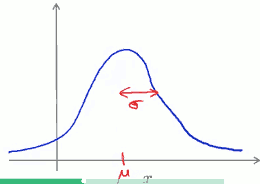
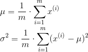
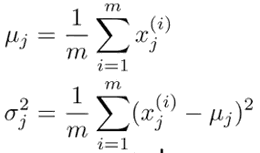
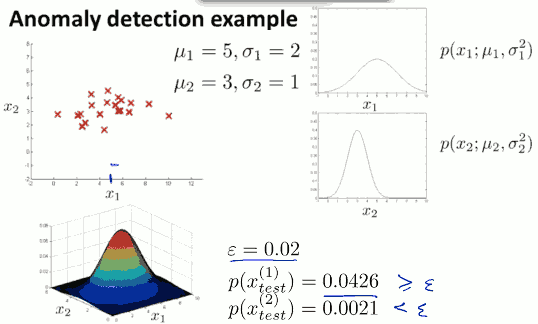
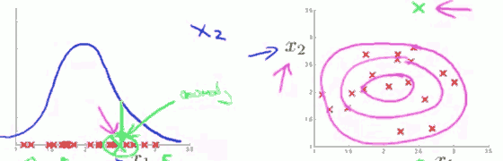
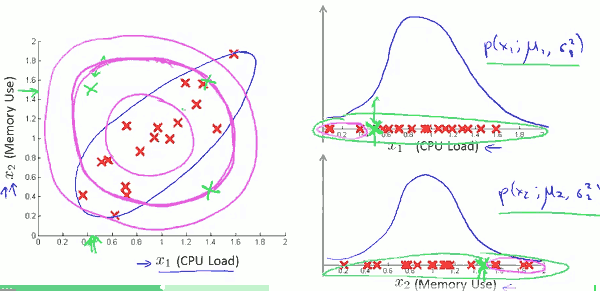
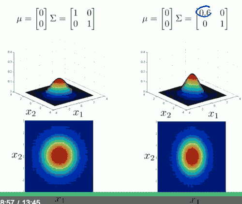
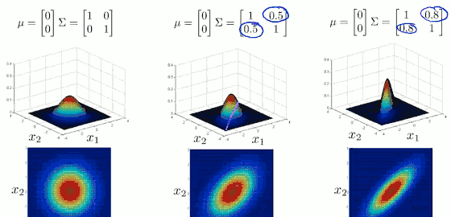
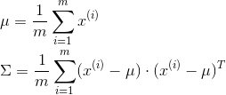

- [Anomaly Detection 异常检测](#8d364c79a6770dc7395296c168efd622)
    - [Density estimation](#29c53a82180b5184c50d4d772303e088)
        - [Anomaly Detection Example](#347118b310696c7f93c1ff66f8faf8aa)
        - [Gaussian (Normal) Distribution](#532e6903300860673cb95c382b974fd0)
        - [Parameter estimation](#f084e616e40ec63ecf915155cb46a54c)
        - [Anomaly Detection Algorithm](#68a5f465a0d97c3d5229bd80531c4d0e)
    - [Building an Anomaly Detection System](#c59486b104ab1cb60cb63f475557ac3d)
        - [开发并评估 anomaly detection system](#7e93cc035fcb67fd9180c2e41487373d)
        - [Anomaly Detection vs. Supervised learning](#f1f47b770f28badf6af9c7627badbfb5)
        - [Choose What features to Use](#711dff46b8015be0217bd08ede807ffb)
    - [Multivariate Gaussian Distribution 多元高斯分布](#08a98dde435875e68d7ff5e48688956e)
        - [Using Multivariate Gaussian Distribution](#a0d57426b1ce049b2cfafa06eac4786d)
        - [Original model vs. Multivariate Gaussian](#a0afe19d45ea8a302c6f1c352e52d417)

[TOC]

<h2 id="8d364c79a6770dc7395296c168efd622"></h2>

# Anomaly Detection 异常检测

<h2 id="29c53a82180b5184c50d4d772303e088"></h2>

## Density estimation

给定无标签的训练集，build a model for p(x), in another word, 我们将对x的分布概率建模。如果 `p(x_test )< ϵ` => anomaly ; while `p(x_test)>= ϵ` => ok.

<h2 id="347118b310696c7f93c1ff66f8faf8aa"></h2>

#### Anomaly Detection Example

> Fraud detection 欺诈检测

记录用户在网站的行为，`x⁽ⁱ⁾` =用户i的行为 feature, Model p(x) from data, indentify unusual user by checking which have p(x) < ϵ .

这样的技术，可以用来查找行为不正常的用户， 这是许多购物网站常用来识别异常用户的技术。

> Manufacturing 

工厂生产，检查飞机引擎

> Monitor computers in a data center

- `x⁽ⁱ⁾` = features of computer i
- x₁ = memory use ; x₂ = number of disk access/sec
- x₃ = CPU load ; x₄ = CPU load / network traffic
- ...

<h2 id="532e6903300860673cb95c382b974fd0"></h2>

#### Gaussian (Normal) Distribution

> Definition:

Say `x∊ℝ`, if x is a distributed Gaussian with mean(均值) `μ` , variance(方差) `σ²` (σ称为 standard deviation 标准差) 。 

记作: `x~𝒩(μ,σ²)` ,  `~`读作 "distributed as" , 服从...的分布.

概率密度函数如下：

可以看到，x取 `μ` 附近值的概率非常大，因为高斯分布在这里的概率密度很大。

如果 `σ`变小，图像会变窄，同时就会变得更高。

<h2 id="f084e616e40ec63ecf915155cb46a54c"></h2>

#### Parameter estimation

假设一堆一维实数数据 服从高斯分布 ，  `x~𝒩(μ,σ²)`。

参数估计问题，就是找出 μ 和 σ。 

> 

统计学中，`σ²`计算通常会用 1/(m-1), 机器学习中，用 1/m .

<h2 id="68a5f465a0d97c3d5229bd80531c4d0e"></h2>

#### Anomaly Detection Algorithm

> Training set: { x⁽¹⁾,x⁽²⁾,...,x⁽ᵐ⁾ }
> Each example is x ∊ ℝⁿ

所以，训练样本是 mxn矩阵。

 1. 选择特征。找出我们认为可以表示反常的 样本feature xᵢ
 2. 为每个 feature 拟合参数 μ₁,...μn, σ₁²,...,σn² 。
    
    μⱼ是是特征j的平均值。
     
    

 3. 对新样本，计算p(x):
    
    Π 是求积的符号
 
     ![][2]

    样本各个feature的概率的乘积

    Anomaly if p(x) < ϵ .
    

训练样本的每个特征都满足一个正态分布, 对新样本计算 各个特征的 概率密度值的积，来作 anomaly 判断。

> example:

  

<h2 id="c59486b104ab1cb60cb63f475557ac3d"></h2>

## Building an Anomaly Detection System

<h2 id="7e93cc035fcb67fd9180c2e41487373d"></h2>

#### 开发并评估 anomaly detection system

> The importance of real-number evaluation 实数评价法的重要性

当你在用某个学习算法来开发一个具体的应用，常常需要做各种决定，比如特征的选择，如果找到某种评估算法的方式，直接返回一个数字来告诉你算法的好坏，那么你做这些决定就显得容易了。

为了更快的开发出一个异常检测系统，那么最好找到一种评价异常检测系统的方法。

假设我们已经有了一些带标签的数据， y=0 if normal, y=1 if anomalous。

我们要考虑的异常检测算法是个非监督问题，使用的是无标签数据。这些带标签的数据，就是我们要找的能够评价异常检测算法的标准方法。

- training set 认为是 无标签数据的正常数据，但可能有一些异常数据也没关系。
- 假设 CV set 和 test test 中有一些样本都是异常的。

> example

飞机引擎例子，假设有10000个好的引擎，20个坏的引擎。

- Training set: 6000 good engines，我们将用这6000个数据，来 fit μ₁,...μn, σ₁²,...,σn²
- CV: 2000 good engines (y=0) , 10 anomalous (y=1)
- Test: 2000 good engines (y=0) , 10 anomalous (y=1)

> Algorithm evaluation

- Fit model(x) on `traing set` { x⁽¹⁾,x⁽²⁾,...,x⁽ᵐ⁾ }
- On a `CV/Test` example x , predict: y=1 if p(x)<ε (anomaly) , y=0 if p(x)>=ε (normal)
- 因为 CV/Test 数据存在较大的偏斜（skewed）, 一般的预测准确率不能很好的用来评估算法的好快，可能的评估值是 Precision／Recall，F₁-score .
- CV set 也可以用来 选择参数 ε

 
<h2 id="f1f47b770f28badf6af9c7627badbfb5"></h2>

#### Anomaly Detection vs. Supervised learning

既然我们有了带标签的数据，为什么不直接使用 监督学习算法呢？

什么时候应该用异常检测算法，什么时候应该用 监督学习算法呢？

Anomaly detection |  Supervised learning
--- | ---
正样本(异常)y=1非常少（0-20），大量的负样本y=0 | 正样本和副样本数量都很大
很多不同的异常种类，通过对少量的异常样本的学习，算法很难做出正确的预测，新的异常样本的原因可能根你已经见过完全不同 | 足够多的正／负样本，算法可以感知到正／负样本应该是什么样子，新的异常样本往往和training set中的一个样本相似。

垃圾邮件的例子中，也有很多不同的垃圾邮件种类，但是我们有足够的多的垃圾邮件样本的集合，所以仍然使用 监督学习。

> Anomaly Detection / Supervised learning 一些应用

Anomaly detection |  Supervised learning
--- | ---
Fraud detection 舞弊检测 | 垃圾邮件
工厂生产（eg.飞机引擎） |  天气预测
数据中心的服务器检测   | 癌症诊断

注：Fraud detection 中，如果你是大型网站，并且已经收集了足够多的舞弊数据y=1, 这种情况，可能更倾向于使用 监督学习。

<h2 id="711dff46b8015be0217bd08ede807ffb"></h2>

#### Choose What features to Use

> Non-gaussian features

在我们的异常检测算法中，我们做的事情之一就是使用这种正态（高斯）分布来对特征向量建模: `p( xᵢ, μᵢ, σᵢ²)` 。 那么我常做的一件事就是画出这些数据，或者使用`直方图`(hist in Octave)表示数据，以确保这些数据看起来是正态分布的。 虽然即使你的数据并不是高斯分布，它也基本可以良好的运行，但是我们可以对这些数据做一些转化，使得数据更像高斯分布。

除了 log(x) , 也可以使用 log(x+c) , 常数c用来调节图像，使得更像高斯分布， 或则 √x , x^0.1 等等, 方法并不唯一。

> Error analysis for anomaly detection

使用的 feature 需要可以把 异常样本区分出来: p(x) is comparable for normal and anomalous examples.

> 选择特征变量时的一些思考

选择那些在异常情况下，会不同寻常的(unusually)大或小 的feature。

数据中心的例子，假设我们选择了 几个特征：

- x₁ = memory use of compute
- x₂ = number of disk accesses/sec
- x₃ = CPU load
- x₄ = network traffic

现在怀疑某台电脑执行某个任务死循环了，这种情况，CPU load会很高，但network 流量很小，这种情况，要检测出异样，只需要添加一个feature x₅= CPU load/network traffic , 正常情况下，   CPU load/network traffic 是线性的；如果陷入死循环， CPU load/network traffic 的值会非常大。

<h2 id="08a98dde435875e68d7ff5e48688956e"></h2>

## Multivariate Gaussian Distribution 多元高斯分布

如图， 内存使用 和 cpu 负载一般情况下，是线性的，所以，左上的绿点是个 异常点，但是 这个异常点的 x₁,x₂ 分别的都在合理的范围内，所以 异常检测算法并不能发现它。

这时，我们就需要改良的异常检测算法 `多元高斯分布`。

> Multivariate Gaussian Distribution

- x ∊ ℝ , don't model p(x₁),p(x₂) separately. 
- Model p(x) all in one go.
- Parameters: `μ ∊ ℝⁿ , Σ ∊ ℝⁿˣⁿ` (covariance matrix 协方差矩阵)

`|Σ|` 代表 Σ 的行列式  ( det in Octave )

![公式][1]

通过多元高斯分布，你可以建立x₁,x₂ 高度相关模型，通过改变协方差矩阵的非对角线元素值，可以得到不同的高斯分布。

<h2 id="a0d57426b1ce049b2cfafa06eac4786d"></h2>

#### Using Multivariate Gaussian Distribution 

> 参数拟合

Fix module p(x) by setting:

> 使用

对于新的样本x ，计算 `p(x;μ,Σ)`:

![公式][2]

Flag an anomaly if p(x) < ε .

> Relationship to original model:

最初的高斯分布模型 ![][2] 其实就是一种特殊的 多元高斯分布模型，约束关系 Σ=对角矩阵,矩阵对角线元素是σ²， 这个模型的 概率密度函数 的 等高线 都是沿坐标轴分布的。 

<h2 id="a0afe19d45ea8a302c6f1c352e52d417"></h2>

#### Original model vs. Multivariate Gaussian

Original model | Multivariate Gaussian
--- | ---
更常用  |  没那么常用，但有捕捉feature之间相关性的优势
手动创造新的feature来捕捉feature组合的异常，(eg.CPU负载/网络流量) | 自动捕捉feature之间的关联
运算量小,适用于特征变量n很大的情况, eg.n>10,000 | computationally more expensive
样本数量m较小的情况也适用 | m必须>n, 否则Σ不可逆，实际使用中，一般需要m>10n

 
 
 
     
 
 
---

  [1]: ../imgs/multivariate_gaussian_distribution.png

  [2]: ../imgs/anomaly_model.png
