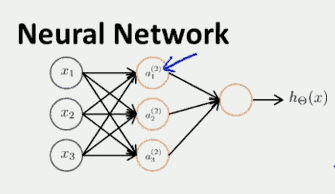
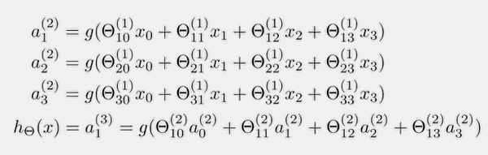
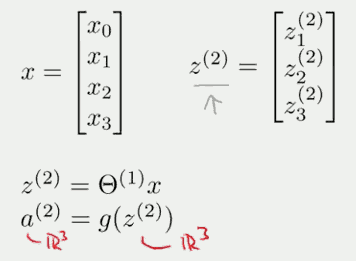
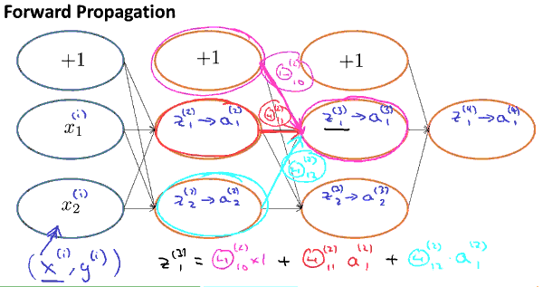
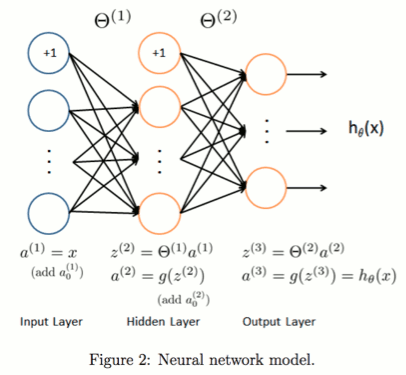
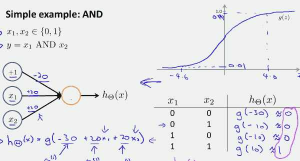
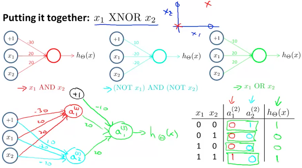
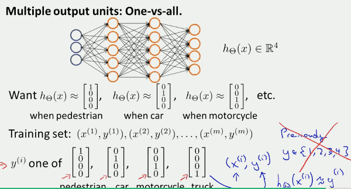

[](...menustart)

- [Neural Networks](#6b347be0e79381eeb5689396d9e59438)
    - [模型表示](#633607159f2d767251de0a59ecc2224a)
    - [Forward Propagation 前向传播](#48f5ee78299fe1abc75a1c1eeb092987)
        - [向量化实现](#de4610a2676339b809bcaed3760a4a48)
- [应用](#5b0520a9bf5e8d87c0b8c6e58766e184)
    - [简单的例子: 逻辑与 AND](#2b48d38921d4b7e972ca7faa373d0636)
    - [逻辑 异或非  XNOR:  y=1 if x1=x2](#34aa32d0c88265c3844ec8d69db1a63d)
- [多类分类](#848a31140f2770dc2fc104ac797f04ec)
- [手写字体识别](#d03641410b89f4c3f6575b23aacf837f)
    - [可视化部分数字图像数据](#c80e4b414d969c7715f30ca965aa4555)
    - [Regularized Logistic Regression 代价函数](#6e8021123ec11e3d46f617944b71e50a)
    - [训练所有的分类器](#0a47f3339ef5651d457d8bd6c1151b6f)
    - [多类分类流程](#640ee449b46c005a1be04723e22058d5)
    - [使用3层神经网络 多类分类的示例](#8fbb40805ca0978fe75cafa4fc310549)

[](...menuend)


<h2 id="6b347be0e79381eeb5689396d9e59438"></h2>

# Neural Networks 

神经网络可以处理feature数量很大的非线性回归

<h2 id="633607159f2d767251de0a59ecc2224a"></h2>

## 模型表示



- 左边的x , 是 input layer
- 最右边的 单个圈， 是 output layer
- 中间的a， hidden layer
- `aᵢ⁽ʲ⁾`  代表 j层的 第i个单元
- Θ`⁽ʲ⁾` 第j层 映射到下一层的函数的参数`矩阵`
- `x₀` 可以不用明写出来
 


- 如图,Θ`⁽¹⁾` 是个 3x4 矩阵: `S₍ⱼ₊₁₎ x （Sⱼ+1）=3x4`  ; `Sⱼ= j`层的单元数,不包括0单元  


我们把激活函数表示为:


所以有:


<h2 id="48f5ee78299fe1abc75a1c1eeb092987"></h2>

## Forward Propagation 前向传播

<h2 id="de4610a2676339b809bcaed3760a4a48"></h2>

### 向量化实现

我可以看到，某一层单元的 z ，可以向量化表示



为了纪录方便，我们使用 `a⁽¹⁾` 来表示第一层的 x , 

这样

`z⁽ʲ⁺¹⁾=`Θ`⁽ʲ⁾a⁽ʲ⁾ ` , 这里a是一个4维的向量


这个计算 h(x)的过程，称为 `前向传播` , 计算顺序:  输入层->隐藏层->输出层

---




`Neural Network Model:`




- weight: is kind like the strength of those connections
- bias: is some indication of whether that neuron tends to active or inactive.

<h2 id="5b0520a9bf5e8d87c0b8c6e58766e184"></h2>

# 应用

<h2 id="2b48d38921d4b7e972ca7faa373d0636"></h2>

##### 简单的例子: 逻辑与 AND



如果把权重(Θ参数) 改为 [-10,20,20] , 就能模拟 逻辑或 OR 运算。

类似的，逻辑非 只需要一个输入 x ,思路就是 给x 配一个较大的负值权重

`h(x) = g( 10 -20x )`  

<h2 id="34aa32d0c88265c3844ec8d69db1a63d"></h2>

##### 逻辑 异或非  XNOR:  y=1 if x1=x2

我们可以使用上面的三个神经单元，来实现我们的 XNOR 单元。



`更一般的理解是，在输入层中，我们只有原始的输入值, 然后我们建立一个隐藏层，用来计算一些稍微复杂的输入量的函数，
然后通过添加另一个层，我们了一个更加复杂一点的函数，这就是神经网络可以计算较复杂函数的直观解释。
`

<h2 id="848a31140f2770dc2fc104ac797f04ec"></h2>

# 多类分类

多个输出单元 : One-vs-all



<h2 id="d03641410b89f4c3f6575b23aacf837f"></h2>

# 手写字体识别

5000个训练样本, 每个训练样本是 20x20像素的灰度图,  所以输入数据X 是 5000x400的矩阵,

输出数据 y 是 5000x1 向量，1-10 分别表示 1-9-0 10个数字

<h2 id="c80e4b414d969c7715f30ca965aa4555"></h2>

##### 可视化部分数字图像数据

```
load('ex3data1.mat');

setenv('GNUTERM' , 'qt')
colormap(gray);
vec_img=X(100,:);  % 取出一个图像数据 1x400 
matrix_img= reshape( vec_img, 20, 20 ); % reshape to 20x20
imagesc( matrix_img   );  
```

<h2 id="6e8021123ec11e3d46f617944b71e50a"></h2>

##### Regularized Logistic Regression 代价函数

和之前实现过的 正则化逻辑回归函数完全一样

```
function [J, grad] = lrCostFunction(theta, X, y, lambda)

    m = length(y); % number of training examples

    J = 0;
    grad = zeros(size(theta));

    hx = sigmoid( X * theta );
    % 添加了 正则化部分
    J= 1/m * sum(  -y .* log( hx )  - ( 1-y ) .* log( 1- hx ) )  + lambda/(2*m )* ( theta' * theta ) ;      
    % 处理 feature 0 case
    J -= lambda/(2*m )* ( theta(1)^2 ) ;

    % 另一种处理 feature 0 case 的做法
    % 必须先计算出 grad0 并保存， 因为需要同步更新
    grad0   = 1/m *sum( ( hx - y ) .* X(:,1)  )'  ; % grad0 不正则化

    grad    = 1/m *sum( ( hx - y ) .* X  )' +  lambda/(m )*  theta ;     % 添加了 正则化部分
    grad(1) = grad0 ;

end
```

<h2 id="0a47f3339ef5651d457d8bd6c1151b6f"></h2>

##### 训练所有的分类器

```
function [all_theta] = oneVsAll(X, y, num_labels, lambda)

m = size(X, 1);
n = size(X, 2);

% You need to return the following variables correctly 
all_theta = zeros(num_labels, n + 1);

% Add ones to the X data matrix
X = [ones(m, 1) X];

% 在二元分类里，我们使用如下步骤求解 theta 
% initial_theta = zeros(size(X, 2), 1);
% lambda = 1;
% options = optimset('GradObj', 'on', 'MaxIter', 400);
% [theta, J, exit_flag] = fminunc(@(t)(costFunctionReg(t, X, y, lambda)), initial_theta, options);

 initial_theta = zeros(size(X, 2), 1);   % n+1
 options = optimset('GradObj', 'on', 'MaxIter', 50);
 for c = 1:num_labels;
    [all_theta(c,:)] =  fmincg (@(t)(lrCostFunction(t, X, (y == c), lambda)), initial_theta, options);
 end

end
```

```
% 预测
function p = predictOneVsAll(all_theta, X)

    m = size(X, 1);
    num_labels = size(all_theta, 1);

    % You need to return the following variables correctly 
    p = zeros(size(X, 1), 1);

    % Add ones to the X data matrix
    X = [ones(m, 1) X];

    % 按行求最大值
    [val , p] = max( sigmoid( X * all_theta' ) ,[],2)  ;
end
```


<h2 id="640ee449b46c005a1be04723e22058d5"></h2>

##### 多类分类流程

```
% 训练所有分类器
lambda = 0.1;
[all_theta] = oneVsAll(X, y, num_labels, lambda);

% 预测
pred = predictOneVsAll(all_theta, X);
```


<h2 id="8fbb40805ca0978fe75cafa4fc310549"></h2>

##### 使用3层神经网络 多类分类的示例

Theta1 , Theta2 是训练好的 输入层和隐藏层的 Theta矩阵

```
function p = predict(Theta1, Theta2, X)

% Useful values
m = size(X, 1);
num_labels = size(Theta2, 1);

% You need to return the following variables correctly 
p = zeros(size(X, 1), 1);

% Add ones to the X data matrix
X = [ones(m, 1) X];

% 5000x401   (25 x 401)' -> 5000x25
A2 =   sigmoid( X * Theta1' )  ;

m2 = size(A2, 1);
A2 = [ones(m2, 1) A2];

% 5000x26   (10 x 26)'  -> 5000x10
[val , p] = max( sigmoid( A2 * Theta2' ) ,[],2)  ;

end

```
