[](...menustart)

- [反向传播](#4ae61d8a3733358bcef0f73d62e69a15)
    - [代价函数 和 反向传播 Backpropagation](#b68af9a6b20fafa771e0f2abd6ebe283)
    - [为了计算导数项，我们采用反向传播算法`Backpropagation`](#86e1d05271f80ac28ff23624d6d7c00c)
    - [只有一个训练样本的例子（不重要）:](#4713b5e8c545b8a393cba2db968389fa)
    - [大量训练样本情况下，反向传播算法的应用:](#770ae2adf9aaa0cbd1da51d0d0c539ff)
- [反向传播练习](#a44baf9d73c4a124326ffc5568a06903)
    - [unrolling parameters](#02baf1f861df96f5e3a87d3eef8116e4)
    - [Gradient checking](#2f05f3a13934eed796477b096390d62f)
    - [应用 Gradient Checking的步骤](#99527f4c4644eda2340faca80fba7724)
- [随机初始化](#aec2a101c13136f3cdbe1dca6e8494da)
- [put all together](#d1ce73089ce012666ab305131351d508)
    - [选择神经网络架构](#801876e7e97044976d75b835fac97ca3)
    - [训练神经网络](#67fd927dbbde24e0a4e33a49821346bd)
- [What is backpropagation really doing?](#3fa803ad477d12baa72d67cc8ab8acb7)
- [Derivatives in computational graphs](#55fc63612f8fefdee49a1ba4e2d4b86c)

[](...menuend)


<h2 id="4ae61d8a3733358bcef0f73d62e69a15"></h2>

# 反向传播

"误差反向传播" 的简称，是一种与最优化方法（如梯度下降法）结合使用的，用来训练人工神经网络的常见方法。

该方法计算对网络中所有权重计算损失函数的梯度。这个梯度会反馈给最优化方法，用来更新权值以最小化损失函数。
随便提一下BP网络的强大威力：

- 1）任何的布尔函数都可以由两层单元的网络准确表示，但是所需的隐藏层神经元的数量随网络输入数量呈指数级增长；
- 2）任意连续函数都可由一个两层的网络以任意精度逼近。这里的两层网络是指隐藏层使用sigmoid单元、输出层使用非阈值的线性单元；
- 3）任意函数都可由一个三层的网络以任意精度逼近。其两层隐藏层使用sigmoid单元、输出层使用非阈值的线性单元。


<h2 id="b68af9a6b20fafa771e0f2abd6ebe283"></h2>

#### 代价函数 和 反向传播 Backpropagation

一些标记:

- L 标记 神经网络的总层数
- S₄ 表示第4层的单元数，不包括偏差单元 `bias unit`
- k 表示第几个输出单元

---


logistic regression cost function:

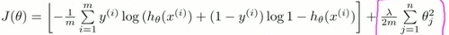

由于神经网络的输出层通常有多个输出，属于k维向量，因此用如下的方式定义神经网络的Cost function:

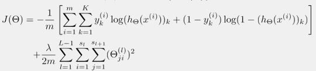

注意，对于训练集的每一个样本，都需要对输出层所有的输出单元计算cost并求和。

- 使用前向传播计算出 h(x), 如果有多个输出单元，h(x)是一个向量: `h(x) ∊ ℝᴷ`, `(h(x))ᵢ = iᵗʰ output`
   ```
    % step 1
    a_1 = [ ones( m , 1)  X ];
    z_2 = a_1 * Theta1' ;  % you'd better work z_2 out, for later using
    a_2 = sigmoid( z_2 ) ;
    a_2 = [ ones( size(a_2,1),1 )  a_2 ];  % 2nd level
    
    z_3 = a_2 * Theta2' ;
    a_3 = sigmoid( z_3 );  % output level,hx
    
    hx=a_3;   
   ```
- 左侧部分是对K个输出单元的代价函数的求和并累加, 使用和 one-vs-all的一样的方法处理y:
   ```
   % step 2
    J=0;
    for k = 1:num_labels
        J +=  1/m * sum(  - (y==k) .* log( hx(:,k) )  - ( 1-(y==k) ) .* log( 1- hx(:,k) ) ) ;
    end
   ```

- 右侧的正则化项，需要累加除输出层外的 所有层的 Θ, 
   
   eg: 三层神经网络，需要处理`Θ⁽¹⁾ , Θ⁽²⁾ ` , 且一般不处理 bias unit的权

   ```
   % step 3
   all_params = [Theta1(:,2:end)(:) ; Theta2(:,2:end)(:)];
   J +=  lambda/(2*m )* ( all_params' * all_params )  ; 
   ```
   
   
---


为了 min J(Θ)我们需要计算:

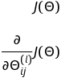

记住:

这项是一个实数 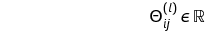


---

<h2 id="86e1d05271f80ac28ff23624d6d7c00c"></h2>

#### 为了计算导数项，我们采用反向传播算法`Backpropagation`

我们使用 ![][1] 来表示 l 层第 j 个节点的误差值。

这样对每一个节点，我们就有了 节点的激励值 ![][2] 和 误差![][1]:

![][1] = ![][2] - `yⱼ`  ,  其中 ![][2]= `h(x)ⱼ`

---

<h2 id="4713b5e8c545b8a393cba2db968389fa"></h2>

#### 只有一个训练样本的例子（不重要）:

以一个4层神经网络为例子:

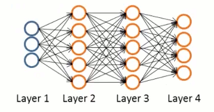

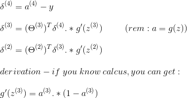

- 没有 `δ⁽¹⁾`, 因为第1层 是training set中的feature
- 反向传播的名字，来源于 从输出层开始计算，依次反向推算
- 最后一个公式，提供了计算 激励值a 导数的方法, !!!重要!!!
   
   `g'(z) = d/dz(g(z)) = g(z)(1-g(z))`
   
---

δ的计算非常复杂 ，最终我们可以得到下面的公式: (ignoreλ  ,or if λ=0 )

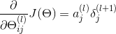


<h2 id="770ae2adf9aaa0cbd1da51d0d0c539ff"></h2>

#### 大量训练样本情况下，反向传播算法的应用:

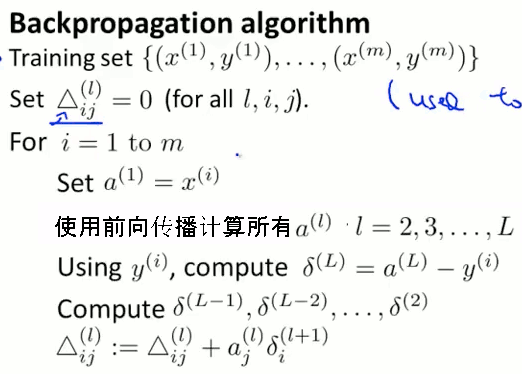

最后一步可以向量化:

![][3]

最后我们跳出循环,计算:

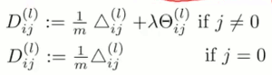

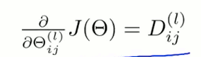

D 就是 J(Θ)的偏导数, Δ的均值

    eg: 一个3层神经网络，反向传播计算流程， 注意第一步 y_k ∊ {0,1} ,第3步，需要使用 delta2=delta2(2:end) 去掉 bias unit 的误差


---

再回顾一下 反向传播的计算步骤:

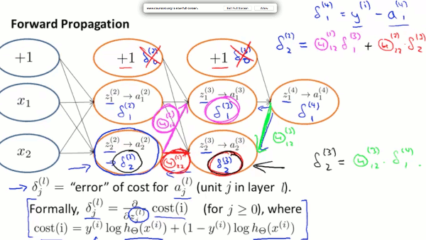

 1. 熟悉微积分的，可以发现，δ 其实就是对 J(Θ)求 z的偏微分
 2. 对于 bias unit的δ， 可以计算，也可以不算，依赖于你想实现的算法

<h2 id="a44baf9d73c4a124326ffc5568a06903"></h2>

# 反向传播练习

<h2 id="02baf1f861df96f5e3a87d3eef8116e4"></h2>

#### unrolling parameters

以前的 高级优化算法，我们使用θ向量 计算cost,gradient, 和应用于fminunc,
在神经网络中 Θ 是一个矩阵，

假设有3个 10x11 Theta 矩阵，把这3个矩阵转成一个列向量:

```
thetaVec=[ Theta1(:) ; Theta2(:) ; Theta3(:)  ]
```

从 thetaVec 中取回 Theta2

```
Theta2 = reshape( thetaVec(111:220), 10,11  )
```

---

<h2 id="2f05f3a13934eed796477b096390d62f"></h2>

#### Gradient checking

反向传播的算法非常负责，很容易出错。为了确保反向传播的偏导数项计算正确性, 我们使用 `Gradient checking` 来帮助检查实现的算法的正确性。

`numerical gradient algorithm` : 使用 `ΔJ(θ)/Δ(θ)` 来近似计算J(θ)的导数。 

`注意:` `numerical gradient algorithm` 非常慢，只能用于检测。

---

`θ ∊ ℝ`  θ是实数的情况

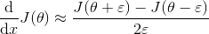

ε一般取`10⁻⁴`

---

`θ ∊ ℝⁿ`  θ是向量的情况 

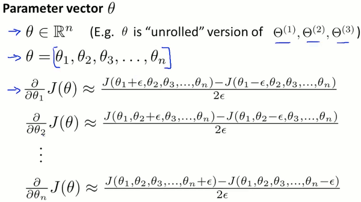

`Octave 中具体的实现`

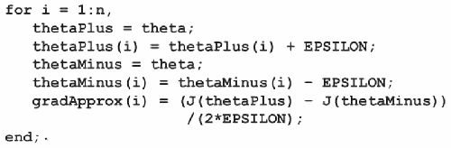

`检查 gradApprox ≈ Dvec`

Dvec 是通过反向传播算法计算出来的 J(Θ)对Θ的偏导数

---

<h2 id="99527f4c4644eda2340faca80fba7724"></h2>

#### 应用 Gradient Checking的步骤

 1. 应用 backprop 计算出 Dvec ( unrolled `D⁽ⁱ⁾`)
 2. 应用 Gradient Checking 计算出 gradApprox
 3. 确认 近似
 4. 去掉 gradient checking , 使用 backprop 代码进行学习


<h2 id="aec2a101c13136f3cdbe1dca6e8494da"></h2>

# 随机初始化

对于逻辑回归来说，初始化θ 为一个零向量是可行的， 但是对于神经网络，并不适用。

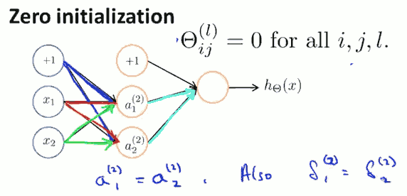

如图所示, 如果所有的Θ都初始化为零向量, 那么所有隐藏层的激励值和误差，都会得到相同的结果，这就组织了神经网络学习出更多有价值的信息。

我们使用 `Random Initialization` 来打破上面的 `权重对称` Symmetry breaking 情况：

初始化Θ为 [-ε,ε] 之间的一个随机值, ε 是接近0的很小的值

`eg.`

```
INIT_EPSILON = 0.12;
Theta1 = rand(10,11)*(2*INIT_EPSILON)-INIT_EPSILON;
```

<h2 id="d1ce73089ce012666ab305131351d508"></h2>

# put all together

<h2 id="801876e7e97044976d75b835fac97ca3"></h2>

#### 选择神经网络架构

输入层: 一旦确定了特征集X， 输入单元的`数量`也就确定了
输出层: 输出单元`数量`,由分类器的类别个数决定
隐藏层: 如果>1 隐藏层，每层的单元数最好保持一致，个数稍多余输入单元数

<h2 id="67fd927dbbde24e0a4e33a49821346bd"></h2>

#### 训练神经网络

- 随机初始化权值
- 对每一个`x⁽ⁱ⁾` 使用前向传播算法计算 `h(x⁽ⁱ⁾)` (输出结果)
- 计算代价函数 J(Θ) , 这里J(Θ)是非凸函数non-convex`
- 使用反向传播算法计算 J(Θ) 对Θ的偏导数


    计算grad 代码:

```
% step 4

delta_3 = zeros(size(a_3));
% for k output units
for k = 1:num_labels
    delta_3(:,k) = a_3(:,k) - (y==k) ;
end

delta_2 =  delta_3 * Theta2 .* sigmoidGradient( [ ones( size(z_2,1),1 )  z_2 ] ) ;
delta_2 =  delta_2(:, 2:end) ;  % 去掉 bias 单元

Theta2_grad = (delta_3' * a_2 ) / m ;
Theta1_grad = (delta_2' * a_1 ) / m ;

% add regularization
Theta1_grad(:, (2:end)) += lambda/m * Theta1(:, (2:end));
Theta2_grad(:, (2:end)) += lambda/m * Theta2(:, (2:end));

% Unroll gradients
grad = [Theta1_grad(:) ; Theta2_grad(:)];
```

-----------

<h2 id="3fa803ad477d12baa72d67cc8ab8acb7"></h2>

# What is backpropagation really doing?

- Right now, all we're gonna do is to focus our attention on 1 single example:  the image of 2 (handwriting)
- What effect should this one training example have ?  How the weights and biases get adjusted ?
- Let's say we're at a point where the network is not well trained yet, so the activations in the output layer are gonna look pretty random. 
- 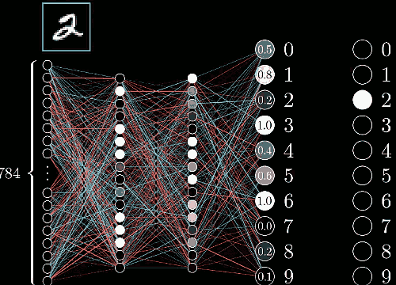
- Now we can't directly change those activations, we only have influence on the weights and biases.  But it is helpful to keep track of which adjustments we wish should take place to that output layer. 
- And since we want it to classify the image as a 2, we want that 3rd value to get nudged up, while all of the others get nudged down.
    - Moreover, the sizes of these nudges should be proportional to how far away each current value is from its target value.  
    - For example, the increasing to that number 2 neurons activation is more important than the decreasing to the number 8 neuron which is already pretty close to where it should be. 
    - 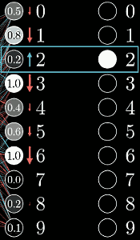
- So zooming in further, let's focus just on this neuron, the one whose activation we wish to increase.  
    - 
- Remember that activation is defined as a certain weighted sum of all of the activations in the previous layer, plus a bias. 
    - 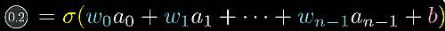
- So there are 3 different avenues that can team up together to help increase that activation:
    - Increase b
    - Increase wᵢ  ( in proportion to aᵢ )
    - Change aᵢ from the previous layer ( in proportion to wᵢ )
- Focusing just on how the weights should be adjusted, notice how the weights actually have differing levels of influence: 
    - the connections with the brightest neurons from the preceding layer have the biggest effect since those weights are multiplied by larger activation values. 
    - 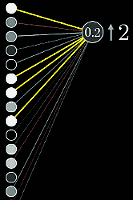
    - So if you were to increase one of those weights, it actually has a stronger influence on the ultimate cose function, than increasing the weights of connections with dimmer neurons, at least as far as this one training example is concerned. 
- Remember when we talked about gradient descent, we don't just care about whether each component should get nudged up or down, we care about which ones give you the most bang for you buck.
    - This , by the way, is at least somewhat reminiscent of a theory in neuron science for how biological networks of neurons learn **Hebbian Theory** -- offen summed up in the phrase ""neurons that fire together wire together". 
    - Here, the biggest increases to weights, the biggest strengthening of connections, happends between neurons which are the most active, and the ones which we wisht to become more active. 
    - 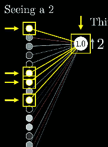
    - In a sense, the neurons that are firing while seeing a 2, get more strongly linked to those firing when thinking about a 2. 
- The 3rd way that we can help increase this neuron's activation is by changing all the activations in the previous layer. 
    - Namely, if everything connected to that digit 2 neuron with a positive weight got brighter , and everything connected with a negative weight got dimmer, then that digit 2 neuron would become more active. 
    - Of course, we cannot directly influence those activations, we only have control over the weights and biases.  
- keep in mind, zooming out one step here, this is only what that digit 2 output neuron wants.  Remember, we also want all of the other neurons in the last layer to become less active. And each of those other output neurons has its own thoughts about what should happen to that second-to-last layer.    
    - 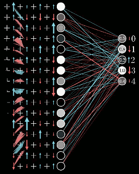
    - So the desire of this digit 2 neuron , is added together with the desires of all the other output neurons, for what should happen to this second-to-last layer. Again, in proportion to the corresponding weights, and in proportion to how much each of those neurons needs to change. 
- This right here is where the idea of propagating backwards comes in. 
    - By adding together all these desired effects, you basically get a list of nudges that you want to happen to the second-to-last layer. 
    - And once you have those, you can recursively apply the same process to the relevant weights and biases that determin those values, repeating the same process and moving backwards through the network. 
    - 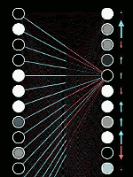
- And zooming out a bit further, remember that this is all just how a single training example wishes to nudge each one of those weights and biases.
    - If we only listen to what that 2 wanted ,  the network would ultimately be incentivized just to classify all images as a 2. 
    - So what you do is you go through this same backprop routine for every other training example, recording how each of them would like to change the weights and biases, and you averaged together those desired changes. 
    - 
    - This collection here of the averaged nudges to each weight and bias is, loosely speaking, the negative gradient of the cost function, or at least something proportional to it. 
    - 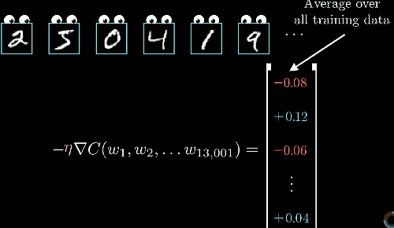

---

- Let's just sum it up .
- Backpropagation is the algorithm for determining how a single training example would like to nudge the weights and biades,  not just in terms of whether they should go up or down, but in terms of what relative proportions to those changes cause the most rapid decrease to the cost.


<h2 id="55fc63612f8fefdee49a1ba4e2d4b86c"></h2>

# Derivatives in computational graphs

Here, our main goal is to show how people in machine learning commonly think about the chain rule from the calculus in the context of networks. 

Let's just start off with an extremely simple network, one where each layer has a single neuron in it. So this particular network is determined by 3 weights and 3 biases
And our goal is to understand how sensitive the cost function is to these variables. That way we know which adjustment to these terms is gonna cause the most efficient decrease to the cost function.

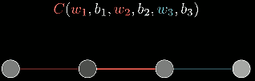

We're just focus on the connection between the last 2 neurons. 

We'll denote the cost of this one training example as C₀.

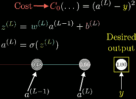

So there are a lot of terms. And a way you might conceptualize this is that the weight, the previous activation, and the bias altogether are used to compute z, which in trun lets up compute a, which finally along with the constant y, let us compute the cost. And of course, a<sup>(L-1)</sup> is influenced by its own weight and bias, But we are not gonna focus on that right now. 

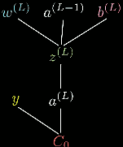

All of these are just numbers. And it can be nice to think of each one as having its own little number line. 

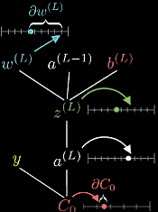

Our first gola is to understand how sensitve the cost function is to small changes in our weigth w<sup>(L)</sup>.  Or phrased differently , what's the derivative of C with respect to w<sup>(L)</sup>.

What do we want is the ratio : What do we want is the ratio : ∂C₀/∂w<sup>(L)</sup> .  Conceptually, this tiny nudge to w<sup>(L)</sup> causes some nudge to z<sup>(L)</sup>, which in turn causes some change to a<sup>(L)</sup>, which directly influences the cost. 

So we break this up by first looking at the ratio of a tiny change to z<sup>(L)</sup>  to this tiny change in w<sup>(L)</sup>. That is, the derivative of z<sup>(L)</sup> with respect to w<sup>(L)</sup>.  Likewise, you then consider the ratio of a change to a<sup>(L)</sup> to the tiny change in z<sup>(L)</sup> that causes it,  as well as the ratio between the final nudge to C and this intermediate nudge to a<sup>(L)</sup>.


This right here is the chain rule, where  multiplying together these 3 ratios gives us the sensitivity of C to small change in w<sup>(L)</sup>. 

Now we are gonna compute the relevant derivatives.

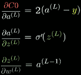

In the case of this last derivative, the amount that a small nudge to this weight influences the last layer, depends on how strong the previous neuron is. Remember, this is where that "neurons that fire together wire together" idea comes in. 

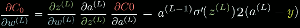

All of this is the derivative with respect to w<sup>(L)</sup> only of the cost for a specific training example. Since the full cost function involves averaging together all those costs across many different training examples,  its derivative requires averaging this expression that we found over all training examples. 

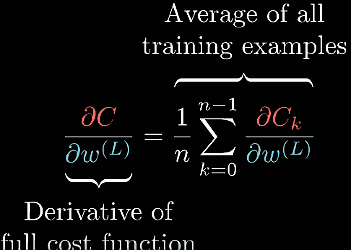

And of course that is just one component of the gradient vector, which itself is built up from the partial derivatives of the cost function with respect to all those weights and biases. 

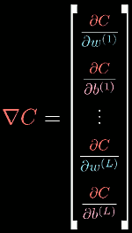

But even though it was just one of those partial derivatives we need, it's more than 50% of the work. 

The sensitivity to the bias, for example, is almost identical.  We just need to change out this ∂z/∂w term for a ∂z/∂b. And if you look at the relevant formula, that derivative comes to be 1. 

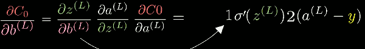

Also, and this is where the idea of propagating backwards comes in, you can see how sensitive this cost function is to the activation of the previous layer. 

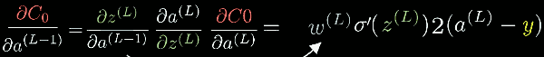

And again, even though we won't be able to directly influence that activation, it's helpful to keep track of, because now we can just keep iterating this chain rule idea backwards to see how sensitive the cost function is to previous weights and to previous biases.

You might think this is an overly simple example since all layers just have 1 neuron.  But honestly, not that much changes when we give the layers multiple neurons. Really it's just a few more indices to keep track of. 

Rather than the activation of a given layer simply being a<sup>(L)</sup>, it's going to have a subscript indicating which neuron of that layer it is.

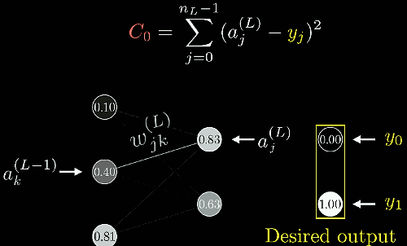

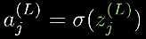

These are all essentially the same equations we had before in the one-neuron-per-layer case.  And indeed, the chain-rule derivative expression describing how sensitive the cost is to a specific weight looks essentially the same. 

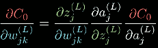


What does change here , though, is the derivative of the cost with respect to one of the activations in the layer (L-1). 

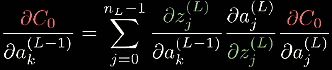

In this case, the difference is the neuron influence the cost function through multiple different paths. That is, on the one hand, it influences a₀<sup>(L)</sup>, which plays a role in the cost function, but it also has an influence on a₁<sup>(L)</sup>, which also plays a role in the cost functions. And you have to add those up. 

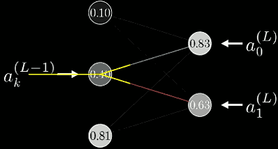

---

Once you know how sensitive the cost function is to the activations in this second-to-last layer, you can repeat the process for all the weights and biases feeding into that layer.

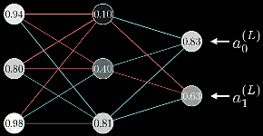


---

  [1]: ../imgs/delta_j_l.png
  [2]: ../imgs/activate_j_l.png
  [3]: ../imgs/delta_vectorize.png
  [4]: ../imgs/derivative_Theta_jkl.png
