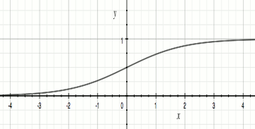
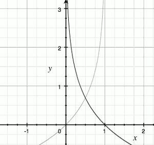

...menustart

- [逻辑回归  Logistic Regression](#a744ec7c08cc41920ead873b18fea870)
    - [逻辑回归其实是分类问题 Classification](#6c824d8f49bd24cb5e4905dcffcc3c8a)
    - [下面讨论都是`二元分类`问题，即目标值只有`0,1` 两种可能](#62d9775927244743add743a22d28413c)
    - [模型 : h(x) = g(θᵀx)](#75e25fe1c9e64282bc5145b5c7b1c01b)
        - [logistic回归实质上还是线性回归模型](#9a2a9f503818d6b205474d04d7522f49)
        - [逻辑回归的假设函数h(x)的输出，是 y=1的概率的估计值](#454abbd2818af5238a6db55cab4293d3)
    - [决策边界  decision boundary](#19e2ea0b618dbf3e78308f272878afcc)
        - [画决策边界](#5946a6ee1f488efd81c2dc517756e7a8)
    - [代价函数 cost function J](#1ca15edbfdd1a2d9b71659b988bca643)
        - [逻辑回归 J 应该是个`凸函数 convex` ， 线性回归的J 是`非凸函数`](#638859c9f3ae47d9bd9d73b7fd40ed77)
    - [梯度下降](#b1f126ef3b67138c7e19176b361e6857)
    - [高级优化](#b4b363c797bb3a216ac2e0e157b6c85e)
        - [优点](#52b8c1841dd7c4f895d655668fee1dd3)
        - [缺点](#2e769a755109798027a704351be8f91a)
        - [用法](#bc120b21c4200fc94c5fecbdab33be8e)
- [多类分类](#848a31140f2770dc2fc104ac797f04ec)
    - [1-vs-all 分类思想](#a0295753749d6a5c149f168ef9e17e30)
- [review :](#6bd505276b3a44597e818f7aa8140cbf)
    - [和线性回归一样，拟合曲线，需要多项式](#5e5d590a7f4d92838d1e91826b3e48fe)
    - [h(x) = g( θᵀx ) , θᵀx 图像可以看到决策边界](#5f36b2681dfe7ca40410bba6b36d5edc)
    - [逻辑回归的 代价函数 J 总是个凸函数](#b935d26ce83872d01795fcae8a7a7bea)
- [一般流程](#869492f5afdb7e6bc022701f149b2c48)
    - [可视化](#5f0eec58f36853e40a718b9f250881ab)
    - [S型函数](#53d74761d14195e7f96efb99c5d0c541)
    - [代价函数](#287340d512ad4b09754b4574719e412f)
    - [预测](#fbee26a17a1f4caafca8854456ebbb5d)
    - [一般流程](#869492f5afdb7e6bc022701f149b2c48)

...menuend


<h2 id="a744ec7c08cc41920ead873b18fea870"></h2>


# 逻辑回归  Logistic Regression

<h2 id="6c824d8f49bd24cb5e4905dcffcc3c8a"></h2>


##### 逻辑回归其实是分类问题 Classification

<h2 id="62d9775927244743add743a22d28413c"></h2>


##### 下面讨论都是`二元分类`问题，即目标值只有`0,1` 两种可能

<h2 id="75e25fe1c9e64282bc5145b5c7b1c01b"></h2>


## 模型 : h(x) = g(θᵀx)

<h2 id="9a2a9f503818d6b205474d04d7522f49"></h2>


##### logistic回归实质上还是线性回归模型

我们在 线性回归的连续值 结果上加 一层函数映射 g, 将连续值映射到离散值0/1上

```
h(x) = g(θᵀx)
```

其中,


完整的假设函数如下：

![][1]


g(z) 称为 S型函数 Sigmoid function 或 逻辑函数 Logistic function

g(z)的函数图像如下：



当z << 0 (-4 附近)，g(z) 接近0，而当 z >> 0 (4) ，g(z)接近 1，从而达到分类的目的。

整条曲线呈S型, 这也是 "S型" 叫法的由来。


<h2 id="454abbd2818af5238a6db55cab4293d3"></h2>


##### 逻辑回归的假设函数h(x)的输出，是 y=1的概率的估计值

```
h(x) = P( y=1|x;θ )
P( y=1|x;θ ) + P( y=0|x;θ ) = 1
```

<h2 id="19e2ea0b618dbf3e78308f272878afcc"></h2>


## 决策边界  decision boundary

决策边界 是 θᵀx 的一个属性，它包含参数 θ

我们观察 g(z)的函数图 , 可以看到

  - 当 z>=0, 也即 θᵀx >= 0 时， 函数值 >= 0.5
  - 当 z< 0, 也即 θᵀx <  0 时， 函数值 < 0.5
  - 当 θ 确定后, θᵀx = 0 ? 的图像就是 决策边界
  - 非线性决策边界，需要借助多项式
  
<h2 id="5946a6ee1f488efd81c2dc517756e7a8"></h2>


### 画决策边界

 - 数据: X , y , 训练完成的 θ
 - 决策边界是直线:  1 bias x₀ + 2 features x₁,x₂
     - Only need 2 points to define a line
    - 从 x₁ 中选择 最大／最小两个值，最为 直线两个端点的 x 坐标
    - 确定 两个端点的 y 坐标:
    ```
    Thetaᵀ*x = [t0,t1,t2] dot [x0,x1,x2] = t0 + t1*x1 + t2*x2  = 0
    => t0 + t1*plot_x + t2*plot_y = 0
    => t0 + t1*plot_x = -t2*plot_y   
    => (t0 + t1*plot_x)/(-t2) = plot_y
    ```
  - 画直线
 - 决策边界是曲线:
     - 构造网格 
    ```
    u = np.linspace(-1, 1.5, 50);
    v = np.linspace(-1, 1.5, 50);
    ```
  - 对每一个cell ，计算 z = θᵀx
  - 画轮廓图  
 
 
<h2 id="1ca15edbfdd1a2d9b71659b988bca643"></h2>


## 代价函数 cost function J

<h2 id="638859c9f3ae47d9bd9d73b7fd40ed77"></h2>


##### 逻辑回归 J 应该是个`凸函数 convex` ， 线性回归的J 是`非凸函数`

```
J(θ)= 1/m ∑ cost( h(x) , y )   (∑ i=1,m)
```


-log(x) (粗) , -log(1-x) (细) 函数图像:



`特点`:

 - 如果 h(x)=y, 那么 cost(h(x),y)=0  ( y=[0,1] )
 - 如果 y=0 ,  h(x)->1 ,  那么 cost(h(x),y) -> ∞
 - 如果 y=1 ,  h(x)->0 ,  那么 cost(h(x),y) -> ∞
 
拆成两个等式 非常不利于计算，利用 y 只能取0和1的特点，我们可以把cost function 简化为一个等式

```
cost(h(x),y) = -ylog( h(x) ) -(1-y)log( 1-h(x) )
```

最终我们获得完整的代价函数:

```
J(θ)= -1/m ∑[ ylog( h(x) ) + (1-y)log( 1-h(x) ) ]    (∑ i=1,m)
```

![][1]


<h2 id="b1f126ef3b67138c7e19176b361e6857"></h2>


## 梯度下降


迭代公式和 线性回归基本一样，唯一区别就是 h(x) 不同。

？为什么公式基本一样？ 因为这只是 h(x) 和 y 之间的比较？


let z = θᵀx , then ∂J/∂z is in fact extremely simple and intuitive: `∂J/∂z = y-sigmoid(z)`

<h2 id="b4b363c797bb3a216ac2e0e157b6c85e"></h2>


## 高级优化

<h2 id="52b8c1841dd7c4f895d655668fee1dd3"></h2>


##### 优点
  - 不需要手动选择𝛼
  - 一般比梯度下降算法快

<h2 id="2e769a755109798027a704351be8f91a"></h2>


##### 缺点
  - 更加复杂

<h2 id="bc120b21c4200fc94c5fecbdab33be8e"></h2>


### 用法

```
% 假设 有两个θ₀ θ₁ 参数

% 首先定义一个costFunction, 返回J 和 一个梯度值
function [jVal , gradient] = costFunction( theta )
    jval = % 计算代价函数 J(θ)
    
    gradient = zeroes(2,1) ;
    gradient[1] = % J(θ) 对 θ₀ 的偏导数
    gradient[2] = % J(θ) 对 θ₁ 的偏导数
end

% 有了这个 costFunction之后，就可以

options = optimset( 'GradObj' , 'on' , 'MaxIter' , '100' );
initialTheta = zeros( 2,1 );  % θ 初始值
[optTheta, functionVal, exitFlag] ...
    = fminunc(@costFunction , initialTheta , options );
```

<h2 id="848a31140f2770dc2fc104ac797f04ec"></h2>


# 多类分类

<h2 id="a0295753749d6a5c149f168ef9e17e30"></h2>


## 1-vs-all 分类思想

前面的例子，如果 y的值是1,2 怎么处理呢？

如果我们想让 2作为正值，1作为负值，只需要 y==2 , 就可以得到一个 1,2 分别映射为 0,1的target数据


假设我们有一个训练集，有三个类别 1,2,3 。

我们要做的，就是 使用 y==i 来获得 target数据，来训练 y==i的分类器 ，

最后获得 3个二元分类器。

```
Y = [1,3,3,2,1]
Y1 = [1,0,0,0,1]
Y2 = [0,0,0,1,0]
Y3 = [0,1,1,0,0]
```


```
hⁱ(x) = P( y=i | x ; θ )   (i=1,2,3)
```

预测的时候，就是获取 最大值的索引


代码实现 见第4部分 神经网络

<h2 id="6bd505276b3a44597e818f7aa8140cbf"></h2>


# review :

<h2 id="5e5d590a7f4d92838d1e91826b3e48fe"></h2>


##### 和线性回归一样，拟合曲线，需要多项式

<h2 id="5f36b2681dfe7ca40410bba6b36d5edc"></h2>


##### h(x) = g( θᵀx ) , θᵀx 图像可以看到决策边界

<h2 id="b935d26ce83872d01795fcae8a7a7bea"></h2>


##### 逻辑回归的 代价函数 J 总是个凸函数


<h2 id="869492f5afdb7e6bc022701f149b2c48"></h2>


# 一般流程

<h2 id="5f0eec58f36853e40a718b9f250881ab"></h2>


##### 可视化

```
function plotData(X, y)

    % Create New Figure
    figure; hold on;

    pos = find(y==1); neg = find(y == 0);

    % Plot Examples
    plot(X(pos, 1), X(pos, 2), 'k+','LineWidth', 2, 'MarkerSize', 7);
    plot(X(neg, 1), X(neg, 2), 'ko', 'MarkerFaceColor', 'y',   'MarkerSize', 7);
     
end
```

<h2 id="53d74761d14195e7f96efb99c5d0c541"></h2>


##### S型函数

```
function g = sigmoid(z)
    % Instructions: Compute the sigmoid of each value of z (z can be a matrix,
    % vector or scalar).

    g = 1./(1+e.^(-z))
end
```

<h2 id="287340d512ad4b09754b4574719e412f"></h2>


##### 代价函数

```
function [J, grad] = costFunction(theta, X, y)

    m = length(y); % number of training examples

    hx = sigmoid( X * theta );
    J= 1/m * sum(  -y .* log( hx )  - ( 1-y ) .* log( 1- hx ) );

    % 梯度 J(θ)的偏导数
    grad = 1/m *sum( ( hx - y ) .* X  )';

end

```

<h2 id="fbee26a17a1f4caafca8854456ebbb5d"></h2>


##### 预测

```
function p = predict(theta, X)
  %   p = PREDICT(theta, X) computes the predictions for X using a 
  %   threshold at 0.5 (i.e., if sigmoid(theta'*x) >= 0.5, predict 1)
  p = floor( sigmoid( X * theta ) + 0.5 );
end
```

<h2 id="869492f5afdb7e6bc022701f149b2c48"></h2>


##### 一般流程

```
clear ; close all; clc

data = load('ex2data1.txt');
X = data(:, [1, 2]); y = data(:, 3);

plotData(X, y);

[m, n] = size(X);

% Add intercept term to x and X_test
X = [ones(m, 1) X];

initial_theta = zeros(n + 1, 1);

% Compute and display initial cost and gradient
[cost, grad] = costFunction(initial_theta, X, y);

%  Set options for fminunc
%  GradObj: on , 告诉 fminunc 返回 costFunction 的返回值 cost, grad
%  MaxIter : 400， 最多迭代 400步
options = optimset('GradObj', 'on', 'MaxIter', 400);

%  Run fminunc to obtain the optimal theta
%  This function will return theta and the cost 
%  (@(t)(costFunction(t, X, y)) , 创建一个方法，参数是t，方法会调用 costFunction
[theta, cost] = fminunc(@(t)(costFunction(t, X, y)), initial_theta, options);

% Plot Boundary
plotDecisionBoundary(theta, X, y);

% 预测概率
%  Predict probability for a student with score 45 on exam 1 
%  and score 85 on exam 2 

prob = sigmoid([1 45 85] * theta);  % 0.776289

% 对训练集进行分类，并统计准确度
% 说明: double(true) =1 ,  double(false) =0
p = predict(theta, X);
fprintf('Train Accuracy: %f\n', mean(double(p == y)) * 100);  % 因为是线性的，只有 89% 准确率
```


---
---

  [1]: http://latex.codecogs.com/gif.latex?h_%5Ctheta%28x%29%3D%5Cfrac%7B1%7D%7B1&plus;%20e%5E%7B-%5Ctheta%5E%7BT%7Dx%7D%7D


 
