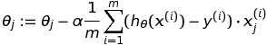
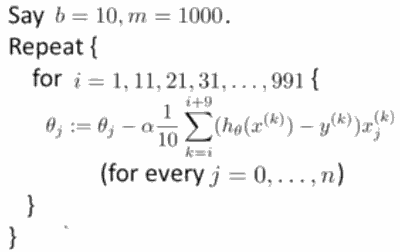
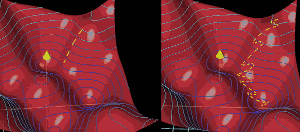

...menustart

- [Gradient Descent with Large Datasets](#f76fe91515c665720b0e43fa5fe0e9dc)
    - [Stochastic(随机) Gradient Descent](#a15f477ff9ba7b33f7616f6feb95b0b1)
    - [Mini-Batch Gradient Descent](#34beb6ea7ec5d6cc52927d78751d4ff9)
    - [Stochastic Gradient Descent Convergence](#85695b2541e3126709fe45b213bef57e)
        - [Checking for convergence](#51e0544e48aab59893bfbf63d0b50570)
    - [batch gradient descent VS mini-batch gradient descent](#c0e9a4f7a4e5915754d07942a3aa42fd)
- [Advanced Topics](#41ef0c7e3aa81f83c8172c71f9986dfb)
    - [Online Learning](#1a1b4213089da03d151647442f86c8d5)
        - [Other online learning example:](#5e500c2b37846f8bc8c9fbfbaa15608d)
    - [Map Reduce and Data Parallelism](#046be23b70007e2aedcbe8de6813f338)

...menuend


<h2 id="f76fe91515c665720b0e43fa5fe0e9dc"></h2>


## Gradient Descent with Large Datasets

When m is very large, the computing this derivative term can be very expensive, and it's very hard to load all data into memory.

传统的梯度下降算法也叫 `Batch Gradient Descent`, the term batch refer to the fact that we'er looking at all of the training examples at a time.

<h2 id="a15f477ff9ba7b33f7616f6feb95b0b1"></h2>


### Stochastic(随机) Gradient Descent

下面以线性回归为例，当然也适用于逻辑回归，神经网络


 1. randomly shuffle dataset
 2. loop

***algorithm***:

```
Repeat {
    for i=1,...,m {
        θⱼ:=θⱼ-ɑ( hθ( x⁽ⁱ⁾)-y⁽ⁱ⁾ )·xⱼ⁽ⁱ⁾ )
    }
}
```

Let's recall the batch gradient descent:



我们可以看到, batch gradient descent 中是求 J_train(θ) 的偏导数, stochastic gradient descent 中是求 单个样本cost的偏导数.

 - 随机梯度下降算法实际上就是扫描所有的训练样本
 - 打乱所有样本顺序
 - 首先是第一个样本，只对这个样本，进行一小步的gradient descent
 - 然后是第二个，第三个样本，知道遍历完所有样本
 - 重复遍历多次 1-10次，如果样本数量足够大(eg.3亿),1次遍历可能就足够了

<h2 id="34beb6ea7ec5d6cc52927d78751d4ff9"></h2>


### Mini-Batch Gradient Descent

Mini-batch gradient descent | use *b* examples in each iteration
--- | ---
Batch gradient descent | Use all *m* examples in each iteration
Stochastic gradient descent | use *1* example in each iteration

 - b is about 2 ~ 100, usually 10.



<h2 id="85695b2541e3126709fe45b213bef57e"></h2>


### Stochastic Gradient Descent Convergence

When useing Stochastic Gradient Descent how to make sure it is converging okey , and how do you tune the learning rate ɑ ?


<h2 id="51e0544e48aab59893bfbf63d0b50570"></h2>


#### Checking for convergence

 - Batch gradient descent:
    - Plot *J_train(Θ)* as a function of the number of iteration
    - It's not practical if m is massive

 - Stochastic gradient descent:
    - cost(Θ,(x⁽ⁱ⁾,y⁽ⁱ⁾)) = 1/2·( h(x⁽ⁱ⁾)-y⁽ⁱ⁾ )² 
    - During learning, compute *cost(Θ,(x⁽ⁱ⁾,y⁽ⁱ⁾))* before update Θ using (x⁽ⁱ⁾,y⁽ⁱ⁾)
    - every 1000 iterations(say), plot *cost(Θ,(x⁽ⁱ⁾,y⁽ⁱ⁾))* averaged over the last 1000 exmaples precessed by algorithm.
    
Stochastic gradient descent 的J(Θ)图像一般有4种情况:

 - 1. 图像较好的收敛, 如果采用更小的ɑ,收敛速度会变慢，但是可能会收敛的更好，这是因为J 在局部最小值附近震荡，ɑ小，震荡幅度也小
 - 2. 图像较好收敛，如果换成每5000个样本就算一次均值, 图像更为平滑, 这是因为 1000个样本的均值噪音太大，换成5000噪音变小了
 - 3. 图像上下震荡，没有下降，但是换成5000个样本求均值后, 图像收敛了，说明1000的样本数量太小了，并且太嘈杂，用5000组样本平均可能更能看出趋势; 当然如果换了更大的样本数量求均值，图像还是一样的，那么你的算法可能确实存在问题。
 - 4. 图像是上升的，这种情况说明你的算法正在发散，你需要一个更小的ɑ.

当运行随机梯度下降算法时，算法会从某个点开始，然后曲折的逼近最小值，但它不会真的收敛，而是一直在最小值附近徘徊。因此你最终得到的参数，实际上只是接近全局最小值，而不是真正的全局最小值。

如果你想让随机梯度算法收敛到全局最小值，你可以随事件的变化，减小学习速率 ɑ 的值。

一种典型的方法来设置ɑ的值，是让ɑ等于某个常数1 除以迭代次数加某个常数2 : a = const1/( iterationNumber + const2 ), 但是这样就需要额外的工作来确定 const1 和 const2， 所以很少采用逐渐减小ɑ值的方法。


<h2 id="c0e9a4f7a4e5915754d07942a3aa42fd"></h2>


### batch gradient descent VS mini-batch gradient descent

 - When you compute a step according to the mini-batch, it's not going to be the actual gradient of the cost function which depends on all of the training data not this tiny subset. 
 - So it's not the most efficient step downhill. 
 - But each mini-batch does give a pretty good aproximation, and more importantly , it gives you a significant computational speed up. 
 - If you were to plot the trajectory of your network under the relevant cost surface, it would be a little more like a drunk man stumling aimlessly down a hill, but taking quick steps;  rather than a carefully calculating man determining the exact downhill direction of each step before taking a very slow and careful step in that direction. 

 - 


<h2 id="41ef0c7e3aa81f83c8172c71f9986dfb"></h2>


## Advanced Topics

<h2 id="1a1b4213089da03d151647442f86c8d5"></h2>


### Online Learning

Shipping service website where user comes, specifies origin and destination, you offer to ship their package for some asking price, and users sometimes choose to use your shipping service(y=1), sometimes not(y=0).

Features *x* capture properties of user, of package's origin/destination and asking price. We want to learn p(y=1|x;Θ) to optimize price.

```
Repeat forever {
    // (x,y) will be discard after updating Θ
    Get (x,y) corresponding to user
    Update Θ using (x,y):
        Θ = Θ - ɑ·( h(x) - y )·x ;
}
```

因为数据是无限的, 所以不必保留，用完丢弃; also, can adopt to change user preference.

<h2 id="5e500c2b37846f8bc8c9fbfbaa15608d"></h2>


#### Other online learning example:

 - Product search (learning to search)
    - User searches for "android phone 1080p camera"
    - Have 100 phones in store. Will return 10 results.
    - *x* = features of phone, how many words in user query match name of phone,how many words in query match description of phone, etc.
    - y=1 if user clicks on link, y=0 otherwise.
    - Learn *p(y=1|x;Θ)*.
    - Use to show user the 10 phones they're most likely to click on. Other examples: Choosing special offers to show user; customized selection of news articles, product recommendation;...

<h2 id="046be23b70007e2aedcbe8de6813f338"></h2>


### Map Reduce and Data Parallelism

 - 分隔数据
 - 对各个section的样本，分别求和cost

**Map-reduce and summation over the training set**

Many learning algorithms can be expressed as computing sums of functions over the training set.


