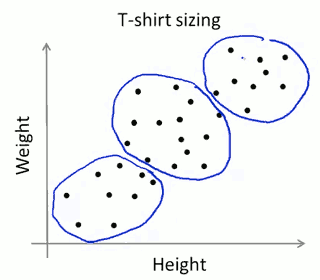
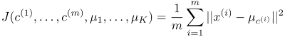
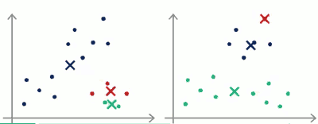
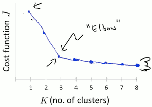
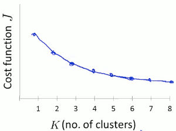
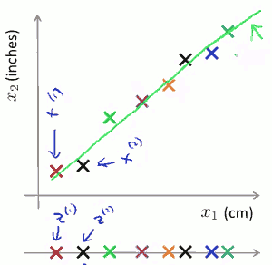
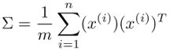

...menustart

- [Unsupervised Learning 非监督学习](#c1d1ce0b33b655a7dde5b4d609a518d5)
    - [Clustering 聚类](#a563d3e237c313e5a4560f308de6f738)
        - [K-Means Algorithm (K均值算法)](#bcc51acf93a8cd15d71a96c4fcfdd302)
        - [K-means for non-separated clusters](#8f9904362f6c29c84f094296d7130ca1)
        - [Optimization Objective 优化目标](#ff473a43fe9dc4205004d2f52538424d)
        - [Random Initialization](#6616b7ec75a5203b5f24981832e68fbc)
        - [Choosing the number of clusters](#a71856b2552f2959d2ae202a892eacc2)
    - [Dimensionality Reduction (降维)](#e2ae21220b47819f9bd84e1eda384a96)
        - [Motivation I : Data Compression](#e053c5235ca7a941b610e80e9dd74df0)
            - [应用：数据压缩](#b0328908b1f504ef7d3b11309be3b8ed)
        - [Motivation II : Data Visualization](#20f796dd4f825616edc79d31ef8589db)
    - [Principal Component Analysis (主成分分析法)](#66148dd9ca1a5d6fcd3f8c9a1f27ed86)
        - [PCA algorithm](#34e4fca9e0793ce258ca8115a5b84b1e)
        - [PCA 后面的数学知识点](#86e7a46b9ec08012091d12c9edfaf375)
        - [举例](#48044b62e705ee1890e92a8f80606938)
    - [Applying PCA](#a56e1784c2921d9821335f4bd39bf69f)
        - [Reconstruction from Compressed Representation](#eb475cfbc7f43744ddc30cac92087dda)
        - [Choosing k ( Number of Principal Components )](#15c00f95f0b61b33533b7db63974f6cb)
        - [Advice for Applying PCA](#1ac9054c912d3563ba7aa5d15cac229f)

...menuend


[TOC]

<h2 id="c1d1ce0b33b655a7dde5b4d609a518d5"></h2>


# Unsupervised Learning 非监督学习

<h2 id="a563d3e237c313e5a4560f308de6f738"></h2>


## Clustering 聚类

<h2 id="bcc51acf93a8cd15d71a96c4fcfdd302"></h2>


#### K-Means Algorithm (K均值算法)

假设, 希望把数据集 分成2类:

- 随机初始化两个点,染上不同的颜色(eg.红,蓝) ,called cluster centroids (聚类中心).
- K-means 迭代算法 做两件事：cluster assignment (簇分配) 和 move centroid step ( 移动聚类中心 )
- 簇分配: 根据样本 距离两个聚类中心的远近，把样本染为和 较近的聚类中心，相同的颜色。
- 移动聚类中心: 移动聚类中心 到和它一样颜色的那堆点的均值处。

K-Means Algorithm 严格的描述:

Input:

- K (number of clusters)
- Unlabeled trainning set { `x⁽¹⁾,x⁽²⁾, ... ,x⁽ᵐ⁾` } , `x⁽ⁱ⁾ ∊ ℝⁿ`

Iteration;

```
随机初始化 K 个 cluster centroids μ₁,μ₁, ... μk ∊ ℝⁿ
repeat {
    for i=1 to m
        c⁽ⁱ⁾ := index of 最近的聚类中心  ( min(‖x⁽ⁱ⁾-μk‖²) )
    end
    for k=1 to K
        μk := average(mean) of 分配给簇k的所有点
        如果 没有任何点分配到 uk，删除uk，这种情况很少出现
    end
}
```

当 μk 的位置在迭代过程中，不再发生改变了，就可以认为收敛了。

---

<h2 id="8f9904362f6c29c84f094296d7130ca1"></h2>


#### K-means for non-separated clusters

根据身高体重，把 Tshirt 分成 S，M，L 三类：

  

---

<h2 id="ff473a43fe9dc4205004d2f52538424d"></h2>


#### Optimization Objective 优化目标



上面提到的 k-mean 迭代中的 簇分配 和 移动聚类中心，其作用其实就是为了最小化 J.

K-means算法的 J - number of iteration 图像不可能出现 函数值增长的情况，如果函数值 J在 某一步 iteration后增长，肯定是代码中有bug。

K-means 代价函数也称为 distortion function (失真函数)。


<h2 id="6616b7ec75a5203b5f24981832e68fbc"></h2>


#### Random Initialization

在 样本中(m) 随机选择 K 个样本（K<m）, 作为 聚类中心。

但是如果随机初始化运气不好，K-means 会卡在局部最优上面：



避免局部最优的一个做法，就是 尝试多次 随机初始化, eg:

```
for i=1 to 50~1000
    K-means iterations ...
    ...
end

选择 J 最小的一个聚类
```

多次随机初始化 对于 K=2~10 有较好的效果，对于 K>10,或者更大,就不会有太大影响。

```
随机初始化代码:

% Randomly reorder the indices of examples
randidx = randperm(size(X, 1));
% Take the first K examples as centroids
centroids = X(randidx(1:K), :);
```

<h2 id="a71856b2552f2959d2ae202a892eacc2"></h2>


#### Choosing the number of clusters

K的决定，很多时候都是模棱两可的。

目前没有很好的 自动选择合适的K的方法。决定类目的最常用的方法仍然是通过看可视化的图，或者看聚类算法的输出结果。

Elbow Method (肘部法则):

尝试不同的K值，画出 J-K图像，如果图像出现 肘点，肘点值就是一个很好的K



然而大多数情况下， J-K图像并没有很明显的肘点：



`结论: Elbow Method 值得一试，但不要抱太大期望。`


很多情况，K 的决定，是为了 后续的目的。比如上面的衣服尺寸, 分成 S,M,L 三类，还是分成 XS,S,M,L,XL 五类，是由后续的市场销售策划决定的。

---

<h2 id="e2ae21220b47819f9bd84e1eda384a96"></h2>


## Dimensionality Reduction (降维)

<h2 id="e053c5235ca7a941b610e80e9dd74df0"></h2>


#### Motivation I : Data Compression

如图 2D->1D，通过把 (x₁,x₂) 投影到 绿色直线上，使用 在绿色直线上的度量 z 来替代(x₁,x₂) ，达到降维。



<h2 id="b0328908b1f504ef7d3b11309be3b8ed"></h2>


##### 应用：数据压缩

```
% 将一张 RGB图，降为 16色

% imread 读取一张RGB图像，会返回一个3维矩阵，其中2维对应某个位置像素的值，另一维表示RGB通道颜色
A = imread('bird_small.png')

% all values are in the range 0 - 1
A = A / 255; 

% reshape to 2 dimension, each row represent a channel
img_size = size(A);
X = reshape(A, img_size(1) * img_size(2), 3);

% 使用K-mean 算法，找到 16个中心RGB值
...

% 把每个像素 映射为 它聚类中心的索引
...
```


<h2 id="20f796dd4f825616edc79d31ef8589db"></h2>


#### Motivation II : Data Visualization

把数据降为 3D ，或2D， 以便可视化。


<h2 id="66148dd9ca1a5d6fcd3f8c9a1f27ed86"></h2>


## Principal Component Analysis (主成分分析法)

目前降维最流行的方法是 PCA 主成分分析法。

PCA 尝试寻找一个低维的面， 数据投影到平面上，使得 投影误差最小。

PCA 之前，一般要先进行 均值归一化 。

`PCA is not linear regression`

2D->1D 的情况， PCA 看上去 有点像 线性回归， 但实际上不一样。 线性回归使用的误差是 y的误差， PCA 的误差是 投影误差。


<h2 id="34e4fca9e0793ce258ca8115a5b84b1e"></h2>


#### PCA algorithm

- 数据预处理:  feature scaling/mean normalization
 
    `x = (feature-value - avg ) / range`

- 计算 covariance matrix 协方差矩阵 ：
 
  

- 计算 协方差矩阵 sigma的 特征向量 eigen vectors
 
  `[U,S,V]= svd(sigma)`  (octave 奇异值函数,对于正定矩阵,svd比 eig方法更稳定)
  
   For positive definite matrices, Σ is Λ and UΣVᵀ is identical to QΛQᵀ. 

  U,S,V都是 nxn矩阵

- 从n 维降到 k 维，只需要 提取 矩阵U的前k个列向量，构成投影平面 `z ∊ ℝᵏ`
   
   矩阵U的前k个列向量组成 nxk 的矩阵，记为 `U_reduce=U(:,1:k) ;`
   
   `Z = X * U_reduce ;`

---

<h2 id="86e7a46b9ec08012091d12c9edfaf375"></h2>


#### PCA 后面的数学知识点

- n阶方阵， 共有n个特征值
- 特征值的总和，等于 矩阵对角线之和， 也就是矩阵的迹；特征值之积，等于 矩阵的行列式。
- `S⁻¹AS = Λ` , A和Λ相似, 矩阵相似 则拥有`相同的特征值` 和`相同数量的特征向量`。
- 协方差矩阵是正定矩阵
- 对称矩阵`特征向量正交`
- 对称矩阵 `A=QΛQ⁻¹ = QΛQᵀ`
- 对称矩阵 `主元的乘积，等于特征值的乘积`

---

<h2 id="48044b62e705ee1890e92a8f80606938"></h2>


#### 举例

对于一个训练集，100个对象模板，特征是10维，那么它可以建立一个100\*10的矩阵，作为样本。求这个样本的协方差矩阵，得到一个10\*10的协方差矩阵，然后求出这个协方差矩阵的特征值和特征向量，应该有10个特征值和特征向量，我们`根据特征值的大小(这步是哪里做的?)`，取前四个特征值所对应的特征向量，构成一个10\*4的矩阵，这个矩阵就是我们要求的特征矩阵，100\*10的样本矩阵乘以这个10\*4的特征矩阵，就得到了一个100\*4的新的降维之后的样本矩阵，每个特征的维数下降了。


<h2 id="a56e1784c2921d9821335f4bd39bf69f"></h2>


## Applying PCA

<h2 id="eb475cfbc7f43744ddc30cac92087dda"></h2>


#### Reconstruction from Compressed Representation

从压缩数据 重建原始数据:

`X_approx ≈ Z * U_reduceᵀ ;`
 
原理:  
```
Z = X * U_reduce ;
Z * pinv(U_reduce)  = X * U_reduce * pinv(U_reduce) ;
X = Z * pinv(U_reduce)    
因为 U_reduceᵀ 标准正交，所以 pinv(A) = Aᵀ
X = Z * U_reduceᵀ
```


<h2 id="15c00f95f0b61b33533b7db63974f6cb"></h2>


#### Choosing k ( Number of Principal Components )

主成分数量 K 的选择方法:

几个概念:

- Average squared projection error 平均平方投影误差: PCA 做的就是最小化这个误差

    `1/m · Σ ‖x⁽ⁱ⁾-x_approx⁽ⁱ⁾‖²`    (i=1,m)

- Total variation in the data 数据总方差: 每个样本向量长度平方的平均值, 既每个训练样本距离原点多远

    `1/m · Σ ‖x⁽ⁱ⁾‖²`    (i=1,m)


Typically, 选择最小的k， so that:

  ![][1]

用PCA的语言来说，就是保留了 99%的 variance , 这个值可以视具体情况调节。

---

低效的做法 ：

- try PCA with k=1
- 计算 U_reduce , z , x_apporx
- 检查是否满足:

 ![][1]
 
- 如果不满足，继续尝试 k=2,k=3,...


高效的做法 :

```
[U,S,V] = svd( A )
```

S 是nxn的 奇异值对角矩阵， 上面 平均平方投影误差／数据总方差的比值，可以简化为:

  ![][2]
   
---

<h2 id="1ac9054c912d3563ba7aa5d15cac229f"></h2>


#### Advice for Applying PCA


- 图像压缩

 training set x -> PCA -> z , 获得的 U_reduce 以及其它的运算结果，可以直接运用到 validation set 和 test set上。


- 可视化 Visualization
 
-> 2D/3D

`PS: PCA降维不是简单减少原feature数量, 
不要用来解决 over-fitting的问题，很多情况下都不管用。`

在应用PCA之前，先尝试使用原始数据训练，在看情况 是否实现PCA 和考虑是否使用 z。


---


  [1]: ../imgs/PCA_k_choose.png
  
  [2]: ../imgs/PCA_k_choose2.png
