[](...menustart)

- [Maxq](#ef0aea7fada38d87f635b347acae4117)
- [3. The MAXQ Value Function Decomposition](#1ca2a53e3aee2426fbe0471c0788f16d)
    - [3.1 Taxi example](#11b7c68186495355b7770a6777ab2f40)
    - [3.2 Definitions](#28fc65dfb6f48abdf33b71b4b0440cf7)
    - [3.3 Decomposition of the Projected Value Function](#753a9eaa2be4ced1fa5875c05dfdff70)
- [A Learning Algorithm for the MAXQ Decomposition](#d6441f91c197a8e36b0008ba2307889a)
    - [4.1 Two Kinds of Optimality](#891e7168eccd8d630e8c572615d85781)
    - [4.2 The MAXQ-O Learning Algorithm](#3b97da78e886b3f8d17c9f4c54540171)
    - [4.3 Techniques for Speeding Up MAXQ-0](#23feda6ab3a0c28739ff075e59ed559e)
    - [4.4 The MAXQ-Q Learning Algorithm](#9847a1803bd225e326da8c36497968a6)
- [5. State Abstraction](#be6b86743fc14285b97d7d0037337a64)
    - [5.1 Five Conditions that Permit State Abstraction](#287fa4871442358e00cdd22bdccfe7fc)
        - [5.1.1 CONDITION 1: MAX NODE IRRELEVANCE](#0fd7085da1b16936628a34768637ff1c)
        - [5.1.2 CONDITION 2: LEAF IRRELEVANCE](#87349168dccb260456b23839e9702af4)
        - [5.1.3 CONDITION 3: RESULT DISTRIBUTION IRRELEVANCE](#a9f97f89dbb6e80750e445877a4cc214)
        - [5.1.4 CONDITION 4: TERMINATION](#fa47406de877edbd1d58fe0b8f4489b6)
        - [5.1.5 CONDITION 5: SHIELDING](#3bd22ac574778f26097a5d3c815bcee5)
        - [5.1.6 DICUSSION](#fb8187ec15df35190dbc58aa6d7d4815)
    - [5.2 Convergence of MAXQ-Q with State Abstraction](#a905db7d811ede823e2afa218e22b5d8)
    - [5.3 The Hierarchical Credit Assignment Problem](#3a77b82cf90e359bca449dc6baea1a13)
- [6. Non-Hierarchical Execution of the MAXQ Hierarchy](#be3d80bb862c5123b4a97b94416dd9cd)
- [7. Experimental Evaluation of the MAXQ Method](#624966685e552964b681142cfb943122)

[](...menuend)


<h2 id="ef0aea7fada38d87f635b347acae4117"></h2>


# Some HRL Concepts

- **SMDP** (Semi Markov Decision Process)
    - the actions can take a variable amount of time to complete.

- **Recursive optimal VS. Hierarchical optimal**
    - 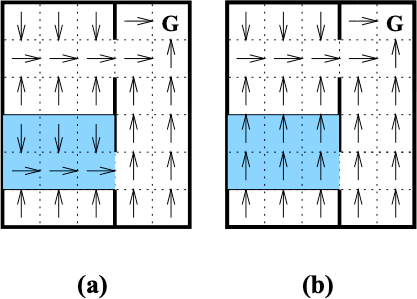
        - the policy shown in the left diagram is recursively optimal 
        - the policy shown in the right diagram is hierarchically optimal
    - Recursive optimality
        - each individual component is solved optimally
        - only guarantees that the policy of each subtask is optimal given the policies of its children
    - Hierarchically optimal
        - finds the policy optimal within the space of policies defined by the hierarchy. 
        - In this form of optimality, the policy for each individual subtask is not necessarily optimal, but the policy for the entire hierarchy is optimal,

- **Options**
    - An option is essentially some kind of an encapsulated policy.
        - so called `macro actions`
    - Markov Option
        - A Markov option can be represented as:  o = `< I, π, β >`
            1. I⊆S - a set of initial states, which o may be started
            2. π:SxA → [0,1] - the policy followed during o
            3. β:S → [0,1] - the probability of terminating in each state
    - Semi Markov Option
        - policy and termination condition may depend on the **entire history** of states, actions, and rewards since `o` started.
            - while Markov option depend only on the **current state**.
        - π:HxA → [0,1]
        - β:H → [0,1] 
    - Learning: Intra-Option Q-Learning

Q-learning will converge to the optimal  , while SARSA(0) will need a GLIE(Greedy in the Limit with Infinite Exploration) policy.

# Maxq 

[youtube course from IIT](https://www.youtube.com/watch?v=EbTIQqVDJsg&list=PLHD22PKARkdR5qnXSwYOzZY4VjIDvZWan)


 
<h2 id="1ca2a53e3aee2426fbe0471c0788f16d"></h2>

# 3. The MAXQ Value Function Decomposition

- **projected value function** V<sup>π</sup>(a,s) : 
    - value function of a subtask a, following π
        - if a is subtask, V<sup>π</sup>(a,s) is the expected accumlative reward of `option` a
        - if a is primitive , V<sup>π</sup>(a,s) is the expected immediate reward
    - R̅ᵢ(s,a) = V<sup>π</sup>(a,s)


 
<h2 id="11b7c68186495355b7770a6777ab2f40"></h2>

## 3.1 Taxi example


<center>

 ![][1] 

</center>

- six primitive actions
    - North, South, East, or West
    - Pickup, Putdown
- reward
    - -1 for each action
    - +20 for successfully delivering the passenger
    - -10 for illegal Pickup, Putdown
- 3 variables
    1. taxi position (25)
    2. passenger position ( 5 = 4 starting postions + 1 on the taxi )
    3. destination (4)
- total states: 25 * 5 * 4 = **500 possible states**

---


**subtasks** : 

- Navigate(t)
    - the goal is to move the taxi from its current location to one of the four target locations,
    - which will be indicated by the formal parameter t.
- Get
    - the goal is to move the taxi from its current location to the passenger’s current location and pick up the passenger.
- Put
    - The goal of this subtask is to move the taxi from the current location to the passenger’s destination location and drop off the passenger.
- Root
    - This is the whole taxi task.

Each of these **subtasks** is defined by a *subgoal*, and each **subtask** terminates when the *subgoal* is achieved.

After defining these subtasks, we must indicate available actions in each subtask. 

- The actions may be other subtasks or primitive actions. For examples,
    - the Navigate(t) subtask should use the four primitive actions North, South, East, and West
    - The Get subtask should use the Navigate subtask and the Pickup primitive action

All of this information can be summarized by a directed acyclic graph called the ***task graph***

- 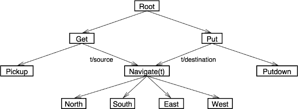
- each node corresponds to a subtask or a primitive action
    - each subtask will executes its policy by calling child subroutine 
- each edge corresponds to a potential way in which one subtask can "call" one of its child tasks
- the *formal* parameter *t* of Navigate(t) is to be bound to an actual parameter.


If we have a policy for each subtask, then this gives us an overall policy for the Taxi MDP.

- The collection of policies is called *hierarchical policy* 
    - In a hierarchical policy, each subroutine executes until it enters a terminal state for its subtask.

<h2 id="28fc65dfb6f48abdf33b71b4b0440cf7"></h2>

## 3.2 Definitions

- given MDP M 
- decomposed M into a finite set of subtasks { M₀,M₁,...,M<sub>n</sub> }
    - with the convention that M₀ is the root task

**Definition 2** An unparameterized subtask is a *3-tuple* , < Tᵢ,Aᵢ,R̃ᵢ  > 

- Tᵢ(sᵢ) is a termination predicate that **partitions S into** a set of **active states**, Sᵢ, and a set of **terminal states**, Tᵢ
    - The policy for subtask Mᵢ **can only be executed** if current state *s* is in *Sᵢ*.
    - If , at any time Mᵢ is being executed, the MDP enters a state in Tᵢ , then Mᵢ terminates immediately , even if it is still executing a subtask.
- Aᵢ is a set of actions that can be performed to achieve subtask Mᵢ.
    - can either be primitive action from A, or can be other subtasks.
    - Aᵢ define a direct graph over subtasks
        - no subtask can invoke itself recursively either directly or indirectly.
    - If a child subtask Mⱼ has formal parameters, then it can occur multiple times in Aᵢ, and each occurrence must specify the actual values that bound to the formal parameters.
    - The set of actions Aᵢ may differ from one state to another , and from on set of actual parameter values to another 
        - so Aᵢ is a function of *s and actual parameters*. 
- R̃ᵢ(s'|s,a)  is the pseudo-reward function,which specifies a (deterministic) pseudo-reward for each transition to a terminal state s' ∈ Tᵢ 
    - This pseudo-reward tells how desirable each of the terminal states is for this subtask.
    - It is typically employed to give goal terminal states a pseudo-reward of 0 and any non-goal terminal states a negative reward.
    - By definition, the pseudo-reward R̃ᵢ(s) is also zero or all non-terminal states s. 
    - The pseudo-rewardis **only used during learning**, so it will not be mentioned further until Section 4.


Each **primitive action** a from M is a primitive subtask, that is **alwasy executable**, it **always terminates immediately** after execution, and its **pseudo-reward function is uniformly zero**.


If a subtask has formal parameters, and b specifies the actual parameter values for task Mᵢ, Then we can define a parameterized termination predicate Tᵢ(s,b) and and a parameterized pseudo-reward function R̃ᵢ(s,b).

It should be noted that if a parameter of a subtask takes on a large number of possible values, this is **equivalent to creating a large number of different subtasks**, each of which will need to be learned. It will also create a large number of candidate actions for the parent task, which will make the learning problem more difficult for the parent task as well.


**Definition 3** A hierarchical policy ,π, is a set containing a policy for each of the subtasks in the problem: π = { π₀,π₁,...,π<sub>n</sub> }.

Each subtask policy πᵢ takes a state and returns the name of a primitive action to execute , or the name of a subroutine to invoke (and binding for its formal parameters). 

```
s → πᵢ |→ primitive action
       |→ subroutine
```

A subtask policy is a deterministic "option" , and its probability of terminating in state *s* (denote by β(s) ) is 0 if s∈Sᵢ , and 1 if s∈Tᵢ.

In a parameterized task, it returns a chosen action and the bindings (if any) of its formal parameters.

```
        s → πᵢ |→ chosen action a
parameter ↑    |→ (if any) parameter of a
```

> Table 1: Pseudo-Code for Execution of a Hierarchical Policy

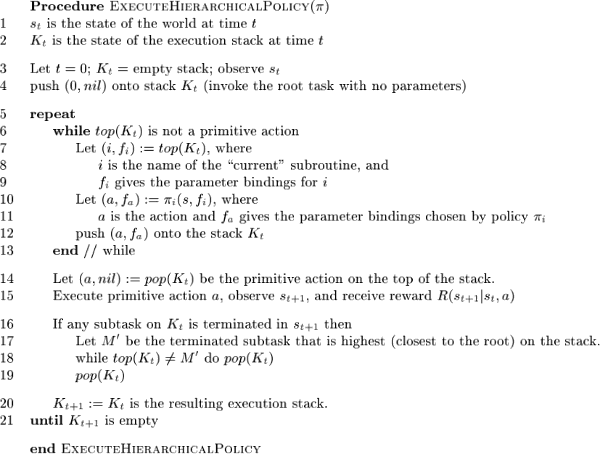

It is sometimes useful to think of the contents of the stack as being an additional part of the state space for the problem. Hence, a hierarchical policy implicitly defines a mapping from the current state s<sub>t</sub> and current stack contents K<sub>t</sub> to a primitive action a.

This action is executed, and this yields a resulting state s<sub>t+1</sub> and a resulting stack contents K<sub>t+1</sub>. 

Because a hierarchical policy maps from states *s* and stack contents K to actions, the value function for a hierarchical policy must assign values to combinations of states *s* and stack contents K.


**Definition 4**  A hierarchical value function, V<sup>π</sup>( (s,K) ) , gives the expected cumulative reward of following the hierarchical policy π starting in state *s* with stack contents K . 

- This hierarchical value function is exactly what is learned by HAMQ 
- in this paper, we will focus on learning only the *projected value functions* of each of the subtasks M₀,M₁,...,M<sub>n</sub> in the hierarchy.

**Definition 5** The projected value function of hierarchical policy π on subtask Mᵢ , V<sup>π</sup>(i,s) , is the expected cumulative reward of executing πᵢ ( and the policies of all descendents of Mᵢ ) starting in state *s* until Mᵢ terminiates.

---

The purpose of the MAXQ value function decomposition is to decompose V(0,s) (the projected value function of the root task) in terms of the projected value function V(i,s) of all of the subtasks in the MAXQ decomposition.

<h2 id="753a9eaa2be4ced1fa5875c05dfdff70"></h2>

## 3.3 Decomposition of the Projected Value Function

The decomposition is based on the following theorem:

**Theorem 1** Given a task graph over tasks M₀,M₁,...,M<sub>n</sub>  and a hierarchical policy π, each subtask Mᵢ defines a semi-MDP with state Sᵢ, actions Aᵢ, probability transition function P<sup>π</sup>ᵢ(s',N | s,a) , and expected reward function R̅(s,a) = V<sup>π</sup>(a,s) , where  V<sup>π</sup>(a,s) is the projected value function for child task Mₐ in state *s*. 

- If a is a primitive action, V<sup>π</sup>(a,s) is defined as the expectedimmediate reward of executing a in s:
    - V<sup>π</sup>(a,s) = ∑<sub>s'</sub> P(s'|s,a)·R(s'|s,a).

**Proof**: 

Let's write out the value of V<sup>π</sup>(i,s): 

  V<sup>π</sup>(i,s) = E{ r<sub>t</sub> + γr<sub>t+1</sub> + γ²r<sub>t+2</sub> + ... | s<sub>t</sub> = s, π }   (5)

The sum continues until the subroutine for task Mᵢ enters a state in Tᵢ.

Now let us suppose that the first action chosen by πᵢ is a subroutine *a* . This subroutine is invoked, and it executes for a number of steps N and terminates in state s' according to P<sup>π</sup>ᵢ(s',N | s,a) . We can rewriet Equation (5) as : 

  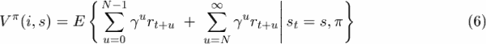

- the first part of equation 6  is the discounted sum of rewards for executing subroutine *a* in state *s* until it terminates
    - in other words, it is V<sup>π</sup>(a,s), the projected value function for the child task Mₐ.
- the 2nd term of the equation is the value of s' for the current task i , V<sup>π</sup>(i,s') , discounted by γᴺ , where s' is the current state when subroutine *a* terminates.

We can write this in the form of a Bellman equation :

 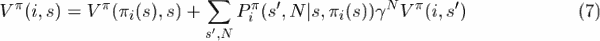

- This has the same form as Equation (3)
- the first term is the expected reward R̅(s,π(s)). Q.E.D.

---


To obtain a hierarchical decomposition of the projected value function, let us switch to the action-value (or Q) representation. 

Let Q<sup>π</sup>(i,s,a) be the expected cumulative reward for subtask Mᵢ of performing action *a* in state *s* , end then following hierarchical policy π until Mᵢ terminates.  We can re-state Equation (7) as follows:

 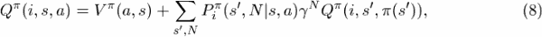

- difference from V<sup>π</sup>(i,s):
    - V: Mₐ is provided by πᵢ(s)
    - Q: Mₐ is chosen
- then 2nd term is the expected discounted reward of *completing task* Mᵢ after executing action *a* in state *s*.
    - This term only depends on i, s, and a, because the summation marginalizes away the dependence on s' and N.
    - Let us define C<sup>π</sup>(i,s,a) to be equal to this term:

**Definition 6** The completion function, C<sup>π</sup>(i,s,a) , is the expected discounted cumulative reward of **completing** subtask **Mᵢ** after invoking the subroutine for **subtask Mₐ** in state *s*. The reward is discounted back to the point in time where a begins execution ( \* γᴺ ) .

 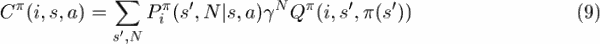

With this definition, we can express the Q function recursively as

 Q<sup>π</sup>(i,s,a)  = V<sup>π</sup>(a,s) + C<sup>π</sup>(i,s,a)     (10)

- 实际上，C<sup>π</sup> is related to *s'*, so **undiscounted** setting can simplify the computation of C().


Finally, we can re-expressthe definition for  V<sup>π</sup>(i,s) as 

 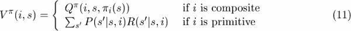

We will refer to equations (9), (10), and (11) as the *decomposition equation*  for the MAXQ hierarchy under a fixed hierarchical policy π. 

These equations recursively decompose the projected value function for the root,  V<sup>π</sup>(0,s) into the projected value functions for
the individual subtasks, M₁,...,M<sub>n</sub>  and the individual completion functions  C<sup>π</sup>(j,s,a) for j=1,...,n. 

Now just the C values for all non-primitive subtasks and the V values for all primitive actions must be stored to represent the value function decomposition.

---

To make it easier for programmers to design and debug MAXQ decompositions, we have developed a graphical representation that we call the MAX Q graph.

 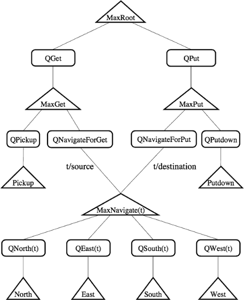

- The graph contains two kinds of nodes : Max nodes and Q nodes
- The Max nodes correspond to the subtasks in the task decomposition
    - There is one Max node for each primitive action and one Max node for each subtask (including the Root) task.
    - Each primitive Max node i stores the value of V<sup>π</sup>(i,s) 
- The Q nodes correspond to the actions that are available for each subtask
    - Each Q node for **parent** task i, state *s*,  and subtask *a* stores the value of C<sup>π</sup>(i,s,a).
    - eg. QGet shores C<sup>π</sup>(0,s,Get) ??? 
- The children of any node are unordered ( nothing about the order in which they will be executed )
    - Indeed, a child action may be executed multiple times before its parent subtask is completed.
- the Max nodes and Q nodes can be viewed as performing parts of the computation 
    - Specifically, each Max node i can be viewed as computing the projected value function V<sup>π</sup>(i,s)  for its subtask. 
    - For primitive Max nodes, this information is stored in the node.
- Each Q node with parent task i and child task a can be viewed as computing the value of Q<sup>π</sup>(i,s,a) 

- Q node 保存 C, 用于计算 Q value ; Max node 用来计算 V value (primtive Max node 保存V )

----

 ![][1] 

As an example , consider the situation shown in Figure 1, which we will denote by s₁.

Suppose that the passenger is at R and wishes to go to B. Let the hierarchical policy we are evaluating be an ***optimal*** policy denoted by π ( we will omit the superscript \* to reduce the clutter of the notation) . 

- The value of this state under π is 10
- π need 10 units action  (a reward of -10)
    - 1 unit to move the taxi to R
    - 1 unit to pickup the passenge
    - 7 units to move the taxi to B
    - 1 unit to putdown the passenger
- When the passenger is delivered, the agent gets a reward of +20
- so the net value is +10

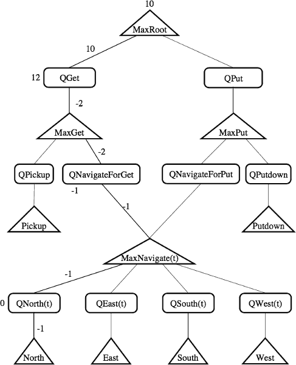

- To compute the value V<sup>π</sup>(Root,s₁)  
    - MaxRoot consults its policy and finds that π<sub>root</sub>(s₁) is Get.
    - Hence, it "ask" the Q node , QGet to compute Q<sup>π</sup>(Root,s₁,Get) 
    - The completion cost for the Root task after performing a Get , C<sup>π</sup>(Root,s₁,Get)  , is 12
        - it will cost 8 units to deliver the customer after completing the Get subtask
    - then it must ask MaxGet to estimate the expected reward of performing the Get itself.
- The policy for MaxGet dictates that in s₁, the Navigate subroutine should be invoked with *t* bound to R 
    - so MaxGet consults the Q node, QNavigateForGet to compute the expected reward.
    - QNavigateForGet knows that after completing the Navigate(R) task, one more action (the Pickup) will be required to complete the Get
        - so C<sup>π</sup>(MaxGet,s₁,Navigate(R)) = -1
    - it then ask MaxNavigate(R) to compute the expected reward of performing a Navigate to location R
- The policy for MaxNavigate chooses the North action, so MaxNavigate asks QNorth to compute the value.
    - QNorth looks up its completion cost, and finds that C<sup>π</sup>( Navigate, s₁ , North) is 0
        - i.e., the Navigate task will be completed after performing the North action)
    - It consults MaxNorth to determine the expected cost of performing the North action itself.
        - Because MaxNorth is a primitive action, it looks up its expected reward, which is -1
- Now this series of recursive computations can conclude as follows:  
    - Q<sup>π</sup>( Navigate(R), s₁ , North) = -1 + 0
    - V<sup>π</sup>( Navigate(R), s₁ ) = -1
    - Q<sup>π</sup>( Get, s₁ , Navigate(R) ) = -1 + -1
    - V<sup>π</sup>( Get, s₁ ) = -2
    - Q<sup>π</sup>( Root, s₁ ,Get) = -2 + 12
- The end result of all of this is that the value of V<sup>π</sup>( Root,s₁ ) is decomposed into a sum of C terms plus the expected reward of the chosen primitive action:
    - V<sup>π</sup>( Root,s₁ ) = V<sup>π</sup>( North,s₁ ) + C<sup>π</sup>( Navigate(R), s₁ , North) + C<sup>π</sup>( Get, s₁ , Navigate(R) ) + C<sup>π</sup>( Root, s₁ ,Get) = -10


In general, the MAXQ value function decomposition has the form

 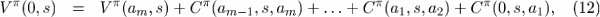

- where a₀,a₁,...,a<sub>m</sub> is the "path" of Max nodes chosen by the hierarchical policy , going from the Root down to a primitive leaf node.
- 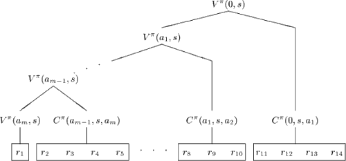

We can summarize the presentation of this section by the following theorem:

**Theorem 2** Let π = { πᵢ; i=0,...,n } be a hierarchical policy defined for a given MAXQ graph with subtasks M₀,M₁,...,M<sub>n</sub> , and let i=0 be the root node of the graph.  Then there exist values for C<sup>π</sup>(i,s,a) ( for internal Max nodes ) and V<sup>π</sup>(i,s) (for primitive , leaf Max node ) such that V<sup>π</sup>(0,s) is the expected discounted cumulative reward of following policy π starting in state s.


It is important to note that this representation theorem does not mention the pseudo- reward function, because the pseudo-reward is used only during learning.

This theorem captures the representational power of the MAXQ decomposition, but it does not address the question of whether there is a learning algorithm that can find a given policy. 

---

<h2 id="d6441f91c197a8e36b0008ba2307889a"></h2>

# A Learning Algorithm for the MAXQ Decomposition

- MAXQ-0 learning algorithm
    - which can learn value functions (and policies) for MAXQ hierarchies in which there are no pseudo-rewards , i.e., the pseudo-rewards are 0.
    - converges to a recursively optimal policy for the given MAXQ hierarchy.
- MAXQ-Q learning algorithm
    - which handles non-zero pseudo-reward functions.
    - a of accelerating MAXQ-O learning.

<h2 id="891e7168eccd8d630e8c572615d85781"></h2>

## 4.1 Two Kinds of Optimality


In the MAXQ method, the constraints take two forms.

 1. First, within a subtask, only some of the possible primitive actions may be permitted. 
    - for example, in the taxi task, during a Navigate(t), only the North, South, East, and West actions are available
    - the Pickup and Putdown actions are not allowed.
 2. Second, consider a Max node Mⱼ with child nodes {Mⱼ₁,..., Mⱼ<sub>k</sub>}. The policy learned for Mⱼ must involve executing the learned policies of these child nodes. 
    - When the policy for child node Mⱼᵢ, is executed, it will run until it enters a state in Tⱼᵢ. 
    - Hence , any policy learned for  for Mⱼ must pass through some subset of these terminal state sets { Tⱼ₁,..., Tⱼ<sub>k</sub> }


**Definition 7** A hierarchically optimal policy for MDP M is a policy that achieves the highest cumulative reward among all policies consistent with the given hierarchy.

Parr (1998b) proves that his HAMQ learning algorithm converges with probability 1 to a hierarchically optimal policy.

Similarly, given a fixed set of options, Sutton, Precup, and Singh (1998) prove that their SMDP learning algorithm converges to a hierarchically optimal value function. 

Incidentally, they also show that if the primitive actions are also made available as “trivial” options, then their SMDP method converges to the optimal policy. 


Because the MAXQ decomposition can represent the value function of any hierarchical policy, we could easily construct a modified version of the HAMQ algorithm and apply it to learn hierarchically optimal policies.  However, we decided to pursue an even weaker form of optimality. This form of optimality is called **recursive optimality**.

- hierarchically optimal is to say that I have to respect the hierarchy but I need not necessarily solve each component optimally , overall the problem should be optimally solved. 
- recursively optimal is to say that not only should I respect the hierarchy but for each individual components in the sub hierarchy I should have an optimal solution. 

Recursive optimality is a kind of local optimality in which the policy at each node is optimal  , given the policies of its children.

 
The reason to seek recursive optimality rather than hierarchical optimality is that 

- recursive optimality makes it possible to solve each subtask without reference to the context in which it is executed.
- This context-free property makes it easier to share and re-use subtasks.

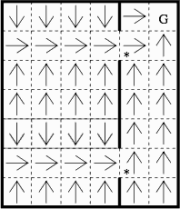

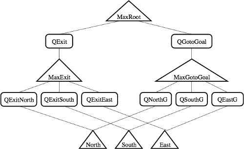

- The policy shown in the left diagram is recursively optimal but not hierarchically optimal.
- The shaded cells indicate points where the locally-optimal policy is not globally optimal.

If we consider for a moment, we can see a way to fix this problem. 

- The value of the upper starred state under the optimal hierarchical policy is -2 and the value of the lower starred state is -6
- Hence, if we changed pseudo reward R̃ to have these values(intead of being zero) , then the recursively-optimal policy would be hierarchically optimal (and globally optimal).
- In other words, if the programmer can guess the right values for the terminal states of a subtask, then the recursively optimal policy will be hierarchically optimal.

in principle, it is possible to learn good values for the pseudo-reward function, in practice, we must rely on the programmer to specify a single pseudo-reward function, R̃  , for each subtask. 


In our experiments, we have employed the following simplified approach to defining R̃.

- For each subtask Mᵢ, we define two predicates: the termination predicate, Tᵢ, and a goal predicate, Gᵢ. 
    - The goal predicate defines a subset of the terminal states that are “goal states”, and these have a pseudo-reward of 0.
    - All other terminal states have a fixed constant pseudo-reward (e.g., -100)  , that is set so that it is always better to terminate in a goal state than in a non-goal state.


In our experiments with MAXQ, we have found that it is easy to make mistakes in defining Tᵢ and Gᵢ.  If the goal is not defined carefully, it is easy to create a set of subtasks that lead to infinite looping. 

For example, consider again the problem in Figure 6. Suppose we permit a fourth action, West, and let us define the termination and goal predicates for the right hand room , to be satisfied iif either the robot reaches the goal or it exits the room. 

However, the resulting locally-optimal policy for this room will attempt to move to the nearest of these three locations: the goal, the upper door, or the lower door. 

We can easily see that for all but a few states near the goal, the only policies that can be constructed by MaxRoot will loop forever, first trying to leave the left room by entering the right room, and then trying to leave the right room by entering the left room.

This problem is easily fixed by defining the goal predicate Gᵢ for the right room to be true if and only if the robot reaches the goal G. But avoiding such “undesired termination” bugs can be hard in more complex domains.


In the worst case, it is possible for the programmer to specify pseudo-rewards such that the recursively optimal policy can be made arbitrarily worse than the hierarchically optimal policy. For example,  suppose that we change the original MDP in Figure 6 so that the state immediately to the left of the upper doorway gives a large negative reward -L whenever the robot visits that square. So the hierarchically- optimal policy exits the room by the lower door.  But suppose the programmer has chosen instead to force the robot to exit by the upper door (e.g., by assigning a pseudo-reward of -10L or leaving via the lower door).  In this case, the recursively-optimal policy will leave by the upper door and suffer the large -L penalty . By making L arbitrarily large, we can make the difference between the hierarchically-optimal policy and the recursively-optimal policy arbitrarily large.

<h2 id="3b97da78e886b3f8d17c9f4c54540171"></h2>

## 4.2 The MAXQ-O Learning Algorithm

MAXQ-0 is a recursive function that executes the current exploration policy starting at Max node i in state *s*. It performs actions until it reaches a terminal state, at which point it returns a count of the total number of primitive actions that have been executed. 

To execute an action, MAXQ-0 calls itself recursively. 

When the recursive call returns, it updates the value of the completion function for node i.

It uses the count of the number of primitive actions to appropriately discount the value of the resulting state s'. 

At leaf nodes, MAXQ-0 updates the estimated one-step expected reward, V(i,s). 

The value a<sub>t</sub>(i) is a “learning rate” parameter that should be gradually decreased to zero in the limit.

> Table 2: The MAXQ-O learning algorithm. 

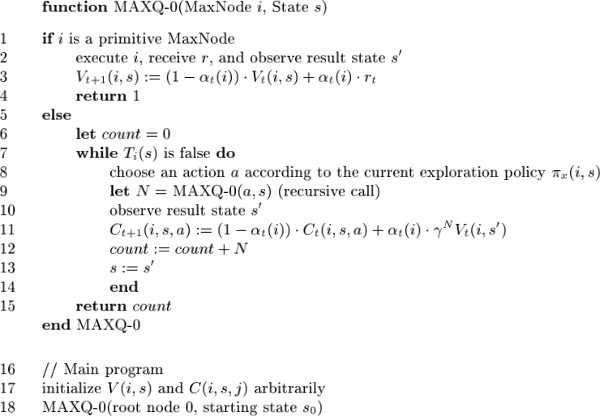


There are three things that must be specifiedin order to make this algorithm description complete

 1.  First, to keep the pseudo-code readable, Table 2 does not show how “ancestor termination” is handled.
    - after each action, the termination predicates of all of the subroutines on the calling stack are checked.
    - If the termination predicate of any one of these is satisfied, no C values are updated in any of the subroutines that were interrupted except as follows:
        - If subroutine i had invoked subroutine j, and j’s termination condition is satisfied, then subroutine i can update the value of C(i, s,j).
 2. Second, we must specify how to compute V<sub>t</sub> in line 11 , since it is not stored in the Max node.
    - It is computed by the following modified versions of the decomposition equations:
    - 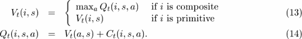
        - compared with Equations (10) and (11), it is optimal value, not the value under fixed policy
    - To compute V<sub>t</sub>(i,s) using these equations, we must perform a complete search of all paths through the MAXQ graph starting at node i and ending at the leaf nodes. 
        - Table 3 gives pseudo-code for a recursive function, EVALUATEMAXNODE, that implements a depth-first search.

> Table 3: Pseudo-code for Greedy Execution of the MAXQ Graph.

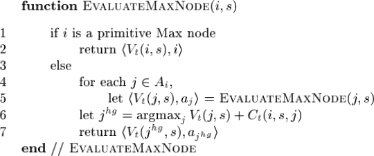

This search can be computationally expensive, and a problem for future research is to develop more efficient methods for computing the best path through the graph. 

One approach is to perform a best-first search and use bounds on the values within subtrees to prune uselesspaths through the MAXQ graph. 

A better approach would be to make the computation incremental, so that when the state of the environment changes, only those nodes whose values have changed as a result of the state change are re-considered.

It should be possible to develop an efficient bottom-up method similar to the RETE algorithm .

 3. The third thing that must be specified to complete our definition of MAXQ-0 is the exploration policy, We require that be ordered GLIE policy.


**Definition 9** An ordered GLIE policy is a GLIE policy ( Greedy in the Limit with Infinite Exploration) that converges in the limit to an ordered greedy policy, which is a greedy policy that imposes an arbitrary fixed order ω on the available actions and breaks ties in favor of the action a that appears earliest in that order.

We need this property in order to ensure that MAXQ-0 converges to a uniquely-defined recursively optimal policy.  

A fundamental problem with recursive optimality is that in general, each Max node i will have a choice of many different locally optimal policies given the policies adopted by its descendent nodes. These different locally optimal policies will all achieve the same locally optimal value function, but they can give rise to different probability transition functions P(s',N | s,i). The result will be that the SMDP defined at the next level above node i in the MAXQ graph will differ depending on which of these various locally optimal policies is chosen by node i. These differences may lead to better or worse policies at higher levels of the MAXQ graph, even though they make no difference inside subtask i.

In practice, the designer of the MAXQ graph will need to design the pseudo-reward function for subtask i to ensure that all locally optimal policies are equally valuable for the parent subroutine. But to carry out our formal analysis, we will just rely on an arbitrary tie-breaking mechanism.

If we establish a fixed ordering over the Max nodes in the MAXQ graph (e.g., a left-to-right depth-first numbering), and break ties in favor of the lowest-numbered action, then this defines a unique policy at each Max node. And consequently, by induction, it defines a unique policy for the entire MAXQ graph. Let us call this policy  π<sup>\*</sup>ᵣ. We will use the r subscript to denote recursively optimal quantities under an ordered greedy policy. Hence, the corresponding value function is V<sup>\*</sup>ᵣ , and G<sup>\*</sup>ᵣ , and Q<sup>\*</sup>ᵣ . We now prove that the MAXQ-O algorithm converges to π<sup>\*</sup>ᵣ.


**Theorem 3** 


The most important aspect of this theorem is that it proves that Q learning can take place at all levels of the MAXQ hierarchy simultaneouslyithe higher levels do not need to wait until the lower levels have converged before they begin learning. All that is necessary is that the lower levels eventually converge to their (locally) optimal policies.

<h2 id="23feda6ab3a0c28739ff075e59ed559e"></h2>

## 4.3 Techniques for Speeding Up MAXQ-0


Algorithm MAXQ-0 can be extended to accelerate learning in the higher nodes of the graph by a technique that we call “all-states updating”. 

When an action a is chosen for Max node 2'in state 5, the execution of a will move the environment through a sequence of states s = s₁, ... ,S<sub>N</sub> , S<sub>N+1</sub> = s'. 

Because all of our subroutines are Markovian, the same resulting state  s' would have been reached if we had started executing action a in state s₂, or s₃, or any state up to and including  S<sub>N</sub>. Hence, we can execute a version of line 11 in MAXQ-0 for each of these intermediate states as shown in this replacement pseudo-code:

```python
    # for non-primitive a
    for i in xrange( 1,N+1 ):
        C_t+1 (i,s_j,a) = (1-a(i))*C(i,s_j,a) + a(i)*(gamma **(N+1-j))* max_ap( Q( i,s',a' ) )
```

In our implementation, as each composite action is executed by MAXQ-0, it constructs a linked list of the sequence of primitive states that were visited. This list is returned when the composite action terminates. 

The parent Max node concatenates the state lists that it receives from its children and passes them to its parent when it terminates. 

All experiments in this paper employ all-states updating.

---

Kaelbling (1993) introduced a related, but more powerful, method for accelerating hi- erarchical reinforcement learning that she calls “all-goals updating.” 

In all-goals updating, whenever a primitive action is executed, the equivalent of line 11 of MAXQ-0 is applied in every composite task that could have invoked that primitive action. Sutton, Precup, and Singh (1998) prove that each of the composite tasks will converge to the optimal Q values under all-goals updating. 

a simple form of all-goals updating  :  Whenever one of the primitive actions a is executed in state s, we can update the C(i, s, a) value for all parent tasks i that can invoke a. 


However, additional care is required to implement all-goals updating for non-primitive actions. the exploration policy must be an ordered GLIE policy that will converge to the recursively optimal policy for subtask j and its descendents. We cannot follow an arbitrary exploration policy, because this would not produce accurate samples of result states drawn according to P<sup>\*</sup>(s',N|s,j). Hence, unlike the simple case described by Sutton, Precup, and Singh, the exploration policy cannot be different from the policies of the subtasks being learned.


Although this considerably reduces the usefulness of all-goals updating, it does not completely eliminate it. A simple way of implementing non-primitive all-goals updating would be to perform MAXQ-Q learning as usual, but whenever a subtask j was invoked in state s and returned, we could update the value of C(c, s, j) for all potential calling subtasks i.

<h2 id="9847a1803bd225e326da8c36497968a6"></h2>

## 4.4 The MAXQ-Q Learning Algorithm 

We could just add the pseudo- reward into MAXQ-0 , but this would have the effect of changing the MDP M to have a different reward function.The pseudo-rewards “contaminate” the values of all of the completion functions computed in the hierarchy. The resulting learned policy will not be recursively optimal for the original MDP.

This problem can be solved by learning one completion function for use “inside” each Max node ,

and a separate completion function for use “outside” the Max node.

The quantities used “inside” a node will be written with a tilde: R̃, C̃, and Q̃. 

The “outside” completion function, C(i,s,a) is the completion function that we have been discussing so far in this paper. This completion function will be used by parent tasks to compute V(i,s).

The second completion function  C̃(i,s,a)  will use only “inside” node i in order to discover the locally optimal policy for task Mᵢ. This function
will incorporate rewards both from the “real” reward function,  R(s'|s,a) , and from the pseudo-rewardfunction, R̃ᵢ(s'). It will also be used by EVALUATEMAXNODEin line 6 to choose the best action j<sup>hg</sup> to execute. Note, however, that EVALUATEMAXNODE will still return the “external” value V( j<sup>hg</sup> , s ) of this chosen action.

We will employ two different update rules to learn these two completion functions. 

The  C̃ function will be learned using an update rule similar to the Q learning rule in line 11 of MAXQ-0.  But the C function will be learned using an update rule similar to SARSA(0) -- its purpose is to learn the value function for the policy that is discovered by optimizing C̃ .

```
# Table 4


```

> Table 4: The MAXQ-Q learning algorithm.


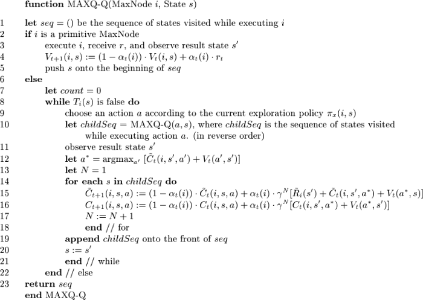

<h2 id="be6b86743fc14285b97d7d0037337a64"></h2>

# 5. State Abstraction

let us compute the number of values that must be stored for the taxi problem ***without*** any state abstraction.

The MAXQ representation must have tables for each of the C functions at the internal nodes and the V functions at the leaves.

First, at the six leaf nodes, to store V(i,s), we must store 500 values at each node, because there are 500 states; 25 locations, 4 possible destinations for the passenger, and 5 possible current localtions for the passenger. 

Second, at the root node, there are two children, which requires 2 X 500 = 1000 values. 

Third, at the MaxGet and MaxPut nodes, we have 2 actions each, so each one requires 1000 values, for a total of 2000.

Finally, at MaxNavigate(t), we have four actions, but now we must also consider the target parameter t, which can take 4 possible values. Hence, there are effectively 2000 combinations of states and t values for each action, or 8000 total values that must be represented.

In total, therefore, the MAXQ representation requires 14,000 separate quantities to represent the value function.

A flat Q learning representation need store a separate value for each of the six primitive actions in each of the 500 possible states, for a total of 3,000 values. Hence, we can see that without state abstraction, the MAXQ representation requires more than 4 times the memory of a flat Q table!

<h2 id="287fa4871442358e00cdd22bdccfe7fc"></h2>

## 5.1 Five Conditions that Permit State Abstraction

**Definition 10**  Let M be a MDP and H be a MAXQ graph defined over M.  Suppose that each state s can be written as a vector of values of a set of state variables. At each Marc node i, suppose the state variables are partitioned into two sets Xᵢ and Yᵢ, and let *xᵢ* be a function that project a state s onto only the values of the variables in  Xᵢ . Then H combined with *xᵢ* is called a state-abstracted MAXQ graph.

We will often write s = (x,y) to mean such state partitioned. Similary, we will sometime write P(x',y',N|x,y,a) , V(a,x,y) , R̃(x',y') in place of P(s',N|s,a) , V(a,s) , R̃(s) respectively.

**Definition 11 (Abstract Policy)** An abstract hierarchical policy for MDP M with state-abstracted MAXQ graph H and associated abstraction functions *xᵢ* , is a hierarchical policy in which each policy πᵢ satisfies the condition that 

for any two states s₁ and s₂ such that *xᵢ*(s₁) = *xᵢ*(s₂) , πᵢ(s₁) = πᵢ(s₂) . ( when πᵢ is a stochastic policy,this is interpreted to mean that the probability distributions for choosing actions are the same in both states.) 


---

In order for MAXQ-Q to converge in the presence of state abstractions, we will require that at all times t its (instantaneous) exploration policy is an abstract hierarchical policy.

Now let us describe and analyze the 5 abstraction conditions. We have identified 3 different kinds of conditions under which abstractions can be introduced. 

 1. The first kind involves eliminating irrelevant variables within a subtask of the MAXQ graph.
    - nodes toward the leaves of the MAXQ graph tend to have very few relevant variables, and nodes higher in the graph have more relevant variables.
    - Hence, this kind of abstraction is **most useful at the lower levels** of the MAXQ graph.
 2. The second kind of abstraction arises from “funnel” actions.
    - These are macro actions that move the environment from some large number of initial states to a small number of resulting states.
        - s₂,s₃,... all leads to s' ?
    - The **completion cost** of such subtasks can be represented using a number of values proportional to the number of resulting states.
    - Funnel actions tend to appear higher in the MAXQ graph, so this form of abstraction is **most useful near the root** of the graph.
 3. The third kind of abstraction arises from the structure of the MAXQ graph itself. 
    - It exploits the fact that large parts of the state space for a subtask may not be reachable because of the termination conditions of its **ancestors** in the MAXQ graph.

---

<h2 id="0fd7085da1b16936628a34768637ff1c"></h2>

### 5.1.1 CONDITION 1: MAX NODE IRRELEVANCE

Let `𝒳(s) = x` be the associated abstraction function,

Definition 12 (Max Node Irrelevance):

for any pair of states 𝒳(s₁) = 𝒳(s₂) = x, and any child action *a*, 

<center>
V<sup>π</sup>(a,s<sub>1</sub>) = V<sup>π</sup>(a,s<sub>2</sub>) , and R̃<sub>i</sub>(a,s<sub>1</sub>) = R̃<sub>i</sub>(a,s<sub>2</sub>)
</center>


Lemma 2: 

<center>

Q<sup>π</sup>(i, s, j) = Q<sup>π</sup>(i, 𝒳<sub>i</sub>(s), j) 

Q<sup>π</sup>(i, s, j) = V<sup>π</sup>(j, 𝒳<sub>i</sub>(s)) +  C<sup>π</sup>(i, 𝒳<sub>i</sub>(s), j)
</center>


For example, let us consider the Navigate(t) subtask.  The source and destination of the passenger are irrelevant to the achievement of this subtask. Any policy that successfully completes this subtask will have the same value function regardless of the source and destination locations of the passenger. 

By abstracting away the passenger source and destination, we obtain a huge savings in space. Instead of requiring 8000 values(500 states, 4 possible values for t, 4 actions) to represent the C functions for this task, we require only 400 values (25 status (taxi locations), 4 possible values for t, and 4 actions ). 

Figure 7 shows that the irrelevant variables Y do not affect the rewards either directly or indirectly.

<center>

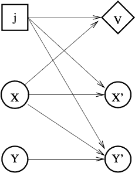

</center>

> nodes X and Y represent the state variables at time t,  X' and Y' represent the state variables at a later time t + N

> square action node j is the chosen child subroutine

> utility node V represents the value function V(j, x) of that child action

Note that while X may influence Y' , Y cannot affect X', and therefore, it cannot affect V .

---

Lemma 3: 

<center>
P, R, R̃, T
</center>

In the Taxi task, the primitive navigation actions, North, South, East, and West only depend on the location of the taxi and not on the location of the passenger. The pseudo-reward function and termination condition for the MaXNavigate(t) node only depend on the location of the taxi (and the parameter t). Hence,  the passenger source and destination are irrelevant for the MaxNavigate node.


<h2 id="87349168dccb260456b23839e9702af4"></h2>

### 5.1.2 CONDITION 2: LEAF IRRELEVANCE

Lemma 4:

<center>
V(a, s) = V(a, 𝒳(s)) = V(a, x)
</center>

Lemma 5:

<center>
P, R
</center>


Lemma 6: Suppose R(s' | s, a)  is always equal to a constant r<sub>a</sub> . Then **the entire state *s* is irrelevant to the primitive action *a*.**


The four leaf nodes North, South, East, and West in the taxi task, because their one-step reward is a constant (-1). Hence, instead of requiring 2000 values(500 states * 4 actions) to store the V functions, we only need 4 values, one for each action. 

Similarly, the expected rewards of the Pickup and Putdown actions each require only 2 values, depending on whether the corresponding actions are legal or illegal. Hence, together, they require 4 values( 2 per action * 2 actions ), instead of 1000 values ( 500 states * 2 actions ).


<h2 id="a9f97f89dbb6e80750e445877a4cc214"></h2>

### 5.1.3 CONDITION 3: RESULT DISTRIBUTION IRRELEVANCE

Now we consider a condition that results from “funnel” actions.

**Definition 14 (Result Distribution Irrelevance)**:

 For all pairs of s₁ and s₂ that differs for the state variables in Y<sub>j</sub>,

 <center>
 P<sup>π</sup>( s', N | s₁, j ) = P<sup>π</sup>( s', N | s₂, j )
 </center>

 for all s' and N, then the C value of its parent task i can be represented compactly:

**Lemma 7**: 

<center>
C<sup>π</sup>(i, s, j) = C<sup>π</sup>(i, 𝒳<sub>ij</sub>(s), j)
</center>

In **undiscounted** cumulative reward problems, the definition of result distribution irrelevance can be weakened to eliminate N , the number of steps.

 <center>
 P<sup>π</sup>( s' | s₁, j ) = P<sup>π</sup>( s' | s₂, j )
 </center>

---

Consider, for example, the Get subroutine for the taxi task. No matter what location the taxi has in state s , the taxi will be at the passenger’s starting location when the Get finishes executing . Hence, the starting location is irrelevant to the resulting location of the taxi, and P(s'|s₁,Get) = P(s'|s₂,Get) for all state s₁ and s₂ that differ only in the taxi's location.

**Note**, however, that if we were maximizing **discounted** reward, the taxi’s location **would NOT** be irrelevant, because the probability that Get will terminate in exactly N steps would depend on the location of the taxi, which could differ in states s₁ and s₂. Different values of N will produce different amounts of discouting, and hense we cannot ignore the taxi location when representing the C() function for Get.
But in the **undiscounted** case, by applying Lemma 7, we can represent C(Root, s, Get) using 16 distinct values, because there are 16 equivalence classes of states (4 source locations times 4 destination locations).  This is much less than the 500 quantities in the unabstracted representation.

**Note** that although state variables Y may be irrelevant to the result distribution of a subtask j, **they may be important within subtask j**. 
In the Taxi task, the location of the taxi is critical for representing the value of V(Get, s),  but it is irrelevant to the result state distribution for Get, and therefore it is irrelevant for representing C(Root, 3, Get).  Hence, the MAXQ decomposition is essential for obtaining the benefits of result distribution irrelevance.

The Result Distribution Irrelevance condition is applicable in all such situations as long as we are in the **undiscounted** setting.

<h2 id="fa47406de877edbd1d58fe0b8f4489b6"></h2>

### 5.1.4 CONDITION 4: TERMINATION

The fourth condition is closely related to the “funnel” property. 

It applies when a subtask is guaranteed to cause its **parent task** to terminate in a **goal state**.In a sense, the subtask is funneling the environment into the set of states described by the goal predicate of the parent task.

**Lemma 8(Termination)** Let Mᵢ be a task in a MAXQ graph such that for all states s where the goal predicate Gᵢ(s) is true, the pseudo-reward function  R̃ᵢ(s) = 0. 

Suppose there is a child task *a* and for every possible state s’ that results from applying *a* in s will make the goal predicate, Gᵢ, true.

Then for any policy executed at node i, the **completion cost  C(i,s,a) is 0** and does not need to be explicitly represented.

- 子任务a 执行总是 满足  Gᵢ(s')=true

For example, in the Taxi task, in all states where **the taxi is holding the passenger**, the Put subroutine will succeed and result in a goal terminal state for Root.This is because the termination predicate for Put (i.e., that the passenger is at his or her destination location, because illegally put won't ternimate) implies the goal condition for Root (which is the same).This means that C(Root, s, Put) is uniformly zero, for all states s where Put is not terminated.

It is easy to detect caseswhere the Termination condition is satisfied. We only need to compare the termination predicate  Tₐ of a subtask with the goal predicate Gᵢ of the parent task. If the first implies the second, then the termination lemma is satisfied.

<h2 id="3bd22ac574778f26097a5d3c815bcee5"></h2>

### 5.1.5 CONDITION 5: SHIELDING

The shielding condition arises from the structure of the MAXQ graph.

**Lemma 9 (Shielding)** Let s be a state such that in all paths from the root of the graph down to node Mᵢ there is a subtask j (possibly equal to i) whose termination predicate Tⱼ(s) is true , then the Q nodes of Mᵢ do not need to represent C values for state s.

As with the Termination condition, the Shielding condition can be verified by analyzing the structure of the MAXQ graph and identifying nodes whose ancestor tasks are terminated.

In the Taxi domain, a simple example of this arises in the Put task,  which is terminated in all states where **the passenger is not in the taxi**. This means that we do not need to represent C(Root,s, Put) in these states. 

The result is that, when combined with the Termination condition above, we do not need to explicitly represent the completion function for Put at all!

<h2 id="fb8187ec15df35190dbc58aa6d7d4815"></h2>

### 5.1.6 DICUSSION

By applying these 5 abstraction conditions, we obtain the following “safe” state abstractions for the Taxi task:

- North, South, East, and West. These terminal nodes require one quantity each, for a total of four **values**. (Leaf Irrelevance).
    - for any s , V = -1
- Pickup and Putdown each require 2 **values** (legal and illegal states), for a total of four. (Leaf Irrelevance.)
- QNorth(t), QSouth(t), QEast(t), and QWest(t) each require 100 **values** (four values for t and 25 locations). (Max Node Irrelevance.)
    - QNorth(t) : C( Navigate , s , North )
- QNavigateForGet requires 4 values (for the four possible source locations). 
    - (The passenger destination is Max Node Irrelevant for MaxGet, and the taxi starting location is Result Distribution Irrelevant for the Navigate action.)
    - > Max node is for only graph structure,  it eventaully instantiated as incoming Q ?
- QPickup requires 100 possible values, 4 possible source locations and 25 possible taxi locations. (Passenger destination is Max Node Irrelevant to MaxGet.)
- QGet requires 16 possible values(4 source locations, 4 destination locations). (Result Distribution Irrelevance.)
- QNavigateForPut requires only 4 values (for the four possible destination locations). 
    - (The passenger source and destination are Max Node Irrelevant to MaxPut; the taxi location is Result Distribution Irrelevant for the Navigate action.)
- QPutdown requires 100 possible values (25 taxi locations, 4 possible destination locations). (Passengersourceis Max Node Irrelevant for MaxPut.)
- QPut requires 0 values. (Termination and Shielding.) 


This gives a total of 632 distinct values, which is much less than the 3000 values required by flat Q learning.

A key thing to note is that with these state abstractions, the value function is decomposed into a sum of terms such that no single term depends on the entire state of the MDP, even though the value function as a whole does depend on the entire state of the MDP. 


For example, show as figure 1,

 ![][1] , 

the value of a state s₁ with the passenger at R, the destination at B , and the taxi at (0,3) can be decomposed as 

 V(Root,s₁) = V(North,s₁) + C(Navigate(R) , s₁, North ) + C(Get, s₁, Navigate(R) ) + C(Root, s₁,Get) 


With state abstractions, we can see that each term on the right-hand side only depends on a subset of the features:

- V(North,s₁) is a constant
- C(Navigate(R) , s₁, North )  depends only on the taxi location and the passenger’s source location.
- C(Get, s₁, Navigate(R) ) depends only on the source location.
- C(Root, s₁,Get) depends only on the passenger’s source and destination. 

---

What prior knowledge is required on the part of a programmer in order to identify these state abstractions? 

It suffices to know some qualitative constraints on the one-step reward functions, the one-step transition probabilities, and termination predicates, goal predicates, and pseudo-reward functions within the MAXQ graph. Speciffcally, the Max Node Irrelevance and Leaf Irrelevance conditions require simple analysis of the one-step transition function and the reward and pseudo-reward functions. 

Opportunities to apply the Result Distribution Irrelevance condition can be found by identifying “funnel” effects that result from the definitions of the termination conditions for operators. 

Similarly, the Shielding and Termination conditions only require analysis of the termination predicates of the various subtasks. 

Hence, applying these 5 conditions to introduce state abstractions is a straightforward process, and once a model of the one-step transition and reward functions has been learned, the abstraction conditions can be checked to see if they are satisfied.


<h2 id="a905db7d811ede823e2afa218e22b5d8"></h2>

##  5.2 Convergence of MAXQ-Q with State Abstraction

The goal of this section is to prove these two results: 

- (a) that the ordered recursively-optimal policy is an abstract policy (and, hence, can be represented using state abstractions) 
- (b) that MAXQ-Q will converge to this policy when applied to a MAXQ graph with safe state abstractions.

<h2 id="3a77b82cf90e359bca449dc6baea1a13"></h2>

## 5.3 The Hierarchical Credit Assignment Problem

There are still some situations where we would like to introduce state abstractions but the 5 properties described above do not permit them.

Consider the following modification of the taxi problem. Suppose that the taxi has a fuel tank and that each time the taxi moves one square, it costs one unit of fuel. If the taxi runs out of fuel before delivering the passenger to his or her destination, it receives a reward of -20, and the trial ends. Fortunately, there is a filling station where the taxi can execute a Fillup action to fill the fuel tank.


To solve this modified problem using the MAXQ hierarchy, we can introduce another subtask, Refuel, which has the goal of moving the taxi to the filling station and filling the tank. MaxRefuelis a child of MaxRoot, and it invokes Navigate(t) (with t bound to the location of the filling station) to move the taxi to the filling station.

Now we must include the current amount of fuel as a feature in representing every C value (for internal nodes) and V value (for leaf nodes) throughout the MAXQ graph. This is unfortunate. Navigate(t) subtask should not need to worry about the amount of fuel, because even if there is not enough fuel, there is no action that Navigate(t) can take to get more fuel. Instead, it is the top-level subtasks that should be monitoring the amount of fuel and deciding whether to go refuel, to go pick up the passenger, or to go deliver the passenger.

Given this intuition, it is natural to try abstracting away the “amount of remaining fuel” within the Navigate(t) subtask. However, this doesn’t work, because when the taxi runs out of fuel and a -20reward is given, the QNorth, QSouth, QEast, and QWest nodes cannot “explain” why this reward was received -- that is, they have no consistent way of setting their C tables to predict when this negative reward will occur, because their C values ignore the amount of fuel in the tank. Stated more formally, The diffiiculty is that the Max Node Irrelevance condition is not satisfied because the one-step reward function R(s' |s,a) for these actions depends on the amount of fuel.

We call this the *hierarchical credit assignment problem*. 

The fundamental issue here is that in the MAXQ decomposition all information about rewards is stored in the leaf nodes of the hierarchy. 

We would like to separate out the basic rewards received for navigation (i.e., -1for eachaction) from the rewardreceivedfor exhaustingfuel (-20). If we make the reward at the leaves only depend on the location of the taxi, then the Max Node Irrelevance condition will be satisfied.

One way to do this is to have the programmer manually decompose the reward function and indicate which nodes in the hierarchy will “receive” each reward.

Let R(s'|s,a) = ∑ᵢ R(i,s'|s,a) be a decomposition of the reward function,  such that R(i,s'|s,a) specifies that part of the reward that must be handled by Max node i. 

In the modified taxi problem, for example, we can decompose the reward so that the leaf nodes receive all of the original penalties, but the out-of-fuelrewards must be handled by MaxRoot. 

Lines 15 and 16 of the MAXQ-Q algorithm are easily modifiedto include R(i, s’|s, a).

<h2 id="be3d80bb862c5123b4a97b94416dd9cd"></h2>

# 6. Non-Hierarchical Execution of the MAXQ Hierarchy

Up to this point in the paper, we have focused exclusively on representing and learning hierarchical policies.  However, often the optimal policy for a MDP is not strictly hierarchical. 

Kaelbling (1993) first introduced the idea of deriving a non-hierarchical policy from the value function of a hierarchical policy. In this section, we exploit the MAXQ decomposition to generalize her ideas and apply them recursively at all levels of the hierarchy.

We will describe two methods for non-hierarchical execution.

The first method is based on the dynamic programming algorithm known as policy iteration. The policy iteration algorithm starts with an initial policy π⁰. It then repeats the following two steps until the policy converges.  In the policy evaluation step, it computes the value function V<sup>πk</sup> of the current policy π<sub>k</sub>. Then, in the policy improvement step, it computes a new policy, π<sub>k+1</sub> ccording to the rule

 

Note that in order to apply this method, we need to know P and R.

If we know P and R , we can use the MAXQ representation of the value function to perform one step of policy iteration. 

We start with a hierarchical policy π and represent its value function using the MAXQ hierarchy (e.g., π could have been learned via MAXQ-Q). 

Then, we can perform one step of policy improvement by applying Equation (23) using V<sup>π</sup>(0,s')(computed by MAXQ hierarchy) to compute V<sup>π</sup>(s') .

 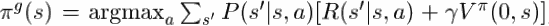

Unfortunately, we can’t iterate this policy improvement process, because the new policy,is very unlikely to be a hierarchical policy . Nonetheless, one step of policy improvement can give very significant improvements.

This approach to non-hierarchical execution ignores the internal structure of the MAXQ graph. In effect, the MAXQ hierarchy is just viewed as a way to represent V<sup>π</sup> -- any other representation would give the same one-step improved policy π<sup>g</sup>.

The second approach to non-hierarchical execution borrows an idea from Q learning. One of the great beauties of the Q representation for value functions is that we can compute one step of policy improvement without knowing P(s'|s,a) , simply by taking the new policy to be π<sup>g</sup>(s) = argmaxₐ Q(s,a). This gives us the same one-step greedy policy as we computed above using one-step lookahead. With the MAXQ decomposition, we can perform these policy improvement steps at all levels of the hierarchy.

We have already defined the function that we need. In Table 3 we presented the function EVALUATEMAXNODE, which, given the current state  s , conducts a search along all paths from a given Max node i to the leaves of the MAXQ graph and finds the path with the best value. This is equivalent to computing the best action greedily at each level of the MAXQ graph. In addition, EVALUATEMAXNODE returns the primitive action a at the end of this best path.This action a would be the first primitive action to be executed if the learned hierarchical policy were executed starting in the current state s. 

Our second method for non-hierarchical execution of the MAXQ graph is to call EVALUATEMAXNODE in each state, and execute the primitive action a that is returned. The pseudo-code is shown in Table 5.

> Table 5: The procedure for executing the one-step greedy policy.

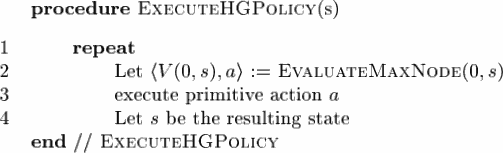

We will call the policy computed by EXECUTEHGPOLICY the *hierarchical greedy policy*, and denote it  π<sup>hg\*</sup> , where the superscript \* indicates that we are computing the greedy action at each time step.  The following theorem shows that this can give a better policy than the original, hierarchical policy.

**Theorem 5** Let G be a MAXQ graph , representing the value function of hierarchical policy π (i.e., in terms of C<sup>π</sup>(i,s,j) , computed for all i,s,and j  ).  Let V<sup>hg</sup>(0,s) be the value computed by EXECUTEHGPOLICY line 2, and let π<sup>hg\*</sup> be the resulting policy. Define V<sup>hg\*</sup> to be the value function of π<sup>hg\*</sup> . Then for all states s, it is the case that 

 V<sup>π</sup>(s) ≤ V<sup>hg</sup>(0,s)  ≤ V<sup>hg\*</sup>(s).

To establish the right inequality, note that by construction V<sup>hg</sup>(0,s) is the value function of a policy, call it  π<sup>hg</sup>, that chooses one action greedily at each level of the MAXQ graph (recursively), and then follows π thereafter. This is a consequence of the fact that line 6 of EVALUATEMAXNODE has C<sup>π</sup> on its right-hand side, and C<sup>π</sup> represents the cost of “completing” each subroutine by following π , not by following some other, greedier, policy. ( In Table 3, C<sup>π</sup> is written as C<sub>t</sub> )  However, when we execute EXECUTEHGPOLICY(and hence, execute π<sup>hg\*</sup> ) , we have an opportunity to improve upon π and π<sup>hg</sup>  at each time step. Hence, V<sup>hg</sup>(0,s) is an underestimateof the actual valueof V<sup>hg\*</sup>(s). Q.E.D.

Note that this theorem only works in one direction. It says that if we can find a state where V<sup>hg</sup>(0,s) > V<sup>π</sup>(s) , then the greedy policy ,π<sup>hg\*</sup> , will be strictly better than π.  However, it could be that π is not an optimal policy and yet the structure of the MAXQ graph prevents us from considering an action (either primitive or composite) that would improve π. Hence, unlike the policy improvement theorem of Howard (where all primitive actions are always eligible to be chosen), we do not have a guarantee that if π is suboptimal, then the hierarchically greedy policy is a strict improvement.
 
In contrast, if we perform one-step policy improvement as discussed at the start of this section, Corollary 3 guarantees that we will improve the policy. So we can see that in general, neither of these two methods for non-hierarchical execution is always better than the other.  Nonetheless, the first method only operates at the level of individual primitive actions, so it is not able to produce very large improvements in the policy. In contrast, the hierarchical greedy method can obtain very large improvements in the policy by changing which actions (i.e., subroutines) are chosen near the root of the hierarchy.Hence, in general, hierarchical greedy execution is probably the better method. 

Some care must be taken in applying Theorem 5 to a MAXQ hierarchy whose C values have been learned via MAXQ-Q. 

Being an online algorithm, MAXQ-Q will not have correctly learned the values of all states at all nodes of the MAXQ graph. 

For example, in the taxi problem, the value of C(Put, s , QPutdown) will not have been learned very well except at the four special locations R, G, B, and Y. This is because the Put subtask cannot be executed until the passenger is in the taxi, and this usually means that a Get has just been completed, so the taxi is at the passenger’s source location. During exploration, both children of Put will be tried in such states. The PutDown will usually fail (and receive a negative reward), whereas the Navigate will eventually succeed (perhaps after lengthy exploration) and take the taxi to the destination location.  Now because of all-states updating, the values for C(Put,s,Navigate(t)) will have been learned at all of the states along the path to the passenger’s destination, but the C values for the Putdown action will only be learned for the passenger’s source and destination locations.  Hence, if we train the MAXQ representation using hierarchical execution (as in MAXQ-Q), and then switch to hierarchically-greedy execution, the results will be quite bad. 

In particular, we need to introduce hierarchically- greedy execution early enough so that the exploration policy is still actively exploring. (In theory, a GLIE exploration policy never ceasesto explore, but in practice, we want to find a good policy quickly, not just asymptotically).


<h2 id="624966685e552964b681142cfb943122"></h2>

# 7. Experimental Evaluation of the MAXQ Method

4 different configurations of the learning algorithm:

- a) flat Q learning,
- b) MAXQ-Q learning without any form of state abstraction
    - initial values of 0.123, a learn- ing rate of 0.50, 
    - and Boltzmann exploration with an initial temperature of 50 and cooling rates of 0.9996 at MaxRoot and MaxPut, 0.9939 at MaxGet, and 0.9879 at MaxNavigate.
- c) MAXQ-Q learning with state abstraction
    - initial values of 0.123, a learning rate of 0.25, 
    - and Boltzmann exploration with an initial temperature of 50 and cooling rates of 0.9074 at MaxRoot, 0.9526 at MaxPut, 0.9526 at MaxGet, and 0.9879 at MaxNavigate.
- d) MAXQ-Q learning with state abstraction and greedy execution.
    - same setting with (c)


These configurations are controlled by many parameters. 

- a) the initial values of the Q and C functions,
- b) the learning rate (we employed a fixed learning rate)
- c) the cooling schedule for Boltzmann exploration (the GLIE policy that we employed)
- d) for non-hierarchical execution,the schedule for decreasing L, the number of steps of consecutive hierarchical execution.

For Boltzmann exploration, we established an initial temperature and then a cooling rate. A separate temperature is maintained for each Max node in the MAXQ graph, and its temperature is reduced by multiplying by the cooling rate each time that subtask terminates in a goal state.

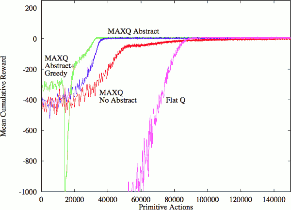

- all forms of MAXQ learning have better initial performance than flat Q learning. 
- without state abstractions, MAXQ-Q learning actually takes longer to converge, so that the Flat Q curve crosses the MAXQ/ no abstraction curve
- with state abstractions, MAXQ-Q quickly to a hierarchically optimal policy.
- with greedy execution, the MAXQ policy is also able to attain optimal performance. 
    - But as the execution becomes “more greedy”, there is a temporary drop in performance,because MAXQ-Q must learn C values in new regions of the state space that were not visited by the recursively optimal policy.


 


---

 [1]: ../imgs/maxq_taxi_fig1.png
