[](...menustart)

- [Week1](#3c88e16de2066fa3ce3055a55a3e473b)
    - [Introduction](#0b79795d3efc95b9976c7c5b933afce2)
        - [0.0 Introduction](#6624e60920560019e562d83bb9d2634a)
    - [Boolean Functions and Gate Logic](#deb69b5e23e0f74aea56d42c2df9b438)
        - [1.2 Boolean Function Synthesis](#98b0af5f662c251fcef7642894b9ffc9)
        - [1.3 Logic Gates](#4776353de4540e4f66ce8b76d947956a)
        - [1.4 Hardware Description Language](#9ce58a559622579ca35bb01b7859eac4)
        - [1.5 Hardware Simulation](#488a1db79bf52eb4fb7533030e708ef8)
        - [1.6 Multi-Bit Buses](#1c64efba42a324df638142f32dc44cd7)
        - [1.7 Project 1 Overview](#b3e39cb5cfea130c68f209315631defb)
- [Week2](#687c054c8abba26ef7b123d19d29bee7)
    - [ALU (Arithmetic Logic Unit)](#131e179ad49dba389fb712edbce83653)
        - [2.2 Binary Addition](#892d5ac8e8edcf45571fc6dfccf96844)
            - [Half Adder](#3c768e168bf5f2e5f59527f72e2caf45)
            - [Full Adder](#62843c6b864546259210870080899995)
            - [Multi-bit Adder](#91b7a456eb59162eaccf2adc70438388)
        - [2.3 Negative Numbers](#b80c8c38754b730ad44808a34b8d698d)
        - [2.4 Arithmetic Logic Unit](#a47675cad4753ebab07a57b4a9e78e67)
            - [The Hack ALU](#3ffc084f37bf42ee151ecd9966a231b2)
            - [The 6 Control bits](#a984b69cb0ab211f60d2e97cf876382c)
            - [The 2 output control bits](#3eec4389f60776ec69d05a0bd6bc95c0)
        - [2.5 Project2](#7557328bfddc5cca7df8351f2ffc9d03)
- [Week3 Memory](#58c4997ddbb7c4994b5cad449ca383ea)
    - [3.1 Sequential Logic](#11f9d74828e68a5c48b5117ed4971161)
        - [The Clock](#dd1838a3a82bef4194744fc19ee6c7e8)
        - [Combinatorial Logic vs. Sequential Logic](#80761b62ccda39c79029f7ec0a9f0f03)
    - [3.2 Flip Flops](#700b1182938e9242255f9bf7360ca646)
        - [The "Clocked Data Flip Flop"](#87bf13c75d6464dbb9ffffec0073a174)
        - [Implementation of the D Flip Flop](#037dbed7ed98a2dca86efdbcc28b4184)
        - [Sequential Logic Imlementation](#4cceb9e8f6aa3a2fdfd1b332db946b66)
        - [Remembering For Ever: 1-bit register](#f4d44576782bb5db7f102699fbc2b7d6)
            - [Working "Bit" Implementation](#054e787feedbcaa8318489cd44a5f424)
    - [3.3 Memory Units](#14bb9bdf431f881432dc8fd6675e2eae)
        - [The most basic memory element: Register](#cf848af4b162bb87c7e68f55474cb601)
        - [RAM unit](#f326d01caa8d0e83c2d559ef8f04e42e)
    - [3.4 Counters](#2bf55e7447acec05c8bc2e45f68bbaa8)
        - [Counter abstraction](#702ee0d3aebd7fea4eae6043838f6a7f)
    - [3.5 Project 3 Overview](#2b71d41a7eec0448db9bd1fba3ff759c)
    - [3.6 Perspectives](#7885bcf08ce9948199998c1d92b48876)

[](...menuend)


<h2 id="3c88e16de2066fa3ce3055a55a3e473b"></h2>

# Week1 


<h2 id="0b79795d3efc95b9976c7c5b933afce2"></h2>

## Introduction

<h2 id="6624e60920560019e562d83bb9d2634a"></h2>

### 0.0 Introduction

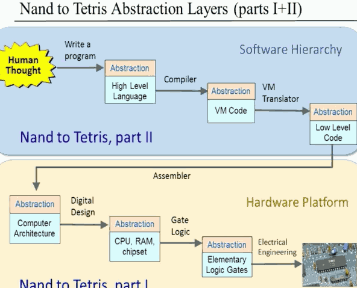

- book: `<<The Elements of Computing System>>`

- N2T , toolsuit
    - http://nand2tetris.org/software.php


<h2 id="deb69b5e23e0f74aea56d42c2df9b438"></h2>

## Boolean Functions and Gate Logic

<h2 id="98b0af5f662c251fcef7642894b9ffc9"></h2>

### 1.2 Boolean Function Synthesis

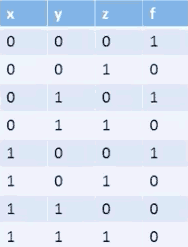

- Truth Table to Boolean Expression ?
    - constructing a disjuctive normal form formula  构建一个分离的范式公式 
- how
    1. go row by row in the truth table, focus only on the rows have a value(f) 1 
        - for example , the 1st, 3rd,5th rows
    2. 写一个 范式，to get a value of 1 only at this row
        - that is， 只有 这一行 会得到 1， 其它都是 0
        - i.e. only 1st row is 1 :  `( NOT(x) AND NOT(y) and NOT(z) )`
    3. do same operation on other row that have value 1
        - 3th :
            - `( NOT(x) AND y AND NOT(z) )` 
        - 5th :
            - `( x AND NOT(y) AND NOT(z)  )`
    4. 剩下的，就是把 这三个 范式， 用 OR 连接起来
- Tips: 
    - 因为设计 logic gate最基本的单元是 Nand, 所以有时后把 truth table反一下考虑 会有更好的效果
- 很长的范式，我们怎么能得到一个 最小范式呢？ 
    - In fact, this is an NP-hard problem.  

- Theorem
    - Any Boolean function can be represented using an expression containing AND, OR and NOT operations.
    - Any Boolean function can be represented using an expression containing AND, NOT operations.
    - 还能更少吗？
- There is yet another operation that by itself does suffice to actually compute everything -- the NAND function

x | y | NAND 
--- | --- | --- 
0 | 0 | 1
0 | 1 | 1 
1 | 0 | 1
1 | 1 | 0

- `(x NAND y) == NOT(x AND y) `
- 妙处在哪里？
    - NAND(x,x) == NOT(x)  ! 
- **Any Boolean function can be represented using an expression containin only NAND operation.**
    1. NOT(x) == (x NAND x)
        - 现在你已经有NOT了！
    2. (x AND y) = NOT( x NAND y )

<h2 id="4776353de4540e4f66ce8b76d947956a"></h2>

### 1.3 Logic Gates

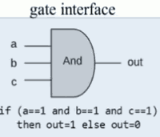

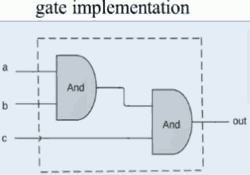

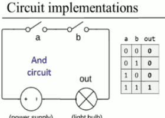

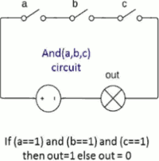


<h2 id="9ce58a559622579ca35bb01b7859eac4"></h2>

### 1.4 Hardware Description Language

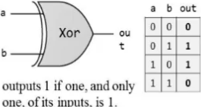

- General idea:
    - out =1 , when :
        - a AND NOT(b)
        - OR
        - b AND NOT(a)

- From gate diagram to HDL

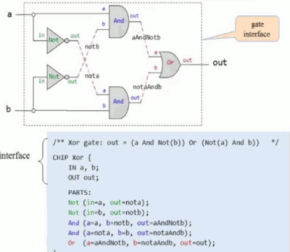

 1. HDL is a functional / declarative language
 2. THe order of HDL statements is insignificant
 3. Before using a chip part , you must know its interface. For example
    - Not(int=, out=)
    - And(a=,b=, out=)
    - Or(a=,b= , out=)


<h2 id="488a1db79bf52eb4fb7533030e708ef8"></h2>

### 1.5 Hardware Simulation

```
.hdl --> HS  -->
      |     |
.tst -| ....|... -> .out
```

- 配合 tst 文件，可以进行自动化测试 
- tst 里可以 把结果输出， 还可以把 输出结果 和 事先准备的 .cmp 文件做比较

<h2 id="1c64efba42a324df638142f32dc44cd7"></h2>

### 1.6 Multi-Bit Buses

- Sometimes we manipulate "together" an array of bits
- It is conecptually convenient to think about such a group of bits as a single entity 
    - sometime termed "bus"
- HDLs will usually provide some convenient notation for handling these buses
- Example: Addition of two 16-bit integers
    - 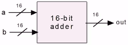

```hdl
/*
 * Adds two 16-bit values
 */
CHIP Add16 {
    IN a[16] , b[16];
    OUT out[16];
    
    PARTS:
    ...    
}
```

```hdl
/*
 * Adds three 16-bit values
 */
CHIP Add3Way16 {
    IN first[16] , second[16], third[16] ;
    OUT out[16];
    
    PARTS:
        
        Add16(a=first, b=second, out=tmp) ;  
        Add16(a=temp, b=third, out=out ) ;  
}
```

```hdl
/*
 * Adds together all 4 bits of the input
 */
CHIP And4Way {
    IN a[4] ;
    OUT out;
    
    PARTS:
        
        ADD(a=a[0], b=a[1], out=t01) ;
        ADD(a=t01, b=a[2], out=t012) ;
        ADD(a=t012, b=a[3], out=out ) ;
}
```

```hdl
/*
 * Computes a bit-wise AND of its two 4-bit input bus
 */
CHIP And4W {
    IN a[4], b[4] ;
    OUT out[4];
    
    PARTS:
        
        ADD(a=a[0], b=b[0], out=out[0])
        ADD(a=a[1], b=b[1], out=out[1])
        ADD(a=a[2], b=b[2], out=out[2])
        ADD(a=a[3], b=b[3], out=out[3])
}
```

- Sub-buses
    - Buses can be composed from ( and broken into ) sub-buses

```
/* compose bus example */
IN lsb[8], msb[8], ...
// 把这两个8bit bus 用到 And16上去
Add16( a[0..7]=lsb, a[8..15]=msb, b=... , out...  );

Add16( ... , out[0..3]=t1, out[4..15]=t2 ) ;
```

- Some syntactic choices of our HDL 
    - Overlaps of sub-buses are allowed on output buses of parts
    - Width of internal pins is deduced automatically
    - `false` and `true` may be used as buses of any width
        - put lots of 1 , lots of 0 to a bus

<h2 id="b3e39cb5cfea130c68f209315631defb"></h2>

### 1.7 Project 1 Overview 

- Given: Nand
- Goal: Build the following gates:
    - Not
    - And
    - Or
    - Xor 
    - Mux
    - Dmux # 4 elememtary logic gates
    - Not16
    - And16
    - Or16
    - Mux16  # 4 16-bit variants
    - Or8Way
    - Mux4Way16
    - Mux8Way16
    - DMux4Way
    - DMux8Way # 5 Multi-way variants
- Why these 15 particular gates ?
- Because ...
    - The are commonly used gates
    - They comprise all the elememtary logic gates needed to build our computer
- Multiplexor (Mux)
    - 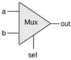
    - 3 input, 1 output
    - kind of `if` condition expression

```cpp
if (sel==0)
    out=a
else
    out=b
```

- A 2-way multiplexor enables *selecting* , and outputing, one out of 2 possible inputs
- Widely used in : 
    - Digital design
    - Communications networks
- Example: using mux logic to build a programmable gate
    - 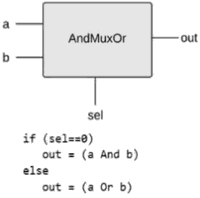

---


- Demultiplexor
    - 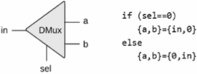
    - acts like the inverse of a multiplexor
    - Distributes the single input value into one of 2 possible destinations
        - based on the selection bit, it either channels the input to an a output , or to a b output
    - DMux后数据，只有1个是in，其他都是 0
- Example: Multiplexing / demultiplexing in communications networks
    - 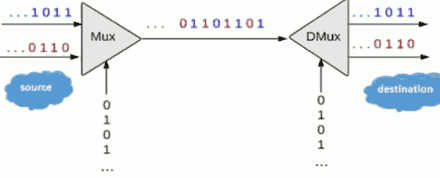
    - we may have several channels coming in. Let's say channels of music or movies
        - that we want to send over a single communications line
    - and through this single line, I want to send multiple messages. How can I possiblely do it ?
    - I can put a Mux in the sending end , and I can feed the Mux an ongoing train of 0101010...
        - This can be done using what is known as an oscillator 振荡器
        - Each `sel` bit is connected to an oscillator that produces a repetitive train of alternating 0 and 1 signals.
    - In every cycle the Mux will output one bit from one of the 2 inputs
    - At the receiving end , I put a different oscillator and therefore the dmux is going to distribute the incoming inputs according to the dmux logic. 
    - So this logic here , the Dmux and the Mux logic taken together enable me to interleave several messages over a single communications line. 
        - which may be very expensive
- 16-bit, 4-way multiplexor
    - 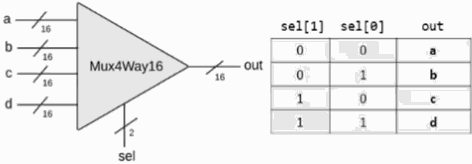

---

<h2 id="687c054c8abba26ef7b123d19d29bee7"></h2>

# Week2 

<h2 id="131e179ad49dba389fb712edbce83653"></h2>

## ALU (Arithmetic Logic Unit)

- Addtion / Subtraction are easy
- Multiplication and division are complicated, but nicely enough, we can actually postpone them to software.

<h2 id="892d5ac8e8edcf45571fc6dfccf96844"></h2>

### 2.2 Binary Addition

- Building an Adder
    1. Half Adder -- adds two bits
    2. Full Adder -- adds 3 bits
    3. Adder -- Adds two numbers

<h2 id="3c768e168bf5f2e5f59527f72e2caf45"></h2>

#### Half Adder

a | b | sum | carry
--- | --- | --- | ---
0 | 0 | 0 | 0
0 | 1 | 1 | 0
1 | 0 | 1 | 0
1 | 1 | 0 | 1

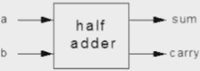

- Xor -> sum , And -> carry ?

<h2 id="62843c6b864546259210870080899995"></h2>

#### Full Adder

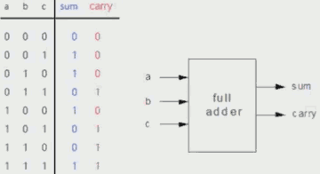

- use 2 half adder ,  plus ... 


<h2 id="91b7a456eb59162eaccf2adc70438388"></h2>

#### Multi-bit Adder 

 1. half adder
 2. full adder , repeart

<h2 id="b80c8c38754b730ad44808a34b8d698d"></h2>

### 2.3 Negative Numbers 

- Q: 为什么计算机不直接 把 最高位 解释成符号位，其他不变？
    - 以8bit为例，这样会造成 10000000 = -0 的情况，非常蠢。
- 2ⁿ-x => -x
    - 10000000 => -128
- Positive Numbers : 0 ~ 2ⁿ⁻¹-1
- Negative Numbers : -1 ~ -2ⁿ⁻¹
- Input x , Output -x, how?
    - -x = !x +1
- Tips for `+1`
    - 从低位开始， 逢1变0，直到把第一个碰到的0变成1，退出
 

<h2 id="a47675cad4753ebab07a57b4a9e78e67"></h2>

### 2.4 Arithmetic Logic Unit

- Arithmetic operations:
    - integer addition, multiplication, division, ...
- Logical operations:
    - And, Or, Xor, ...

<h2 id="3ffc084f37bf42ee151ecd9966a231b2"></h2>

#### The Hack ALU 

- ALU used in this course ...


- take two 16-bit input, generate one 16-bit output
- Which function to compute is set by 6 1-bit inputs
    - zx , nx , zy, ny , f , no
    - Based on these 6 control bits, the ALU computes one out of the following ***18*** functions.
        - the ALU can compute many more functions, but we will focus these 18 only

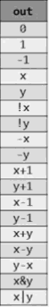

- Also outputs two 1-bit valuse
    - zr, ng


<h2 id="a984b69cb0ab211f60d2e97cf876382c"></h2>

#### The 6 Control bits

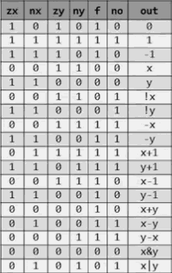

- if zx , and nx , then x = -1 (1111)
- Example: Compute !x , x: 1100, y: 1011
    - zx=nx=0 => x = x
    - zy=ny=1 => y = 1111
    - f=0 => x&y = 1100
    - no=1 => !(1100) = 0011 , it is !x
- 理论上6个控制位可以产生 2⁶ 个 结果，但实际上有些组合的output是相同的
    - 比如 zx=1,nx=0 , zy=1,ny=1, f=1,no=1 , 同样也输出 0

<h2 id="3eec4389f60776ec69d05a0bd6bc95c0"></h2>

#### The 2 output control bits

- if out == 0 , then zr = 1 , else zr = 0.
- if out < 0 . then ng =1 , else ng =0.
- These two control bits will come into play when we build the complete computer's architecture.

---

- ALU 所有所需要的运算，我们之前做的 chips 都能实现
- The Hack ALU is both simple but quite sophisticated.

<h2 id="7557328bfddc5cca7df8351f2ffc9d03"></h2>

### 2.5 Project2 

- Goal: 
    - HalfAdder
    - FullAdder
    - Add16
        - full adder * 16 实现方式可以优化， it called *carry look ahead*
    - Inc16
    - ALU  , less than 20 lines of HDL code
 
---

<h2 id="58c4997ddbb7c4994b5cad449ca383ea"></h2>

# Week3 Memory

- **Key concepts**: combinational vs sequential logic, clocks and cycles, flip-flops, registers, RAM units, counters.

<h2 id="11f9d74828e68a5c48b5117ed4971161"></h2>

## 3.1 Sequential Logic

- How compute do one thing after another
- So far we ignored the issue of time
- The inputs were just "there" -- fixed and unchanging
- THe output was computed "instantaneously"
- This is sometimes called "Combinatorial Logic"
- But computers do work during time.
 
---

- So what kind of thing do we need from time ?
    1. Use the same hardware over time
        - Inputs change and outputs should follow
        - e.g.  `For i=1...100:  a[i]=b[i]+c[i]`
    2. Remember "State"
        - Memory
        - Counters
        - e.g.  `For i=1...100:  sum=sum+1`
    3. Deal with speed
        - computers work at some finite speed
        - we can not ask computer to perform computations faster than it can

<h2 id="dd1838a3a82bef4194744fc19ee6c7e8"></h2>

### The Clock

- convert physical time to discreet time.
    - to ensure the system state is stabilized.
- Nothing changes within a time unit
    - for example , NOT gate
    - at every time unit  , it can have a different input
    - and at that time unit, it will compute the output from that input in an instantaneous manner.

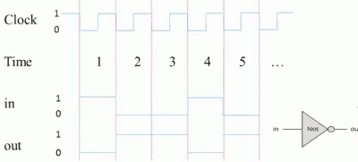

- The issue of delays
    - 事实上， 物理信号 并不是 瞬间就能完成 0->1, 1->0 的转换
    - 电压的转换 比较慢 
    - 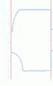
        - show as the picture, it takes time for the input to reach it final stage
        - and then it will also take some time for the output to reach the final stage. Probably it will take more time than it takes for the input because there's an additional delay of the gate self. 
- The whole point of this logical we were treat -- we break time into digital into integer units --  is the fat that they won't want to think about these delays. 
- As long as our clock cycle is not too fast , as long as we give ourselves enough time between consecutive time units, we can ignore everything that happened at the beginning of the cycle( all the gray area ).
- In fact, the way we choose the cycle of the clock is to make sure that all the hardware there really stabilizes. And the implementations give you the logical operations by the end of the gray unit. 

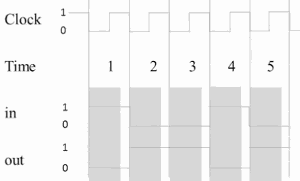

<h2 id="80761b62ccda39c79029f7ec0a9f0f03"></h2>

### Combinatorial Logic vs. Sequential Logic

- Combinatorial: out[t] = function( in[t] ) 
- Sequential :   out[t] = function( in[t-1] )

<h2 id="700b1182938e9242255f9bf7360ca646"></h2>

## 3.2 Flip Flops

- Remembering State
    - Missing ingredient: remember one bit of infomation from time t-1 so it can be used at time t.
    - At the "end of time" t-1, such an ingredient can be at either of 2 states:
        - "remembering 0" or "remembering 1"
        - That means it has to be in two different physical states in its implementation
    - This ingredient remembers by "flipping" between these 2 possible states
    - Gates that can flip between two states are called *Flip-Flops*
        - the point is that this flipping and flopping is something they remember.
        - It's not just a function of the current input, but something internal to them they remember  between time units.
- 其实就是保存这个周期的输入，用于下一个周期， 只能保存一个周期


<h2 id="87bf13c75d6464dbb9ffffec0073a174"></h2>

### The "Clocked Data Flip Flop"

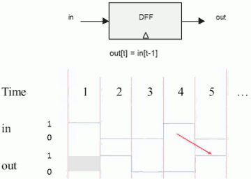

- This flip-flop has a single input and a single output , and it basically remembers the input from last time unit and outputs it in the next time unit. 

- The little triangle that we see at the bottom of the D flip-flop diagram , means that we have a sequential chip, a chip that depends on time. 

<h2 id="037dbed7ed98a2dca86efdbcc28b4184"></h2>

### Implementation of the D Flip Flop 

- In this course: it is a primitive
- In many physical implementations, it may be built from actual Nand gates:
    - step1: create a "loop" achieving an "un-clocked" flip-flip
    - step2: Isolation across time steps using a "master-slave" setup.
- Very cute
    - But conceptually confusing
- Our Hardware Simulator forbids "combinatorial loops"
    - A cycle in the hardware connections is allowed only if it passes through a sequentia gate.

<h2 id="4cceb9e8f6aa3a2fdfd1b332db946b66"></h2>

### Sequential Logic Imlementation

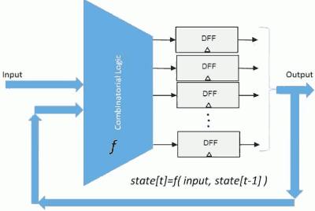

- DFF 的应用模版?

- In particular the usual way we do things is we have an array of D flip flops which basically compromise all of our memory in the system. 
- Their output is going to be fed into some combinatorial logic together with the new input that you get in this time unit. 
- And all of this is going to change the state that we have in the D flip flop for the next time unit.

<h2 id="f4d44576782bb5db7f102699fbc2b7d6"></h2>

### Remembering For Ever: 1-bit register

- Goal: remember an input it "forever": until requested to load a new value
- DFF 应用之一： 可以持久记忆 , 1bit memory !

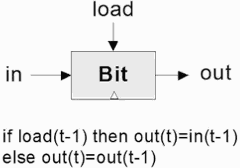

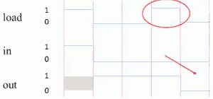

<h2 id="054e787feedbcaa8318489cd44a5f424"></h2>

#### Working "Bit" Implementation 

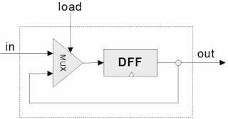

---

<h2 id="14bb9bdf431f881432dc8fd6675e2eae"></h2>

## 3.3 Memory Units

- Memory
    - Main memory: RAM, ...
    - Secondary memory: disks, ...
    - Volatile/non-volatile: 断电后数据是否可以保存
- RAM:
    - Data
    - Instructions
- Perspective:
    - Physical
    - Logical 

<h2 id="cf848af4b162bb87c7e68f55474cb601"></h2>

### The most basic memory element: Register

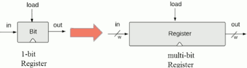

- w (word width): 16-bit, 32-bit, 64-bit, ...
- Register's state: the value which is currently stored inside the register

--- 

- Register / read logic
    - probe out
    - out emits the Register's state
- Register / write logic
    - To set Register = v 
        - set in = v
        - set load = 1
    - The Register's state becomes v
    - From the next cycle onward, out emits v

<h2 id="f326d01caa8d0e83c2d559ef8f04e42e"></h2>

### RAM unit

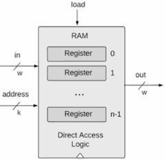

- RAM abstraction:
    - A sequences of n **addressable** registers , with addresses 0 to n-1
- **At any given point of time** , only ***one*** register in the RAM is selected.
- k( width of address input): 寻址地址线所需宽度？ 
    - k = log₂N
    - for example, if we have 8 register , we need 3 bits.
- w( word width): 
    - No impact on the RAM logic
- RAM is a sequential chip, with a clocked behavior

```hdl
// let M stand for the state of 
// the selected register
if load then {
    M = in
    // from the next cycle onward:
    out = M    
} 
else out = M 
```

- To read Register i :
    - set address = i
    - Result
        - out emits the state of Register i
- To set Register i to v:
    - set address = i
    - set in = v
    - set load =1
    - Result
        - The state of Register i become v
        - From the next cycle onward, out emits v
- Why "Random Access Memory" ?
    - Because irrespective of the RAM size , every register can be accessed in exactly the same time -- instantaneously.

<h2 id="2bf55e7447acec05c8bc2e45f68bbaa8"></h2>

## 3.4 Counters 

- The computer must keep track of whch instruction should be *fetched and executed* next
- This control mechanism can be realized by a Program Counter
- The PC contains the address of the instruction that will be *fetched and executed* next
- Threee possible control settings:
    - Reset: fetch the first instruction. 
        - `PC = 0`
    - Next : fetch the next instruction. 
        - `PC++` 
    - Goto: fetch instruction n
        - `PC = n`
- Counter: 
    - A chip that realizes those 3 above abstraction.
    - essentially a register with some control bits


<h2 id="702ee0d3aebd7fea4eae6043838f6a7f"></h2>

### Counter abstraction

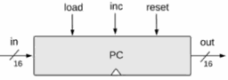

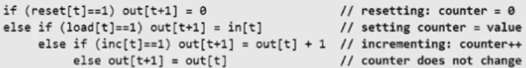


<h2 id="2b71d41a7eec0448db9bd1fba3ff759c"></h2>

## 3.5 Project 3 Overview

- Given :
    - All the chips built in Projects 1 and 2
    - Data Flip-Flop (DFF gate)
- Goal :  Build a family of sequential chips, from a 1-bit register to a 16K memory unit
    - Bit
    - Register
    - RAM8
        - Feed the *in* value to all the registers , simultaneously
        - Use Mux/DMux chips to select the right register
    - RAM64
        - A RAM device can be built by grouping smaller RAM-parts together
        - Think about the RAM's *address* input as consisting of 2 fields:
            - One field can be used to select a RAM-part
            - The other field can be used to select a register within that RAM-part
            - Use Mux/DMux logic to effect this addressing scheme
    - RAM512
    - RAM4K
    - RAM16K
    - PC

<h2 id="7885bcf08ce9948199998c1d92b48876"></h2>

## 3.6 Perspectives

 1. DFF 也可以用 Nand 来实现
 2. Nand gate is not the only basic technology for building memory systems today.
 3. Cache memory: When one actually builds a computer, the memory is going to be a pretty costly part of the whole system
    - and the faster the memory , the more expensive it is , 
    - the larger the memory , the more expensive it is .
    - A usual trade-off is to have a large cheap memory, maybe slow also; and a very small, expensive , fast memory.

---
