...menustart

- [N2T II](#bac29c18ee57f5e44301707955d4a100)
- [Week 1  Virtual Machine I:  Stack Arithmetic](#893dc2867381fa94bcc302a5a2d0a801)
    - [1.0 The Road Ahead](#fd054c95652579b1b9fc9935eb80dbf5)
    - [1.1 Program Compilation Preview](#5439281e252a735d7c2c7f4eeec963af)
    - [1.2 VM Abstraction: the Stack](#ef580f60327a361e1d548da59cbc2b35)
        - [Stack](#2187e1021a911b3807cc1bea2eb1a9ca)
        - [Stack arithmetic , the big picture](#ce74f8cad75b6370e8c76ee00dcb3777)
        - [The stack machine model](#a422da0dca7445b51baae3e56b481ec6)
        - [Arithmetic/Logical commands](#34721e42e306875fc467c65ae98cc5c0)
    - [1.3 VM Abstraction : Memory Segments](#8f3594e14399fa4e216e20e0d2f29607)
        - [The big picture](#0815d0e5b0d3f2868d04684571389afa)
    - [1.4: VM Implementation: the Stack](#5bf26647274cf1d0abd6aa14fe11ee04)
        - [Stack machine](#41e5e1bb12d244f32b5aa66340010cd4)
    - [1.5 VM Implementation: Memory Segments](#64e8857fd9605e8fa53358d07022f839)
        - [Implementing local](#32db95696aadced184b3f6bd0b6c8297)
        - [Implementing local, argument, this, that](#4f42e18745e69276fd474fa9cca7b1ce)
        - [Memory segment: constant](#b8dcb3b490d221a9976720a7119a0db6)
        - [Memory segment: static](#3157dff7882be0f2760a9a66f3e8aa3c)
        - [Memory segment: temp](#1247a68afcaf24b007e0f6983e4d8068)
        - [Memory segment: pointer](#7d1afed0c366e2841c1a2a0fe1ddf8ed)
        - [VM Language Summary](#438feb7d5df4383c668d654e6b06c9b8)
    - [1.7 VM Implementation on the Hack Platform](#08ebaec9ba3c4a06e961ad39c3ed4d90)
    - [1.A Perspective](#3d462674294fc4eaf8ff5814273c7910)
- [Week2:  Virutal Machine : Program Control](#af0e25aeb9eae90e58b3e8b5ff014ab4)
    - [2.1 Program Contorl](#a8dc973caf37c0f538c3155e06cc57bd)
    - [2.2 Branching](#4e0051bf323aac8e7d110e99cc29e329)
    - [2.3 Functions Abstraction](#82a19ea128b46ad2cc65aa93eb4c8bc3)
        - [function defining](#72a1ff5a098950516d22c2afe18d365a)
        - [function executing](#b1c3207ee679f6c197d493f9d4df7b36)
        - [Making the abstraction work: implementation](#ce3e69cd7d023ea4fe609ff2a5c49cfe)
        - [Function call and return :  units plan](#586f372e18946c033ec0ca031a58046d)
    - [2.4 Function Call and Return: Implementation Preview](#b180acf8e32352cc37d77ba0c9a5b898)
        - [the big picture](#2376d3570a0a96432c3fea347f900e5a)
        - [Function call and return: the detail](#464cea080754ea13ae81fd5914f5ef36)
        - [The global stack](#f96b213d57e6b391baa08b65a47f7a52)
    - [2.5 Function Call and Return: Run-time Simulation](#053c88fa1043f8f8e84691ee98d1077a)
        - [Runtime](#bc366f2d0ba3d681e7a3899917c5d3de)
    - [2.6: Function Call and Return Implementation](#44dc5651d1d6eeee92e44c1adf0a7fc5)
        - [Handling call](#ca857297def9d4e2b5ec7224b1098dfc)
        - [Handling function](#9a6ac99285250a3da217d99cc0c32c6b)
    - [2.7 VM Implementation on the Hack Platform](#a980b1ca368f6fd5ee3ef70efecf227c)
        - [Booting](#d31181c15b9b2bfe52e84052376b0c04)
        - [Standard mapping of the VM on the Hack platform](#a567e084852bf1e713595b62208cb916)
        - [Special symbols in VM programs.](#94483dac5a4cf1b1daebb28da6ba8051)
    - [2.9 Project 8](#eb4eb0e9c105fa3e9a4c637379cbfe82)

...menuend


<h2 id="bac29c18ee57f5e44301707955d4a100"></h2>


# N2T II

<h2 id="893dc2867381fa94bcc302a5a2d0a801"></h2>


# Week 1  Virtual Machine I:  Stack Arithmetic

<h2 id="fd054c95652579b1b9fc9935eb80dbf5"></h2>


## 1.0 The Road Ahead

- From high-level to low-level
    - `*.jack` -> compile ->
    - `*.vm`  
        - in Java language, we use `java` command to execute the vm code
        - in our world, we use **VM translator** to translate the vm code into one assembly file `xxx.asm`
    - `xxx.asm` -> assembler ->  
    - `xxx.hack`  

- The road ahead:
    - m1,m2, building a virtual machine
    - m3:  writing a compute game
    - m4,m5: developing a compiler
    - m6: developing an OS

<h2 id="5439281e252a735d7c2c7f4eeec963af"></h2>


## 1.1 Program Compilation Preview

- Jack compilation 
    1. Jack program -> Jack compiler -> VM code
    2. VM code
        - a) run on **VM emulator** aside on you PC
        - b) use a **VM translator** to translate the VM code into machine language.

<h2 id="ef580f60327a361e1d548da59cbc2b35"></h2>


## 1.2 VM Abstraction: the Stack

- VM code 设计可以选择 偏向 高级语言抽象，或 机器语言抽象
- 一个平衡的比较好的设计是 Stack machine

- Stack machine abstraction
    - Architecture : a Stack
    - Commands : a set of operations that can be applied to this architecture

<h2 id="2187e1021a911b3807cc1bea2eb1a9ca"></h2>


### Stack

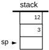

- stack pointer
    - points to the location in which the next value is going to be pushed.
- Stack arithmetic
    - 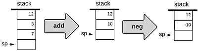
    - add: pop the 2 top most values , add them , then push the result back
    - neg: not simply negate , it will first of all pop the top value , negate it on the side and then push the result back.
- Applying a function *f* on the stack:
    - pops the argument(s) from the stack
    - computes *f* on the arguments
    - Pushes the result onto the stack
- Boolean operations
    - 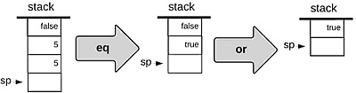

<h2 id="ce74f8cad75b6370e8c76ee00dcb3777"></h2>


### Stack arithmetic , the big picture

- Where do these commands come from ?
    - They come from the compiler. 
- if you start with a high-level statement like `x=17+19` , the compile is going to translate it into , in this case :

```
push 17
push 19
add
pop x
```

- Abstraction / implementation
    - The high-level language is an abstraction
    - It can be implemented by a stack machine
    - The stack machine is an abstraction 
    - It can be implemented by , ... something else 

<h2 id="a422da0dca7445b51baae3e56b481ec6"></h2>


### The stack machine model 

- Stack machine , manipulated by 4 categories of commands:
    - Arithmetic / logical  commands
    - Memory segment commands 
    - Branching commands 
    - Function commands


<h2 id="34721e42e306875fc467c65ae98cc5c0"></h2>


### Arithmetic/Logical commands

- example

```
// d=(2-x)+(y+9)
push 2
push x
sub
push y
push 9
add
add
pop d
```


```
// (x<7) or (y==8)
push x
push 7
lt
push y
push 8
eq 
or
```

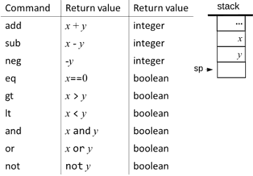

- boolean
    -  fales : 0, true: -1

- Observation: Any arithmetic of logical expression can be expressed and evaluated by applying some sequence of the above operations on a stack.

<h2 id="8f3594e14399fa4e216e20e0d2f29607"></h2>


## 1.3 VM Abstraction : Memory Segments

<h2 id="0815d0e5b0d3f2868d04684571389afa"></h2>


### The big picture 

- Jack statments

```
static int s1, s2;
function int bar(int x, inty) 
    var int a,b,c ;
    ...
    let c = s1 +y ; 
    ...
}
```

-  the compiler will translate the `let` statement  into

```
push s1
push y
add
pop c
```

- something kinds of gets lost in the translation
    - we need some mechannism to record the different roles of different variables in one's program. 
    - we do this by introducing the notion of **memory segments**.
 
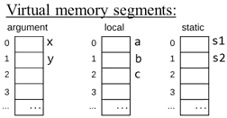

- now the vm code can be written as 

```
push static 0
push argument 1
add
pop local 2
```

- something interesting has happened, we lost the variable names in the process. 
- indeed, the VM does not recognize symbolic variable names. 
    - all variables are replaced by references to memory segments. 
    - and this is not something which is unique to our VM. 
- 如果我们增加一个 virutal segment -- *constant* , it contains just 0,1,2,... 
- 这样 Stack的 语法就可以 统一成:

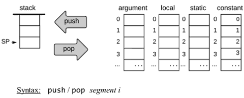

- so why we need `push constant 17` , why can't we just say `push 17` ?
    - we do that, so we get a consistant syntax. 
    - this is a very small price to pay for this consistency
    - it also makes compilation easier.

---

- in order to make life interesting , we actually have not 4, but 8 virtual memory segments
    - local / argument / this / that / constant / static / pointer / temp
- why we need so many segments
    - to cover all the features of high-level language
- all have the same syntax: 
    - push  segment index:  从指定segment 取第index地址的数据，压栈
    - pop   segment index:  出栈， 数据存入 指定segment index地址。


<h2 id="5bf26647274cf1d0abd6aa14fe11ee04"></h2>


## 1.4: VM Implementation: the Stack

- if we want to acutally execute the VM code in some concrete way, we have to realize it on some Von Neumann machine.
- so what do we have to do ?
    - fist of all, you have to take these 4 or 8 memory segments, and we have to somehow map these memory segments on the single RAM that is available for us. 
    - once we come up with this mapping, we have to do something with the push / pop commands.
    - we have to translate them into a sequences machine labeling instructions that will operate on this world -- that we just built on the RAM.

<h2 id="41e5e1bb12d244f32b5aa66340010cd4"></h2>


### Stack machine

- Implementation:  
    - Assumptions:
        - SP stored in RAM[0]
        - Stack base addr = 256 , that is , it will start begin in address 256

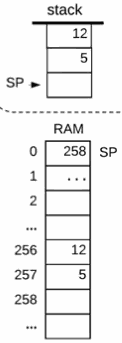

```
// push constant 17
// logic in pseudo code
*sp = 17
sp++

// Hack assembly
@17
D=A
@SP
A=M
M=D
@SP
M=M+1
```

- Who will do above work :  vm code -> assembly code?
- **VM translator** 
    - A program that translates VM code into machine language
    - Each VM command generates several assembly commands.


<h2 id="64e8857fd9605e8fa53358d07022f839"></h2>


## 1.5 VM Implementation: Memory Segments

<h2 id="32db95696aadced184b3f6bd0b6c8297"></h2>


### Implementing local

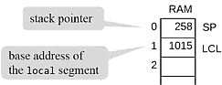

```
// vm code: 
pop local 2

// pseudo code:
addr=LCL+2 , SP--,  *addr=*SP

// hack assembly 
You write it !
```

- Tip: 
    - 访问一个 base + offset 地址 (M1)的内容 ，需要使用全部的A/M/D 三个寄存器
    - 无法把M1的结果很另外一个 base + offset 地址(M2) 做运算
    - 但是 M1 和 可以直接寻址，或 直接寻址基础上 A+1 的地址 (Md)  做 运算
    - 所以可以把 M1的内容先寄存到 (M2+1) , 然后就可以 M2,M2+1 做运算
    - 当然，最简单的办法是使用 预留的  general purpose register, 如果有提供的话

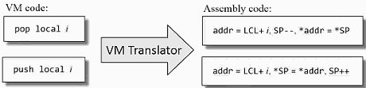


<h2 id="4f42e18745e69276fd474fa9cca7b1ce"></h2>


### Implementing local, argument, this, that 

- The big picture:  
- When translating the high-level code of some method into VM code, the compile :
    - map the method's *local* and *argument* variables onto the local and argument segments
    - map the *object* fields and *array* entries that the method is currently processing onto the this and that segments.
- local , argument , this and that are implemented precisely the same way.

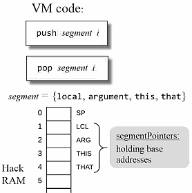


<h2 id="b8dcb3b490d221a9976720a7119a0db6"></h2>


### Memory segment: constant

- The big picture:
- When translating the high-level code of some method into VM code, the compile :
    - it translate high-level operations involving *constants* into VM operation involving the constant segment.
- Implementation:
    - Supplies the specified constant
    - constant segment 并不真的存在
- Caution: there is no *pop* for constant, it makes no sense.

```
// VM code
push constant i 

// Assembly code:
*SP=i , SP++
```

<h2 id="3157dff7882be0f2760a9a66f3e8aa3c"></h2>


### Memory segment: static 

- The big picture:
    - the compile maps the *static* variables that the method sees onto the static segment.
- static variables should be seen by all the mothods in a program
    - Store them in some "global space"
    - Have the VM translator translate each VM reference *static i* (in file Foo.vm)  into an assembly reference *Foo.i*

```
// VM code 
// File Foo.vm
pop static 5
... 

// Generated assembly code:
// D=stack.pop (code omitted)
@Foo.5
M=D
...
```

- Following assembly , the Hack assembler will map these references onto RAM[16],RAM[17], ..., RAM[255]
- Therefore , the entries of the *static* segment will end up being mapped onto RAM[16], RAM[17], ..., RAM[255] , 
    - in the order in which they appear in the program. 
    - `push static i` , i 和 内存地址并没有直接关系

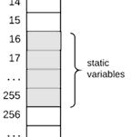

<h2 id="1247a68afcaf24b007e0f6983e4d8068"></h2>


### Memory segment: temp

- The big picture:  The compile
    - sometimes needs to use some variables for temporary storage
    - our VM provides 8 such temporary variables
- Implementation:
    - a fixed, 8-place memory segment 
    - Mapped on RAM locations 5 to 12.

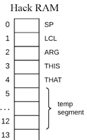

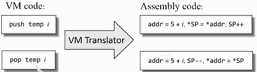

<h2 id="7d1afed0c366e2841c1a2a0fe1ddf8ed"></h2>


### Memory segment: pointer

- the pointer segment is a little bit obscure. 
    - you can't understand really why we need it until you begin to write the compiler. 
- The big picture
    - the compiler generates code that keeps track of the base addresses of the *this* and *that* segments using the *pointer* segment. 
- Implementing
    - Pointer is a fixed memory segment. It has only 2 entries -- 0 and 1.
    - `push pointer 0/1`  , `pop pointer 0/1`
    - accessing `pointer 0` should result in accessing THIS
    - accessing `pointer 1` should result in accessing THAT
- Implementation: Supplies THIS or THAT. 

```
// VM code:
push pointer 0/1 

// Assembly code:
*SP=THIS/THAT, SP++
```

<h2 id="438feb7d5df4383c668d654e6b06c9b8"></h2>


### VM Language Summary

- Arithmetic / Logical commands
    - add, sub, neg, eq, gt, lt, and, or, not
- Memory access commands
    - pop segment i
    - push segment i
- Branching commands
    - label *label*
    - goto *label*
    - if-goto *label*
- Function commands
    - function *functionName nVars*
    - call *functionName nArgs*
    - return 


<h2 id="08ebaec9ba3c4a06e961ad39c3ed4d90"></h2>


## 1.7 VM Implementation on the Hack Platform

- Standard VM mapping on the Hack platform

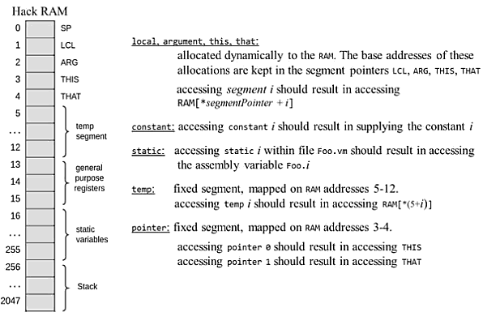

<h2 id="3d462674294fc4eaf8ff5814273c7910"></h2>


## 1.A Perspective

- out VM vs Java JVM
    - only 1 datatype : 16 bit integer , why JVM having integer, float, double ...
    - JVM also support multiplication , division , bit-wist operations
- JVM on Android devices uses another abstract architecture -- register machine.
- register machine is perhaps less elegant ,less beautiful than stack machine. but arguably, it generates code which is better optimized for processors of mobile devices.


---

<h2 id="af0e25aeb9eae90e58b3e8b5ff014ab4"></h2>


# Week2:  Virutal Machine : Program Control

<h2 id="a8dc973caf37c0f538c3155e06cc57bd"></h2>


## 2.1 Program Contorl

- Branching
- Functions 
- Function call-and-return
- Dynamic memory management
- Stack processing
- Pointers
- Completing the VM implementation

<h2 id="4e0051bf323aac8e7d110e99cc29e329"></h2>


## 2.2 Branching

- Branching commands
    - label *label*
    - goto *label*
        - jumps to execute the commands just after *label*.
    - if-goto *label*
        - *cond* = pop ,  执行 if-goto 会把栈顶单元弹出栈
        - if *cond* jump to execute the command just after *label*
        - (Requires pushing the condition to the stack just before the if-goto command)

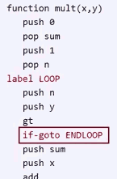

- Implementation:
    - simple: the assembly langauge has similar branching commands.


<h2 id="82a19ea128b46ad2cc65aa93eb4c8bc3"></h2>


## 2.3 Functions Abstraction

- Functions in the VM language
    - 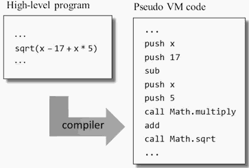
- The VM language features:
    - primitive operations (fixed) : add, sub, ...
    - abstract operations (  extensible) : multiply , sqrt, ...
- **Applying a primitive operator and calling a function have the same look-and-feel**
- 注意，图右侧是 伪代码

<h2 id="72a1ff5a098950516d22c2afe18d365a"></h2>


### function defining 

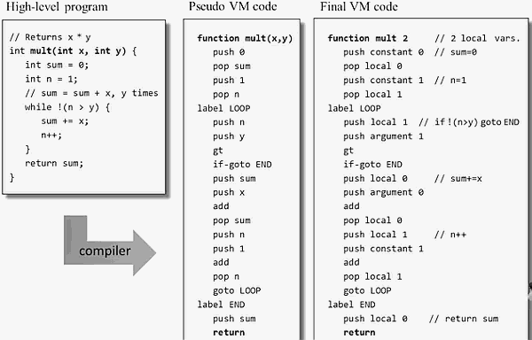

- `function mult 2` 
    - 2 means the number of **local** variables which will be used !!! 
- 高级语言的 function 被 compiler 编译成 vm code 后
    - 可以有一个return
    - 也可能有多个return 
    - 也可能没有return ，类似 Sys.init, 函数体是个无限循环
- compile 翻译的时候，确定 函数 mult 需要用到几个 local 变量

<h2 id="b1c3207ee679f6c197d493f9d4df7b36"></h2>


### function executing

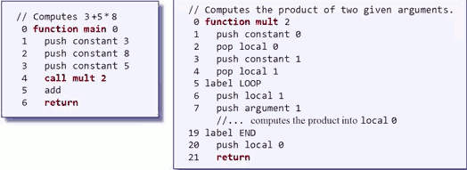

- `call func n` , here *n* means the number arguments 
    - 意义， call 之前的参数压栈，是 compiler 生成 vm code时候 要做的的工作之一
    - compiler 同时可以确定 n 的大小
- after line 0 of `function mult 2` is executed:
    - First of all I get an empty stack
    - The 2nd thing that I get is an argument segment. 
        - it contains the exact 2 values that were pushed by the caller
    - then another thing that I get is 2 local variables which initialized to 0. 
        - why do I get 2 local variables ?
        - `function mult 2` , so the VM implementation prepared for me a segment called local. 
- eventually we push the result to stack , because we want to return this vallue to the caller.
    - command `return` , the VM implementation knows how to handle return.
    - it takes the top most value in the stack of the callee , and just puts it on the stack of the caller instead of the arguments that were pushed previously.


<h2 id="ce3e69cd7d023ea4fe609ff2a5c49cfe"></h2>


### Making the abstraction work: implementation

- For each function **call** during run-time, the implementation has to ...
    - Pass parameters from the calling function to the called function 
    - Determine the return address within the caller's code
    - Save the caller's return address , stack and memory segments
    - Jump to execute the called function.
- For each function **return** during run-time, the implementation has to ...
    - Return to the caller the value computed by the called function
        - here there's an implicit assumption: it is required that the callee always pushes a value before it returns.
    - Recycle the memory resources used by the called functin
    - Reinstate the caller's stack and memory segments
    - Jump to the return address in the caller's code


<h2 id="586f372e18946c033ec0ca031a58046d"></h2>


### Function call and return :  units plan

- 2.4 Implementation preview
- 2.5 Run-time simulation
- 2.6 Detailed implementation 


<h2 id="b180acf8e32352cc37d77ba0c9a5b898"></h2>


## 2.4 Function Call and Return: Implementation Preview

- Function execution
    - Calling chain:  foo > bar > sqrt > ...
    - For each function in the calling chain during run-time , we must maintain the function's *state*
- Function's state
    - During run-time
        - Each function uses a working stack + memory segments
    - The working stack and some of the segments should be:
        - Created when the function starts running
        - Maintained as long as the function is executing
        - Recycled when the function returns 
- So in general , when a caller calls a callee, we will have now 2 states:
    - state of caller
    - state of callee

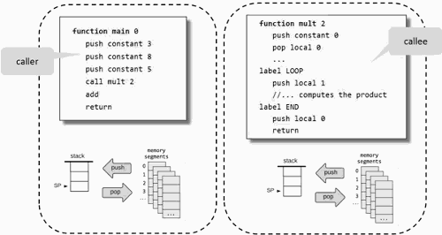

- How to maintain the states of all the functions up the calling chain ? 
    - The calling pattern is LIFO , it's a Stack

<h2 id="2376d3570a0a96432c3fea347f900e5a"></h2>


### the big picture 

- Example: computing mult(17,212)

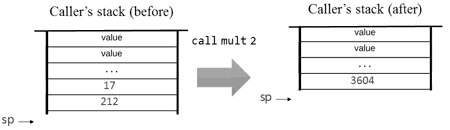

- Net effect:
    - The function's arguments (17,212) were replaced by the function's value (3604)

<h2 id="464cea080754ea13ae81fd5914f5ef36"></h2>


### Function call and return: the detail

**call**


- VM implementaion
    1. Sets arg  
        - the ARG pointer should refer to the base address of the argument's segments in the memory
        - 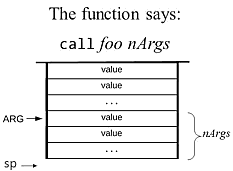
    2. Saves the caller's frame
        - it consists of the working stack of the caller , and the current segment that it uses.
        - the working stack is safe. 
            - 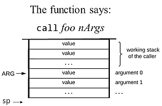
        - and now I have to save the segments , and the return address . 
            - taken together, we call these things the function's frame.
            - 
            - yes , the static, pointer, temp , constant   don't need to be saved  because they don't belongs to functions 
    3. Jumps to executed *foo*
    

**function**

- we now hit the command `function foo nVars`
    - 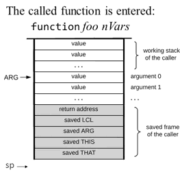
- VM implementation:
    - Sets up the local segment of the called function
        - I need *n* local variables , and I also need to initialized them to 0.
        - I push *n* 0s onto the stack , and set LCL.  
        - once I do it, I can refer to these values on the stack as locol 0, local 1, and so on.
        - 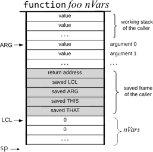
    - Now the functions is ready to take off and start running. Let's assume that the function is running and doing its things. 
        - and in the process, it grows its working stack, and it now has a working stack of its own.
        - 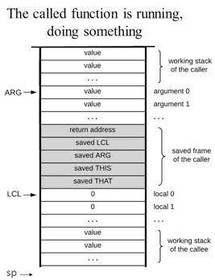  
    - And then at some point , it is going to return.  It need push a return value onto the stack, and then I say `return`.

**return**

- now VM implementation has to service the return command.
    - 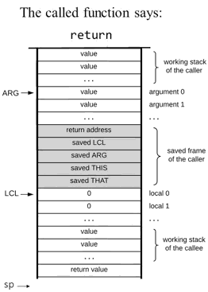    
- VM implementation:  
    - First of all, we have to take the topmost value from the stack, the return value,  and we have to 
        - **copy the return value onto argument 0**.   See the *net effect* above.
        - 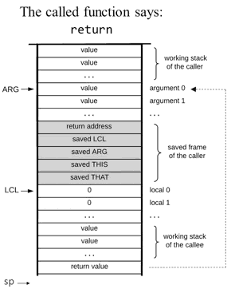   
    - THe next thing that we do is 
        - **restore the segment pointers of the caller**
        - take the saved CLC, ARG, THIS, THAT ,  and turn them into current ones. 
    - Then to 
        - **clear the stack** 
        - call the stack of the called function, which is no longer relevant. 
    - Then I have to **set the SP for the caller**. 
        - the SP for the caller should be located just after the return value, just after argument 0. 
    - After I do this, I have to finally 
        - **jumps to the return address within the caller's code**. 
        - and continue executing the caller's code. 
        - 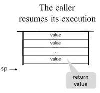   

<h2 id="f96b213d57e6b391baa08b65a47f7a52"></h2>


### The global stack 

- block
    - I can refer to some segment or some subsets of this global stack here, using the term **block** , which I just made up.
    - It is the world of the currently running function.
- The block contains :
    - my argument segment
    - caller frame. 
    - my local segments 
    - and my working statck

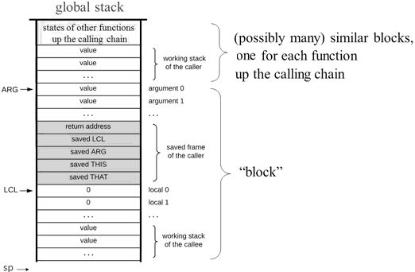


<h2 id="053c88fa1043f8f8e84691ee98d1077a"></h2>


## 2.5 Function Call and Return: Run-time Simulation

- Example: factorial         

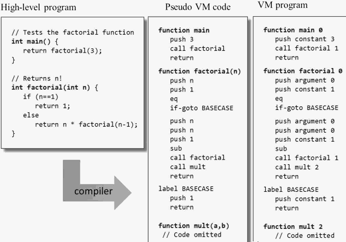

<h2 id="bc366f2d0ba3d681e7a3899917c5d3de"></h2>


### Runtime 

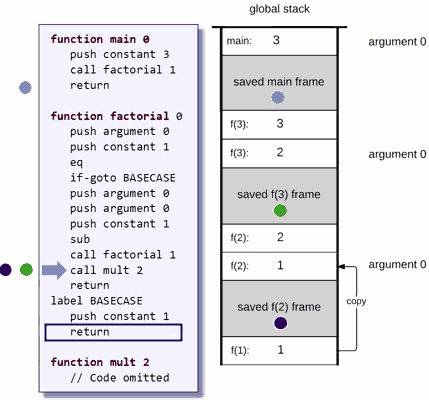

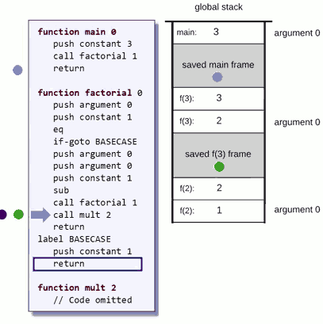
         

<h2 id="44dc5651d1d6eeee92e44c1adf0a7fc5"></h2>


## 2.6: Function Call and Return Implementation

- A function may call another function which historically belongs to a different class.
- But once everything is compiled into VM code , we lose this notion of classes and what we get is just a long list of functions that have a full name. i.e. Bar.mult

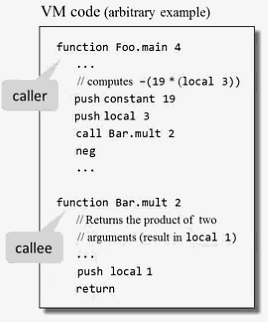

- caller's view
    - Before calling another function , I must push as many arguments as the function expects to get
    - Next, I invoke the function using `call functionName nArgs` 
    - After the called function returns , the argument values have disappeared from the stack ,and a *return value* (that always exists) appears at the top of the statck
    - After the called function returns , all my memory segment are exactly the same as they were before the call.
        - (except that *temp* is undefined and some values of my *static* segment may have changed )
- callee's view
    - Before I start executing , my *argument* segment has been initialized with the argument values passed by the caller
    - My *local* variables segment has been allocated and initialized to zeroes
    - My *static* segment has been set to the static segment of the VM file to which I belong.
        - ( memory segments this, that , pointer and temp are undefined upon entry )
    - My working statck is empty.
    - Before returning , I must push a value onto the stack
        - even if the function prototype is 'void f()' , you also need return a value. You may push a 0 to the stack.
        - it's the caller's responsibility to do something with returned value.

- The VM implementation view
    - 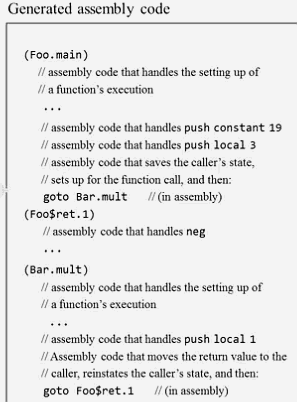
- When `Foo.main` call `Bar.mult`,  the VM translator , as we saw in above picture, is going to 
    - save the caller's state , the state of the Foo.main function
    - do a few more things to set up for the function call
    - and finally , it's going to say "go to the name of the function "
- So, presumably , the VM translator at some point will generate a label which is the name of this function
    - `(Bar.mult)`
    - this is how we represent the entry point to a function in the translated  assembly code.


<h2 id="ca857297def9d4e2b5ec7224b1098dfc"></h2>


### Handling call

- the caller is running ,doing some work .   and then all of a sudden , we encounter a call .
    - 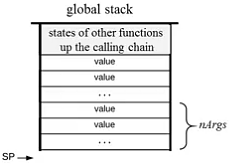
- VM command : `call functionName nArgs`
    - calls the function, informing that nArgs arguments have been pushed onto the stack
    - call 之前 push arguments 的事情 ， 是 compiler 从 high level language 转 vm code 的时候完成的
- Assembly code (generated by the translator) :
    - the first thing is I push a label onto the stack and later on I'm going to use the same label as the label to which I'm going to return after the callee terminates.
    - then I push LCL to save the state of my local segment 
    - and the ARG  , THIS , THAT
    - 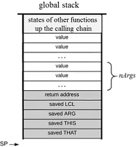
    - now, ARG should be reposition for the callee.  obviously we should reposition it at the beginning of the nArgs arguments.  where is this address ? I can calcuate because I know how many things I pushed -- nArgs + 5. 
    - then resposition LCL : LCL = SP
    - 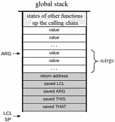
    - finally , I goto execute the called function.  
    - And now I do something very tricky, I insert into the generated code stream the label that I **pushed before** . 

- 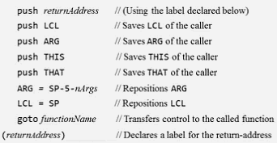

<h2 id="9a6ac99285250a3da217d99cc0c32c6b"></h2>


### Handling function

- whenever we hit a function command , the 1st thing the translator does is it takes the function name and generates a lable, and this label will serve as the entry point to the translated assembly code of this function. 
- and then we simply have to write some assembly code that handles the setting up of the function's execution. 
- **VM command**: `function functionName nVars` ( starts a function that has nVars local variables )
    - 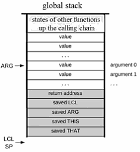
- **Assembly code** (generated by the translatro):
    - 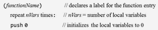
    - first of all I take the function name , and generate this label. 
    - and then I repeat nVars times *push 0 to local segment* , now the function can start doing its thing. 
        - 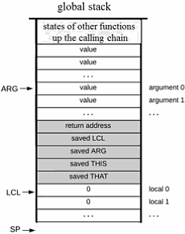
        - LCL has been setted by "call" , so just push nVars 0 to stack
    - at some point , it will want to return.
        - I have to generate assembly code that moves the return value to the caller, reinstates the caller's state, and then does a `goto` Foo's return address. 
        - 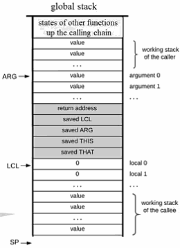

 
 
---

- **VM command:** return 
- **Assembly code** :
    - first of all, I'm going to create some temporary variable, which I call `endFrame`, and I'm going to assign the value of LCL to it. 
    - so the return address must be the content of `M[ endFrame -5 ]` , and I put it in another temporary variable *retAddr*
        - why we need to store it to a temporary variable ? because if the callee has 0 parameter, the next `*ARG=pop()` will overwrite the return address.
    - The next thing that I do is I reposition the return value for the caller. 
        - the return value should be copied onto `ARG[0]`
        - 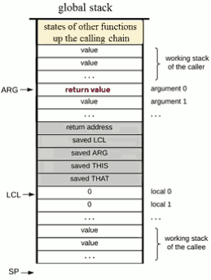
    - moving along , I know where the SP should be. The SP should be just after ARG because this is the view that the caller expectes to get. 
        - the caller expects to see a return value, and continue to do his work. 
        - 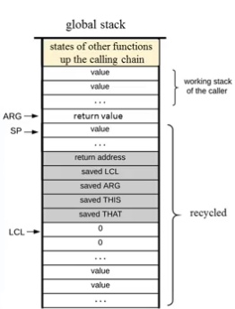
    - and now, I can begin to recover the various segments that I saved on the stack before. 
        - so `THAT` should be M[enfFrame-1] , and `THIS` , `ARG`, `LCL` ... 
    - then I jump to the address that I retrieved before. 
- 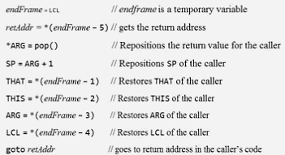
         
      
<h2 id="a980b1ca368f6fd5ee3ef70efecf227c"></h2>


## 2.7 VM Implementation on the Hack Platform

- The big picture: program compilation and translation 
    1. n .jack files  ->  compiler -> 
    2. n .vm files -> VM translator -> 
    3. single .asm file
- serveral things got lost in the translation
    - Jack -> VM
        - we lost the notion of constructors, methods and functions , because everything became functions.
    - VM -> ASM 
        - we lost the notion of functions . because now we just have a long stream of assembly commands and we have to use assembly in order to capture the semantics of VM code. 
- In order to implement it on the Hack platform, I have to comply to certain conventions and the first convention is booting. 

<h2 id="d31181c15b9b2bfe52e84052376b0c04"></h2>


### Booting 

- What should I do when I turn on the computer ? How will the computer know to execute my program ?
- So , here are the assumptions that I request to make. 
- VM programming convention 
    - One file in any VM program is exepected to be named `Main.vm` ;
    - on VM function in this file is expected to be named `main`
- VM implementation convention 
    - When the VM implementaion starts running , or it reset , it starts executing the argument-less OS function `Sys.init`
    - `Sys.init` then calls `Main.main` , and enters an infinit loop
    - `Sys.init` is already programmed at the OS level , which is not our business right now.
- Hardware platform convention
    - Bootstrap code

```
// Bootstrap code (should be written in assembly)
SP = 256
Call Sys.init
```
 
    - we request that the code will be stored in the target computer's instruction memory beginning in address zero. 

<h2 id="a567e084852bf1e713595b62208cb916"></h2>


### Standard mapping of the VM on the Hack platform 

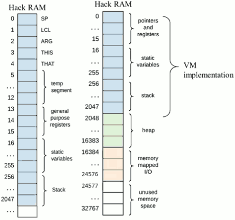

<h2 id="94483dac5a4cf1b1daebb28da6ba8051"></h2>


### Special symbols in VM programs. 

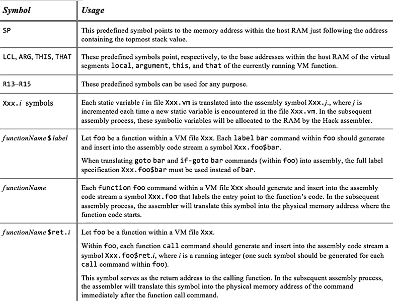

<h2 id="eb4eb0e9c105fa3e9a4c637379cbfe82"></h2>


## 2.9 Project 8

- writeLable
- writeGoto
- writeIfGoto
- writeFunction
- writeCall
- writeReturn


