...menustart

- [3 Hight Level Language](#64f2c0effea1a3786937de24c80cfa13)
    - [3.1 The Jack Language in a nutshell](#0f52f783c1d62455885bcc16f6a696cf)
        - [Example](#0a52730597fb4ffa01fc117d9e71e3a9)
    - [3.2 Object-Based Programming](#56a104167bb72e560b1f54bc8e9ee773)
        - [OO programming: building a class](#eb8fed3241e22b795da243323dd0d9df)
        - [OO programming : object representation](#f42bc11c828b9e7b453ba5a2ea1dbc2f)
    - [3.3 List Processing](#71663dfce028d17668607661995a1d37)
        - [List processing: creation](#cac6d635d890c0cc537c42c1fcbfd171)
        - [List processing: access](#d7d2ffd56a417c38516f3e4b0be43677)
        - [List processing: recursive access](#da2dc85f849a5b0c7f17027c5141adc2)
        - [List representation](#eabdefffaadf27a2e17eac89b418d03c)
    - [3.4 Jack Language Specification: Syntax](#37e104abddcaa33a048fad005370438e)
    - [3.5 Jack Language Specification: Data Types](#02ba0342a1f6047d1fc59dbe8c736779)
        - [Type conversions](#956254eeb4ca69e43d83f9558cbb3e98)
    - [3.6  Jack Language Specification: Classes](#702a066c5174a17b8981f6d4410b0d0d)
        - [Jack's standard class library / OS](#4558194d73a936fe28cdbed10400ec1d)
    - [3.7 Jack Language Specification: Methods](#690d3dc362ad3289be5978d10480faa8)
        - [Subroutines](#8c6ac4596c1168f05b215b9aead6fcb4)
        - [Variables](#03df896fc71cd516fdcf44aa699c4933)
        - [Statements](#5187c223ff0fffa9405f54d092d553ab)
        - [Expressions](#d3c7279c25a23f98e777a7bebe35d002)
        - [Arrays](#ff43b8de4f41d5103405ddb62eb8d34e)
        - [End note:  peculiar features of Jack](#ee7a19bd3cbdb072efdf19891f4e7929)
    - [3.8 Developing Apps using the Jack language and OS](#ea8f8eda96399f023a058048c72c5017)
        - [Handling output: text](#c0d18b3fff6b39107ca3bdff5c11323a)
        - [Handling output: Graphics](#fb89fc7b0d2a50d38e81c914c3c46bb9)
        - [Handling inputs](#ef13e4867d3df16a26f0da8e087e604d)
        - [The Jack character set](#3a642fb9488105d110aae04b379f2048)
        - [The Jack OS: Math](#91fab7d79331b0dcc5185669d547fcce)
        - [The Jack OS: String](#ff3a5ab1439e7a90255a2c10fddd0fcb)
        - [The Jack OS: Array](#24541d4f92edd767f23faf23e21be1a3)
        - [The Jack OS: Memory](#e80860d8f95063a5654babba64c2cbd9)
        - [The Jack OS: Sys](#57092613dcfb42997a85b6a86e6bbea9)

...menuend


<h2 id="64f2c0effea1a3786937de24c80cfa13"></h2>


# 3 Hight Level Language 

<h2 id="0f52f783c1d62455885bcc16f6a696cf"></h2>


## 3.1 The Jack Language in a nutshell

- A simple, Java-like language 
- Object-based , no inheritance
- Multi-purpose
- Lends itself to interactive apps
- Can be learned in about an hour


<h2 id="0a52730597fb4ffa01fc117d9e71e3a9"></h2>


### Example 

- 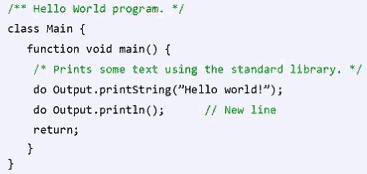
- 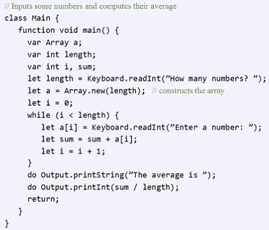
    - entry:  Main.main
    - flow of control:
        - if / if ... else
        - while
        - do
    - Array :
        - Array is implemented as part of the stardard class library
        - Jack arrays are not typed, they can contain any value of any type
    - OS services:
        - Keyboard.readInt
        - Output.printString
        - Output.printInt
        - More...
    - Jack data types:
        - Primitive:
            - int
            - char
            - boolean
        - Class types:
            - OS: Array, String, ...
            - Program extensions : as needed

<h2 id="56a104167bb72e560b1f54bc8e9ee773"></h2>


## 3.2 Object-Based Programming

- Jack 的基本数据类型，数值方面的，只有int ，所有有必要扩充一下数值类型，比如 rational number.

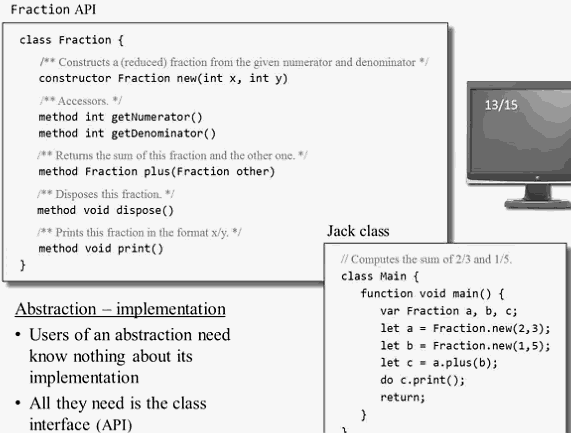

<h2 id="eb8fed3241e22b795da243323dd0d9df"></h2>


### OO programming: building a class

- filed, aka property, aka member variable
- In Jack the only way to access field values from outside the class is through *accessor* methods.

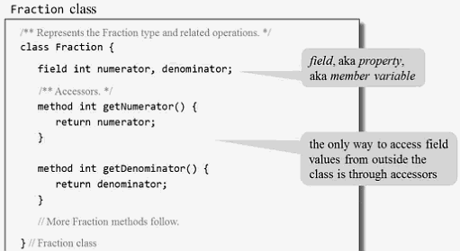

- functions are equivalent to static methods in JAVA. 
- Jack constructor must return  the base address or must return an object of the type( i.e. this)
    - Java construtors do exactly the same but they do it implicity. You don't have to say `return this`  in Java but actually , compiler will do it. 
- Jack method must call `return`  as well

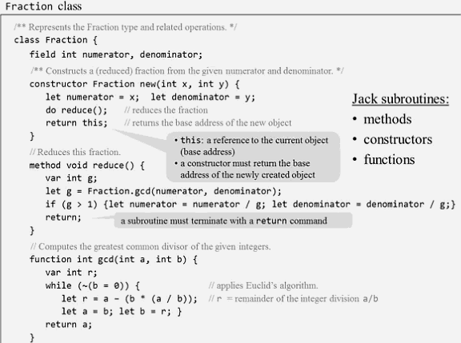

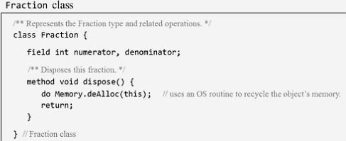

- dispose method is implemented using a call to the host OS -- `Memory.deAlloc(this)`
    - which takes an address in memory and disposes the memory block 
    - the memory resouces will be freed.
- GC
    - Jack has no garbage collection
    - Objects must be disposed explicitly
    - every jack class with `at least` one constructor must have a dispose() method.


<h2 id="f42bc11c828b9e7b453ba5a2ea1dbc2f"></h2>


### OO programming : object representation 

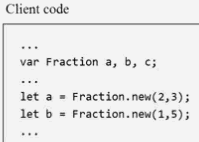

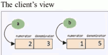

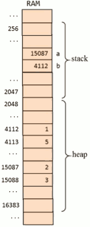


<h2 id="71663dfce028d17668607661995a1d37"></h2>


## 3.3 List Processing 

- List definition
    - the atom `null` , or
    - an atom , followed by a list 
- Notation: `(atom, list)`
- Examples:

```lisp
null
(3, (5,null)) 
(2, (3, (5,null)))
```

- so the list is kind of a linked list, but it is indeed  one object 
- 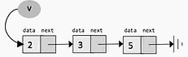
- The list (2, (3, (5,null)))  commonly abbreviated as (2,3,5)
- so how to create and manipulate such collection objects.

- List API (partial)

```
/** Represents a linked list of integers */ 
class List {
    constructor List new(int car, List cdr) 
    method void print() {
    method void dispose() {
}
```

<h2 id="cac6d635d890c0cc537c42c1fcbfd171"></h2>


### List processing: creation

```
class List {
    field int data ;
    field List next ;
    
    constructor List new(int car, List cdr) {
        let data = car ; 
        let next = cdr ; 
        return this ; 
    }    
}
```


```
var list v;
let v = List.new(5,null) ;
let v = List.new(3,v) ;
let v = List.new(2,v) ;
```

<h2 id="d7d2ffd56a417c38516f3e4b0be43677"></h2>


### List processing: access

```
class List {
    field int data ;
    field List next ;
    
    method void print() {
        var List current ;
        let current = this ;
        whiel ( ~(current = null) ) {
            do Outout.printInt( current.getData() ) ;
            do Outout.printChar(32) ;   
            do current = current.getNext() ;    
        }    
        return ;
    }
    ...
}
```

```
var list v ; 
...
do v.print();
```

<h2 id="da2dc85f849a5b0c7f17027c5141adc2"></h2>


### List processing: recursive access

```
class List {
    field int data ;
    field List next ;
    
    method void dispose() {
        if (~(next=null)) {
            do next.dispose() ;    
        }    
        do Memory.deAlloc(this) ;
        return ;
    }
}
```

<h2 id="eabdefffaadf27a2e17eac89b418d03c"></h2>


### List representation

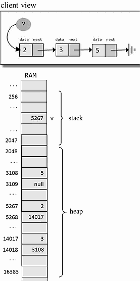

- who makes the magic work ?
    - high-level: the constructor
    - low-level: when compiling the constructor, the compiler plants calls to OS routines that find , and allocate , avaiable memory space for the new object.

<h2 id="37e104abddcaa33a048fad005370438e"></h2>


## 3.4 Jack Language Specification: Syntax

- Syntax elements
    - white space / comments
    - keywords
        - class, constructor, method , function  // program components
        - int , boolean , char, void     // primitive types
        - var, static , field     // variable declarations
        - let, do , if , else, while ,return   // statements
            - var, let, do make writing the compiler easy. 
        - true(-1), false, null,      // constant values
        - this 
    - Symbols   
        - (),{},[] 
        - `,` , `;` , `=` 
        - `.`  (class membership) 
        - `+ - \* / & `|` ~ < > `Operators.
    - Constants
        - integer constant
            - **must be positive**
            - negtive integers like `-13` are not constants, but rather expressions
        - string constant     "xxx"
        - boolean constant 
        - null
    - Identifiers


<h2 id="02ba0342a1f6047d1fc59dbe8c736779"></h2>


## 3.5 Jack Language Specification: Data Types

- Primitive types
    - int
        - non-negative  , 16-bit, 0~32767
    - boolean
        - true / false
    - char 
        - Unicode character
- Class types
    - OS types: String, Array
    - User-defined types: Fraction, List, .. 


<h2 id="956254eeb4ca69e43d83f9558cbb3e98"></h2>


### Type conversions 

- characters and integers are converted into each other , as needed:
    - `var char c;  let c=65;   // 'A' `
    - `var String s; let s="A"; let c=s.charAt(0); `
    - Note that the idiom `c='A'` is **NOT** supported by the Jack Language. 
- An integer can be assigned to a reference variables, in which case it is treated as a memory address
    - `var Array arr;   let arr=5000; `
    - 很危险，但对编写OS可以带来很大帮助
- An object can be converted into an Array, and vice versa

```
var Fraction x; 
var Array arr ;
let arr = Array.new(2);
let arr[0] = 2; let arr[1] = 5 ;
// set x to the base address of the memory block 
// representing the array[2,5]
let x=  arr ; 
do x.print()   // 2/5
```


<h2 id="702a066c5174a17b8981f6d4410b0d0d"></h2>


## 3.6  Jack Language Specification: Classes

- Each class `Foo` is stored in a separate Foo.jack file
- The class name's 1st character must be an uppercase letter
- syntactics requirement 
    - field and static variables , if they exists, must appear before the subroutine declarations. 

```
class Foo {
    field variable declarations    
    static variable declarations    
    subroutine declarations
}
```

- 2 kinds of classes
    - 1. Classes that provide functionality
        - Math class API (example)  
            - Provides various mathematical operations
            - `function int abs(int x)`
        - Contains functions only
        - no fields, constructors, or methods 
        - Offers a "library of services"
    
    - 2.  Classes that represent entites (objects)
        - Examples:  Fraction, List, String , ... 
        - A class that contains at least on method
        - Typically contains fields and methods.
        - Can also contain functions, recommended for "helper" purpoes only

<h2 id="4558194d73a936fe28cdbed10400ec1d"></h2>


### Jack's standard class library / OS

- OS purpose:
    - Closes gaps between high-level programs and the host hardware
    - Provides efficient implementations of commonly-used functions
    - Provides efficient implementations of commonly-used ADT's.  (abstract data type ?)
- OS implementation
    - A collection of classes
    - Similar to Java's standard class library , in spirit

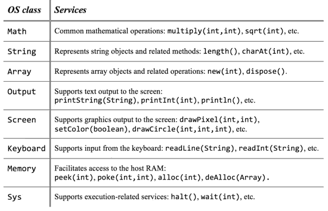


<h2 id="690d3dc362ad3289be5978d10480faa8"></h2>


## 3.7 Jack Language Specification: Methods

<h2 id="8c6ac4596c1168f05b215b9aead6fcb4"></h2>


### Subroutines

```
constructor | method | function  type subroutineName ( parameter-list ) {
    local variable declarations
    statements
}
```

- Subroutine types and return values
    - Method and function type can be either `void` , a primitive data type, or a class name
    - Each subroutine must return a value 

- Jack subroutines
    - Constructors: create new objects
        - 0,1, or more in a class
        - Common name : `new`
        - must be same type of class 
        - must return a reference to an object of this class type
    - Methods:  operate on the current object
    - Functions:  static methods

<h2 id="03df896fc71cd516fdcf44aa699c4933"></h2>


###  Variables

- variable types
    - static variables
        - class-level variables, can be manipulated by the class subroutines
    - field variables
        - object properties, can be manipulated by the class constructors and methods
    - local variabbles
        - used by subroutines, for local computations
    - parameter variables
        - used to pass values to subroutines , behave like local variables

- variables must be ...
    - Declared before they are used
    - Typed
    
<h2 id="5187c223ff0fffa9405f54d092d553ab"></h2>


### Statements

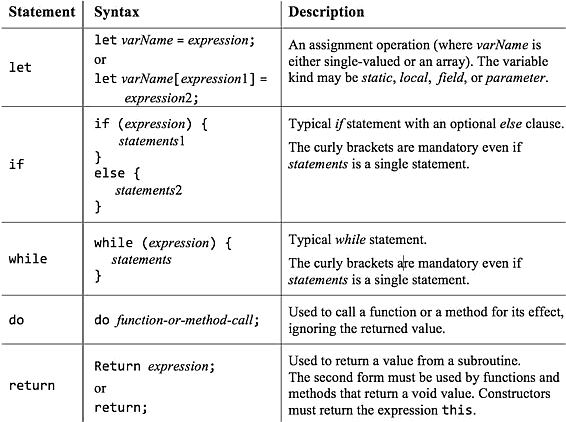

<h2 id="d3c7279c25a23f98e777a7bebe35d002"></h2>


### Expressions

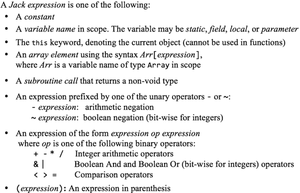

<h2 id="ff43b8de4f41d5103405ddb62eb8d34e"></h2>


### Arrays

- Jack arrays are ...
    - instance (objects) of the OS class Array
    - not typed
    - uni-dimensional

```
var Array arr;
let arr = Array.new(4) ;
arr[0] = 12;
arr[1] = false ;
arr[2] = Fraction.new(314,100);
...
```

<h2 id="ee7a19bd3cbdb072efdf19891f4e7929"></h2>


### End note:  peculiar features of Jack

- `let`
    - must be used in assigments: `let x=0;`
- `do`
    - must be used for calling a method or a function outside an expression:  `do reduce();`
- The body of a statement must be within curly brackets , even if it contains a single statement:
    - `if (a>0) {return a} else {return -a};`   ?? is the syntax correct ?
- All subroutine must end with a `return`
- **No operator priority**.
    - you have to use parentheses
- The language is weakly typed


<h2 id="ea8f8eda96399f023a058048c72c5017"></h2>


## 3.8 Developing Apps using the Jack language and OS

<h2 id="c0d18b3fff6b39107ca3bdff5c11323a"></h2>


### Handling output: text 

- Textual apps:
    - Screen: 23 rows of 64 characters, b&w
    - Font: featured by the Jack OS
    - Output: Jack OS Output class
- 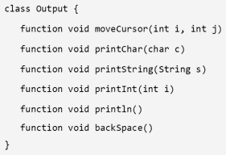

<h2 id="fb89fc7b0d2a50d38e81c914c3c46bb9"></h2>


### Handling output: Graphics

- Graphical apps:
    - Screen: 256 rows of 512 pixels, b&w
    - Output: Jack OS Screen class ( or do your own )
    - bit 0 means white , bit 1 means black

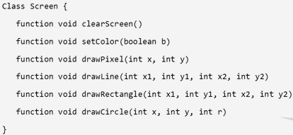

<h2 id="ef13e4867d3df16a26f0da8e087e604d"></h2>


### Handling inputs

- Input devices:
    - Standard keyboard
    - Input programming:  use the OS Keyboard class

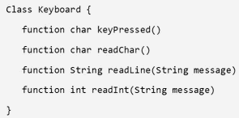

<h2 id="3a642fb9488105d110aae04b379f2048"></h2>


### The Jack character set

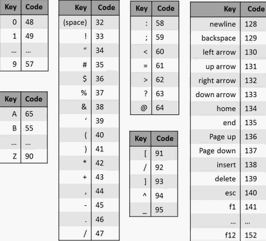

- `Keyboard.keypress()`
    - return the code of the currently pressed key, or 0 when no key is pressed

<h2 id="91fab7d79331b0dcc5185669d547fcce"></h2>


### The Jack OS: Math

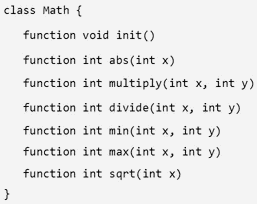

- 写 jack 程序的时候，你不需要 Math.multiply , Math.divide 这个两个方法， 你可以直接使用 \*, / 
    - 这两个方法在写Jack compiler 的时候会有帮助

<h2 id="ff3a5ab1439e7a90255a2c10fddd0fcb"></h2>


### The Jack OS: String


<h2 id="24541d4f92edd767f23faf23e21be1a3"></h2>


### The Jack OS: Array

```
Class Array {
    function Array new(int size) 
    method void dispose()    
}
```

<h2 id="e80860d8f95063a5654babba64c2cbd9"></h2>


### The Jack OS: Memory 

- Let Jack programs to access the host RAM directly

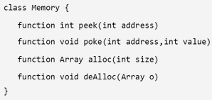

- alloc / dealloc 
    - used to create memory blocks and dispose them when they are no longer needed. 

<h2 id="57092613dcfb42997a85b6a86e6bbea9"></h2>


### The Jack OS: Sys

```
Class Sys {
    function void halt();
    function void error( int errorCode )
    function void wait( int duration )    
}
```


