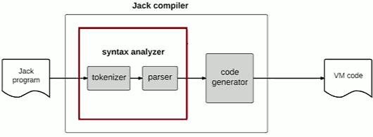
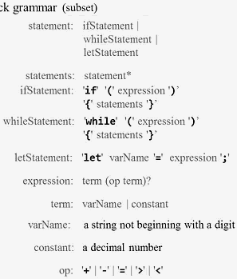
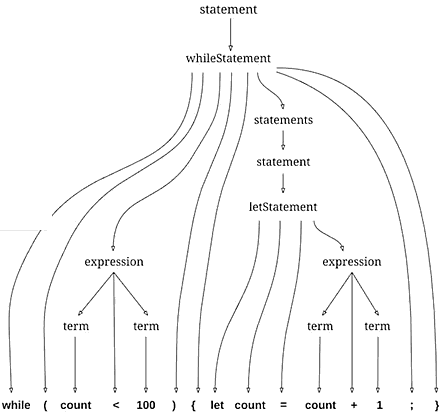
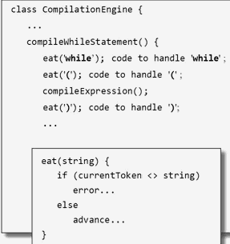
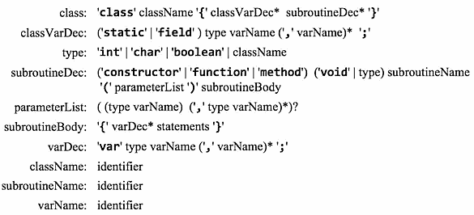
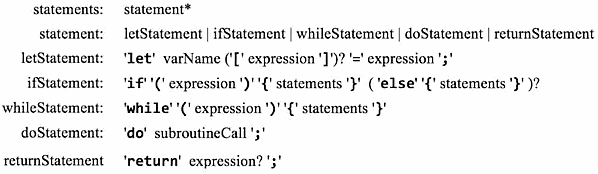
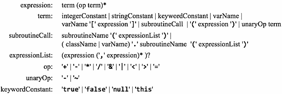
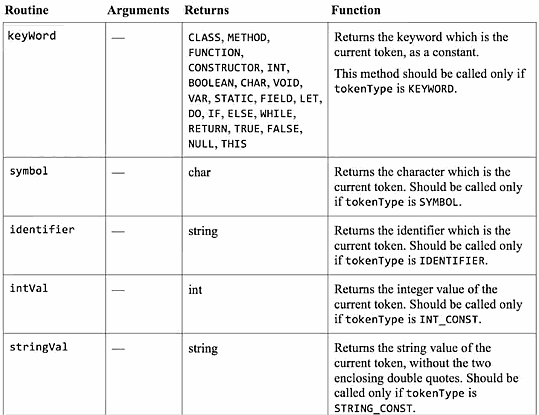

...menustart

- [Week4  Compiler I : Syntax Analysis](#30cc36d5a2b0e1c1cbad3f796a36e58d)
    - [Unit 4.2: Lexical Analysis](#a6e48139193e1fc0ff363058aa4ce501)
        - [Tokenizing (first approximation)](#5bc49567966c595b4a1fb29fd9ec6c69)
        - [Jack tokens](#f7236a026647622e46d365447d25d104)
        - [Jack tokenizer](#af703fb4c8a243566c3896834a1b2860)
    - [Unit 4.3: Grammars](#6e417ba0facd9e0860964597560025b5)
    - [Unit 4.4: Parse Trees](#82afddbe6b0bdf72c94e81cdc1677109)
    - [Unit 4.5: Parser Logic](#aa2314b6b2014b9f4b3a24f0ddfeb4b9)
        - [Parser design](#11d1b10a8e1eefdd441063908053af6f)
        - [Some observations about grammars and parsing](#d0310f6535296147836c000e8cc3c48a)
    - [Unit 4.6: The Jack Grammar](#87609c9974b897143d9c161013658dba)
        - [Lexical elements](#557c6674ca1ac217ec67ebc48e19911b)
        - [Program Structure](#a9f46a37894f23e7e493089738ddc394)
        - [Statements](#5187c223ff0fffa9405f54d092d553ab)
        - [Expressions](#d3c7279c25a23f98e777a7bebe35d002)
    - [Unit 4.7: The Jack Analyzer](#895abff10875f03ccb2a4b21724e4722)
    - [Unit 4.8: The Jack Analyzer: Proposed Implementation](#c10d27680d52f2dd231d982814e6a3ca)
        - [JackAnalyzer : usage](#ef6859024ab3cb26e3af6e5006e1686e)
        - [JackAnalyzer : In action](#87c80b0b1a884a7951ab56307326587a)
        - [JackAnalyzer: API](#20aaf3f62aefee4c503d7b70b2918b04)
        - [Compilation Engine](#26bf0761f0300eac7c1fca4c899f8f7d)
    - [Unit 4.9: Project 10: Building a Syntax Analyzer](#c980d783044431dba4b94386cb76e408)
- [Homework](#5ec325c9726994dcd027d36d7929bf9b)
    - [Lexical Analyzer](#32c763e8c1ba75932d5e0c41e589935e)
    - [Syntax Analyzer](#9568075dac382b9105b467d296a453a9)
    - [Jack 文法上的难点](#f76903708c4a55a1d587dfd746ef8f4d)
        - [二义性，有的文法需要 LL(2)](#34d5ac84f4e2fd68c7cb1f3a2ea0569e)

...menuend


<h2 id="30cc36d5a2b0e1c1cbad3f796a36e58d"></h2>


# Week4  Compiler I : Syntax Analysis




<h2 id="a6e48139193e1fc0ff363058aa4ce501"></h2>


## Unit 4.2: Lexical Analysis

<h2 id="5bc49567966c595b4a1fb29fd9ec6c69"></h2>


### Tokenizing (first approximation)

 - Source file :  
    - stream of characters 
 - after tokenizing :
    - stream of tokens
 - A *token* is a string of characters that has a meaning 

<h2 id="f7236a026647622e46d365447d25d104"></h2>


### Jack tokens 

 - keyword
    - class, char, while, ...
 - symbol 
    - `{}`, `/`, `=`
 - integer constant
    - 0 ... 32767
 - string constant
 - identifier


<h2 id="af703fb4c8a243566c3896834a1b2860"></h2>


### Jack tokenizer 

- Handles the compiler's input
- Allows advancing the input
- Supplies the *current token's value and type*
    
```xml
...
<keyword> if </keyword>
<symbol> ( </symbol>
<identifier> x </identifier>
...
```

<h2 id="6e417ba0facd9e0860964597560025b5"></h2>


## Unit 4.3: Grammars

 - The artifact that defines in what order we can put tokens together legibly is called **grammar**
 - A *grammar* is a set of rules, descriing how tokens can be combined to create valid language constructs
 - Each *rule* consists of a left-hand side , listing a template's name , and a right-hand side , describing how the template is composed:
    - Terminal rule: right-hand side includes constants only
    - Non-terminal rule: all other rules 




 - Parsing:
    - determining if a given input conforms to a grammar
    - In the process, uncovering the grammatical structure of the given input 

<h2 id="82afddbe6b0bdf72c94e81cdc1677109"></h2>


## Unit 4.4: Parse Trees



<h2 id="aa2314b6b2014b9f4b3a24f0ddfeb4b9"></h2>


## Unit 4.5: Parser Logic


```
class CompilationEngine {
    compileStatements() {
        // code for compiling statments    
    }    
    compileIfStatement() {
        // code for compiling if statment
    }
    ...
    compileTerm() {
        // code for compiling a term     
    }
}   
```


Guild lines for compilcation engine :

- CompilationEngine is going to consist of a set of methods ,
    - one method almost for every non-terminal rule  in the corresponding grammar 

- Parsing logic :  eg: `while (count < 100>) { let count = count +1 ; }`
    - Follow the right-hand side of the rule, and parse the input accordingly 
        - from the key word `while` , we know it is a while statement
        - then we know the next token should be `(` , oh , it is a terminal rule , we can record it in the output file
        - so on , and so forth
    - If the right-hand side specifies a non-terminal rule xxx , call compileXXX . 
    - Do this recursively.


<h2 id="11d1b10a8e1eefdd441063908053af6f"></h2>


### Parser design 



<h2 id="d0310f6535296147836c000e8cc3c48a"></h2>


### Some observations about grammars and parsing 

 - LL grammar: can be parsed by a recursive descent parser **without backtracking**
    - LL is quite friendly : once you start to parse something, you never have to go back .
    - When you make a decision that what you have is a while statement of if statement , you don't have to kind of retract your progress and find out that you made a mistake and you had to parse it in a different way. 
 - LL(k) parser:  a parser that needs to look ahead **at most** k tokens in order to determine which rule is applicable. 
    - ie. `x*foo , x*foo[12], x*foo.val`  , when the current token is `foo` ,  we don't know whether `foo` is a variable / array / object , we need at most 1 token more.
 - The grammar that we saw so far is LL(1). 


<h2 id="87609c9974b897143d9c161013658dba"></h2>


## Unit 4.6: The Jack Grammar

<h2 id="557c6674ca1ac217ec67ebc48e19911b"></h2>


### Lexical elements

 - 5 categories of terminla elements (tokens)


<h2 id="a9f46a37894f23e7e493089738ddc394"></h2>


### Program Structure 

 - A Jack program is a collection of *classes*, each appearing in a separate file , and each compiled separately.  
 - Each class is structured as follows:



<h2 id="5187c223ff0fffa9405f54d092d553ab"></h2>


### Statements 



<h2 id="d3c7279c25a23f98e777a7bebe35d002"></h2>


### Expressions



- here , varName is the only case the language is  LL(2)

- Parser's design
    - A set of compile*xxx* methods, one for each non-terminal rule *xxx*
    - Each method outputs some of the parse tree (XML) , and advances the input
    - The parsing logic of each method follows the right-hand side of the rule that it implements.


<h2 id="895abff10875f03ccb2a4b21724e4722"></h2>


## Unit 4.7: The Jack Analyzer

 - If we encounter a terminalElement xxx , then the parser generates the output :

```
<terminalElement>
    xxx
</terminalElement>
```

 - where terminalElement should be replaced by 
    - keyword
    - symbol
    - integerContant
    - stringConstant
    - identifier
 
---

 - if we encounter a nonTerminal element , then the parser generates the output: 

```
<nonTerminal>
    Recursive output for the non-terminal body
</nonTerminal>
```


 - there is a exception for the nonTermial element 
    - when encounter **type, class name, subroutine name, variable name, statement, or subroutine call** ,
    - the parser handles it, without generate any XML associated with them

 - Example: handling let x = 17 ;  
    - In rule  'let' varName '=' expression ';' 
    - here x should be a varName ,  but parser will not generate a varName XML tag, instead , it dive into the identifier , which is the right-hand side of the varName rule.

```
<letStatement>
    <keyword> let </keyword>
    <identifier> x </identifier>
    <symbol> = </symbol>
    <expression>
        ...
```

 - we skip generate `varName` tag. and we decided to do it because , some of the rules are very simple, i.e. `varName: identifier`. 

<h2 id="c10d27680d52f2dd231d982814e6a3ca"></h2>


## Unit 4.8: The Jack Analyzer: Proposed Implementation

- Implementation plan:
    - JackTokenizer
    - CompilcationEngine
    - JackAnalyzer  (top-most module)

<h2 id="ef6859024ab3cb26e3af6e5006e1686e"></h2>


### JackAnalyzer : usage

```
$ JackAnalyzer input
```

 - input:  
    - filename.jack
    - directoryName  , contain one or more .jack files
 - output:
    - fileName.xml  , if the input is a single file
    - one .xml file for every .jack file, stored in same directory ,  if input is a directory.

<h2 id="87c80b0b1a884a7951ab56307326587a"></h2>


### JackAnalyzer : In action 

 - *JackTokenizer* will handle the *Lexical elements* of Jack grammar
 - and the reset of the grammer will be handled by *CompilcationEngine*
    - program structure , statements , expressions

<h2 id="20aaf3f62aefee4c503d7b70b2918b04"></h2>


### JackAnalyzer: API

Routine |  Arguments |  Returns 
--- | --- | --- 
constructor | input |  -
advance | - | boolean
tokenType | - |  KEYWORD, SYMBOL, IDENTIFIER, INI_CONST, STRING_CONST

- and 5 more detailed methods that return the actual value of this token.



<h2 id="26bf0761f0300eac7c1fca4c899f8f7d"></h2>


### Compilation Engine 

- The following rules in the Jack grammar have no corresponding compile*xxx* methods
    - type
    - className
    - subroutineName
    - variableName
    - statement 
    - subroutineCall 
- The parsing logic of these rules is handled by the rules that invoke them.
    - they are just shadow, or intermedia layer for representation


<h2 id="c980d783044431dba4b94386cb76e408"></h2>


## Unit 4.9: Project 10: Building a Syntax Analyzer

 - for xml file, start and endwith   `<tokens> ... </tokens>` tags.
 - <, > , " , and & ,  are outputed as  `&lt;`   `&gt;`   `&quot;`  `&amp`
 
---

<h2 id="5ec325c9726994dcd027d36d7929bf9b"></h2>


# Homework 

<h2 id="32c763e8c1ba75932d5e0c41e589935e"></h2>


## Lexical Analyzer

 - create automata for Tokens 
    1. regular expression -> NFA -> DFA
    2. manully create NFA -> DFA
        - for some regular expression features, such lick  non-greedy matching
 - use DFA matching algorihtm  find all tokens 

<h2 id="9568075dac382b9105b467d296a453a9"></h2>


## Syntax Analyzer 

 - regular expression -> CFG
    - Change A|B to grammar
        - G -> A
        - G -> B
    - Change A\* to
        - G -> @epsilon
        - G -> A G
    - Change A+ to
        - G -> A
        - G -> A G
    - Change AB to
        - G -> A B
    - Change A? to
        - G -> @epsilon
        - G -> A 


<h2 id="f76903708c4a55a1d587dfd746ef8f4d"></h2>


## Jack 文法上的难点

<h2 id="34d5ac84f4e2fd68c7cb1f3a2ea0569e"></h2>


### 二义性，有的文法需要 LL(2)

 - `('subroutineCall', 'identifier') `
    - ` [('subroutineName', "'('", 'expressionList', "')'"), ('CLASS_VAR_NAME', "'.'", 'subroutineName', "'('", 'expressionList', "')'")]`
 - `('CLASS_VAR_NAME', 'identifier') `
    - `[('className',), ('varName',)]`
 - `('term', 'identifier') `
    - `[('varName',), ('varName', 'ARRAY_SUB'), ('subroutineCall',)]`

--- 

 - 当出现 二义性 文法是， 即 predict-table 条目中，出现多个 production时， 向前多看1个symbol(LL2)， 选择 唯一匹配的一个 production
 - 但是 有时，出现 多个production 向前多看1个symbol(LL2) 后 都匹配的情况
    - 像上面的 CLASS_VAR_NAME 
    - 或者 ` [('varName',), ('varName', 'ARRAY_SUB') ]` 这类
 - 当出现上面的这种情况， 选择一个 匹配 symbol 最多的 production ( 如果都相等，任意选择 )


 


