...menustart

- [Compiler II: Code Generation](#4e3d80bb847df80512b978ab205afa7b)
    - [Unit 5.1: Code Generation](#94eb2461a577c6a4ba5ecb1f34c254c8)
    - [Unit 5.2: Handling Variables](#af37fa1db159e0c88611301daf974619)
        - [Variables](#03df896fc71cd516fdcf44aa699c4933)
        - [Symbol tables](#c2d6782cdc5b56e19beaaca9864ee842)
        - [Handling nested scoping](#68293a27f79e370f88514d80226ebd17)
    - [Unit 5.3: Handling Expressions](#59051b9e08782ffd6d31280501c339eb)
        - [Parse tree](#76c9ab57869b25403bfcfdd63b3a8b4a)
        - [Generating code for expressions: a two-stage approach](#4f000a95e8fd9c5955d285f4c30e7005)
        - [Generating code for expressions: a one-stage approach](#9469e0355de5f8a8d9d169f7816ba22b)
    - [Unit 5.4: Handling Flow of Control](#f5631092f3eb428ad208da4f664a02b4)
        - [Compiling if statements](#355ae27a43a25b85426f2cb9f597b845)
        - [Compiling while statements](#c3f04ad354468e45e8b2f9f411906bcf)
        - [Some (minor) complications](#bb523de8a79f81c8c049269679fbf839)
    - [Unit 5.5: Handling Objects: Low-Level Aspects](#06effbea19f7b103138b1619a48ebd2d)
        - [Handling local and argument variables](#06feb3971d12b929516619833999f3cc)
        - [Handling object and array data](#ad67aa5506e69117865463c4ed0a3c39)
        - [Accessing RAM data](#9e5d11d6d75f16160b8bd42ef9174e70)
        - [Recap](#8912c5512db9003e5c8ce07b7ff36a88)
    - [Unit 5.6: Handling Objects: Construction](#c8ea3a0c16bab7da5fd3f9529c1dd329)
        - [The caller's side: compiling new](#d9e1e92208a6e2a9767df08e9a6b5f34)
        - [Resulting impact](#bad720c9f754d4aecd8c100f268f43df)
        - [Object construction: the big picture](#8b5d1806c2892f0de925efda271a5e25)
        - [Compiling constructors](#b5a62b5ad862bb9e26144324adcf68c8)
    - [Unit 5.7: Handling Objects: Manipulation](#a39c2af80faf078ce7853e7634260c19)
        - [Compiling method calls](#0bf34995a654ca604cf786c68133f751)
        - [Compiling method calls: the general technique](#7f98b93563fd91ec7c2d991d262356a0)
        - [Compiling methods](#b1ccdfc4e6f647901313153e39a5b3cc)
        - [Compiling void methods](#55e9a67b2637a22721d32d2ca744e091)
    - [Unit 5.8: Handling Arrays](#1f250f80bd24fd913d5b306b23e5b013)
        - [Array construction](#cd64ab1d72053726ca263d240fb599c3)
        - [this and that ( reminder )](#545aa7c72d8f6c38b02756a6f239d786)
        - [Example : RAM access using that](#1ba79f517d6c46192912d7458e04c2a7)
        - [Array access](#a95b07ba412779d5ff4654b911aae1c8)
    - [Unit 5.9: Standard Mapping Over the Virtual Machine](#e8beb7c21a1018408c7f5ac3f7bab5e1)
        - [Files and subroutine mapping](#34cb0217bf2a49087396227957b0b082)
        - [Variables mapping](#c0aae26691e8f3c35ee1b5c4debbd5af)
        - [Array mapping](#ffd8db0ee66dfd1809e84e094fd0e063)
        - [Compiling subroutines](#7399b6270fac208b58de6e641c3f3845)
        - [Compiling subroutine calls](#71a1ddf989741040972099277b141189)
        - [Compiling constants](#ea1910cfdfdbd85ca2643d4bd8cd028b)
        - [OS classes and subroutines](#ea475c0e9caccb89cc9510f1eb21667e)
        - [Special OS services](#7320544ffe6fa06e8dac4abeb73d2c0b)
    - [Unit 5.10: Completing the Compiler: Proposed Implementation](#93d9543681348941b2eaf90c6516439c)
        - [Symbol table](#2afeb4bd815d23bcfb0be6c37868835b)
        - [VMWriter](#0cf366dadfdeea1a566f047ee68a9e81)
    - [Unit 5.11: Project 11](#ebb5853f19668a28aac3fb43709781c3)
        - [Symbol table](#2afeb4bd815d23bcfb0be6c37868835b)
        - [Quiz](#ab458f4b361834dd802e4f40d31b5ebc)

...menuend


<h2 id="4e3d80bb847df80512b978ab205afa7b"></h2>


# Compiler II: Code Generation

<h2 id="94eb2461a577c6a4ba5ecb1f34c254c8"></h2>


## Unit 5.1: Code Generation

- when you set out to develop something complicated like a compiler , it always helps to try to simplify matters as mush as possible.
- So I'm going to make some simplification observations. 
    - the first one is , **each class file is compiled separately**. 
        - Each Jack class file, just like each Java class file, is a separate and standalone compilation unit. 
        - So, the overall task of compiling a multi-class program has been reduced to the more sort of limited task of compiling one class at a time. 
        - So that's my first observation. 
    - the second one is based on going into the class itself. 
        - First of all, the class consists of two main modules. 
            - class declaration :  class / field / static  ... 
                - we have some preamble code that defines the class in some class level variables. 
            - zero or more subroutine called declarations
        - Now, the simplifying assumption is such that compilation can once again be viewed as two separate processes when you go down to the class level. 
            - First, you compile the class level code that we see here on the top. 
            - And then you compile each subroutine one at a time. 
            - These two compilation tasks are relatively separate and standalone. 
            - And, therefore, once again, the overall and rather formidable past of writing a compiler for multi-class program has been reduced to compiling one subroutine at a time. 

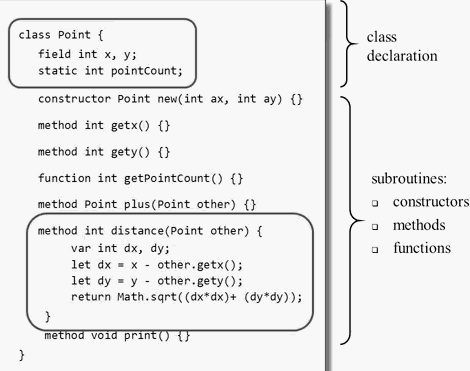

- Compilation challenges
    - Handling procedural code 
        - variables
        - expressions
        - flow of control
    - Handling objects
    - Handling arrays
- The challenge: expressing the above semantics in the VM language

<h2 id="af37fa1db159e0c88611301daf974619"></h2>


## Unit 5.2: Handling Variables

- example source code

```
sum = x * ( 1+rate )
```

- translate to VM code (pseudo) 

```
push x
push 1
push rate
push +
push *
pop sum 
```

- for now , let us focus only on the variables
- we have sum, x, and rate
- remember that the VM langauge does not have symbolic variables. 
    - it only has things like local , argument, this , that, and so on.
- So in order to resolve this pseudo VM code into final executable VM code, I have to map these symbolic variables on what we called the virtual memory segments. 
- In order to generate *actual* VM code, we must know (among other things):
    - Whether each variable is a *field,static,local,or argument*
    - Whether each variable is the *first,second,third...* variable of its kind

- VM code (actual)
    - (making some arbitrary assumptions about the variable )

```
push argument 2
push constant 1
push static 0
add
call Math.multiply 2
pop local 3
```

<h2 id="03df896fc71cd516fdcf44aa699c4933"></h2>


### Variables

- We have to handle:
    - class-level variables
        - field
        - static
    - subroutine-level variables
        - argument
        - local 
- Every one of these variables has some properties:
    - name (identifier)
    - type (int, char, boolean, class name)
    - kind (field, static, local, argument)
    - scope (class level subroutine level)
- Variable properties
    - Needed for code generation
    - Can be managed efficiently using a **symbol table**


<h2 id="c2d6782cdc5b56e19beaaca9864ee842"></h2>


### Symbol tables

```
class Point {
    field int x,y;
    static int pointCount;    
    ...
}
```

 name | type | kind | #
--- | --- | --- | ---
x | int | field | 0
y | int | field | 1
pointCount | int | static | 0


```
class Point {
    ...
    method int distance( Point other ) {
        var int dex, dy; 
        ...    
    }    
}
```

- note `distance` is a class method, so it will always contain a `this` variable

 name | type | kind | #
--- | --- | --- | ---
this | Point | argument | 0 (argument 0 in every method)
other | Point | argument | 1
dx | int | local | 0 
dy | int | local | 1

- Class-level symbol table:
    - can be reset each time we start compiling a new class
        - in Jack, or Java, or C# , classes are standalone compilation units
- Subroutine-level symbol table:
    - can be reset each time we start compiling a new subroutine

- It turns out that when you compiling anything in Jack , you always have to maintain just 2 symbol tables.
    - the class symbol talbe, and the current subroutine symbol table. 

- Handling variable declarations:
    - field/static/var type varName; 
        - Add the variable and its properties to the symbol table
    - parameter list 
- Handling variable usage:
    - example :  `let dx=x-other.getx();`
    - look up the variable in the subroutine-level symbol table; if not found, look it up in the class-level symbol table.
        - if not found, throw an error. 

- so expression `let y=y + dy ` will be translated into VM code :

```
push this 1  // y
push local 1  // dy
add 
pop this 1   // y
```

<h2 id="68293a27f79e370f88514d80226ebd17"></h2>


### Handling nested scoping

- not in Jack, but often in other language like Jave, C ...
- Some languages feature unlimited nested scoping
- Can be managed using a linked list of symbol tables.

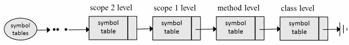

- Variable lookup: 
    - start in the 1st table
    - if not found , look up the next table, and so on.


<h2 id="59051b9e08782ffd6d31280501c339eb"></h2>


## Unit 5.3: Handling Expressions

<h2 id="76c9ab57869b25403bfcfdd63b3a8b4a"></h2>


### Parse tree

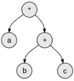

- prefix 
    - `* a + b c`
    - functional 
- infix
    - `a * (b+c)`
    - human oriented , most source code are infix.
- postfix 
    - `a b c + *`
    - stack oriented 
    - **this postfix notation is intimately related to our stack machine, because our stack language is also postfix.**
    - our target language , the VM language , is postfix. so the compiler has to translate from infix to postfix.

<h2 id="4f000a95e8fd9c5955d285f4c30e7005"></h2>


### Generating code for expressions: a two-stage approach

 1. source code -> parse tree  ( The XML file we output in project 10 is a parse tree )
 2. go throuth every node in this parse tree in a certain order , and then you generate the stack machine code.

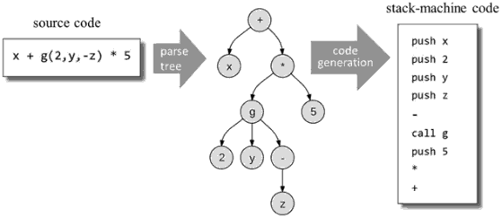

- 生成 parse tree 的代价是很大的，实践中一般不会这么做。

<h2 id="9469e0355de5f8a8d9d169f7816ba22b"></h2>


### Generating code for expressions: a one-stage approach

- The following algorithm is  going to generate the VM code on the fly without having to create  the whole parse tree in the process.

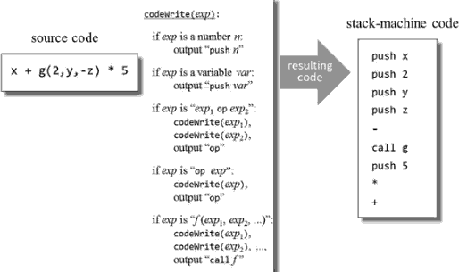


<h2 id="f5631092f3eb428ad208da4f664a02b4"></h2>


## Unit 5.4: Handling Flow of Control

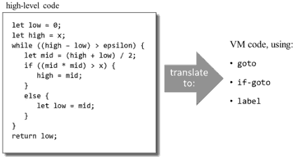

- we have 5 statements
    - let, do, return are trivial statements to translate
    - translating `while` and `if` are far more challenging.

<h2 id="355ae27a43a25b85426f2cb9f597b845"></h2>


### Compiling if statements

```
if (expression) 
    statement1
else
    statement2
```

- before I generate code for this statement, I would like to rewrite it using a flow chart.
    - the first thing to do is to take the expression and **negate** it. 
    - why to do this negation ? Because once you negate the expression in such a way , code generation becomes far simpler and tighter. 

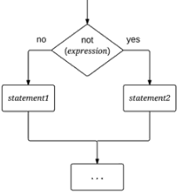  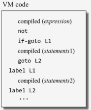

- where are these labels (L1,L2) come from ?
    - the compiler generates these labels


<h2 id="c3f04ad354468e45e8b2f9f411906bcf"></h2>


### Compiling while statements

```
while (expression)
    statements
```

   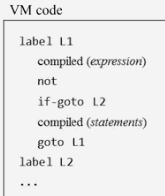

<h2 id="bb523de8a79f81c8c049269679fbf839"></h2>


### Some (minor) complications

- A program typically contains multiple `if` and `while` statements.
     - we have to make sure that the compiler generates unique labels


<h2 id="06effbea19f7b103138b1619a48ebd2d"></h2>


## Unit 5.5: Handling Objects: Low-Level Aspects

<h2 id="06feb3971d12b929516619833999f3cc"></h2>


### Handling local and argument variables 

- local, argument
    - represent *local* and *argument* variables
    - located on the *stack*
- Implementation
    - Base addresses: LCL and ARG
    - Managed by the VM implementation

<h2 id="ad67aa5506e69117865463c4ed0a3c39"></h2>


### Handling object and array data

- this, that
    - represent *object* and *array* data
    - localted on the *heap*
    - you may well have numerous objects and quite a few arrays.
- Implementation
    - Base address: THIS and THAT
    - Set using `pointer 0 (this)` , `pointer 1 (that)`  
    - Managed by VM code.

<h2 id="9e5d11d6d75f16160b8bd42ef9174e70"></h2>


### Accessing RAM data

- suppose we wish to access RAM words 8000, 8001, 8002, ...

VM code (commands) | VM implementation (resulting effect)
--- | ---
push 8000  | sets THIS to 8000
pop pointer | 
push/pop this 0 | accessing RAM[8000]
push/pop this 1 | accessing RAM[8001]
push/pop this i | accessing RAM[8000+i]

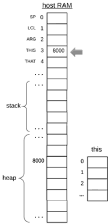

<h2 id="8912c5512db9003e5c8ce07b7ff36a88"></h2>


### Recap

- Object data is accessed via the `this` segment
- Array data is accessed via the `that` segment
- Before we use these segments, we must first anchor them using pointer.

<h2 id="c8ea3a0c16bab7da5fd3f9529c1dd329"></h2>


## Unit 5.6: Handling Objects: Construction

<h2 id="d9e1e92208a6e2a9767df08e9a6b5f34"></h2>


### The caller's side: compiling new

- source code

```
var Point p1,p2;
var int d ;
...
let p1 = Point.new(2,3);
let p2 = Point.new(5,7);
```

- compiled VM(pseudo) code

```
// var Point p1,p2;
// var int d ;
// The compiler updates the subroutine's symbol table 
// No code is generated

// let p1 = Point.new(2,3);
// Subroutine call:
push 2
push 3
call Point.new
// Contract: the caller assumes that the constructor's code
(i) arranges a memory block to store the new object , and 
(ii) returns its base address to the caller.
pop p1  // p1 = base address of the new object 

// let p2 = Point.new(5,7);
// similar
```

- subroutine symbol table

name | type | kind | #
--- | --- | --- | ---
p1 | Point | local | 0 
p2 | Point | local | 1
d  | int   | local | 2


<h2 id="bad720c9f754d4aecd8c100f268f43df"></h2>


### Resulting impact

- During compile-time, the compiler maps p1 on local 0 , p2 on local 1, and d on local 2 ?
- During run-time, the execution of the constructos's code effects the creation of the objects themselves. on the heap.
- So, object construction is a two-stage affair that happens both during compile time and during runtime.


<h2 id="8b5d1806c2892f0de925efda271a5e25"></h2>


### Object construction: the big picture

- A constructor typically does 2 things:
    - Arranges the creation of a new object 
    - Initializes the new object to some initial state
        - Therefore , the constructor's code typically needs access to the object's *fields*.
- How to access the object's fields ?
    - The constructor's code can access the object's data using the *this* segment
    - But first , the constructor's code must anchor the *this* segment on the object's data , using pointer

<h2 id="b5a62b5ad862bb9e26144324adcf68c8"></h2>


### Compiling constructors

```
class Point {
    field int x,y ;
    static int pointCount ;
    ...
    /** Constructs a new point  */
    constructor Point new(int ax, int ay) {
        let x = ax ;
        let y = ay ;
        let pointCount = pointCount +1;
        return this ;    
    }    
}
```

- class-level symbol table

name | type | kind | #
--- | --- | --- | --- 
x | int | field | 0 
y | int | field | 1
pointCount | int | static | 0


The compiler knows that the constructor has to create some space on the RAM for the newly constructed object.

So the first question is how does the compiler know how much space is needed ?

Well, the compiler can consult the class-level symbol table and realize that objects of this particular class, Point, require 2 words only , x and y. 

So the 2nd question is how do we find such a free memory block on the RAM ? 

Well , at this stage the operating system comes to the rescure -- `alloc` function.


- compiled code

```
// constructor Point new(int ax, int ay) 
// The compiler creates the subroutine's symbol table, 
// no code genrates

// The compiler figures out the size of an object, and call
// Memory.alloc(n).
// This OS method finds a memory block of the required size, 
// and return its base address.
push 2
call Memory.alloc 1
pop pointer 0  // anchors this at the base address

// let x = ax; let y = ay;
push argument 0
pop this 0
push argument 1
pop this 1

// let pointCount = pointCount + 1 ;
push static 0
push 1 
add 
pop static 0

// return this
push pointer 0
return // returns the base address of the new object
```


- constructor subroutine symbol table

name | type | kind | #
--- | --- | --- | ---
ax | int | arg | 0
ay | int | arg | 1 


<h2 id="a39c2af80faf078ce7853e7634260c19"></h2>


## Unit 5.7: Handling Objects: Manipulation

- Manipulation:
    - Compiling `obj.methodCall()`
    - Compiling methods

<h2 id="0bf34995a654ca604cf786c68133f751"></h2>


### Compiling method calls 

```
// OO Style:
... obj.foo(x1,x2,...) ... 
```

- The target machine language is *procedural*
- Therefore , the compiler must rewrite the OO method calls in a procedural style


```
// Procedural style:
... foo(obj,x1,x2,...) ...
```

<h2 id="7f98b93563fd91ec7c2d991d262356a0"></h2>


### Compiling method calls: the general technique 

```
// obj.foo(x1,x2,...)
// Pushes the object on which the method 
// is called to operate(implicit parameter) ,
// then pushes the method arguments, 
// then calls the method for its effect
push obj
push x1
push x2
push ...
call foo
// take care of return value
```

<h2 id="b1ccdfc4e6f647901313153e39a5b3cc"></h2>


### Compiling methods

- Methods are designed to operate on the current object(this):
    - Therefore , each method's code needs access to the object's *fields*
- How to access the object's fields:
    - The method's code can access the object's i-th field by accessing `this i`
    - But first , the method's code must anchor the `this` segment on the object's data, using pointer

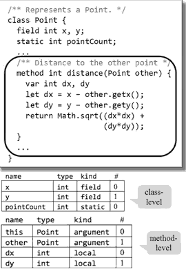

```
// method int distance(Pointer other)
// var int dx , dy
// The compiler constructs the method's 
// symbol table. No code is generated.
// Next, it generates code that associates the 
// this memory segment with the object on 
// which the method is called to operate.
push argument 0
pop pointer 0  // THIS = argument 0

// let dx = x - other.gets()
push this 0   // x
push argument 1   // other
call Point.getx 1
sub
pop local 0   // dx

// let dy = y - other.gety()
// similar, code omitted

// return Math.sqrt( (dx * dx) + (dy * dy) )
push local 0
push local 0
call Math.multiply 2
push local 1
push local 1
call Math.multiply 2
add
call Math.sqrt 1
return
```

<h2 id="55e9a67b2637a22721d32d2ca744e091"></h2>


### Compiling void methods

```
...
// Methods must return a value
push constant 0
return
```

- for the caller ...

```
// do p1.print()
push p1
call Point.print
// the caller of a void method
// must dump the returned value
pop temp 0
...
```

- Recap
    - Each compiled method must return a value
    - By convention, void methods return a dummy value
    - Callers of void methods are responsible for removing the returned value from the stack.

<h2 id="1f250f80bd24fd913d5b306b23e5b013"></h2>


## Unit 5.8: Handling Arrays

<h2 id="cd64ab1d72053726ca263d240fb599c3"></h2>


### Array construction

- `var Array arr;` 
    - it will alloc a variable in local segment ( stack )
    - generates no code, only effects the symbol table
- `let arr = Array.new(n);`
    - alloc Array in heap
    - from the caller's prespective , handled exactly loke object construction

<h2 id="545aa7c72d8f6c38b02756a6f239d786"></h2>


### this and that ( reminder )

- 2 "portable" virtual memory segments that can be aligned to diferent RAM addresses


 · | this | that
--- | --- | ---
VM use: |  current object |  current array
pointer ( base address ) | THIS | THAT
how 2 set: | `pop pointer 0`  |  `pop pointer 1`

<h2 id="1ba79f517d6c46192912d7458e04c2a7"></h2>


### Example : RAM access using that

```
// RAM[8056] = 17
push 8056
pop pointer 1    // THAT = 8056
push 17
pop that 0    // THAT[0] = 17
```

<h2 id="a95b07ba412779d5ff4654b911aae1c8"></h2>


### Array access

```
// arr[2] = 17
push arr  // base address
push 2    // offset
add 
pop pointer 1
push 17
pop that 0
```

- note we only use the entry *0* for that , why we not generate following simple code instead ?

```
push arr
pop pointer 1
push 17
pop that 2
```

- because
    - The simple code works only for constant offsets (indices) , it  cannot be used when the source is statement, say, “let arr[x] = y” , since the compiler donot its actual value when generating code.


```
// solution: arr[expression1] = expression2
push arr
push expression1
add
pop pointer 1
push expression2
pop that 0
```

- **Unfortunately, the above VM code does not work** when handle such kind of statement : `a[i] = b[j]  `

```
// solution: a[i] = b[j]
push a 
push i
add

push b
push j
add
pop pointer 1
push that 0    // b[j] -> stack

pop temp 0     // stack b[j] -> temp 0

pop pointer 1
push temp 0  
pop that 0
```

- General solution for generting array access code

```
// arr[expression1] = expression2   
push arr

VM code for computing and pushing the value of expression1
add    // top stack value = RAM address of  arr[expression1]


VM code for computing and pushing the value of expression2

pop temp 0  // temp 0 = the value of expression2
            // top stack value = RAM address of  arr[expression1]

pop pointer 1  // that pointer to access where to store
push temp 0

// store , since its array, it use `that` segment
pop that 0
```

- If needed ,the evaluation of expression2 can set and use *pointer 1* and *that 0* safely.
- What about `a[a[i]] = a[b[a[b[j]]]] ` ?
    - No problem.


<h2 id="e8beb7c21a1018408c7f5ac3f7bab5e1"></h2>


## Unit 5.9: Standard Mapping Over the Virtual Machine

- Specifies how to map the constructs of the high-level language on the constructs of the virtual machine.

<h2 id="34cb0217bf2a49087396227957b0b082"></h2>


### Files and subroutine mapping

- Each file  filename.jack is compiled into the file fileName.vm
- Each subroutine *subName* in *fileNname.jack* is compiled into a VM function *fileName.subName*
- A Jack constructor function with k arguments is compiled into a VM function that operates on k arguments
- A Jack method with k arguments is compiled into a VM function that operates on k+1 arguments.

<h2 id="c0aae26691e8f3c35ee1b5c4debbd5af"></h2>


### Variables mapping

- The local variables
    - of a Jack subroutine are mapped on the virtual segment **local** 
- The argument variables
    - of a Jack subroutine are mapped on the virtual segment **argument**
- The static variables
    - of a .jack class file are mapped on the virtual memory segment **static** of the compiled .vm class file.
- The field variables
    - of the current object are accessed as follows:
        - assumption: pointer 0 has been set to the *this* object.
            - some1 has to do it for us :  the agent that does it is the generated code of the current subroutine. 
            - the i-th field of this object is mapped on `this i`

<h2 id="ffd8db0ee66dfd1809e84e094fd0e063"></h2>


### Array mapping

- Accessing array entries:
    - Access to any array entry `arr[i]` is realized as follows:
        - first set `pointer 1` to the entry's address (arr + i)
        - access the entry by accessing `this 0`

<h2 id="7399b6270fac208b58de6e641c3f3845"></h2>


### Compiling subroutines

- When compiling a Jack method:
    - the compiled VM code must set the base of the `this` sgement to `argument 0`
- When compiling a Jack constructor:
    - the compiled VM code must allocate a memory block for the new object, and then set the base of segment `this` to the new object's base address.
    - the compiled VM code must return the object's base address to the caller.
- When compiling a void function of a void method
    - The compiled VM code must return the value constant 0

<h2 id="71a1ddf989741040972099277b141189"></h2>


### Compiling subroutine calls

- Calling a subroutine call `subName(arg1, arg2, ...)`
    - The caller (a VM function) must push the arguments onto the stack, and then call the subroutine.
- Calling the called subroutine is a method,
    - The caller must first push a reference to the object on which the method is supposed to operates;
    - next, the caller must push arg1, arg2, ...  , and then call the method.
- If the called subroutine is void
    - when compiling the Jack statment `do subName` , following the call the caller must pop(and ignore) the returned value.


<h2 id="ea1910cfdfdbd85ca2643d4bd8cd028b"></h2>


### Compiling constants

- null is mapped on the constant 0
- false is mapped on the constant 0
- true is mapped on the constant -1
    - -1 can be obtained using `push 1` followed by `neg`

<h2 id="ea475c0e9caccb89cc9510f1eb21667e"></h2>


### OS classes and subroutines

- The basic Jack OS is implemented as a set of compiled VM class files:
    - Math.vm, Memory.vm, Screen.vm, Output.vm, Keyboard.vm, String.vm, Array.vm, Sys.vm 
- All the OS class files must reside in the same directory as the VM files generated by the compiler
- Any VM function can call any OS VM function for its effect.

<h2 id="7320544ffe6fa06e8dac4abeb73d2c0b"></h2>


### Special OS services

- Multiplication is handled using the OS function Math.multiply()
- Division is handled using the OS function Math.divide()
- String constants are created using the OS constructor `String.new(length)`
- String assigments like `x="cc...c"` are handled using a series of calls to `String.appendChar(c)`
- Object construction requires allocating space for the new object using the OS function Memory.alloc(size)
- Object recycling is handled using the OS function Memory.deAlloc(object).

<h2 id="93d9543681348941b2eaf90c6516439c"></h2>


## Unit 5.10: Completing the Compiler: Proposed Implementation

<h2 id="2afeb4bd815d23bcfb0be6c37868835b"></h2>


### Symbol table

- The scope of **static** and **field** variable is the *class* in which they are defined
- The scope of **local** and **argument** variables is the *subroutine* in which they are defined.

- We give each variable a running index within its scope and kind
- The index starts at 0, increments by 1 each time a new symbol is added to the table, and is reset to 0 when starting a new scope

---


name | type | kind | #
--- | --- | --- | ---
this | Point | argument | 0 
... | ... | ... | ... 


- Implementation notes
    - The symbol table abstraction can be implemented using 2 seprate *hash tables* :
        - one for the class scope
        - and one for the subroutine scope
    - When we start compiling a new subroutine, the latter hash table can be reset
    - When compiling an error-free Jack code, each symbol NOT found in the the symbol table can be assumed to be either a *subroutine name* or a *class name*.

<h2 id="0cf366dadfdeea1a566f047ee68a9e81"></h2>


### VMWriter

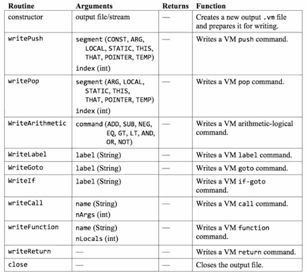

<h2 id="ebb5853f19668a28aac3fb43709781c3"></h2>


## Unit 5.11: Project 11

<h2 id="2afeb4bd815d23bcfb0be6c37868835b"></h2>


### Symbol table

- Extend the handling of identifiers
    - output the identifier's category: 
        - var, argument, static, field, class, subroutine
    - if the identifier's category is `var, argument, static field` , output also the running index assigned to this variable in the symbol table
    - output whether the identifier is being defined, or being used.

<h2 id="ab458f4b361834dd802e4f40d31b5ebc"></h2>


### Quiz 

```
// Main.jack
class  Main {
    function void main() {
        do Output.printInt( 1+(2*3) ) ;
        return ;    
    }    
}
```

```
// Main.vm
function Main.main 0
push constant 1
push constant 2
push constant 3
call Math.mulitply 2
add
call Output.printInt 1
pop temp 0     // instruction 1
push constant  // instruction 2
return
```

- Inspect the VM code, focusing on the 2 instructions highlighted in red. 
    - instruction 1
        - every subroutine must return a value.
        - the return value of Output.printInt  serves no purpose whatever, so we simply dump it.
    - instruction 2
        - the method `main` also need return a value


