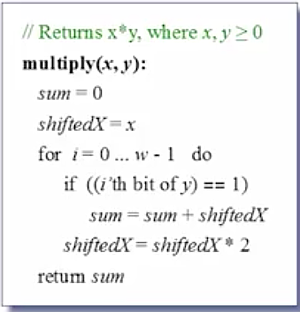
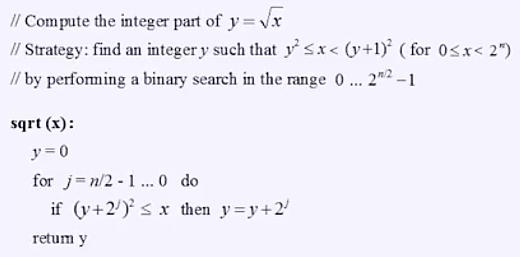
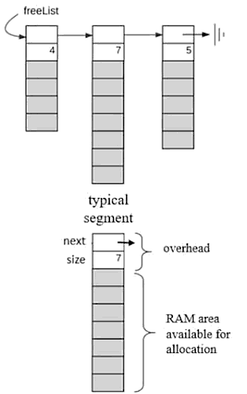
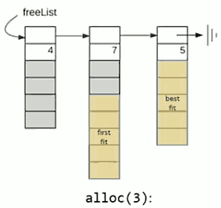
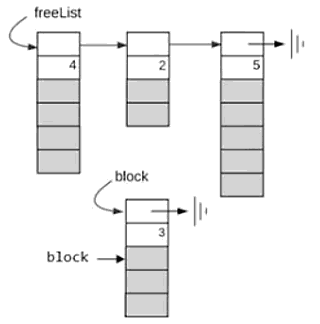
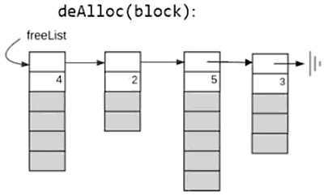
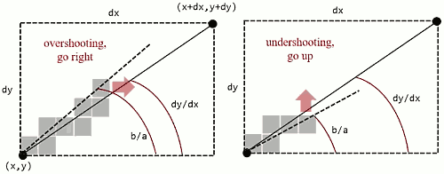
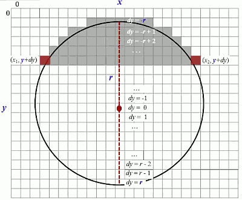
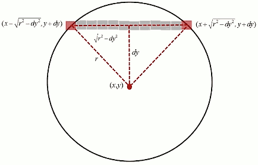

...menustart

 - [Module 6: Operating System](#fb71412d09271536aa98bc0e794b79c1)
     - [6.1 Operating System](#2af59aa7a876715e2fbb8f6aa4c7f2ea)
         - [Typical OS Services](#e7820015b6da7d3fe931e8aef85c14c3)
         - [The Jack OS](#28a071a5b28abb405ca19096b8c221b7)
     - [6.3 Mathematical Operations](#c67722540f5fa016dc542c75e186f4b0)
         - [multiplcation](#b72b04759d9fed58df037ee567f851d4)
         - [Division](#3025cdaab2deb0bb2cd642449e570833)
         - [Square root](#921c8ec6c3d4bde5e7634dbb32de93fe)
     - [6.4 Memory Access](#3ff40ea85319bee31ad07c4868a10260)
     - [6.5 Heap Management](#37172e3a5b02f949dccb6a71da9d5d0f)
         - [Object construction and destruction](#12040c88931471aab97a3abddd6a6b80)
         - [Heap management (simple)](#f998d8459d4a637427aa37907d63fc1a)
         - [Heap management](#48b9b0831480a06c1eb8a9aca0d62baa)
         - [Heap management (detailed)](#36db045df60520c0aeb9d4e87c4c73c9)
         - [Implementation notes](#a4ec9143c7ccb66f9e2bd94c70eaf4b6)
     - [6.6 Graphics](#667ebe3f340a91efe52c4e6e6aa032b0)
         - [Draw Pixel](#3731fbf53a579409601210e9c2cc101d)
         - [Line Drawing](#4d3ef5d5e84c17c6c205dab36d211489)
         - [Circle drawing](#6104bf2ce199148553bd216dccefd5ec)
     - [6.8: Handling Textual Output](#fc13b36e9870fcb3ae5e8d19883fa8fd)
         - [Font implementation](#4e241a5e85e955f1e8376795c97bd366)
         - [Cursor](#9abdae4fa5d93330363a88ed8a5e7946)
     - [6.9 Input](#fc7bc95df1b722bc56c78deb2a6d2d72)
     - [6.10 String Processing](#06132411f843899b094ddb2cfd5f9ed8)
         - [Implementation notes](#a4ec9143c7ccb66f9e2bd94c70eaf4b6)
     - [6.11: Array Processing](#16ca44c5643ad0bcb9f5e0ef10525e72)
     - [6.12: The Sys Class](#7bb88f5cc49596490f9c9dc28dfa46cc)
     - [6.13: Project 12: Building the OS](#c39af9bce93260de68adafcf69990316)
         - [Reverse engineering](#0641401c188fcc2e9aea8fc8f738ee07)

...menuend


<h2 id="fb71412d09271536aa98bc0e794b79c1"></h2>


# Module 6: Operating System

<h2 id="2af59aa7a876715e2fbb8f6aa4c7f2ea"></h2>


## 6.1 Operating System 

<h2 id="e7820015b6da7d3fe931e8aef85c14c3"></h2>


### Typical OS Services 

 - Language extensions / standard library
    - mathematical operations (abs,sqrt,...)
    - abstract data types (String, Array, ...)
    - input function  (readChar, readLine, ...)
    - textual output (printChar, printString, ...)
    - graphics output (drawLine, drawCircle, ...)
 - System oriented services 
    - memory management (objects, arrays, ...)
    - file system
    - I/O device drivers
    - UI management (shell, windows)
    - multi-tasking 
    - Networking 
    - security 

<h2 id="28a071a5b28abb405ca19096b8c221b7"></h2>


### The Jack OS

 1. Math
 2. Memory
 3. Screen
 4. Output
 5. Keyboard
 6. String
 7. Array
 8. Sys


<h2 id="c67722540f5fa016dc542c75e186f4b0"></h2>


## 6.3 Mathematical Operations

<h2 id="b72b04759d9fed58df037ee567f851d4"></h2>


### multiplcation 

- naive implement
    - repeative additon  , O(N)
- optimized solutino
    - binary shift , and then sum up , O(w)
    - 


 - Issues:
    - how to handle negative numbers ?
        - it works fine
    - how to handle overflow ?
        - this algorithm always return the correct answer modulu 2ʷ
    - how to implement i'th bit of y quickly ?
        - Jack doesn't have bit test function , but have `&` and `|` bit-wise op.
        - Instead, we can use an array that holds the 16 values 2ⁱ, i=0,...,15
            - a fixed array, say , twoToThe[i]
            - implement the bit test function


<h2 id="3025cdaab2deb0bb2cd642449e570833"></h2>


### Division

```
// return the integer part of x/y
// where x >=0 , and y >0
def positive_divide(x,y):
    if y > x :
        return 0
    q = divide(x, 2*y)
    if x - 2*y*q < y :
        return 2*q
    else:
        return 2*q + 1
```

 - O(logN)
 - Issues:
    - handling negative numbers
        - divide |x| / |y|
        - then set the result's sign
    - handling overflow (of y)
        - solution: the overflow can be detected when y becomes negative 
        - we can change the functions first statement to:
            - `if (y>x or y<0) return 0`
 
<h2 id="921c8ec6c3d4bde5e7634dbb32de93fe"></h2>


### Square root

 - The square root function √x has 2 appealing properties:
    - its inverse function x² can be easily computed
    - it is a monotonically increasing function
 - Therefore:
    - squre roots can be computed using *binary search*
    - 
    - `for j=n/2 ; j>=0; j--`
 - Issus:
    - the calculation of   `(y+2ʲ)²` can overflwo
    - solution: change the condition  `(y+2ʲ)²<=x`  to `(y+2ʲ)² <=x and (y+2ʲ)² >0`

```python
# python code in Jack mana
def sqrt( x ) :
    y = 0 
    n = 0 
    while x >= 2**n  :
        n += 1

    j = n/2 
    while j >=0 :
        tmp = (y+ (2**j)) * (y+ (2**j)) 
        if tmp > 0 :
            if tmp <= x :
                y = y + (2**j)
        j = j-1
    return y
```


<h2 id="3ff40ea85319bee31ad07c4868a10260"></h2>


## 6.4 Memory Access

 - class Memory 
    - int peek(int addr)
    - void poke(int addr, int value)
    - Array alloc(int size)
    - void deAlloc(Array o)

 - The challenge 
    - THe OS is written in Jack: how can we access the RAM ?
    -
    ```
    class Memory {
        static Array ram;
        ...
        function void init() {
            let ram = 0 ;  // Jack is weak typed
        }
    }
    ```

<h2 id="37172e3a5b02f949dccb6a71da9d5d0f"></h2>


## 6.5 Heap Management 

 - The need
    - During run-time , programs typically create objects and arrays
    - Objects and arrays are implemented using 
        - reference variables
        - pointing at actual data blocks (in the heap)
 - The challenge
    - Allocating memory for new objects / arrays 
    - Recycling memory of disposed objects / arrays 

<h2 id="12040c88931471aab97a3abddd6a6b80"></h2>


### Object construction and destruction 

 - The challenge 
    - Implementing *alloc* and *dealloc*
 - The solution 
    - Heap management 

<h2 id="f998d8459d4a637427aa37907d63fc1a"></h2>


### Heap management (simple)

```
init:
    free = heapBase
    
alloc(size):
    block = free
    free = free + size
    return block

deAlloc(object):
    do nothing (simple, never recycle)
```

<h2 id="48b9b0831480a06c1eb8a9aca0d62baa"></h2>


### Heap management 

 - Use a **linked list** to keep track of available heap segments , which are presently available to us
    - 
 - alloc(size):
    - find a block of size *size* in one of the segments ,remove it from the segment , and give it the client 
 - deAlloc(object):
    - append the object/block to the freeList ( i.e. simply append it to the end of the freeList.  )


<h2 id="36db045df60520c0aeb9d4e87c4c73c9"></h2>


### Heap management (detailed)

 - alloc(size):
    - for an example,  *size* = 3
    - Terminology: if segment size >= *size* + 2 , we say that the segment is *possible*
        - The *2*  is for the overhead fields which are absolutely necessary. 
    - search the freeList for:
        - the first possible segment (first fit) , or 
        - the smallest possible segment (best fit) 
    - 
    - if no such segment is found, return failure (or attempt defragmentataion)
    - carve a block of size ( *size* + 2 ) from this segment 
        - update the freeList and the fields of *block* to account for the allocation
    - return the base address of the block's data part 
    - 
 - deAlloc (object):
    - append *object* to the end of the freeList. 
    - 
    - problem:  The more we recycle (deAlloc), the more the freeList becomes fragmented.
    - defrag: every once defrag kicks in, it go through the entire freeList, and tries to merge as more small segments into continuous segments in the memory.
        - not required for this course project.


<h2 id="a4ec9143c7ccb66f9e2bd94c70eaf4b6"></h2>


### Implementation notes

 - Implementing the heap / freeList (on Hack platform)

```
class Memory {
    ...
    static Array heap;
    ...

    // In Memory.init 
    ...
    let heap = 2048; // heapBase

    let heap[0] = 0 // next, 0 means its tail of freelist
    let heap[1] = 16384-2048-2  ; // length
    ...
}
```

 - The *freeList* can be realized using the *heap* array
 - The *next* and *size* properties of the memory segment beginning in address *adrr* can be realized by `heap[addr-2]` and `heap[addr-1]`.
 - alloc, deAlloc, and deFrag can be realized as operations on the *heap* array.


<h2 id="667ebe3f340a91efe52c4e6e6aa032b0"></h2>


## 6.6 Graphics


<h2 id="3731fbf53a579409601210e9c2cc101d"></h2>


### Draw Pixel

 - recap
    - 8k screen memory map 
    - target screen:   512 pixel * 256 pixel 
    - Jack word:  16 bits

```
function void drawPixel(int x, int y) {
    address = 32*y + x/16 
    value = Memory.peek[ 16384 + address ]
    set (x%16)th bit of value to 1
    do Memory.poke(address, value)
}
```


<h2 id="4d3ef5d5e84c17c6c205dab36d211489"></h2>


### Line Drawing

 - Basic idea: image drawing is implemented through a sequence of *drawLine* operations
 - Challenge: draw lines *fast*
 - Naive idea: 

```
// just for an example
// assuming x2 > x1, y2 > y1
drawLine(x1,y1, x2,y2)
let:
    x = x1
    y = y1
    dx = x2 - x1
    dy = y2 - y1

a = 0 ; b = 0 ;
while ( (a<=dx) and (b<=dy) )
    drawPixel( x + a, y + b )
    // decide if to go right , or up
    // to avoid going diagonally
    if ( b/a > dy / dx ) , a = a + 1 
    else           , b = b + 1 

```

 - opitmize:
    - 
    - `( b/a > dy / dx )` has the same value as `( a*dy < b*dx )`
    - `let diff = a*dy - b*dx`
        - when a = a + 1 , *diff* goes up by **dy**
        - when b = b + 1 , *diff* goes down by **dx**
    - solution:
        - 
        ```
        if (diff < 0 ) 
            a = a + 1
            diff = diff + dy 
        else
            b = b + 1
            diff = diff - dx 
        ```
    - now , it involves only addition and subtraction operations 
        - and can be implemented either in software or hardware.

 - Issue :
    - modify this algorithm for a screen origin (0,0)  at the screen's top-left corner
    - generalize the algorithm to draw lines that go in any direction
    - drawing horizontal and vertical lines should probably be handled as special cases. 


<h2 id="6104bf2ce199148553bd216dccefd5ec"></h2>


### Circle drawing 





```
drawCircle(x,y,r):
    for each dy = -r to r do:
        drawLine( x - √(r²-dy²) , y+dy ,  x + √(r²-dy²) , y+dy  ) 
```


 - for *drawCircleOutline* , do twice *drawPixel*  instead of *drawCircle*
 - Issue :
    - can potentially lead to overflow
    - to handle , limit r to no greater that 181

<h2 id="fc13b36e9870fcb3ae5e8d19883fa8fd"></h2>


## 6.8: Handling Textual Output

 - Textual output:
    - Screen : 23 rows of 64 characters , b&w
    - Managed by the Jack OS class *Output*
 - Hack Font
    - Each character occupies a fixed 11x8 pixel frame
    - The frame include 2 empty right columns and 1 empty buttom row for character spacing

<h2 id="4e241a5e85e955f1e8376795c97bd366"></h2>


### Font implementation

```
class Output {
    static Array charMaps; // character map for displaying characters

    function void init() {
        do initMap(); 
    }
    ...
    // Initializes the caracter map array
    function void intiMap() {
        let charMaps = Array.new(127);

        // Assigns the bitma for each character in the character set
        do Output.create(97, 0,0,0,14,24, 30,27,27,54,0, 0); // a 
        do Output.create(98, 3,3,3,15,27, 51,51,51,30,0, 0); // b
        ...

        // black square , used for non printable characters
        do Output.create(0, 63,63,63,63,63, 63,63,63,63,63,0, 0)
        return
    }
    
    // create a character map array of the given char index with the given values 
    function void create( int index, int a, int b, int c, int d, int e,
                                     int f, int g, int h, int i, int j, int k) {
        var Array map;
        let map = Array.new(11)
        let charMaps[index] = map;
        let map[0] = a; let map[1] = b; let map[2] = c;
        let map[3] = d; let map[4] = e; let map[5] = f;
        let map[6] = g; let map[7] = h; let map[8] = i;
        let map[9] = j; let map[10] = k;
        return 
    }
}
```


<h2 id="9abdae4fa5d93330363a88ed8a5e7946"></h2>


### Cursor 

 - Indicates where the next character will be written
 - Logical / physical implications
 - But Jack platform does not show a cursor at all

 - Manage cursor
    - if asked to display *newline* : move the cursor to the beginning of the next line
    - if asked to display *backspace* : move the cursor one column left
    - if asked to display any other character:  dislay the character , and move the cursor one columen to the right .

---

<h2 id="fc7bc95df1b722bc56c78deb2a6d2d72"></h2>


## 6.9 Input

 - recap
    - 1 word kb map ,  24576 (0x6000)

 - keyPressed
    - use `Memory.peak` to access the keyboard's memory map
 - readChar
    - 
    ```
    readChar():
        display the cursor
        // waits until a key is pressed
        while (keyPressed() ==0) :
            do nothing 
        c = code of the currently pressed key 
        while (keyPressed() !=0 ):
            do nothing
        display c at the current cursor location 
        advance the cursor 
    ```

 - readLine
    - 
    ```
    readLine():
        str = empty string 
        repeat 
            c = readChar()
            if c == newLine :
                display newLine
                return str 
            else if c == backspace:
                remove the last character from str
                do Output.backspace()
            else:
                str = str.append( c )
    ```

<h2 id="06132411f843899b094ddb2cfd5f9ed8"></h2>


## 6.10 String Processing 

 - int2string
    - 
    ```
    def int2String(val_pos):
        lastDigit = val_pos % 10
        c = lastDigit + 48
        if val_pos < 10 :
            return chr(c)
        else:
            return int2String(val_pos/10) + chr(c)
    ```
 - string2int
    - 
    ```
    string2Int(str):
        val = 0
        for i = 0...str.length do 
            d = integer value of str[i]
            val = val * 10 + d 
        return val
    ```


<h2 id="a4ec9143c7ccb66f9e2bd94c70eaf4b6"></h2>


### Implementation notes

```
class String {
    field Array str;
    field int length ;

    constructor String new (int maxLength) {
        let str = Array.new( maxLength ) ;
        let length = 0
        return this 
    }
    ...
}
```

---


<h2 id="16ca44c5643ad0bcb9f5e0ef10525e72"></h2>


## 6.11: Array Processing

```
Class Array {
    function Array new(int size)
    method void dispose()
}
```

 - Memory.alloc /  Memory.deAlloc
 - You language support array access, and the implementation of array itself is very simple.

<h2 id="7bb88f5cc49596490f9c9dc28dfa46cc"></h2>


## 6.12: The Sys Class

 - Hardware contract
    - WHen the computer is reset, execution starts with the instruction in ROM[0]
 - VM contract
    - The following code should be placed at the top of the ROM, beginning in ROM[0]
    - 
    ```
    sp = 256
    call Sys.init
    ```
 - Jack contract
    - Program execution starts with the function `Main.main()`
 - OS contract
    - Sys.init should initialize the OS, and then call `Main.main()`

```
class Sys {
    // performs all the initializations required by OS
    function void init() {
        // call other OS class which have init()
        do Memory.init();  // the init() order is very important
        do Math.init();
        ...
        do Main.main();
        // keep running  ... 
        do Sys.halt();
        return ;
    }
    // halts execution
    function void halt() {
        // can be implemented using an infinite loop
    }
    // waits approximately duration milliseconds  and returns
    function void wait(int duration) {
        // can be impleted using a loop, machine-specific
    }
    // prints the given error code in the form "ERR<errorCode>" , and halts
    function void error(int errorCode) {
        // simple
    }
}
```

---

<h2 id="c39af9bce93260de68adafcf69990316"></h2>


## 6.13: Project 12: Building the OS

 - OS abstraction:  specified by the Jack OS API
 - OS implementation 
    - VM emulator:  features a build-in OS implementation (written in Java)
    - nand2tetris/tools/os:  features an OS implemenetation (written in Jack) , Math.vm , Memory.vm ...
    - your implementation: project 12

<h2 id="0641401c188fcc2e9aea8fc8f738ee07"></h2>


### Reverse engineering

 - Suppose you wish to implement an existing OS
 - The OS consists of *n* executable modules, with high inter-dependency
 - Strategy
    - For each module in OS, implement the module separately , using the remaining n-1 executable modules to server it. 
 - Example
    - Suppose we want to develop the OS class screen, and test it using some class Main.jack
    - put the files Screen.jack , and Main.jack in some directory
    - compile the directory
    - execute the directory in the VM emulator


