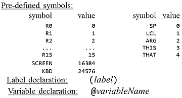

...menustart

- [6 Assembler](#fce483626a497324f611e4f2b5280580)
    - [6.1  Assembly Language and Assemblers](#675ad263deec8581de3c4355b16dc008)
        - [Basic Asserbler Logic](#1697b74ff75c9037295ea0360dab438e)
        - [Symbols](#5214a8a633c296d1d9d504fc54556692)
    - [6.2 The Hack Assembly Language](#a3705a0beeda458fbe09f9670a1240e9)
    - [6.3 The Assembly Proces -- Handling Instructions](#c399c1815d9e255c57e6c274579b8a20)
        - [Translating A-instructions](#a4915c54182d3d2de090f589e46eb63f)
        - [Translating C-instructions](#1d4a9403e40681b2681e88aee8685845)
    - [6.4: The Assembly Process - Handling Symbols](#ff03d198aff223f51c6fe6743fd2ff49)
    - [6.6: Project 6 Overview: Programming Option](#4c88a50b09faa4df288744256a85ae83)

...menuend


<h2 id="fce483626a497324f611e4f2b5280580"></h2>


# 6 Assembler

<h2 id="675ad263deec8581de3c4355b16dc008"></h2>


## 6.1  Assembly Language and Assemblers

<h2 id="1697b74ff75c9037295ea0360dab438e"></h2>


### Basic Asserbler Logic

```
Repeat:
    Read the next Assembly language command
        Load R1,18
    Break it into the different fields it is composed of
        Load  R1  18
    Lookup the binary code for each field
        11001  01 000010010
    Combine these codes into a single machine language command
        1100101000010010
    Output this machine language command
Until end-of-file
```

- very simple

<h2 id="5214a8a633c296d1d9d504fc54556692"></h2>


### Symbols

- Used for 
    - Labels  `JMP loop`
    - Variables   `Load R1, weight`
- Assembler must replace names with address 
- use a symbol table < symbol name , memory address >
    - variables:  if in symbol table, use it; otherwise, alloc a new memory , and put the address in symbol table 
    - lable : remember the address of the instruction next to the label declaration.
        - but what if the label is used before declaration ?


<h2 id="a3705a0beeda458fbe09f9670a1240e9"></h2>


## 6.2 The Hack Assembly Language 



<h2 id="c399c1815d9e255c57e6c274579b8a20"></h2>


## 6.3 The Assembly Proces -- Handling Instructions 

<h2 id="a4915c54182d3d2de090f589e46eb63f"></h2>


### Translating A-instructions 

- `@value`
- binary: 0xxxxxxxxxxxxxxx 
- where *value* is either
    - a non-negative decimal constant , or 
    - a symbol referring to such a constant
- Translation to binary
    - if *value* is a decimal constant , generate the 15-bit binary constant
    - if *value* is a symbol, later.

<h2 id="1d4a9403e40681b2681e88aee8685845"></h2>


### Translating C-instructions 

- `dest = comp ; jump`
- `111` a c1 c2 c3 c4 c5 c6 d1 d2 d3 j1 j2 j3 
- 


<h2 id="ff03d198aff223f51c6fe6743fd2ff49"></h2>


## 6.4: The Assembly Process - Handling Symbols

- Symbol
    - Variables
    - Labels
    - pre-defined symbols
- Use symbol table 
    1. init symbol table with pre-dfined symbols
    2. first pass ,  add Lable symbols to symbol table
    3. 2nd pass , translate code 


<h2 id="4c88a50b09faa4df288744256a85ae83"></h2>


## 6.6: Project 6 Overview: Programming Option

- Proposed software architecture
    - Parse: unpacks each instruction into its underlying fields
    - Code: translates each field into its corresponding binary value
    - SymbolTable: managers the symbol table
    - Main: initializes the I/O files and drives the process


