

- [Neural Networks](#6b347be0e79381eeb5689396d9e59438)
- [Lecture 1](#b685b2632f64514a84fc8cbb0b4b7d2c)
    - [Some simple models of neurons](#b02cb3fa93ab8f0e6485b0d13bc303cc)
        - [Linear neurons](#1ed293fed5b9ae1cf9d961b5ce17cff8)
        - [Binary threshold neurons](#60d743bd92d01784da86912ef3e9d3fa)
        - [Rectified Linear Neurons](#bea9f293a1d10dc9a09ab31410552fc2)
        - [Sigmoid neurons](#5dfb3a910337bd052071a460b50f17d7)
        - [Stochastic binary neurons](#9fa3726b2244619bd1b4f0a6f3c0ad10)
- [Lecture 2](#2cd2c77c9f81b7be54284357f2c55290)
    - [Types of neural network architectures](#b553e95fb37e615918e131140aec36b1)
        - [Feed-forward neural networks](#27403055d079f8f5057e91999fe9ff29)
        - [Recurrent Networks](#3aa835dbc7f8ec8429d7671acae6aab5)
            - [Recurrent neural networks for modeling sequences](#ab481de40578ba1e54e09346c919fe23)
            - [An example of what recurrent neural nets can now do (to whet your interest!)](#ac843506e5b9c5acc3c517304fae2ab6)
        - [Symmetrically connected networks](#bd53760cfb4568281010b21ad9f4c944)
    - [A geometrical view of perceptrons](#b2f07d14cff56667ff8ce65beaa92ace)
        - [Weight-space](#18fbaaed2b269781105b0c38d7d03d1f)
        - [The cone of feasible solutions](#d70801a1a8a06ad3250060f4a42e0b7d)
    - [What perceptrons can’t do](#f6493b60fa9aa860686d995485132458)
        - [The limitations of Perceptrons](#8bac84924ecd4f05b2ef5fb5415cda08)
        - [What binary threshold neurons cannot do](#14461318bc8dca1452e9768872689b06)
        - [Learning with hidden units](#b984ea836f81bad4a3764c2908f793ec)
- [Lecture 3](#28b761e5205ba2e17062ee27b6958d08)
    - [Learning the weights of a linear neuron](#3798fa7c5a40bf15ef1f83520a95cd9e)
        - [Why the perceptron learning procedure cannot be generalised to hidden layers](#62fab41508857c0c13294ed083f177f8)
        - [A different way to show that a learning procedure makes progress](#c61743d3bbfb887b9168af23380eed87)
        - [Linear neurons (also called linear filters)](#5cd0f54138d8b7ce0d43128a5075d301)
        - [Why don’t we solve it analytically?](#bab151580faa1cad100a0d453e419d58)
        - [A toy example to illustrate the iterative method](#0c4bfcbad67bcd54a6ff298e0eeee743)
        - [Solving the equations iteratively](#0edc8f69095e8449ed09865e4e602616)
        - [Deriving the delta rule](#d001ac53343716fde35bea9864a2e62c)
        - [Behaviour of the iterative learning procedure](#fe011b17313c1468885c1b63d9ff3905)
        - [The relationship between the online delta-rule and the learning rule for perceptrons](#6d26dffff5e7929dfcfd10f7899e5c41)
    - [The error surface for a linear neuron](#d637ae0e4758d08ab9cb653d964f5cc0)
        - [The error surface for a linear neuron](#d637ae0e4758d08ab9cb653d964f5cc0)
        - [Online versus batch learning](#44793cbad37c888289dde4ef85d63abb)
        - [Why learning can be slow](#e160ef53e0150859367015007f2e9ffb)
    - [Learning the weights of a logistic output neuron](#7faab456a191c1609e8fa535ba7f246b)
        - [Logistic neurons](#cb0962568720082c771cb150b419153e)
        - [The derivatives of a logistic neuron](#d938f3f9f233cee2aec2d95a787370d5)
        - [Using the chain rule to get the derivatives needed for learning the weights of a logistic unit](#9e566a8d635816845a8514b2be63e940)
    - [The backpropagation algorithm](#f134b6b0a34834048be96a9595500168)
        - [Learning with hidden units (again)](#8ad8d860bc6bd1812c93eb4689ff4e27)
        - [Learning by perturbing weights](#efb8c8024ad6e26591687c673bd2f8ae)
        - [Learning by using perturbations](#f8a34148efcf90c3cf63a397ada225eb)
        - [The idea behind backpropagation](#46dc1eb40926aa8892f0022cb7904d30)
        - [Sketch of the backpropagation algorithm on a single case](#a03dcf514317e4b26494bfde1e3bb437)
        - [Backpropagating dE/dy](#cb74d28f01731bcc6f43f0becb84e542)
    - [Using the derivatives computed by backpropagation](#3ffd8cc841a75b557853a7c099ef10f7)
        - [Converting error derivatives into a learning procedure](#676fab2157c0b82f2d6b0e54e74e44ce)
        - [Optimization issues in using the weight derivatives](#aec56cef3564b265a0fcfea53a309058)
        - [Overfitting: The downside of using powerful models](#7fc625e0f39ddc78085bf099ef122f6b)
        - [Ways to reduce overfitting](#c4219facad442ef66e3f091000bd7032)
- [Lecture 4](#a2d2c3adca93050c524a375b914c0427)
    - [Learning to predict the next word](#62a6949a4d62437a75df11f1298048e3)
        - [A simple example of relational information](#53b2af15a65032a516dec7a64698459b)
        - [Another way to express the same information](#41886b821c76c67b343a72ba9900095e)
        - [A relational learning task](#7a08ad833702af5958ac40bb413ee53d)
        - [The structure of the neural net](#26614a4a51d034c6d965e5f02c536e68)
        - [What the network learns](#d848f8c0a727bb1129f14297eb7336a9)
        - [Another way to see that it works](#cbc4e5c1cf42ea1488fb05278ed33ec9)
        - [A large-scale example](#4cc045397134d9dbdcde92f93c9354ae)
    - [Another diversion: The softmax output function](#b7aee90e84000ac779a3e4a95e2937a2)
        - [Problems with squared error](#95e795035feb93bf19141b3722ed22f9)
        - [Softmax](#31d953b9d49a6b4378f45097047976d0)
        - [Cross-entropy: the right cost function to use with softmax](#21c7e1b0bcad7862fc5842c0b521f165)
    - [Neuro-probabilistic language models](#59e724021bfe3a5ca52ee3487d72b4ce)
        - [A basic problem in speech recognition](#9171415699026cffb7ff3cab04228939)
        - [The standard “trigram” method](#83beda8ed15519912a2b29bd570d59c0)
        - [Information that the trigram model fails to use](#fa2663ecc2a6e9d62b864d527ac1486a)
        - [Bengio’s neural net for predicting the next word](#bff96611be9933e8a194bdd5f3a8ee93)
        - [A problem with having 100,000 output words](#e84e1c2eab6228e880e086f8ea982e9c)
    - [Ways to deal with the large number of possible outputs](#c93c855033bdc0b648b96f7ec6b4fafb)
        - [A serial architecture](#8e457024f2de01030ed63d42a274f257)

<h2 id="6b347be0e79381eeb5689396d9e59438"></h2>

# Neural Networks

<h2 id="b685b2632f64514a84fc8cbb0b4b7d2c"></h2>

# Lecture 1 

<h2 id="b02cb3fa93ab8f0e6485b0d13bc303cc"></h2>

## Some simple models of neurons 

<h2 id="1ed293fed5b9ae1cf9d961b5ce17cff8"></h2>

### Linear neurons

y = b + ∑ᵢ xᵢwᵢ

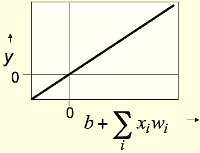

<h2 id="60d743bd92d01784da86912ef3e9d3fa"></h2>

### Binary threshold neurons 

- First compute a weighted sum of the inputs
- Then send out a fixed size spike of activity if the weighted sum exceeds a threshold. 

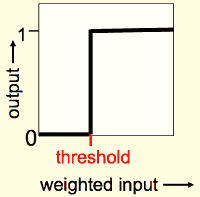

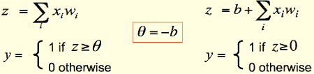

<h2 id="bea9f293a1d10dc9a09ab31410552fc2"></h2>

### Rectified Linear Neurons

- sometimes called linear threshold neurons
- compute a **linear** weighted sum of their inputs.
- The output **is a non-linear** function of the total input. 

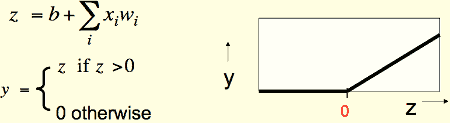

<h2 id="5dfb3a910337bd052071a460b50f17d7"></h2>

### Sigmoid neurons 

- give a real-valued output that is a smooth and bounded function of their total input. 
    - Typically they use the logistic function 
    - They have nice derivatives which make learning easy (see lecture 3). 

![][1]

<h2 id="9fa3726b2244619bd1b4f0a6f3c0ad10"></h2>

### Stochastic binary neurons 

- These use the same equations as logistic units. 
    - But they treat the output of the logistic as the **probability** of producing a spike in a short time window.  
    

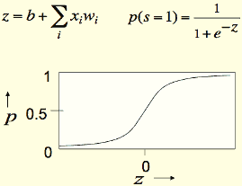

---

<h2 id="2cd2c77c9f81b7be54284357f2c55290"></h2>

# Lecture 2

<h2 id="b553e95fb37e615918e131140aec36b1"></h2>

## Types of neural network architectures

<h2 id="27403055d079f8f5057e91999fe9ff29"></h2>

### Feed-forward neural networks

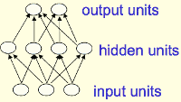

- These are the commonest type of neural network in practical applications. 
    - The first layer is the input and the last layer is the output. 
    - If there is more than one hidden layer, we call them “deep” neural networks. 
- They compute a series of transformations that change the similarities between cases
    - so at each layer, you get a new representation of the input , in which 
        - things that were similar in the previous layer may have become less similar
        - or things that were dissimilar in the previous layer may have become more similar
    - So in speech recognition, for example, we'd like the same thing said by different speaker to become more similar , and different things said by the same speaker to be less similar as we go up through the layers of the network
    - In order to achieve this, The activities of the neurons in each layer are a **non-linear** function of the activities in the layer below

<h2 id="3aa835dbc7f8ec8429d7671acae6aab5"></h2>

### Recurrent Networks 

- These have directed cycles in their connection graph.
    - That means you can sometimes get back to where you started by following the arrows. 
- They can have complicated dynamics and this can make them very difficult to train. 
    - There is a lot of interest at present in finding efficient ways of training recurrent nets. 
- They are more biologically realistic. 

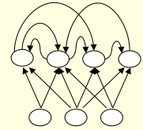

- Recurrent nets with multiple hidden layers are just a special case that has some of the hidden -> hidden connections missing. 

<h2 id="ab481de40578ba1e54e09346c919fe23"></h2>

#### Recurrent neural networks for modeling sequences

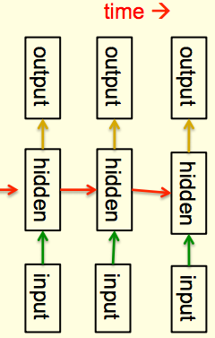

- Recurrent neural networks are a very natural way to model sequential data: 
    - They are equivalent to very deep nets(feed-forward)  with one hidden layer per time slice.
        - so at each time step , the states of the hidden units determines the states of the hidden units the next time step
    - Except that they use the same weights at every time slice and they get input at every time slice. 
        - this is one way they differ from feed-forward NNet. 
        - the weight matrix depicted by each red arrow is same at each time step
- They have the ability to remember information in their hidden state for a long time. 
    - But its very hard to train them to use this potential.

<h2 id="ac843506e5b9c5acc3c517304fae2ab6"></h2>

#### An example of what recurrent neural nets can now do (to whet your interest!) 

- Ilya Sutskever (2011) trained a special type of recurrent neural net to predict the next character in a sequence. 
- After training for a long time on a string of half a billion characters from English Wikipedia, he got it to generate new text. 
    - It generates by predicting the probability distribution for the next character and then sampling a character from this distribution. 

<h2 id="bd53760cfb4568281010b21ad9f4c944"></h2>

### Symmetrically connected networks

- These are like recurrent networks, but the connections between units are symmetrical (they have the same weight in both directions)
    - John Hopfield (and others) realized that symmetric networks are much easier to analyze than recurrent networks. 
    - They are also more restricted in what they can do. because they obey an energy function. 
        - **For example, they cannot model cycles**.
- Symmetrically connected nets without hidden units are called “Hopfield nets”

---

<h2 id="b2f07d14cff56667ff8ce65beaa92ace"></h2>

## A geometrical view of perceptrons

perceptron is 二分类的线性分类模型。 输入为实例的特征向量，输出为实例的类别（取+1和-1）。

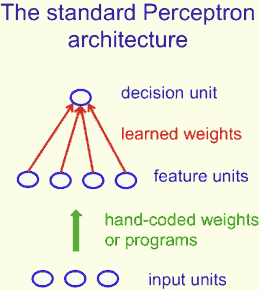

<h2 id="18fbaaed2b269781105b0c38d7d03d1f"></h2>

### Weight-space

- This space has one dimension per weight. 
- A point in the space represents a particular setting of all the weights. 
    - 坐标系各个轴代表 wᵢ
- Assuming that we have eliminated the threshold, each training case can be represented as a hyperplane through the origin. 
    - The weights must lie on one side of this hyper-plane to get the answer correct. 

--- 

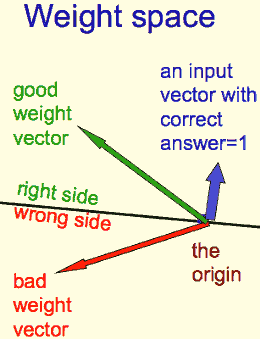

- Each training case defines a plane (shown as a black line) 
    - The plane goes through the origin and is perpendicular to the **input vector**. 
        - input vector 就是 sample，training case 超平面 由它定义
        - input also represents constraints 
            - so we can think of the inputs as partitioning the space into 2 halves ( by the hyper-plane which particular to it )
            - weights lying in one half will get the answer corrent
            - the inputs will constrain the set of weights that give the correct classification result.
    - On one side of the plane the output is **wrong** because the scalar product of the weight vector with the input vector has the wrong sign. 
        - 同侧点积为正，异侧点积为负

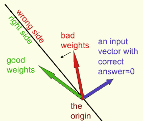

<h2 id="d70801a1a8a06ad3250060f4a42e0b7d"></h2>

### The cone of feasible solutions

- To get all training cases right we need to find a point on the right side of all the planes. 
    - There may not be any such point! 
- If there are any weight vectors that get the right answer for all cases, they lie in a hyper-cone with its apex at the origin. 
    - So the average of two good weight vectors is a good weight vector. 
        - **The problem is convex** 

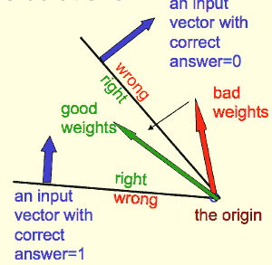

- consider two inputs that both have a label of 1. we use a yellow arrow to represent a weight vectors which correctly classify the 2 inputs.
    - 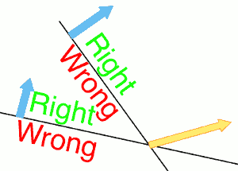

<h2 id="f6493b60fa9aa860686d995485132458"></h2>

## What perceptrons can’t do 

<h2 id="8bac84924ecd4f05b2ef5fb5415cda08"></h2>

### The limitations of Perceptrons

- If you are allowed to choose the features by hand and if you use enough features, you can do almost anything
    - For binary input vectors, we can have a separate feature unit for each of the exponentially many binary vectors and so we can make any possible discrimination on binary input vectors. (feature mapping ?)
        - This type of table look-up won’t generalize. 
- But once the hand-coded features have been determined, there are very strong limitations on what a perceptron can learn.  

<h2 id="14461318bc8dca1452e9768872689b06"></h2>

### What binary threshold neurons cannot do 

- A binary threshold output unit cannot even tell if two single bit features are the same! 
    - Positive cases (same): (1,1) -> 1; (0,0) -> 1 
    - Negative cases (different): (1,0) -> 0; (0,1) -> 0 
- The four input-output pairs give four inequalities that are impossible to satisfy: 
    - w₁+w₂ >= θ , 0 >= θ
    - w₁<θ , w₂<θ 

<h2 id="b984ea836f81bad4a3764c2908f793ec"></h2>

### Learning with hidden units 

- Networks without hidden units are very limited in the input-output mappings they can learn to model. 
    - More layers of linear units do not help. Its still linear. 
    - Fixed output non-linearities are not enough. 
- We need multiple layers of **adaptive**,  non-linear hidden units. But how can we train such nets? 
    - We need an efficient way of adapting **all** the weights, not just the last layer.  This is hard.
    - Learning the weights going into hidden units is equivalent to learning features
    - This is difficult because nobody is telling us directly what the hidden units should do. 

---

<h2 id="28b761e5205ba2e17062ee27b6958d08"></h2>

# Lecture 3 

<h2 id="3798fa7c5a40bf15ef1f83520a95cd9e"></h2>

## Learning the weights of a linear neuron 

<h2 id="62fab41508857c0c13294ed083f177f8"></h2>

### Why the perceptron learning procedure cannot be generalised to hidden layers 
    
- The perceptron convergence procedure works by ensuring that every time the weights change, they get closer to every “generously feasible” set of weights
    - This type of guarantee cannot be extended to more complex networks in which the average of two good solutions may be a bad solution
- So “multi-layer” neural networks do not use the perceptron learning procedure
    - They should never have been called multi-layer perceptrons. 

<h2 id="c61743d3bbfb887b9168af23380eed87"></h2>

### A different way to show that a learning procedure makes progress 

- Instead of showing the weights get closer to a good set of weights, show that the actual output values get closer the target values. 
    - This can be true even for non-convex problems in which there are many quite different sets of weights that work well and averaging two good sets of weights may give a bad set of weights. 
    - It is not true for perceptron learning. 
- The simplest example is a linear neuron with a squared error measure. 

<h2 id="5cd0f54138d8b7ce0d43128a5075d301"></h2>

### Linear neurons (also called linear filters) 

y = ∑ᵢ wᵢxᵢ = wᵀx 

- The neuron has a realvalued output which is a weighted sum of its inputs 
- The aim of learning is to minimize the error summed over all training cases. 
    - The error is the squared difference between the desired output and the actual output. 

<h2 id="bab151580faa1cad100a0d453e419d58"></h2>

### Why don’t we solve it analytically? 

- 为什么不用矩阵直接求近似解？
- Scientific answer: We want a method that real neurons could use. 
- Engineering answer: We want a method that can be generalized to multi-layer, non-linear neural networks
    - The analytic solution relies on it being linear and having a squared error measure. 
    - Iterative methods are usually less efficient but they are much easier to generalize. 

<h2 id="0c4bfcbad67bcd54a6ff298e0eeee743"></h2>

### A toy example to illustrate the iterative method 

每天你在自助餐厅吃午饭。你的饮食包括鱼fish，薯条chips 和番茄酱ketchup 。每样你都会视心情拿几个。收银员只会告诉你膳食的总价格.几天后，您应该可以弄清每种食物的价格。

- The iterative approach: 
    - Start with random guesses for the prices and
    - then adjust them to get a better fit to the observed prices of whole meals. 

<h2 id="0edc8f69095e8449ed09865e4e602616"></h2>

### Solving the equations iteratively

- price = xfishwfish + xchipswchips + xketchupwketchup
- We will start with guesses for the weights w=( wfish, wchips, wketchup )
    - and then adjust the guesses slightly
    - to give a better fit to the prices given by the cashier. 
- The true weights used by the cashier
    - 
- A model of the cashier with arbitrary initial weights 
    - 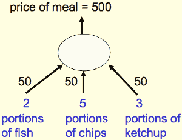
    - Residual error = 350  
    - The “delta-rule” for learning is: 
        - Δwᵢ = εxᵢ(t-y) 
    - With a learning rate ε of 1/35 , the weight changes are 
        - +20, +50, +30 
    - This gives new weights of 70, 100, 80. 
        - Notice that the weight for chips got worse! 

<h2 id="d001ac53343716fde35bea9864a2e62c"></h2>

### Deriving the delta rule 

- Define the error as the squared residuals summed over all training cases: 
    - E = 1/2·∑n∈training (tⁿ-yⁿ)²
- Now differentiate to get error derivatives for weights 
    - 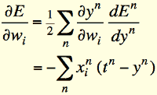
- The **batch** delta rule changes the weights in proportion to their error derivatives **summed
 over all training cases** 
    - 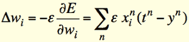
    - minus sign in front of ε cuz we want the error to go down.

<h2 id="fe011b17313c1468885c1b63d9ff3905"></h2>

### Behaviour of the iterative learning procedure 

- Does the learning procedure eventually get the right answer? 
    - There may be no perfect answer. 
    - By making the learning rate small enough we can get as close as we desire to the best answer. 
- How quickly do the weights converge to their correct values? 
    - It can be very slow if two input dimensions are highly correlated.
        - If you almost always have the **same number of** portions of ketchup and chips, it is hard to decide how to divide the price between ketchup and chips. 

     
<h2 id="6d26dffff5e7929dfcfd10f7899e5c41"></h2>

### The relationship between the online delta-rule and the learning rule for perceptrons

- In perceptron learning, we increment or decrement the weight vector by the input vector.
    - But we only change the weights when we make an error. 
- In the online version of the delta-rule we increment or decrement the weight vector by the input vector scaled by the residual error and the learning rate. 
    - So we have to choose a learning rate. This is annoying. 

---

<h2 id="d637ae0e4758d08ab9cb653d964f5cc0"></h2>

## The error surface for a linear neuron

<h2 id="d637ae0e4758d08ab9cb653d964f5cc0"></h2>

### The error surface for a linear neuron 

- The error surface lies in a space with
    - a horizontal axis for each weight
    - and one vertical axis for the error
- For a linear neuron with a squared error, it is a quadratic bowl. 
    - Vertical cross-sections are parabolas 抛物线
    - Horizontal cross-sections are ellipses
    - 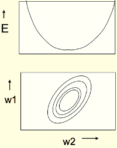
- For multi-layer, non-linear nets the error surface is much more complicated. 

<h2 id="44793cbad37c888289dde4ef85d63abb"></h2>

### Online versus batch learning 

- The simplest kind of batch learning does steepest descent on the error surface. 
    - This travels perpendicular to the contour lines. 
    - 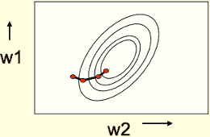
- The simplest kind of online learning zig-zags around the direction of steepest descent: 
    - This travels perpendicular to the training case line.
    - 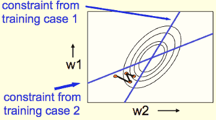

<h2 id="e160ef53e0150859367015007f2e9ffb"></h2>

### Why learning can be slow 

- If the ellipse is very elongated, the direction of steepest descent is almost perpendicular to the direction towards the minimum! 
    - The red gradient vector has a large component along the short axis of the ellipse and a small component along the long axis of the ellipse
    - This is just the opposite of what we want. 

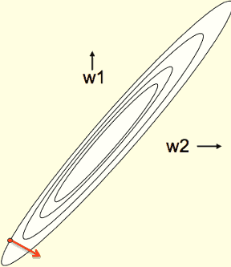

---

<h2 id="7faab456a191c1609e8fa535ba7f246b"></h2>

## Learning the weights of a logistic output neuron 

<h2 id="cb0962568720082c771cb150b419153e"></h2>

### Logistic neurons 

![][1]

They have nice derivatives which make learning easy

<h2 id="d938f3f9f233cee2aec2d95a787370d5"></h2>

### The derivatives of a logistic neuron 

- The derivatives of the logit, z, with respect to the inputs and the weights are very simple: 
    - ∂z/∂wᵢ = xᵢ
    - ∂z/∂xᵢ = wᵢ
- The derivative of the output with respect to the logit is simple if you express it in terms of the output: 
    - dy/dz = y(1-y)

<h2 id="9e566a8d635816845a8514b2be63e940"></h2>

### Using the chain rule to get the derivatives needed for learning the weights of a logistic unit

- To learn the weights we need the derivative of the output with respect to each weight: 

---

<h2 id="f134b6b0a34834048be96a9595500168"></h2>

## The backpropagation algorithm 

<h2 id="8ad8d860bc6bd1812c93eb4689ff4e27"></h2>

### Learning with hidden units (again) 

- Networks without hidden units are very limited 
- Adding a layer of hand-coded features (as in a perceptron) makes them much more powerful but the hard bit is designing the features.
    - We would like to find good features without requiring insights into the task or repeated trial and error where we guess some features and see how well they work.  
- We need to automate the loop of designing features for a particular task and seeing how well they work.

<h2 id="efb8c8024ad6e26591687c673bd2f8ae"></h2>

### Learning by perturbing weights

this idea occurs to everyone who knows about evolution

- Randomly perturb one weight and see if it improves performance. If so, save the change. 
    - This is a form of reinforcement learning. 
    - **Very inefficient**. We need to do multiple forward passes on a representative set of training cases just to change one weight. Backpropagation is much better. 
    - Towards the end of learning, large weight perturbations will nearly always make things **worst** , because the weights need to have the right relative values

<h2 id="f8a34148efcf90c3cf63a397ada225eb"></h2>

### Learning by using perturbations 

- We could randomly perturb all the weights in parallel and correlate the performance gain with the weight changes. 
    - Not any better because we need lots of trials on each training case to “ see ” the effect of changing one weight through the noise created by all the changes to other weights.
- A better idea: Randomly perturb the activities of the
 hidden units. 
    - Once we know how we want a hidden activity to change on a given training case, we can **compute** how to change the weights 
    - There are fewer activities than weights, but backpropagation still wins by a factor of the number of neurons. 

<h2 id="46dc1eb40926aa8892f0022cb7904d30"></h2>

### The idea behind backpropagation

- We don’t know what the hidden units ought to do, but we can compute how fast the error changes as we change a hidden activity.
    -  Instead of using desired activities to train the hidden units, use **error derivatives w.r.t. hidden activities**.
        - w.r.t :  with respect to
    - Each hidden activity can affect many output units and can therefore have many separate effects on the error. These effects must be combined. 
- We can compute error derivatives for all the hidden units efficiently at the same time. 
    - Once we have the error derivatives for the hidden activities, its easy to get the error derivatives for the weights going into a hidden unit.  

<h2 id="a03dcf514317e4b26494bfde1e3bb437"></h2>

### Sketch of the backpropagation algorithm on a single case 

- First convert the discrepancy between each output and its target value into an error derivative. 
- Then compute error derivatives in each hidden layer from error derivatives in the layer above. 
- Then use error derivatives w.r.t.  activities to get error derivatives w.r.t. the incoming weights. 

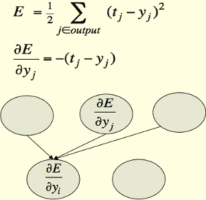

<h2 id="cb74d28f01731bcc6f43f0becb84e542"></h2>

### Backpropagating dE/dy

- Backpropagation works with derivatives. It can be used for logistic neurons.  In a binary threshold neuron the derivatives of the output function are 0 , so the error singal will not be able to propagate through it. 

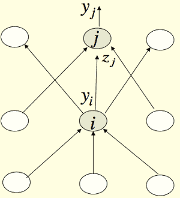

This is how you backpropagate the error derivative  with respect to the output of a unit. 

So we'll consider an output unit *j* and a hidden unit *i*. 

The output of the hidden unit i will be yᵢ , the output of the output unit j will be yⱼ. And the total input received by the output unit j will be zⱼ.

The first thing we need to do , is convert the error derivative with respect to yⱼ , into an error derivative with respect to zⱼ. 

To do that we use the chain rule.  As we've seen before, when we were looking at logistic units , it is showing as following: 

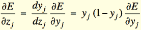

So now we've got the error derivative with respect to the total input received by unit j. 

Now we can compute the error derivative with respect to the output of unit i -- yᵢ. It's gonna be the sum over all of the 3 outgoing connection of unit i. 

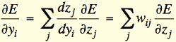

So the first term there ( dzⱼ/dyᵢ )is how the total input to unit j (zⱼ) changes as we change the output of unit i (yᵢ). And then we have to multiply that by how the error root of changes as we change the totao input to unit j , which we can compute on the line above. 

And as we saw before , when studying the logistic unit, dzⱼ/dyᵢ is just the weight on the connection wᵢⱼ. 

So what we get is the error derivative with respect to the output of unit i (yᵢ) is sum of over all the outgoing connection to the layer above , of the weight wᵢⱼ on that connection times a quantity we would have already computed which is ∂E/∂zⱼ for the layer above. 

And so you can see the computation looks very like what we do on the forward pass, but we're going in the other direction. 

What we do for each unit in that hidden layer that contains i , is we compute the sum of a quantity in the layer above times  the weights on the connections. 

Once we've got ∂E/∂zⱼ , which we computed on the first line there, is very easy to get the error derivatives for all the weights coming into unity j. 

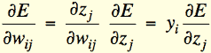

∂zⱼ/∂wᵢⱼ is simply the activity of the unit in the layer below -- yᵢ. 

So the rule for changing the weight is just you multiply, this quantity you've computed at a unit ( ∂E/∂zⱼ) , by the activity coming in from the layer below. And that gives you the error of derivative with respect to weight. 

So on this slide we have seen how we can stop with  ∂E/∂zⱼ , and back propagate to get ∂E/∂zᵢ, we'll come backwards through one layer and computed the same quantity -- the derivative of the error with respect to the output in the previous layer. So we can clearly do that for as many layers as we like. And after we've done that for all these layers, we can compute how the error changes as you change the weights on the connections.  That's the backpropagation algorithm. It's an algorithm for taking 1 training case  and computing  efficiently , for every weight in the network , how the error will change , on that particular traning case ,  as you change the weight. 

---

∂E/∂wᵢⱼ = yᵢ·∂E/∂zⱼ =  yᵢ· yⱼ(1-yⱼ)·∂E/∂yⱼ = yᵢ· yⱼ(1-yⱼ)· -(tⱼ-yⱼ) 
 
let xᵢ = yᵢ

Δw = -ε(y-t) y(1-y)xᵢ

---

<h2 id="3ffd8cc841a75b557853a7c099ef10f7"></h2>

## Using the derivatives computed by backpropagation 

There are a number of other issues that have to be addressed before we actually get a learning procedure that's fully specified. For example , we need to decide how often to update the weights , and we need to decide how to prevent the network from over fitting very badly if we use a large network. 

<h2 id="676fab2157c0b82f2d6b0e54e74e44ce"></h2>

### Converting error derivatives into a learning procedure 

- The backpropagation algorithm is an efficient way of computing the error derivative ∂E/∂w for every weight on a single training case. 
- To get a fully specified learning procedure, we still need to make a lot of other decisions about how to use these error derivatives: 
    - **Optimization issues:** How do we use the error derivatives on individual cases to discover a good set of weights?
    - **Generalization issues:** How do we ensure that the learned weights work well for cases we did not see during training? 
- We now have a very brief overview of these two sets of issues.

<h2 id="aec56cef3564b265a0fcfea53a309058"></h2>

### Optimization issues in using the weight derivatives 

- How often to update the weights
    - **Online:** after each training case.
    - **Full batch:** after a full sweep through the training data.
    - **Mini-batch:** after a small sample of training cases. 
- How much to update 
    - Use a fixed learning rate? 
    - Adapt the global learning rate? 
    - Adapt the learning rate on each connection separately? 
    - Don’t use steepest descent? 

<h2 id="7fc625e0f39ddc78085bf099ef122f6b"></h2>

### Overfitting: The downside of using powerful models

- The training data contains information about the regularities in the mapping from input to output. But it also contains two types of noise. 
    - The target values may be unreliable (usually only a minor worry). 
    - There is **sampling error**. There will be accidental regularities just because of the particular training cases that were chosen. 
- When we fit the model, it cannot tell which regularities are real and which are caused by sampling error. 
    - So it fits both kinds of regularity
    - – If the model is very flexible it can model the sampling error really well. **This is a disaster**.

<h2 id="c4219facad442ef66e3f091000bd7032"></h2>

### Ways to reduce overfitting

- A large number of different methods have been developed. 
    - Weight-decay: try and keep the weights small , eg. try and keep many of the weights at 0 to make model simpler.
    - Weight-sharing: insist many of the weights have exactly the same value as each other
    - Early stopping: 
        - you make youself a  fake test set
        - as you're traning the net, you peak at what's happening on this fake test set. 
        - once the performance on the fake test set starting getting worse, you stop training 
    - Model averaging
        - you train lots of different nerual nets. 
        - and you average them together in the hopes that that will reduce the errors you're making
    - Bayesian fitting of neural nets
        - a fancy form of model averaging
    - Dropout
        - when you try and make your model more robust by randomly emitting hidden units when you're training it. 
    - Generative pre-training 

---

<h2 id="a2d2c3adca93050c524a375b914c0427"></h2>

# Lecture 4

<h2 id="62a6949a4d62437a75df11f1298048e3"></h2>

## Learning to predict the next word

We’re gonna use the back propagation algorithm to learn a feature representation of the meaning of the word. 

I'm gonna start with a very simple case , but it illustrates the idea about how you can take some relational information, and use the back propagation algorithm to turn relational information into feature vectors that capture the meanings of words.

<h2 id="53b2af15a65032a516dec7a64698459b"></h2>

### A simple example of relational information 

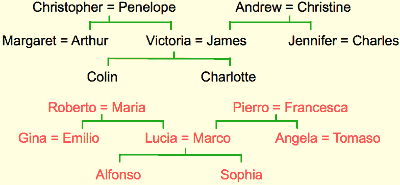

This diagram shows a simple family tree, in which, for example, Christopher and Penelope marry, and have children Arthur and Victoria. What we'd like is to train a neural network to understand the information in this family tree. We've also given it another family tree of Italian people which has pretty much the same structure as the English tree.

And perhaps when it tries to learn both sets of facts, the neural net is going to be able to take advantage of that analogy. 

<h2 id="41886b821c76c67b343a72ba9900095e"></h2>

### Another way to express the same information 

The information in these family trees can be expressed as a set of propositions.

- Make a set of propositions using the 12 relationships: 
    - son, daughter, nephew, niece, father, mother, uncle, aunt 
    - brother, sister, husband, wife 

And using those relationships we can write down a set of triples such as, 

- (colin has-father james) 
- (colin has-mother victoria) 
- (james has-wife victoria) *this follows from the two above*
- (charlotte has-brother colin) 
- (victoria has-brother arthur) 
- (charlotte has-uncle arthur) *this follows from the above*

<h2 id="7a08ad833702af5958ac40bb413ee53d"></h2>

### A relational learning task 

- Given a large set of triples that come from some family trees, figure out the regularities. 
    - The obvious way to express the regularities is as symbolic rules
    - (x has-mother y) & (y has-husband z) => (x has-father z)
- Finding the symbolic rules involves a difficult search through a very large discrete space of possibilities 
- Can a neural network capture the same knowledge by searching through a continuous space of weights? 

<h2 id="26614a4a51d034c6d965e5f02c536e68"></h2>

### The structure of the neural net

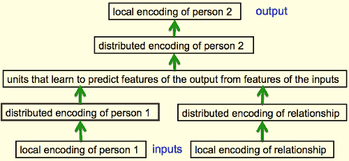

At the bottom of this diagram , we're going to put in a person and a relationship and the information is going to flow forwards through this  NNet. 

And what we are going to try to get out of the NNet after it's learned is the person who's related to the first persion. 

So what we do is we encode the information in a neutral way, because there are 24 possible ppl. 

So the block at the bottom of the diagram that says "local encoding of person 1" has 24 neurons , and exactly one of those wil be turned on for each training case. 

Similarly there are twelve relationships. And exactly one of the relationship units will be turned on. 

And then for a relationship that has a unique answer, we would like one of the 24 people at the top, one of the 24 output people to turn on to represent the answer. 

By using a representation in which exactly one of the neurons is on, we don't accidentally give the network any similarities between people. All pairs of people are equally dissimilar. So, we're not cheating by giving the network information about who's like who. 

But now in the next layer of the network, we've taken the local encoding of person one, and we've connected it to a small set of neurons, actually 6 neurons for this. And because there are 24 people, it can't possibly dedicate one neuron to each person. It has to re-represent the people as patterns of activity over those 6 neurons.  And what we're hoping is that when it learns these propositions, the way in which thing encodes a person, in that distributive panel activities, ill reveal structuring the task, or structuring the domain. 

So what we're going to do is we're going to train it up on 112 of these propositions. And we go through the 112 propositions many times. Slowly changing the weights as we go, using back propagation. 

And after training we're gonna look at the 6 units in that layer that says "distributed encoding of person 1" to see what they are doing. 

So here are those 6 units as the big gray blocks. 

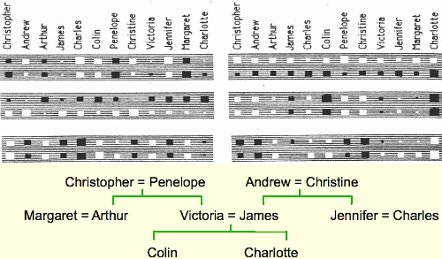

And I laid out the 24 people, with the twelve English people in a row along the top, and the twelve Italian people in a row underneath.

And the blobs tell you the incoming weights for one of the hidden units in that layer. 

If you look at the big gray rectangle on the top right, you'll see an interesting structure to the weights. The weights along the top that come from English people are all positive. And the weights along the bottom are all negative.  That means this unit tells you whether the input person is English or Italian.

If you look at the gray blob immediately below that, the second one down on the right, you'll see that it has four big positive weights at the beginning. Those correspond to Christopher and Andrew with our Italian equivalents. Then it has some smaller weights. Then it has two big negative weights, that correspond to Collin, or his Italian equivalent.  Then there's four more big positive weights, corresponding to Penelope or Christina, or their Italian equivalents. And right at the end, there's two big negative weights, corresponding to Charlotte, or her Italian equivalent. 

By now you've probably realized that, that neuron represents what generation somebody is. It has big positive weights to the oldest generation, big negative weight to the youngest generation, and intermediate weights which are roughly zero to the intermediate generation.So that's really a three-value feature, and it's telling you the generation of the person. 

Finally, if you look at the bottom gray rectangle on the left hand side, you'll see that has a different structure, and if we look at the top row and we look at the negative weights in the top row of that unit. 

It has a negative weight to Andrew, James, Charles, Christine and Jennifer and now if you look at the English family tree you'll see Andrew, James, Charles, Christine, and Jennifer are all in the right hand branch of the family tree. So that unit has learned to represent which branch of the family tree someone is in. 

<h2 id="d848f8c0a727bb1129f14297eb7336a9"></h2>

### What the network learns 

- The six hidden units in the bottleneck connected to the input representation of person 1 learn to represent features of people that are useful for predicting the answer.  
    - Nationality, generation, branch of the family tree. 
- These features are only useful if the other bottlenecks use similar representations and the central layer learns how features predict other features. For example: 
    - Input person is of generation 3 **and** 
    - relationship requires answer to be one generation up 
    - **implies**
    - Output person is of generation 2 

But notice to capture that rule, you have to extract appropriate features at the first hidden layer, and the last hidden layer of the network. And you have to make the units in the middle, relate those features correctly. 

<h2 id="cbc4e5c1cf42ea1488fb05278ed33ec9"></h2>

### Another way to see that it works 

- Train the network on all but 4 of the triples that can be made using the 12 relationships
    - So there's 112 triples, and I trained it on 108 of them and tested it on the remaining 4
    - It needs to sweep through the training set many times adjusting the weights slightly each time. 
- Then test it on the 4 held-out cases. 
    - It gets about 3/4 correct. 
    - This is good for a 24-way choice. 
    - On much bigger datasets we can train on a much smaller fraction of the data. 

<h2 id="4cc045397134d9dbdcde92f93c9354ae"></h2>

### A large-scale example 

- Suppose we have a database of millions of relational facts of the form (A R B). 
    - We could train a net to discover feature vector representations of the terms that allow the third term to be predicted from the first two.  
        - predict B
    - Then we could use the trained net to find very unlikely triples.  These are good candidates for errors in the database. 
- Instead of predicting the third term, we could use all three terms as input and predict the probability that the fact is correct. 
    - To train such a net we need a good source of false facts

<h2 id="b7aee90e84000ac779a3e4a95e2937a2"></h2>

## Another diversion: The softmax output function

Softmax is a way of forcing the outputs of a neural network to sum to one so they can represent a probability distribution across discreet mutually exclusive alternatives.

So far I talked about using a square area measure for training a neural net and for linear neurons it's a sensible thing to do. But the squared error measure has some drawbacks. 

<h2 id="95e795035feb93bf19141b3722ed22f9"></h2>

### Problems with squared error 

- The squared error measure has some drawbacks: 
    - If the desired output is 1 and the actual output is 0.00000001 there is almost no gradient for a logistic unit to fix up the error. 
    - If we are trying to assign probabilities to mutually exclusive class labels, we know that the outputs should sum to 1, but we are depriving the network of this knowledge. 
- Is there a different cost function that works better? 
    - Yes: Force the outputs to represent a probability distribution across discrete alternatives. 

<h2 id="31d953b9d49a6b4378f45097047976d0"></h2>

### Softmax

It's a kind of soft continuous version of the maximum function. 

- The output units in a softmax group use a non-local non-linearity: 
    - 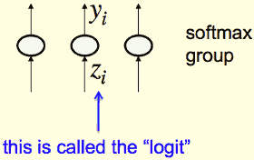

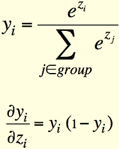

The soft max equation has a nice simple derivative. If you ask about how the Yᵢ changes as you change the Zᵢ, that obviously depends on, all the other Zs. But then the Yᵢ itself depends on all the other Zs. And it turns out, that you get a nice simple form, just like you do for the logistic unit, where the derivative of the output with respect to the input, for an individual neuron in a softmax group, is just yᵢ\*(1-yᵢ). 

It's not totally trivial to derive that. If you tried differentiating the equation above, you must remember that things turn up in that normalization term on the bottom row. It's very easy to forget those terms and get the wrong answer. 

Now the question is, if we're using a soft max group for the outputs, what's the right cost function? 

<h2 id="21c7e1b0bcad7862fc5842c0b521f165"></h2>

### Cross-entropy: the right cost function to use with softmax

- The right cost function is the negative log probability of the right answer
    - 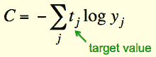
- C has a very big gradient when the target value is 1 and the output is almost zero.
    - 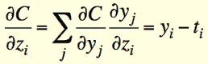
    - A value of 0.000001 is much better than 0.000000001 
    - The steepness of dC/dy exactly balances the flatness of dy/dz

---

<h2 id="59e724021bfe3a5ca52ee3487d72b4ce"></h2>

## Neuro-probabilistic language models

We're going to look at a practical use for feature vectors that represent words

<h2 id="9171415699026cffb7ff3cab04228939"></h2>

### A basic problem in speech recognition 

- We cannot identify phonemes perfectly in noisy speech 
    - The acoustic input is often ambiguous: there are several different words that fit the acoustic signal equally well. 
- People use their understanding of the meaning of the utterance to hear the right words. 
    - We do this unconsciously when we wreck a nice beach. 
    - We are very good at it. 
- This means speech recognizers have to know which words are likely to come next and which are not. 
    - Fortunately, words can be predicted quite well without full understanding. 

<h2 id="83beda8ed15519912a2b29bd570d59c0"></h2>

### The standard “trigram” method 
    
- Take a huge amount of text and count the frequencies of all triples of words. 
- Use these frequencies to make bets on the relative probabilities of words given the previous two words:
    - 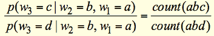
- Until very recently this was the state-of-the-art. 
    - We cannot use a much bigger context because there are too many possibilities to store and the counts would mostly be zero. 
    - We have to “back-off” to digrams when the count for a trigram is too small. 
        - The probability is not zero just because the count is zero! 

<h2 id="fa2663ecc2a6e9d62b864d527ac1486a"></h2>

### Information that the trigram model fails to use 

- Suppose we have seen the sentence 
    - “the cat got squashed in the garden on friday”
- This should help us predict words in the sentence
    - “the dog got flattened in the yard on monday”
- A trigram model does not understand the similarities between 
    - cat/dog squashed/flattened garden/yard friday/monday
- To overcome this limitation, we need to use the semantic and syntactic features of previous words to predict the features of the next word. 
    - Using a feature representation also allows a context that contains many more previous words (e.g. 10). 

<h2 id="bff96611be9933e8a194bdd5f3a8ee93"></h2>

### Bengio’s neural net for predicting the next word 

It is actually very similar to the family trees network. 

So at the bottom you can think of us as putting in the index of a word, and you could think of that as a set of neurons of which just one is on. 

And then the weight from that on neuron will determine the pattern of activity in the next hidden layer. And so the weights from the active neuron in the bottom layer will give you the pattern of activity in the layer that has the distributed representation of the word. 

That is it's feature vector. But this is just equivalent to saying you do table look-up.You have a stored feature vector reach word, and with learning, you modify that feature vector. Which is exactly equivalent to modifying the weights coming from a single active-input unit. 

After getting distributed representations of a few previous words, I've only shown two here but you would typically use, say, five. You can then, use those distributed representations, via hidden layer, to predict, via huge softmax, what the probabilities are for all the various words that might come next. 

When extra refinement that makes it work better is to use skip-layer connections that go straight from the input words to the output words. Because the individual input words are, are individually quite informative about what the output word might be.

<h2 id="e84e1c2eab6228e880e086f8ea982e9c"></h2>

### A problem with having 100,000 output words

One problem with having a big softmax output layer, is that you might have to deal with 100,000 different output works. Because typically in these language models, the plural of a word is a different word from the singular.  And the various different tenses of a verb are different words from other tenses. So each unit in the last hidden layer of the net, might have to have a hundred-thousand outgoing weights.

- Each unit in the last hidden layer has 100,000 outgoing weights. 
    - So we cannot afford to have many hidden units. 
        - Unless we have a huge number of training cases
    - We could make the last hidden layer small, but then its hard to get the 100,000 probabilities right.
        - The small probabilities are often relevant. 
- Is there a better way to deal with such a large number of outputs? 

---

<h2 id="c93c855033bdc0b648b96f7ec6b4fafb"></h2>

## Ways to deal with the large number of possible outputs

we're going to look at various ways to avoid having to use 100,000 different output units in the softmax if we want to get probability from 100,000 different words.

So one way to avoid, having a 100,000 different output units is to use a serial architecture. 

<h2 id="8e457024f2de01030ed63d42a274f257"></h2>

### A serial architecture 

---

 [1]: ../imgs/NNet_sigmoid_neurons.png

