...menustart

- [Operating Systems](#aab338915e32b60e92c8de3a23aa5c5d)
- [Lecture 2: Histroy](#0256cfb29115315df7b78ed8ea4bb934)
    - [Virtual Machine Abstraction](#58716e48659df59b681167f89ef9c4b0)
    - [Protecting Processes from Each Other](#331dfccf115bc05798fa93bcdce2dc74)
    - [Address Translation](#380ed2e00b4cd7595c6b22a289c2fb9c)
        - [Example of Address Translation](#fd16525056da1f4095c4cf0be4110c65)
    - [The other half of protection: Dual Mode Operation](#36df3bc20eac02b4897f57dcdab35103)
    - [UNIX System Structure](#9d76355b6f43127dc97ca42e9d29c893)
    - [a quick tour of OS Structures](#7738ca5b3efbf6c0e6bcebe55d9a4428)
        - [Operating Systems Components (What are the pieces of the OS)](#9c5677a822e4354ba4a478ac864ad78b)
        - [Operating System Services (What things does the OS do?)](#2b5860ab171d58029c23f7d7edd38436)
        - [System Calls (What is the API)](#0c927d7416fb5c027d2bbf7105cc5b12)
        - [Operating Systems Structure (What is the organizational Principle?)](#931d8ddb9c90055a717f507edf694b57)
- [Lecture3 : Concurrency: Processes and Threads](#fb8c0d273917625f92c875243e4a2497)
    - [Concurrency](#3e48afddb0c5521684b8d2687b0869d6)
    - [The Basic Problem of Concurrency](#1e79f26f9654bb8d72398bb5c30144a2)
    - [How can we give the illusion of multiple processors?](#033fa663302a4ef18ab84e5b9af656ee)
    - [Properties of this simple multiprogramming technique](#cff2ef352548c0e25914f4d9c36604f5)
    - [Modern Technique: SMT/Hyperthreading](#1e0a2e02c40633be2aea2e6359e15fc9)
    - [How to protect threads from one another?](#ed5b8b8ad56ce8ffbec1c9cdc69e63e8)
    - [Recall: Program’s Address Space](#68b88a3e849b7984dabc7d5067c41ac6)
    - [Traditional UNIX Process](#33c3a77337646a23a39a78d05dbba257)
    - [How do we multiplex processes?](#3b275413bdec5abbb590a02846455aa2)
    - [CPU Switch From Process to Process](#533647e51f52c2f453104c716ea7f16c)
    - [Diagram of Process State](#766af2d268f2980b8f9da323e38d8d99)
    - [Process Scheduling](#26aa9adeb372bec1483847a510bc0c1f)
    - [What does it take to create a process?](#06d2773d0e98a13f626e61c8f02fed7b)
    - [Process =? Program](#d23c2c45437a7a02dd6ac512a50aed61)
    - [Multiple Processes Collaborate on a Task](#a89baf66badbd0d10a0386e0e2c268ef)
        - [Shared Memory Communication](#eafc28015dfc7e15274ce676910f83bb)
        - [Inter-process Communication (IPC)](#26708f8bafc80deea5109312beef3a55)
    - [Modern “Lightweight” Process with Threads](#c8acda2a62eb8f84ee2ac849ca190688)
        - [Single and Multithreaded Processes](#d2a7607c8438e7c909aa626bf36b88b5)
        - [Examples of multithreaded programs](#1d3a9c8598f8f7e04a2ab97b813a16fc)
    - [Thread State](#a1147205dad273a01357ee03a0ba625a)
        - [Execution Stack Example](#bb392bbd04a404cae3ddf84271fea20e)
    - [Summary](#290612199861c31d1036b185b4e69b75)
- [Lecture 4: Thread Dispatching](#457166539d2868e71cf47f89e1866a96)
    - [MIPS: Software conventions for Registers](#f05c1465a1018a7ad2c550d165769c67)
    - [Single-Threaded Example](#8a12b0f492c9809b6b63f829eb80ca3a)
    - [Use of Threads](#9f6481747b526e48cbc3c3235f2a1721)
    - [Memory Footprint of Two-Thread Example](#96e1c1ddfad24070e74100314ca1fee6)
    - [Per Thread State](#8168b86f8351d4b3c96d05d294392e85)
    - [Lifecycle of a Thread (or Process)](#36327051d52814b03a2ef7b83183f3f9)
    - [Ready Queue And Various I/O Device Queues](#29bab3cf6a6d53393f8f549b2335f121)
    - [Dispatch Loop](#c289df5648beb35beaf1f17ca87ee93a)
    - [Running a thread](#72e542fbe4c7df30c850a9d83b37186c)
        - [Internal Events](#67c2ae43ca95bbb942c50877d4699be0)
    - [Stack for Yielding Thread](#9301ba00a710f2f0c3d0e987b55894d4)
    - [What do the stacks look like?](#0ccbdade8f62d5a109297de93bcfdf91)
    - [Saving/Restoring state (often called “Context Switch)](#5c74b6578d4a2a69bfe3efd742f8abfd)
    - [Switch Details](#a65d9d0db4d0e56258f8a9790865b242)
    - [What happens when thread blocks on I/O?](#10ce6000fcb49adf0650c21f0781928b)
    - [External Events](#2cfda7f7062e0275e0247c3d069998d1)
        - [Example: Network Interrupt](#ac3e78e7384b0cd735da6f27aed285ed)
    - [Use of Timer Interrupt to Return Control](#b5a9674b6b2a701a6281fc2cfa5e01c0)
    - [Choosing a Thread to Run](#76509dab7986ec644502722976e77b9b)
    - [Summary](#290612199861c31d1036b185b4e69b75)
- [Lecture 5 : Cooperating Threads](#ddab5200bd0e32c18f6873e50ef64a6c)
    - [Interrupt Controller](#9169db7925a4b838c995af1390fb85e0)
        - [Example: Network Interrupt](#ac3e78e7384b0cd735da6f27aed285ed)
    - [Review:  Timer Interrupt](#758d109b4d744f94947421576f9f6d07)
    - [ThreadFork(): Create a New Thread](#483ab3314892a7155e32e35ddd1b451d)
        - [How do we initialize TCB and Stack?](#1fa694bd693c3f651cbd9b3bcda0caf2)
    - [How does Thread get started?](#05c2c327c3eedac316533b39c66226be)
        - [What does ThreadRoot() look like?](#55e254b64fdd3360649fd5a61753aa42)
    - [What does ThreadFinish() do?](#7a52c0dd4d422a92b6b716b62425d940)
    - [Additional Detail](#c6439ecf3dfbc55f09ca225af8da3310)
    - [Parent-Child relationship](#c79ae88038e30470ef90ea5320eb4b7a)
    - [ThreadJoin() system call](#b5a1e99d1ec2bc3322bf39aa42393596)
    - [Use of Join for Traditional Procedure Call](#cc1a47fb651850a86462158fab0d7c1d)
    - [Kernel versus User-Mode threads](#29661fa8b809ab28a5b51934e38b1001)
    - [Threading models mentioned by book](#dc111ca82bd76ac49f508cd56898996b)
    - [Multiprocessing vs Multiprogramming](#d85995eb95fa627c554daf95622b6c00)
    - [Correctness for systems with concurrent threads](#75d83e281c09829d3d975c15d6dff110)
    - [Interactions Complicate Debugging](#d40b5e12a4bd27bfb433bab8e179726f)
    - [Summary](#290612199861c31d1036b185b4e69b75)

...menuend


<h2 id="aab338915e32b60e92c8de3a23aa5c5d"></h2>


# Operating Systems

https://cs162.eecs.berkeley.edu/

https://people.eecs.berkeley.edu/~kubitron/cs162/

<h2 id="0256cfb29115315df7b78ed8ea4bb934"></h2>


# Lecture 2: Histroy 

<h2 id="58716e48659df59b681167f89ef9c4b0"></h2>


## Virtual Machine Abstraction


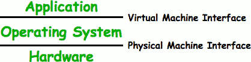

 - Software Engineering Problem:
    - Turn hardware/software quirks => what programmers want/need
    - Optimize for convenience, utilization, security, reliability, etc…
 - For Any OS area (e.g. file systems, virtual memory, networking, scheduling):
    - What’s the hardware interface? (physical reality)
    - What’s the application interface? (nicer abstraction)

<h2 id="331dfccf115bc05798fa93bcdce2dc74"></h2>


## Protecting Processes from Each Other

 - Problem: Run multiple applications in such a way that they are protected from one another
 - Goal:
    - Keep User Programs from Crashing OS
    - Keep User Programs from Crashing each other
    - [Keep Parts of OS from crashing other parts?]
 - (Some of the required) Mechanisms:
    - Address Translation
    - Dual Mode Operation
 - Simple Policy:
    - Programs are not allowed to read/write memory of other Programs or of Operating System 


<h2 id="380ed2e00b4cd7595c6b22a289c2fb9c"></h2>


## Address Translation

 - Address Space
    - A group of memory addresses usable by something 
    - Each program (process) and kernel has potentially different address spaces.
 - Address Translation:
    - Translate from Virtual Addresses (emitted by CPU) into Physical Addresses (of memory)
    - Mapping often performed in Hardware by Memory Management Unit (MMU)
    - 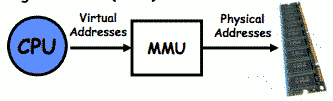


<h2 id="fd16525056da1f4095c4cf0be4110c65"></h2>


### Example of Address Translation

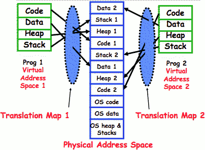

here program 1 has its address space. In the code segment here those addresses which might be from 0 to some point 3F433F whatever, get translated to this part of the DRAM. 

The set of addresses that are translated to in the physical space don't overlap. 

There is a simple problem here:  that mapping need s to somehow be out of the realm of changable by the process.  


<h2 id="36df3bc20eac02b4897f57dcdab35103"></h2>


## The other half of protection: Dual Mode Operation

 - **Hardware** provides at least two modes:
    - “Kernel” mode (or “supervisor” or “protected”)
    - “User” mode: Normal programs executed 
 - Some instructions/ops prohibited in user mode:
    - Example: cannot modify page tables in user mod
        - Attempt to modify => Exception generated
 - Transitions from user mode to kernel mode:
    - System Calls, Interrupts, Other exceptions

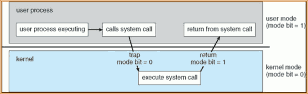

<h2 id="9d76355b6f43127dc97ca42e9d29c893"></h2>


## UNIX System Structure

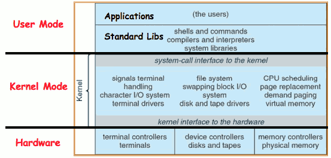

<h2 id="7738ca5b3efbf6c0e6bcebe55d9a4428"></h2>


## a quick tour of OS Structures

<h2 id="9c5677a822e4354ba4a478ac864ad78b"></h2>


### Operating Systems Components (What are the pieces of the OS)

 - Process Management
 - Main-Memory Management
 - I/O System management
 - File Management
 - Networking
 - User Interfaces


<h2 id="2b5860ab171d58029c23f7d7edd38436"></h2>


### Operating System Services (What things does the OS do?)

 - Services that (more-or-less) map onto components
    - Program execution
        - How do you execute concurrent sequences of instructions?
    - I/O operations
        - Standardized interfaces to extremely diverse devices
    - File system manipulation
        - How do you read/write/preserve files?
        - Looming concern: How do you even find files???
    - Communications
        - Networking protocols/Interface with CyberSpace?
 - Cross-cutting capabilities
    - Error detection & recovery
    - Resource allocation
    - Accounting
    - Protection

<h2 id="0c927d7416fb5c027d2bbf7105cc5b12"></h2>


### System Calls (What is the API)

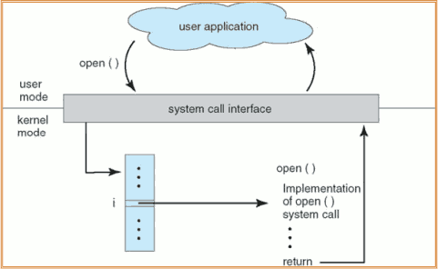

<h2 id="931d8ddb9c90055a717f507edf694b57"></h2>


### Operating Systems Structure (What is the organizational Principle?)

 - Simple
    - Only one or two levels of code
 - Layered
    - Lower levels independent of upper levels
 - Microkernel
    - OS built from many user-level processes
 - Modular
    - Core kernel with Dynamically loadable modules


---

<h2 id="fb8c0d273917625f92c875243e4a2497"></h2>


# Lecture3 : Concurrency: Processes and Threads

<h2 id="3e48afddb0c5521684b8d2687b0869d6"></h2>


## Concurrency

 - “Thread” of execution
    - Independent Fetch/Decode/Execute loop
    - Operating in some Address space
 - Uniprogramming: one thread at a time
    - **MS/DOS, early Macintosh, Batch processing**
    - Easier for operating system builder
    - Get rid concurrency by defining it away
    - Does this make sense for personal computers?
 - Multiprogramming: more than one thread at a time
    - **Multics, UNIX/Linux, OS/2, Windows NT/2000/XP, Mac OS X** 
    - Often called “multitasking”, but multitasking has other meanings (talk about this later)

<h2 id="1e79f26f9654bb8d72398bb5c30144a2"></h2>


## The Basic Problem of Concurrency

 - The basic problem of concurrency involves resources:
    - Hardware: single CPU, single DRAM, single I/O devices
    - Multiprogramming API: users think they have exclusive access to shared resources
 - OS Has to coordinate all activity
    - Multiple users, I/O interrupts, …
    - How can it keep all these things straight?
 - Basic Idea: Use Virtual Machine abstraction
    - Decompose hard problem into simpler ones
    - Abstract the notion of an executing program
    - Then, worry about multiplexing these abstract machines
 - Dijkstra did this for the “THE system”
    - Few thousand lines vs 1 million lines in OS 360 (1K bugs)

<h2 id="033fa663302a4ef18ab84e5b9af656ee"></h2>


## How can we give the illusion of multiple processors?

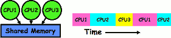

 - Assume a single processor. How do we provide the illusion of multiple processors?
    - Multiplex in time!
 - Each virtual “CPU” needs a structure to hold:
    - Program Counter (PC), Stack Pointer (SP)
    - Registers (Integer, Floating point, others…?)
 - How switch from one CPU to the next?
    - Save PC, SP, and registers in current state block
    - Load PC, SP, and registers from new state block
 - What triggers switch?
    - Timer, voluntary yield, I/O, other things

<h2 id="cff2ef352548c0e25914f4d9c36604f5"></h2>


## Properties of this simple multiprogramming technique
 
 - All virtual CPUs share same non-CPU resources
    - I/O devices the same
    - Memory the same
 - Consequence of sharing:
    - Each thread can access the data of every other thread (good for sharing, bad for protection)
    - Threads can share instructions (good for sharing, bad for protection)
    - Can threads overwrite OS functions? 
 - This (unprotected) model common in:
    - Embedded applications
    - Windows 3.1/Machintosh (switch only with yield)
    - Windows 95—ME? (switch with both yield and timer)

<h2 id="1e0a2e02c40633be2aea2e6359e15fc9"></h2>


## Modern Technique: SMT/Hyperthreading


 - Hardware technique 
    - Exploit natural properties of superscalar processors to provide illusion of multiple processors
    - Higher utilization of processor resources 
 - Can schedule each thread as if were separate CPU
    - However, not linear speedup!
    - If have multiprocessor, should schedule each processor first
 - Original technique called “Simultaneous Multithreading”
    - Alpha, SPARC, Pentium 4 (“Hyperthreading”), Power 5


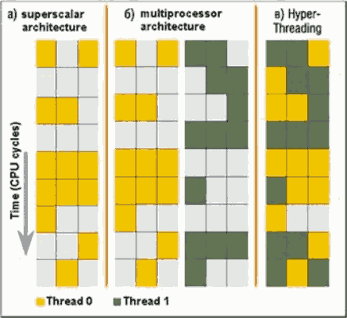

 - modern processors all execute more than one thing at a time
    - more than 1 instruction on a cycle
 - what the picture is showing you here is 
    - time is going down
    - each slot(row?) represents a cycle ,each column represents a functional unit 
        - so there are 3 functional units 
    - the 1st cycle 
        - a) functional unit 1 and 3  are busy (colored), function unit 2 is not busy
        - b) you might put two of these together , and each of them has idle slots.
        - c) you put two threads togethter into the same pipline and they share the slots as a result you end up filling up more the empty slots.  
            - this means that the hardware itself has got 2 sets of registers , 2 Program Counters, 2 branch predictores , and 2 of a few other things ...

<h2 id="ed5b8b8ad56ce8ffbec1c9cdc69e63e8"></h2>


## How to protect threads from one another?

Need three important things:

 1. Protection of memory
    - Every task does not have access to all memory
 2. Protection of I/O devices
    - Every task does not have access to every device
 3. Protection of Access to Processor: Preemptive switching from task to task 
    - Use of timer
    - Must not be possible to disable timer from usercode


<h2 id="68b88a3e849b7984dabc7d5067c41ac6"></h2>


## Recall: Program’s Address Space

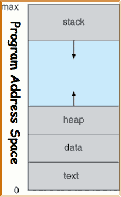

 - here's a zero up to whatever the max address 
    - we have the text area which is where the instructions are
    - we have data which is static data that's allocated at the beginning of the program
    - heap : dynamically allocated memory 
    - stack: local variables 
 - Address space => the set of accessible addresses + state associated with them: 
    - For a 32-bit processor there are 2³² = 4 billion addresses
 - What happens when you read or write to an address?  
    - Perhaps Nothing
        - you write data in the middle of an empty space , usually it will cause an segmentation fault because it is not real memory. 
    - Perhaps acts like regular memory
    - Perhaps ignores writes
        - you write data in the section called read-only , eg. the text segment , or they cause another segmentation fault.
    - Perhaps causes I/O operation
        - (Memory-mapped I/O)
    - Perhaps causes exception (fault)


<h2 id="33c3a77337646a23a39a78d05dbba257"></h2>


## Traditional UNIX Process

 - **Process: Operating system abstraction to represent what is needed to run a single program**
    - Often called a “HeavyWeight Process”
    - Formally: a single, sequential stream of execution in its own address space
 - Two parts:
    - Sequential Program Execution Stream
        - Code executed as a single, sequential stream of execution
        - Includes State of CPU registers
    - Protected Resources:
        - Main Memory State (contents of Address Space)
        - I/O state (i.e. file descriptors)
 - **Important: There is no concurrency in a heavyweight process**
    - which means there's only one thread

<h2 id="3b275413bdec5abbb590a02846455aa2"></h2>


## How do we multiplex processes?

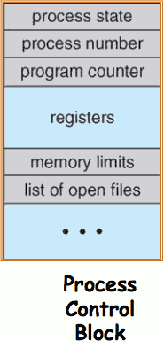

 - The current state of process held in a process control block (PCB):
    - This is a “snapshot” of the execution and protection environment
    - Only one PCB active at a time
    - not quite multi-core world yet, we only have one process can be running at a time in this mode because we only have 1 cpu.
 - Give out CPU time to different processes (**Scheduling**):
    - Only one process “running” at a time
    - Give more time to important processes
 - Give pieces of resources to different processes (**Protection**):
    - Controlled access to non-CPU resources
    - Sample mechanisms: 
        - Memory Mapping: Give each process their own address space
        - Kernel/User duality: Arbitrary multiplexing of I/O through system calls


<h2 id="533647e51f52c2f453104c716ea7f16c"></h2>


## CPU Switch From Process to Process

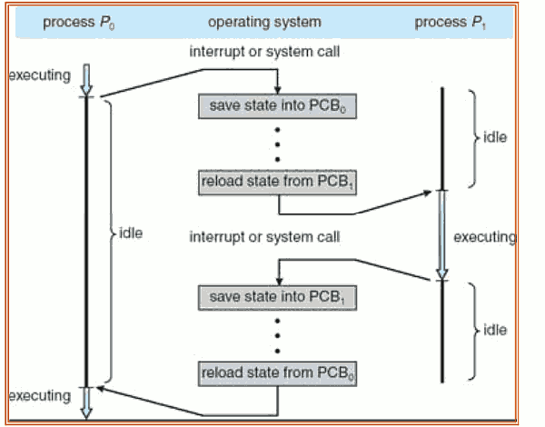

 - This is also called a “context switch”
 - executing instractuions of p₀,p₁  do not overlap because only 1 cpu
 - Code executed in kernel above is overhead
    - no process is making useful progress while OS is saving / reloading PCB, etc...
    - Overhead sets minimum practical switching time
    - Less overhead with SMT/hyperthreading, but… contention for resources instead
        - you could actually have 2 processes loaded at the same time ,and that overhead switching in the hardware , and there is no overhead they're pretty much because the hardware is doing it for you. 

<h2 id="766af2d268f2980b8f9da323e38d8d99"></h2>


## Diagram of Process State

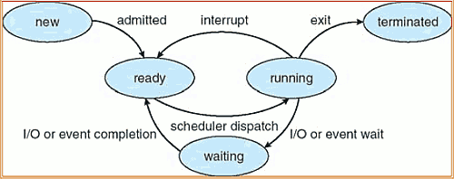

 - As a process executes, it changes state
    - new: The process is being created
    - The process is waiting to run
    - Instructions are being executed 
    - Process waiting for some event to occur
    - The process has finished execution


<h2 id="26aa9adeb372bec1483847a510bc0c1f"></h2>


## Process Scheduling

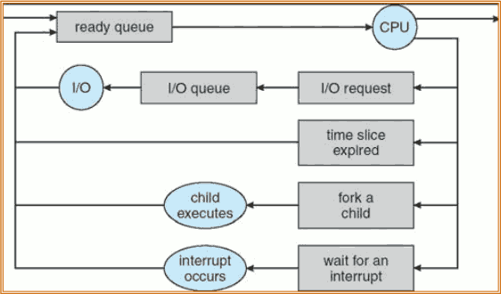

 - PCBs move from queue to queue as they change state
    - Decisions about which order to remove from queues are **Scheduling** decisions
    - Many algorithms possible (few weeks from now)

<h2 id="06d2773d0e98a13f626e61c8f02fed7b"></h2>


## What does it take to create a process?

 - Must construct new PCB 
    - Inexpensive
 - Must set up new page tables for address space
    - More expensive
 - Copy data from parent process? (Unix fork() )
    - Semantics of Unix fork() are that the child process gets a complete copy of the parent memory and I/O state
    - Originally **very expensive**
    - Much less expensive with “copy on write”
 - Copy I/O state (file handles, etc)
    - Medium expense

<h2 id="d23c2c45437a7a02dd6ac512a50aed61"></h2>


## Process =? Program 

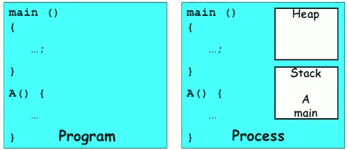

 - More to a process than just a program:
    - Program is just part of the process state
    - I run emacs on lectures.txt, you run it on homework.java – Same program, different processes
 - Less to a process than a program:
    - A program can invoke more than one process
    - cc starts up cpp, cc1, cc2, as, and ld

<h2 id="a89baf66badbd0d10a0386e0e2c268ef"></h2>


## Multiple Processes Collaborate on a Task

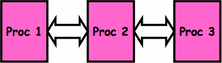

 - this is kind of the beginnings of parallelism 
    - there are 3 processes they want to collaborate together , they got to talk to each other.
 - High Creation/memory Overhead
 - (Relatively) High Context-Switch Overhead
 - Need Communication mechanism:
    - Separate Address Spaces Isolates Processes
        - it's not like you can write in the memory of one process and read it in the memory of the other 
    - Shared-Memory Mapping ( one way to talk to each other )
        - Accomplished by mapping addresses to common DRAM
        - Read and Write through memory
    - Message Passing ( another one )
        - send() and receive() messages
        - Works across network

<h2 id="eafc28015dfc7e15274ce676910f83bb"></h2>


### Shared Memory Communication

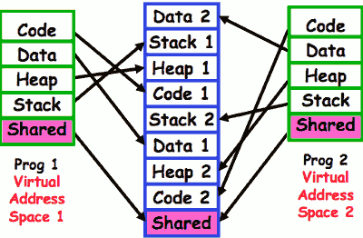

 - Communication occurs by “simply” reading/writing to shared address page
    - Really low overhead communication
    - Introduces complex synchronization problems 

<h2 id="26708f8bafc80deea5109312beef3a55"></h2>


### Inter-process Communication (IPC)

 - Mechanism for processes to communicate and to synchronize their actions
 - Message system – processes communicate with each other without resorting to shared variables
 - IPC facility provides two operations:
    - send(message) – message size fixed or variable 
    - receive(message)
 - If P and Q wish to communicate, they need to:
    - establish a communication link between them
    - exchange messages via send/receive
 - Implementation of communication link
    - physical (e.g., shared memory, hardware bus, systcall/trap)
    - logical (e.g., logical properties)


<h2 id="c8acda2a62eb8f84ee2ac849ca190688"></h2>


## Modern “Lightweight” Process with Threads

A modern process has more than one thread. The idea is the process still has one address space , but it has multiple threads in it. 
 
 - Thread: a sequential execution stream within process (Sometimes called a “Lightweight process”)
    - Process still contains a single Address Space
    - No protection between threads
    - threads in the same process all share the same memory
 - Multithreading: a single program made up of a number of different concurrent activities 
    - Sometimes called multitasking, as in Ada…
 - Why separate the concept of a thread from that of a process?
    - Discuss the “thread” part of a process (concurrency)
    - Separate from the “address space” (Protection)
    - Heavyweight Process  ==  Process with one thread 

<h2 id="d2a7607c8438e7c909aa626bf36b88b5"></h2>


### Single and Multithreaded Processes

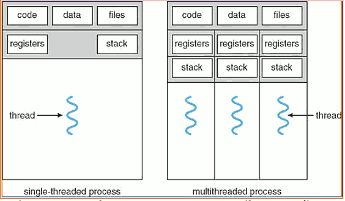

 - each thread has its own registers and stack. 
 - Threads encapsulate concurrency: “Active” component
 - Address spaces encapsulate protection: “Passive” part
    - Keeps buggy program from trashing the system
 - Why have multiple threads per address space?
    
<h2 id="1d3a9c8598f8f7e04a2ab97b813a16fc"></h2>


### Examples of multithreaded programs

 - Embedded systems 
    - Elevators, Planes, Medical systems, Wristwatches
    - Single Program, concurrent operations
 - Most modern OS kernels
    - Internally concurrent because have to deal with concurrent requests by multiple users
    - But no protection needed within kernel
 - Database Servers
    - Access to shared data by many concurrent users
    - Also background utility processing must be done
 - Network Servers
    - Concurrent requests from network
    - Again, single program, multiple concurrent operations
    - File server, Web server, and airline reservation systems
 - Parallel Programming (More than one physical CPU)
    - Split program into multiple threads for parallelism
    - This is called Multiprocessing
 - Some multiprocessors are actually uniprogrammed:
    - Multiple threads in one address space but one program at a time


<h2 id="a1147205dad273a01357ee03a0ba625a"></h2>


## Thread State

 - State shared by all threads in process/addr space
    - Contents of memory (global variables, heap)
    - I/O state (file system, network connections, etc)
 - State “private” to each thread
    - Kept in TCB -- Thread Control Block
    - CPU registers (including, program counter)
    - Execution stack – what is this?
 - Execution Stack
    - Parameters, Temporary variables
    - return PCs are kept while called procedures are executing

<h2 id="bb392bbd04a404cae3ddf84271fea20e"></h2>


### Execution Stack Example

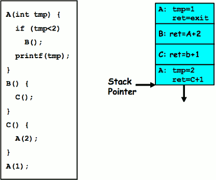

 - Stack holds temporary results
 - Permits recursive execution
 - Crucial to modern languages

<h2 id="290612199861c31d1036b185b4e69b75"></h2>


## Summary

 - Processes have two parts
    - Threads (Concurrency)
    - Address Spaces (Protection)
 - Concurrency accomplished by multiplexing CPU Time:
    - Unloading current thread (PC, registers)
    - Loading new thread (PC, registers)
    - Such context switching may be voluntary (yield(), I/O operations) or involuntary (timer, other interrupts)
 - Protection accomplished restricting access:
    - Memory mapping isolates processes from each other
    - Dual-mode for isolating I/O, other resources
 - Book talks about processes 
    - When this concerns concurrency, really talking about thread portion of a process
    - When this concerns protection, talking about address space portion of a process

<h2 id="457166539d2868e71cf47f89e1866a96"></h2>


# Lecture 4: Thread Dispatching 

<h2 id="f05c1465a1018a7ad2c550d165769c67"></h2>


## MIPS: Software conventions for Registers

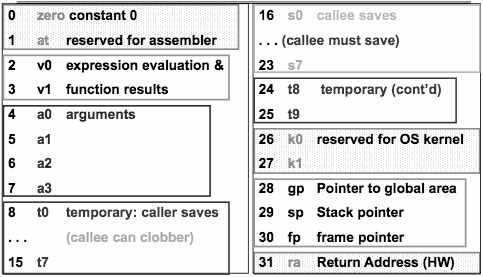

 - 0 register is always 0
    - if you write to it nothing happen , if you read to it you always get 0
 - 4-7  used for argument passing
 - 8-15  caller saves
 - 16-23 callee saves 
 - 24,25 another couple of temporaries which are actually caller saves
 - 26,27 reserved for kernel
 - 28-30

---


 - Before calling procedure:
    - Save caller-saves regs
    - Save v0, v1
    - Save ra
 - After return, assume
    - Callee-saves reg OK
    - gp,sp,fp OK (restored!)
    - Other things trashed
 

<h2 id="8a12b0f492c9809b6b63f829eb80ca3a"></h2>


## Single-Threaded Example

 - Imagine the following C program:

```c
main() {
    ComputePI(“pi.txt”);
    PrintClassList(“clist.text”);
}
```
 
 - What is the behavior here?
    - Program would never print out class list  
    - because ComputePI would never finish

<h2 id="9f6481747b526e48cbc3c3235f2a1721"></h2>


## Use of Threads

 - Version of program with Threads:

```c
main() {
    CreateThread(ComputePI(“pi.txt”));
    CreateThread(PrintClassList(“clist.text”));
}
```

 - What does “CreateThread” do?
    - Start independent thread running given procedure
 - What is the behavior here?
    - Now, you would actually see the class list
    - This *should* behave as if there are two separate CPUs
    - 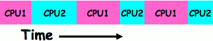


<h2 id="96e1c1ddfad24070e74100314ca1fee6"></h2>


## Memory Footprint of Two-Thread Example

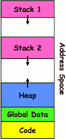

 - If we stopped this program and examined it with a debugger, we would see
    - Two sets of CPU registers
    - Two sets of Stacks
    - threads basically can trash each other pretty much anyway they want. but because of the way the abstraction works it's very hard for them to really screw each other's registers up that are stored in memory. but they can pretty much screw each other up by messing with their heaps anyway. 
 - Questions: 
    - How do we position stacks relative to each other?
    - What maximum size should we choose for the stacks?
    - What happens if threads violate this?
    - How might you catch violations?


<h2 id="8168b86f8351d4b3c96d05d294392e85"></h2>


## Per Thread State

 - Each Thread has a **Thread Control Block** (TCB)
    - Execution State: CPU registers, program counter, pointer to stack
    - Scheduling info: State (more later), priority, CPU time
    - Accounting Info
    - Various Pointers (for implementing scheduling queues)
    - Pointer to enclosing process? (PCB)?
    - – Etc (add stuff as you find a need)
 - In Nachos: “Thread” is a class that includes the TCB
 - OS Keeps track of TCBs in protected memory
    - In Array, or Linked List, or …

<h2 id="36327051d52814b03a2ef7b83183f3f9"></h2>


## Lifecycle of a Thread (or Process)

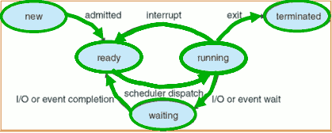

 - As a thread executes, it changes state:
    - new: The thread is being created
    - ready: The thread is waiting to run
    - running: Instructions are being executed
    - waiting: Thread waiting for some event to occur
    - terminated: The thread has finished execution
 - “Active” threads are represented by their TCBs
    - TCBs organized into queues based on their state

<h2 id="29bab3cf6a6d53393f8f549b2335f121"></h2>


## Ready Queue And Various I/O Device Queues

 - Thread not running => TCB is in some scheduler queue
    - Separate queue for each device/signal/condition 
    - Each queue can have a different scheduler policy

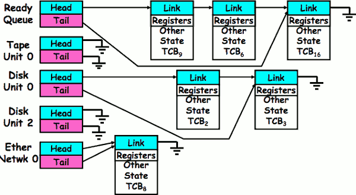


<h2 id="c289df5648beb35beaf1f17ca87ee93a"></h2>


## Dispatch Loop

 - Conceptually, the dispatching loop of the operating system looks as follows:

```
Loop {
    RunThread();
    ChooseNextThread();
    SaveStateOfCPU(curTCB);
    LoadStateOfCPU(newTCB);
}
```

 - This is an *infinite* loop
    - One could argue that this is all that the OS does
 - Should we ever exit this loop???
    - When would that be?  Shutting down, blue screen , ...

<h2 id="72e542fbe4c7df30c850a9d83b37186c"></h2>


## Running a thread

Consider first portion: RunThread()

 - How do I run a thread?
    - Load its state (registers, PC, stack pointer) into CPU
    - Load environment (virtual memory space, etc)
    - Jump to the PC
 - How does the dispatcher get control back?
    - Internal events: thread returns control voluntarily
    - External events: thread gets *preempted*


<h2 id="67c2ae43ca95bbb942c50877d4699be0"></h2>


### Internal Events

 - Blocking on I/O
    - The act of requesting I/O implicitly yields the CPU
 - Waiting on a “signal” from other thread
    - Thread asks to wait and thus yields the CPU
 - Thread executes a yield()
    - Thread volunteers to give up CPU

```
computePI() {
    while(TRUE) {
        ComputeNextDigit();
        yield();
    }
}
```

 - the suggestion here is that you're never doing a lot of work if you're mostly yielding all the time.


<h2 id="9301ba00a710f2f0c3d0e987b55894d4"></h2>


## Stack for Yielding Thread

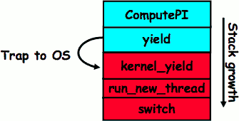

 - why must trap to OS ?
    - It's the kernel that is actually multiplexing the threads. The TCBs are stored in kernel space. 
    - But you can do threading entirely at user level if you want.
        - kernel mode vs user mode 
    - So nothing that's involved here in the switching of threads has to be kernel mode because it just involves register. 
    - Once we start switching processes then that is got to be in the kernel because we're changing address protection. 
 - How do we run a new thread?

```
run_new_thread() {
    newThread = PickNewThread();
    switch(curThread, newThread);
    ThreadHouseKeeping(); /* next Lecture */
}
```

 - How does dispatcher switch to a new thread?
    - Save anything next thread may trash: PC, regs, stack
    - Maintain isolation for each thread

<h2 id="0ccbdade8f62d5a109297de93bcfdf91"></h2>


## What do the stacks look like?


 - Consider the following code blocks:

```
proc A() {
    B();
}

proc B() {
    while(TRUE) {
        yield();
    }
}  
```

 - Suppose we have 2 threads:
    - Threads S and T


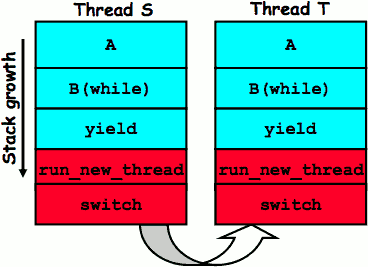

 - we have 2 threads, both of the threads are running this code


<h2 id="5c74b6578d4a2a69bfe3efd742f8abfd"></h2>


## Saving/Restoring state (often called “Context Switch)

```
Switch(tCur,tNew) {
    /* Unload old thread */
    TCB[tCur].regs.r7 = CPU.r7;
    …
    TCB[tCur].regs.r0 = CPU.r0;
    TCB[tCur].regs.sp = CPU.sp;
    TCB[tCur].regs.retpc = CPU.retpc; /*return addr*/
    /* Load and execute new thread */
    CPU.r7 = TCB[tNew].regs.r7;
    …
    CPU.r0 = TCB[tNew].regs.r0;
    CPU.sp = TCB[tNew].regs.sp;
    CPU.retpc = TCB[tNew].regs.retpc;
    return; /* Return to CPU.retpc */
}
```

<h2 id="a65d9d0db4d0e56258f8a9790865b242"></h2>


## Switch Details

 - How many registers need to be saved/restored?
    - – MIPS 4k: 32 Int(32b), 32 Float(32b)
    - Pentium: 14 Int(32b), 8 Float(80b), 8 SSE(128b),…
    - Sparc(v7): 8 Regs(32b), 16 Int regs (32b) * 8 windows = 136 (32b)+32 Float (32b)
    - Itanium: 128 Int (64b), 128 Float (82b), 19 Other(64b)
 - retpc is where the return should jump to.
    - In reality, this is implemented as a jump
 - There is a real implementation of switch in Nachos
    - See switch.s
        - Normally, switch is implemented as assembly
    - Of course, it’s magical!
    - But you should be able to follow it!

 - What if you make a mistake in implementing switch?
    - Suppose you forget to save/restore register 4
    - Get intermittent failures depending on when context switch occurred and whether new thread uses register 4
    - System will give wrong result without warning
 - Can you devise an exhaustive test to test switch code?
    - No! Too many combinations and inter-leavings
 - Cautionary tail:
    - For speed, Topaz kernel saved one instruction in switch()
    - Carefully documented!
        - Only works As long as kernel size < 1MB
    - What happened? 
        - Time passed, People forgot
        - Later, they added features to kernel (no one removes features!)
        - Very weird behavior started happening
    - Moral of story: Design for simplicity

<h2 id="10ce6000fcb49adf0650c21f0781928b"></h2>


## What happens when thread blocks on I/O?

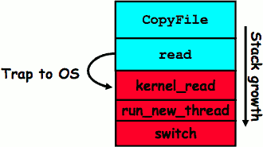

 - What happens when a thread requests a block of data from the file system?
    - User code invokes a system call
    - Read operation is initiated
    - Run new thread/switch
 - Thread communication similar
    - Wait for Signal/Join
    - Networking

<h2 id="2cfda7f7062e0275e0247c3d069998d1"></h2>


## External Events

 - What happens if thread never does any I/O, never waits, and never yields control?
    - Could the ComputePI program grab all resources and never release the processor? 
        - What if it didn’t print to console?
    - Must find way that dispatcher can regain control!
 - Answer: Utilize External Events
    - Interrupts: signals from hardware or software that stop the running code and jump to kernel
    - Timer: like an alarm clock that goes off every some many milliseconds
 - If we make sure that external events occur frequently enough, can ensure dispatcher runs


<h2 id="ac3e78e7384b0cd735da6f27aed285ed"></h2>


### Example: Network Interrupt

Network interrupt is an external interrupt.

 - ![][1]

 - An interrupt is a hardware-invoked context switch
    - No separate step to choose what to run next
    - Always run the interrupt handler immediately
 - network intertupts run every time a packets received


<h2 id="b5a9674b6b2a701a6281fc2cfa5e01c0"></h2>


## Use of Timer Interrupt to Return Control

 - Solution to our dispatcher problem
    - Use the timer interrupt to force scheduling decisions
    - 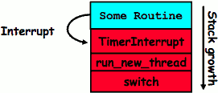
 - Timer Interrupt routine:

```
TimerInterrupt() {
    DoPeriodicHouseKeeping();
    run_new_thread();
}
```

 - I/O interrupt: same as timer interrupt except that DoHousekeeping() replaced by ServiceIO().

<h2 id="76509dab7986ec644502722976e77b9b"></h2>


## Choosing a Thread to Run

 - How does Dispatcher decide what to run?
    - Zero ready threads – dispatcher loops
        - Alternative is to create an “idle thread”
        - Can put machine into low-power mode
    - Exactly one ready thread – easy
    - More than one ready thread: use scheduling priorities
 - Possible priorities:
    - LIFO (last in, first out): 
        - put ready threads on front of list, remove from front
    - Pick one at random
    - FIFO (first in, first out):
        - Put ready threads on back of list, pull them from front
        - This is fair and is what Nachos does
    - Priority queue:
        - keep ready list sorted by TCB priority field


<h2 id="290612199861c31d1036b185b4e69b75"></h2>


## Summary

 - The state of a thread is contained in the TCB
    - Registers, PC, stack pointer
    - States: New, Ready, Running, Waiting, or Terminated
 - Multithreading provides simple illusion of multiple CPUs
    - Switch registers and stack to dispatch new thread
    - Provide mechanism to ensure dispatcher regains control
 - Switch routine
    - Can be very expensive if many registers
    - Must be very carefully constructed!
 - Many scheduling options
    - Decision of which thread to run complex enough for complete lecture


<h2 id="ddab5200bd0e32c18f6873e50ef64a6c"></h2>


# Lecture 5 : Cooperating Threads

<h2 id="9169db7925a4b838c995af1390fb85e0"></h2>


## Interrupt Controller

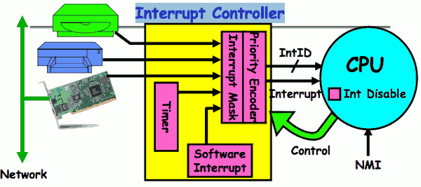

 - the yellow thing represents something that's inside the chip, a chip talking to CPU
 - there is a hardware software interrupt , if I set some bits in my interrupt controller they essentially assert and interrupt just like anybody else, but these bits get turned on by software.


---

 - Interrupts invoked with interrupt lines from devices
 - Interrupt controller chooses interrupt request to honor
    - Mask enables/disables interrupts
    - Priority encoder picks highest enabled interrupt 
        - and turns that into an ID ,eg 02 maybe the printer
    - Software Interrupt Set/Cleared by Software
    - Interrupt identity specified with ID line
 - CPU can disable all interrupts with internal flag
 - Non-maskable interrupt line (NMI) can’t be disabled


<h2 id="ac3e78e7384b0cd735da6f27aed285ed"></h2>


### Example: Network Interrupt

![][1]


 - Disable/Enable All Ints => Internal CPU disable bit
    - RTI （interrupt return instruction) reenables interrupts, returns to user mode
    - the only way to prevent a recursive infinite interrupting of an interrupt is to turn them all off to correct something.
 - Raise/lower priority: change interrupt mask 
    - in software what we do is we raise the priority
    - which means we change the mask to reflect we've running at some priority and all devices of that priority or lower will no longer interrutp. and only the highers ones will interrupt. 
    - so it's a purely a software concept. 
 - Software interrupts can be provided entirely in software at priority switching boundaries
    - software interrupts don't have to be done in hardware because at the point where we change the priority by changing the mask back we could see whether a software interrupts supposed to occur 


<h2 id="758d109b4d744f94947421576f9f6d07"></h2>


## Review:  Timer Interrupt

 - This is often called **preemptive multithreading** , since threads are preempted for better scheduling
    - Solves problem of user who doesn’t insert yield();

<h2 id="483ab3314892a7155e32e35ddd1b451d"></h2>


## ThreadFork(): Create a New Thread

 - ThreadFork() **s a user-level procedure that creates a new thread and places it on ready queue**.
    - We called this CreateThread() earlier
    - can be entirely user-level because the notion of "placing on the ready queue" is a kernel level concept. because ready queue is inside kernel.
 - Arguments to ThreadFork()
    - Pointer to application routine (fcnPtr)
        - tell it what routine to run
    - Pointer to array of arguments (fcnArgPtr)
        - quite possible that the thing you're going to run needs arguments 
    - Size of stack to allocate
 - Implementation
    - Sanity Check arguments
        - optional , helpful with debugging
    - Enter Kernel-mode and Sanity Check arguments again
        - why need check again ?  making sure by the kernel that the user thread creating this thread really has permissions for all the arguments. 
    - Allocate new Stack and TCB
    - Initialize TCB and place on ready list (Runnable).

<h2 id="1fa694bd693c3f651cbd9b3bcda0caf2"></h2>


### How do we initialize TCB and Stack?

 - Initialize Register fields of TCB
    - Stack pointer made to point at stack
    - PC return address => OS (asm) routine called ThreadRoot()
    - Two arg registers (a0 and a1) initialized to fcnPtr and fcnArgPtr, respectively (assume MIPS)
 - Initialize stack data?
    - No. Important part of stack frame is in registers (ra)
    - Think of stack frame as just before body of ThreadRoot() really gets started
    - 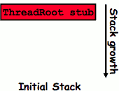


<h2 id="05c2c327c3eedac316533b39c66226be"></h2>


## How does Thread get started?

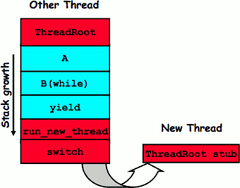

 - Here is a thread that's been running for a while. 
    - A which was the first procedure called by the thread is actually has been called by this thread root procedure
    - thread root is really the root of the thread
 - Eventually, run_new_thread() will select this TCB and return into beginning of ThreadRoot()
    - This really starts the new thread


<h2 id="55e254b64fdd3360649fd5a61753aa42"></h2>


### What does ThreadRoot() look like?

 - ThreadRoot() is the root for the thread routine:

```
ThreadRoot() {
    DoStartupHousekeeping();
    UserModeSwitch(); /* enter user mode */
    Call fcnPtr(fcnArgPtr);
    ThreadFinish();
}
```

 - Startup Housekeeping 
    - Includes things like recording start time of thread
    - Other Statistics
 - Stack will grow and shrink with execution of thread
 - Final return from thread returns into ThreadRoot() which calls ThreadFinish()
    - ThreadFinish() will start at user-level
 - it's very important that we get int user-mode before we start running
    - once we are calling that `fcnPtr(fcnArgPtr)` we are running arbitrary code that was given to us when the thread was created and we really don't want to do that in kernel mode.

 
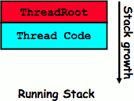


<h2 id="7a52c0dd4d422a92b6b716b62425d940"></h2>


## What does ThreadFinish() do?

 - Needs to re-enter kernel mode (system call)
 - “Wake up” (place on ready queue) threads waiting for this thread
    - Threads (like the parent) may be on a wait queue waiting for this thread to finish
 - Can’t deallocate thread yet
    - We are still running on its stack!
    - Instead, record thread as “waitingToBeDestroyed”
 - Call `run_new_thread()` to run another thread:
    - ThreadHouseKeeping() notices waitingToBeDestroyed and deallocates the finished thread’s TCB and stack


<h2 id="c6439ecf3dfbc55f09ca225af8da3310"></h2>


## Additional Detail

 - Thread Fork is not the same thing as UNIX fork
    - UNIX fork creates a new process so it has to create a new address space
    - For now, don’t worry about how to create and switch between address spaces
 - Thread fork is very much like an asynchronous procedure call
    - Runs procedure in separate thread
    - Calling thread doesn’t wait for finish
 - What if thread wants to exit early?
    - ThreadFinish() and exit() are essentially the same procedure entered at user level


<h2 id="c79ae88038e30470ef90ea5320eb4b7a"></h2>


## Parent-Child relationship

 - Every thread (and/or Process) has a parentage
    - A “parent” is a thread that creates another thread
    - A child of a parent was created by that parent

<h2 id="b5a1e99d1ec2bc3322bf39aa42393596"></h2>


## ThreadJoin() system call

 - One thread can wait for another to finish with the ThreadJoin(tid) call
    - Calling thread will be taken off run queue and placed on waiting queue for thread tid
 - Where is a logical place to store this wait queue?
    - On queue inside the TCB
    - 
 - Similar to wait() system call in UNIX
    - Lets parents wait for child processes
    - ThreadJoin is not kind of synchronization

<h2 id="cc1a47fb651850a86462158fab0d7c1d"></h2>


## Use of Join for Traditional Procedure Call

 - A traditional procedure call is logically equivalent to doing a ThreadFork followed by ThreadJoin

```c
A() { B(); }
B() { Do interesting, complex stuff }
```

```c
A’() {
    tid = ThreadFork(B,null);
    ThreadJoin(tid);
}
```

 - The procedure A() is equivalent to A’()
 - Why not do this for every procedure?
    - Context Switch Overhead
    - Memory Overhead for Stacks

<h2 id="29661fa8b809ab28a5b51934e38b1001"></h2>


## Kernel versus User-Mode threads

 - We have been talking about Kernel threads
    - Native threads supported directly by the kernel
    - Every thread can run or block independently
    - One process may have several threads waiting on different things
 - Downside of kernel threads: a bit expensive
    - Need to make a crossing into kernel mode to schedule
 - Even lighter weight option: User Threads
    - User program provides scheduler and thread package
    - May have several user threads per kernel thread
    - User threads may be scheduled non-premptively relative to each other (only switch on yield())
    - Cheap
 - Downside of user threads:
    - When one thread blocks on I/O, all threads block
    - Kernel cannot adjust scheduling among all threads
    - Option: *Scheduler Activations*
        - Have kernel inform user level when thread blocks…
        - the idea is when you're doing user-level scheduling if one of them goes to block and the first thing the kernel does is gives back the THREAD via another up call so that you can continue to do the lightweight stuff. so the kernel has to participate. 


<h2 id="dc111ca82bd76ac49f508cd56898996b"></h2>


## Threading models mentioned by book

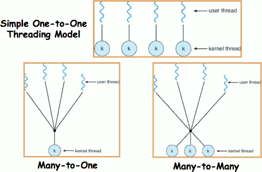


<h2 id="d85995eb95fa627c554daf95622b6c00"></h2>


## Multiprocessing vs Multiprogramming

 - Remember Definitions:
    - Multiprocessing == Multiple CPUs
    - Multiprogramming == Multiple Jobs or Processes
    - Multithreading == Multiple threads per Process
 - What does it mean to run two threads “concurrently”?
    - Scheduler is free to run threads in any order and interleaving: FIFO, Random, …
    - Dispatcher can choose to run each thread to completion or time-slice in big chunks or small chunks

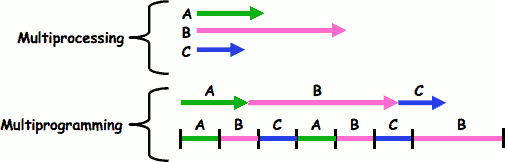


<h2 id="75d83e281c09829d3d975c15d6dff110"></h2>


## Correctness for systems with concurrent threads

 - If dispatcher can schedule threads in any way, programs must work under all circumstances
    - Can you test for this?
    - How can you know if your program works?
 - **Independent Threads:**
    - No state shared with other threads
    - Deterministic => Input state determines results
    - Reproducible => Can recreate Starting Conditions, I/O
    - Scheduling order doesn’t matter (if switch() works!!!)
 - **Cooperating Threads:**
    - Shared State between multiple threads
    - Non-deterministic
    - Non-reproducible
 - Non-deterministic and Non-reproducible means that bugs can be intermittent
    - Sometimes called “Heisenbugs”

<h2 id="d40b5e12a4bd27bfb433bab8e179726f"></h2>


## Interactions Complicate Debugging

 - Is any program truly independent?
    - Every process shares the file system, OS resources, network, etc
    - Extreme example: buggy device driver causes thread A to crash “independent thread” B
 - You probably don’t realize how much you depend on reproducibility:
    - Example: Evil C compiler
        - Modifies files behind your back by inserting errors into C program unless you insert debugging code
    - Example: Debugging statements can overrun stack
 - Non-deterministic errors are really difficult to find
    - Example: Memory layout of kernel+user programs
        - depends on scheduling, which depends on timer/other things
        - Original UNIX had a bunch of non-deterministic errors
    - Example: Something which does interesting I/O
        - User typing of letters used to help generate secure keys

<h2 id="290612199861c31d1036b185b4e69b75"></h2>


## Summary

 - Interrupts: hardware mechanism for returning control to operating system
    - Used for important/high-priority events
    - Can force dispatcher to schedule a different thread (premptive multithreading)
 - New Threads Created with ThreadFork()
    - Create initial TCB and stack to point at ThreadRoot()
    - ThreadRoot() calls thread code, then ThreadFinish()
    - ThreadFinish() wakes up waiting threads then prepares TCB/stack for distruction
 - Threads can wait for other threads using  ThreadJoin()
 - Threads may be at user-level or kernel level
 - Cooperating threads have many potential advantages
    - But: introduces non-reproducibility and non-determinism
    - Need to have Atomic operations

---


 [1]: ../imgs/os_thread_disp_network_interrupt.png
