...menustart

 - [lecture 6 : Synchronization](#0a777e4e25d6bed512e90f4276ed3f3e)
     - [Goals for Today](#134f950c115f6aa46f3605b42a307174)
     - [Threaded Web Server](#d8a1f8a1fb826b53b7b79e3cb43a59da)
     - [Thread Pools](#8c0fe8bd8957434b18beee61bb24d5a1)
     - [ATM Bank Server](#85fcb2cee656dde02fc06b37654e22d7)
         - [ATM bank server example](#c6fae3a91ab01289d5961a6d490f1998)
         - [Event Driven Version of ATM server](#acf0b627474e80f857dbfa51abf222ac)
         - [Can Threads Make This Easier?](#f8799e6f517713b0446f61f6deb8f9e2)
     - [Problem is at the lowest level](#d117b2ca76bc3129904333971dffeb66)
     - [Atomic Operations](#eaa1709ae37b41b0f052cd5eae6a14b4)
     - [Correctness Requirements](#73269bcd3c6c60c9afe0538902c352a2)
     - [Definitions](#97d8f56bf41502f60ca6fdd5d5da8edc)
     - [Where are we going with synchronization?](#5e7b47e9a6f0988cdfebc1f7e24d146d)
     - [Summary](#290612199861c31d1036b185b4e69b75)
 - [Lecture 7 : Implementing Mutual Exclusion, Semaphores, Monitors, and Condition Variables](#8570ce6b06af17a6a209f5d3517aa1e1)
     - [Goals for Today](#134f950c115f6aa46f3605b42a307174)
     - [High-Level Picture](#0df086f9bba7795a9b18b6e22bbe83e8)
     - [Too Much Milk: Solution #4](#4b6eee8efda451754a70cf1588f7f9f0)
     - [How to implement Locks?](#3d86e0ff4fcefc805340e9ef1efa0675)
     - [Naïve use of Interrupt Enable/Disable](#ae475fc8c83f6ca5f9823f95930bdfea)
     - [Better Implementation of Locks by Disabling Interrupts](#0c0efbf1e274251e1b5949d23eba0aab)
     - [New Lock Implementation: Discussion](#d9057f02e7c606b1524cb5309d285eea)
     - [Interrupt re-enable in going to sleep](#ce745553387b15821d65f05b351abcd5)
     - [How to Re-enable After Sleep()?](#b5e44eaec284226ecb674ec9be6332d9)
     - [Interrupt disable and enable across context switches](#fd67835f251cf36ce8c281c452376add)
     - [Atomic Read-Modify-Write instructions](#fe609fcadb06bc77aa2ec6e7fa11982c)
         - [Examples of Read-Modify-Write](#0cb1f961279712e6387eb806706470ef)
     - [Implementing Locks with test&set](#8bd032d628d2ee230ece8cdf6d2f207f)
     - [Problem: Busy-Waiting for Lock](#02e4fa8979f9af340f94ff6415ee68ff)
     - [Better Locks using test&set](#d039e3f1b9d4688654f7fe17129a4a89)
     - [Higher-level Primitives than Locks](#fef1b09d1d69da7e2340c9843f37a438)
     - [Semaphores](#58d4d2ed940cdd8be6c2061c284358da)
         - [Semaphores Like Integers Except](#134c7143615a9f821859a7cc9d05acb8)
         - [Two Uses of Semaphores](#df3e6a40766c1b8a18ce0e66e1b5c504)
     - [Producer-consumer with a bounded buffer](#96824e19e02c8a68ae66997ff614b298)
         - [Correctness constraints for solution](#1906399fd7e9b2ca2ae42be8a16f99b6)
         - [Full Solution to Bounded Buffer](#cc6b2a3d9ea5e9b3a24e6e884de19d22)
         - [Discussion about Solution](#2376ef53aa4475e775d822d3db211322)
     - [Motivation for Monitors and Condition Variables](#69810f85a57f822b996883f32374b3a7)
     - [Monitor with Condition Variables](#277df50d9fa89314547c06e1f17cee40)
         - [Simple Monitor Example](#8b1e0edd9d2a287d52be6dd022c68c7e)
     - [Summary](#290612199861c31d1036b185b4e69b75)
 - [Lecture 8: Readers/Writers; Language Support for Synchronization](#d82c7cd8bfc967bc3466ba0df7a07b30)
     - [Goals for Today](#134f950c115f6aa46f3605b42a307174)
     - [Simple Monitor Example (version 1)](#12ec8d63b9c0f5207e953008a49fc0a1)
     - [Condition Variables](#bc040239e2bdcdb0fdb5b22a8d93dd78)
     - [Complete Monitor Example (with condition variable)](#0ecd767a2fc3cd8b5537db79cdedbe05)
     - [Mesa vs. Hoare monitors](#3d8107f1e26613768b14fe6f9d4fd513)
     - [Using of Compare&Swap for queues](#ebd967650933351963789c0db5c80723)
     - [Readers/Writers Problem](#97737c22439d498aa05d01b68a31eee8)
         - [Basic Readers/Writers Solution](#feb308406e76eb783feefde7308d37cb)
         - [Code for a Reader](#a58c31f9b0dd129c6884508489723376)
         - [Code for a Writer](#99edb23378eeb2cf83d5e76cfc717d25)
         - [Question](#a97ea56b0e00b2379736ae60869ff66a)
     - [Can we construct Monitors from Semaphores?](#29a253cba7cb8c07c72fb2173efe6989)
     - [Construction of Monitors from Semaphores (con’t)](#ffc68f144cb3aaa48a669503c9453355)
     - [Monitor Conclusion](#bd20aec7f47d3fdbc7a7829f523fa03f)
     - [Language support for synchronization](#28f651ed7afea2c50425c709668b676a)
         - [C++](#f6f87c9fdcf8b3c3f07f93f1ee8712c9)
         - [Java](#d52387880e1ea22817a72d3759213819)
     - [Summary](#290612199861c31d1036b185b4e69b75)
 - [Lecture 9 : Resource Contention and Deadlock](#7c64ac5cca2f1b61bb6050f0c780662e)
     - [Goals for Today](#134f950c115f6aa46f3605b42a307174)
     - [Resources](#ddcf50c29294d4414f3f7c1bbc892cb5)
     - [Starvation vs Deadlock](#e66cc87dc77acc53b59839e4d32c59f6)
     - [Conditions for Deadlock](#854d217dd7484494ec7fef6f86239ee3)
         - [Bridge Crossing Example](#4e1e87646856a00a3317d4cf7e38301c)
         - [Train Example (Wormhole-Routed Network)](#4fa3ecace35c7a5d85cd17f794cd753c)
     - [Dining Lawyers Problem](#443e85f9c2e02a73bcba0e0b90fea5db)
     - [Four requirements for Deadlock](#b0764a5818c0783470ac25ef6f15fa06)
     - [Resource-Allocation Graph](#cd4c9a20ae25f28bf89fdceeeb8ff759)
         - [Resource Allocation Graph Examples](#4053557fd46fc4a1438c8fa6b1158e66)
     - [Methods for Handling Deadlocks](#51cbff7f5c9ab16fb72f7f72ee951f5c)
     - [Deadlock Detection Algorithm](#2c61a97575bf39f95051de0065bf4b52)
     - [Summary](#290612199861c31d1036b185b4e69b75)
 - [Lecture 10 : Deadlock (cont’d) / Thread Scheduling](#bf84fee9d2e0d27ab6eb0a89ccbf2a59)
     - [Goals for Today](#134f950c115f6aa46f3605b42a307174)
     - [What to do when detect deadlock?](#3be29107b16cdcaa715b0e62eec09933)
     - [Techniques for Preventing Deadlock](#f3a2b84a9e5ac845742510943ccca3ec)
     - [Banker’s Algorithm for Preventing Deadlock](#91245fc5f505d4166a98cabd74f987fe)
         - [Banker’s Algorithm Example](#75405c8059b00a8201d5f81ed5772413)
     - [Summary (Deadlock)](#0db2e0a17394f45dbcc96774160dc99b)

...menuend


<h2 id="0a777e4e25d6bed512e90f4276ed3f3e"></h2>


# lecture 6 : Synchronization

<h2 id="134f950c115f6aa46f3605b42a307174"></h2>


## Goals for Today

 - Concurrency examples
 - Need for synchronization
 - Examples of valid synchronization


<h2 id="d8a1f8a1fb826b53b7b79e3cb43a59da"></h2>


## Threaded Web Server

 - Advantages of threaded version:
    - Can share file caches kept in memory, results of CGI scripts, other things
    - Threads are much cheaper to create than processes, so this has a lower per-request overhead
 - What if too many requests come in at once?
    - you got more overhead than real computation. You got a million threads going simultaneously the only thing you're doing is swithing all the time. 

<h2 id="8c0fe8bd8957434b18beee61bb24d5a1"></h2>


## Thread Pools

 - Problem with previous version: Unbounded Threads
    - When web-site becomes too popular – throughput sinks
 - Instead, allocate a bounded “pool” of threads, representing the maximum level of multiprogramming


```
master() {
    allocThreads(slave,queue);
    while(TRUE) {
        con=AcceptCon();
        Enqueue(queue,con);
        wakeUp(queue);
    }
}


slave(queue) {
    while(TRUE) {
        con=Dequeue(queue);
        if (con==null)
            sleepOn(queue);
        else
            ServiceWebPage(con);
    }
}
```

 - every request that comes in get put in the queue 
 - and there is a finite number of threads here running 
    - they go and grab a request off the queue , do something , finish it, grab the next request 


<h2 id="85fcb2cee656dde02fc06b37654e22d7"></h2>


## ATM Bank Server

<h2 id="c6fae3a91ab01289d5961a6d490f1998"></h2>


### ATM bank server example

 - Suppose we wanted to implement a server process to handle requests from an ATM network:
 - How could we speed this up?
    - More than one request being processed at once
    - Event driven (overlap computation and I/O)
    - Multiple threads (multi-proc, or overlap comp and I/O)

<h2 id="acf0b627474e80f857dbfa51abf222ac"></h2>


### Event Driven Version of ATM server

 - Suppose we only had one CPU
    - Still like to overlap I/O with computation
    - Without threads, we would have to rewrite in event-driven style
 - Example

```
BankServer() {
    while(TRUE) {
        event = WaitForNextEvent();
        if (event == ATMRequest)
            StartOnRequest();
        else if (event == AcctAvail)
            ContinueRequest();
        else if (event == AcctStored)
            FinishRequest(); 
    } 
}
```

 - What if we missed a blocking I/O step?
 - What if we have to split code into hundreds of pieces which could be blocking?
 - This technique is used for graphical programming


<h2 id="f8799e6f517713b0446f61f6deb8f9e2"></h2>


### Can Threads Make This Easier?

 - Threads yield overlapped I/O and computation without “deconstructing” code into non-blocking fragments
    - One thread per request
 - Requests proceeds to completion, blocking as required I/O
 - Unfortunately, shared state can get corrupted:

```
Thread 1                    Thread 2
load r1, acct->balance
                            load r1, acct->balance
                            add r1, amount2
                            store r1, acct->balance
add r1, amount1
store r1, acct->balance
```

<h2 id="d117b2ca76bc3129904333971dffeb66"></h2>


## Problem is at the lowest level

 - Most of the time, threads are working on separate data, so scheduling doesn’t matter
 - However, What about (Initially, y = 12):
    - What are the possible values of x?  13, 3 , or 5

```
Thread A    Thread B
x = 1;      y = 2;
x = y+1;    y = y * 2;
```
 
 - Or, what are the possible values of x below?

```
Thread A   Thread B
x = 1;     x = 2;
```

 - X could be 1 or 2 (non-deterministic!)
 - Could even be 3 for serial processors:
    - Thread A writes 0001, B writes 0010. 
    - if we have a non-atomic load/store ( eg. bigger than a single word )

<h2 id="eaa1709ae37b41b0f052cd5eae6a14b4"></h2>


## Atomic Operations

 - To understand a concurrent program, we need to know what the underlying indivisible operations are!
 - **Atomic Operation**:  an operation that always runs to completion or not at all
    - It is indivisible: it cannot be stopped in the middle and state cannot be modified by someone else in the middle
    - Fundamental building block – if no atomic operations, then have no way for threads to work together
 - On most machines, memory references and assignments (i.e. loads and stores) of words are atomic
    - Consequently – weird example that produces “3” on previous slide can’t happen
 - Many instructions are not atomic
    - Double-precision floating point store often not atomic
    - VAX and IBM 360 had an instruction to copy a whole array

<h2 id="73269bcd3c6c60c9afe0538902c352a2"></h2>


## Correctness Requirements

 - Threaded programs must work for all interleavings of thread instruction sequences
    - Cooperating threads inherently non-deterministic and non-reproducible
    - Really hard to debug unless carefully designed!

<h2 id="97d8f56bf41502f60ca6fdd5d5da8edc"></h2>


## Definitions

 - **Synchronization:**  using atomic operations to ensure cooperation between threads
    - For now, only loads and stores are atomic
    - We are going to show that its hard to build anything useful with only reads and writes
 - **Mutual Exclusion**: ensuring that only one thread does a particular thing at a time
    - One thread *excludes* the other while doing its task
 - **Critical Section**: piece of code that only one thread can execute at once. Only one thread at a time will get into this section of code
    - Critical section is the result of mutual exclusion
    - Critical section and mutual exclusion are two ways of describing the same thing.
 - **Lock**: prevents someone from doing something
    - Lock before entering critical section and before accessing shared data
    - Unlock when leaving, after accessing shared data
    - Wait if locked
        - Important idea: all synchronization involves waiting
 - For example: fix the milk problem by putting a key on the refrigerator
    - Lock it and take key if you are going to go buy milk
    - Fixes too much: roommate angry if only wants OJ
    - Of Course – We don’t know how to make a lock yet

<h2 id="5e7b47e9a6f0988cdfebc1f7e24d146d"></h2>


## Where are we going with synchronization?

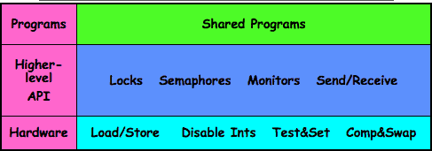

 - We are going to implement various higher-level synchronization primitives using atomic operations
    - Everything is pretty painful if only atomic primitives are load and store
    - Need to provide primitives useful at user-level

<h2 id="290612199861c31d1036b185b4e69b75"></h2>


## Summary 

 - Concurrent threads are a very useful abstraction
    - Allow transparent overlapping of computation and I/O
    - Allow use of parallel processing when available
 - Concurrent threads introduce problems when accessing shared data
    - Programs must be insensitive to arbitrary interleavings
    - Without careful design, shared variables can become completely inconsistent
 - Important concept: Atomic Operations
    - An operation that runs to completion or not at all
    - These are the primitives on which to construct various synchronization primitives
 - Showed how to protect a critical section with only atomic load and store => pretty complex!


---

<h2 id="8570ce6b06af17a6a209f5d3517aa1e1"></h2>


# Lecture 7 : Implementing Mutual Exclusion, Semaphores, Monitors, and Condition Variables

<h2 id="134f950c115f6aa46f3605b42a307174"></h2>


## Goals for Today

 - Hardware Support for Synchronization
 - Higher-level Synchronization Abstractions
    - Semaphores, monitors, and condition variables
 - Programming paradigms for concurrent programs


<h2 id="0df086f9bba7795a9b18b6e22bbe83e8"></h2>


## High-Level Picture

 - The abstraction of threads is good:
    - Maintains sequential execution model 
    - Allows simple parallelism to overlap I/O and computation
 - Unfortunately, still too complicated to access state shared between threads 
    - Consider “too much milk” example
    - Implementing a concurrent program with only loads and stores would be tricky and error-prone
 - Today, we’ll implement higher-level operations on top of atomic operations provided by hardware
    - Develop a “synchronization toolbox”
    - Explore some common programming paradigms

<h2 id="4b6eee8efda451754a70cf1588f7f9f0"></h2>


## Too Much Milk: Solution #4

 - Suppose we have some sort of implementation of a lock (more in a moment).
    - **Lock.Acquire()** - wait until lock is free, then grab
    - **Lock.Release()** - Unlock, waking up anyone waitin
    - These must be atomic operations – if two threads are waiting for the lock and both see it’s free, only one succeeds to grab the lock
 - Then, our milk problem is easy:
 
```c
milklock.Acquire();
if (nomilk)
 buy milk;
milklock.Release();
```
 
 - Once again, section of code between Acquire() and Release() called a **“Critical Section”**
 - Of course, you can make this even simpler: suppose you are out of ice cream instead of milk
    - Skip the test since you always need more ice cream.

<h2 id="3d86e0ff4fcefc805340e9ef1efa0675"></h2>


## How to implement Locks?

 - **Lock**: prevents someone from doing something
    - Lock before entering critical section and before accessing shared data
    - Unlock when leaving, after accessing shared data
    - Wait if locked
        - **Important idea: all synchronization involves waiting**
        - **Should** ***sleep*** **if waiting for a long time**
 - Atomic Load/Store: get solution like Milk #3
    - Looked at this last lecture
    - Pretty complex and error prone
 - Hardware Lock instruction
    - Is this a good idea? No.
    - What about putting a task to sleep?
        - How do you handle the interface between the hardware and scheduler?
    - Complexity?
        - Done in the Intel 432
        - Each feature makes hardware more complex and slow

<h2 id="ae475fc8c83f6ca5f9823f95930bdfea"></h2>


## Naïve use of Interrupt Enable/Disable

 - How can we build multi-instruction atomic operations?
    - Recall: dispatcher gets control in two ways. 
        - Internal: Thread does something to relinquish the CPU
        - External: Interrupts cause dispatcher to take CPU
    - On a uniprocessor, can avoid context-switching by:
        - Avoiding internal events (although virtual memory tricky)
        - Preventing external events by disabling interrupts
    - What about a multiprocessor ?
        - It does not. because  we only disabled interrupts on one core.
 - Consequently, naïve Implementation of locks:
    - `LockAcquire { disable Ints; }`
    - `LockRelease { enable Ints; }`
 - Problems with this approach:
    - **Can’t let user do this**!  Consider following:
        - `LockAcquire(); While(TRUE) {;}`
        - interrupts will never go off again , the OS will never grab the CPU back
    - Real-Time system—no guarantees on timing! 
        - Critical Sections might be arbitrarily long
    - What happens with I/O or other important events?
        - “Reactor about to meltdown. Help?”


<h2 id="0c0efbf1e274251e1b5949d23eba0aab"></h2>


## Better Implementation of Locks by Disabling Interrupts

 - Key idea: maintain a lock variable in memory and impose mutual exclusion only during operations on that variable

```
int value = FREE;

Acquire() {
    disable interrupts;
    if (value == BUSY) {
        put thread on wait queue;
        Go to sleep();
        // Enable interrupts?
    } else {
        value = BUSY;
    }
    enable interrupts;
}

Release() {
    disable interrupts;
    if (anyone on wait queue) {
        take thread off wait queue
        Place on ready queue;
    } else {
        value = FREE;
    }
    enable interrupts;
}
```

 - after going to sleep, who re-enable interrupts?
 - It doesn't really work.

<h2 id="d9057f02e7c606b1524cb5309d285eea"></h2>


## New Lock Implementation: Discussion

 - Why do we need to disable interrupts at all?
    - Avoid interruption between checking and setting lock value
    - Otherwise two threads could think that they both have lock
 
<h2 id="ce745553387b15821d65f05b351abcd5"></h2>


## Interrupt re-enable in going to sleep

 - What about re-enabling ints when going to sleep?
 - Before putting thread on the wait queue ?
    - meanwhile at that point somebody else wakes up, releases the lock , comes back , and we put ourselves on the wait queue even though the lock is free now.  
    - Release can check the queue and not wake up thread
 - After putting thread on the wait queue ?
    - they wake me up from the wait queue by putting me on the ready queue and then I come back here and immediately go to sleep. 
    - Relase puts the thread on the ready queue, but the thread still thinks it needs to go to sleep
    - Misses wakeup and still holds lock ( deadlock ! )
 - Want to put it after sleep(). But how ?
    - we need to bring the kernel in here to help us a little bit. What means that are going to sleep process has to also re-enable interrupts somehow. 


<h2 id="b5e44eaec284226ecb674ec9be6332d9"></h2>


## How to Re-enable After Sleep()?

 - In Nachos, since ints are disabled when you call sleep:
    - Responsibility of the next thread to re-enable ints
    - When the sleeping thread wakes up, returns to acquire and re-enables interrupts

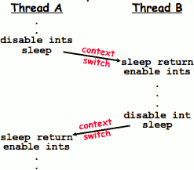


<h2 id="fd67835f251cf36ce8c281c452376add"></h2>


## Interrupt disable and enable across context switches

 - An important point about structuring code:
    - In Nachos code you will see lots of comments about assumptions made concerning when interrupts disabled
    - This is an example of where modifications to and assumptions about program state can’t be localized within a small body of code
    - In these cases it is possible for your program to eventually “acquire” bugs as people modify code
 - Other cases where this will be a concern?
    - What about exceptions that occur after lock is acquired? Who releases the lock?

```c
mylock.acquire();
a = b / 0;
mylock.release()
```

 - many languages have ways of handling non-local exits. Basically situations where you get an exception kind of in the mille of the code and you can arrange so that no matter what way you exit this code , you always execute release code. 


<h2 id="fe609fcadb06bc77aa2ec6e7fa11982c"></h2>


## Atomic Read-Modify-Write instructions

 - Problems with previous solution:
    - Can’t give lock implementation to users
        - you can't give interrupt disable to the user.
        - they will lock up the machine. 
    - Doesn’t work well on multiprocessor
        - Disabling interrupts on all processors requires messages and would be very time consuming
 - Alternative: atomic instruction sequences
    - These instructions read a value from memory and write a new value atomically
    - Hardware is responsible for implementing this correctly
        - on both uniprocessors (not too hard) 
        - and multiprocessors (requires help from cache coherence protocol)
    - that is enough to build locks.
 - Unlike disabling interrupts, can be used on both uniprocessors and multiprocessors

<h2 id="0cb1f961279712e6387eb806706470ef"></h2>


### Examples of Read-Modify-Write 
 

```
test&set (&address) { /* most architectures */
    result = M[address];
    M[address] = 1;
    return result; 
}

swap (&address, register) { /* x86 */
    temp = M[address];
    M[address] = register;
    register = temp; 
}

compare&swap (&address, reg1, reg2) { /* 68000 */
    if (reg1 == M[address]) {
        M[address] = reg2;
        return success;
    } else {
        return failure; 
    } 
}

load-linked&store conditional(&address) {
    /* R4000, alpha */
    loop:
        ll r1, M[address];
        movi r2, 1; /* Can do arbitrary comp */
        sc r2, M[address];
        beqz r2, loop; 
}
```


 - those combinations are enough sufficiently that we can build locks out of them 

<h2 id="8bd032d628d2ee230ece8cdf6d2f207f"></h2>


## Implementing Locks with test&set

 - Another flawed, but simple solution:

```
int value = 0; // Free
Acquire() {
    while (test&set(value)); // while busy
}
Release() {
    value = 0;
}
```
 

 - Simple explanation:
    - If lock is free, test&set reads 0 and sets value=1, so lock is now busy. It returns 0 so while exits.
    - If lock is busy, test&set reads 1 and sets value=1 (no change). It returns 1, so while loop continues 
    - When we set value = 0, someone else can get lock
 - **Busy-Waiting:**  thread consumes cycles while waiting


<h2 id="02e4fa8979f9af340f94ff6415ee68ff"></h2>


## Problem: Busy-Waiting for Lock

 - Positives for this solution
    - Machine can receive interrupts
    - User code can use this lock
    - Works on a multiprocessor
 - Negatives
    - This is very inefficient because the busy-waiting thread will consume cycles waiting
    - Waiting thread may take cycles away from thread holding lock (no one wins!)
    - **Priority Inversion:**  If busy-waiting thread has higher priority than thread holding lock => no progress!
 - Priority Inversion problem with original Martian rover 
 - For semaphores and monitors, waiting thread may wait for an arbitrary length of time!
    - Thus even if busy-waiting was OK for locks, definitely not ok for other primitives
    - Homework/exam solutions should not have busy-waiting!


<h2 id="d039e3f1b9d4688654f7fe17129a4a89"></h2>


## Better Locks using test&set

 - Can we build test&set locks without busy-waiting?
    - Can’t entirely, but can minimize
    - Idea: only busy-wait to atomically check lock value
        - 有对象获取锁后，guard 会置为0，其他对象再次尝试获取锁时，如果锁没还有被释放，会sleep()

```
int guard = 0;
int value = FREE;
Acquire() {
    // Short busy-wait time
    while (test&set(guard));
    if (value == BUSY) {
        put thread on wait queue;
        go to sleep() & guard = 0;
    } else {
        value = BUSY;
        guard = 0;
    }
}

Release() {
    // Short busy-wait time
    while (test&set(guard));
    if anyone on wait queue {
        take thread off wait queue
        Place on ready queue;
    } else {
        value = FREE;
    }
    guard = 0;
}
```

 - Note: sleep has to be sure to reset the guard variable
    - Why can’t we do it just before or just after the sleep?

 
<h2 id="fef1b09d1d69da7e2340c9843f37a438"></h2>


## Higher-level Primitives than Locks
 
 - Goal of last couple of lectures:
    - What is the right abstraction for synchronizing threads that share memory?
        - locks are kind of the lowest level primitive that we could ask for. and they don't really do a lot of things cleanly. 
    - Want as high a level primitive as possible
 - Good primitives and practices important!
    - Since execution is not entirely sequential, really hard to find bugs, since they happen rarely
 - UNIX is pretty stable now, but up until about mid-80s (10 years after started), systems running UNIX would crash every week or so – concurrency bugs
 - Synchronization is a way of coordinating multiple concurrent activities that are using shared state
    - This lecture and the next presents a couple of ways of structuring the sharing


<h2 id="58d4d2ed940cdd8be6c2061c284358da"></h2>


## Semaphores

 - Semaphores are a kind of generalized lock
    - First defined by Dijkstra in late 60s
    - Main synchronization primitive used in original UNIX
    - Semaphores are really named after the notion of kind of the stop lights that are on train tracks
        - 
 - Definition: a Semaphore has a non-negative integer value and supports the following two operations:
    - **P():** an atomic operation that waits for semaphore to become positive, then decrements it by 1  
        - Think of this as the wait() operation
    - **V():** an atomic operation that increments the semaphore by 1, waking up a waiting P, if any 
        - This of this as the signal() operation
    - Only time can set integer directly is at initialization time 
    - Note that P() stands for “proberen” (to test) and V() stands for “verhogen” (to increment) in Dutch
    

<h2 id="134c7143615a9f821859a7cc9d05acb8"></h2>


### Semaphores Like Integers Except

 - Semaphores are like integers, except
    - No negative values
    - Only operations allowed are P and V – can’t read or write value, except to set it initially
    - Operations must be atomic
        - Two P’s together can’t decrement value below zero
        - Similarly, thread going to sleep in P won’t miss wakeup from V – even if they both happen at same time
 - Semaphore from railway analogy
    - Here is a semaphore initialized to 2 for resource control:


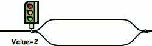


<h2 id="df3e6a40766c1b8a18ce0e66e1b5c504"></h2>


### Two Uses of Semaphores

 - Mutual Exclusion (initial value = 1)
    - Also called “Binary Semaphore”.
    - Can be used for mutual exclusion:
        - semaphore.P();
        - // Critical section goes here
        - semaphore.V();
    - Mutex
 - Scheduling Constraints (initial value = 0)
    - Locks are fine for mutual exclusion, but what if you want a thread to wait for something?
    - Example: suppose you had to implement ThreadJoin which must wait for thread to terminiate:

```
Initial value of semaphore = 0
ThreadJoin {
    semaphore.P();
}
ThreadFinish {
    semaphore.V();
}
```


<h2 id="96824e19e02c8a68ae66997ff614b298"></h2>


## Producer-consumer with a bounded buffer

 - Problem Definition
    - Producer puts things into a shared buffer
    - Consumer takes them out
    - Need synchronization to coordinate producer/consumer
 - Don’t want producer and consumer to have to work in lockstep, so put a fixed-size buffer between them
    - Need to synchronize access to this buffer
    - Producer needs to wait if buffer is full
    - Consumer needs to wait if buffer is empty
 - Example 1: GCC compiler
    - cpp | cc1 | cc2 | as | ld
 - Example 2: Coke machine
    - Producer can put limited number of cokes in machine
    - Consumer can’t take cokes out if machine is empty


<h2 id="1906399fd7e9b2ca2ae42be8a16f99b6"></h2>


### Correctness constraints for solution

 - Correctness Constraints:
    - Consumer must wait for producer to fill buffers, if none full (scheduling constraint)
    - Producer must wait for consumer to empty buffers, if all full (scheduling constraint)
    - Only one thread can manipulate buffer queue at a time (mutual exclusion)
 - Remember why we need mutual exclusion
    - Because computers are stupid
    - Imagine if in real life: the delivery person is filling the machine and somebody comes up and tries to stick their money into the machine
 - General rule of thumb: **Use a separate semaphore for each constraint**
    - Semaphore fullBuffers; // consumer’s constraint
    - Semaphore emptyBuffers;// producer’s constraint
    - Semaphore mutex; // mutual exclusion


<h2 id="cc6b2a3d9ea5e9b3a24e6e884de19d22"></h2>


### Full Solution to Bounded Buffer     

```
Semaphore fullBuffer = 0; // Initially, no coke
Semaphore emptyBuffers = numBuffers;
// Initially, num empty slots
Semaphore mutex = 1; // No one using machine

Producer(item) {
    emptyBuffers.P(); // Wait until space
    mutex.P(); // Wait until buffer free
    Enqueue(item);
    mutex.V();
    fullBuffers.V(); // Tell consumers there is more coke
}
Consumer() {
    fullBuffers.P(); // Check if there’s a coke
    mutex.P(); // Wait until machine free
    item = Dequeue();
    mutex.V();
    emptyBuffers.V(); // tell producer need more
    return item;
}
```

<h2 id="2376ef53aa4475e775d822d3db211322"></h2>


### Discussion about Solution

 - Why asymmetry?
    - Producer does: emptyBuffer.P(), fullBuffer.V()
    - Consumer does: fullBuffer.P(), emptyBuffer.V()
 - Is order of P’s important? Yes! can cause deadlock
    - might sleep with lock
 - Is order of V’s important? No.
    - it might affect scheduling efficiency. 
 - What if we have 2 producers or 2 consumers?
    - Do we need to change anything? No.It works.


<h2 id="69810f85a57f822b996883f32374b3a7"></h2>


## Motivation for Monitors and Condition Variables

 - Semaphores are a huge step up; just think of trying to do the bounded buffer with only loads and stores
    - Problem is that semaphores are dual purpose:
        - They are used for both mutex and scheduling constraints
        - Example: the fact that flipping of P’s in bounded buffer gives deadlock is not immediately obvious. How do you prove correctness to someone?
 - Cleaner idea: Use locks for mutual exclusion and condition variables for scheduling constraints
 - Definition: **Monitor**: a lock and zero or more condition variables for managing concurrent access to shared data
    - Some languages like Java provide this natively
    - Most others use actual locks and condition variables
    - Monitor is a programming style or paradigm for building synchronization. It's a pattern. 

<h2 id="277df50d9fa89314547c06e1f17cee40"></h2>


## Monitor with Condition Variables

Basically a monitor with condition variable looks kind of this. Our conditon variables each represent queues to have things sleep on it , and the lock is kind of like the entry queue. 

The lock provides mutual exclusion to get in and deal with the condition variables . and the conditional variables are queues of threads waiting inside critical section. 

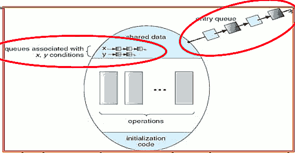

 - **Lock:**  the lock provides mutual exclusion to shared data
    - Always acquire before accessing shared data structure
    - Always release after finishing with shared data
    - Lock initially free
 - **Condition Variable:**  a queue of threads waiting for something inside a critical section
    - Key idea: make it possible to go to sleep inside critical section by atomically releasing lock at time we go to sleep
    - Contrast to semaphores: Can’t wait inside critical section
 - lock 保护 sharedata， sharedata 控制访问限制

<h2 id="8b1e0edd9d2a287d52be6dd022c68c7e"></h2>


### Simple Monitor Example

 - Here is an (infinite) synchronized queue

```
Lock lock;
Condition dataready;
Queue queue;

AddToQueue(item) {
    lock.Acquire(); // Get Lock
    queue.enqueue(item); // Add item
    dataready.signal(); // Signal any waiters
    lock.Release(); // Release Lock
}
RemoveFromQueue() {
    lock.Acquire(); // Get Lock
    while (queue.isEmpty()) {
        dataready.wait(&lock); // If nothing, sleep
    }
    item = queue.dequeue(); // Get next item
    lock.Release(); // Release Lock
    return(item);
}
```

 - this is a very good single condition variable pattern for you guys to think about. 
 - notic how we go to sleep with the lock acquired we wake up and we think about this is when we wake up we have the lock still.

<h2 id="290612199861c31d1036b185b4e69b75"></h2>


## Summary

 - Important concept: Atomic Operations
    - An operation that runs to completion or not at all
    - These are the primitives on which to construct various synchronization primitives
 - Talked about hardware atomicity primitives:
    - Disabling of Interrupts, test&set, swap, comp&swap, load-linked/store conditional
 - Showed several constructions of Locks
    - Must be very careful not to waste/tie up machine resources
        - Shouldn’t disable interrupts for long
        - Shouldn’t spin wait for long
    - Key idea: Separate lock variable, use hardware mechanisms to protect modifications of that variable
 - Talked about Semaphores, Monitors, and Condition Variables
    - Higher level constructs that are harder to “screw up”

<h2 id="d82c7cd8bfc967bc3466ba0df7a07b30"></h2>


# Lecture 8: Readers/Writers; Language Support for Synchronization

<h2 id="134f950c115f6aa46f3605b42a307174"></h2>


## Goals for Today

 - Continue with Synchronization Abstractions
    - Monitors and condition variables
 - Readers-Writers problem and solutoin
 - Language Support for Synchronization


<h2 id="12ec8d63b9c0f5207e953008a49fc0a1"></h2>


## Simple Monitor Example (version 1)

```
Lock lock;
Queue queue;

AddToQueue(item) {
    lock.Acquire(); // Lock shared data
    queue.enqueue(item); // Add item
    lock.Release(); // Release Lock 
}

RemoveFromQueue() {
    lock.Acquire(); // Lock shared data
    item = queue.dequeue();// Get next item or null
    lock.Release(); // Release Lock
    return(item); // Might return null 
}
```
 
 - Not very interesting use of “Monitor”
    - It only uses a lock with no condition variables
    - Cannot put consumer to sleep if no work!

<h2 id="bc040239e2bdcdb0fdb5b22a8d93dd78"></h2>


## Condition Variables

 - How do we change the RemoveFromQueue() routine to wait until something is on the queue?
    - Could do this by keeping a count of the number of things on the queue (with semaphores), but error prone
 - **Condition Variable**:  a queue of threads waiting for something inside a critical section
    - Key idea: allow sleeping inside critical section by atomically releasing lock at time we go to sleep
    - **Contrast to semaphores: Can’t wait inside critical section**
        - semaphore will deadlock
 - Operations:
    - **Wait(&lock)**:  Atomically release lock and go to sleep. Re-acquire lock later, before returning
    - **Signal()**: Wake up one waiter, if any
    - **Broadcast()**:  Wake up all waiters
 - Rule: Must hold lock when doing condition variable ops!
    - In Birrell paper, he says can perform signal() outside of lock – IGNORE HIM (this is only an optimization)


<h2 id="0ecd767a2fc3cd8b5537db79cdedbe05"></h2>


## Complete Monitor Example (with condition variable)


```
Lock lock;
Condition dataready;
Queue queue;

AddToQueue(item) {
    lock.Acquire(); // Get Lock
    queue.enqueue(item); // Add item
    dataready.signal(); // Signal any waiters
    lock.Release(); // Release Lock
}
RemoveFromQueue() {
    lock.Acquire(); // Get Lock
    while (queue.isEmpty()) {
        dataready.wait(&lock); // If nothing, sleep
    }
    item = queue.dequeue(); // Get next item
    lock.Release(); // Release Lock
    return(item);
}
```

 - wait() puts you to sleep and releases the lock
 - and before you ever exit wait(), it re-aquire the lock 
 - that magic is inside of implementation of the condition variable 


<h2 id="3d8107f1e26613768b14fe6f9d4fd513"></h2>


## Mesa vs. Hoare monitors

 - Need to be careful about precise definition of signal and wait. Consider a piece of our dequeue code:
    - why didn't we replace `while` with `if` ?

```
while (queue.isEmpty()) {
    dataready.wait(&lock); // If nothing, sleep
}
item = queue.dequeue(); // Get next item
```
 - Answer: depends on the type of scheduling
    - Hoare-style (most textbooks):
        - Signaler gives lock, CPU to waiter; waiter runs immediately
        - Waiter gives up lock, processor back to signaler when it exits critical section or if it waits again
    - Mesa-style (Nachos, most real operating systems):
        - better idea: what the Singaler does is rather than giving the lock to somebody immediately it just basically takes some of them walking up , puts them on the ready queue.
        - Signaler keeps lock and processor
        - Waiter placed on ready queue with no special priority
        - **Practically, need to check condition again after wait**

<h2 id="ebd967650933351963789c0db5c80723"></h2>


## Using of Compare&Swap for queues

```
compare&swap (&address, reg1, reg2) { /* 68000 */
    if (reg1 == M[address]) {
        M[address] = reg2;
        return success;
    } else {
        return failure;
    }
}
```
 
 - Here is an atomic add to linked-list function:

```
addToQueue(&object) {
    do { // repeat until no conflict
        ld r1, M[root] // Get ptr to current head
        st r1, M[object] // Save link in new object
    } until (compare&swap(&root,r1,object));
}
```
         
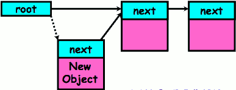

 - 虚线的链接，是不停尝试的部分
 - 确保没有其他人修改 root的情况下，插入 新节点

<h2 id="97737c22439d498aa05d01b68a31eee8"></h2>


## Readers/Writers Problem

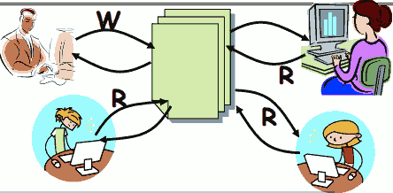

 - Motivation: Consider a shared database
    - Two classes of users:
        - Readers – never modify database
        - Writers – read and modify database
    - Is using a single lock on the whole database sufficient?
        - Like to have many readers at the same time
        - Only one writer at a time


<h2 id="feb308406e76eb783feefde7308d37cb"></h2>


### Basic Readers/Writers Solution

 - Correctness Constraints:
    - Readers can access database when no writers
    - Writers can access database when no readers or writers
    - Only one thread manipulates state variables at a time
 - Basic structure of a solution:
    - Reader() 
        - Wait until no writers
        - Access data base
        - Check out – wake up a waiting writer 
    - Writer()
        - Wait until no active readers or writers
        - Access database
        - Check out – wake up waiting readers or writer
    - State variables (Protected by a lock called “lock”):
        - int AR: Number of active readers; initially = 0
        - int WR: Number of waiting readers; initially = 0
        - int AW: Number of active writers; initially = 0
        - int WW: Number of waiting writers; initially = 0
        - Condition okToRead = NIL
        - Conditioin okToWrite = NIL

<h2 id="a58c31f9b0dd129c6884508489723376"></h2>


### Code for a Reader

```
Reader() {
    // First check self into system
    lock.Acquire();
    while ((AW + WW) > 0) { // Is it safe to read?
        WR++; // No. Writers exist
        okToRead.wait(&lock); // Sleep on cond var
        WR--; // No longer waiting
    }
    AR++; // Now we are active!
    lock.release();  // question 1: why release the lock here ?

    // Perform actual read-only access
    AccessDatabase(ReadOnly);
    // Now, check out of system
    lock.Acquire();
    AR--; // No longer active
    if (AR == 0 && WW > 0) // No other active readers
        okToWrite.signal(); // Wake up one writer
    lock.Release();
}
```

 - `while` is to ensure re-checking  after waking up
 - PS. ++ , -- are not atomic 
 - qestion 1:  someone else can read.


<h2 id="99edb23378eeb2cf83d5e76cfc717d25"></h2>


### Code for a Writer

```
Writer() {
    // First check self into system
    lock.Acquire();
    while ((AW + AR) > 0) { // Is it safe to write?
        WW++; // No. Active users exist
        okToWrite.wait(&lock); // Sleep on cond var
        WW--; // No longer waiting
    }
    AW++; // Now we are active!
    lock.release();  // question 1: why release the lock here ?
    // Perform actual read/write access
    AccessDatabase(ReadWrite);
    // Now, check out of system
    lock.Acquire();
    AW--; // No longer active
    if (WW > 0){ // Give priority to writers
        okToWrite.signal(); // Wake up one writer
    } else if (WR > 0) { // Otherwise, wake reader
        // question 2: why broadcast() here instead of signal() ?
        okToRead.broadcast(); // Wake all readers
    }
    lock.Release();
}
```
 
 - question 1: make sure that the reader code can actually at least get in there and generaate waiting readers on the reader code
 - **that is a general rule if you can set up your monitors so that you're not holding the lock for a huge period of time but rather for kind of the minimum that's required**. 
    - it's probably a bettern programming style 
 - question 2: we'd like every reader to be able to wake up. 
    - put all of them on to the ready queue
    - but only one at a time because only one can wake up **with** the lock

<h2 id="a97ea56b0e00b2379736ae60869ff66a"></h2>


### Question

 - What if we erase the condition check in Reader exit?
    - ~~if (AR == 0 && WW > 0)~~
    - that is, always call `okToWrite.signal();` when exiting.
    - It still works. 
 - Further, what if we turn the signal() into broadcast()
    - It works. But this is bad code because you're wasting time waking things up only to put them back to sleep again.
 - Finally, what if we use only one condition variable (call it “okToContinue”) instead of two separate ones?
    - Both readers and writers sleep on this variable
    - Must use broadcast() instead of signal()

<h2 id="29a253cba7cb8c07c72fb2173efe6989"></h2>


## Can we construct Monitors from Semaphores?

 - Locking aspect is easy: Just use a mutex
 - Can we implement condition variables this way?
    - `Wait() { semaphore.P(); }`
    - `Signal() { semaphore.V(); }`
    - No. semaphores can’t wait inside critical section. It will dead lock
 - Does this work better?

```
Wait(Lock lock) {
    lock.Release();
    semaphore.P();
    lock.Acquire();
}
Signal() { semaphore.V(); }
``` 
 
 - No! Condition vars have no histroy , semaphores have history:
    - What if thread signals and no one is waiting ?
        - you could have a loop that signals for a thousand times. 
    - What if thread later waits ?
        - if I've done a whole bunch of signals and I do a wait. What happens ?
        - Decrement and continue 

<h2 id="ffc68f144cb3aaa48a669503c9453355"></h2>


## Construction of Monitors from Semaphores (con’t)

 - Problem with previous try:
    - P and V are commutative – result is the same no matter what order they occur
    - Condition variables are NOT commutative
 - Does this fix the problem?

```
Wait(Lock lock) {
    lock.Release();
    semaphore.P();
    lock.Acquire(); 
}
Signal() {
    if semaphore queue is not empty
        semaphore.V(); 
}
```

 - Does this fix the problem?
    - Not legal to look at contents of semaphore queue
    - There is a race condition – signaler can slip in after lock release and before waiter executes semaphore.P()
 - It is actually possible to do this correctly
    - Complex solution for Hoare scheduling in book
    - Can you come up with simpler Mesa-scheduled solution?  
        - Yes you can. But you can't do it quite like this. 


<h2 id="bd20aec7f47d3fdbc7a7829f523fa03f"></h2>


## Monitor Conclusion

 - Monitors represent the logic of the program
    - Wait if necessary
    - Signal when change something so any waiting threads can proceed
 - Basic structure of monitor-based program:

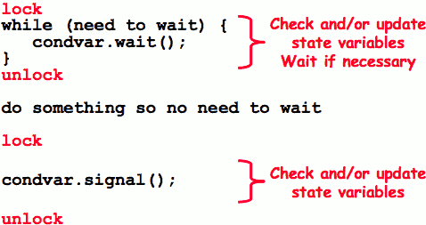


<h2 id="28f651ed7afea2c50425c709668b676a"></h2>


## Language support for synchronization 

<h2 id="f6f87c9fdcf8b3c3f07f93f1ee8712c9"></h2>


### C++

 - Languages with exceptions like C++
    - Languages that support exceptions are problematic (easy to make a non-local exit without releasing lock)
    - Consider

```
void Rtn() {
    lock.acquire();
    …
    DoFoo();
    …
    lock.release();
}
void DoFoo() {
    …
    if (exception) throw errException;
    …
}
```

 - Notice that an exception in DoFoo() will exit without releasing the lock
 - Must catch all exceptions in critical sections
    - Catch exceptions, release lock, and re-throw exception:


```
void Rtn() {
    lock.acquire();
    try {
        …
        DoFoo();
        …
    } catch (…) { // catch exception
        lock.release(); // release lock
        throw; // re-throw the exception
    }
    lock.release();
}
void DoFoo() {
    …
    if (exception) throw errException;
    …
}
```

 - `Even Better: auto_ptr<T> facility`. See C++ spec
    - Can deallocate/free lock regardless of exit method

<h2 id="d52387880e1ea22817a72d3759213819"></h2>


### Java

 - Java has explicit support for threads and thread synchronization
 - Bank Account example:

```
class Account {
    private int balance;
    // object constructor
    public Account (int initialBalance) {
        balance = initialBalance; }
    public synchronized int getBalance() {
        return balance; }
    public synchronized void deposit(int amount) {
        balance += amount; 
    } 
}
```

 - Every object has an associated lock which gets automatically acquired and released on entry and exit from a **synchronized** method.

---

 - Java also has *synchronized* statements:

```
synchronized (object) {
    …
}
```

 - Since every Java object has an associated lock, this type of statement acquires and releases the object’s lock on entry and exit of the body 
 - Works properly even with exceptions:

```
synchronized (object) {
    …
    DoFoo();
    …
}
void DoFoo() {
    throw errException;
}
```

---

 - In addition to a lock, every object has ***a single*** condition variable associated with it
    - How to wait inside a synchronization method of block:
        - void wait(long timeout); // Wait for timeout
        - void wait(long timeout, int nanoseconds); //variant
        - void wait();
    - How to signal in a synchronized method or block:
        - void notify();
        - void notifyAll(); 
    - Condition variables can wait for a bounded length of time. This is useful for handling exception cases:

```
t1 = time.now();
while (!ATMRequest()) {
    wait (CHECKPERIOD);
    t2 = time.new();
    if (t2 – t1 > LONG_TIME) checkMachine(); 
}
```

 - Not all Java VMs equivalent!
    - Different scheduling policies, not necessarily preemptive!

<h2 id="290612199861c31d1036b185b4e69b75"></h2>


## Summary

 - Semaphores: Like integers with restricted interface
    - Two operations:
        - P(): Wait if zero; decrement when becomes non-zero
        - V(): Increment and wake a sleeping task (if exists)
        - Can initialize value to any non-negative value
    - Use separate semaphore for each constraint
 - Monitors: A lock plus one or more condition variables
    - Always acquire lock before accessing shared data
    - Use condition variables to wait inside critical section
        - Three Operations: Wait(), Signal(), and Broadcast() 
 - Readers/Writers
    - Readers can access database when no writers
    - Writers can access database when no readers
    - Only one thread manipulates state variables at a time
 - Language support for synchronization:
    - Java provides synchronized keyword and one condition- variable per object (with wait() and notify())

---

<h2 id="7c64ac5cca2f1b61bb6050f0c780662e"></h2>


# Lecture 9 : Resource Contention and Deadlock 

<h2 id="134f950c115f6aa46f3605b42a307174"></h2>


## Goals for Today

 - Language Support for Synchronization
 - Discussion of Deadlocks
    - Conditions for its occurrence
    - Solutions for breaking and avoiding deadlock


<h2 id="ddcf50c29294d4414f3f7c1bbc892cb5"></h2>


## Resources

 - Resources – passive entities needed by threads to do their work
    - CPU time, disk space, memory
 - Two types of resources:
    - Preemptable – can take it away
        - CPU, Embedded security chip
    - Non-preemptable – must leave it with the thread
        - Disk space, plotter, chunk of virtual address space
        - Mutual exclusion – the right to enter a critical section
 - Resources may require exclusive access or may be sharable
    - Read-only files are typically sharable
    - Printers are not sharable during time of printing
 - One of the major tasks of an operating system is to manage resources

<h2 id="e66cc87dc77acc53b59839e4d32c59f6"></h2>


## Starvation vs Deadlock

 - Starvation vs. Deadlock
    - Starvation: thread waits indefinitely
        - Example, low-priority thread waiting for resources  constantly in use by high-priority threads
    - Deadlock: circular waiting for resources
        - a very specific type of starvation in which you have a circular waiting for resources
        - Thread A owns Res 1 and is waiting for Res 2
        - Thread B owns Res 2 and is waiting for Res 1
        - 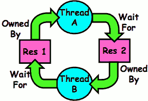
    - Deadlock => Starvation but not vice versa
        - Starvation can end (but doesn’t have to)
        - Deadlock can’t end without external intervention

<h2 id="854d217dd7484494ec7fef6f86239ee3"></h2>


## Conditions for Deadlock

 - Deadlock not always deterministic – Example 2 mutexes:

```
Thread A    Thread B
x.P();      y.P();
y.P();      x.P();
y.V();      x.V();
x.V();      y.V();
```

 - Deadlock won’t always happen with this code
    - Have to have exactly the right timing (“wrong” timing?)
 - Deadlocks occur with multiple resources
    - Means you can’t decompose the problem
    - Can’t solve deadlock for each resource independently
 - Example: System with 2 disk drives and two threads
    - Each thread needs 2 disk drives to function
    - Each thread gets one disk and waits for another one

<h2 id="4e1e87646856a00a3317d4cf7e38301c"></h2>


### Bridge Crossing Example


 - Each segment of road can be viewed as a resource
    - Car must own the segment under them
    - Must acquire segment that they are moving into
 - For bridge: must acquire both halves 
    - Traffic only in one direction at a time 
    - Problem occurs when two cars in opposite directions on bridge: each acquires one segment and needs next
 - If a deadlock occurs, it can be resolved if one car backs up (preempt resources and rollback)
    - Several cars may have to be backed up 
 - Starvation is possible
    - East-going traffic really fast => no one goes west

<h2 id="4fa3ecace35c7a5d85cd17f794cd753c"></h2>


### Train Example (Wormhole-Routed Network)

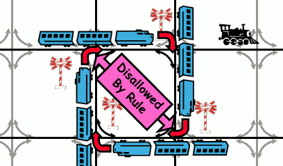

 - Circular dependency (Deadlock!)
    - Each train wants to turn right
    - Blocked by other trains
    - Similar problem to multiprocessor networks
 - Fix? Imagine grid extends in all four directions
    - **Force ordering of channels** (tracks)
        - Protocol: Always go east-west first, then north-south
    - Called “dimension ordering” (X then Y)

<h2 id="443e85f9c2e02a73bcba0e0b90fea5db"></h2>


## Dining Lawyers Problem


 - Five chopsticks/Five lawyers (really cheap restaurant)
    - Free-for all: Lawyer will grab any one they can
    - Need two chopsticks to eat
 - What if all grab at same time?
    - Deadlock!
 - How to fix deadlock?
    - Make one of them give up a chopstick (Hah!)
    - Eventually everyone will get chance to eat
 - How to prevent deadlock?
    - Never let lawyer take last chopstick if no hungry lawyer has two chopsticks afterwards

<h2 id="b0764a5818c0783470ac25ef6f15fa06"></h2>


## Four requirements for Deadlock

 - Mutual exclusion
    - Only one thread at a time can use a resource
 - Hold and wait
    - Thread holding at least one resource is waiting to acquire additional resources held by other threads 
 - No preemption
    - Resources are released only voluntarily by the thread holding the resource, after thread is finished with it 
 - Circular wait
    - There exists a set {T₁, …, T<sub>n</sub>} of waiting threads
        - T₁ is waiting for a resource that is held by T₂
        - T₂ is waiting for a resource that is held by T₃
        - ...
        - T<sub>n</sub> is waiting for a resource that is held by T₁

<h2 id="cd4c9a20ae25f28bf89fdceeeb8ff759"></h2>


## Resource-Allocation Graph

 - System Model
    - A set of Threads T₁, T₂, . . ., T<sub>n</sub>
    - Resource types R₁, R₂, . . ., R<sub>m</sub>
        - CPU cycles, memory space, I/O devices
    - Each resource type Rᵢ has Wᵢ instances
    - Each thread utilizes a resource as follows:
        - Request() / Use() / Release()
 - Resource-Allocation Graph:
    - V is partitioned into two types:
        - T = { T₁, T₂, . . ., T<sub>n</sub> } , the set threads in the system
        - R = { R₁, R₂, . . ., R<sub>m</sub> } , the set of resource types in system
    - request edge – directed edge Tᵢ → Rⱼ
    - assignment edge – directed edge  Rⱼ → Tᵢ 

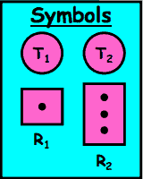

 - resources are represented by rectangles
    - dots inside rectagles are the number of equivalent resources in the system.
        - R₁ is one of them
        - R₂ is 3 of them.  When I say I need R₂ I don't really care which 1 I get. 

<h2 id="4053557fd46fc4a1438c8fa6b1158e66"></h2>


### Resource Allocation Graph Examples

 - Recall:
    - request edge – directed edge Tᵢ → Rⱼ
    - assignment edge – directed edge  Rⱼ → Tᵢ 


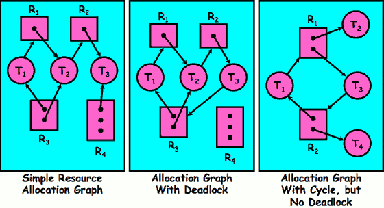


<h2 id="51cbff7f5c9ab16fb72f7f72ee951f5c"></h2>


## Methods for Handling Deadlocks

 - Allow system to enter deadlock and then recover
    - Requires deadlock detection algorithm
    - Some technique for forcibly preempting resources and/or terminating tasks
 - Ensure that system will **never** enter a deadlock
    - Need to monitor all lock acquisitions
    - Selectively deny those that **might** lead to deadlock
 - Ignore the problem and pretend that deadlocks never occur in the system
    - Used by most operating systems, including UNIX

<h2 id="2c61a97575bf39f95051de0065bf4b52"></h2>


## Deadlock Detection Algorithm

 - Only one of each type of resource => look for loops
 - More General Deadlock Detection Algorithm
    - Let [X] represent an m-ary vector of non-negative  integers (quantities of resources of each type):

```
[FreeResources]: Current free resources each type
[Request_x]: Current requests from thread X
[Alloc_x]: Current resources held by thread X
```

 - See if tasks can eventually terminate on their own

```
[Avail] = [FreeResources]
Add all nodes to UNFINISHED
do {
    done = true
    Foreach node in UNFINISHED {
        if ([Request_node] <= [Avail]) {
            remove node from UNFINISHED
            [Avail] = [Avail] + [Alloc_node]
            done = false
        }
    }
} until(done)
```

 - Nodes left in UNFINISHED => deadlocked

<h2 id="290612199861c31d1036b185b4e69b75"></h2>


## Summary 

 - Starvation vs. Deadlock
    - Starvation: thread waits indefinitely
    - Deadlock: circular waiting for resources
 - Four conditions for deadlocks
    - Mutual exclusion
    - Hold and wait
    - No preemption
    - Circular wait
 - Techniques for addressing Deadlock
    - Allow system to enter deadlock and then recover
    - Ensure that system will never enter a deadlock
    - Ignore the problem and pretend that deadlocks never occur in the system
 - Deadlock detection
    - Attempts to assess whether waiting graph can ever
 - make progress
    - Next Time: Deadlock prevention
    - Assess, for each allocation, whether it has the potential to lead to deadlock
    - Banker’s algorithm gives one way to assess this


<h2 id="bf84fee9d2e0d27ab6eb0a89ccbf2a59"></h2>


# Lecture 10 : Deadlock (cont’d) / Thread Scheduling

<h2 id="134f950c115f6aa46f3605b42a307174"></h2>


## Goals for Today

 - Preventing Deadlock
 - Scheduling Policy goals
 - Policy Options
 - Implementation Considerations

<h2 id="3be29107b16cdcaa715b0e62eec09933"></h2>


## What to do when detect deadlock?

 - Terminate thread, force it to give up resources
    - In Bridge example, Godzilla picks up a car, hurls it into the river. Deadlock solved!
    - Shoot a dining lawyer
    - But, not always possible – killing a thread holding a mutex leaves world inconsistent
 - Preempt resources without killing off thread 
    - Take away resources from thread temporarily
    - Doesn’t always fit with semantics of computation
        - for instance, a resource might be a lock in a critical section if we preempt that lock, suddenly there might be two threads in the critical section and then we've got bad computation. Because the whole point of the resource there in the case of lock was to make correct computation. 
 - Roll back actions of deadlocked threads
    - Hit the rewind button on TiVo, pretend last few minutes never happened
    - For bridge example, make one car roll backwards (may require others behind him)
    - Common technique in databases (transactions)
    - Of course, if you restart in exactly the same way, may reenter deadlock once again
 - Many operating systems use other options

<h2 id="f3a2b84a9e5ac845742510943ccca3ec"></h2>


## Techniques for Preventing Deadlock

 - Infinite resources
    - Include enough resources so that no one ever runs out of resources. Doesn’t have to be infinite, just large
    - Give illusion of infinite resources (e.g. virtual memory)
    - Examples:
        - Bay bridge with 12,000 lanes. Never wait!
        - Infinite disk space (not realistic yet?)
 - No Sharing of resources (totally independent threads)
    - Not very realistic
 - Don’t allow waiting
    - How the phone company avoids deadlock
        - Call to your Mom in Toledo, works its way through the phone lines, but if blocked get busy signal. 
    - Technique used in Ethernet/some multiprocessor nets
        - Everyone speaks at once. On collision, back off and retry
    - Inefficient, since have to keep retrying
        - Consider: driving to San Francisco; when hit traffic jam, suddenly you’re transported back home and told to retry!

---

 - Make all threads request everything they’ll need at the beginning.
    - Problem: Predicting future is hard, tend to overestimate resources
    - Example:
        - If need 2 chopsticks, request both at same time
        - Don’t leave home until we know no one is using any intersection between here and where you want to go; only one car on the Bay Bridge at a time
 - Force all threads to request resources in a particular order preventing any cyclic use of resources
    - Thus, preventing deadlock
    - Example
        - Make tasks request disk, then memory, then…
        - Keep from deadlock on freeways around SF by requiring everyone to go clockwise


<h2 id="91245fc5f505d4166a98cabd74f987fe"></h2>


## Banker’s Algorithm for Preventing Deadlock

 - Toward right idea: 
    - State maximum resource needs in advance
        - 事先计算最多需要多少资源
    - Allow particular thread to proceed if:
        - (available resources - #requested) >= max remaining that might be needed by any thread
        - 总保证剩下的资源 大于等于 最大需求
        - why there is no deadlock if I follows this rules.
            - for instance, there were 3 resources left, I took 2 of them , and there is only 1 left
            - it doesn't necessarily have to be that nobody needs more than one 
            - all we need to make sure is that somebody can still finish and put enough back that everybody can finish. 
        - it is over conservative
 - Banker’s algorithm (less conservative):
    - Allocate resources dynamically
        - Evaluate each request and grant if some ordering of threads is still deadlock free afterward
            - recalculate graph , take this graph , run it through the deadlock detection algorithm . Does it have a deadlock ? No. okey , you can have it. 
        - **Technique: pretend each request is granted, then run deadlock detection algorithm, substituting ([Max_node]-[Alloc_node] ≤ [Avail]) for ([Request_node] ≤ [Avail]) Grant request if result is deadlock free (conservative!)**
        - Keeps system in a “SAFE” state, i.e. there exists a sequence {T₁, T₂, … T<sub>n</sub>} with T₁ requesting all remaining resources, finishing, then T₂ requesting all remaining resources, etc..
    - Algorithm allows the sum of maximum resource needs of all current threads to be greater than total resources


<h2 id="75405c8059b00a8201d5f81ed5772413"></h2>


### Banker’s Algorithm Example

 - Banker’s algorithm with dining lawyers
    - “Safe” (won’t cause deadlock) if when try to grab chopstick either:
        - Not last chopstick
        - Is last chopstick but someone will have two afterwards
    - What if k-handed lawyers? Don’t allow if:
        - It’s the last one, no one would have k
        - It’s 2nd to last, and no one would have k-1
        - It’s 3rd to last, and no one would have k-2
        - ...


<h2 id="0db2e0a17394f45dbcc96774160dc99b"></h2>


## Summary (Deadlock)

 - Four conditions required for deadlocks
    - **Mutual exclusion**
        - Only one thread at a time can use a resource
    - **Hold and wait**
        - Thread holding at least one resource is waiting to acquire additional resources held by other threads
    - **No preemption**
        - Resources are released only voluntarily by the threads
    - **Circular wait**
        - ∃ set { T1, …, Tn} of threads with a cyclic waiting pattern
 - Deadlock detection
    - Attempts to assess whether waiting graph can ever make progress
 - Deadlock prevention
    - Assess, for each allocation, whether it has the potential to lead to deadlock
    - Banker’s algorithm gives one way to assess this

